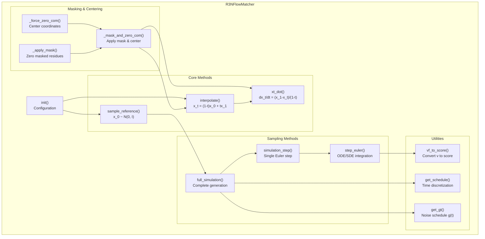
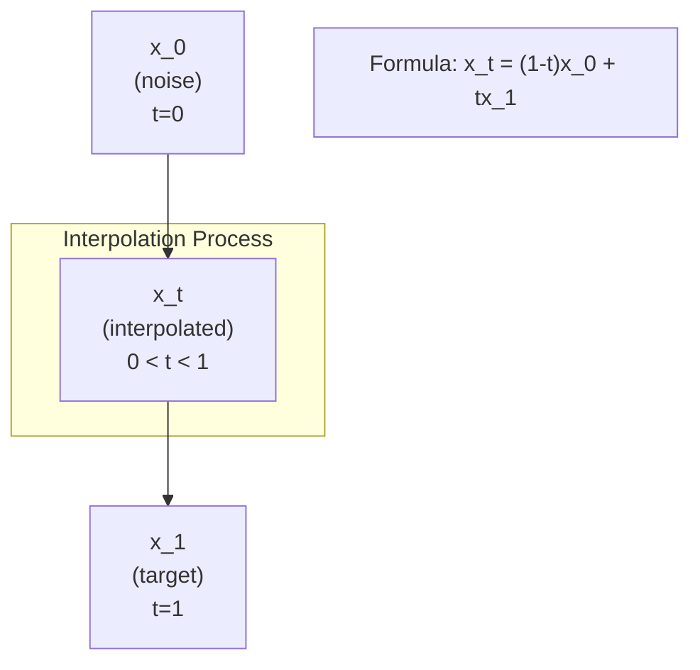
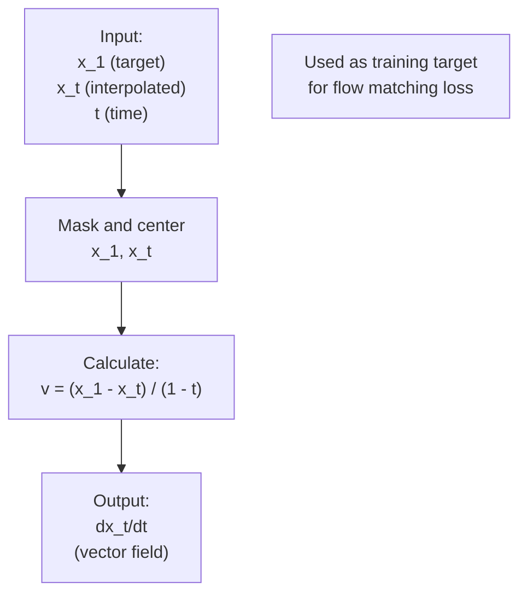
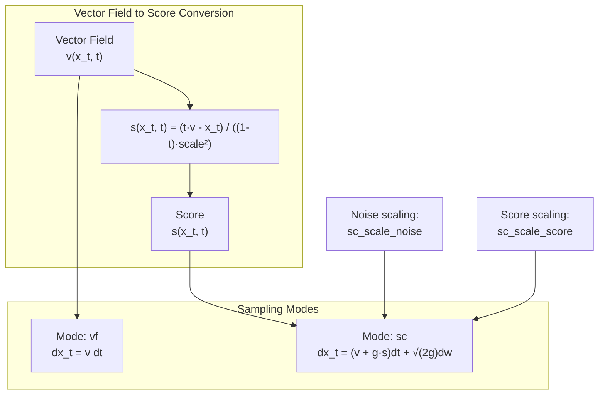
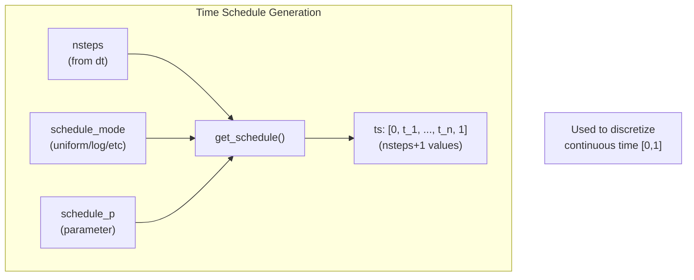
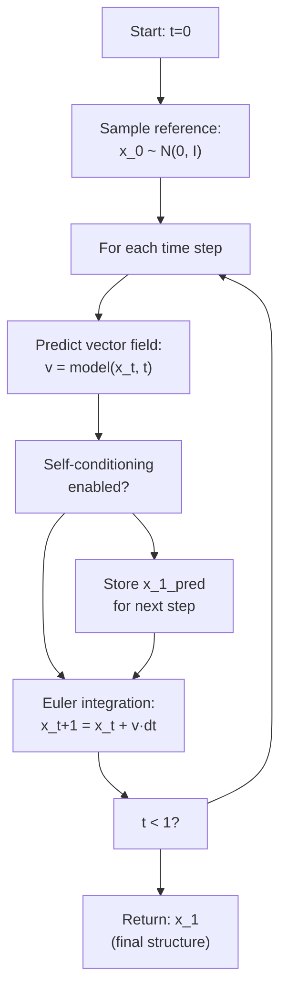
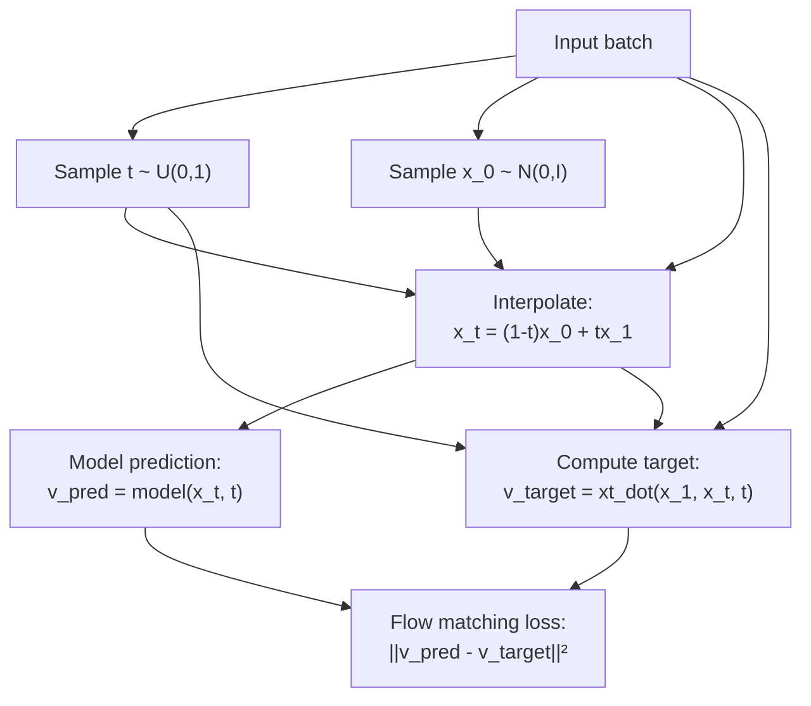
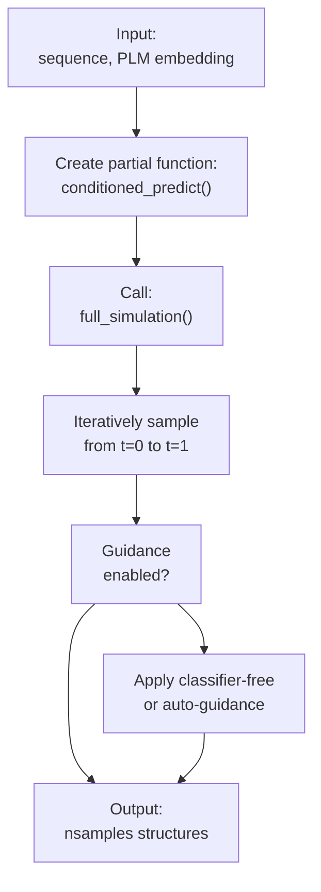
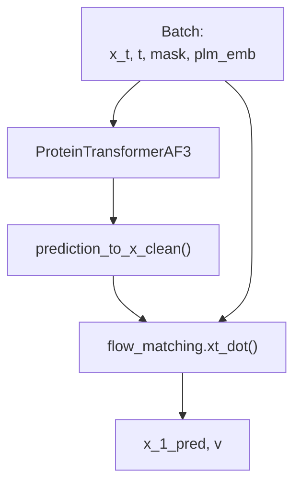

# Flow Matching Framework

> **Relevant source files**
> * [src/data/dataset.py](https://github.com/Junjie-Zhu/IDPFold2/blob/5315b279/src/data/dataset.py)
> * [src/model/components/feature_factory.py](https://github.com/Junjie-Zhu/IDPFold2/blob/5315b279/src/model/components/feature_factory.py)
> * [src/model/flow_matching/r3flow.py](https://github.com/Junjie-Zhu/IDPFold2/blob/5315b279/src/model/flow_matching/r3flow.py)
> * [src/model/integral.py](https://github.com/Junjie-Zhu/IDPFold2/blob/5315b279/src/model/integral.py)

## Purpose and Scope

This document describes the flow matching framework used in IDPFold2 to learn and sample from the distribution of protein conformations. Flow matching is the core generative modeling technique that enables the model to transform random noise into realistic protein structures through a continuous interpolation process.

For the transformer model that predicts vector fields during flow matching, see [ProteinTransformerAF3](/Junjie-Zhu/IDPFold2/5.1-proteintransformeraf3). For how flow matching is used during training, see [Training Predict Function](/Junjie-Zhu/IDPFold2/6.2-training-predict-function). For how flow matching generates structures during inference, see [Generating Predict Function](/Junjie-Zhu/IDPFold2/7.2-generating-predict-function).

**Sources:** [src/model/flow_matching/r3flow.py L1-L666](https://github.com/Junjie-Zhu/IDPFold2/blob/5315b279/src/model/flow_matching/r3flow.py#L1-L666)

---

## Overview

The flow matching framework in IDPFold2 implements continuous normalizing flows on **(R³)ⁿ** where *n* is the number of residues. The implementation is centered around the `R3NFlowMatcher` class, which provides:

* **Interpolation** between reference noise and target structures
* **Vector field computation** for training objectives
* **ODE/SDE integration** for structure generation
* **Flexible scheduling** for controlling the generation process

The flow matching approach learns a time-dependent vector field **v(xₜ, t)** that describes how structures evolve from random noise (t=0) to realistic conformations (t=1).

**Sources:** [src/model/flow_matching/r3flow.py L22-L38](https://github.com/Junjie-Zhu/IDPFold2/blob/5315b279/src/model/flow_matching/r3flow.py#L22-L38)

---

## R3NFlowMatcher Class

### Class Architecture



**Diagram: R3NFlowMatcher method hierarchy and relationships**

The `R3NFlowMatcher` class is instantiated with two key parameters:

* `zero_com`: Whether to enforce zero center of mass (default: False)
* `scale_ref`: Scale of reference distribution (default: 1.0)

**Sources:** [src/model/flow_matching/r3flow.py L22-L38](https://github.com/Junjie-Zhu/IDPFold2/blob/5315b279/src/model/flow_matching/r3flow.py#L22-L38)

 [src/model/flow_matching/r3flow.py L39-L91](https://github.com/Junjie-Zhu/IDPFold2/blob/5315b279/src/model/flow_matching/r3flow.py#L39-L91)

---

## Interpolation Scheme

### Linear Interpolation

The core interpolation scheme uses a simple linear path between reference noise **x₀** and target structure **x₁**:

**xₜ = (1 - t)x₀ + tx₁**

where t ∈ [0, 1] is the interpolation time.



**Diagram: Linear interpolation between noise and target**

### Implementation

The interpolation is implemented in the `interpolate()` method:

| Parameter | Shape | Description |
| --- | --- | --- |
| `x_0` | `[*, n, 3]` | Reference sample (noise) |
| `x_1` | `[*, n, 3]` | Target sample (clean structure) |
| `t` | `[*]` | Interpolation times |
| `mask` | `[*, n]` | Binary mask for residues |
| **Returns** | `[*, n, 3]` | Interpolated structure **xₜ** |

The method ensures that both **x₀** and **x₁** are properly masked and centered (if `zero_com=True`) before interpolation.

**Sources:** [src/model/flow_matching/r3flow.py L106-L136](https://github.com/Junjie-Zhu/IDPFold2/blob/5315b279/src/model/flow_matching/r3flow.py#L106-L136)

---

## Vector Field Prediction

### Target Vector Field

During training, the model learns to predict the time derivative **dxₜ/dt**, which represents the instantaneous change in structure. For the linear interpolation scheme, this is given by:

**dxₜ/dt = (x₁ - xₜ) / (1 - t)**

This formula provides the training target that the neural network tries to match.

### xt_dot Method



**Diagram: Vector field computation for training**

The `xt_dot()` method computes this target vector field:

```markdown
# Conceptual usage (actual code in integral.py)v_target = flow_matching.xt_dot(x_1, x_t, t, mask)  # [*, n, 3]loss = ||v_pred - v_target||²
```

**Sources:** [src/model/flow_matching/r3flow.py L163-L194](https://github.com/Junjie-Zhu/IDPFold2/blob/5315b279/src/model/flow_matching/r3flow.py#L163-L194)

---

## Reference Distribution Sampling

The reference distribution is a standard Gaussian in **(R³)ⁿ**, optionally centered:

**x₀ ~ N(0, scale_ref² · I₃)ⁿ**

The `sample_reference()` method generates initial noise:

| Parameter | Type | Description |
| --- | --- | --- |
| `n` | int | Number of residues |
| `shape` | tuple | Batch shape (e.g., `(nsamples,)`) |
| `dtype` | torch.dtype | Data type |
| `device` | torch.device | Device (CPU/GPU) |
| `mask` | `[*, n]` | Residue mask |
| **Returns** | `[*shape, n, 3]` | Noise sample |

If `zero_com=True`, the noise is centered to have zero center of mass within the masked residues.

**Sources:** [src/model/flow_matching/r3flow.py L365-L398](https://github.com/Junjie-Zhu/IDPFold2/blob/5315b279/src/model/flow_matching/r3flow.py#L365-L398)

---

## Integration Schemes

### ODE vs SDE Sampling

IDPFold2 supports two sampling modes:

**Mode 1: Vector Field (vf)** - Pure ODE integration

```
dxₜ = v(xₜ, t) dt
```

**Mode 2: Score-based (sc)** - SDE with score correction

```
dxₜ = [v(xₜ, t) + g(t)·s(xₜ, t)] dt + √(2g(t))·dwₜ
```

where:

* **v(xₜ, t)** is the learned vector field
* **s(xₜ, t)** is the score function (gradient of log density)
* **g(t)** is a time-dependent noise schedule
* **dwₜ** is Brownian motion



**Diagram: Integration modes and score-based sampling**

### Euler Integration

The `step_euler()` method implements a single Euler integration step:

| Parameter | Shape | Description |
| --- | --- | --- |
| `x_t` | `[*, n, 3]` | Current structure |
| `v` | `[*, n, 3]` | Predicted vector field |
| `t` | `[*, n]` | Current time |
| `dt` | float | Step size |
| `gt` | float | Noise schedule value |
| `sampling_mode` | str | `"vf"` or `"sc"` |
| `sc_scale_noise` | float | Noise scaling factor |
| `sc_scale_score` | float | Score scaling factor |
| **Returns** | `[*, n, 3]`, `[*, n]` | Updated x, updated t |

**Sources:** [src/model/flow_matching/r3flow.py L251-L333](https://github.com/Junjie-Zhu/IDPFold2/blob/5315b279/src/model/flow_matching/r3flow.py#L251-L333)

 [src/model/flow_matching/r3flow.py L335-L363](https://github.com/Junjie-Zhu/IDPFold2/blob/5315b279/src/model/flow_matching/r3flow.py#L335-L363)

---

## Time Scheduling

### Schedule Modes

The `get_schedule()` method supports multiple discretization strategies for the time interval [0, 1]:

| Mode | Formula | Use Case |
| --- | --- | --- |
| `uniform` | Linearly spaced | Simple baseline |
| `power` | `t^p` with parameter p | Controllable density |
| `log` | `1 - logspace(-p, 0)` | More steps near t=0 |
| `cos_sch_v_snr` | Cosine schedule via SNR | Stable generation |
| `loglinear` | Linear in SNR space | Balanced coverage |
| `edm` | EDM schedule | State-of-the-art |



**Diagram: Time schedule generation process**

### Noise Schedule g(t)

The `get_gt()` method computes the noise schedule for SDE sampling:

**Mode: "us" (uniform schedule)**

```
g(t) = (1-t) / t
```

**Mode: "tan" (tangent schedule)**

```
g(t) = (π/2) · sin((1-t)π/2) / cos((1-t)π/2)
```

Both modes support:

* Transformation via parameter `gt_p`
* Clamping with `gt_clamp_val` to prevent instability

**Sources:** [src/model/flow_matching/r3flow.py L551-L610](https://github.com/Junjie-Zhu/IDPFold2/blob/5315b279/src/model/flow_matching/r3flow.py#L551-L610)

 [src/model/flow_matching/r3flow.py L612-L666](https://github.com/Junjie-Zhu/IDPFold2/blob/5315b279/src/model/flow_matching/r3flow.py#L612-L666)

---

## Full Simulation

### Generation Pipeline

The `full_simulation()` method orchestrates the complete structure generation process:



**Diagram: Full simulation flow for structure generation**

### Method Signature

```javascript
def full_simulation(    self,    predict_clean_n_v: Callable,      # Model prediction function    dt: float,                         # Integration step size    nsamples: int,                     # Number of structures to generate    n: int,                            # Protein length    self_cond: bool,                   # Enable self-conditioning    plm_embedding: torch.Tensor,       # Sequence embeddings    residue_type: torch.Tensor,        # Residue types    residue_idx: torch.Tensor,         # Residue indices    chains: torch.Tensor,              # Chain identifiers    device: torch.device,              # Computation device    mask: Tensor,                      # Residue mask [nsamples, n]    schedule_mode: str,                # Time discretization mode    schedule_p: float,                 # Schedule parameter    sampling_mode: str,                # "vf" or "sc"    sc_scale_noise: float,             # Noise temperature    sc_scale_score: float,             # Score scaling    gt_mode: str,                      # Noise schedule mode    gt_p: float,                       # Noise schedule parameter    gt_clamp_val: float,               # Noise schedule clamp    ...) -> Tensor:  # Returns [nsamples, n, 3]
```

### Key Features

1. **Flexible Scheduling**: Supports multiple time discretization strategies via `schedule_mode`
2. **Self-Conditioning**: Optional iterative refinement using previous predictions
3. **Batch Generation**: Generates multiple structures in parallel
4. **Mask Awareness**: Properly handles variable-length proteins
5. **Adaptive Sampling**: Switches to deterministic mode (`"vf"`) near t=1 for stability

**Sources:** [src/model/flow_matching/r3flow.py L400-L549](https://github.com/Junjie-Zhu/IDPFold2/blob/5315b279/src/model/flow_matching/r3flow.py#L400-L549)

---

## Integration with Training and Inference

### Training Usage

During training, the flow matching framework is used via `training_predict()`:



**Diagram: Flow matching in training pipeline**

The training process:

1. Extracts clean structure **x₁** from batch
2. Samples time **t** and reference noise **x₀**
3. Computes interpolated structure **xₜ**
4. Predicts vector field **v** using model
5. Computes target vector field using `xt_dot()`
6. Calculates MSE loss weighted by **1/(1-t)²**

**Sources:** [src/model/integral.py L238-L320](https://github.com/Junjie-Zhu/IDPFold2/blob/5315b279/src/model/integral.py#L238-L320)

### Inference Usage

During inference, the flow matching framework generates structures via `generating_predict()`:



**Diagram: Flow matching in inference pipeline**

Key parameters controlled by `inference.yaml`:

* `dt`: Step size (e.g., 0.01 → 100 steps)
* `schedule_args.schedule_mode`: Time discretization (`"log"`, `"uniform"`, etc.)
* `schedule_args.schedule_p`: Schedule parameter
* `sampling_args.sampling_mode`: `"vf"` (ODE) or `"sc"` (SDE)
* `sampling_args.sc_scale_noise`: Temperature for stochastic sampling
* `gt_mode`, `gt_p`, `gt_clamp_val`: Control noise schedule

**Sources:** [src/model/integral.py L323-L401](https://github.com/Junjie-Zhu/IDPFold2/blob/5315b279/src/model/integral.py#L323-L401)

---

## Masking and Center of Mass

### Masking Operations

The flow matcher provides three masking utilities:

| Method | Purpose | Input/Output |
| --- | --- | --- |
| `_apply_mask()` | Zero out masked residues | `x * mask[..., None]` |
| `_force_zero_com()` | Center coordinates | `x - mean(x)` |
| `_mask_and_zero_com()` | Combined operation | Apply mask, then center if `zero_com=True` |

These operations ensure that:

1. Padding residues don't contribute to computations
2. Structures are translation-invariant (if `zero_com=True`)
3. Generated structures satisfy the same constraints as training data

### Center of Mass Centering

When `zero_com=True`, all structures are centered to have zero mean position over the masked residues. This enforces translation invariance:

```
x_centered = x - (Σᵢ xᵢ·maskᵢ) / (Σᵢ maskᵢ)
```

This is applied throughout:

* Reference sampling: `sample_reference()`
* Interpolation: `interpolate()`
* Vector field computation: `xt_dot()`
* Integration steps: `simulation_step()`

**Sources:** [src/model/flow_matching/r3flow.py L39-L91](https://github.com/Junjie-Zhu/IDPFold2/blob/5315b279/src/model/flow_matching/r3flow.py#L39-L91)

---

## Connection to Model Predictions

### Integration Point

The flow matcher expects a prediction function that takes a batch dictionary and returns:

* **x_1_pred**: Predicted clean structure `[*, n, 3]`
* **v**: Predicted vector field `[*, n, 3]`

This is provided by `conditioned_predict()` which wraps the model:



**Diagram: Model integration with flow matching**

The model outputs are converted based on `target_pred`:

* If `target_pred="x_1"`: Model directly predicts clean structure
* If `target_pred="v"`: Model predicts velocity, converted to clean structure

**Sources:** [src/model/integral.py L25-L38](https://github.com/Junjie-Zhu/IDPFold2/blob/5315b279/src/model/integral.py#L25-L38)

 [src/model/integral.py L41-L90](https://github.com/Junjie-Zhu/IDPFold2/blob/5315b279/src/model/integral.py#L41-L90)

---

## Summary

The `R3NFlowMatcher` class provides a complete flow matching implementation for protein structure generation:

| Component | Purpose | Key Methods |
| --- | --- | --- |
| **Interpolation** | Connect noise to data | `interpolate()`, `sample_reference()` |
| **Training** | Compute targets | `xt_dot()`, `interpolate()` |
| **Sampling** | Generate structures | `full_simulation()`, `simulation_step()` |
| **Scheduling** | Control generation | `get_schedule()`, `get_gt()` |
| **Utilities** | Masking & centering | `_mask_and_zero_com()` |

This framework enables IDPFold2 to learn the distribution of protein conformations and generate diverse, realistic structural ensembles during inference.

**Sources:** [src/model/flow_matching/r3flow.py L1-L666](https://github.com/Junjie-Zhu/IDPFold2/blob/5315b279/src/model/flow_matching/r3flow.py#L1-L666)