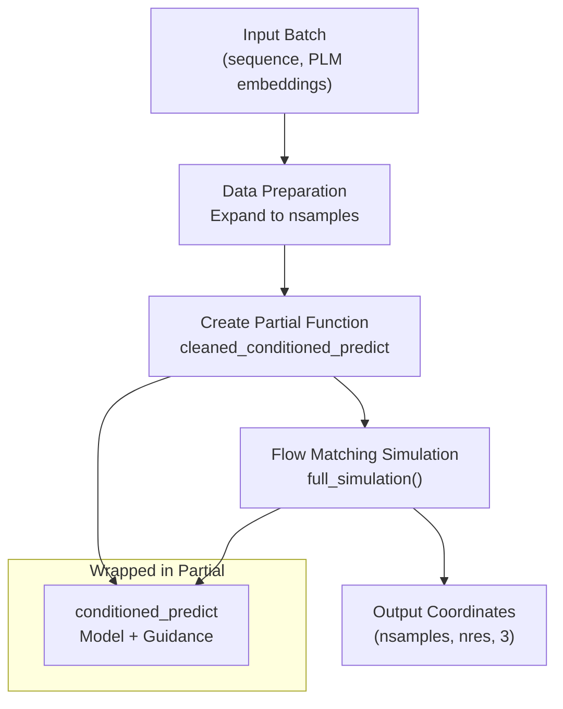
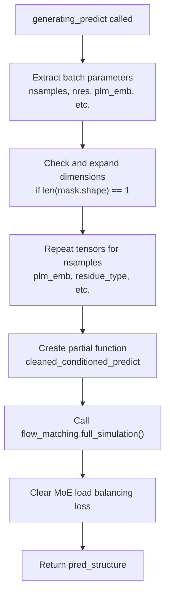
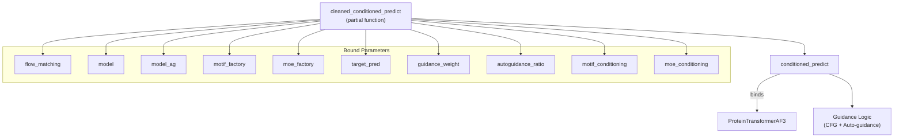
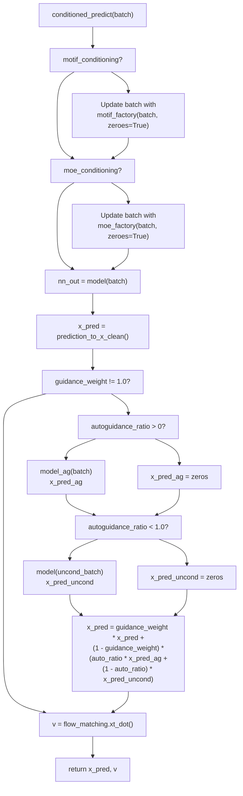
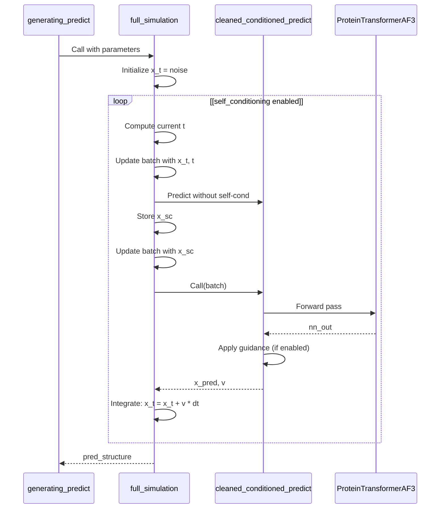
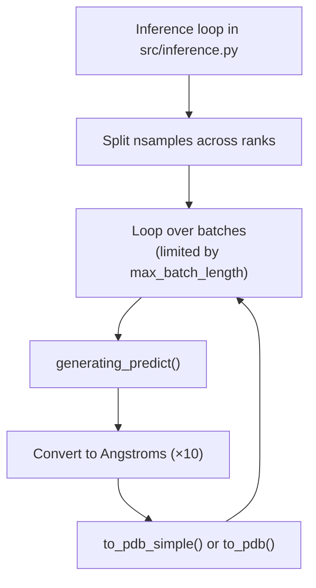

# Generating Predict Function

> **Relevant source files**
> * [configs/inference.yaml](https://github.com/Junjie-Zhu/IDPFold2/blob/5315b279/configs/inference.yaml)
> * [src/inference.py](https://github.com/Junjie-Zhu/IDPFold2/blob/5315b279/src/inference.py)
> * [src/model/components/feature_factory.py](https://github.com/Junjie-Zhu/IDPFold2/blob/5315b279/src/model/components/feature_factory.py)
> * [src/model/integral.py](https://github.com/Junjie-Zhu/IDPFold2/blob/5315b279/src/model/integral.py)
> * [src/utils/pdb_utils.py](https://github.com/Junjie-Zhu/IDPFold2/blob/5315b279/src/utils/pdb_utils.py)

## Purpose and Scope

This page documents the `generating_predict` function, which serves as the primary entry point for structure generation during inference in IDPFold2. This function orchestrates the iterative sampling process that transforms random noise into protein conformational ensembles using flow matching.

For information about the overall inference pipeline and how this function is invoked, see [Inference Pipeline](/Junjie-Zhu/IDPFold2/7.1-inference-pipeline). For details on the guidance mechanisms used during generation, see [Guidance Mechanisms](/Junjie-Zhu/IDPFold2/7.3-guidance-mechanisms). For sampling strategy configuration, see [Sampling Strategies](/Junjie-Zhu/IDPFold2/7.4-sampling-strategies).

**Sources:** [src/model/integral.py L323-L401](https://github.com/Junjie-Zhu/IDPFold2/blob/5315b279/src/model/integral.py#L323-L401)

 [src/inference.py L281-L295](https://github.com/Junjie-Zhu/IDPFold2/blob/5315b279/src/inference.py#L281-L295)

---

## Overview

The `generating_predict` function is defined in `src/model/integral.py` and implements the core iterative generation loop for protein structure prediction. Unlike `training_predict` (see [Training Predict Function](/Junjie-Zhu/IDPFold2/6.2-training-predict-function)) which computes flow matching loss, `generating_predict` performs forward simulation through the flow matching ODE/SDE to generate structures from noise.

The function acts as a high-level orchestrator that:

1. Prepares batch data for multiple samples
2. Wraps the model prediction function with conditioning logic
3. Delegates to the flow matcher's `full_simulation` method for iterative sampling
4. Returns generated coordinates in nanometer scale



**Diagram: High-level flow of generating_predict function**

**Sources:** [src/model/integral.py L323-L401](https://github.com/Junjie-Zhu/IDPFold2/blob/5315b279/src/model/integral.py#L323-L401)

---

## Function Signature and Parameters

The `generating_predict` function has the following signature:

```python
def generating_predict(    batch,    flow_matching: Callable,    model: nn.Module,    model_ag: Optional[nn.Module] = None,    motif_factory: Optional[nn.Module] = None,    moe_factory: Optional[nn.Module] = None,    target_pred: str = 'x_1',    guidance_weight = 1.0,    autoguidance_ratio = 0.0,    schedule_args: dict = None,    sampling_args: dict = None,    motif_conditioning = False,    moe_conditioning = False,    self_conditioning = False,    device = 'cpu'):
```

### Parameter Reference Table

| Parameter | Type | Default | Description |
| --- | --- | --- | --- |
| `batch` | `dict` | Required | Input batch containing `nsamples`, `nres`, `plm_emb`, `residue_type`, optional `mask`, `residue_idx`, `chains` |
| `flow_matching` | `Callable` | Required | Instance of `R3NFlowMatcher` that performs ODE/SDE integration |
| `model` | `nn.Module` | Required | Main `ProteinTransformerAF3` model for structure prediction |
| `model_ag` | `Optional[nn.Module]` | `None` | Secondary model for auto-guidance (see [Guidance Mechanisms](/Junjie-Zhu/IDPFold2/7.3-guidance-mechanisms)) |
| `motif_factory` | `Optional[nn.Module]` | `None` | Factory for motif conditioning constraints |
| `moe_factory` | `Optional[nn.Module]` | `None` | Factory for MoE conditioning |
| `target_pred` | `str` | `'x_1'` | Prediction target: `'x_1'` (coordinates) or `'v'` (velocity field) |
| `guidance_weight` | `float` | `1.0` | Weight for classifier-free guidance (1.0 = no guidance) |
| `autoguidance_ratio` | `float` | `0.0` | Ratio between auto-guidance and CFG (0.0 = all CFG, 1.0 = all auto-guidance) |
| `schedule_args` | `dict` | `None` | Scheduling parameters: `schedule_mode` ('log', 'cosine'), `schedule_p` |
| `sampling_args` | `dict` | `None` | Sampling parameters: `sampling_mode` ('vf', 'sc'), noise/score scales, gt parameters |
| `motif_conditioning` | `bool` | `False` | Whether to apply motif conditioning |
| `moe_conditioning` | `bool` | `False` | Whether to apply MoE conditioning |
| `self_conditioning` | `bool` | `False` | Whether to use self-conditioning during sampling |
| `device` | `str` | `'cpu'` | Device for computation ('cpu' or 'cuda:X') |

**Sources:** [src/model/integral.py L323-L338](https://github.com/Junjie-Zhu/IDPFold2/blob/5315b279/src/model/integral.py#L323-L338)

 [configs/inference.yaml L1-L103](https://github.com/Junjie-Zhu/IDPFold2/blob/5315b279/configs/inference.yaml#L1-L103)

---

## Execution Flow

The `generating_predict` function follows a structured execution flow:



**Diagram: Execution flow of generating_predict**

### Phase 1: Data Preparation (Lines 354-372)

The function begins by extracting and preparing batch data:

1. **Extract batch parameters** [src/model/integral.py L354-L360](https://github.com/Junjie-Zhu/IDPFold2/blob/5315b279/src/model/integral.py#L354-L360) : * `nsamples`: Number of structures to generate * `nres`: Number of residues * `plm_embedding`: Protein language model embeddings * `residue_type`: Amino acid type indices * `mask`: Residue validity mask (defaults to all True) * `residue_idx`: Residue indices (defaults to sequential) * `chains`: Chain identifiers (defaults to single chain)
2. **Dimension expansion** [src/model/integral.py L362-L367](https://github.com/Junjie-Zhu/IDPFold2/blob/5315b279/src/model/integral.py#L362-L367) : * If inputs are 1D, unsqueeze and expand to batch dimension * This handles single-sequence inputs
3. **Replication for multiple samples** [src/model/integral.py L369-L372](https://github.com/Junjie-Zhu/IDPFold2/blob/5315b279/src/model/integral.py#L369-L372) : * All tensors are repeated `nsamples` times to generate multiple conformations

**Sources:** [src/model/integral.py L354-L372](https://github.com/Junjie-Zhu/IDPFold2/blob/5315b279/src/model/integral.py#L354-L372)

---

## Conditioned Prediction Wrapper

The core of `generating_predict` is the creation of a partial function that wraps `conditioned_predict`:



**Diagram: Structure of the cleaned_conditioned_predict partial function**

### Creating the Partial Function

The partial function is created at [src/model/integral.py L340-L352](https://github.com/Junjie-Zhu/IDPFold2/blob/5315b279/src/model/integral.py#L340-L352)

:

```
cleaned_conditioned_predict = partial(    conditioned_predict,    flow_matching=flow_matching,    model=model,    model_ag=model_ag,    motif_factory=motif_factory,    moe_factory=moe_factory,    target_pred=target_pred,    guidance_weight=guidance_weight,    autoguidance_ratio=autoguidance_ratio,    motif_conditioning=motif_conditioning,    moe_conditioning=moe_conditioning,)
```

This creates a simplified function that only requires the `batch` parameter, with all configuration pre-bound.

**Sources:** [src/model/integral.py L340-L352](https://github.com/Junjie-Zhu/IDPFold2/blob/5315b279/src/model/integral.py#L340-L352)

---

## Conditioned Predict Function Details

The `conditioned_predict` function [src/model/integral.py L41-L90](https://github.com/Junjie-Zhu/IDPFold2/blob/5315b279/src/model/integral.py#L41-L90)

 is called iteratively during sampling and implements the core model prediction with optional guidance:



**Diagram: Control flow of conditioned_predict function**

### Prediction Target Conversion

The `prediction_to_x_clean` function [src/model/integral.py L25-L38](https://github.com/Junjie-Zhu/IDPFold2/blob/5315b279/src/model/integral.py#L25-L38)

 converts model outputs to clean coordinates:

| `target_pred` | Conversion Formula | Description |
| --- | --- | --- |
| `'x_1'` | `x_1_pred = nn_pred` | Direct coordinate prediction |
| `'v'` | `x_1_pred = x_t + (1.0 - t) * nn_pred` | Velocity field prediction (integrated to coordinates) |

The velocity field formulation is typically used during inference as specified in [configs/inference.yaml L12](https://github.com/Junjie-Zhu/IDPFold2/blob/5315b279/configs/inference.yaml#L12-L12)

**Sources:** [src/model/integral.py L25-L90](https://github.com/Junjie-Zhu/IDPFold2/blob/5315b279/src/model/integral.py#L25-L90)

---

## Flow Matching Integration

After preparing the wrapped prediction function, `generating_predict` delegates to the flow matcher's `full_simulation` method:

```mermaid
flowchart TD

CALL["flow_matching.full_simulation()"]
FUNC["cleaned_conditioned_predict"]
DT["dt: timestep size"]
NS["nsamples: batch size"]
N["n: number of residues"]
SC["self_cond: enable/disable"]
PLM["plm_embedding"]
RT["residue_type"]
RI["residue_idx"]
CHAINS["chains"]
DEV["device"]
MASK["mask"]
DTYPE["dtype"]
SCHED["schedule_mode, schedule_p"]
SAMP["sampling_mode"]
SC_PARAMS["sc_scale_noise, sc_scale_score"]
GT_PARAMS["gt_mode, gt_p, gt_clamp_val"]
XMOTIF["x_motif = None"]
FSM["fixed_sequence_mask = None"]
FSTM["fixed_structure_mask = None"]
OUTPUT["pred_structure<br>(nsamples, nres, 3)"]

FUNC --> CALL
DT --> CALL
NS --> CALL
N --> CALL
SC --> CALL
PLM --> CALL
RT --> CALL
RI --> CALL
CHAINS --> CALL
DEV --> CALL
MASK --> CALL
DTYPE --> CALL
SCHED --> CALL
SAMP --> CALL
SC_PARAMS --> CALL
GT_PARAMS --> CALL
XMOTIF --> CALL
FSM --> CALL
FSTM --> CALL
CALL --> OUTPUT

subgraph subGraph1 ["Optional (Not Implemented)"]
    XMOTIF
    FSM
    FSTM
end

subgraph subGraph0 ["Input Parameters"]
    FUNC
    DT
    NS
    N
    SC
    PLM
    RT
    RI
    CHAINS
    DEV
    MASK
    DTYPE
    SCHED
    SAMP
    SC_PARAMS
    GT_PARAMS
end
```



**Diagram: Parameters passed to flow_matching.full_simulation()**

### Full Simulation Call

The call to `full_simulation` occurs at [src/model/integral.py L374-L398](https://github.com/Junjie-Zhu/IDPFold2/blob/5315b279/src/model/integral.py#L374-L398)

:

```
pred_structure = flow_matching.full_simulation(    cleaned_conditioned_predict,    dt=batch["dt"].to(dtype=torch.float32),    nsamples=nsamples,    n=nres,    self_cond=self_conditioning,    plm_embedding=plm_embedding,    residue_type=residue_type,    residue_idx=residue_idx,    chains=chains,    device=device,    mask=mask,    dtype=torch.float32,    schedule_mode=schedule_args.get('schedule_mode', 'log'),    schedule_p=schedule_args.get('schedule_p', 2.0),    sampling_mode=sampling_args["sampling_mode"],    sc_scale_noise=sampling_args["sc_scale_noise"],    sc_scale_score=sampling_args["sc_scale_score"],    gt_mode=sampling_args["gt_mode"],    gt_p=sampling_args["gt_p"],    gt_clamp_val=sampling_args["gt_clamp_val"],    x_motif=None,    fixed_sequence_mask=None,    fixed_structure_mask=None,)
```

### Key Parameters for Flow Matching

| Parameter Group | Parameters | Source | Description |
| --- | --- | --- | --- |
| **Scheduling** | `schedule_mode`, `schedule_p` | `schedule_args` | Controls time discretization (see [Sampling Strategies](/Junjie-Zhu/IDPFold2/7.4-sampling-strategies)) |
| **Sampling** | `sampling_mode` | `sampling_args` | 'vf' for vector field or 'sc' for score-based |
| **Score Conditioning** | `sc_scale_noise`, `sc_scale_score` | `sampling_args` | Noise and score scaling for score-based sampling |
| **Guidance Transform** | `gt_mode`, `gt_p`, `gt_clamp_val` | `sampling_args` | Guidance transformation parameters |
| **Self-Conditioning** | `self_cond` | Function parameter | Whether to use previous predictions |

**Sources:** [src/model/integral.py L374-L398](https://github.com/Junjie-Zhu/IDPFold2/blob/5315b279/src/model/integral.py#L374-L398)

 [configs/inference.yaml L32-L42](https://github.com/Junjie-Zhu/IDPFold2/blob/5315b279/configs/inference.yaml#L32-L42)

---

## Iterative Sampling Process

While `full_simulation` is implemented in the flow matcher (see [Flow Matching Framework](/Junjie-Zhu/IDPFold2/5.3-flow-matching-framework)), understanding its role is crucial to `generating_predict`:



**Diagram: Sequence of operations during iterative sampling**

The flow matcher performs:

1. **Initialization**: Samples initial noise `x_0` from reference distribution
2. **Time discretization**: Creates timesteps according to `schedule_mode`
3. **Iterative integration**: For each timestep, calls `cleaned_conditioned_predict` and updates coordinates
4. **Optional self-conditioning**: Uses previous predictions to improve current predictions

**Sources:** [src/model/integral.py L374-L398](https://github.com/Junjie-Zhu/IDPFold2/blob/5315b279/src/model/integral.py#L374-L398)

 [src/model/flow_matching/r3flow.py](https://github.com/Junjie-Zhu/IDPFold2/blob/5315b279/src/model/flow_matching/r3flow.py)

---

## Output and Cleanup

After `full_simulation` completes, `generating_predict` performs final cleanup:

### MoE Load Balancing Cleanup

```
moe_modules.clear_load_balancing_loss()return pred_structure
```

At [src/model/integral.py L400-L401](https://github.com/Junjie-Zhu/IDPFold2/blob/5315b279/src/model/integral.py#L400-L401)

 the function clears any accumulated MoE load balancing loss. This is important because:

* During inference, MoE routers may accumulate statistics
* These need to be cleared between generation calls
* This prevents memory leaks and stale statistics

### Return Value

The function returns `pred_structure` with shape `(nsamples, nres, 3)`:

* **Dimensions**: `(nsamples, nres, 3)` where: * `nsamples`: Number of generated structures * `nres`: Number of residues * `3`: x, y, z coordinates
* **Units**: Nanometers (nm)
* **Coordinate system**: Center of mass is at origin (0, 0, 0)
* **Format**: PyTorch tensor on the specified device

The output coordinates must be converted to Angstroms (×10) before writing to PDB files, as done in [src/inference.py L299-L311](https://github.com/Junjie-Zhu/IDPFold2/blob/5315b279/src/inference.py#L299-L311)

**Sources:** [src/model/integral.py L400-L401](https://github.com/Junjie-Zhu/IDPFold2/blob/5315b279/src/model/integral.py#L400-L401)

 [src/inference.py L296-L311](https://github.com/Junjie-Zhu/IDPFold2/blob/5315b279/src/inference.py#L296-L311)

---

## Usage in Inference Pipeline

The `generating_predict` function is called from the main inference script:



**Diagram: generating_predict in the inference pipeline context**

### Invocation Example

From [src/inference.py L281-L295](https://github.com/Junjie-Zhu/IDPFold2/blob/5315b279/src/inference.py#L281-L295)

:

```
pred_structure = generating_predict(    batch=inference_dict,    flow_matching=flow_matching,    model=model,    model_ag=model_ag if args.autoguidance_ratio > 0.0 and args.ag_dir is not None else None,    motif_factory=motif_factory if args.motif_conditioning else None,    target_pred=args.target_pred,    guidance_weight=args.guidance_weight,    autoguidance_ratio=args.autoguidance_ratio,    schedule_args=args.schedule,    sampling_args=args.sampling,    motif_conditioning=args.motif_conditioning,    self_conditioning=args.self_conditioning,    device=device,)
```

The inference loop:

1. Loads checkpoint and instantiates models
2. Splits samples across distributed ranks
3. Further splits into batches based on `max_batch_length` (GPU memory limit)
4. Calls `generating_predict` for each batch
5. Converts coordinates to Angstroms
6. Saves to PDB files

**Sources:** [src/inference.py L258-L343](https://github.com/Junjie-Zhu/IDPFold2/blob/5315b279/src/inference.py#L258-L343)

---

## Configuration Reference

The behavior of `generating_predict` is controlled by inference configuration:

### Core Generation Parameters

| Config Path | Type | Default | Description |
| --- | --- | --- | --- |
| `inference.dt` | `float` | `0.005` | Timestep size for ODE integration |
| `inference.nsamples` | `int` | `100` | Total number of structures to generate |
| `inference.target_pred` | `str` | `'v'` | Prediction target ('x_1' or 'v') |
| `inference.self_conditioning` | `bool` | `False` | Enable self-conditioning |

### Guidance Parameters

| Config Path | Type | Default | Description |
| --- | --- | --- | --- |
| `inference.guidance_weight` | `float` | `1.0` | Classifier-free guidance weight |
| `inference.autoguidance_ratio` | `float` | `0.0` | Auto-guidance vs CFG ratio |
| `inference.ag_dir` | `str` | `null` | Path to auto-guidance checkpoint |

### Sampling Parameters

| Config Path | Type | Default | Description |
| --- | --- | --- | --- |
| `inference.sampling.sampling_mode` | `str` | `'vf'` | 'vf' (vector field) or 'sc' (score) |
| `inference.sampling.sc_scale_noise` | `float` | `0.0` | Noise scale for score-based |
| `inference.sampling.sc_scale_score` | `float` | `1.0` | Score scale for score-based |
| `inference.sampling.gt_mode` | `str` | `'1/t'` | Guidance transform: 'us', 'tan', or '1/t' |
| `inference.sampling.gt_p` | `float` | `1.0` | Guidance transform parameter |
| `inference.sampling.gt_clamp_val` | `float` | `null` | Guidance transform clamping |

### Schedule Parameters

| Config Path | Type | Default | Description |
| --- | --- | --- | --- |
| `inference.schedule.schedule_mode` | `str` | `'log'` | Time discretization: 'log' or 'cosine' |
| `inference.schedule.schedule_p` | `float` | `2.0` | Schedule parameter |

**Sources:** [configs/inference.yaml L8-L46](https://github.com/Junjie-Zhu/IDPFold2/blob/5315b279/configs/inference.yaml#L8-L46)

---

## Comparison with Training Predict

The key differences between `generating_predict` and `training_predict`:

| Aspect | `generating_predict` | `training_predict` |
| --- | --- | --- |
| **Purpose** | Generate structures from noise | Compute training loss |
| **Input** | Sequence + PLM embeddings | Ground truth structure + noise |
| **Output** | Predicted coordinates (nm) | Loss value + loss dict |
| **Time sampling** | Discretized schedule (dt steps) | Random sampling from distribution |
| **Guidance** | Supports CFG + auto-guidance | Not applicable |
| **Self-conditioning** | Optional, using previous predictions | Optional, with 50% probability |
| **MoE capacity** | `force_moe_capacity=False` | `force_moe_capacity=True` |
| **Flow matching** | Calls `full_simulation()` | Calls `interpolate()` once |
| **Batch size** | Multiple samples per sequence | Multiple sequences per batch |

**Sources:** [src/model/integral.py L238-L321](https://github.com/Junjie-Zhu/IDPFold2/blob/5315b279/src/model/integral.py#L238-L321)

 [src/model/integral.py L323-L401](https://github.com/Junjie-Zhu/IDPFold2/blob/5315b279/src/model/integral.py#L323-L401)

---

## Summary

The `generating_predict` function implements the core generation logic for IDPFold2 inference:

1. **Prepares data** by extracting and expanding batch parameters for multiple samples
2. **Creates a partial function** that wraps `conditioned_predict` with all configuration
3. **Delegates to flow matching** via `full_simulation()` for iterative ODE/SDE integration
4. **Returns coordinates** in nanometer scale for conversion to PDB

The function acts as a bridge between the high-level inference pipeline and the low-level flow matching simulation, handling data preparation, model wrapping, and optional guidance mechanisms. It is designed to be called once per sequence (or small batch of sequences) and generates multiple conformations through repeated model evaluation during the simulation process.

**Sources:** [src/model/integral.py L323-L401](https://github.com/Junjie-Zhu/IDPFold2/blob/5315b279/src/model/integral.py#L323-L401)

 [src/inference.py L281-L295](https://github.com/Junjie-Zhu/IDPFold2/blob/5315b279/src/inference.py#L281-L295)