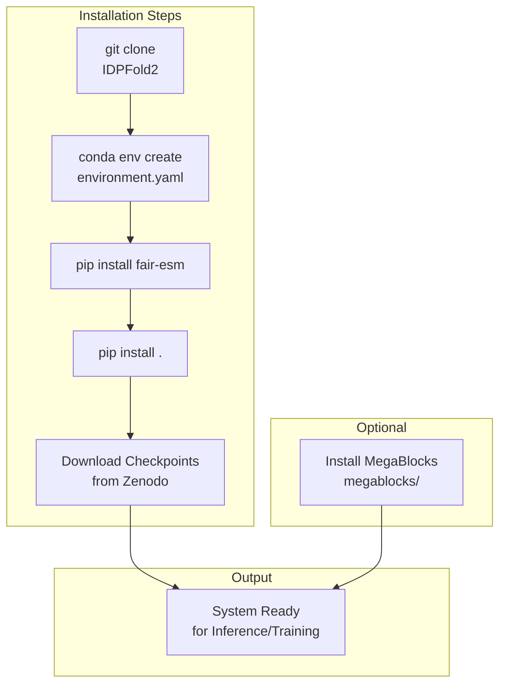
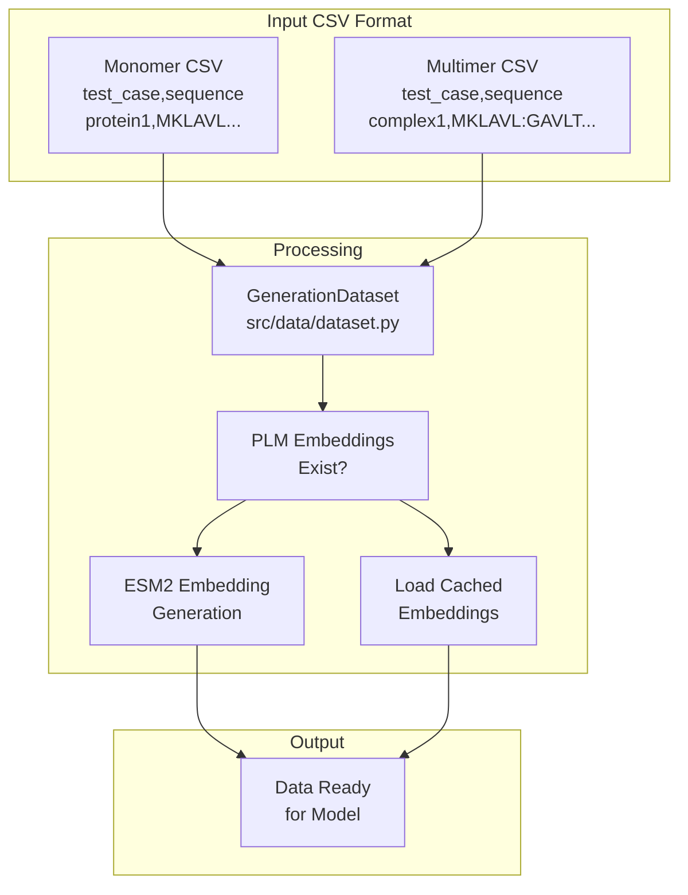
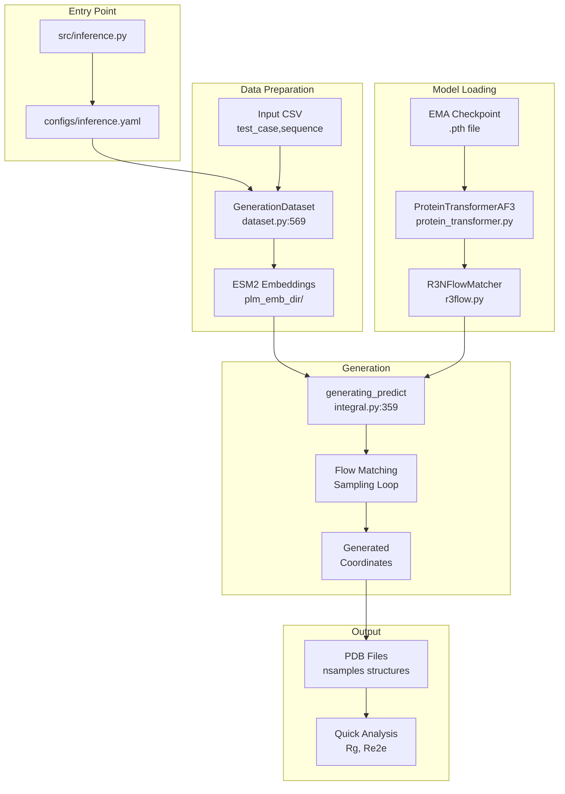
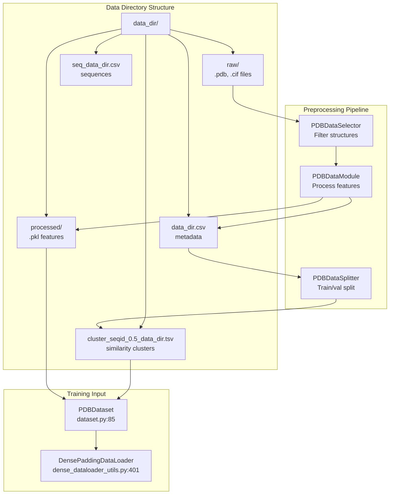
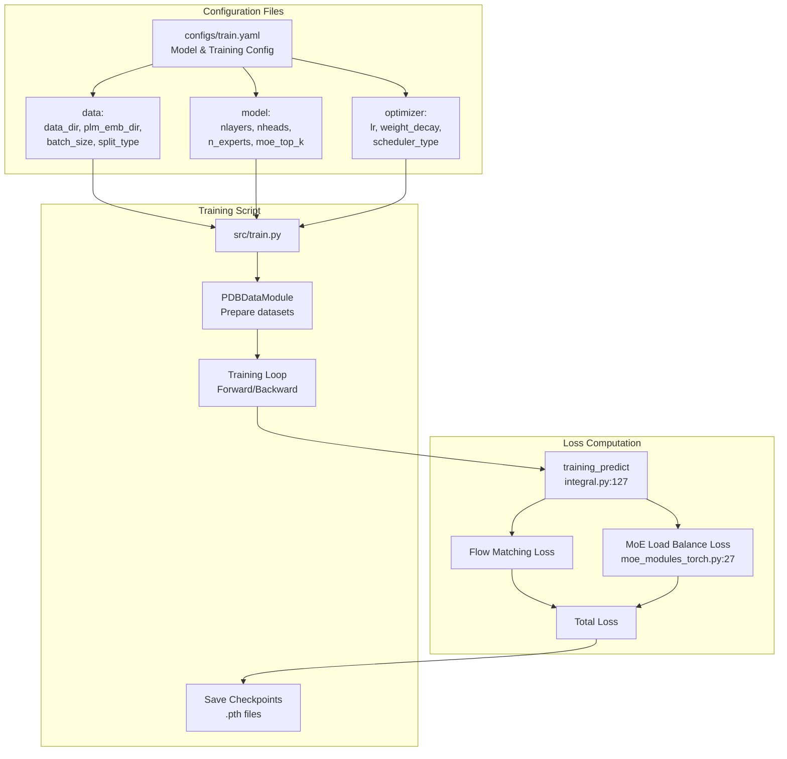
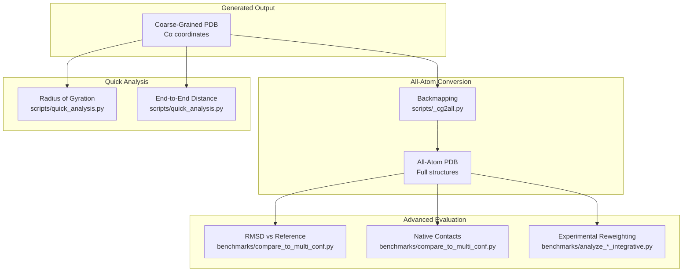

# Getting Started

> **Relevant source files**
> * [README.md](https://github.com/Junjie-Zhu/IDPFold2/blob/5315b279/README.md?plain=1)
> * [environment.yaml](https://github.com/Junjie-Zhu/IDPFold2/blob/5315b279/environment.yaml)
> * [src/model/components/moe_modules_torch.py](https://github.com/Junjie-Zhu/IDPFold2/blob/5315b279/src/model/components/moe_modules_torch.py)
> * [src/model/components/moe_operations.py](https://github.com/Junjie-Zhu/IDPFold2/blob/5315b279/src/model/components/moe_operations.py)
> * [src/utils/dense_dataloader_utils.py](https://github.com/Junjie-Zhu/IDPFold2/blob/5315b279/src/utils/dense_dataloader_utils.py)

This page provides practical instructions for setting up IDPFold2 and running your first inference or training job. It covers installation, basic usage patterns for generating protein conformational ensembles, and initial evaluation of results.

For detailed information about the underlying model architecture, see [Model Architecture](/Junjie-Zhu/IDPFold2/5-model-architecture). For comprehensive training configuration options, see [Training](/Junjie-Zhu/IDPFold2/6-training). For advanced inference features like guidance mechanisms, see [Inference](/Junjie-Zhu/IDPFold2/7-inference).

## Installation

### Prerequisites

IDPFold2 requires Python 3.11 and PyTorch 2.0+. The system uses PyTorch Geometric for graph-based protein representation and ESM2 for protein language model embeddings.



**Sources:** [README.md L34-L58](https://github.com/Junjie-Zhu/IDPFold2/blob/5315b279/README.md?plain=1#L34-L58)

 [environment.yaml L1-L29](https://github.com/Junjie-Zhu/IDPFold2/blob/5315b279/environment.yaml#L1-L29)

### Environment Setup

Create and activate the conda environment using the provided configuration:

```sql
git clone https://github.com/Junjie-Zhu/IDPFold2cd IDPFold2conda env create -f environment.ymlconda activate idpfold2
```

The `environment.yaml` file specifies all core dependencies including PyTorch 2.4.1, PyTorch Geometric 2.6.1, and MMseqs2 for sequence similarity clustering.

**Sources:** [environment.yaml L1-L29](https://github.com/Junjie-Zhu/IDPFold2/blob/5315b279/environment.yaml#L1-L29)

### Dependency Installation

Install the ESM2 protein language model and the IDPFold2 package:

```
pip install fair-esmpip install .
```

**Optional:** For accelerated Mixture of Experts computation (not required for inference):

```
cd megablockspip install .
```

Note: MegaBlocks may raise undefined symbol errors on some systems. The torch-based MoE implementation in [src/model/components/moe_modules_torch.py](https://github.com/Junjie-Zhu/IDPFold2/blob/5315b279/src/model/components/moe_modules_torch.py)

 is used by default and is functionally equivalent.

**Sources:** [README.md L42-L58](https://github.com/Junjie-Zhu/IDPFold2/blob/5315b279/README.md?plain=1#L42-L58)

 [src/model/components/moe_modules_torch.py L48-L107](https://github.com/Junjie-Zhu/IDPFold2/blob/5315b279/src/model/components/moe_modules_torch.py#L48-L107)

### Model Checkpoints

Download the pretrained weights from [Zenodo](https://zenodo.org/records/18239596):

| Checkpoint | Purpose | Required For |
| --- | --- | --- |
| `IDPFold2_ema_0.999_260114.pth` | EMA weights for inference | Inference only, or as EMA checkpoint for training |
| `IDPFold2_260114.pth` | Model weights for training | Training/fine-tuning only |

The EMA (Exponential Moving Average) checkpoint contains stabilized weights optimized for generation quality. For inference, only the EMA checkpoint is required. For training or fine-tuning, both checkpoints are needed.

**Sources:** [README.md L60-L63](https://github.com/Junjie-Zhu/IDPFold2/blob/5315b279/README.md?plain=1#L60-L63)

## Running Inference

### Input Data Format

Inference requires a CSV file with two columns: `test_case` (system name) and `sequence` (amino acid sequence). The system handles monomers and multimers differently based on the sequence format.



**Monomer format:** Single sequence per row

```
test_case,sequencealpha_synuclein,MDVFMKGLSKAKEGVVAAAEKTKQGVAEAAGKTKEGVLYVGSKTKEGVVHGVATVAEKTKEQVTNVGGAVVTGVTAVAQKTVEGAGSIAAATGFVKKDQLGKNEEGAPQEGILEDMPVDPDNEAYEMPSEEGYQDYEPEA
```

**Multimer format:** Multiple sequences separated by `:`

```
test_case,sequencecomplex1,MDVFMKGLSKAK:GAVLTGVTAVAQKTV
```

**Sources:** [README.md L67-L69](https://github.com/Junjie-Zhu/IDPFold2/blob/5315b279/README.md?plain=1#L67-L69)

 [README.md L96-L98](https://github.com/Junjie-Zhu/IDPFold2/blob/5315b279/README.md?plain=1#L96-L98)

### Monomer Inference

The basic inference command for generating conformational ensembles:

```
python src/inference.py \    prefix=MONOMER \    ckpt_dir=/PATH/TO/CHECKPOINT/IDPFold2_ema_0.999_260114.pth \    plm_emb_dir=./embeddings \    csv_dir=/PATH/TO/INPUT/SEQUENCES \    nsamples=100 \    max_batch_length=6000
```

**Key parameters:**

| Parameter | Description | Default/Example |
| --- | --- | --- |
| `prefix` | Output file prefix | `MONOMER` |
| `ckpt_dir` | Path to EMA checkpoint `.pth` file | Required |
| `plm_emb_dir` | Directory for PLM embeddings | `./embeddings` |
| `csv_dir` | Input CSV file path | Required |
| `nsamples` | Number of conformations to generate | `100` |
| `max_batch_length` | Max residues per batch (controls memory) | `6000` |

The `max_batch_length` parameter controls memory usage. For a 120-residue protein with `nsamples=100`, setting `max_batch_length=6000` generates 50 samples per iteration. The value of 6000 works for all test proteins on 64GB devices.

**Sources:** [README.md L71-L88](https://github.com/Junjie-Zhu/IDPFold2/blob/5315b279/README.md?plain=1#L71-L88)

### Inference Workflow



The inference pipeline follows this sequence:

1. **Data Loading:** `GenerationDataset` loads sequences and PLM embeddings
2. **Model Initialization:** Loads `ProteinTransformerAF3` with `R3NFlowMatcher` from checkpoint
3. **Generation:** `generating_predict` performs iterative flow matching to sample conformations
4. **Output:** Saves structures as PDB files with multiple MODEL entries

**Sources:** [README.md L71-L94](https://github.com/Junjie-Zhu/IDPFold2/blob/5315b279/README.md?plain=1#L71-L94)

 [src/inference.py](https://github.com/Junjie-Zhu/IDPFold2/blob/5315b279/src/inference.py)

 (implied from README structure)

### Multimer Inference

For protein complexes with multiple chains, use `load_multimer=True`:

```
python src/inference.py \    prefix=MULTIMER \    ckpt_dir=/PATH/TO/CHECKPOINT/IDPFold2_ema_0.999_260114.pth \    plm_emb_dir=./embeddings \    csv_dir=/PATH/TO/INPUT/SEQUENCES \    nsamples=100 \    max_batch_length=6000 \    load_multimer=True
```

The multimer mode processes chains separately for PLM embedding generation but models inter-chain contacts during generation. Chains are separated by `:` in the input CSV.

**Important:** Monomers and multimers cannot be processed in the same run. Use separate CSV files and runs with/without the `load_multimer` flag.

**Sources:** [README.md L96-L113](https://github.com/Junjie-Zhu/IDPFold2/blob/5315b279/README.md?plain=1#L96-L113)

### Multi-Device Inference

For faster generation using multiple GPUs, use `torchrun`:

```
torchrun --nproc-per-node=4 src/inference.py \    prefix=MULTIMER \    ckpt_dir=/PATH/TO/CHECKPOINT/IDPFold2_ema_0.999_260114.pth \    plm_emb_dir=./embeddings \    csv_dir=/PATH/TO/INPUT/SEQUENCES \    nsamples=100
```

**Note:** With fixed random seeds, each device generates identical samples. For diverse ensembles, adjust seed settings or generate different sample counts per device.

**Sources:** [README.md L90-L94](https://github.com/Junjie-Zhu/IDPFold2/blob/5315b279/README.md?plain=1#L90-L94)

### Output Structure

Generated ensembles are saved as PDB files with multiple MODEL entries:

```markdown
output_dir/
├── MONOMER_protein1.pdb    # Contains nsamples MODEL entries
├── MONOMER_protein2.pdb
└── ...
```

Each PDB file contains `nsamples` conformations in standard PDB format with MODEL/ENDMDL delimiters. Coordinates are in Ångströms, representing coarse-grained Cα positions.

**Sources:** [README.md L71-L113](https://github.com/Junjie-Zhu/IDPFold2/blob/5315b279/README.md?plain=1#L71-L113)

 (implied from inference description)

## Training Models

### Training Data Requirements

Training requires preprocessed protein structures in `.pkl` format. The data directory structure must contain:



**Sources:** [README.md L115-L181](https://github.com/Junjie-Zhu/IDPFold2/blob/5315b279/README.md?plain=1#L115-L181)

 [src/utils/dense_dataloader_utils.py L401-L447](https://github.com/Junjie-Zhu/IDPFold2/blob/5315b279/src/utils/dense_dataloader_utils.py#L401-L447)

### Data Preprocessing

Two preprocessing options are available:

**Option 1: PDB Data (Automatic Download)**

Uncomment the data preprocessing code in [src/train.py L97-L142](https://github.com/Junjie-Zhu/IDPFold2/blob/5315b279/src/train.py#L97-L142)

 Configure `PDBDataSelector` parameters:

```markdown
dataselector = PDBDataSelector(    data_dir=args.data.data_dir,    molecule_type="protein",                    # Only proteins    experiment_types=["diffraction", "EM"],     # X-ray and cryo-EM    min_length=args.data.min_length,    max_length=args.data.max_length,    best_resolution=args.data.best_resolution,    worst_resolution=args.data.worst_resolution,    remove_non_standard_residues=True,    remove_pdb_unavailable=True)
```

**Option 2: Custom Data**

For simulation data (mdCATH, IDRome-o, AF-CALVADOS), place `.pdb` or `.cif` files in `data_dir/raw/` and run training directly. The system will process structures on first run.

**Sources:** [README.md L119-L160](https://github.com/Junjie-Zhu/IDPFold2/blob/5315b279/README.md?plain=1#L119-L160)

### Training Configuration



**Sources:** [README.md L162-L183](https://github.com/Junjie-Zhu/IDPFold2/blob/5315b279/README.md?plain=1#L162-L183)

 [src/model/components/moe_modules_torch.py L27-L45](https://github.com/Junjie-Zhu/IDPFold2/blob/5315b279/src/model/components/moe_modules_torch.py#L27-L45)

### Training from Scratch

Basic training command:

```
python src/train.py \    task_prefix=HYBRID_TRAIN \    batch_size=8 \    epochs=500 \    data.data_dir=/PATH/TO/DATASET \    data.plm_emb_dir=/PATH/TO/EMBEDDING
```

**Critical parameters:**

| Parameter | Description | Notes |
| --- | --- | --- |
| `data.data_dir` | Root dataset directory | Must contain raw/, processed/, metadata files |
| `data.plm_emb_dir` | PLM embedding directory | Extract embeddings first using `scripts/get_esm_embedding.py` |
| `batch_size` | Structures per batch | Adjust based on GPU memory |
| `epochs` | Training epochs | 500 recommended for full training |

**Distributed training:** Use `torchrun` for multi-GPU training on a single machine:

```
torchrun --nproc-per-node=4 src/train.py \    task_prefix=HYBRID_TRAIN \    batch_size=8 \    epochs=500
```

**Important:** Multi-machine distributed training is not supported due to device-level load balancing requirements in the MoE implementation.

**Sources:** [README.md L162-L183](https://github.com/Junjie-Zhu/IDPFold2/blob/5315b279/README.md?plain=1#L162-L183)

### Fine-tuning from Pretrained Checkpoints

To fine-tune from the pretrained IDPFold2 model, both checkpoints are required:

```
python src/train.py \    task_prefix=FINETUNE \    resume.ckpt_dir=/PATH/TO/IDPFold2_260114.pth \    resume.ema_dir=/PATH/TO/IDPFold2_ema_0.999_260114.pth \    resume.load_model_only=False \    data.data_dir=/PATH/TO/CUSTOM_DATA \    data.plm_emb_dir=/PATH/TO/EMBEDDINGS
```

The `resume.load_model_only=False` parameter ensures optimizer state is also restored. Set to `True` if starting fresh optimization.

**Sources:** [README.md L196-L206](https://github.com/Junjie-Zhu/IDPFold2/blob/5315b279/README.md?plain=1#L196-L206)

### Training with Multimer Data

To include multimer structures during training, provide a contact file and specify the proportion:

```
python src/train.py \    task_prefix=HYBRID_TRAIN \    data.complex_dir=/PATH/TO/contacts.csv \    data.complex_prop=0.8 \    ...
```

The `contacts.csv` file contains inter-chain contact information. Multimers are assembled on-the-fly during training with probability `complex_prop`.

**Sources:** [README.md L185-L194](https://github.com/Junjie-Zhu/IDPFold2/blob/5315b279/README.md?plain=1#L185-L194)

## Quick Evaluation

### Structural Metrics

Calculate radius of gyration (Rg) and end-to-end distance (Re2e) for generated ensembles:

```
python scripts/quick_analysis.py /PATH/TO/GENERATED/ENSEMBLE
```

This script computes ensemble averages of basic structural properties directly from the coarse-grained coordinates.

**Sources:** [README.md L208-L216](https://github.com/Junjie-Zhu/IDPFold2/blob/5315b279/README.md?plain=1#L208-L216)

### Backmapping to All-Atom

Convert coarse-grained ensembles to all-atom structures using [cg2all](https://github.com/Junjie-Zhu/IDPFold2/blob/5315b279/cg2all)

:

```javascript
# Verify cg2all installationconvert_cg2all # Run backmappingexport OMP_NUM_THREAD=2python scripts/_cg2all.py \    -i /PATH/TO/GENERATED/ENSEMBLE \    -o /PATH/TO/OUTPUT/STRUCTURES \    --num_proc 20
```

Adjust `OMP_NUM_THREAD` and `num_proc` based on available CPU cores. The recommended setting (2 threads × 20 processes) works well for 40-core systems.

**Sources:** [README.md L218-L229](https://github.com/Junjie-Zhu/IDPFold2/blob/5315b279/README.md?plain=1#L218-L229)

### Evaluation Pipeline



**Sources:** [README.md L208-L268](https://github.com/Junjie-Zhu/IDPFold2/blob/5315b279/README.md?plain=1#L208-L268)

### RMSD and Native Contact Analysis

For comparison against [BioEmu-Benchmarks](https://github.com/Junjie-Zhu/IDPFold2/blob/5315b279/BioEmu-Benchmarks)

:

```
python benchmarks/compare_to_multi_conf.py /PATH/TO/GENERATED/ENSEMBLE
```

This script calculates:

* Local RMSD against reference conformations
* Global RMSD across the ensemble
* Fraction of native contacts (for unfolding cases)

Download BioEmu benchmark data before running.

**Sources:** [README.md L231-L237](https://github.com/Junjie-Zhu/IDPFold2/blob/5315b279/README.md?plain=1#L231-L237)

### Experimental Data Reweighting

Reweight ensembles using experimental observables from [PeptoneDB](https://zenodo.org/record/17306061):

```markdown
# Analyze SAXS and Chemical Shiftspython benchmarks/analyze_saxs_integrative.py \    -i /PATH/TO/SAXS/PROFILES \    -e /PATH/TO/EXP/DATA python benchmarks/analyze_cs_integrative.py \    -i /PATH/TO/CS/PROFILES \    -e /PATH/TO/EXP/DATA \    --bmrb_path cs_stat_aa_filt.csv \    --info_path PeptoneDB-Integrative.csv # Analyze PRE and RDC (requires SAXS/CS reweighting info)python benchmarks/analyze_pre_integrative.py \    -i /PATH/TO/SAXS/PROFILES \    -e /PATH/TO/EXP/DATA \    --pre_path /PATH/TO/PRE/PROFILES python benchmarks/analyze_rdc_integrative.py \    -i /PATH/TO/CS/PROFILES \    -e /PATH/TO/EXP/DATA \    --rdc_path /PATH/TO/RDC/PROFILES \    --info_path PeptoneDB-Integrative.csv
```

The reweighting pipeline uses pre-calculated SAXS or CS weights to refine PRE and RDC predictions, following the PeptoneBench protocols.

**Sources:** [README.md L239-L268](https://github.com/Junjie-Zhu/IDPFold2/blob/5315b279/README.md?plain=1#L239-L268)

## Next Steps

After completing the setup and basic workflows:

* **For model architecture details:** See [Model Architecture](/Junjie-Zhu/IDPFold2/5-model-architecture) for `ProteinTransformerAF3`, `R3NFlowMatcher`, and `MoE` components
* **For training configuration:** See [Training Configuration](/Junjie-Zhu/IDPFold2/10.1-training-configuration) for complete parameter reference
* **For inference options:** See [Inference](/Junjie-Zhu/IDPFold2/7-inference) for guidance mechanisms, sampling strategies, and advanced features
* **For data preparation:** See [Data Pipeline](/Junjie-Zhu/IDPFold2/4-data-pipeline) for detailed data processing workflows

**Sources:** This section provides navigation context based on the wiki structure.