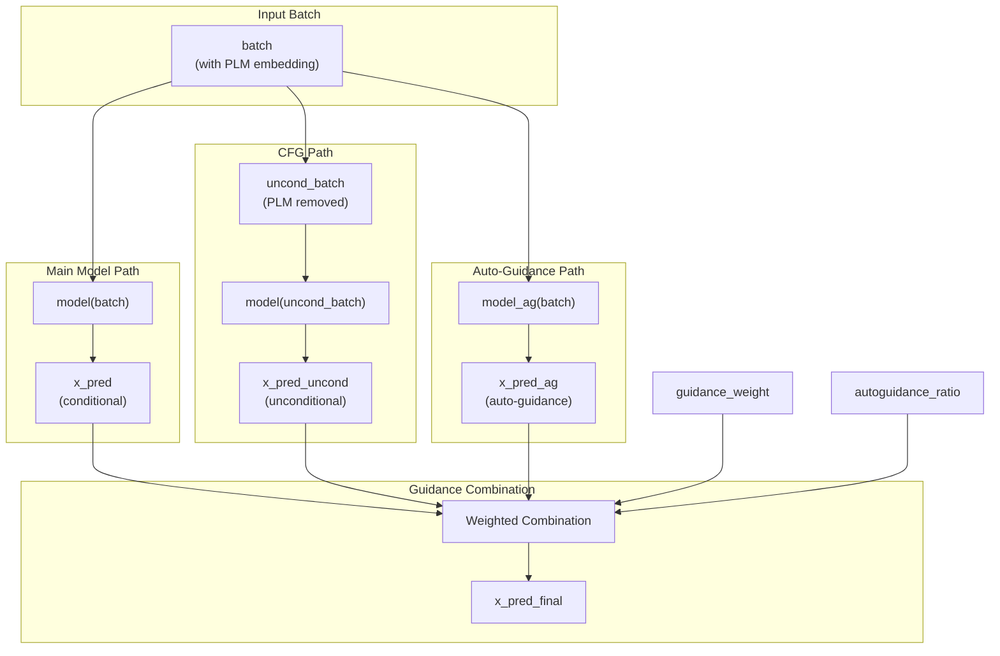
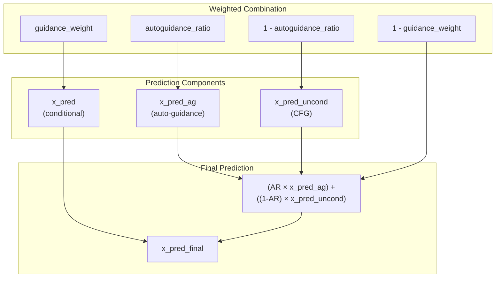
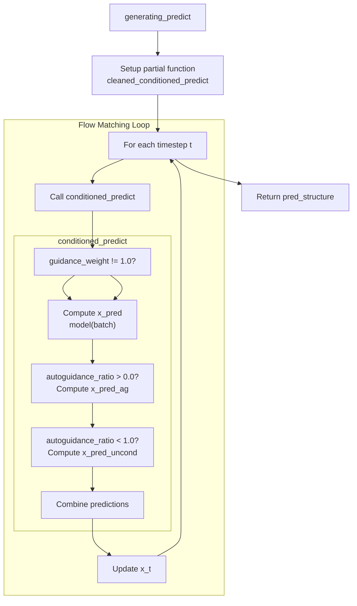

# Guidance Mechanisms

> **Relevant source files**
> * [configs/inference.yaml](https://github.com/Junjie-Zhu/IDPFold2/blob/5315b279/configs/inference.yaml)
> * [src/inference.py](https://github.com/Junjie-Zhu/IDPFold2/blob/5315b279/src/inference.py)
> * [src/model/components/feature_factory.py](https://github.com/Junjie-Zhu/IDPFold2/blob/5315b279/src/model/components/feature_factory.py)
> * [src/model/integral.py](https://github.com/Junjie-Zhu/IDPFold2/blob/5315b279/src/model/integral.py)
> * [src/utils/pdb_utils.py](https://github.com/Junjie-Zhu/IDPFold2/blob/5315b279/src/utils/pdb_utils.py)

## Purpose and Scope

This document describes the guidance mechanisms used during structure generation in IDPFold2. Guidance techniques improve the quality of generated protein conformational ensembles by steering the generative process. This page focuses specifically on **Classifier-Free Guidance (CFG)** and **Auto-Guidance** during inference. For the main inference pipeline, see [Inference Pipeline](/Junjie-Zhu/IDPFold2/7.1-inference-pipeline). For sampling strategies and schedules, see [Sampling Strategies](/Junjie-Zhu/IDPFold2/7.4-sampling-strategies).

## Overview

IDPFold2 implements two guidance mechanisms that can be used independently or combined:

1. **Classifier-Free Guidance (CFG)**: Enhances generation quality by combining conditional and unconditional predictions from the same model
2. **Auto-Guidance**: Uses predictions from a secondary model to guide the generation process

Both mechanisms modify the predicted structure at each sampling step, allowing fine-grained control over generation quality and diversity.

**Diagram: Guidance Mechanism Architecture**



Sources: [src/model/integral.py L41-L91](https://github.com/Junjie-Zhu/IDPFold2/blob/5315b279/src/model/integral.py#L41-L91)

 [src/inference.py L281-L295](https://github.com/Junjie-Zhu/IDPFold2/blob/5315b279/src/inference.py#L281-L295)

## Classifier-Free Guidance (CFG)

Classifier-Free Guidance improves generation quality by computing both conditional and unconditional predictions from the same model, then extrapolating in the direction of the conditional prediction.

### Mechanism

CFG works by:

1. Computing a **conditional prediction** `x_pred` using the full input including PLM embeddings
2. Computing an **unconditional prediction** `x_pred_uncond` by removing the PLM embeddings from the batch
3. Extrapolating: `x_final = guidance_weight * x_pred + (1 - guidance_weight) * x_pred_uncond`

When `guidance_weight > 1.0`, the model extrapolates beyond the conditional prediction, effectively amplifying the conditioning signal.

### Implementation

The CFG logic is implemented in the `conditioned_predict` function:

```markdown
# Check if CFG should be applied (when autoguidance_ratio < 1.0)if autoguidance_ratio < 1.0:  # Use CFG    assert (            "plm_embedding" in batch    ), "Only support CFG when sequence embedding is provided"    uncond_batch = batch.copy()    uncond_batch.pop("plm_embedding")    nn_out_uncond = model(uncond_batch)    x_pred_uncond = prediction_to_x_clean(nn_out_uncond, uncond_batch, target_pred=target_pred)else:    x_pred_uncond = torch.zeros_like(x_pred)
```

**Key Implementation Details:**

| Component | Description |
| --- | --- |
| Conditional Input | Full batch including `plm_emb` (PLM embeddings from ESM2) |
| Unconditional Input | Batch with `plm_embedding` key removed |
| PLM Handling | When PLM embedding is missing, `PLMSeqFeat` returns zeros |
| Prediction Type | Both predictions use the same `target_pred` mode (`x_1` or `v`) |

Sources: [src/model/integral.py L74-L83](https://github.com/Junjie-Zhu/IDPFold2/blob/5315b279/src/model/integral.py#L74-L83)

 [src/model/components/feature_factory.py L277-L295](https://github.com/Junjie-Zhu/IDPFold2/blob/5315b279/src/model/components/feature_factory.py#L277-L295)

### Configuration

CFG is activated when `guidance_weight != 1.0` and requires PLM embeddings in the batch:

```yaml
guidance_weight: 1.0   # Set > 1.0 to enable CFG (typical values: 1.5-3.0)autoguidance_ratio: 0.0   # Set to 0.0 for pure CFG
```

Sources: [configs/inference.yaml L44-L45](https://github.com/Junjie-Zhu/IDPFold2/blob/5315b279/configs/inference.yaml#L44-L45)

## Auto-Guidance

Auto-Guidance uses a secondary model (typically trained with different settings or data) to provide additional guidance signals during generation.

### Mechanism

Auto-guidance requires loading a separate checkpoint:

1. A secondary model `model_ag` is loaded from a different checkpoint
2. Both models predict the structure for the same batch
3. The auto-guidance prediction replaces or supplements the unconditional prediction

### Loading Auto-Guidance Model

The auto-guidance model is loaded during inference initialization:

```
if args.autoguidance_ratio > 0.0 and args.ag_dir is not None:    model_ag = ProteinTransformerAF3(**args.model).to(device)    checkpoint_ag = torch.load(args.ag_dir, map_location=device)    if DIST_WRAPPER.world_size > 1:        model_ag.module.load_state_dict(checkpoint_ag['model_state_dict'])    else:        model_ag.load_state_dict(checkpoint_ag['model_state_dict'])    del checkpoint_ag
```

Sources: [src/inference.py L246-L253](https://github.com/Junjie-Zhu/IDPFold2/blob/5315b279/src/inference.py#L246-L253)

### Implementation

Auto-guidance prediction is computed when `autoguidance_ratio > 0.0`:

```markdown
if autoguidance_ratio > 0.0:  # Use auto-guidance    assert model_ag is not None, "Model for auto-guidance must be provided"    nn_out_ag = model_ag(batch)    x_pred_ag = prediction_to_x_clean(nn_out_ag, batch, target_pred=target_pred)else:    x_pred_ag = torch.zeros_like(x_pred)
```

Sources: [src/model/integral.py L67-L72](https://github.com/Junjie-Zhu/IDPFold2/blob/5315b279/src/model/integral.py#L67-L72)

### Configuration

Auto-guidance is configured via:

```yaml
autoguidance_ratio: 0.0   # Set to 1.0 for pure auto-guidance, 0.0 to disableag_dir: null   # Path to auto-guidance checkpoint
```

Sources: [configs/inference.yaml L45-L46](https://github.com/Junjie-Zhu/IDPFold2/blob/5315b279/configs/inference.yaml#L45-L46)

## Combined Guidance Strategy

IDPFold2 allows mixing CFG and auto-guidance through the `autoguidance_ratio` parameter, providing flexible control over guidance strength.

**Diagram: Combined Guidance Formula**



### Combination Formula

The final prediction combines all three components:

```
x_pred_final = guidance_weight * x_pred + (1 - guidance_weight) * (
    autoguidance_ratio * x_pred_ag + (1 - autoguidance_ratio) * x_pred_uncond
)
```

This formula allows:

* **Pure conditional** (`guidance_weight = 1.0`): No guidance applied
* **Pure CFG** (`guidance_weight > 1.0`, `autoguidance_ratio = 0.0`): Only classifier-free guidance
* **Pure auto-guidance** (`guidance_weight > 1.0`, `autoguidance_ratio = 1.0`): Only auto-guidance
* **Mixed guidance** (`0.0 < autoguidance_ratio < 1.0`): Combination of both

Sources: [src/model/integral.py L85-L87](https://github.com/Junjie-Zhu/IDPFold2/blob/5315b279/src/model/integral.py#L85-L87)

### Configuration Examples

| Scenario | `guidance_weight` | `autoguidance_ratio` | Result |
| --- | --- | --- | --- |
| No guidance | 1.0 | 0.0 | Standard conditional generation |
| Pure CFG | 2.0 | 0.0 | Strong classifier-free guidance |
| Pure auto-guidance | 2.0 | 1.0 | Auto-guidance only |
| Balanced mix | 2.0 | 0.5 | Equal CFG and auto-guidance |
| CFG-dominant | 2.0 | 0.25 | 75% CFG, 25% auto-guidance |

## Implementation Flow

**Diagram: Guidance Flow in Inference Pipeline**



Sources: [src/model/integral.py L323-L401](https://github.com/Junjie-Zhu/IDPFold2/blob/5315b279/src/model/integral.py#L323-L401)

 [src/model/integral.py L41-L91](https://github.com/Junjie-Zhu/IDPFold2/blob/5315b279/src/model/integral.py#L41-L91)

### Step-by-Step Process

1. **Initialization** ([src/inference.py L281-L295](https://github.com/Junjie-Zhu/IDPFold2/blob/5315b279/src/inference.py#L281-L295) ): * Load main model from checkpoint * Optionally load auto-guidance model if `ag_dir` is provided * Create partial function `cleaned_conditioned_predict` with guidance parameters
2. **Per-Timestep Execution** ([src/model/integral.py L340-L352](https://github.com/Junjie-Zhu/IDPFold2/blob/5315b279/src/model/integral.py#L340-L352) ): * `generating_predict` calls `full_simulation` on flow matcher * At each timestep, `conditioned_predict` is called with current `x_t`
3. **Guidance Computation** ([src/model/integral.py L54-L90](https://github.com/Junjie-Zhu/IDPFold2/blob/5315b279/src/model/integral.py#L54-L90) ): * Compute conditional prediction from main model * If `guidance_weight != 1.0`: * Compute auto-guidance prediction if enabled * Compute unconditional prediction if CFG enabled * Combine using weighted formula * Compute velocity field from final prediction
4. **Structure Update**: * Flow matcher integrates velocity to update `x_t` * Process repeats until `t = 1.0` (complete structure)

## Configuration Parameters

### Complete Parameter Reference

| Parameter | Type | Default | Description |
| --- | --- | --- | --- |
| `guidance_weight` | float | 1.0 | Weight for conditional prediction. Values > 1.0 enable guidance |
| `autoguidance_ratio` | float | 0.0 | Ratio of auto-guidance vs CFG (0.0 = pure CFG, 1.0 = pure auto-guidance) |
| `ag_dir` | str | null | Path to auto-guidance model checkpoint |

Sources: [configs/inference.yaml L44-L46](https://github.com/Junjie-Zhu/IDPFold2/blob/5315b279/configs/inference.yaml#L44-L46)

### Typical Settings

**High-Quality Generation (Slower):**

```yaml
guidance_weight: 2.5autoguidance_ratio: 0.0ag_dir: null
```

**Balanced Quality and Diversity:**

```yaml
guidance_weight: 1.5autoguidance_ratio: 0.5ag_dir: "path/to/ag_checkpoint.pth"
```

**Fast Generation (No Guidance):**

```yaml
guidance_weight: 1.0autoguidance_ratio: 0.0ag_dir: null
```

## Practical Considerations

### Computational Cost

Guidance mechanisms increase computational cost:

* **CFG**: 2× model evaluations per timestep (conditional + unconditional)
* **Auto-guidance**: 2× model evaluations per timestep (main + auto-guidance model)
* **Combined**: Up to 3× evaluations if both mechanisms active

The total cost depends on the parameter settings:

```markdown
if guidance_weight == 1.0:    evaluations_per_step = 1  # No guidanceelif autoguidance_ratio == 0.0:    evaluations_per_step = 2  # Pure CFGelif autoguidance_ratio == 1.0:    evaluations_per_step = 2  # Pure auto-guidanceelse:    evaluations_per_step = 3  # Combined guidance
```

### Memory Requirements

* **CFG**: Requires storing additional batch copy and predictions
* **Auto-guidance**: Requires loading second model (same size as main model)
* Both mechanisms operate on same batch size, so memory scales with model size

### Quality vs Speed Trade-off

| Setting | Speed | Quality | Use Case |
| --- | --- | --- | --- |
| No guidance | Fastest | Baseline | Large ensemble generation |
| Moderate CFG (w=1.5) | Medium | Good | General-purpose inference |
| Strong CFG (w=2.5) | Slow | Best | High-quality single structures |
| Auto-guidance | Slow | Variable | Specialized conditioning |

Sources: [src/model/integral.py L65-L87](https://github.com/Junjie-Zhu/IDPFold2/blob/5315b279/src/model/integral.py#L65-L87)

 [src/inference.py L246-L295](https://github.com/Junjie-Zhu/IDPFold2/blob/5315b279/src/inference.py#L246-L295)

## Code Entity Reference

### Key Functions

| Function | Location | Purpose |
| --- | --- | --- |
| `conditioned_predict` | [src/model/integral.py L41-L91](https://github.com/Junjie-Zhu/IDPFold2/blob/5315b279/src/model/integral.py#L41-L91) | Implements guidance logic |
| `generating_predict` | [src/model/integral.py L323-L401](https://github.com/Junjie-Zhu/IDPFold2/blob/5315b279/src/model/integral.py#L323-L401) | Main generation loop with guidance |
| `prediction_to_x_clean` | [src/model/integral.py L25-L38](https://github.com/Junjie-Zhu/IDPFold2/blob/5315b279/src/model/integral.py#L25-L38) | Converts model output to clean prediction |

### Key Parameters in Batch Dictionary

| Key | Type | Description |
| --- | --- | --- |
| `plm_emb` or `plm_embedding` | Tensor | PLM embeddings; removed for CFG unconditional path |
| `x_t` | Tensor | Current noisy structure at timestep t |
| `t` | Tensor | Current timestep value |
| `mask` | Tensor | Residue validity mask |

### Configuration Keys

| Config Key | Module | Description |
| --- | --- | --- |
| `guidance_weight` | inference.yaml | Main guidance weight parameter |
| `autoguidance_ratio` | inference.yaml | Ratio between auto-guidance and CFG |
| `ag_dir` | inference.yaml | Path to auto-guidance checkpoint |

Sources: [configs/inference.yaml L44-L46](https://github.com/Junjie-Zhu/IDPFold2/blob/5315b279/configs/inference.yaml#L44-L46)

 [src/model/integral.py L41-L91](https://github.com/Junjie-Zhu/IDPFold2/blob/5315b279/src/model/integral.py#L41-L91)