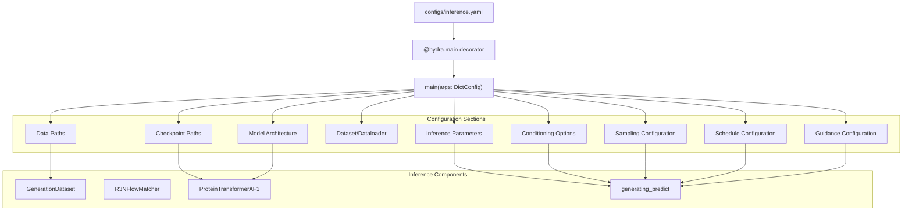
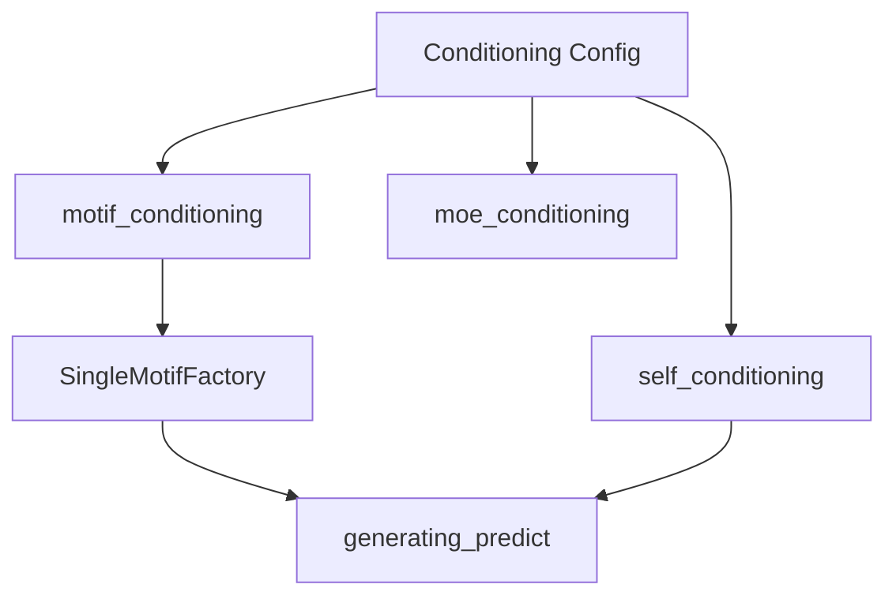
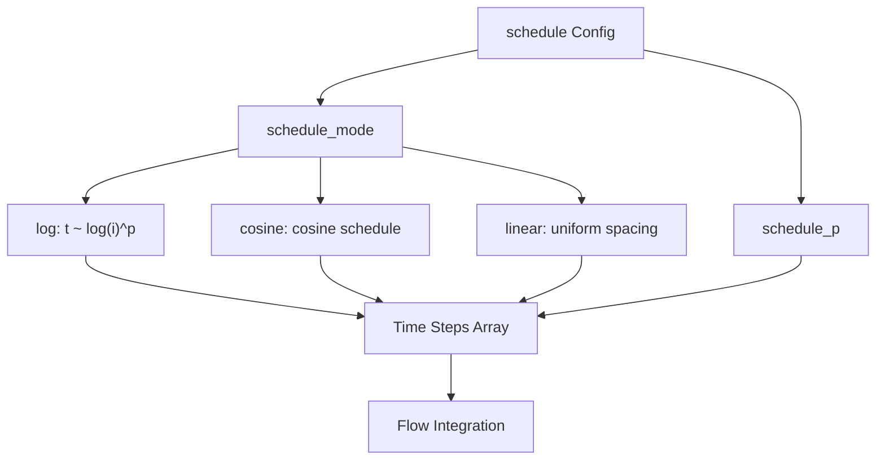
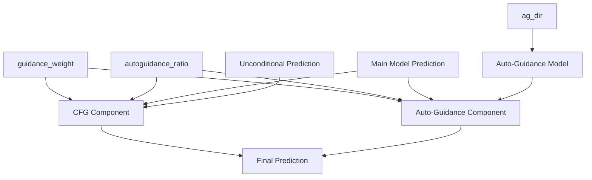
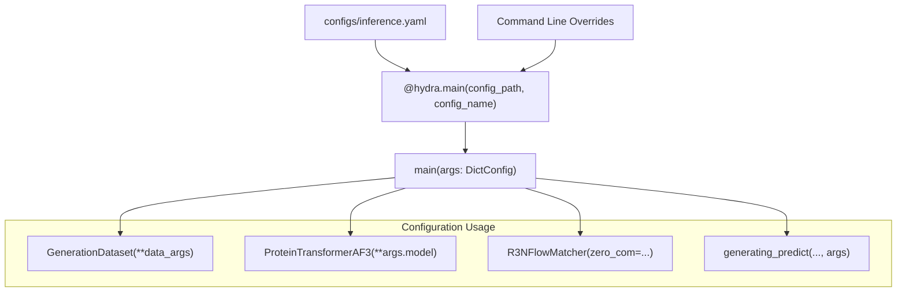

# Inference Configuration

> **Relevant source files**
> * [configs/inference.yaml](https://github.com/Junjie-Zhu/IDPFold2/blob/5315b279/configs/inference.yaml)
> * [src/inference.py](https://github.com/Junjie-Zhu/IDPFold2/blob/5315b279/src/inference.py)
> * [src/utils/pdb_utils.py](https://github.com/Junjie-Zhu/IDPFold2/blob/5315b279/src/utils/pdb_utils.py)

This page documents all configuration parameters defined in `configs/inference.yaml` that control the inference behavior of IDPFold2. These parameters determine how the model generates protein conformational ensembles from input sequences.

For training configuration parameters, see [Training Configuration](/Junjie-Zhu/IDPFold2/10.1-training-configuration). For details on how these parameters are used during inference, see [Inference Pipeline](/Junjie-Zhu/IDPFold2/7.1-inference-pipeline), [Generating Predict Function](/Junjie-Zhu/IDPFold2/7.2-generating-predict-function), [Guidance Mechanisms](/Junjie-Zhu/IDPFold2/7.3-guidance-mechanisms), and [Sampling Strategies](/Junjie-Zhu/IDPFold2/7.4-sampling-strategies).

## Configuration File Overview

The inference configuration is managed using Hydra and is defined in [configs/inference.yaml L1-L102](https://github.com/Junjie-Zhu/IDPFold2/blob/5315b279/configs/inference.yaml#L1-L102)

 The configuration is loaded by the main inference script at [src/inference.py L167](https://github.com/Junjie-Zhu/IDPFold2/blob/5315b279/src/inference.py#L167-L167)

 using the `@hydra.main` decorator.



**Sources:** [configs/inference.yaml L1-L102](https://github.com/Junjie-Zhu/IDPFold2/blob/5315b279/configs/inference.yaml#L1-L102)

 [src/inference.py L167-L168](https://github.com/Junjie-Zhu/IDPFold2/blob/5315b279/src/inference.py#L167-L168)

## Data Configuration

These parameters specify input data sources for inference.

| Parameter | Type | Default | Description |
| --- | --- | --- | --- |
| `csv_dir` | str | `null` | Path to CSV file containing input sequences. Must have columns: `test_case` (identifier) and `sequence` (amino acid sequence). For multimers, sequences are colon-separated. |
| `plm_emb_dir` | str | `null` | Directory containing pre-computed PLM embeddings (.pt files). If directory doesn't exist or is incomplete, embeddings are generated automatically using ESM2. |
| `logging_dir` | str | `"./logs"` | Base directory for saving outputs. A timestamped subdirectory is created for each inference run. |
| `prefix` | str | `"DEFAULT"` | Prefix for the logging directory name. |

The CSV file structure is loaded by `GenerationDataset` at [src/inference.py L31-L157](https://github.com/Junjie-Zhu/IDPFold2/blob/5315b279/src/inference.py#L31-L157)

 and processed at [src/inference.py L211-L217](https://github.com/Junjie-Zhu/IDPFold2/blob/5315b279/src/inference.py#L211-L217)

**Sources:** [configs/inference.yaml L2-L25](https://github.com/Junjie-Zhu/IDPFold2/blob/5315b279/configs/inference.yaml#L2-L25)

 [src/inference.py L31-L217](https://github.com/Junjie-Zhu/IDPFold2/blob/5315b279/src/inference.py#L31-L217)

## Inference Parameters

Core parameters controlling the generation process.

| Parameter | Type | Default | Description |
| --- | --- | --- | --- |
| `nsamples` | int | `100` | Number of conformational samples to generate per input sequence. Samples are distributed across available GPUs in multi-device inference. |
| `max_batch_length` | int | `3500` | Maximum total residues per batch (nsamples × nres). Used to determine batch size based on GPU memory. Currently tested on V100-32GB. |
| `dt` | float | `0.005` | Time step size for flow integration. Smaller values produce more accurate sampling but increase computation time. |
| `target_pred` | str | `"v"` | Prediction target for the model. Typically `"v"` for velocity prediction in flow matching. |

The `max_batch_length` parameter is used at [src/inference.py L271](https://github.com/Junjie-Zhu/IDPFold2/blob/5315b279/src/inference.py#L271-L271)

 to compute the number of samples per batch as `max(1, max_batch_length // nres)`.

**Sources:** [configs/inference.yaml L8-L12](https://github.com/Junjie-Zhu/IDPFold2/blob/5315b279/configs/inference.yaml#L8-L12)

 [src/inference.py L214-L280](https://github.com/Junjie-Zhu/IDPFold2/blob/5315b279/src/inference.py#L214-L280)

## Checkpoint Configuration

Parameters for loading trained model weights.

| Parameter | Type | Default | Description |
| --- | --- | --- | --- |
| `ckpt_dir` | str | `null` | **Required.** Path to the main model checkpoint (.pth file). Should contain EMA weights from training. |
| `ag_dir` | str | `null` | Optional path to auto-guidance model checkpoint. Used only if `autoguidance_ratio > 0.0`. |

Checkpoints are loaded at [src/inference.py L229-L253](https://github.com/Junjie-Zhu/IDPFold2/blob/5315b279/src/inference.py#L229-L253)

:

* Main checkpoint loaded at line 230
* Auto-guidance checkpoint loaded at line 248 if specified

**Sources:** [configs/inference.yaml L14-L16](https://github.com/Junjie-Zhu/IDPFold2/blob/5315b279/configs/inference.yaml#L14-L16)

 [src/inference.py L229-L253](https://github.com/Junjie-Zhu/IDPFold2/blob/5315b279/src/inference.py#L229-L253)

## Dataset and Dataloader Parameters

Configuration for data loading behavior.

| Parameter | Type | Default | Description |
| --- | --- | --- | --- |
| `load_multimer` | bool | `False` | Whether input contains multi-chain proteins. If `True`, sequences are split by colons and separate PLM embeddings are loaded for each chain. |
| `num_workers` | int | `6` | Number of worker processes for data loading. |
| `seed` | int | `42` | Random seed (currently commented out in code). |
| `deterministic` | bool | `False` | Whether to enforce deterministic behavior (currently commented out in code). |

The `load_multimer` flag affects data loading at [src/inference.py L38-L115](https://github.com/Junjie-Zhu/IDPFold2/blob/5315b279/src/inference.py#L38-L115)

 determining whether sequences are processed as single chains or multi-chain complexes.

**Sources:** [configs/inference.yaml L18-L24](https://github.com/Junjie-Zhu/IDPFold2/blob/5315b279/configs/inference.yaml#L18-L24)

 [src/inference.py L38-L222](https://github.com/Junjie-Zhu/IDPFold2/blob/5315b279/src/inference.py#L38-L222)

## Conditioning Configuration

Parameters enabling various conditioning mechanisms during generation.

| Parameter | Type | Default | Description |
| --- | --- | --- | --- |
| `motif_conditioning` | bool | `False` | Enable motif conditioning to preserve specific structural fragments during generation. See [Conditioning Strategies](/Junjie-Zhu/IDPFold2/6.6-conditioning-strategies). |
| `motif_prob` | float | N/A | Probability of applying motif conditioning (used when `motif_conditioning=True`). Referenced at [src/inference.py L227](https://github.com/Junjie-Zhu/IDPFold2/blob/5315b279/src/inference.py#L227-L227) |
| `moe_conditioning` | bool | `False` | Enable conditioning based on Mixture of Experts routing. Currently configured but not actively used in inference. |
| `self_conditioning` | bool | `False` | Enable self-conditioning where the model conditions on its own previous predictions. See [Generating Predict Function](/Junjie-Zhu/IDPFold2/7.2-generating-predict-function). |

These flags are passed to `generating_predict` at [src/inference.py L286-L293](https://github.com/Junjie-Zhu/IDPFold2/blob/5315b279/src/inference.py#L286-L293)

:



**Sources:** [configs/inference.yaml L27-L30](https://github.com/Junjie-Zhu/IDPFold2/blob/5315b279/configs/inference.yaml#L27-L30)

 [src/inference.py L227-L293](https://github.com/Junjie-Zhu/IDPFold2/blob/5315b279/src/inference.py#L227-L293)

## Sampling Configuration

The `sampling` section controls the sampling mode and noise/score scaling parameters.

| Parameter | Type | Default | Description |
| --- | --- | --- | --- |
| `sampling.sampling_mode` | str | `"vf"` | Sampling mode. Options: `"vf"` (vector field/flow matching) or `"sc"` (score-based). |
| `sampling.sc_scale_noise` | float | `0.0` | Noise scaling factor when `sampling_mode="sc"`. Multiplies added noise. |
| `sampling.sc_scale_score` | float | `1.0` | Score scaling factor when `sampling_mode="sc"`. Not fully implemented. |
| `sampling.gt_mode` | str | `"1/t"` | Gradient transformation mode. Options: `"us"`, `"tan"`, or `"1/t"`. |
| `sampling.gt_p` | float | `1.0` | Power parameter for gradient transformation. |
| `sampling.gt_clamp_val` | float/null | `null` | Optional clamping value for gradients. Set to float (e.g., 10.0) or `null` to disable. |

These parameters are packaged into `sampling_args` and passed to `generating_predict` at [src/inference.py L291](https://github.com/Junjie-Zhu/IDPFold2/blob/5315b279/src/inference.py#L291-L291)

 The sampling configuration determines how the model integrates the flow ODE/SDE. See [Sampling Strategies](/Junjie-Zhu/IDPFold2/7.4-sampling-strategies) for detailed explanation.

**Sources:** [configs/inference.yaml L32-L38](https://github.com/Junjie-Zhu/IDPFold2/blob/5315b279/configs/inference.yaml#L32-L38)

 [src/inference.py L291](https://github.com/Junjie-Zhu/IDPFold2/blob/5315b279/src/inference.py#L291-L291)

## Schedule Configuration

The `schedule` section controls the time discretization schedule during sampling.

| Parameter | Type | Default | Description |
| --- | --- | --- | --- |
| `schedule.schedule_mode` | str | `"log"` | Schedule type for time steps. Options: `"log"` (logarithmic spacing), `"cosine"`, or `"linear"`. |
| `schedule.schedule_p` | float | `2.0` | Power parameter for the schedule. Higher values concentrate steps near t=0. |



The schedule configuration is passed as `schedule_args` to `generating_predict` at [src/inference.py L290](https://github.com/Junjie-Zhu/IDPFold2/blob/5315b279/src/inference.py#L290-L290)

 Different schedules affect the quality and computational cost of sampling. See [Sampling Strategies](/Junjie-Zhu/IDPFold2/7.4-sampling-strategies) for details.

**Sources:** [configs/inference.yaml L40-L42](https://github.com/Junjie-Zhu/IDPFold2/blob/5315b279/configs/inference.yaml#L40-L42)

 [src/inference.py L290](https://github.com/Junjie-Zhu/IDPFold2/blob/5315b279/src/inference.py#L290-L290)

## Guidance Configuration

Parameters controlling classifier-free guidance and auto-guidance mechanisms.

| Parameter | Type | Default | Description |
| --- | --- | --- | --- |
| `guidance_weight` | float | `1.0` | Weight for guidance. `1.0` disables guidance (standard generation). Values `> 1.0` enhance guidance. `0.0` excludes the main model. |
| `autoguidance_ratio` | float | `0.0` | Ratio between auto-guidance and classifier-free guidance. Range [0, 1]. `1.0` = all auto-guidance, `0.0` = all CFG. |
| `autoguidance_ckpt_path` | str | `null` | Deprecated parameter name. Use `ag_dir` instead. |

### Guidance Weight Calculation

The effective guidance is computed as:

* When `autoguidance_ratio = 0.0`: Pure classifier-free guidance using conditional and unconditional predictions
* When `autoguidance_ratio = 1.0`: Pure auto-guidance using main model and auto-guidance model
* Intermediate values: Blend of both mechanisms

Implementation is in `generating_predict` with these parameters passed at [src/inference.py L288-L289](https://github.com/Junjie-Zhu/IDPFold2/blob/5315b279/src/inference.py#L288-L289)



For detailed explanation of guidance mechanisms, see [Guidance Mechanisms](/Junjie-Zhu/IDPFold2/7.3-guidance-mechanisms).

**Sources:** [configs/inference.yaml L44-L46](https://github.com/Junjie-Zhu/IDPFold2/blob/5315b279/configs/inference.yaml#L44-L46)

 [src/inference.py L246-L289](https://github.com/Junjie-Zhu/IDPFold2/blob/5315b279/src/inference.py#L246-L289)

## Model Configuration

The `model` section defines the architecture parameters for `ProteinTransformerAF3`. These parameters must match the architecture used during training.

### Core Architecture Parameters

| Parameter | Type | Default | Description |
| --- | --- | --- | --- |
| `model.training` | bool | `False` | Training mode flag. Should be `False` for inference. |
| `model.token_dim` | int | `768` | Dimension of token embeddings in the sequence representation. |
| `model.nlayers` | int | `10` | Number of transformer layers. |
| `model.nheads` | int | `12` | Number of attention heads per layer. |

### Transformer Architecture Options

| Parameter | Type | Default | Description |
| --- | --- | --- | --- |
| `model.residual_mha` | bool | `True` | Whether to use residual connection in multi-head attention. |
| `model.residual_transition` | bool | `True` | Whether to use residual connection in transition/FFN blocks. |
| `model.parallel_mha_transition` | bool | `False` | If `True`, compute MHA and transition in parallel (AlphaFold3 style). If `False`, sequential (standard transformer). |
| `model.use_attn_pair_bias` | bool | `True` | Whether to bias attention using pair representation. |
| `model.num_registers` | int | `10` | Number of register tokens added to the sequence. |
| `model.use_qkln` | bool | `True` | Whether to use QK layer normalization in attention. |

### Feature Factory Configuration

| Parameter | Type | Default | Description |
| --- | --- | --- | --- |
| `model.strict_feats` | bool | `False` | If `True`, raises error for missing features. If `False`, fills with defaults. |
| `model.feats_init_seq` | list | `["plm_emb", "res_type", "res_idx", "chain_break_per_res"]` | Sequence features for initial representation. |
| `model.feats_cond_seq` | list | `["time_emb"]` | Sequence features for conditioning vector. |
| `model.feats_pair_repr` | list | `["xt_pair_dists", "rel_pos"]` | Features for pair representation. |
| `model.feats_pair_cond` | list | `["time_emb"]` | Features for pair conditioning. |

### Embedding Dimensions

| Parameter | Type | Default | Description |
| --- | --- | --- | --- |
| `model.t_emb_dim` | int | `256` | Dimension of time embedding. |
| `model.idx_emb_dim` | int | `128` | Dimension of residue index embedding. |
| `model.dim_cond` | int | `512` | Dimension of conditioning vector. |
| `model.plm_in_dim` | int | `1280` | Input dimension of PLM embeddings (ESM2-650M). |
| `model.plm_out_dim` | int | `256` | Output dimension after PLM projection. |

### Pair Representation Parameters

| Parameter | Type | Default | Description |
| --- | --- | --- | --- |
| `model.xt_pair_dist_dim` | int | `64` | Dimension of distance binning features. |
| `model.xt_pair_dist_min` | float | `0.1` | Minimum distance for binning (in nm). |
| `model.xt_pair_dist_max` | float | `3.0` | Maximum distance for binning (in nm). |
| `model.r_max` | int | `32` | Maximum relative position in sequence to consider. |
| `model.pair_repr_dim` | int | `512` | Final dimension of pair representation. |

### Mixture of Experts Configuration

| Parameter | Type | Default | Description |
| --- | --- | --- | --- |
| `model.use_moe` | bool | `True` | Whether to use Mixture of Experts layers. |
| `model.n_experts` | int | `5` | Total number of experts per MoE layer. |
| `model.n_activated_experts` | int | `2` | Number of experts activated per token. |
| `model.dim_moe_cond` | int | `0` | Dimension of MoE conditioning vector. `0` disables MoE conditioning. |
| `model.capacity_factor` | float | `1.3` | Capacity factor for expert load balancing. |
| `model.normalize_expert_weights` | bool | `True` | Whether to normalize expert combination weights. |

The model is instantiated at [src/inference.py L225](https://github.com/Junjie-Zhu/IDPFold2/blob/5315b279/src/inference.py#L225-L225)

 using: `ProteinTransformerAF3(**args.model)`.

For detailed architecture documentation, see [ProteinTransformerAF3](/Junjie-Zhu/IDPFold2/5.1-proteintransformeraf3) and [Mixture of Experts](/Junjie-Zhu/IDPFold2/5.2-mixture-of-experts).

**Sources:** [configs/inference.yaml L48-L92](https://github.com/Junjie-Zhu/IDPFold2/blob/5315b279/configs/inference.yaml#L48-L92)

 [src/inference.py L225](https://github.com/Junjie-Zhu/IDPFold2/blob/5315b279/src/inference.py#L225-L225)

## Configuration Loading and Usage

### Hydra Integration

The configuration is loaded using Hydra's decorator pattern:



**Sources:** [src/inference.py L167-L168](https://github.com/Junjie-Zhu/IDPFold2/blob/5315b279/src/inference.py#L167-L168)

### Command Line Overrides

All parameters can be overridden from the command line using Hydra syntax:

```markdown
# Override single parameterspython src/inference.py nsamples=200 guidance_weight=2.0 # Override nested parameterspython src/inference.py model.nlayers=12 sampling.sampling_mode=sc # Override multiple parameterspython src/inference.py \    csv_dir=/path/to/input.csv \    plm_emb_dir=/path/to/embeddings \    ckpt_dir=/path/to/checkpoint.pth \    nsamples=100 \    guidance_weight=1.5
```

### Configuration in Multi-Device Inference

When running with multiple GPUs using `torchrun`, the configuration is shared across all processes:

| Aspect | Behavior |
| --- | --- |
| Configuration Loading | Each rank loads the same configuration |
| Sample Distribution | `nsamples` divided across ranks at [src/inference.py L266-L268](https://github.com/Junjie-Zhu/IDPFold2/blob/5315b279/src/inference.py#L266-L268) |
| Batch Sizing | `max_batch_length` applied per rank independently |
| Output Aggregation | Rank 0 collects all outputs at [src/inference.py L322-L342](https://github.com/Junjie-Zhu/IDPFold2/blob/5315b279/src/inference.py#L322-L342) |

See [Multi-Device Inference](/Junjie-Zhu/IDPFold2/7.5-multi-device-inference) for details on distributed inference.

**Sources:** [src/inference.py L196-L342](https://github.com/Junjie-Zhu/IDPFold2/blob/5315b279/src/inference.py#L196-L342)

## Configuration Example

Complete example configuration for inference:

```markdown
# Basic identificationprefix: MyProtein # Data pathscsv_dir: ./data/input_sequences.csvplm_emb_dir: ./embeddings/esm2logging_dir: ./outputs # Inference settingsnsamples: 100max_batch_length: 3500dt: 0.005target_pred: v # Checkpointsckpt_dir: ./checkpoints/model_ema.pthag_dir: null # Datasetload_multimer: Falsenum_workers: 6 # Conditioningmotif_conditioning: Falseself_conditioning: False # Samplingsampling:  sampling_mode: vf  sc_scale_noise: 0.0  # Scheduleschedule:  schedule_mode: log  schedule_p: 2.0 # Guidance (1.0 = no guidance)guidance_weight: 1.5autoguidance_ratio: 0.0 # Model architecture (must match training)model:  training: False  nlayers: 10  nheads: 12  use_moe: True  n_experts: 5  n_activated_experts: 2
```

This configuration generates 100 samples per sequence using classifier-free guidance with weight 1.5, distributing computation across available GPUs.

**Sources:** [configs/inference.yaml L1-L102](https://github.com/Junjie-Zhu/IDPFold2/blob/5315b279/configs/inference.yaml#L1-L102)