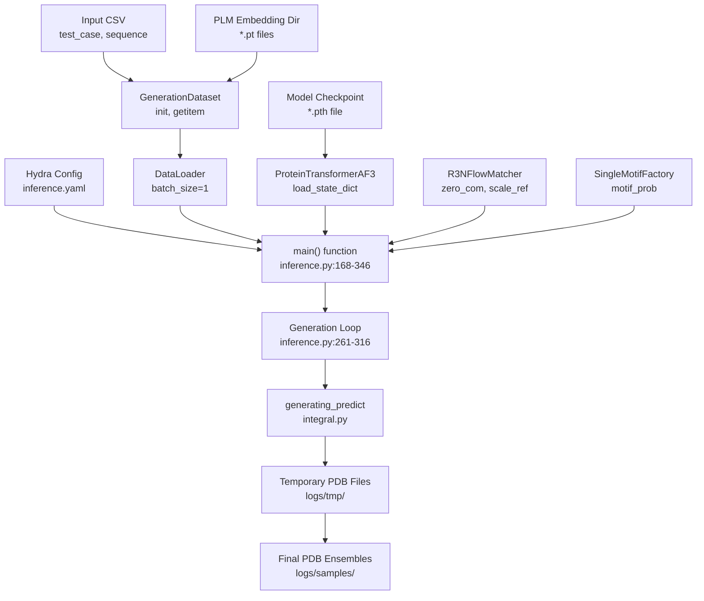
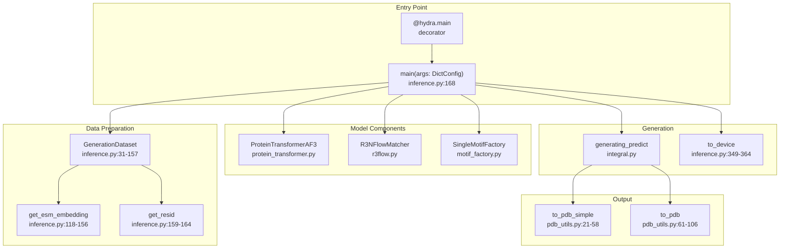
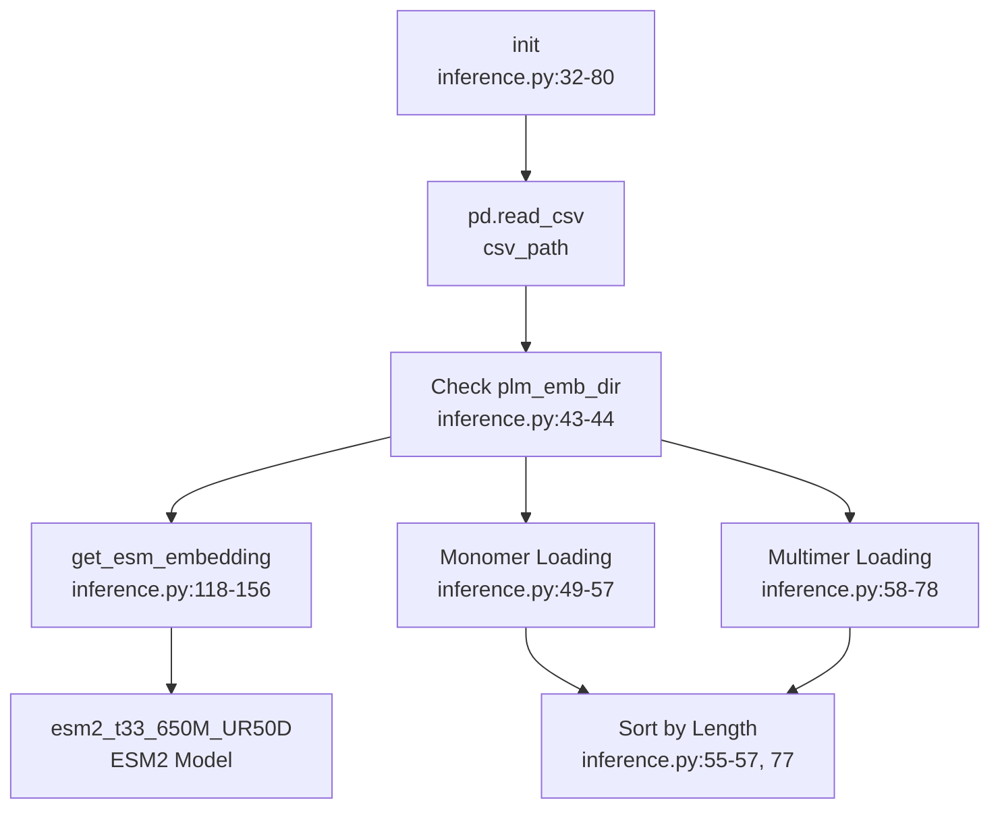
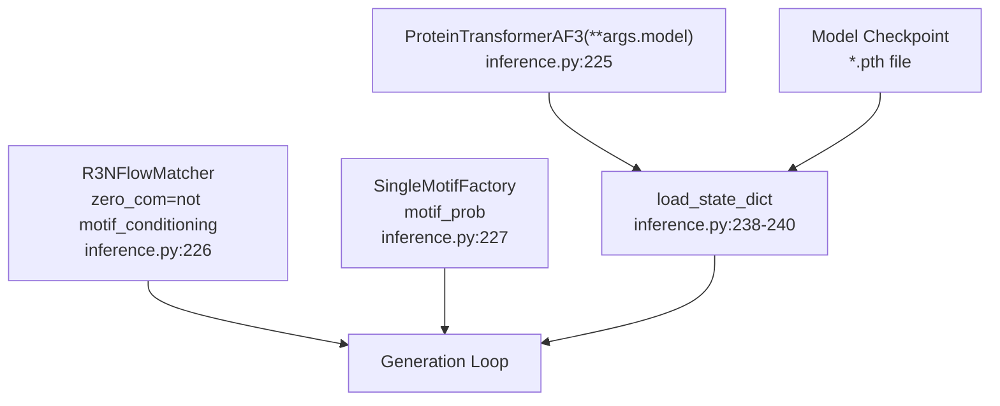
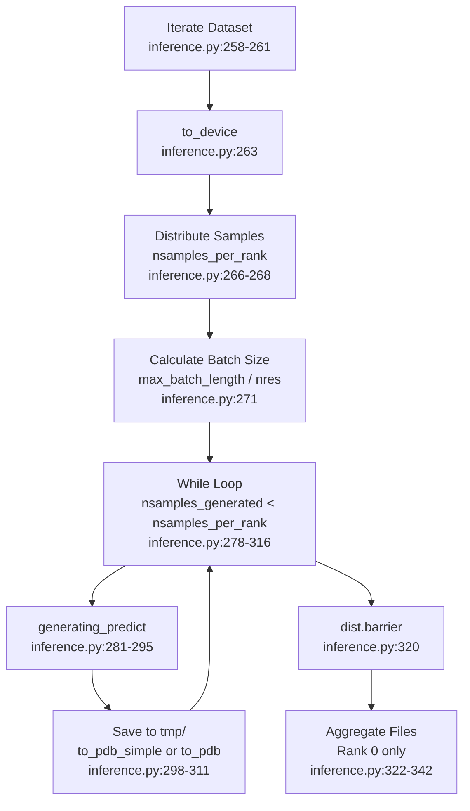
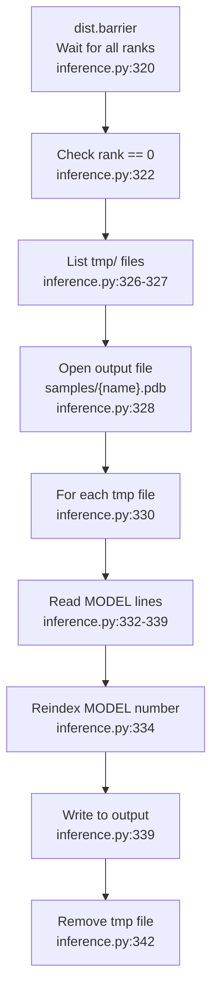

# Inference Pipeline

> **Relevant source files**
> * [configs/inference.yaml](https://github.com/Junjie-Zhu/IDPFold2/blob/5315b279/configs/inference.yaml)
> * [src/inference.py](https://github.com/Junjie-Zhu/IDPFold2/blob/5315b279/src/inference.py)
> * [src/utils/pdb_utils.py](https://github.com/Junjie-Zhu/IDPFold2/blob/5315b279/src/utils/pdb_utils.py)

## Purpose and Scope

This page documents the main inference pipeline orchestrated by `src/inference.py`, covering the end-to-end workflow for generating protein conformational ensembles from input sequences. This includes configuration setup, dataset preparation, model checkpoint loading, iterative structure generation, and PDB file output.

For details about the core sampling algorithm, see [Generating Predict Function](/Junjie-Zhu/IDPFold2/7.2-generating-predict-function). For guidance mechanisms, see [Guidance Mechanisms](/Junjie-Zhu/IDPFold2/7.3-guidance-mechanisms). For distributed inference orchestration, see [Multi-Device Inference](/Junjie-Zhu/IDPFold2/7.5-multi-device-inference). For PDB output format details, see [PDB Output Generation](/Junjie-Zhu/IDPFold2/7.7-pdb-output-generation).

---

## Overview

The inference pipeline transforms input protein sequences into conformational ensembles through the following stages:

1. **Configuration Loading**: Hydra loads parameters from `configs/inference.yaml`
2. **Dataset Preparation**: `GenerationDataset` processes sequences and generates/loads PLM embeddings
3. **Model Initialization**: `ProteinTransformerAF3` and `R3NFlowMatcher` are instantiated and loaded from checkpoint
4. **Iterative Generation**: For each sequence, multiple samples are generated via `generating_predict`
5. **Output Saving**: Structures are saved as PDB files with MODEL/ENDMDL formatting
6. **Result Aggregation**: Temporary files from distributed ranks are merged into final outputs

Sources: [src/inference.py L167-L368](https://github.com/Junjie-Zhu/IDPFold2/blob/5315b279/src/inference.py#L167-L368)

 [configs/inference.yaml L1-L102](https://github.com/Junjie-Zhu/IDPFold2/blob/5315b279/configs/inference.yaml#L1-L102)

---

## Pipeline Architecture

### High-Level Flow



**Diagram 1: Inference Pipeline Architecture**

This diagram maps the main components and their code implementations. The `main()` function coordinates all stages, from loading configuration and data to model initialization and generation loops.

Sources: [src/inference.py L167-L368](https://github.com/Junjie-Zhu/IDPFold2/blob/5315b279/src/inference.py#L167-L368)

 [configs/inference.yaml L1-L102](https://github.com/Junjie-Zhu/IDPFold2/blob/5315b279/configs/inference.yaml#L1-L102)

---

### Code Entity Flow



**Diagram 2: Code Entity Mapping**

This diagram shows the concrete functions and classes involved in the inference pipeline, bridging conceptual components to actual code symbols.

Sources: [src/inference.py L1-L368](https://github.com/Junjie-Zhu/IDPFold2/blob/5315b279/src/inference.py#L1-L368)

 [src/utils/pdb_utils.py L21-L106](https://github.com/Junjie-Zhu/IDPFold2/blob/5315b279/src/utils/pdb_utils.py#L21-L106)

---

## GenerationDataset

The `GenerationDataset` class prepares protein sequences for inference by loading or generating PLM embeddings and organizing data for batch processing.

### Initialization and Data Loading



**Diagram 3: GenerationDataset Initialization**

The dataset checks if PLM embeddings exist, generates them using ESM2 if needed, then loads and sorts sequences by length for efficient batching.

Sources: [src/inference.py L31-L157](https://github.com/Junjie-Zhu/IDPFold2/blob/5315b279/src/inference.py#L31-L157)

### Data Structure

Each item returned by `__getitem__` contains:

| Field | Type | Description |
| --- | --- | --- |
| `dt` | float | Time step for flow matching integration |
| `nsamples` | int | Number of samples to generate for this sequence |
| `nres` | int | Number of residues in the protein |
| `plm_emb` | Tensor | PLM embeddings, shape `[nres, 1280]` |
| `name` | str | Identifier for the protein |
| `residue_type` | Tensor | Residue type indices, shape `[nres]` |
| `residue_idx` | Tensor (multimer) | Residue indices per chain, shape `[nres]` |
| `chains` | Tensor (multimer) | Chain identifiers, shape `[nres]` |

Sources: [src/inference.py L85-L115](https://github.com/Junjie-Zhu/IDPFold2/blob/5315b279/src/inference.py#L85-L115)

---

## Model Initialization

### Checkpoint Loading

The pipeline loads a trained model checkpoint containing the `model_state_dict`:

```markdown
# From src/inference.py:229-244checkpoint = torch.load(args.ckpt_dir, map_location=device)if DIST_WRAPPER.world_size > 1:    model = DDP(model, device_ids=[DIST_WRAPPER.local_rank], ...)    model.module.load_state_dict(checkpoint['model_state_dict'])else:    model.load_state_dict(checkpoint['model_state_dict'])
```

The checkpoint is typically an EMA (Exponential Moving Average) checkpoint from training, ensuring stable inference weights. See [Training Pipeline](/Junjie-Zhu/IDPFold2/6.1-training-pipeline) for checkpoint creation details.

Sources: [src/inference.py L224-L244](https://github.com/Junjie-Zhu/IDPFold2/blob/5315b279/src/inference.py#L224-L244)

### Component Instantiation

Three core components are initialized:

| Component | Class | Purpose | Configuration |
| --- | --- | --- | --- |
| Model | `ProteinTransformerAF3` | Main architecture | `args.model` |
| Flow Matcher | `R3NFlowMatcher` | Generative sampling | `zero_com`, `scale_ref` |
| Motif Factory | `SingleMotifFactory` | Optional conditioning | `motif_prob` |



**Diagram 4: Model Initialization Sequence**

Sources: [src/inference.py L224-L244](https://github.com/Junjie-Zhu/IDPFold2/blob/5315b279/src/inference.py#L224-L244)

---

## Generation Loop

The main generation loop processes each sequence in the dataset, handling sample distribution across devices and memory management.

### Loop Structure



**Diagram 5: Generation Loop Control Flow**

Sources: [src/inference.py L258-L342](https://github.com/Junjie-Zhu/IDPFold2/blob/5315b279/src/inference.py#L258-L342)

### Sample Distribution

For distributed inference, samples are distributed across ranks:

```markdown
# From src/inference.py:266-268nsamples_per_rank = inference_dict['nsamples'] // DIST_WRAPPER.world_sizeif DIST_WRAPPER.rank < inference_dict['nsamples'] % DIST_WRAPPER.world_size:    nsamples_per_rank += 1
```

This ensures roughly equal work distribution. Rank 0 handles remainder samples.

Sources: [src/inference.py L265-L268](https://github.com/Junjie-Zhu/IDPFold2/blob/5315b279/src/inference.py#L265-L268)

### Memory-Aware Batching

To prevent OOM errors, samples are generated in batches based on available memory:

```markdown
# From src/inference.py:271nsamples_per_batch = max(1, args.max_batch_length // inference_dict['nres'][0])
```

The `max_batch_length` parameter (default 3500) defines the maximum total residue count per batch. For a 350-residue protein, this allows ~10 samples per batch.

Sources: [src/inference.py L270-L280](https://github.com/Junjie-Zhu/IDPFold2/blob/5315b279/src/inference.py#L270-L280)

---

## Structure Generation

For each batch, `generating_predict` is called with the following parameters:

| Parameter | Source | Description |
| --- | --- | --- |
| `batch` | `inference_dict` | Sequence data with PLM embeddings |
| `flow_matching` | `R3NFlowMatcher` | Flow matcher instance |
| `model` | `ProteinTransformerAF3` | Main model |
| `model_ag` | Optional | Auto-guidance model |
| `motif_factory` | Optional | Motif conditioning |
| `target_pred` | `args.target_pred` | Prediction target (`'v'` for velocity) |
| `guidance_weight` | `args.guidance_weight` | CFG weight |
| `autoguidance_ratio` | `args.autoguidance_ratio` | AG vs CFG ratio |
| `schedule_args` | `args.schedule` | Time schedule configuration |
| `sampling_args` | `args.sampling` | Sampling mode configuration |
| `device` | `torch.device` | Computation device |

The function returns predicted coordinates with shape `[nsamples, nres, 3]`.

Sources: [src/inference.py L281-L295](https://github.com/Junjie-Zhu/IDPFold2/blob/5315b279/src/inference.py#L281-L295)

 [src/model/integral.py](https://github.com/Junjie-Zhu/IDPFold2/blob/5315b279/src/model/integral.py)

---

## PDB Output Generation

### Temporary Files

Generated structures are first saved as temporary PDB files with naming convention:

```
{protein_name}_rank_{rank_id}_batch_{batch_idx}.pdb
```

This allows parallel writing from multiple ranks and batches without conflicts.

Sources: [src/inference.py L298-L311](https://github.com/Junjie-Zhu/IDPFold2/blob/5315b279/src/inference.py#L298-L311)

### File Format Selection

The pipeline selects the appropriate output function based on whether the protein is a multimer:

```markdown
# From src/inference.py:297-311if 'chains' not in inference_dict.keys():    to_pdb_simple(atom_positions, residue_ids, output_dir, accession_code)else:    to_pdb(atom_positions, residue_ids, chain_ids, output_dir, accession_code)
```

* **`to_pdb_simple`**: For monomers, writes single-chain PDB with chain ID 'A'
* **`to_pdb`**: For multimers, writes multi-chain PDB with proper TER records

Sources: [src/inference.py L297-L311](https://github.com/Junjie-Zhu/IDPFold2/blob/5315b279/src/inference.py#L297-L311)

 [src/utils/pdb_utils.py L21-L106](https://github.com/Junjie-Zhu/IDPFold2/blob/5315b279/src/utils/pdb_utils.py#L21-L106)

### Coordinate Scaling

Coordinates are scaled by 10× before writing to convert from nanometers (internal representation) to Ångströms (PDB standard):

```markdown
# From src/inference.py:299, 306atom_positions=pred_structure * 10
```

Sources: [src/inference.py L299-L306](https://github.com/Junjie-Zhu/IDPFold2/blob/5315b279/src/inference.py#L299-L306)

---

## Result Aggregation

After all ranks complete generation, rank 0 aggregates temporary files into final outputs.

### Aggregation Process



**Diagram 6: File Aggregation on Rank 0**

The aggregation process:

1. Lists all temporary files matching the protein name
2. Opens the final output file
3. Reads each temporary file line-by-line
4. Reindexes MODEL numbers sequentially
5. Writes to the final file
6. Removes the temporary file

Sources: [src/inference.py L322-L342](https://github.com/Junjie-Zhu/IDPFold2/blob/5315b279/src/inference.py#L322-L342)

### MODEL/ENDMDL Format

The final PDB file contains multiple models:

```
MODEL 1
ATOM      1  CA  ALA A   1      12.345  23.456  34.567  1.00  0.00           C
...
ENDMDL
MODEL 2
ATOM      1  CA  ALA A   1      13.456  24.567  35.678  1.00  0.00           C
...
ENDMDL
END
```

Each MODEL represents one conformational sample from the ensemble.

Sources: [src/inference.py L333-L340](https://github.com/Junjie-Zhu/IDPFold2/blob/5315b279/src/inference.py#L333-L340)

 [src/utils/pdb_utils.py L42-L58](https://github.com/Junjie-Zhu/IDPFold2/blob/5315b279/src/utils/pdb_utils.py#L42-L58)

---

## Distributed Coordination

### DDP Setup

When `world_size > 1`, the pipeline initializes distributed data parallel:

```markdown
# From src/inference.py:196-203if DIST_WRAPPER.world_size > 1:    timeout_seconds = int(os.environ.get("NCCL_TIMEOUT_SECOND", 600))    dist.init_process_group(        backend="nccl",         timeout=datetime.timedelta(seconds=timeout_seconds)    )
```

The NCCL backend handles GPU communication. A 600-second timeout prevents hanging on slow operations.

Sources: [src/inference.py L196-L203](https://github.com/Junjie-Zhu/IDPFold2/blob/5315b279/src/inference.py#L196-L203)

### Synchronization Points

The pipeline has one main synchronization point:

```markdown
# From src/inference.py:319-320if DIST_WRAPPER.world_size > 1:    dist.barrier(async_op=False)
```

This barrier ensures all ranks finish writing temporary files before rank 0 aggregates them.

Sources: [src/inference.py L318-L320](https://github.com/Junjie-Zhu/IDPFold2/blob/5315b279/src/inference.py#L318-L320)

### Cleanup

After all sequences are processed, the process group is destroyed:

```markdown
# From src/inference.py:345-346if DIST_WRAPPER.world_size > 1:    dist.destroy_process_group()
```

Sources: [src/inference.py L344-L346](https://github.com/Junjie-Zhu/IDPFold2/blob/5315b279/src/inference.py#L344-L346)

---

## Configuration Reference

Key configuration parameters from `configs/inference.yaml`:

### Input/Output Parameters

| Parameter | Type | Default | Description |
| --- | --- | --- | --- |
| `csv_dir` | str | null | Path to input CSV with sequences |
| `plm_emb_dir` | str | null | Directory for PLM embeddings |
| `ckpt_dir` | str | null | Model checkpoint path |
| `logging_dir` | str | "./logs" | Output directory |
| `prefix` | str | "DEFAULT" | Prefix for output directory name |

### Generation Parameters

| Parameter | Type | Default | Description |
| --- | --- | --- | --- |
| `nsamples` | int | 100 | Number of samples per sequence |
| `max_batch_length` | int | 3500 | Max total residues per batch |
| `dt` | float | 0.005 | Integration time step |
| `target_pred` | str | "v" | Prediction target (velocity) |

### Conditioning Options

| Parameter | Type | Default | Description |
| --- | --- | --- | --- |
| `motif_conditioning` | bool | False | Enable motif conditioning |
| `self_conditioning` | bool | False | Enable self-conditioning |
| `guidance_weight` | float | 1.0 | Classifier-free guidance weight |
| `autoguidance_ratio` | float | 0.0 | Auto-guidance vs CFG ratio |
| `ag_dir` | str | null | Auto-guidance checkpoint path |

### Dataset Parameters

| Parameter | Type | Default | Description |
| --- | --- | --- | --- |
| `load_multimer` | bool | False | Load multi-chain proteins |
| `num_workers` | int | 6 | DataLoader worker threads |

Sources: [configs/inference.yaml L1-L102](https://github.com/Junjie-Zhu/IDPFold2/blob/5315b279/configs/inference.yaml#L1-L102)

---

## Usage Example

Basic inference command:

```
python src/inference.py \  csv_dir=data/test_sequences.csv \  plm_emb_dir=data/plm_embeddings \  ckpt_dir=checkpoints/model_ema.pth \  nsamples=100 \  logging_dir=output/inference
```

Distributed inference across 4 GPUs:

```
torchrun --nproc_per_node=4 src/inference.py \  csv_dir=data/test_sequences.csv \  plm_emb_dir=data/plm_embeddings \  ckpt_dir=checkpoints/model_ema.pth \  nsamples=400 \  logging_dir=output/inference
```

For more details on distributed inference, see [Multi-Device Inference](/Junjie-Zhu/IDPFold2/7.5-multi-device-inference).

Sources: [src/inference.py L167-L368](https://github.com/Junjie-Zhu/IDPFold2/blob/5315b279/src/inference.py#L167-L368)

---

## Pipeline Execution Stages

### Stage 1: Initialization (Lines 168-223)

1. Create logging directory with timestamp
2. Setup CUDA devices and DDP if applicable
3. Instantiate `GenerationDataset`
4. Create `DataLoader` with batch_size=1

Sources: [src/inference.py L168-L223](https://github.com/Junjie-Zhu/IDPFold2/blob/5315b279/src/inference.py#L168-L223)

### Stage 2: Model Setup (Lines 224-255)

1. Instantiate `ProteinTransformerAF3`, `R3NFlowMatcher`, `SingleMotifFactory`
2. Load checkpoint using `torch.load`
3. Wrap model with DDP if distributed
4. Load optional auto-guidance model
5. Set model to eval mode and enable inference_mode

Sources: [src/inference.py L224-L256](https://github.com/Junjie-Zhu/IDPFold2/blob/5315b279/src/inference.py#L224-L256)

### Stage 3: Generation (Lines 257-316)

1. Iterate through dataset
2. Move batch to device using `to_device`
3. Distribute samples across ranks
4. Calculate batch size based on memory
5. Generate structures with `generating_predict`
6. Save temporary PDB files

Sources: [src/inference.py L257-L316](https://github.com/Junjie-Zhu/IDPFold2/blob/5315b279/src/inference.py#L257-L316)

### Stage 4: Aggregation (Lines 318-342)

1. Synchronize all ranks with barrier
2. Rank 0 aggregates temporary files
3. Reindex MODEL numbers sequentially
4. Write final PDB files to samples/
5. Clean up temporary files

Sources: [src/inference.py L318-L343](https://github.com/Junjie-Zhu/IDPFold2/blob/5315b279/src/inference.py#L318-L343)

### Stage 5: Cleanup (Lines 344-346)

1. Destroy process group if distributed

Sources: [src/inference.py L344-L346](https://github.com/Junjie-Zhu/IDPFold2/blob/5315b279/src/inference.py#L344-L346)

---

## Helper Functions

### to_device

Recursively moves tensors or dictionaries of tensors to the specified device:

```python
def to_device(obj, device):    """Move tensor or dict of tensors to device"""    if isinstance(obj, dict):        for k, v in obj.items():            if isinstance(v, dict):                to_device(v, device)            elif isinstance(v, torch.Tensor):                obj[k] = obj[k].to(device)    # ...
```

This function handles nested dictionaries, which is necessary for complex batch structures.

Sources: [src/inference.py L349-L364](https://github.com/Junjie-Zhu/IDPFold2/blob/5315b279/src/inference.py#L349-L364)

### get_resid

Converts amino acid sequence string to residue type indices:

```python
def get_resid(seq: str):    res_id = torch.tensor(        [restypes.index(res) for res in seq],        dtype=torch.long,    )    return res_id
```

The indices correspond to the `restypes` list defined in `src/common/residue_constants.py`.

Sources: [src/inference.py L159-L164](https://github.com/Junjie-Zhu/IDPFold2/blob/5315b279/src/inference.py#L159-L164)

 [src/common/residue_constants.py](https://github.com/Junjie-Zhu/IDPFold2/blob/5315b279/src/common/residue_constants.py)