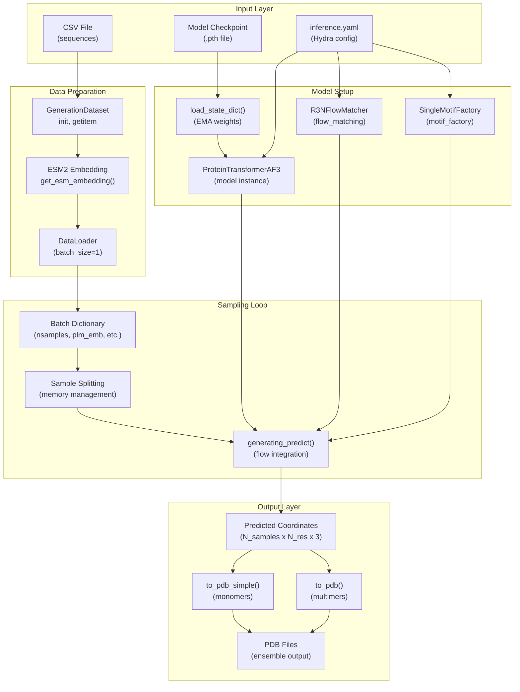
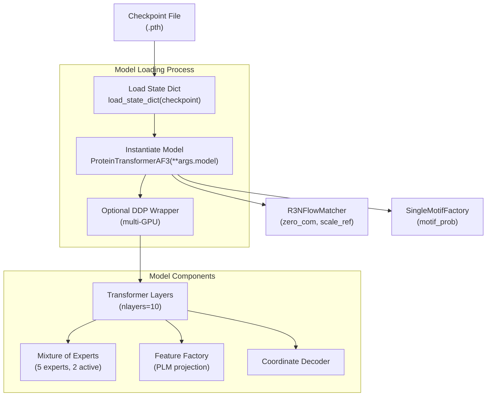
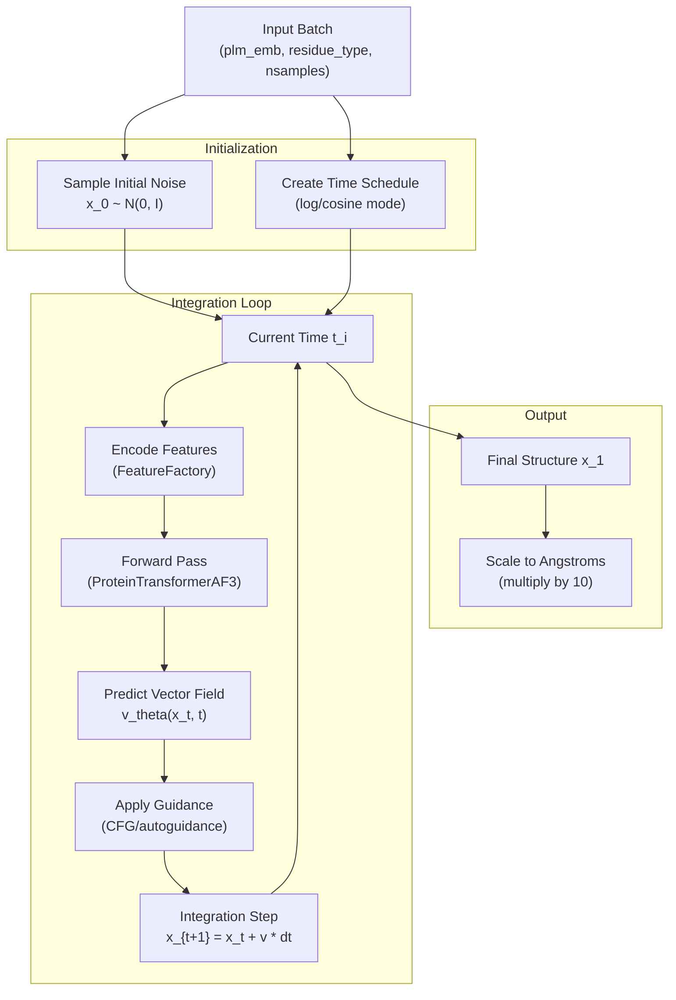
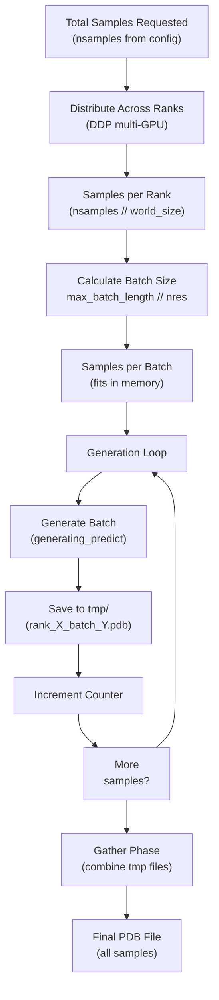
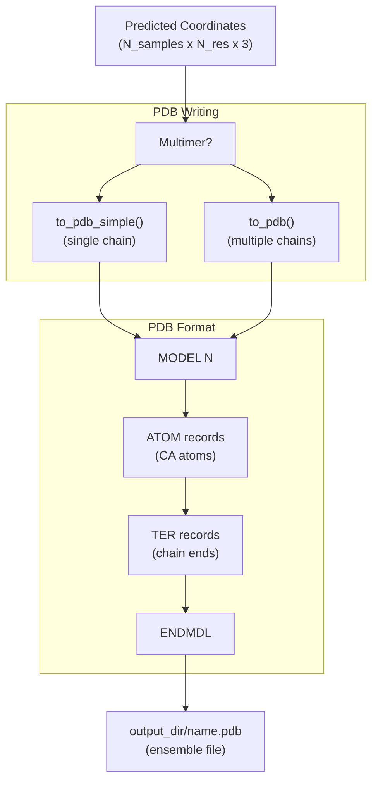

# Inference

> **Relevant source files**
> * [README.md](https://github.com/Junjie-Zhu/IDPFold2/blob/5315b279/README.md?plain=1)
> * [configs/inference.yaml](https://github.com/Junjie-Zhu/IDPFold2/blob/5315b279/configs/inference.yaml)
> * [src/inference.py](https://github.com/Junjie-Zhu/IDPFold2/blob/5315b279/src/inference.py)
> * [src/utils/pdb_utils.py](https://github.com/Junjie-Zhu/IDPFold2/blob/5315b279/src/utils/pdb_utils.py)

## Purpose and Scope

This page provides a complete guide to generating protein conformational ensembles using trained IDPFold2 models. Inference takes protein sequences as input and produces structural ensembles by sampling from the learned flow matching distribution. The inference pipeline handles data preparation, PLM embedding generation, iterative structure generation through the flow matcher, and PDB file output.

For details on specific subsystems:

* Inference pipeline mechanics: see [Inference Pipeline](/Junjie-Zhu/IDPFold2/7.1-inference-pipeline)
* Flow matching sampling details: see [Generating Predict Function](/Junjie-Zhu/IDPFold2/7.2-generating-predict-function)
* Guidance and conditioning: see [Guidance Mechanisms](/Junjie-Zhu/IDPFold2/7.3-guidance-mechanisms)
* Sampling configuration: see [Sampling Strategies](/Junjie-Zhu/IDPFold2/7.4-sampling-strategies)
* Distributed generation: see [Multi-Device Inference](/Junjie-Zhu/IDPFold2/7.5-multi-device-inference)
* Chain handling: see [Monomer and Multimer Generation](/Junjie-Zhu/IDPFold2/7.6-monomer-and-multimer-generation)
* Output formatting: see [PDB Output Generation](/Junjie-Zhu/IDPFold2/7.7-pdb-output-generation)

For training information, see [Training](/Junjie-Zhu/IDPFold2/6-training).

---

## Overview

The IDPFold2 inference system generates protein conformational ensembles by iteratively sampling from a flow matching model. Unlike training which learns the flow field by interpolating between noisy and ground-truth structures, inference starts from random noise and integrates the learned vector field to produce realistic protein conformations.

The inference process involves:

1. **Data Preparation**: Loading sequences and generating/loading PLM embeddings via `GenerationDataset`
2. **Model Setup**: Loading trained checkpoint with EMA weights into `ProteinTransformerAF3`
3. **Iterative Sampling**: Using `generating_predict` to integrate the flow field from noise to structure
4. **Ensemble Generation**: Producing multiple independent samples per protein
5. **Output Writing**: Converting predictions to PDB format with proper chain and model indexing

The main entry point is [src/inference.py](https://github.com/Junjie-Zhu/IDPFold2/blob/5315b279/src/inference.py)

(), which orchestrates the entire workflow using Hydra configuration management.

**Sources:** [src/inference.py L1-L370](https://github.com/Junjie-Zhu/IDPFold2/blob/5315b279/src/inference.py#L1-L370)

 [configs/inference.yaml L1-L103](https://github.com/Junjie-Zhu/IDPFold2/blob/5315b279/configs/inference.yaml#L1-L103)

 [README.md L65-L114](https://github.com/Junjie-Zhu/IDPFold2/blob/5315b279/README.md?plain=1#L65-L114)

---

## Inference System Architecture

The following diagram shows the high-level architecture of the inference system, mapping natural language concepts to code entities:



**Sources:** [src/inference.py L31-L157](https://github.com/Junjie-Zhu/IDPFold2/blob/5315b279/src/inference.py#L31-L157)

 [src/inference.py L167-L296](https://github.com/Junjie-Zhu/IDPFold2/blob/5315b279/src/inference.py#L167-L296)

 [src/model/integral.py](https://github.com/Junjie-Zhu/IDPFold2/blob/5315b279/src/model/integral.py)

---

## Inference Workflow

The complete inference workflow from input to output follows this sequence:

```mermaid
flowchart TD

START["main() Entry Point<br>[inference.py:168]"]
SETUP["Setup Phase"]
SETUP1["Create logging directory<br>[inference.py:169-181]"]
SETUP2["Initialize CUDA/CPU device<br>[inference.py:184-195]"]
SETUP3["Initialize DDP if multi-GPU<br>[inference.py:196-203]"]
DATA["Data Phase"]
DATA1["Instantiate GenerationDataset<br>[inference.py:211-217]"]
DATA2["Check PLM embeddings exist<br>[GenerationDataset.init:43-44]"]
DATA3["Generate embeddings if missing<br>[get_esm_embedding:118-156]"]
DATA4["Create DataLoader<br>[inference.py:218-222]"]
MODEL["Model Phase"]
MODEL1["Instantiate ProteinTransformerAF3<br>[inference.py:225]"]
MODEL2["Instantiate R3NFlowMatcher<br>[inference.py:226]"]
MODEL3["Instantiate SingleMotifFactory<br>[inference.py:227]"]
MODEL4["Load checkpoint weights<br>[inference.py:230-240]"]
MODEL5["Optionally load autoguidance model<br>[inference.py:246-253]"]
INFERENCE["Inference Loop"]
INF1["Iterate over DataLoader<br>[inference.py:258-261]"]
INF2["Move batch to device<br>[to_device:349-364]"]
INF3["Distribute samples across ranks<br>[inference.py:266-268]"]
INF4["Split by memory limit<br>[inference.py:271-276]"]
INF5["Call generating_predict()<br>[inference.py:281-295]"]
INF6["Convert to PDB format<br>[inference.py:298-311]"]
INF7["Save to tmp directory<br>[to_pdb_simple/to_pdb]"]
GATHER["Gathering Phase"]
GATHER1["Wait for all ranks (barrier)<br>[inference.py:319-320]"]
GATHER2["Rank 0: collect tmp files<br>[inference.py:322-342]"]
GATHER3["Combine into final PDB<br>[inference.py:328-340]"]
GATHER4["Clean up tmp files<br>[inference.py:342]"]
END["Cleanup<br>[inference.py:345-346]"]

START --> SETUP
SETUP --> SETUP1
SETUP1 --> SETUP2
SETUP2 --> SETUP3
SETUP3 --> DATA
DATA --> DATA1
DATA1 --> DATA2
DATA2 --> DATA3
DATA3 --> DATA4
DATA4 --> MODEL
MODEL --> MODEL1
MODEL1 --> MODEL2
MODEL2 --> MODEL3
MODEL3 --> MODEL4
MODEL4 --> MODEL5
MODEL5 --> INFERENCE
INFERENCE --> INF1
INF1 --> INF2
INF2 --> INF3
INF3 --> INF4
INF4 --> INF5
INF5 --> INF6
INF6 --> INF7
INF7 --> INF1
INF1 --> GATHER
GATHER --> GATHER1
GATHER1 --> GATHER2
GATHER2 --> GATHER3
GATHER3 --> GATHER4
GATHER4 --> END
```



**Sources:** [src/inference.py L167-L347](https://github.com/Junjie-Zhu/IDPFold2/blob/5315b279/src/inference.py#L167-L347)

---

## Key Components

### GenerationDataset

The `GenerationDataset` class handles data preparation for inference. It loads sequences from CSV files, manages PLM embeddings, and prepares batches for the model.

| Component | Location | Purpose |
| --- | --- | --- |
| `__init__` | [src/inference.py L32-L80](https://github.com/Junjie-Zhu/IDPFold2/blob/5315b279/src/inference.py#L32-L80) | Initialize dataset, check/generate PLM embeddings |
| `__getitem__` | [src/inference.py L85-L115](https://github.com/Junjie-Zhu/IDPFold2/blob/5315b279/src/inference.py#L85-L115) | Load PLM embeddings and create batch dictionary |
| `get_esm_embedding` | [src/inference.py L117-L156](https://github.com/Junjie-Zhu/IDPFold2/blob/5315b279/src/inference.py#L117-L156) | Generate ESM2 embeddings using pretrained model |
| `get_resid` | [src/inference.py L159-L164](https://github.com/Junjie-Zhu/IDPFold2/blob/5315b279/src/inference.py#L159-L164) | Convert sequence strings to residue type indices |

**Dataset Initialization:**

* Reads CSV with columns: `test_case` (name) and `sequence` (protein sequence)
* Checks if PLM embeddings exist in `plm_emb_dir`
* If missing, calls ESM2 model to generate embeddings
* Sorts sequences by length for efficient batching
* Handles both monomers and multimers (distinguished by `:` separator)

**Batch Dictionary Structure:**

```css
{    "dt": float,                      # Time step size    "nsamples": int,                  # Number of samples to generate    "nres": int,                      # Number of residues    "plm_emb": Tensor[N_res, 1280],  # PLM embeddings    "name": str,                      # System identifier    "residue_type": Tensor[N_res],   # Residue type indices    # For multimers only:    "residue_idx": Tensor[N_res],    # Residue indices per chain    "chains": Tensor[N_res],         # Chain assignment per residue}
```

**Sources:** [src/inference.py L31-L165](https://github.com/Junjie-Zhu/IDPFold2/blob/5315b279/src/inference.py#L31-L165)

---

### Model and Checkpoint Loading

The inference system loads trained models with specific configurations optimized for generation:



**Key Configuration Parameters:**

| Parameter | Value | Purpose |
| --- | --- | --- |
| `training` | `False` | Disable training-specific features |
| `nlayers` | `10` | Number of transformer layers |
| `nheads` | `12` | Multi-head attention heads |
| `token_dim` | `768` | Token embedding dimension |
| `use_moe` | `True` | Enable Mixture of Experts |
| `n_experts` | `5` | Total number of experts |
| `n_activated_experts` | `2` | Experts used per token |

**EMA Weights:** The checkpoint should contain EMA (Exponential Moving Average) weights from training, which provide more stable predictions than raw training weights. The checkpoint is loaded at [src/inference.py L230-L240](https://github.com/Junjie-Zhu/IDPFold2/blob/5315b279/src/inference.py#L230-L240)

**Auto-guidance Model:** Optionally, a second model can be loaded for auto-guidance, which combines predictions from two different checkpoints to improve quality [src/inference.py L246-L253](https://github.com/Junjie-Zhu/IDPFold2/blob/5315b279/src/inference.py#L246-L253)

**Sources:** [src/inference.py L224-L253](https://github.com/Junjie-Zhu/IDPFold2/blob/5315b279/src/inference.py#L224-L253)

 [configs/inference.yaml L48-L92](https://github.com/Junjie-Zhu/IDPFold2/blob/5315b279/configs/inference.yaml#L48-L92)

---

### Flow Matching Integration

The core of inference is the `generating_predict` function, which integrates the learned flow field to transform random noise into protein structures:



**Integration Process:**

1. **Initialize** random noise for each sample [src/model/integral.py](https://github.com/Junjie-Zhu/IDPFold2/blob/5315b279/src/model/integral.py)
2. **Schedule** time points from t=0 (noise) to t=1 (structure)
3. **Iterate** through time steps, predicting vector field at each step
4. **Update** coordinates using Euler/RK integration
5. **Apply** optional guidance to improve quality
6. **Return** final coordinates in nanometers

The flow matcher ensures that:

* Center of mass is preserved (if `zero_com=True`)
* Coordinates follow physical protein geometry
* Multiple samples are independent draws

**Sources:** [src/model/integral.py](https://github.com/Junjie-Zhu/IDPFold2/blob/5315b279/src/model/integral.py)

 [src/inference.py L281-L295](https://github.com/Junjie-Zhu/IDPFold2/blob/5315b279/src/inference.py#L281-L295)

 [configs/inference.yaml L32-L46](https://github.com/Junjie-Zhu/IDPFold2/blob/5315b279/configs/inference.yaml#L32-L46)

---

### Memory Management and Batching

Inference handles memory constraints by splitting large sample requests across multiple forward passes:



**Memory Management Logic:**

```markdown
# Calculate samples per batchnsamples_per_batch = max(1, args.max_batch_length // inference_dict['nres'][0]) # Split generation into batcheswhile nsamples_generated < nsamples_per_rank:    current_batch_size = min(nsamples_per_batch, nsamples_per_rank - nsamples_generated)    # Generate current batch    # Save to tmp file    nsamples_generated += current_batch_size
```

**Distributed Inference:**

* Each GPU rank handles `nsamples // world_size` samples
* Samples are further split by `max_batch_length` memory limit
* Temporary files stored as `{name}_rank_{rank}_batch_{idx}.pdb`
* Rank 0 gathers and combines all files into final output

**Sources:** [src/inference.py L266-L317](https://github.com/Junjie-Zhu/IDPFold2/blob/5315b279/src/inference.py#L266-L317)

---

## Configuration Parameters

The inference system is configured through `configs/inference.yaml` and can be overridden via command line:

### Essential Parameters

| Parameter | Default | Description |
| --- | --- | --- |
| `prefix` | `"DEFAULT"` | Output directory prefix |
| `csv_dir` | `null` | Path to input CSV file |
| `plm_emb_dir` | `null` | Directory for PLM embeddings |
| `ckpt_dir` | `null` | Path to model checkpoint |
| `nsamples` | `100` | Number of samples per protein |
| `max_batch_length` | `3500` | Maximum residues per batch |
| `dt` | `0.005` | Time step size |

### Conditioning Parameters

| Parameter | Default | Description |
| --- | --- | --- |
| `motif_conditioning` | `False` | Enable motif-based conditioning |
| `moe_conditioning` | `False` | Enable MoE-based conditioning |
| `self_conditioning` | `False` | Enable self-conditioning |
| `guidance_weight` | `1.0` | Classifier-free guidance weight |
| `autoguidance_ratio` | `0.0` | Auto-guidance vs CFG ratio |

### Sampling Configuration

| Parameter | Default | Description |
| --- | --- | --- |
| `sampling.sampling_mode` | `"vf"` | Sampling mode: `"vf"` or `"sc"` |
| `sampling.sc_scale_noise` | `0.0` | Noise scale for score mode |
| `sampling.gt_mode` | `"1/t"` | Guidance temperature mode |
| `schedule.schedule_mode` | `"log"` | Time schedule: `"log"` or `"cosine"` |
| `schedule.schedule_p` | `2.0` | Schedule power parameter |

### Multimer Parameters

| Parameter | Default | Description |
| --- | --- | --- |
| `load_multimer` | `False` | Enable multimer inference |

See [Sampling Strategies](/Junjie-Zhu/IDPFold2/7.4-sampling-strategies) for detailed parameter descriptions and [Guidance Mechanisms](/Junjie-Zhu/IDPFold2/7.3-guidance-mechanisms) for guidance options.

**Sources:** [configs/inference.yaml L1-L103](https://github.com/Junjie-Zhu/IDPFold2/blob/5315b279/configs/inference.yaml#L1-L103)

---

## PDB Output Format

Generated structures are saved in PDB format with proper MODEL/ENDMDL formatting for ensembles:



**Output Structure:**

* Each sample starts with `MODEL N` (N = 1, 2, 3, ...)
* Contains ATOM records for CA atoms only (coarse-grained)
* Coordinates scaled from nm to Ångströms (multiply by 10)
* Multimers include TER records between chains
* Each model ends with ENDMDL
* File ends with END

**Example Output:**

```
MODEL 1
ATOM      1  CA  MET A   1       1.234   2.345   3.456  1.00  0.00           C
ATOM      2  CA  ALA A   2       4.567   5.678   6.789  1.00  0.00           C
...
ENDMDL
MODEL 2
ATOM      1  CA  MET A   1       1.111   2.222   3.333  1.00  0.00           C
...
ENDMDL
END
```

**Sources:** [src/utils/pdb_utils.py L21-L107](https://github.com/Junjie-Zhu/IDPFold2/blob/5315b279/src/utils/pdb_utils.py#L21-L107)

 [src/inference.py L298-L311](https://github.com/Junjie-Zhu/IDPFold2/blob/5315b279/src/inference.py#L298-L311)

---

## Usage Examples

### Basic Monomer Inference

```
python src/inference.py \    prefix=MONOMER \    ckpt_dir=./checkpoints/IDPFold2_ema_0.999_260114.pth \    plm_emb_dir=./embeddings \    csv_dir=./data/input_sequences.csv \    nsamples=100 \    max_batch_length=6000
```

### Multimer Inference

```
python src/inference.py \    prefix=MULTIMER \    ckpt_dir=./checkpoints/IDPFold2_ema_0.999_260114.pth \    plm_emb_dir=./embeddings \    csv_dir=./data/multimer_sequences.csv \    nsamples=100 \    max_batch_length=6000 \    load_multimer=True
```

### Multi-GPU Inference

```
torchrun --nproc-per-node=4 src/inference.py \    prefix=DISTRIBUTED \    ckpt_dir=./checkpoints/IDPFold2_ema_0.999_260114.pth \    plm_emb_dir=./embeddings \    csv_dir=./data/input_sequences.csv \    nsamples=400
```

### Inference with Guidance

```
python src/inference.py \    prefix=GUIDED \    ckpt_dir=./checkpoints/IDPFold2_ema_0.999_260114.pth \    plm_emb_dir=./embeddings \    csv_dir=./data/input_sequences.csv \    guidance_weight=1.5 \    autoguidance_ratio=0.5 \    ag_dir=./checkpoints/autoguidance_model.pth
```

**Sources:** [README.md L65-L114](https://github.com/Junjie-Zhu/IDPFold2/blob/5315b279/README.md?plain=1#L65-L114)

---

## Inference vs Training Comparison

| Aspect | Training | Inference |
| --- | --- | --- |
| **Input** | Ground truth structures | Sequence only |
| **Data** | PDBDataModule with splits | GenerationDataset (no splits) |
| **Model Mode** | `training=True` | `training=False` |
| **Predict Function** | `training_predict` | `generating_predict` |
| **Time Sampling** | Random t ~ U(0,1) | Sequential schedule |
| **Direction** | Learns x₁ → x₀ flow | Samples x₀ → x₁ |
| **Batch Size** | 8-16 proteins | 1 protein, multiple samples |
| **Loss** | Flow matching + MoE | No loss computed |
| **Gradients** | Enabled | Disabled (`inference_mode`) |
| **Checkpoint** | Saves model + optimizer | Loads EMA weights only |
| **Output** | Checkpoints (.pth) | PDB structures |

**Sources:** [src/inference.py L167-L347](https://github.com/Junjie-Zhu/IDPFold2/blob/5315b279/src/inference.py#L167-L347)

 [src/train.py](https://github.com/Junjie-Zhu/IDPFold2/blob/5315b279/src/train.py)

---

## Next Steps

For detailed information about specific aspects of inference:

* **[Inference Pipeline](/Junjie-Zhu/IDPFold2/7.1-inference-pipeline)**: Detailed execution flow and loop mechanics
* **[Generating Predict Function](/Junjie-Zhu/IDPFold2/7.2-generating-predict-function)**: Flow integration implementation
* **[Guidance Mechanisms](/Junjie-Zhu/IDPFold2/7.3-guidance-mechanisms)**: Classifier-free and auto-guidance details
* **[Sampling Strategies](/Junjie-Zhu/IDPFold2/7.4-sampling-strategies)**: Schedule modes and sampling parameters
* **[Multi-Device Inference](/Junjie-Zhu/IDPFold2/7.5-multi-device-inference)**: Distributed generation with torchrun
* **[Monomer and Multimer Generation](/Junjie-Zhu/IDPFold2/7.6-monomer-and-multimer-generation)**: Chain handling specifics
* **[PDB Output Generation](/Junjie-Zhu/IDPFold2/7.7-pdb-output-generation)**: Output formatting details

For evaluation of generated ensembles, see [Evaluation and Analysis](/Junjie-Zhu/IDPFold2/8-evaluation-and-analysis).