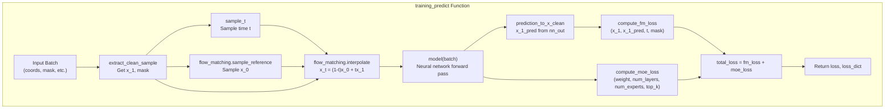
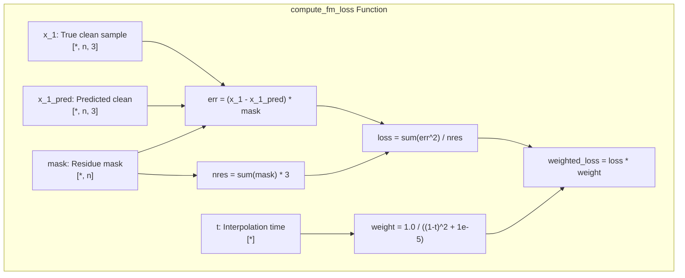
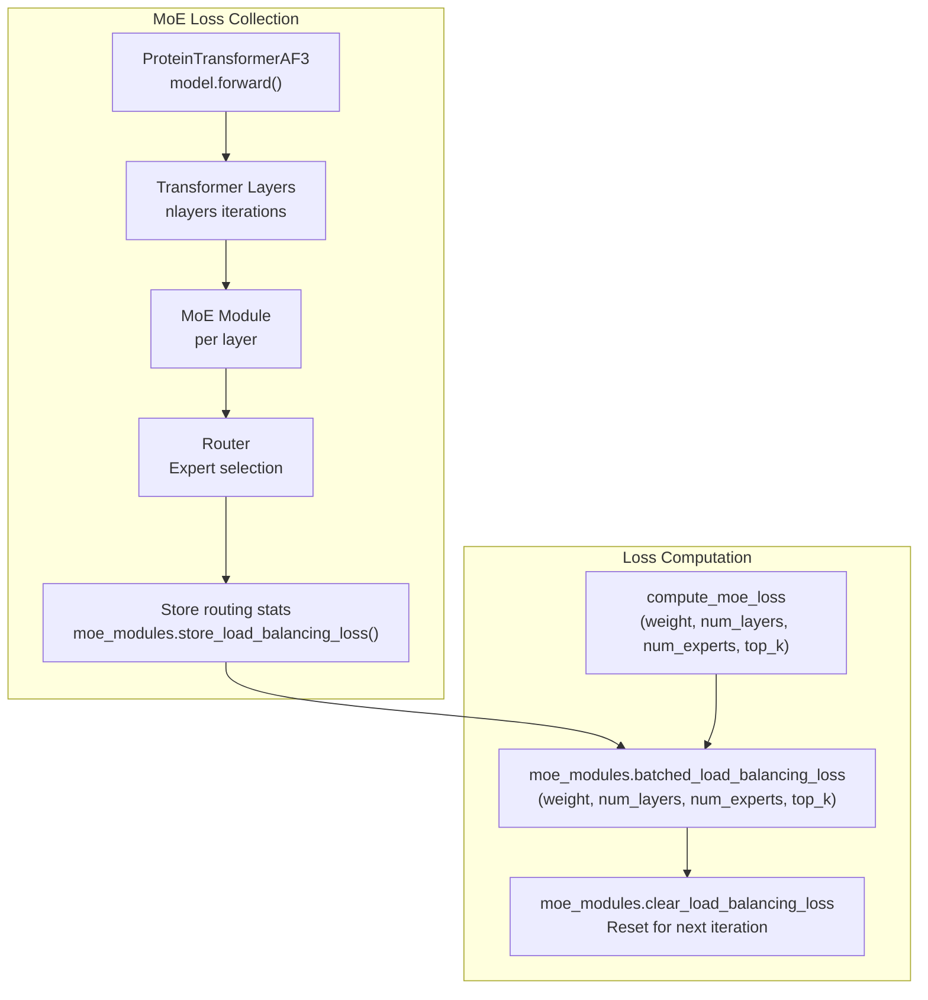
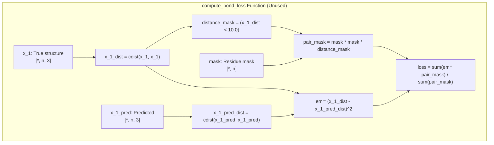
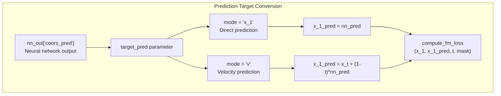
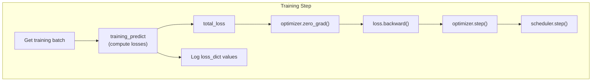

# Loss Functions

> **Relevant source files**
> * [configs/train.yaml](https://github.com/Junjie-Zhu/IDPFold2/blob/5315b279/configs/train.yaml)
> * [src/model/components/feature_factory.py](https://github.com/Junjie-Zhu/IDPFold2/blob/5315b279/src/model/components/feature_factory.py)
> * [src/model/integral.py](https://github.com/Junjie-Zhu/IDPFold2/blob/5315b279/src/model/integral.py)
> * [src/train.py](https://github.com/Junjie-Zhu/IDPFold2/blob/5315b279/src/train.py)

This page documents the loss functions used during IDPFold2 model training. The system employs multiple loss terms to optimize the generative flow matching model: a primary **Flow Matching Loss** that drives the generative modeling objective, and an auxiliary **MoE Load Balancing Loss** that ensures efficient utilization of the Mixture of Experts architecture.

For information about the training pipeline that uses these losses, see [Training Pipeline](/Junjie-Zhu/IDPFold2/6.1-training-pipeline). For details on the flow matching framework, see [Flow Matching Framework](/Junjie-Zhu/IDPFold2/5.3-flow-matching-framework). For MoE architecture details, see [Mixture of Experts](/Junjie-Zhu/IDPFold2/5.2-mixture-of-experts).

## Overview

IDPFold2's training objective combines two loss terms:

| Loss Term | Weight | Purpose | Status |
| --- | --- | --- | --- |
| Flow Matching Loss | 1.0 (fixed) | Primary generative modeling objective | Active |
| MoE Load Balancing Loss | 0.3 (configurable) | Ensure balanced expert utilization | Active |
| Bond Loss | Not used | Distance preservation (implemented but unused) | Inactive |

The total loss is computed as:

```
total_loss = fm_loss + moe_loss_weight * moe_loss
```

**Sources:** [src/model/integral.py L296-L320](https://github.com/Junjie-Zhu/IDPFold2/blob/5315b279/src/model/integral.py#L296-L320)

 [configs/train.yaml L29-L30](https://github.com/Junjie-Zhu/IDPFold2/blob/5315b279/configs/train.yaml#L29-L30)

## Loss Computation Flow



**Sources:** [src/model/integral.py L238-L320](https://github.com/Junjie-Zhu/IDPFold2/blob/5315b279/src/model/integral.py#L238-L320)

 [src/train.py L258-L270](https://github.com/Junjie-Zhu/IDPFold2/blob/5315b279/src/train.py#L258-L270)

## Flow Matching Loss

The Flow Matching Loss is the primary training objective that teaches the model to predict clean protein structures from noisy intermediate states.

### Mathematical Formulation

The loss compares the true clean structure (`x_1`) with the model's predicted clean structure (`x_1_pred`):

```
loss_per_sample = ||x_1 - x_1_pred||^2 / (3 * num_residues)
weighted_loss = loss_per_sample * weight(t)
```

Where the time-dependent weight is:

```
weight(t) = 1.0 / ((1.0 - t)^2 + 1e-5)
```

This weighting scheme assigns higher importance to predictions at later times (larger `t`), when the model must make finer-grained predictions closer to the clean structure.

### Implementation Details



The function performs the following steps:

1. **Compute residue count**: `nres = sum(mask) * 3` accounts for the 3 coordinates per residue [src/model/integral.py L192](https://github.com/Junjie-Zhu/IDPFold2/blob/5315b279/src/model/integral.py#L192-L192)
2. **Compute error**: `err = (x_1 - x_1_pred) * mask` masks out padding [src/model/integral.py L194](https://github.com/Junjie-Zhu/IDPFold2/blob/5315b279/src/model/integral.py#L194-L194)
3. **Compute base loss**: Sum squared errors and normalize by residue count [src/model/integral.py L195](https://github.com/Junjie-Zhu/IDPFold2/blob/5315b279/src/model/integral.py#L195-L195)
4. **Apply time weighting**: Weight by `1.0 / ((1.0 - t)^2 + 1e-5)` [src/model/integral.py L197](https://github.com/Junjie-Zhu/IDPFold2/blob/5315b279/src/model/integral.py#L197-L197)
5. **Return weighted loss**: Final loss value [src/model/integral.py L199](https://github.com/Junjie-Zhu/IDPFold2/blob/5315b279/src/model/integral.py#L199-L199)

**Key Implementation Details:**

* Loss is computed in nanometers (nm) since coordinates are converted via `ang_to_nm` before training [src/model/integral.py L166](https://github.com/Junjie-Zhu/IDPFold2/blob/5315b279/src/model/integral.py#L166-L166)
* The mask ensures padding residues don't contribute to the loss
* The `1e-5` epsilon prevents division by zero when `t` is close to 1
* Loss is averaged over the batch in `training_predict` [src/model/integral.py L297](https://github.com/Junjie-Zhu/IDPFold2/blob/5315b279/src/model/integral.py#L297-L297)

**Sources:** [src/model/integral.py L174-L200](https://github.com/Junjie-Zhu/IDPFold2/blob/5315b279/src/model/integral.py#L174-L200)

 [src/model/integral.py L296-L297](https://github.com/Junjie-Zhu/IDPFold2/blob/5315b279/src/model/integral.py#L296-L297)

## MoE Load Balancing Loss

The Mixture of Experts (MoE) architecture requires an auxiliary loss to ensure experts are utilized evenly across training examples. Without this loss, some experts may be underutilized while others become overloaded.

### Purpose and Mechanism

The MoE load balancing loss:

1. **Tracks expert selection**: Monitors which experts are chosen by the router for each token
2. **Penalizes imbalance**: Adds a loss term when expert usage is uneven
3. **Encourages diversity**: Ensures all experts develop specialized capabilities

### Integration Points



**Sources:** [src/model/integral.py L232-L235](https://github.com/Junjie-Zhu/IDPFold2/blob/5315b279/src/model/integral.py#L232-L235)

 [src/model/integral.py L307-L314](https://github.com/Junjie-Zhu/IDPFold2/blob/5315b279/src/model/integral.py#L307-L314)

 [src/model/components/moe_modules.py](https://github.com/Junjie-Zhu/IDPFold2/blob/5315b279/src/model/components/moe_modules.py)

### Configuration and Weighting

The MoE loss weight is configurable via the training configuration:

```yaml
loss:  moe_loss_weight: 0.3  # empirically chosen
```

This weight is passed to `training_predict` and applied to the computed MoE loss [src/train.py L269](https://github.com/Junjie-Zhu/IDPFold2/blob/5315b279/src/train.py#L269-L269)

 [src/model/integral.py L308-L312](https://github.com/Junjie-Zhu/IDPFold2/blob/5315b279/src/model/integral.py#L308-L312)

 The value of 0.3 is empirically chosen to balance expert utilization without dominating the primary flow matching objective.

**Important:** During validation, the MoE capacity constraint is disabled (`force_moe_capacity=False`) to allow full model expressiveness without capacity limits [src/train.py L321](https://github.com/Junjie-Zhu/IDPFold2/blob/5315b279/src/train.py#L321-L321)

**Sources:** [configs/train.yaml L29-L30](https://github.com/Junjie-Zhu/IDPFold2/blob/5315b279/configs/train.yaml#L29-L30)

 [src/train.py L217-L218](https://github.com/Junjie-Zhu/IDPFold2/blob/5315b279/src/train.py#L217-L218)

 [src/train.py L269](https://github.com/Junjie-Zhu/IDPFold2/blob/5315b279/src/train.py#L269-L269)

 [src/model/integral.py L298-L314](https://github.com/Junjie-Zhu/IDPFold2/blob/5315b279/src/model/integral.py#L298-L314)

## Bond Loss (Unused)

The codebase includes a `compute_bond_loss` function that measures the difference in pairwise distances between true and predicted structures. However, this loss is **not currently used** in the training pipeline.

### Implementation



The bond loss:

* Computes all pairwise distances in both true and predicted structures
* Focuses on nearby residues (within 10.0 nm)
* Measures squared difference in distance matrices
* Is **not called** in the current `training_predict` implementation

**Sources:** [src/model/integral.py L203-L229](https://github.com/Junjie-Zhu/IDPFold2/blob/5315b279/src/model/integral.py#L203-L229)

## Loss Combination in Training

### Training Predict Function

The `training_predict` function orchestrates loss computation during training:

```mermaid
flowchart TD

START["training_predict<br>Entry point"]
CLEAN["extract_clean_sample<br>Get x_1, mask from batch"]
TIME["sample_t<br>Sample interpolation time"]
INTERP["Interpolation<br>x_t = (1-t)x_0 + tx_1"]
COND["Optional Conditioning"]
MOTIF["motif_factory<br>(if motif_conditioning)"]
MOE_COND["moe_factory<br>(if moe_conditioning)"]
SELF_COND["self_conditioning<br>(if self_conditioning)"]
FORWARD["model.forward(batch)"]
CONVERT["prediction_to_x_clean<br>Convert to x_1_pred"]
FM["compute_fm_loss"]
MOE["compute_moe_loss<br>(if moe_loss_weight != 0)"]
SUM["total_loss = fm_loss + moe_loss"]
DICT["loss_dict = {'fm_loss': ..., 'moe_loss': ...}"]
RETURN["return total_loss, loss_dict"]

subgraph subGraph0 ["Loss Computation Pipeline"]
    START
    CLEAN
    TIME
    INTERP
    COND
    MOTIF
    MOE_COND
    SELF_COND
    FORWARD
    CONVERT
    FM
    MOE
    SUM
    DICT
    RETURN
    START --> CLEAN
    CLEAN --> TIME
    TIME --> INTERP
    INTERP --> COND
    COND --> MOTIF
    COND --> MOE_COND
    COND --> SELF_COND
    MOTIF --> FORWARD
    MOE_COND --> FORWARD
    SELF_COND --> FORWARD
    FORWARD --> CONVERT
    CONVERT --> FM
    FORWARD --> MOE
    FM --> SUM
    MOE --> SUM
    SUM --> DICT
    DICT --> RETURN
end
```



**Sources:** [src/model/integral.py L238-L320](https://github.com/Junjie-Zhu/IDPFold2/blob/5315b279/src/model/integral.py#L238-L320)

### Loss Dictionary

The function returns both the total loss (for backpropagation) and a dictionary of individual loss components (for logging):

```
loss_dict = {    "fm_loss": fm_loss.item(),    "moe_loss": moe_loss.item(),}return fm_loss + moe_loss, loss_dict
```

This dictionary is used by the training loop to display per-step loss information [src/train.py L282](https://github.com/Junjie-Zhu/IDPFold2/blob/5315b279/src/train.py#L282-L282)

**Sources:** [src/model/integral.py L316-L320](https://github.com/Junjie-Zhu/IDPFold2/blob/5315b279/src/model/integral.py#L316-L320)

 [src/train.py L282](https://github.com/Junjie-Zhu/IDPFold2/blob/5315b279/src/train.py#L282-L282)

## Configuration Parameters

### Training Configuration

Loss-related parameters in `configs/train.yaml`:

| Parameter | Default | Description |
| --- | --- | --- |
| `loss.moe_loss_weight` | 0.3 | Weight for MoE load balancing loss |
| `target_pred` | "v" | Prediction target: "v" (velocity) or "x_1" (clean structure) |
| `motif_conditioning` | False | Enable motif-based conditioning during training |
| `moe_conditioning` | False | Enable MoE-based conditioning |
| `self_conditioning` | False | Enable self-conditioning (50% probability) |

**Sources:** [configs/train.yaml L5](https://github.com/Junjie-Zhu/IDPFold2/blob/5315b279/configs/train.yaml#L5-L5)

 [configs/train.yaml L11-L13](https://github.com/Junjie-Zhu/IDPFold2/blob/5315b279/configs/train.yaml#L11-L13)

 [configs/train.yaml L29-L30](https://github.com/Junjie-Zhu/IDPFold2/blob/5315b279/configs/train.yaml#L29-L30)

### Noise Sampling Configuration

The time sampling distribution affects loss weighting behavior:

| Parameter | Default | Description |
| --- | --- | --- |
| `noise.mode` | "mix_up02_beta" | Time sampling mode |
| `noise.p1` | 1.9 | Beta distribution parameter 1 |
| `noise.p2` | 1.0 | Beta distribution parameter 2 |

The `mix_up02_beta` mode samples from a beta distribution 98% of the time and uniform distribution 2% of the time, providing exploration at all time scales [src/model/integral.py L107-L114](https://github.com/Junjie-Zhu/IDPFold2/blob/5315b279/src/model/integral.py#L107-L114)

**Sources:** [configs/train.yaml L24-L27](https://github.com/Junjie-Zhu/IDPFold2/blob/5315b279/configs/train.yaml#L24-L27)

 [src/model/integral.py L93-L118](https://github.com/Junjie-Zhu/IDPFold2/blob/5315b279/src/model/integral.py#L93-L118)

## Prediction Target Modes

The loss computation depends on the `target_pred` parameter, which determines what the neural network predicts:



* **"x_1" mode**: Network directly predicts the clean structure
* **"v" mode** (default): Network predicts the velocity field, converted to clean structure via `x_1_pred = x_t + (1-t)*v` [src/model/integral.py L33](https://github.com/Junjie-Zhu/IDPFold2/blob/5315b279/src/model/integral.py#L33-L33)

**Sources:** [src/model/integral.py L25-L38](https://github.com/Junjie-Zhu/IDPFold2/blob/5315b279/src/model/integral.py#L25-L38)

 [configs/train.yaml L5](https://github.com/Junjie-Zhu/IDPFold2/blob/5315b279/configs/train.yaml#L5-L5)

## Usage in Training Loop

The losses are computed and applied in the main training loop:



The training loop accumulates epoch loss by averaging over all steps [src/train.py L277-L285](https://github.com/Junjie-Zhu/IDPFold2/blob/5315b279/src/train.py#L277-L285)

:

**Sources:** [src/train.py L258-L282](https://github.com/Junjie-Zhu/IDPFold2/blob/5315b279/src/train.py#L258-L282)

 [src/train.py L272-L275](https://github.com/Junjie-Zhu/IDPFold2/blob/5315b279/src/train.py#L272-L275)