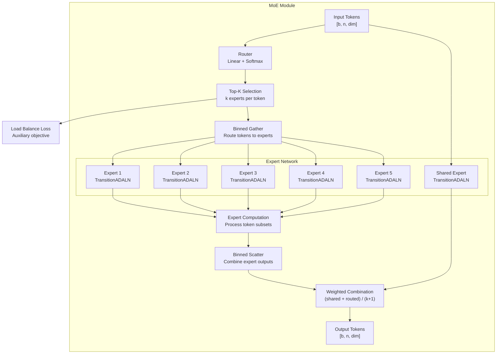
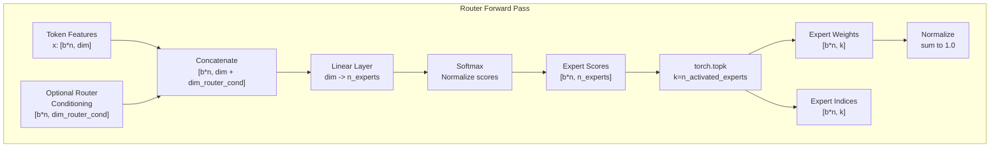
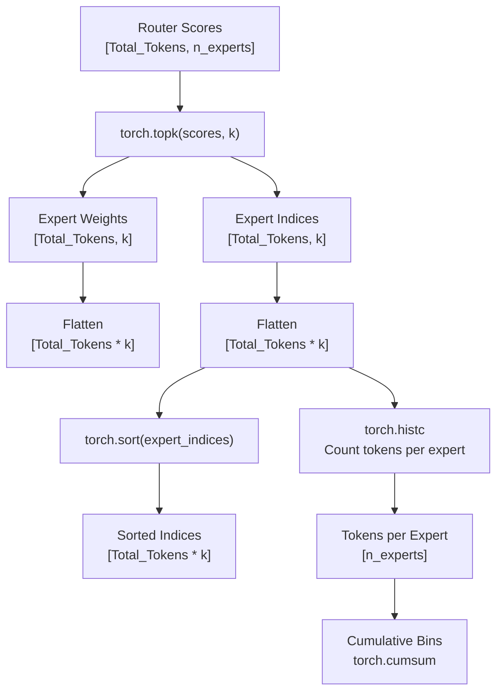
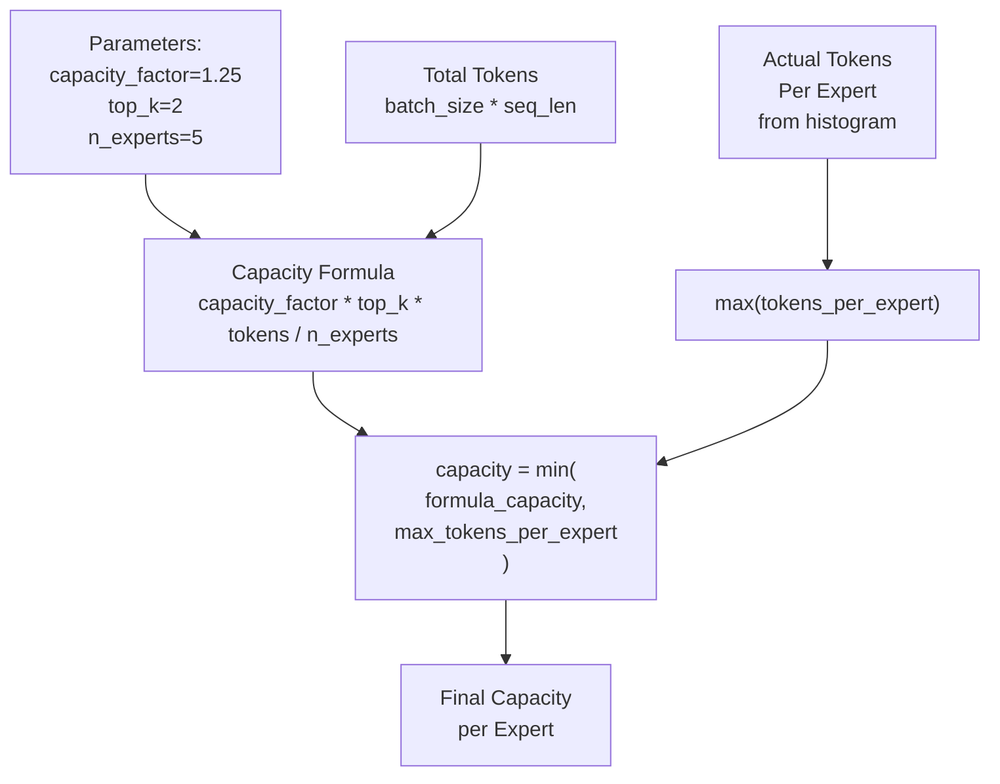
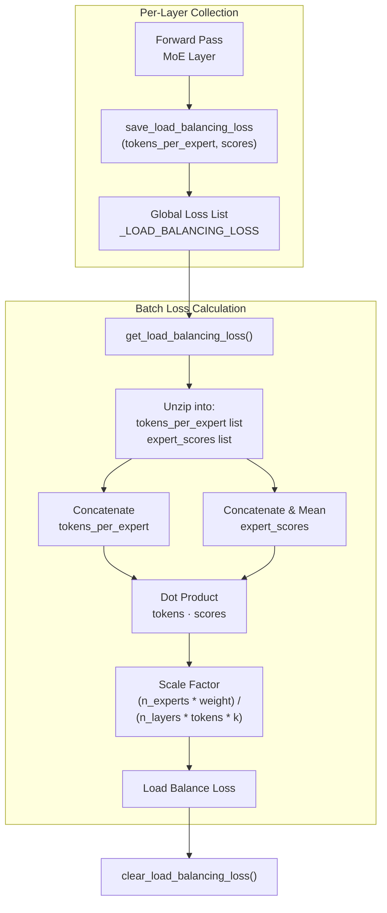
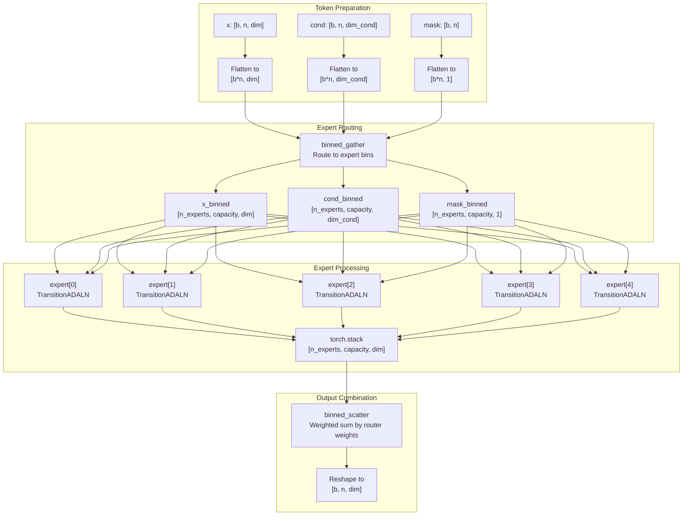
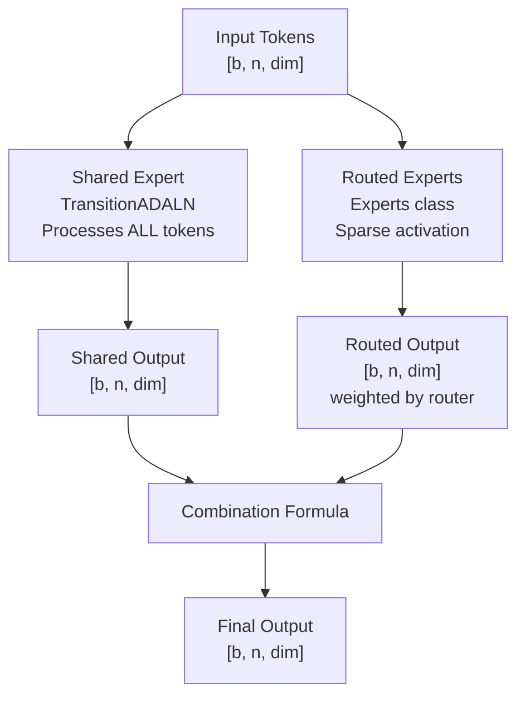
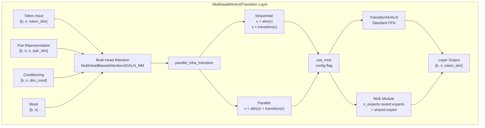
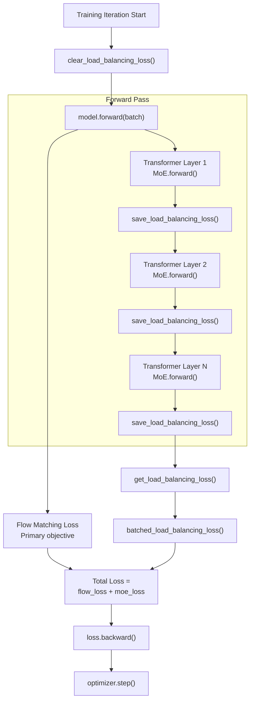

# Mixture of Experts

> **Relevant source files**
> * [environment.yaml](https://github.com/Junjie-Zhu/IDPFold2/blob/5315b279/environment.yaml)
> * [src/model/components/moe_modules.py](https://github.com/Junjie-Zhu/IDPFold2/blob/5315b279/src/model/components/moe_modules.py)
> * [src/model/components/moe_modules_torch.py](https://github.com/Junjie-Zhu/IDPFold2/blob/5315b279/src/model/components/moe_modules_torch.py)
> * [src/model/components/moe_operations.py](https://github.com/Junjie-Zhu/IDPFold2/blob/5315b279/src/model/components/moe_operations.py)
> * [src/model/protein_transformer.py](https://github.com/Junjie-Zhu/IDPFold2/blob/5315b279/src/model/protein_transformer.py)
> * [src/utils/dense_dataloader_utils.py](https://github.com/Junjie-Zhu/IDPFold2/blob/5315b279/src/utils/dense_dataloader_utils.py)

## Purpose and Scope

This document describes the Mixture of Experts (MoE) implementation in IDPFold2, which provides conditional computation in the transformer architecture through sparse expert activation. The MoE system replaces standard feed-forward layers (Transition layers) with a collection of specialized expert networks, where only a subset of experts process each token based on learned routing decisions.

For information about the overall model architecture, see [ProteinTransformerAF3](/Junjie-Zhu/IDPFold2/5.1-proteintransformeraf3). For details on the flow matching training process that uses MoE, see [Flow Matching Framework](/Junjie-Zhu/IDPFold2/5.3-flow-matching-framework).

---

## Overview

The Mixture of Experts mechanism enables the model to scale capacity without proportionally increasing computational cost. Instead of processing all tokens through a single large feed-forward network, MoE routes each token to a small number of specialized experts from a larger pool. This architecture provides:

* **Conditional Computation**: Different tokens activate different expert subsets
* **Increased Model Capacity**: More parameters without increased per-token computation
* **Specialization**: Experts can learn to handle different protein structure patterns
* **Load Balancing**: Auxiliary loss ensures even expert utilization

IDPFold2 implements MoE with a shared expert that processes all tokens plus multiple routed experts that process token subsets. The default configuration uses 5 experts with 2 activated per token.

**Sources**: [src/model/components/moe_modules_torch.py L48-L107](https://github.com/Junjie-Zhu/IDPFold2/blob/5315b279/src/model/components/moe_modules_torch.py#L48-L107)

 [src/model/protein_transformer.py L194-L239](https://github.com/Junjie-Zhu/IDPFold2/blob/5315b279/src/model/protein_transformer.py#L194-L239)

---

## Architecture Components

The MoE system consists of four main components that work together to implement sparse expert activation:



**MoE Component Breakdown**:

| Component | Class/Function | Purpose |
| --- | --- | --- |
| Router | `MoE.router_linear` | Maps tokens to expert scores |
| Top-K Selection | `MoE._top_k` | Selects k experts per token |
| Shared Expert | `MoE.shared_expert` | Processes all tokens |
| Expert Collection | `Experts` class | Manages routed experts |
| Token Routing | `binned_gather` | Groups tokens by expert assignment |
| Expert Computation | `Experts.permute_and_compute` | Processes token subsets |
| Output Combination | `binned_scatter` | Merges expert outputs |

**Sources**: [src/model/components/moe_modules_torch.py L48-L107](https://github.com/Junjie-Zhu/IDPFold2/blob/5315b279/src/model/components/moe_modules_torch.py#L48-L107)

 [src/model/components/moe_modules_torch.py L109-L141](https://github.com/Junjie-Zhu/IDPFold2/blob/5315b279/src/model/components/moe_modules_torch.py#L109-L141)

---

## Router Mechanism

The router determines which experts process each token through learned scoring and top-k selection:



### Router Implementation

The router consists of a linear projection followed by softmax normalization:

```yaml
Router Architecture:
  Input: [batch * num_tokens, token_dim + router_cond_dim]
  Linear: (token_dim + router_cond_dim) -> n_experts (no bias)
  Softmax: Normalize along expert dimension
  Output: [batch * num_tokens, n_experts] scores
```

**Key Router Parameters**:

| Parameter | Default | Description |
| --- | --- | --- |
| `dim` | `token_dim` | Input token dimension |
| `dim_router_cond` | 0 | Optional conditioning dimension |
| `n_experts` | 5 | Total number of experts |
| `n_activated_experts` | 2 | Number of experts activated per token (k) |
| `normalize_expert_weights` | True | Normalize weights to sum to 1.0 |

The router can optionally use additional conditioning information (e.g., structural features) to inform routing decisions. When `dim_router_cond > 0`, the router concatenates this conditioning with token features before scoring.

**Sources**: [src/model/components/moe_modules_torch.py L88-L96](https://github.com/Junjie-Zhu/IDPFold2/blob/5315b279/src/model/components/moe_modules_torch.py#L88-L96)

 [src/model/components/moe_modules_torch.py L70-L73](https://github.com/Junjie-Zhu/IDPFold2/blob/5315b279/src/model/components/moe_modules_torch.py#L70-L73)

---

## Expert Selection and Token Routing

After the router produces expert scores, the system routes tokens to their assigned experts through a multi-step process:

### Top-K Selection



### Binned Gather Operation

The `binned_gather` function groups tokens by their expert assignments:

**Algorithm**:

1. Flatten expert weights and indices across all tokens
2. Sort tokens by assigned expert index
3. Compute histogram of tokens per expert
4. Calculate cumulative bin boundaries
5. Gather tokens into expert-specific bins with capacity limits

```yaml
Binned Gather:
  Input: x [Total_Tokens, dim], indices [Total_Tokens * k]
  Expert Capacity: capacity_factor * k * Total_Tokens / n_experts
  Output: x_binned [n_experts, capacity, dim]
  
  Each expert receives up to 'capacity' tokens
  Tokens beyond capacity are dropped
```

**Sources**: [src/model/components/moe_modules_torch.py L172-L182](https://github.com/Junjie-Zhu/IDPFold2/blob/5315b279/src/model/components/moe_modules_torch.py#L172-L182)

 [src/model/components/moe_operations.py L3-L17](https://github.com/Junjie-Zhu/IDPFold2/blob/5315b279/src/model/components/moe_operations.py#L3-L17)

---

## Capacity Management

Expert capacity determines the maximum number of tokens each expert can process, preventing memory overflow and load imbalance:

### Capacity Calculation



### Capacity Modes

The system supports two capacity enforcement modes controlled by the `force_capacity` parameter:

| Mode | Setting | Behavior |
| --- | --- | --- |
| **Forced Capacity** | `force_capacity=True` | Use formula-based capacity with upper bound from actual distribution |
| **Dynamic Capacity** | `force_capacity=False` | Use maximum tokens assigned to any expert |

**Forced Capacity Calculation**:

```
formula_capacity = capacity_factor * top_k * total_tokens / n_experts
actual_max = max(tokens_per_expert)
final_capacity = min(formula_capacity, actual_max)
```

This ensures:

* Memory usage stays bounded by `capacity_factor`
* No unnecessary padding when load is already balanced
* Graceful handling of imbalanced routing

**Token Dropping**: When tokens exceed an expert's capacity, they are dropped from that expert's computation. With the shared expert always processing all tokens, this provides a fallback computation path.

**Sources**: [src/model/components/moe_modules_torch.py L142-L170](https://github.com/Junjie-Zhu/IDPFold2/blob/5315b279/src/model/components/moe_modules_torch.py#L142-L170)

 [src/model/components/moe_modules_torch.py L169-L170](https://github.com/Junjie-Zhu/IDPFold2/blob/5315b279/src/model/components/moe_modules_torch.py#L169-L170)

---

## Load Balancing

Load balancing ensures tokens are distributed evenly across experts, preventing expert underutilization and routing collapse:

### Load Balance Loss Computation



### Load Balance Loss Formula

The auxiliary loss encourages uniform expert utilization:

```yaml
LoadBalanceLoss = scale * Σ(tokens_per_expert[i] * mean_score[i])

where:
  scale = (n_experts * moe_loss_weight) / (n_layers * total_tokens * top_k)
  tokens_per_expert[i] = number of tokens assigned to expert i
  mean_score[i] = mean router score for expert i across all tokens
```

**Intuition**: The loss is high when experts with high router scores also receive many tokens. This creates pressure to:

* Distribute tokens more evenly across experts
* Reduce confidence in routing decisions (flatten scores)
* Prevent routing collapse to a few dominant experts

### Global Loss Management

The load balance loss uses a global accumulator pattern:

```markdown
# During forward passes (each MoE layer)save_load_balancing_loss((tokens_per_expert, expert_scores)) # After full forward passloss = batched_load_balancing_loss(moe_loss_weight, num_layers, num_experts, top_k) # After backward passclear_load_balancing_loss()
```

**Sources**: [src/model/components/moe_modules_torch.py L9-L45](https://github.com/Junjie-Zhu/IDPFold2/blob/5315b279/src/model/components/moe_modules_torch.py#L9-L45)

 [src/model/components/moe_modules_torch.py L136-L137](https://github.com/Junjie-Zhu/IDPFold2/blob/5315b279/src/model/components/moe_modules_torch.py#L136-L137)

---

## Expert Computation

After tokens are routed to experts, each expert processes its assigned token subset independently:

### Expert Forward Pass



### Expert Module Structure

Each expert is a `TransitionADALN` module with the following architecture:

```yaml
TransitionADALN:
  1. AdaptiveLayerNorm(x, cond, mask)
  2. Transition(x, mask):
     - Linear(dim -> expansion_factor * dim)
     - SiLU activation
     - Linear(expansion_factor * dim -> dim)
  3. AdaptiveLayerNormOutputScale(x, cond, mask)
```

All experts share the same architecture but have independent parameters, allowing each to specialize during training.

**Sources**: [src/model/components/moe_modules_torch.py L209-L215](https://github.com/Junjie-Zhu/IDPFold2/blob/5315b279/src/model/components/moe_modules_torch.py#L209-L215)

 [src/model/protein_transformer.py L136-L161](https://github.com/Junjie-Zhu/IDPFold2/blob/5315b279/src/model/protein_transformer.py#L136-L161)

 [src/model/protein_transformer.py L226-L228](https://github.com/Junjie-Zhu/IDPFold2/blob/5315b279/src/model/protein_transformer.py#L226-L228)

---

## Shared Expert and Output Combination

The MoE module uses a shared expert alongside routed experts to ensure robust computation:

### Combination Strategy



### Combination Formula

The system offers two combination modes based on `normalize_expert_weights`:

**With Normalization** (default, `normalize_expert_weights=True`):

```yaml
output = (shared_output + routed_output * k) / (k + 1)

where:
  k = n_activated_experts (typically 2)
  routed_output is weighted by normalized router scores
```

**Without Normalization** (`normalize_expert_weights=False`):

```yaml
output = shared_output + routed_output

where:
  routed_output is weighted by raw router scores
```

### Rationale

The shared expert provides several benefits:

* **Baseline Processing**: All tokens receive computation even if routing fails
* **Training Stability**: Gradients always flow through shared expert
* **Graceful Degradation**: If capacity limits drop tokens, shared expert maintains coverage
* **Specialization Support**: Routed experts can focus on specific patterns while shared expert handles common features

**Sources**: [src/model/components/moe_modules_torch.py L76-L86](https://github.com/Junjie-Zhu/IDPFold2/blob/5315b279/src/model/components/moe_modules_torch.py#L76-L86)

 [src/model/components/moe_modules_torch.py L62-L63](https://github.com/Junjie-Zhu/IDPFold2/blob/5315b279/src/model/components/moe_modules_torch.py#L62-L63)

---

## Integration with ProteinTransformerAF3

The MoE module integrates seamlessly into the transformer architecture by replacing standard transition layers:

### Transformer Layer Integration



### MoE Layer Construction

In the `ProteinTransformerAF3` model, each transformer layer is a `MultiheadAttnAndTransition` module that conditionally uses MoE:

```markdown
# From protein_transformer.py lines 221-239if not use_moe:    self.transition = TransitionADALN(        dim=dim_token,         dim_cond=dim_cond,         expansion_factor=expansion_factor    )else:    single_expert = TransitionADALN(        dim=dim_token,         dim_cond=dim_cond,         expansion_factor=expansion_factor    )    self.transition = MoE(        n_experts=n_experts,        n_activated_experts=n_activated_experts,        expert=single_expert,        dim=dim_token,        dim_router_cond=dim_moe_cond,        capacity_factor=capacity_factor,        normalize_expert_weights=normalize_expert_weights,        load_balance=load_balance,    )
```

**Sources**: [src/model/protein_transformer.py L164-L273](https://github.com/Junjie-Zhu/IDPFold2/blob/5315b279/src/model/protein_transformer.py#L164-L273)

 [src/model/protein_transformer.py L221-L239](https://github.com/Junjie-Zhu/IDPFold2/blob/5315b279/src/model/protein_transformer.py#L221-L239)

---

## Configuration Parameters

### Model-Level MoE Configuration

The following table lists all MoE-related parameters in the model configuration:

| Parameter | Type | Default | Description |
| --- | --- | --- | --- |
| `use_moe` | bool | True | Enable MoE in transformer layers |
| `n_experts` | int | 5 | Total number of routed experts |
| `n_activated_experts` | int | 2 | Number of experts activated per token (top-k) |
| `dim_moe_cond` | int | 0 | Dimension for optional router conditioning |
| `capacity_factor` | float | 1.25 | Expert capacity multiplier |
| `normalize_expert_weights` | bool | True | Normalize router weights to sum to 1.0 |
| `training` | bool | True/False | Enable load balancing loss during training |

### Layer-Specific Configuration

Each `MultiheadAttnAndTransition` layer receives these MoE parameters:

```markdown
# From protein_transformer.py lines 392-414MultiheadAttnAndTransition(    dim_token=kwargs["token_dim"],    dim_pair=kwargs["pair_repr_dim"],    nheads=kwargs["nheads"],    dim_cond=kwargs["dim_cond"],    residual_mha=kwargs["residual_mha"],    residual_transition=kwargs["residual_transition"],    parallel_mha_transition=kwargs["parallel_mha_transition"],    use_attn_pair_bias=kwargs["use_attn_pair_bias"],    use_qkln=self.use_qkln,    use_moe=kwargs["use_moe"],    n_experts=self.n_experts,    n_activated_experts=self.top_k,    dim_moe_cond=kwargs["dim_moe_cond"],    capacity_factor=kwargs["capacity_factor"],    normalize_expert_weights=kwargs["normalize_expert_weights"],    load_balance=kwargs["training"],)
```

### Training-Specific Configuration

During training, additional loss configuration applies:

| Parameter | Type | Default | Description |
| --- | --- | --- | --- |
| `moe_loss_weight` | float | Varies | Weight for load balancing loss |
| `load_balance` | bool | True | Enable load balance loss computation |
| `force_moe_capacity` | bool | True | Use formula-based capacity limits |

**Sources**: [src/model/protein_transformer.py L388-L414](https://github.com/Junjie-Zhu/IDPFold2/blob/5315b279/src/model/protein_transformer.py#L388-L414)

 [src/model/components/moe_modules_torch.py L48-L74](https://github.com/Junjie-Zhu/IDPFold2/blob/5315b279/src/model/components/moe_modules_torch.py#L48-L74)

---

## Implementation Variants

IDPFold2 provides two MoE implementations with identical interfaces but different backends:

### PyTorch-Native Implementation

**File**: [src/model/components/moe_modules_torch.py L1-L241](https://github.com/Junjie-Zhu/IDPFold2/blob/5315b279/src/model/components/moe_modules_torch.py#L1-L241)

**Features**:

* Pure PyTorch operations (no external dependencies)
* Custom `binned_gather` and `binned_scatter` implementations
* Uses `torch.sort` and `torch.histc` for token binning
* Default implementation loaded by the model

**Advantages**:

* No special dependencies required
* Easier to debug and modify
* Fully compatible with standard PyTorch training

### Megablocks-Optimized Implementation

**File**: [src/model/components/moe_modules.py L1-L236](https://github.com/Junjie-Zhu/IDPFold2/blob/5315b279/src/model/components/moe_modules.py#L1-L236)

**Features**:

* Uses `megablocks.ops` for optimized binning operations
* Specialized sorting with configurable `sort_end_bit`
* Hardware-optimized gather/scatter operations
* Requires `megablocks` library installation

**Advantages**:

* Better performance for large-scale training
* Optimized memory usage
* Hardware-specific optimizations

Both implementations expose the same `MoE` and `Experts` classes with identical forward signatures, allowing seamless switching between backends.

**Sources**: [src/model/components/moe_modules_torch.py L1-L10](https://github.com/Junjie-Zhu/IDPFold2/blob/5315b279/src/model/components/moe_modules_torch.py#L1-L10)

 [src/model/components/moe_modules.py L1-L10](https://github.com/Junjie-Zhu/IDPFold2/blob/5315b279/src/model/components/moe_modules.py#L1-L10)

 [src/model/components/moe_operations.py L1-L43](https://github.com/Junjie-Zhu/IDPFold2/blob/5315b279/src/model/components/moe_operations.py#L1-L43)

---

## Load Balancing Loss Integration

The MoE load balancing loss integrates into the overall training loss through a global accumulator pattern:

### Training Loop Integration



### Loss Computation Workflow

1. **Clear**: `clear_load_balancing_loss()` resets global accumulator at iteration start
2. **Accumulate**: Each MoE layer calls `save_load_balancing_loss((tokens_per_expert, scores))`
3. **Retrieve**: After forward pass, `get_load_balancing_loss()` returns all accumulated data
4. **Compute**: `batched_load_balancing_loss()` computes weighted auxiliary loss
5. **Combine**: Add MoE loss to flow matching loss with configurable weight
6. **Backward**: Standard backpropagation through combined loss

**Sources**: [src/model/components/moe_modules_torch.py L9-L45](https://github.com/Junjie-Zhu/IDPFold2/blob/5315b279/src/model/components/moe_modules_torch.py#L9-L45)

---

## Key Implementation Details

### Token Routing Process

The complete token routing process from input to output:

```python
1. Router Scoring:
   - Input: [batch * seq_len, token_dim]
   - Output: [batch * seq_len, n_experts] scores

2. Top-K Selection:
   - Select k highest scoring experts per token
   - Output: weights [batch * seq_len, k], indices [batch * seq_len, k]

3. Flatten and Sort:
   - Flatten to [batch * seq_len * k]
   - Sort by expert index to group tokens

4. Compute Bins:
   - Histogram: count tokens per expert
   - Cumulative sum: compute bin boundaries

5. Binned Gather:
   - Allocate [n_experts, capacity, dim] buffer
   - Gather tokens into expert-specific bins
   - Handle capacity limits

6. Expert Forward:
   - Each expert processes its bin: expert[i](x_bin[i], cond_bin[i], mask_bin[i])
   - Stack outputs: [n_experts, capacity, dim]

7. Binned Scatter:
   - Scatter expert outputs back to original positions
   - Weight by router scores
   - Sum contributions from multiple experts per token

8. Combine with Shared:
   - Add shared expert output (all tokens)
   - Normalize by (k + 1) if enabled
```

### Memory Efficiency Considerations

**Capacity Management**: The `capacity_factor` parameter controls memory-computation tradeoff:

* Higher values (e.g., 1.5): More capacity, better load balancing, higher memory
* Lower values (e.g., 1.0): Less capacity, potential token dropping, lower memory
* Default 1.25: Balanced tradeoff

**Token Dropping**: When capacity is exceeded, tokens are dropped from routed computation but still processed by shared expert, maintaining gradient flow.

**Sources**: [src/model/components/moe_modules_torch.py L142-L220](https://github.com/Junjie-Zhu/IDPFold2/blob/5315b279/src/model/components/moe_modules_torch.py#L142-L220)

 [src/model/components/moe_operations.py L3-L42](https://github.com/Junjie-Zhu/IDPFold2/blob/5315b279/src/model/components/moe_operations.py#L3-L42)