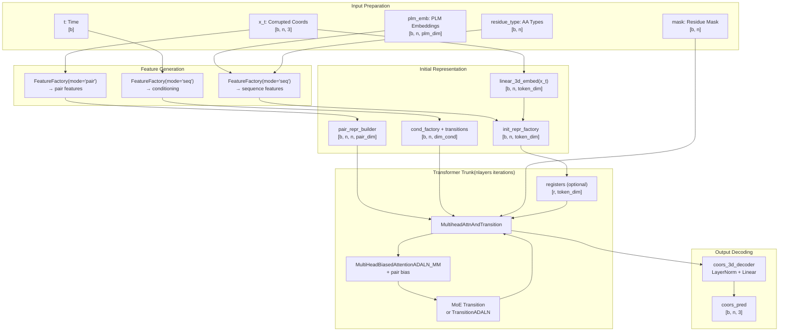
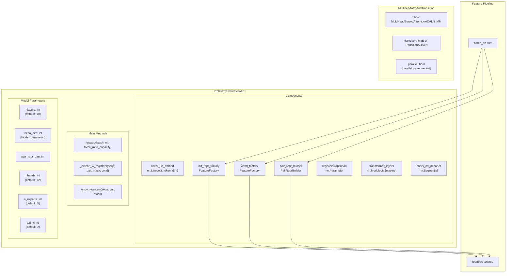
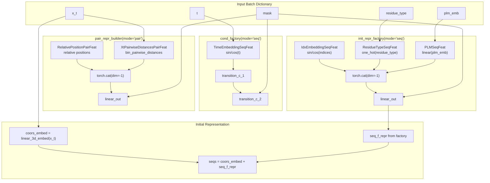
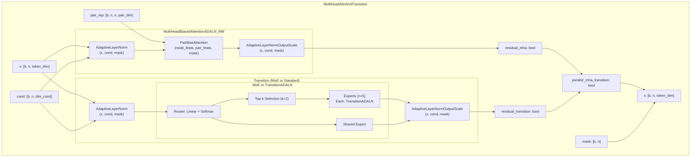
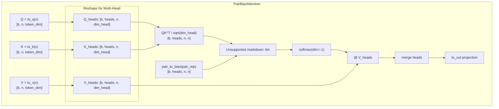
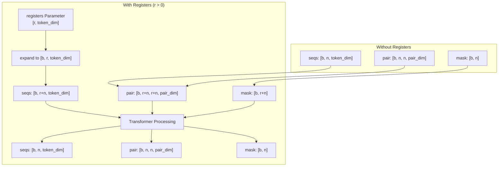
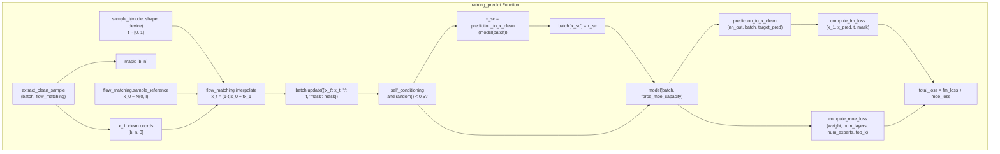
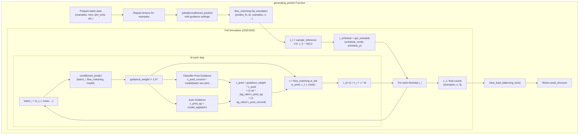

# Model Architecture

> **Relevant source files**
> * [src/model/components/feature_factory.py](https://github.com/Junjie-Zhu/IDPFold2/blob/5315b279/src/model/components/feature_factory.py)
> * [src/model/components/moe_modules.py](https://github.com/Junjie-Zhu/IDPFold2/blob/5315b279/src/model/components/moe_modules.py)
> * [src/model/integral.py](https://github.com/Junjie-Zhu/IDPFold2/blob/5315b279/src/model/integral.py)
> * [src/model/protein_transformer.py](https://github.com/Junjie-Zhu/IDPFold2/blob/5315b279/src/model/protein_transformer.py)

## Purpose and Scope

This document provides a complete technical overview of the IDPFold2 model architecture, focusing on the `ProteinTransformerAF3` neural network and its integration with the flow matching framework. It covers the end-to-end data flow from input features to predicted 3D coordinates, including the feature generation pipeline, transformer layers with Mixture of Experts (MoE), and adaptive conditioning mechanisms.

For detailed information about specific components, see:

* [ProteinTransformerAF3](/Junjie-Zhu/IDPFold2/5.1-proteintransformeraf3) for the main transformer architecture
* [Mixture of Experts](/Junjie-Zhu/IDPFold2/5.2-mixture-of-experts) for the MoE layer implementation
* [Flow Matching Framework](/Junjie-Zhu/IDPFold2/5.3-flow-matching-framework) for the generative modeling approach
* [Feature Factories](/Junjie-Zhu/IDPFold2/5.4-feature-factories) for feature generation details
* [Adaptive Layer Normalization](/Junjie-Zhu/IDPFold2/5.5-adaptive-layer-normalization) for conditioning mechanisms

For information about how the model is trained or used for inference, see [Training](/Junjie-Zhu/IDPFold2/6-training) and [Inference](/Junjie-Zhu/IDPFold2/7-inference).

## Architecture Overview

The IDPFold2 model architecture is based on a transformer neural network that predicts protein 3D coordinates through a flow matching process. The core model, `ProteinTransformerAF3`, processes corrupted coordinates (`x_t`) at diffusion time `t` and predicts clean coordinates (`x_1`).

### High-Level Architecture Flow



**Sources:** [src/model/protein_transformer.py L316-L538](https://github.com/Junjie-Zhu/IDPFold2/blob/5315b279/src/model/protein_transformer.py#L316-L538)

### Key Design Principles

The architecture follows these core principles:

1. **Coordinate-centric design**: The model directly processes and predicts 3D coordinates rather than working in latent space
2. **Adaptive conditioning**: Time and other conditioning variables are injected at multiple layers via Adaptive LayerNorm
3. **Mixture of Experts**: Conditional computation in transition layers allows specialized processing
4. **Pair bias attention**: Attention mechanisms incorporate pairwise structural relationships
5. **Register tokens**: Optional learnable tokens that do not correspond to residues, allowing the model to use them as memory

## Component Architecture

### ProteinTransformerAF3 Class Structure



**Sources:** [src/model/protein_transformer.py L316-L538](https://github.com/Junjie-Zhu/IDPFold2/blob/5315b279/src/model/protein_transformer.py#L316-L538)

## Input Processing and Feature Generation

### Input Batch Structure

The model expects a batch dictionary containing the following keys:

| Key | Shape | Type | Description |
| --- | --- | --- | --- |
| `x_t` | `[b, n, 3]` | `torch.Tensor` | Corrupted 3D coordinates at time t |
| `t` | `[b]` | `torch.Tensor` | Diffusion time in [0, 1] |
| `mask` | `[b, n]` | `torch.BoolTensor` | Valid residue mask |
| `plm_emb` | `[b, n, plm_dim]` | `torch.Tensor` | Pre-computed PLM embeddings |
| `residue_type` | `[b, n]` | `torch.LongTensor` | Amino acid type indices (0-19) |
| `residue_pdb_idx` | `[b, n]` | `torch.Tensor` | PDB residue indices (optional) |
| `chains` | `[b, n]` | `torch.LongTensor` | Chain identifiers (optional) |
| `x_sc` | `[b, n, 3]` | `torch.Tensor` | Self-conditioning coordinates (optional) |

**Sources:** [src/model/protein_transformer.py L488-L502](https://github.com/Junjie-Zhu/IDPFold2/blob/5315b279/src/model/protein_transformer.py#L488-L502)

 [src/model/components/feature_factory.py L398-L425](https://github.com/Junjie-Zhu/IDPFold2/blob/5315b279/src/model/components/feature_factory.py#L398-L425)

### Feature Factories

The model uses three separate `FeatureFactory` instances to generate different types of features:

#### 1. Initial Sequence Representation Factory (init_repr_factory)

Creates the initial token representation from sequence-level features.

**Configured features** (from `feats_init_seq`):

* `plm_emb`: Projected PLM embeddings via `PLMSeqFeat`
* `res_type`: One-hot amino acid type via `ResidueTypeSeqFeat`
* `res_idx`: Positional embedding via `IdxEmbeddingSeqFeat`
* `chain_break_per_res`: Chain boundary indicators via `ChainBreakPerResidueSeqFeat`

**Sources:** [src/model/protein_transformer.py L359-L365](https://github.com/Junjie-Zhu/IDPFold2/blob/5315b279/src/model/protein_transformer.py#L359-L365)

 [src/model/components/feature_factory.py L303-L343](https://github.com/Junjie-Zhu/IDPFold2/blob/5315b279/src/model/components/feature_factory.py#L303-L343)

#### 2. Conditioning Factory (cond_factory)

Creates conditioning variables for Adaptive LayerNorm.

**Configured features** (from `feats_cond_seq`):

* `time_emb`: Time embedding via `TimeEmbeddingSeqFeat`
* Additional sequence features as needed

**Sources:** [src/model/protein_transformer.py L368-L374](https://github.com/Junjie-Zhu/IDPFold2/blob/5315b279/src/model/protein_transformer.py#L368-L374)

 [src/model/components/feature_factory.py L116-L128](https://github.com/Junjie-Zhu/IDPFold2/blob/5315b279/src/model/components/feature_factory.py#L116-L128)

#### 3. Pair Representation Builder (pair_repr_builder)

Creates pairwise feature representation.

**Configured features** (from `feats_pair_repr`):

* `xt_pair_dists`: Binned pairwise distances via `XtPairwiseDistancesPairFeat`
* `rel_pos`: Relative position and chain information via `RelativePositionPairFeat`
* `time_emb`: Time embedding as pair feature via `TimeEmbeddingPairFeat`

**Sources:** [src/model/protein_transformer.py L380-L386](https://github.com/Junjie-Zhu/IDPFold2/blob/5315b279/src/model/protein_transformer.py#L380-L386)

 [src/model/components/feature_factory.py L275-L313](https://github.com/Junjie-Zhu/IDPFold2/blob/5315b279/src/model/components/feature_factory.py#L275-L313)

### Feature Processing Pipeline



**Sources:** [src/model/protein_transformer.py L506-L520](https://github.com/Junjie-Zhu/IDPFold2/blob/5315b279/src/model/protein_transformer.py#L506-L520)

 [src/model/components/feature_factory.py L398-L425](https://github.com/Junjie-Zhu/IDPFold2/blob/5315b279/src/model/components/feature_factory.py#L398-L425)

## Transformer Trunk Architecture

### Layer Structure

Each transformer layer (`MultiheadAttnAndTransition`) consists of:

1. **Multi-Head Biased Attention** with pair bias and Adaptive LayerNorm
2. **Transition Layer** (either standard or Mixture of Experts) with Adaptive LayerNorm
3. Optional **parallel processing** of attention and transition



**Sources:** [src/model/protein_transformer.py L164-L273](https://github.com/Junjie-Zhu/IDPFold2/blob/5315b279/src/model/protein_transformer.py#L164-L273)

 [src/model/components/moe_modules.py L48-L107](https://github.com/Junjie-Zhu/IDPFold2/blob/5315b279/src/model/components/moe_modules.py#L48-L107)

### Attention Mechanism Details

The attention mechanism uses:

* **Query-Key Layer Normalization** (optional, controlled by `use_qkln`)
* **Pair bias**: The pair representation biases attention weights
* **Multi-head attention**: Default 12 heads with dimension `token_dim // nheads` per head



**Sources:** [src/model/components/pair_bias_attn.py](https://github.com/Junjie-Zhu/IDPFold2/blob/5315b279/src/model/components/pair_bias_attn.py)

 (referenced in [src/model/protein_transformer.py L97-L133](https://github.com/Junjie-Zhu/IDPFold2/blob/5315b279/src/model/protein_transformer.py#L97-L133)

)

### Mixture of Experts Transition

When `use_moe=True`, the transition layer uses a Mixture of Experts architecture:

| Parameter | Default Value | Description |
| --- | --- | --- |
| `n_experts` | 5 | Total number of expert networks |
| `n_activated_experts` | 2 | Number of experts activated per token |
| `capacity_factor` | 1.25 | Buffer capacity for token routing |
| `normalize_expert_weights` | True | Whether to normalize expert contribution weights |
| `load_balance` | True | Whether to compute load balancing loss |

**Expert Routing Process:**

1. Router computes scores for each token-expert pair via linear layer + softmax
2. Top-k selection chooses `n_activated_experts` experts per token
3. Tokens are routed to selected experts using efficient binned gather
4. Each expert processes its assigned tokens
5. Results are weighted and aggregated via binned scatter
6. Shared expert processes all tokens in parallel

**Sources:** [src/model/protein_transformer.py L221-L239](https://github.com/Junjie-Zhu/IDPFold2/blob/5315b279/src/model/protein_transformer.py#L221-L239)

 [src/model/components/moe_modules.py L48-L107](https://github.com/Junjie-Zhu/IDPFold2/blob/5315b279/src/model/components/moe_modules.py#L48-L107)

## Register Tokens (Optional)

The model supports optional learnable register tokens that are prepended to the sequence:

* **Purpose**: Provide memory/scratch space for the transformer that doesn't correspond to residues
* **Implementation**: Learnable parameters of shape `[num_registers, token_dim]`
* **Processing**: Extended to batch dimension, prepended to sequence, pair representation padded with zeros
* **Removal**: Removed before final coordinate prediction



**Sources:** [src/model/protein_transformer.py L344-L353](https://github.com/Junjie-Zhu/IDPFold2/blob/5315b279/src/model/protein_transformer.py#L344-L353)

 [src/model/protein_transformer.py L421-L486](https://github.com/Junjie-Zhu/IDPFold2/blob/5315b279/src/model/protein_transformer.py#L421-L486)

## Output Decoding

The final coordinates are decoded from the sequence representation through a simple decoder:

```
coors_3d_decoder = nn.Sequential(    nn.LayerNorm(token_dim),    nn.Linear(token_dim, 3, bias=False))
```

**Process:**

1. Apply LayerNorm to final sequence representation: `[b, n, token_dim]`
2. Linear projection to 3D coordinates: `[b, n, 3]`
3. Apply mask to zero out padding positions

**Sources:** [src/model/protein_transformer.py L416-L419](https://github.com/Junjie-Zhu/IDPFold2/blob/5315b279/src/model/protein_transformer.py#L416-L419)

 [src/model/protein_transformer.py L535-L536](https://github.com/Junjie-Zhu/IDPFold2/blob/5315b279/src/model/protein_transformer.py#L535-L536)

## Integration with Flow Matching

The model integrates with the flow matching framework through prediction functions in `src/model/integral.py`:

### Training Integration (training_predict)



**Key Functions:**

* `extract_clean_sample`: Extracts `x_1` from batch and optionally applies global rotation [src/model/integral.py L158-L171](https://github.com/Junjie-Zhu/IDPFold2/blob/5315b279/src/model/integral.py#L158-L171)
* `sample_t`: Samples time values from various distributions (uniform, logit-normal, beta) [src/model/integral.py L93-L118](https://github.com/Junjie-Zhu/IDPFold2/blob/5315b279/src/model/integral.py#L93-L118)
* `prediction_to_x_clean`: Converts model output to clean coordinate prediction [src/model/integral.py L25-L38](https://github.com/Junjie-Zhu/IDPFold2/blob/5315b279/src/model/integral.py#L25-L38)

**Sources:** [src/model/integral.py L238-L320](https://github.com/Junjie-Zhu/IDPFold2/blob/5315b279/src/model/integral.py#L238-L320)

### Inference Integration (generating_predict)



**Key Functions:**

* `conditioned_predict`: Applies model with optional motif conditioning, MoE conditioning, and guidance [src/model/integral.py L41-L90](https://github.com/Junjie-Zhu/IDPFold2/blob/5315b279/src/model/integral.py#L41-L90)
* `generating_predict`: Orchestrates full inference flow with sampling [src/model/integral.py L323-L401](https://github.com/Junjie-Zhu/IDPFold2/blob/5315b279/src/model/integral.py#L323-L401)

**Sources:** [src/model/integral.py L323-L401](https://github.com/Junjie-Zhu/IDPFold2/blob/5315b279/src/model/integral.py#L323-L401)

 [src/model/integral.py L41-L90](https://github.com/Junjie-Zhu/IDPFold2/blob/5315b279/src/model/integral.py#L41-L90)

## Model Configuration Parameters

### Core Architecture Parameters

| Parameter | Type | Default | Description |
| --- | --- | --- | --- |
| `nlayers` | int | 10 | Number of transformer layers |
| `token_dim` | int | 384 | Hidden dimension of sequence tokens |
| `pair_repr_dim` | int | 128 | Dimension of pair representation |
| `nheads` | int | 12 | Number of attention heads |
| `dim_cond` | int | 128 | Dimension of conditioning variables |

### Feature Configuration

| Parameter | Type | Description |
| --- | --- | --- |
| `feats_init_seq` | List[str] | Features for initial sequence representation |
| `feats_cond_seq` | List[str] | Features for conditioning variables |
| `feats_pair_repr` | List[str] | Features for pair representation |
| `feats_pair_cond` | List[str] | Features for pair conditioning (optional) |

### MoE Configuration

| Parameter | Type | Default | Description |
| --- | --- | --- | --- |
| `use_moe` | bool | True | Whether to use Mixture of Experts |
| `n_experts` | int | 5 | Number of expert networks |
| `n_activated_experts` | int | 2 | Number of active experts per token |
| `capacity_factor` | float | 1.25 | Token routing capacity buffer |
| `normalize_expert_weights` | bool | True | Normalize expert contribution weights |
| `dim_moe_cond` | int | 0 | Additional conditioning dimension for router |

### Architectural Options

| Parameter | Type | Default | Description |
| --- | --- | --- | --- |
| `residual_mha` | bool | True | Use residual connection in attention |
| `residual_transition` | bool | True | Use residual connection in transition |
| `parallel_mha_transition` | bool | False | Process attention and transition in parallel |
| `use_attn_pair_bias` | bool | True | Use pair bias in attention |
| `use_qkln` | bool | False | Use Query-Key LayerNorm |
| `num_registers` | int | 0 | Number of register tokens |

### PLM Configuration

| Parameter | Type | Default | Description |
| --- | --- | --- | --- |
| `plm_in_dim` | int | 1280 | Input dimension of PLM embeddings |
| `plm_out_dim` | int | 128 | Projected dimension of PLM embeddings |

**Sources:** [src/model/protein_transformer.py L333-L414](https://github.com/Junjie-Zhu/IDPFold2/blob/5315b279/src/model/protein_transformer.py#L333-L414)

 [src/model/protein_transformer.py L181-L201](https://github.com/Junjie-Zhu/IDPFold2/blob/5315b279/src/model/protein_transformer.py#L181-L201)

## Model Forward Pass Summary

The complete forward pass through the model follows this sequence:

1. **Feature Generation** (`forward` method entry) * Generate conditioning variables `c` from `cond_factory` * Process through two transition layers * Generate sequence features from `init_repr_factory` * Generate pair features from `pair_repr_builder`
2. **Initial Representation** * Embed coordinates with `linear_3d_embed(x_t)` * Add to sequence features: `seqs = coors_embed + seq_f_repr`
3. **Register Extension** (if `num_registers > 0`) * Prepend learnable register tokens to sequence * Extend pair representation and mask with zeros/True values
4. **Transformer Trunk** (loop `nlayers` times) * For each layer: * Apply pair-biased multi-head attention with ADALN * Apply MoE or standard transition with ADALN * Use residual connections as configured * Apply mask throughout
5. **Register Removal** (if `num_registers > 0`) * Remove register positions from sequence, pair, and mask
6. **Coordinate Decoding** * Apply LayerNorm to final sequence representation * Project to 3D coordinates with linear layer * Apply mask to output
7. **Return** * Return dictionary with `coors_pred` key

**Sources:** [src/model/protein_transformer.py L488-L537](https://github.com/Junjie-Zhu/IDPFold2/blob/5315b279/src/model/protein_transformer.py#L488-L537)