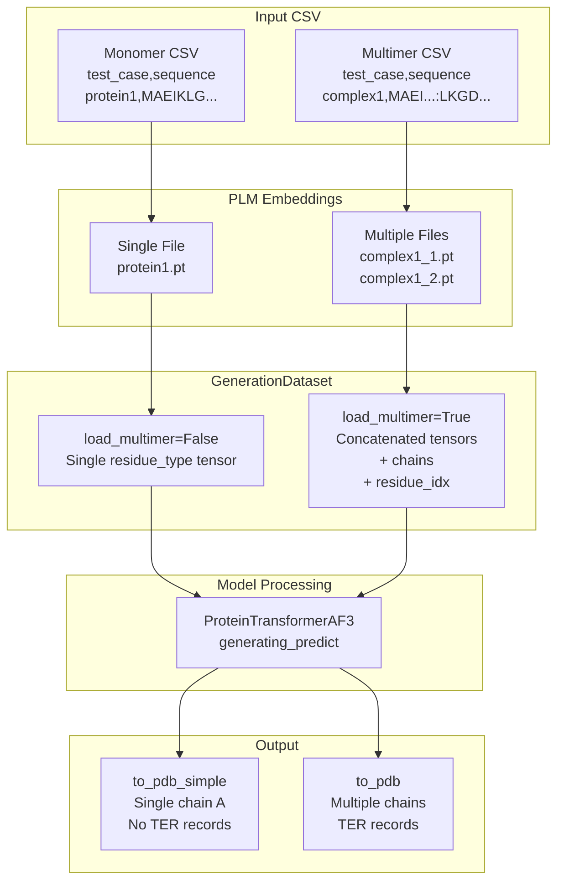
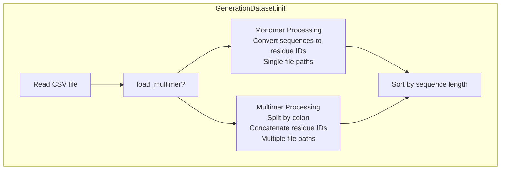
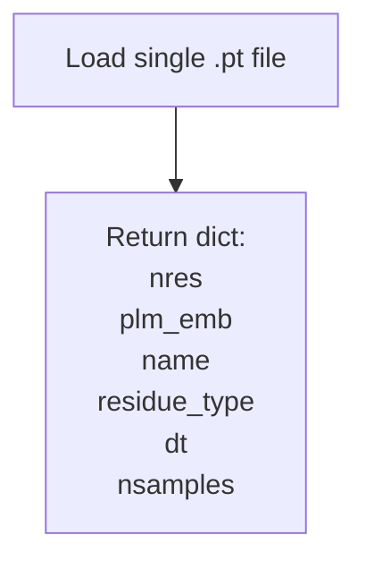
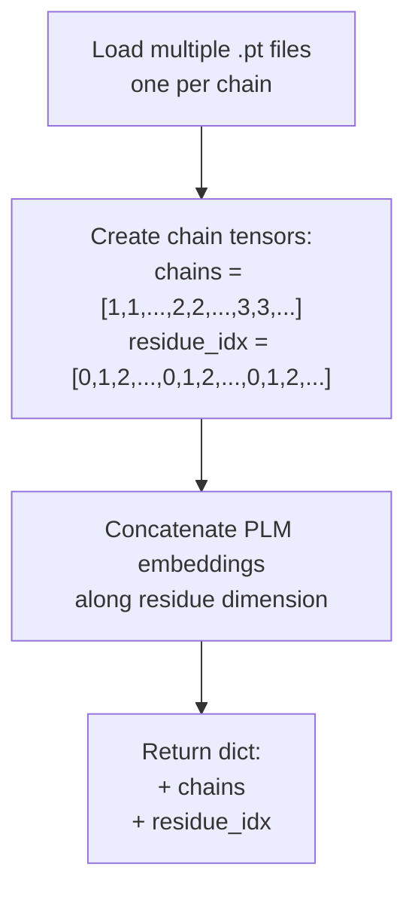
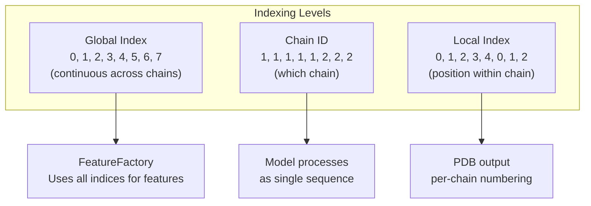
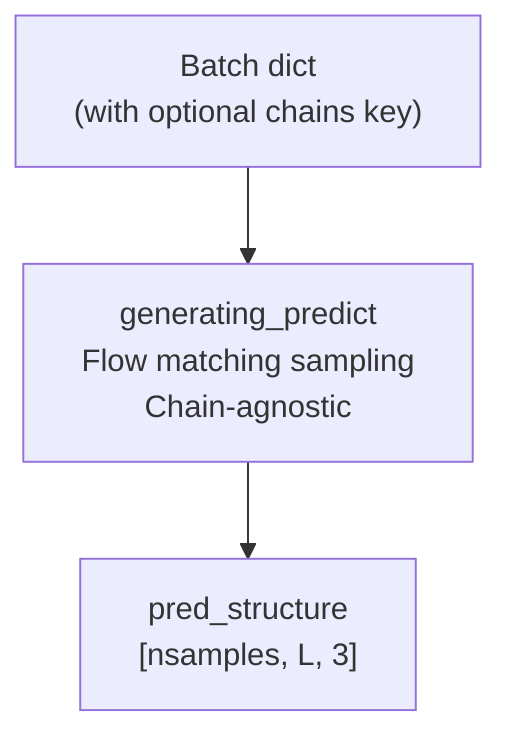
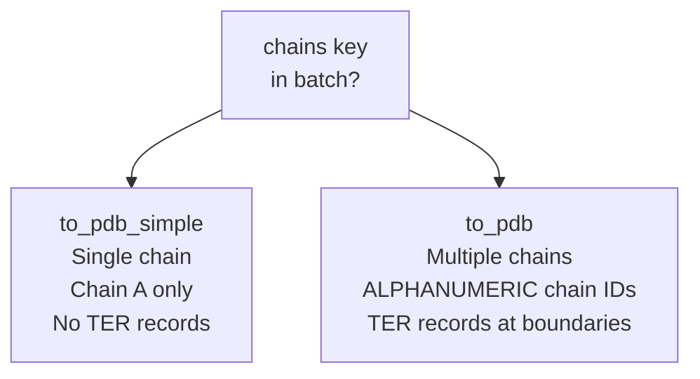
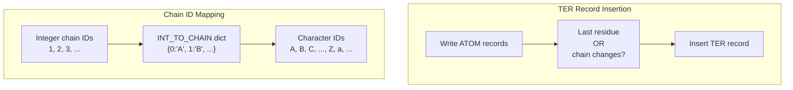
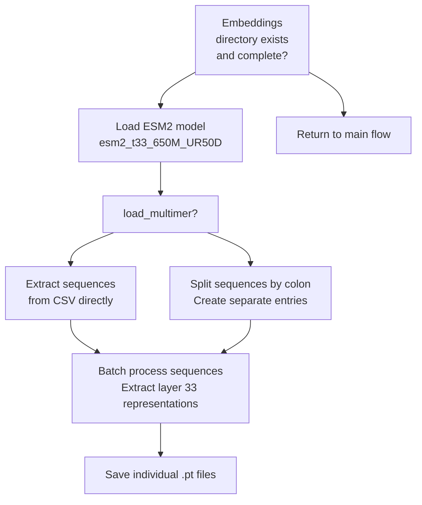

# Monomer and Multimer Generation

> **Relevant source files**
> * [README.md](https://github.com/Junjie-Zhu/IDPFold2/blob/5315b279/README.md?plain=1)
> * [configs/inference.yaml](https://github.com/Junjie-Zhu/IDPFold2/blob/5315b279/configs/inference.yaml)
> * [src/inference.py](https://github.com/Junjie-Zhu/IDPFold2/blob/5315b279/src/inference.py)
> * [src/utils/pdb_utils.py](https://github.com/Junjie-Zhu/IDPFold2/blob/5315b279/src/utils/pdb_utils.py)

## Purpose and Scope

This document describes how IDPFold2 handles single-chain proteins (monomers) and multi-chain protein complexes (multimers) during inference. The system uses different data loading, indexing, and output strategies depending on whether structures contain one or multiple polypeptide chains. For the overall inference pipeline, see [Inference Pipeline](/Junjie-Zhu/IDPFold2/7.1-inference-pipeline). For sampling and guidance mechanisms, see [Generating Predict Function](/Junjie-Zhu/IDPFold2/7.2-generating-predict-function) and [Guidance Mechanisms](/Junjie-Zhu/IDPFold2/7.3-guidance-mechanisms). For PDB file formatting details, see [PDB Output Generation](/Junjie-Zhu/IDPFold2/7.7-pdb-output-generation).

## Conceptual Overview

IDPFold2 treats monomers and multimers as distinct inference modes that cannot be mixed in a single run. The key differences are:

* **Monomers**: Single continuous polypeptide chains with sequential residue indexing
* **Multimers**: Multiple polypeptide chains with per-chain residue indexing and explicit chain separation

The system maintains chain boundaries throughout the generation process and outputs appropriate PDB formatting (TER records for multimers).



**Sources:** [src/inference.py L31-L115](https://github.com/Junjie-Zhu/IDPFold2/blob/5315b279/src/inference.py#L31-L115)

 [src/utils/pdb_utils.py L21-L106](https://github.com/Junjie-Zhu/IDPFold2/blob/5315b279/src/utils/pdb_utils.py#L21-L106)

## Input Data Format

### CSV Structure for Monomers

For single-chain proteins, the input CSV contains two required columns:

| Column | Description | Example |
| --- | --- | --- |
| `test_case` | Unique identifier for the protein | `protein1` |
| `sequence` | Single-letter amino acid sequence | `MAEIKLGPQR...` |

### CSV Structure for Multimers

For multi-chain complexes, sequences are concatenated with colons (`:`) as separators:

| Column | Description | Example |
| --- | --- | --- |
| `test_case` | Unique identifier for the complex | `complex1` |
| `sequence` | Colon-separated sequences | `MAEI...:LKGD...:WPQR...` |
| `chain_ids` (optional) | Colon-separated chain identifiers | `A:B:C` |

The order of sequences corresponds to chain order. If `chain_ids` is not provided, chains are numbered sequentially (1, 2, 3, ...).

**Sources:** [src/inference.py L41-L78](https://github.com/Junjie-Zhu/IDPFold2/blob/5315b279/src/inference.py#L41-L78)

 [README.md L66-L109](https://github.com/Junjie-Zhu/IDPFold2/blob/5315b279/README.md?plain=1#L66-L109)

## PLM Embedding Organization

### Monomer Embeddings

For monomers, PLM embeddings are stored as single files named after the `test_case`:

```
plm_emb_dir/
  protein1.pt
  protein2.pt
  ...
```

Each `.pt` file contains a tensor of shape `[L, 1280]` where `L` is the sequence length and 1280 is the ESM-2 embedding dimension.

### Multimer Embeddings

For multimers, each chain has a separate embedding file:

```markdown
plm_emb_dir/
  complex1_1.pt
  complex1_2.pt
  complex1_A.pt  # if chain_ids specified
  complex1_B.pt
  ...
```

The naming convention follows:

* `{test_case}_{chain_number}.pt` when no `chain_ids` column exists
* `{test_case}_{chain_id}.pt` when `chain_ids` column is present

**Sources:** [src/inference.py L52-L74](https://github.com/Junjie-Zhu/IDPFold2/blob/5315b279/src/inference.py#L52-L74)

## GenerationDataset Implementation

### Class Initialization

The `GenerationDataset` class controls loading behavior through the `load_multimer` flag:



**Sources:** [src/inference.py L31-L80](https://github.com/Junjie-Zhu/IDPFold2/blob/5315b279/src/inference.py#L31-L80)

### Monomer Data Loading

When `load_multimer=False`, the `__getitem__` method returns a simple dictionary:



The returned data structure for index `idx`:

| Key | Shape | Description |
| --- | --- | --- |
| `nres` | scalar | Number of residues |
| `plm_emb` | `[L, 1280]` | PLM embeddings |
| `name` | string | Structure identifier |
| `residue_type` | `[L]` | Residue type indices (0-19) |
| `dt` | scalar | Time step for flow matching |
| `nsamples` | scalar | Number of samples to generate |

**Sources:** [src/inference.py L85-L98](https://github.com/Junjie-Zhu/IDPFold2/blob/5315b279/src/inference.py#L85-L98)

### Multimer Data Loading

When `load_multimer=True`, additional tensors track chain information:



The returned data structure includes additional keys:

| Key | Shape | Description |
| --- | --- | --- |
| `chains` | `[L]` | Chain identifier per residue (1-indexed) |
| `residue_idx` | `[L]` | Per-chain residue index (0-indexed within each chain) |

Example for a two-chain complex with lengths 5 and 3:

```yaml
residue_type: [ALA, MET, GLY, PRO, SER, LEU, LYS, ASP]
chains:       [1,   1,   1,   1,   1,   2,   2,   2  ]
residue_idx:  [0,   1,   2,   3,   4,   0,   1,   2  ]
```

**Sources:** [src/inference.py L100-L115](https://github.com/Junjie-Zhu/IDPFold2/blob/5315b279/src/inference.py#L100-L115)

## Chain Separation During Generation

### Residue Indexing System

The system maintains three levels of indexing for multimers:



**Sources:** [src/inference.py L104-L114](https://github.com/Junjie-Zhu/IDPFold2/blob/5315b279/src/inference.py#L104-L114)

### Chain Break Detection

While the model processes multimers as a single concatenated sequence internally, chain boundaries are preserved through feature engineering. The `chain_break_per_res` feature (mentioned in model configuration) can signal chain boundaries, though this is not explicitly set in the multimer loading code.

**Sources:** [configs/inference.yaml L61](https://github.com/Junjie-Zhu/IDPFold2/blob/5315b279/configs/inference.yaml#L61-L61)

## Model Processing

### Generating Predict Flow

The `generating_predict` function treats monomers and multimers identically during structure generation. Chain information is carried through the batch dictionary but does not affect the core sampling process:



The model generates 3D coordinates for all residues as a single concatenated sequence, regardless of chain boundaries.

**Sources:** [src/inference.py L281-L295](https://github.com/Junjie-Zhu/IDPFold2/blob/5315b279/src/inference.py#L281-L295)

## PDB Output Generation

### Output Path Selection

The inference script selects the appropriate output function based on the presence of the `chains` key:



**Sources:** [src/inference.py L297-L311](https://github.com/Junjie-Zhu/IDPFold2/blob/5315b279/src/inference.py#L297-L311)

### Monomer PDB Format

The `to_pdb_simple` function outputs structures with:

* All residues assigned to chain `A`
* Sequential residue numbering starting from 1
* No TER records (since single chain)
* MODEL/ENDMDL delimiters for ensemble members

Example output structure:

```
MODEL 1
ATOM      1  CA  MET A   1      10.123  20.456  30.789  1.00  0.00           C
ATOM      2  CA  ALA A   2      11.234  21.567  31.890  1.00  0.00           C
...
ENDMDL
MODEL 2
...
END
```

**Sources:** [src/utils/pdb_utils.py L21-L58](https://github.com/Junjie-Zhu/IDPFold2/blob/5315b279/src/utils/pdb_utils.py#L21-L58)

### Multimer PDB Format

The `to_pdb` function outputs structures with:

* Chain IDs mapped from integer indices to alphanumeric characters (A-Za-z0-9)
* TER records at chain boundaries
* Sequential residue numbering (currently global, not per-chain)



Example output structure:

```
MODEL 1
ATOM      1  CA  MET A   1      10.123  20.456  30.789  1.00  0.00           C
ATOM      2  CA  ALA A   2      11.234  21.567  31.890  1.00  0.00           C
...
ATOM      5  CA  SER A   5      14.567  24.890  35.123  1.00  0.00           C
TER       6      SER A   6
ATOM      6  CA  LEU B   6      15.678  25.901  36.234  1.00  0.00           C
ATOM      7  CA  LYS B   7      16.789  27.012  37.345  1.00  0.00           C
...
TER       9      ASP B   9
ENDMDL
...
END
```

**Sources:** [src/utils/pdb_utils.py L61-L106](https://github.com/Junjie-Zhu/IDPFold2/blob/5315b279/src/utils/pdb_utils.py#L61-L106)

### Chain ID Mapping

The system supports up to 62 distinct chains using alphanumeric characters:

| Range | Characters | Count |
| --- | --- | --- |
| Upper case | A-Z | 26 |
| Lower case | a-z | 26 |
| Digits | 0-9 | 10 |
| **Total** |  | **62** |

The `ALPHANUMERIC` constant defines this mapping, with `CHAIN_TO_INT` and `INT_TO_CHAIN` dictionaries providing bidirectional conversion.

**Sources:** [src/utils/pdb_utils.py L12-L18](https://github.com/Junjie-Zhu/IDPFold2/blob/5315b279/src/utils/pdb_utils.py#L12-L18)

## Configuration Parameters

### Essential Parameters

| Parameter | Monomer Value | Multimer Value | Description |
| --- | --- | --- | --- |
| `load_multimer` | `False` | `True` | Enables multimer loading mode |
| `csv_dir` | path to monomer CSV | path to multimer CSV | Input sequence file |
| `plm_emb_dir` | embedding directory | embedding directory | PLM embedding storage |

### Example Inference Commands

**Monomer inference:**

```
python src/inference.py \    prefix=MONOMER \    ckpt_dir=/path/to/checkpoint.pth \    plm_emb_dir=./embeddings \    csv_dir=/path/to/monomers.csv \    nsamples=100 \    load_multimer=False
```

**Multimer inference:**

```
python src/inference.py \    prefix=MULTIMER \    ckpt_dir=/path/to/checkpoint.pth \    plm_emb_dir=./embeddings \    csv_dir=/path/to/multimers.csv \    nsamples=100 \    load_multimer=True
```

**Sources:** [README.md L72-L109](https://github.com/Junjie-Zhu/IDPFold2/blob/5315b279/README.md?plain=1#L72-L109)

 [configs/inference.yaml L1-L102](https://github.com/Junjie-Zhu/IDPFold2/blob/5315b279/configs/inference.yaml#L1-L102)

## Embedding Generation

### Automatic Embedding Creation

When PLM embeddings are missing, `GenerationDataset.get_esm_embedding` automatically generates them using ESM-2:



For multimers, the function splits colon-separated sequences and generates embeddings for each chain independently, allowing for efficient caching and reuse when the same chain appears in multiple complexes.

**Sources:** [src/inference.py L117-L156](https://github.com/Junjie-Zhu/IDPFold2/blob/5315b279/src/inference.py#L117-L156)

## Limitations and Considerations

### Current Implementation Constraints

1. **No Mixed Batching**: Monomers and multimers cannot be processed in the same inference run
2. **Sequential Residue Numbering**: Multimer PDB output uses global residue numbering rather than per-chain numbering (though TER records separate chains)
3. **Chain Limit**: Maximum of 62 chains per complex (limited by alphanumeric character set)
4. **Memory Scaling**: Multimers require proportionally more memory based on total residue count

### Chain Information Propagation

The system propagates chain information through the following keys:

| Stage | Keys Added | Purpose |
| --- | --- | --- |
| Dataset loading | `chains`, `residue_idx` | Track chain membership |
| Model processing | (none - carried through) | Maintain for output |
| PDB writing | (none - consumed) | Generate TER records |

Chain information does not directly influence the generative process - the model treats all residues uniformly during coordinate generation.

**Sources:** [src/inference.py L100-L115](https://github.com/Junjie-Zhu/IDPFold2/blob/5315b279/src/inference.py#L100-L115)

 [src/inference.py L297-L311](https://github.com/Junjie-Zhu/IDPFold2/blob/5315b279/src/inference.py#L297-L311)