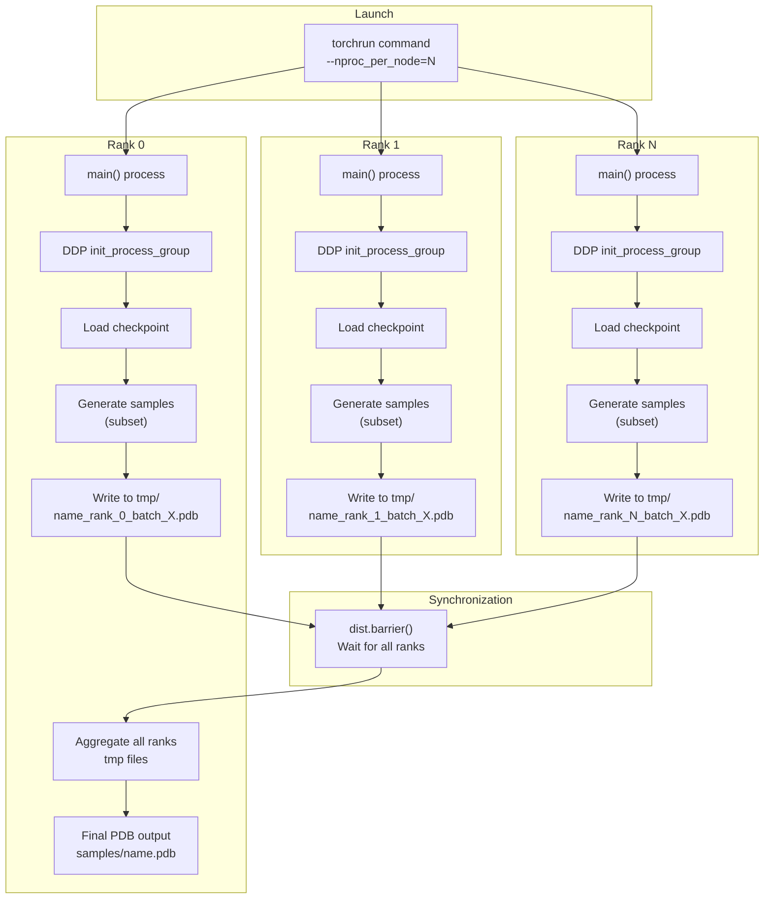
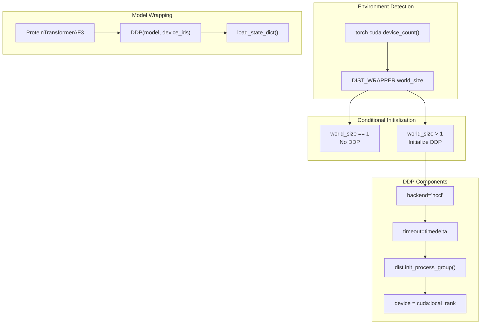
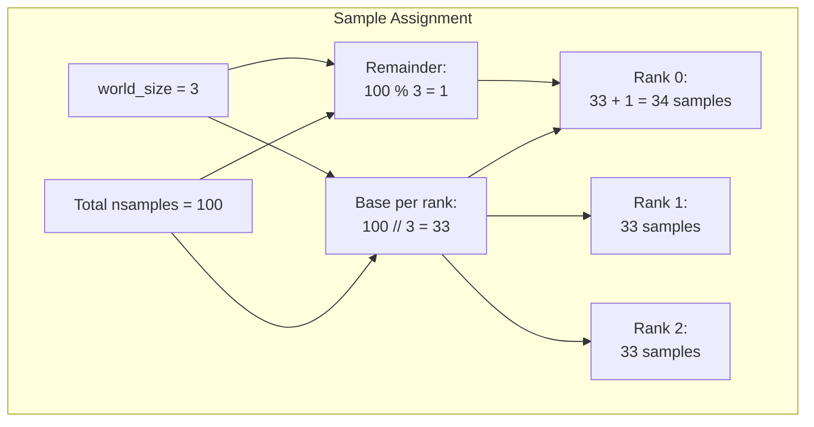
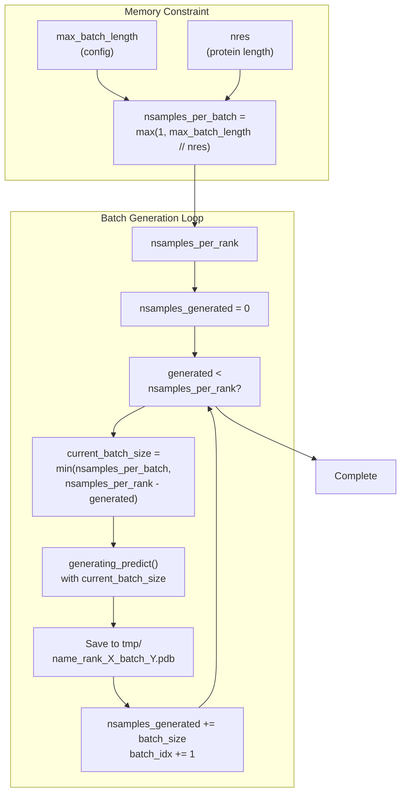
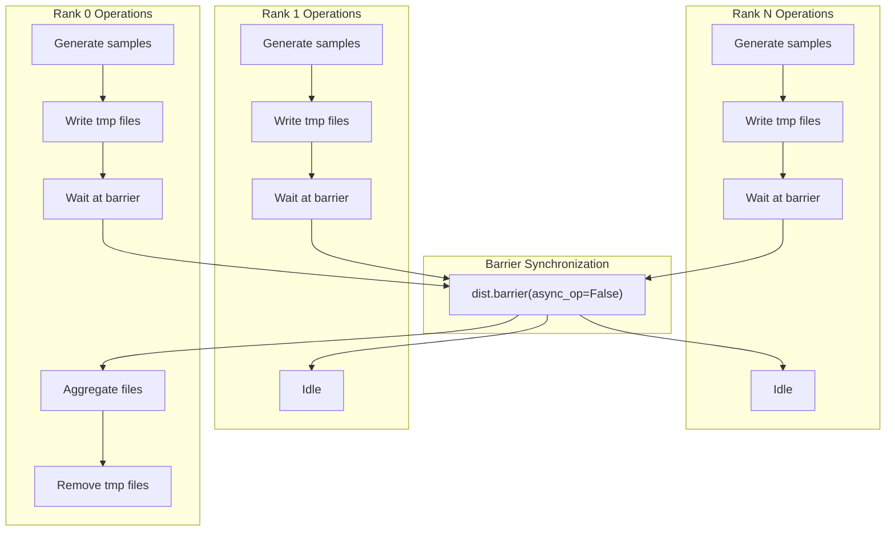
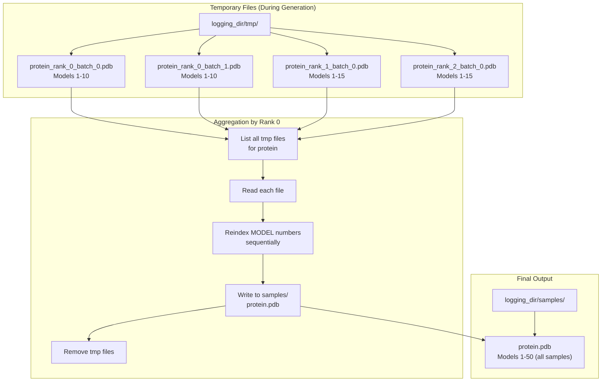

# Multi-Device Inference

> **Relevant source files**
> * [configs/inference.yaml](https://github.com/Junjie-Zhu/IDPFold2/blob/5315b279/configs/inference.yaml)
> * [src/inference.py](https://github.com/Junjie-Zhu/IDPFold2/blob/5315b279/src/inference.py)
> * [src/utils/pdb_utils.py](https://github.com/Junjie-Zhu/IDPFold2/blob/5315b279/src/utils/pdb_utils.py)

## Purpose and Scope

This document describes how IDPFold2 performs distributed inference across multiple GPUs using PyTorch's Distributed Data Parallel (DDP) framework. Multi-device inference enables the generation of large conformational ensembles by distributing sample generation across multiple GPUs, significantly reducing total inference time.

For the general inference workflow, see [Inference Pipeline](/Junjie-Zhu/IDPFold2/7.1-inference-pipeline). For the core generation function used on each device, see [Generating Predict Function](/Junjie-Zhu/IDPFold2/7.2-generating-predict-function). For configuration options related to distributed inference, see [Inference Configuration](/Junjie-Zhu/IDPFold2/10.2-inference-configuration).

**Sources:** [src/inference.py L1-L370](https://github.com/Junjie-Zhu/IDPFold2/blob/5315b279/src/inference.py#L1-L370)

---

## Distributed Inference Architecture

IDPFold2's multi-device inference system distributes the generation of multiple conformational samples across available GPUs. Each GPU independently generates a subset of the total requested samples, and rank 0 aggregates the results into a single output file.

### System Components



**Sources:** [src/inference.py L167-L347](https://github.com/Junjie-Zhu/IDPFold2/blob/5315b279/src/inference.py#L167-L347)

---

## DDP Initialization

The distributed inference setup occurs during the initialization phase of `main()`. The system detects the number of available GPUs and initializes the process group if multiple devices are available.

### Process Group Setup



The initialization logic is implemented as follows:

**Environment Setup** [src/inference.py L184-L203](https://github.com/Junjie-Zhu/IDPFold2/blob/5315b279/src/inference.py#L184-L203)

* Checks `torch.cuda.device_count()` to determine GPU availability
* Sets device to `cuda:DIST_WRAPPER.local_rank` for multi-GPU scenarios
* Reads `NCCL_TIMEOUT_SECOND` environment variable (default 600 seconds)
* Calls `dist.init_process_group(backend="nccl")` when `world_size > 1`

**Model Wrapping** [src/inference.py L224-L244](https://github.com/Junjie-Zhu/IDPFold2/blob/5315b279/src/inference.py#L224-L244)

* Creates `ProteinTransformerAF3` model instance
* Wraps model with `DDP` if `world_size > 1`
* Sets `device_ids=[local_rank]` and `output_device=local_rank`
* Enables `static_graph=True` for optimization
* Loads checkpoint into `model.module.load_state_dict()` for DDP models

**Sources:** [src/inference.py L184-L244](https://github.com/Junjie-Zhu/IDPFold2/blob/5315b279/src/inference.py#L184-L244)

---

## Sample Distribution Strategy

IDPFold2 distributes the total number of requested samples (`nsamples`) across all available ranks. Each rank independently generates its assigned subset of samples.

### Distribution Algorithm

The sample distribution logic uses a simple round-robin approach:

| Parameter | Description | Code Location |
| --- | --- | --- |
| `nsamples` | Total samples requested | [inference.yaml L9](https://github.com/Junjie-Zhu/IDPFold2/blob/5315b279/inference.yaml#L9-L9) |
| `world_size` | Number of GPUs/ranks | `DIST_WRAPPER.world_size` |
| `nsamples_per_rank` | Base samples per rank | `nsamples // world_size` |
| Extra samples | Distributed to lower ranks | `rank < nsamples % world_size` |



**Implementation** [src/inference.py L265-L268](https://github.com/Junjie-Zhu/IDPFold2/blob/5315b279/src/inference.py#L265-L268)

```
nsamples_per_rank = inference_dict['nsamples'] // DIST_WRAPPER.world_sizeif DIST_WRAPPER.rank < inference_dict['nsamples'] % DIST_WRAPPER.world_size:    nsamples_per_rank += 1
```

This ensures all samples are generated exactly once, with lower-numbered ranks receiving any extra samples from the remainder.

**Sources:** [src/inference.py L265-L268](https://github.com/Junjie-Zhu/IDPFold2/blob/5315b279/src/inference.py#L265-L268)

---

## Memory Management and Batch Splitting

To prevent GPU memory overflow when generating many samples for long proteins, each rank further splits its assigned samples into batches based on available memory.

### Batch Size Calculation

The batch size is determined by the `max_batch_length` configuration parameter:



**Batch Splitting Logic** [src/inference.py L270-L316](https://github.com/Junjie-Zhu/IDPFold2/blob/5315b279/src/inference.py#L270-L316)

The system:

1. Calculates `nsamples_per_batch = max(1, max_batch_length // nres)` to fit within memory
2. Iterates until all assigned samples are generated
3. Adjusts the final batch size to not exceed remaining samples
4. Saves each batch to a separate temporary file with naming: `{name}_rank_{rank}_batch_{batch_idx}.pdb`

**Configuration** [configs/inference.yaml L10](https://github.com/Junjie-Zhu/IDPFold2/blob/5315b279/configs/inference.yaml#L10-L10)

* `max_batch_length: 3500` - Tested for V100-32GB
* Should be adjusted based on available GPU memory
* Higher values reduce I/O overhead but increase memory usage

**Sources:** [src/inference.py L270-L316](https://github.com/Junjie-Zhu/IDPFold2/blob/5315b279/src/inference.py#L270-L316)

 [configs/inference.yaml L10](https://github.com/Junjie-Zhu/IDPFold2/blob/5315b279/configs/inference.yaml#L10-L10)

---

## Synchronization and Coordination

Distributed inference requires careful synchronization to ensure all ranks complete their work before file aggregation begins.

### Synchronization Points



**Barrier Implementation** [src/inference.py L318-L323](https://github.com/Junjie-Zhu/IDPFold2/blob/5315b279/src/inference.py#L318-L323)

```css
# wait for all ranks to finishif DIST_WRAPPER.world_size > 1:    dist.barrier(async_op=False) if DIST_WRAPPER.rank == 0:    pbar_inner.close()    log_info(f"Gathering samples for {inference_dict['name'][0]}")
```

The `dist.barrier()` call with `async_op=False` ensures:

* All ranks have completed their sample generation
* All temporary files have been written to disk
* Rank 0 can safely read all files without race conditions

**Sources:** [src/inference.py L318-L323](https://github.com/Junjie-Zhu/IDPFold2/blob/5315b279/src/inference.py#L318-L323)

---

## File Output and Aggregation

Each rank writes its generated samples to temporary PDB files, and rank 0 aggregates them into a final multi-model PDB file.

### File Structure



### Aggregation Process

**Temporary File Writing** [src/inference.py L297-L312](https://github.com/Junjie-Zhu/IDPFold2/blob/5315b279/src/inference.py#L297-L312)

* Each rank writes samples using `to_pdb_simple()` or `to_pdb()` functions
* File naming: `{name}_rank_{rank}_batch_{batch_idx}.pdb`
* Written to `logging_dir/tmp/` directory
* Each file contains multiple MODEL/ENDMDL blocks

**File Aggregation by Rank 0** [src/inference.py L322-L343](https://github.com/Junjie-Zhu/IDPFold2/blob/5315b279/src/inference.py#L322-L343)

```css
if DIST_WRAPPER.rank == 0:    log_info(f"Gathering samples for {inference_dict['name'][0]}")    tmp_files = [i for i in os.listdir(os.path.join(logging_dir, "tmp"))                 if i.startswith(inference_dict['name'][0])]    with open(os.path.join(logging_dir, "samples", f"{inference_dict['name'][0]}.pdb"), 'w') as outfile:        model_idx = 1        for f in tmp_files:            with open(os.path.join(logging_dir, "tmp", f), 'r') as infile:                for line in infile:                    if line.startswith("MODEL"):                        outfile.write(f"MODEL {model_idx}\n")  # reindex model number                        model_idx += 1                    elif line.strip() == "END":                        continue                    else:                        outfile.write(line)                outfile.write("END\n")            # remove tmp files            os.remove(os.path.join(logging_dir, "tmp", f))
```

The aggregation process:

1. Lists all temporary files matching the protein name
2. Opens the final output file in `samples/` directory
3. Reads each temporary file sequentially
4. Reindexes MODEL numbers to be consecutive (1, 2, 3, ...)
5. Strips redundant "END" lines between files
6. Writes a single "END" line at the end of the final file
7. Removes temporary files after successful aggregation

**Sources:** [src/inference.py L297-L343](https://github.com/Junjie-Zhu/IDPFold2/blob/5315b279/src/inference.py#L297-L343)

 [src/utils/pdb_utils.py L21-L106](https://github.com/Junjie-Zhu/IDPFold2/blob/5315b279/src/utils/pdb_utils.py#L21-L106)

---

## Usage and Launch Commands

### Single-GPU Inference

For single-GPU inference, simply run:

```
python src/inference.py \    csv_dir=data/sequences.csv \    plm_emb_dir=data/plm_embeddings \    ckpt_dir=checkpoints/model.pth \    nsamples=100
```

The system automatically detects single-GPU mode and bypasses DDP initialization.

### Multi-GPU Inference with torchrun

For distributed inference across multiple GPUs:

```
torchrun --nproc_per_node=4 src/inference.py \    csv_dir=data/sequences.csv \    plm_emb_dir=data/plm_embeddings \    ckpt_dir=checkpoints/model.pth \    nsamples=100 \    max_batch_length=3500
```

**Key Parameters:**

* `--nproc_per_node=N`: Number of GPUs to use (automatically sets `world_size`)
* `nsamples`: Total samples across all GPUs
* `max_batch_length`: Memory constraint for batch sizing

### Environment Variables

| Variable | Purpose | Default |
| --- | --- | --- |
| `CUDA_VISIBLE_DEVICES` | GPU device selection | All GPUs |
| `NCCL_TIMEOUT_SECOND` | DDP communication timeout | 600 |
| `MASTER_ADDR` | Master node address (multi-node) | localhost |
| `MASTER_PORT` | Master node port (multi-node) | 29500 |

**Sources:** [src/inference.py L184-L203](https://github.com/Junjie-Zhu/IDPFold2/blob/5315b279/src/inference.py#L184-L203)

---

## Performance Considerations

### Sample Distribution Efficiency

With `N` GPUs generating `M` total samples:

* Each GPU generates approximately `M/N` samples
* Near-linear speedup for large `M` where generation dominates I/O
* Slight overhead for barrier synchronization and file aggregation

### Memory Optimization

The `max_batch_length` parameter trades off between:

* **Higher values:** Fewer I/O operations, more memory usage
* **Lower values:** More I/O operations, less memory usage

**Recommended values by GPU memory:**

| GPU Memory | max_batch_length |
| --- | --- |
| 16 GB | 2000 |
| 32 GB (V100) | 3500 |
| 40 GB (A100) | 5000 |
| 80 GB (A100) | 10000 |

### Batch Splitting Impact

For a protein of length `L` and `nsamples=N`:

* `nsamples_per_batch = max_batch_length / L`
* Number of batches per rank = `ceil(N/world_size / nsamples_per_batch)`
* Each batch requires separate file I/O

**Sources:** [src/inference.py L270-L316](https://github.com/Junjie-Zhu/IDPFold2/blob/5315b279/src/inference.py#L270-L316)

 [configs/inference.yaml L10](https://github.com/Junjie-Zhu/IDPFold2/blob/5315b279/configs/inference.yaml#L10-L10)

---

## Process Cleanup

After all samples are generated and aggregated, the distributed process group must be properly destroyed.

**Cleanup** [src/inference.py L344-L346](https://github.com/Junjie-Zhu/IDPFold2/blob/5315b279/src/inference.py#L344-L346)

```markdown
# Clean up process group when finishedif DIST_WRAPPER.world_size > 1:    dist.destroy_process_group()
```

This ensures proper release of GPU resources and network connections established during DDP initialization.

**Sources:** [src/inference.py L344-L346](https://github.com/Junjie-Zhu/IDPFold2/blob/5315b279/src/inference.py#L344-L346)