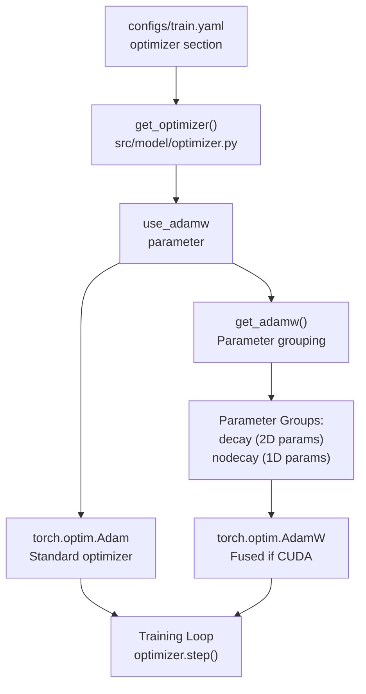
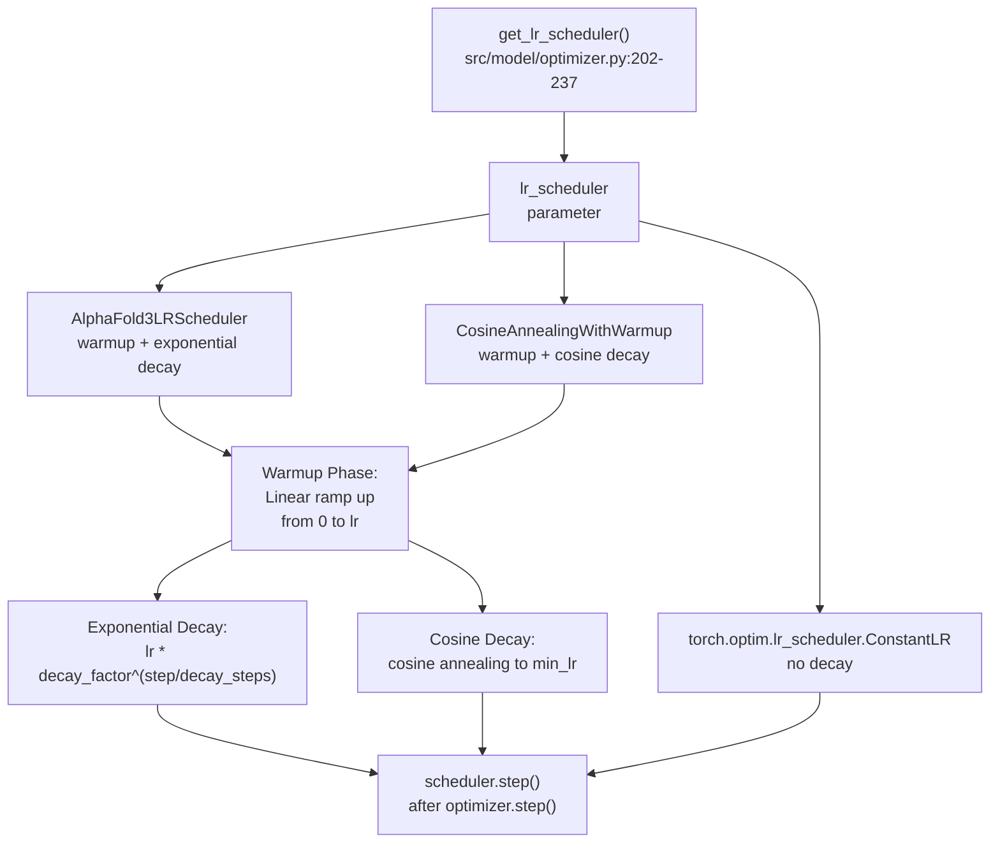
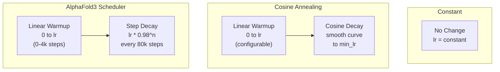
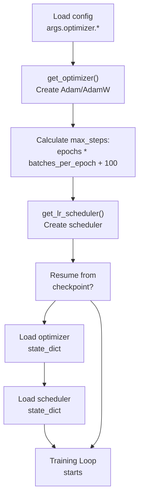

# Optimization and Scheduling

> **Relevant source files**
> * [configs/train.yaml](https://github.com/Junjie-Zhu/IDPFold2/blob/5315b279/configs/train.yaml)
> * [src/model/optimizer.py](https://github.com/Junjie-Zhu/IDPFold2/blob/5315b279/src/model/optimizer.py)
> * [src/train.py](https://github.com/Junjie-Zhu/IDPFold2/blob/5315b279/src/train.py)

This page documents the optimizer and learning rate scheduler implementations used during IDPFold2 training. It covers the optimizer configuration (Adam vs AdamW with parameter grouping), the available learning rate scheduling strategies (AlphaFold3-style, cosine annealing, constant), and how these components are integrated into the training loop.

For information about the overall training pipeline and how optimization fits into the training loop, see [Training Pipeline](/Junjie-Zhu/IDPFold2/6.1-training-pipeline). For details about the loss computation that drives optimization, see [Loss Functions](/Junjie-Zhu/IDPFold2/6.3-loss-functions).

## Optimizer Configuration

The training system supports two optimizer types: standard Adam and AdamW (Adam with decoupled weight decay). The optimizer is created by the `get_optimizer()` function in [src/model/optimizer.py L63-L85](https://github.com/Junjie-Zhu/IDPFold2/blob/5315b279/src/model/optimizer.py#L63-L85)

### Optimizer Selection



**Sources:** [src/model/optimizer.py L63-L85](https://github.com/Junjie-Zhu/IDPFold2/blob/5315b279/src/model/optimizer.py#L63-L85)

 [src/train.py L156-L162](https://github.com/Junjie-Zhu/IDPFold2/blob/5315b279/src/train.py#L156-L162)

### Parameter Grouping in AdamW

When using AdamW, the `get_adamw()` function implements parameter grouping to apply weight decay selectively. This follows best practices where only weight matrices receive weight decay, while biases and normalization parameters do not.

| Parameter Type | Weight Decay Applied | Criteria |
| --- | --- | --- |
| Weight matrices | Yes | `p.dim() >= 2` |
| Biases & LayerNorms | No | `p.dim() < 2` |

The implementation in [src/model/optimizer.py L32-L60](https://github.com/Junjie-Zhu/IDPFold2/blob/5315b279/src/model/optimizer.py#L32-L60)

 creates two parameter groups:

```
decay_params = [p for n, p in param_dict.items() if p.dim() >= 2]nodecay_params = [p for n, p in param_dict.items() if p.dim() < 2]optim_groups = [    {"params": decay_params, "weight_decay": weight_decay},    {"params": nodecay_params, "weight_decay": 0.0},]
```

AdamW also uses the fused implementation when available on CUDA devices for improved performance [src/model/optimizer.py L52-L57](https://github.com/Junjie-Zhu/IDPFold2/blob/5315b279/src/model/optimizer.py#L52-L57)

**Sources:** [src/model/optimizer.py L11-L60](https://github.com/Junjie-Zhu/IDPFold2/blob/5315b279/src/model/optimizer.py#L11-L60)

### Default Hyperparameters

The default optimizer configuration from [configs/train.yaml L103-L108](https://github.com/Junjie-Zhu/IDPFold2/blob/5315b279/configs/train.yaml#L103-L108)

:

| Parameter | Default Value | Description |
| --- | --- | --- |
| `lr` | 0.0001 | Base learning rate |
| `weight_decay` | 0.0 | L2 regularization strength |
| `beta1` | 0.9 | Adam momentum parameter |
| `beta2` | 0.999 | Adam second moment parameter |
| `use_adamw` | False | Use AdamW instead of Adam |

**Sources:** [configs/train.yaml L103-L108](https://github.com/Junjie-Zhu/IDPFold2/blob/5315b279/configs/train.yaml#L103-L108)

## Learning Rate Schedulers

The system provides three learning rate scheduling strategies through the `get_lr_scheduler()` factory function in [src/model/optimizer.py L202-L237](https://github.com/Junjie-Zhu/IDPFold2/blob/5315b279/src/model/optimizer.py#L202-L237)

### Scheduler Architecture



**Sources:** [src/model/optimizer.py L202-L237](https://github.com/Junjie-Zhu/IDPFold2/blob/5315b279/src/model/optimizer.py#L202-L237)

### AlphaFold3 Learning Rate Scheduler

The `AlphaFold3LRScheduler` class [src/model/optimizer.py L163-L200](https://github.com/Junjie-Zhu/IDPFold2/blob/5315b279/src/model/optimizer.py#L163-L200)

 implements the scheduling strategy from AlphaFold3 Section 5.4, with linear warmup followed by exponential decay.

**Learning Rate Formula:**

For step $t$:

* **Warmup phase** ($t \leq$ `warmup_steps`): $$\text{lr} = \frac{t + 1}{\text{warmup_steps} + 1} \times \text{base_lr}$$
* **Decay phase** ($t >$ `warmup_steps`): $$\text{lr} = \text{base_lr} \times \text{decay_factor}^{\lfloor t / \text{decay_steps} \rfloor}$$

Implementation in [src/model/optimizer.py L182-L188](https://github.com/Junjie-Zhu/IDPFold2/blob/5315b279/src/model/optimizer.py#L182-L188)

:

```python
def _get_step_lr(self, step):    if step <= self.warmup_steps:        lr = (step + 1) / (self.warmup_steps + 1) * self.lr    else:        decay_count = step // self.decay_steps        lr = self.lr * (self.decay_factor**decay_count)    return lr
```

**Default Parameters** from [configs/train.yaml L109-L112](https://github.com/Junjie-Zhu/IDPFold2/blob/5315b279/configs/train.yaml#L109-L112)

:

| Parameter | Default Value | Description |
| --- | --- | --- |
| `warmup_steps` | 4000 | Linear warmup duration |
| `decay_every_n_steps` | 80000 | Steps between decay applications |
| `decay_factor` | 0.98 | Multiplicative decay factor |

**Sources:** [src/model/optimizer.py L163-L200](https://github.com/Junjie-Zhu/IDPFold2/blob/5315b279/src/model/optimizer.py#L163-L200)

 [configs/train.yaml L109-L112](https://github.com/Junjie-Zhu/IDPFold2/blob/5315b279/configs/train.yaml#L109-L112)

### Cosine Annealing Scheduler

The `CosineAnnealingWithWarmup` class [src/model/optimizer.py L117-L159](https://github.com/Junjie-Zhu/IDPFold2/blob/5315b279/src/model/optimizer.py#L117-L159)

 provides an alternative scheduling strategy with smoother decay using a cosine function.

**Learning Rate Formula:**

For step $t$:

* **Warmup phase** ($t \leq$ `warmup_steps`): $$\text{lr} = \frac{t + 1}{\text{warmup_steps} + 1} \times \text{base_lr}$$
* **Decay phase** (`warmup_steps` $< t <$ `decay_steps`): $$\text{decay_ratio} = \frac{t - \text{warmup_steps}}{\text{decay_steps} - \text{warmup_steps}}$$ $$\text{lr} = \text{min_lr} + \frac{1 + \cos(\pi \times \text{decay_ratio})}{2} \times (\text{base_lr} - \text{min_lr})$$
* **Final phase** ($t \geq$ `decay_steps`): $$\text{lr} = \text{min_lr}$$

Implementation in [src/model/optimizer.py L134-L145](https://github.com/Junjie-Zhu/IDPFold2/blob/5315b279/src/model/optimizer.py#L134-L145)

:

```python
def _get_step_lr(self, step):    if step <= self.warmup_steps:        return (step + 1) / (self.warmup_steps + 1) * self.lr    elif step >= self.decay_steps:        return self.min_lr    else:        decay_ratio = (step - self.warmup_steps) / (            self.decay_steps - self.warmup_steps        )        coff = 0.5 * (1.0 + math.cos(math.pi * decay_ratio))        return self.min_lr + coff * (self.lr - self.min_lr)
```

**Sources:** [src/model/optimizer.py L117-L159](https://github.com/Junjie-Zhu/IDPFold2/blob/5315b279/src/model/optimizer.py#L117-L159)

### Scheduler Comparison



**Sources:** [src/model/optimizer.py L117-L237](https://github.com/Junjie-Zhu/IDPFold2/blob/5315b279/src/model/optimizer.py#L117-L237)

## Training Integration

The optimizer and scheduler are integrated into the training loop in [src/train.py L156-L171](https://github.com/Junjie-Zhu/IDPFold2/blob/5315b279/src/train.py#L156-L171)

 and stepped after each batch.

### Initialization Sequence



**Sources:** [src/train.py L156-L195](https://github.com/Junjie-Zhu/IDPFold2/blob/5315b279/src/train.py#L156-L195)

### Training Step Sequence

The optimizer and scheduler are called in the following sequence within each training iteration [src/train.py L272-L275](https://github.com/Junjie-Zhu/IDPFold2/blob/5315b279/src/train.py#L272-L275)

:

```
optimizer.zero_grad(set_to_none=True)loss.backward()optimizer.step()scheduler.step()
```

This pattern is repeated for every batch. The `set_to_none=True` argument provides a small performance improvement by deallocating gradient buffers rather than zeroing them.

**Sources:** [src/train.py L272-L275](https://github.com/Junjie-Zhu/IDPFold2/blob/5315b279/src/train.py#L272-L275)

## Checkpoint State Management

Both optimizer and scheduler states are saved and restored through checkpoints to enable training resumption.

### Checkpoint Saving

When saving checkpoints [src/train.py L345-L352](https://github.com/Junjie-Zhu/IDPFold2/blob/5315b279/src/train.py#L345-L352)

:

```
torch.save({    'epoch': crt_epoch,    'model_state_dict': model.state_dict(),    'optimizer_state_dict': optimizer.state_dict(),    'scheduler_state_dict': scheduler.state_dict(),}, checkpoint_path)
```

The scheduler state includes the current step count (`last_epoch`), which ensures the learning rate continues from the correct position when resuming.

**Sources:** [src/train.py L345-L352](https://github.com/Junjie-Zhu/IDPFold2/blob/5315b279/src/train.py#L345-L352)

### Checkpoint Loading

When resuming from a checkpoint [src/train.py L185-L195](https://github.com/Junjie-Zhu/IDPFold2/blob/5315b279/src/train.py#L185-L195)

:

```
if args.resume.ckpt_dir is not None:    checkpoint = torch.load(args.resume.ckpt_dir, map_location=device)    model.load_state_dict(checkpoint['model_state_dict'])    if not args.resume.load_model_only:        optimizer.load_state_dict(checkpoint['optimizer_state_dict'])        scheduler.load_state_dict(checkpoint['scheduler_state_dict'])        start_epoch = checkpoint['epoch'] + 1
```

The `load_model_only` flag allows loading only model weights while resetting the optimizer and scheduler, useful for fine-tuning scenarios.

**Sources:** [src/train.py L185-L195](https://github.com/Junjie-Zhu/IDPFold2/blob/5315b279/src/train.py#L185-L195)

## Configuration Reference

Complete optimizer and scheduler configuration parameters from [configs/train.yaml L103-L112](https://github.com/Junjie-Zhu/IDPFold2/blob/5315b279/configs/train.yaml#L103-L112)

:

```yaml
optimizer:  lr: 0.0001                    # Base learning rate  weight_decay: 0.              # L2 regularization (0 = disabled)  beta1: 0.9                    # Adam first moment decay  beta2: 0.999                  # Adam second moment decay  use_adamw: False              # Use AdamW instead of Adam  lr_scheduler: "af3"           # Scheduler type: "af3", "cosine_annealing", "constant"  warmup_steps: 4000            # Linear warmup duration  decay_every_n_steps: 80000    # Steps between decay (af3 scheduler)  decay_factor: 0.98            # Decay multiplier (af3 scheduler)
```

**Parameter Guidelines:**

* **Learning rate**: 0.0001 is a conservative default. AlphaFold3 uses 1.8e-3 but this may require tuning for different datasets
* **Weight decay**: Currently disabled (0.0). When using AdamW, values like 0.01-0.1 are typical
* **Warmup steps**: 4000 steps provides stable training start. Should be ~1% of total training steps
* **Decay parameters**: AF3 scheduler decays by 2% every 80k steps, providing gradual learning rate reduction

**Sources:** [configs/train.yaml L103-L112](https://github.com/Junjie-Zhu/IDPFold2/blob/5315b279/configs/train.yaml#L103-L112)

## Loss NaN Detection

The optimizer module includes a utility function `is_loss_nan_check()` [src/model/optimizer.py L88-L114](https://github.com/Junjie-Zhu/IDPFold2/blob/5315b279/src/model/optimizer.py#L88-L114)

 for detecting invalid losses across distributed training processes.

This function checks for NaN or Inf values and uses `all_reduce` to ensure all processes agree on the validity of the loss before proceeding with optimization. This prevents divergence in distributed training scenarios.

**Sources:** [src/model/optimizer.py L88-L114](https://github.com/Junjie-Zhu/IDPFold2/blob/5315b279/src/model/optimizer.py#L88-L114)