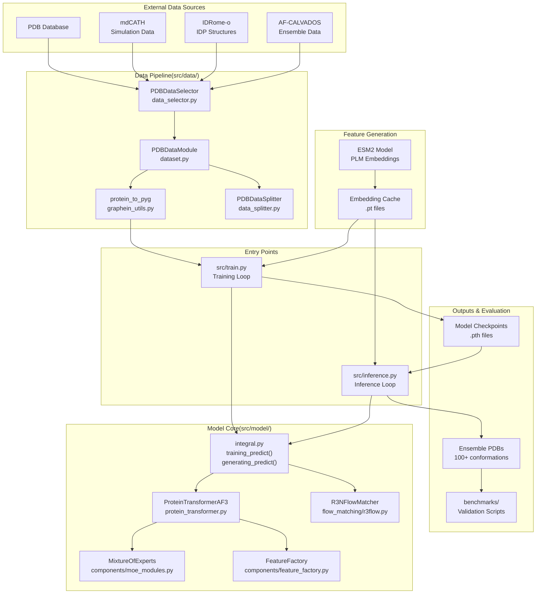
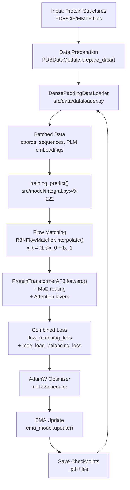
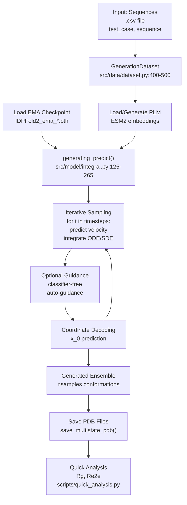
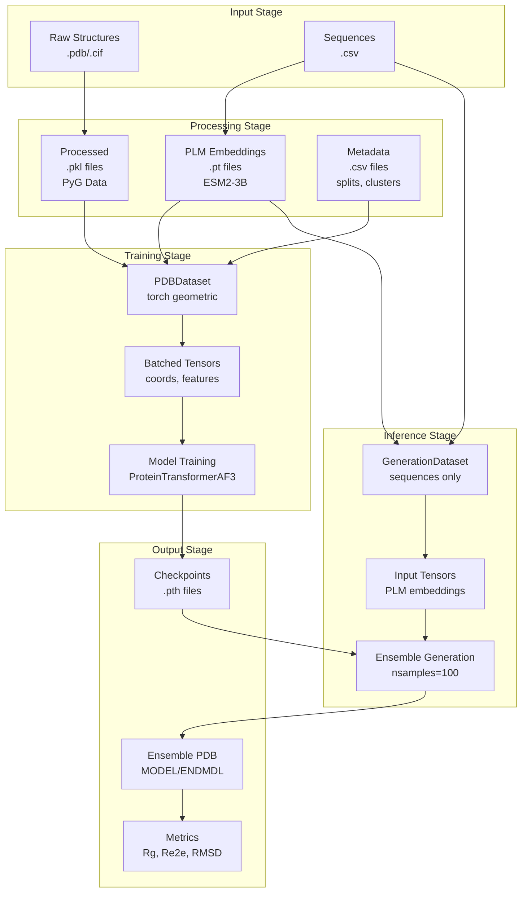

# Overview

> **Relevant source files**
> * [README.md](https://github.com/Junjie-Zhu/IDPFold2/blob/5315b279/README.md?plain=1)

This document provides a high-level introduction to IDPFold2, describing its purpose, architecture, and main components. For detailed information about specific subsystems, refer to the corresponding section pages:

* For installation and setup instructions, see [Getting Started](/Junjie-Zhu/IDPFold2/2-getting-started)
* For training a model, see [Training](/Junjie-Zhu/IDPFold2/6-training)
* For generating ensembles, see [Inference](/Junjie-Zhu/IDPFold2/7-inference)
* For model architecture details, see [Model Architecture](/Junjie-Zhu/IDPFold2/5-model-architecture)

## Purpose and Scope

IDPFold2 is a generative framework for predicting protein conformational ensembles, particularly designed to handle intrinsically disordered proteins (IDPs), multidomain proteins, and protein complexes. The system addresses the challenge of modeling heterogeneous protein thermodynamics by integrating a Mixture-of-Experts (MoE) architecture into a flow matching framework.

The codebase provides:

* **Training infrastructure** for building models on hybrid protein datasets
* **Inference pipeline** for generating diverse conformational ensembles
* **Evaluation tools** for validating generated structures against experimental data

IDPFold2 is trained on a hybrid dataset combining structural data from PDB, mdCATH, IDRome-o, and AF-CALVADOS, and has been tested against BioEmu-Benchmarks and PeptoneBench.

Sources: [README.md L1-L14](https://github.com/Junjie-Zhu/IDPFold2/blob/5315b279/README.md?plain=1#L1-L14)

## System Architecture

The IDPFold2 system consists of five major subsystems that work together to enable protein ensemble generation:



**System Architecture: Major Components and Code Entities**

This diagram maps the high-level system components to their corresponding code files and key functions. The system flows from external data sources through data preparation, into the model core, and produces checkpoints and ensembles for evaluation.

Sources: [README.md L1-L14](https://github.com/Junjie-Zhu/IDPFold2/blob/5315b279/README.md?plain=1#L1-L14)

 [src/train.py L1-L50](https://github.com/Junjie-Zhu/IDPFold2/blob/5315b279/src/train.py#L1-L50)

 [src/inference.py L1-L50](https://github.com/Junjie-Zhu/IDPFold2/blob/5315b279/src/inference.py#L1-L50)

 [src/model/integral.py L1-L100](https://github.com/Junjie-Zhu/IDPFold2/blob/5315b279/src/model/integral.py#L1-L100)

## Core Workflows

IDPFold2 operates in two primary modes: **Training** and **Inference**. These workflows share common components but have distinct objectives and data flows.

### Training Workflow



**Training Workflow: From Structures to Model Checkpoints**

The training workflow processes protein structures through data preparation, batches them for efficient processing, performs flow matching-based training with the transformer model and MoE, computes combined losses, optimizes parameters, maintains exponential moving average (EMA) weights, and saves checkpoints.

Sources: [src/train.py L97-L200](https://github.com/Junjie-Zhu/IDPFold2/blob/5315b279/src/train.py#L97-L200)

 [src/model/integral.py L49-L122](https://github.com/Junjie-Zhu/IDPFold2/blob/5315b279/src/model/integral.py#L49-L122)

 [src/data/dataset.py L1-L100](https://github.com/Junjie-Zhu/IDPFold2/blob/5315b279/src/data/dataset.py#L1-L100)

### Inference Workflow



**Inference Workflow: From Sequences to Conformational Ensembles**

The inference workflow takes protein sequences as input, loads or generates PLM embeddings, loads a trained EMA checkpoint, performs iterative flow matching sampling with optional guidance mechanisms, decodes coordinates to generate multiple conformations, saves them as PDB files, and provides quick structural analysis.

Sources: [src/inference.py L1-L200](https://github.com/Junjie-Zhu/IDPFold2/blob/5315b279/src/inference.py#L1-L200)

 [src/model/integral.py L125-L265](https://github.com/Junjie-Zhu/IDPFold2/blob/5315b279/src/model/integral.py#L125-L265)

 [scripts/quick_analysis.py L1-L50](https://github.com/Junjie-Zhu/IDPFold2/blob/5315b279/scripts/quick_analysis.py#L1-L50)

## Key Components

### Data Pipeline

The data pipeline transforms raw protein structures into model-ready tensors through several stages:

| Component | File Path | Purpose |
| --- | --- | --- |
| **PDBDataSelector** | `src/data/data_selector.py` | Filters PDB structures by resolution, length, experiment type |
| **PDBDataModule** | `src/data/dataset.py` | Orchestrates data preparation, splitting, and loading |
| **PDBDataSplitter** | `src/data/data_splitter.py` | Creates train/val splits using sequence similarity clustering |
| **protein_to_pyg** | `src/utils/graphein_utils.py` | Converts protein structures to PyTorch Geometric format |
| **DensePaddingDataLoader** | `src/data/dataloader.py` | Batches variable-length proteins with dense padding |
| **GenerationDataset** | `src/data/dataset.py` | Prepares sequences and embeddings for inference |

For detailed information, see [Data Pipeline](/Junjie-Zhu/IDPFold2/4-data-pipeline).

Sources: [src/data/data_selector.py L1-L100](https://github.com/Junjie-Zhu/IDPFold2/blob/5315b279/src/data/data_selector.py#L1-L100)

 [src/data/dataset.py L1-L500](https://github.com/Junjie-Zhu/IDPFold2/blob/5315b279/src/data/dataset.py#L1-L500)

 [src/data/dataloader.py L1-L100](https://github.com/Junjie-Zhu/IDPFold2/blob/5315b279/src/data/dataloader.py#L1-L100)

### Model Architecture

The core model consists of multiple integrated components:

| Component | File Path | Key Functionality |
| --- | --- | --- |
| **ProteinTransformerAF3** | `src/model/protein_transformer.py` | Main transformer architecture with 10 layers, 12 attention heads |
| **R3NFlowMatcher** | `src/model/flow_matching/r3flow.py` | Flow matching framework for generative modeling |
| **MixtureOfExperts** | `src/model/components/moe_modules.py` | 5 experts with top-2 routing for conditional computation |
| **FeatureFactory** | `src/model/components/feature_factory.py` | Generates sequence and pair features from inputs |
| **AdaptiveLayerNorm** | `src/model/components/adaln.py` | Time-conditioned normalization layers |
| **DenseMultiheadAttention** | `src/model/components/attention.py` | Multi-head attention with pair bias |

For detailed information, see [Model Architecture](/Junjie-Zhu/IDPFold2/5-model-architecture).

Sources: [src/model/protein_transformer.py L1-L200](https://github.com/Junjie-Zhu/IDPFold2/blob/5315b279/src/model/protein_transformer.py#L1-L200)

 [src/model/flow_matching/r3flow.py L1-L150](https://github.com/Junjie-Zhu/IDPFold2/blob/5315b279/src/model/flow_matching/r3flow.py#L1-L150)

 [src/model/components/moe_modules.py L1-L200](https://github.com/Junjie-Zhu/IDPFold2/blob/5315b279/src/model/components/moe_modules.py#L1-L200)

### Training Components

The training system manages the optimization process:

| Component | File Path | Key Functionality |
| --- | --- | --- |
| **training_predict** | `src/model/integral.py:49-122` | Computes flow matching predictions during training |
| **FlowMatchingLoss** | `src/model/integral.py` | Loss function for flow matching objective |
| **MoELoadBalancingLoss** | `src/model/components/moe_modules.py` | Auxiliary loss for expert load balancing |
| **AdamW Optimizer** | `src/train.py` | Parameter optimization |
| **AlphaFold3Scheduler** | `src/model/lr_schedulers.py` | Learning rate scheduling strategy |
| **EMA Wrapper** | `src/utils/ema.py` | Exponential moving average for stable inference |

For detailed information, see [Training](/Junjie-Zhu/IDPFold2/6-training).

Sources: [src/model/integral.py L49-L122](https://github.com/Junjie-Zhu/IDPFold2/blob/5315b279/src/model/integral.py#L49-L122)

 [src/train.py L150-L250](https://github.com/Junjie-Zhu/IDPFold2/blob/5315b279/src/train.py#L150-L250)

 [src/model/lr_schedulers.py L1-L100](https://github.com/Junjie-Zhu/IDPFold2/blob/5315b279/src/model/lr_schedulers.py#L1-L100)

### Inference Components

The inference system generates conformational ensembles:

| Component | File Path | Key Functionality |
| --- | --- | --- |
| **generating_predict** | `src/model/integral.py:125-265` | Iterative sampling for structure generation |
| **ClassifierFreeGuidance** | `src/model/integral.py` | Conditional generation with guidance scaling |
| **AutoGuidance** | `src/model/integral.py` | Secondary model-based guidance |
| **save_multistate_pdb** | `src/utils/pdb_utils.py` | Writes ensemble to PDB format with MODEL/ENDMDL |
| **Multi-device inference** | `src/inference.py` | Distributed generation with torchrun |

For detailed information, see [Inference](/Junjie-Zhu/IDPFold2/7-inference).

Sources: [src/model/integral.py L125-L265](https://github.com/Junjie-Zhu/IDPFold2/blob/5315b279/src/model/integral.py#L125-L265)

 [src/inference.py L1-L200](https://github.com/Junjie-Zhu/IDPFold2/blob/5315b279/src/inference.py#L1-L200)

 [src/utils/pdb_utils.py L1-L150](https://github.com/Junjie-Zhu/IDPFold2/blob/5315b279/src/utils/pdb_utils.py#L1-L150)

### Evaluation Tools

The evaluation suite validates generated ensembles:

| Component | File Path | Purpose |
| --- | --- | --- |
| **quick_analysis.py** | `scripts/quick_analysis.py` | Calculates Rg and Re2e for ensembles |
| **compare_to_multi_conf.py** | `benchmarks/compare_to_multi_conf.py` | RMSD and native contact analysis vs BioEmu |
| **analyze_saxs_integrative.py** | `benchmarks/analyze_saxs_integrative.py` | SAXS profile reweighting |
| **analyze_cs_integrative.py** | `benchmarks/analyze_cs_integrative.py` | Chemical shift reweighting |
| **analyze_pre_integrative.py** | `benchmarks/analyze_pre_integrative.py` | PRE data reweighting |
| **analyze_rdc_integrative.py** | `benchmarks/analyze_rdc_integrative.py` | RDC data reweighting |
| **_cg2all.py** | `scripts/_cg2all.py` | Backmapping to all-atom structures |

For detailed information, see [Evaluation and Analysis](/Junjie-Zhu/IDPFold2/8-evaluation-and-analysis).

Sources: [scripts/quick_analysis.py L1-L50](https://github.com/Junjie-Zhu/IDPFold2/blob/5315b279/scripts/quick_analysis.py#L1-L50)

 [benchmarks/compare_to_multi_conf.py L1-L100](https://github.com/Junjie-Zhu/IDPFold2/blob/5315b279/benchmarks/compare_to_multi_conf.py#L1-L100)

 [scripts/_cg2all.py L1-L50](https://github.com/Junjie-Zhu/IDPFold2/blob/5315b279/scripts/_cg2all.py#L1-L50)

## Data Flow

The following diagram illustrates how data flows through the IDPFold2 system from raw input to final output:



**Data Flow: Processing Pipeline from Input to Output**

This diagram shows the transformation of data through IDPFold2. Raw structures are converted to PyTorch Geometric format and cached as `.pkl` files. PLM embeddings are generated using ESM2 and cached as `.pt` files. During training, these are combined with metadata and batched for the model, producing checkpoints. During inference, sequences are combined with cached embeddings to generate ensembles saved as PDB files, which can then be analyzed.

Sources: [src/utils/graphein_utils.py L1-L200](https://github.com/Junjie-Zhu/IDPFold2/blob/5315b279/src/utils/graphein_utils.py#L1-L200)

 [scripts/get_esm_embedding.py L1-L100](https://github.com/Junjie-Zhu/IDPFold2/blob/5315b279/scripts/get_esm_embedding.py#L1-L100)

 [src/data/dataset.py L1-L500](https://github.com/Junjie-Zhu/IDPFold2/blob/5315b279/src/data/dataset.py#L1-L500)

## Technical Approach

IDPFold2 employs two key technical innovations for protein ensemble generation:

### Flow Matching Framework

The system uses **continuous normalizing flows** implemented via the `R3NFlowMatcher` class to model the distribution of protein conformations. The approach:

1. **Interpolates** between initial noise distribution `x_0` and target structure `x_1` at time `t`: ``` x_t = (1 - t) * x_0 + t * x_1 ```
2. **Predicts velocity field** `v_t` that describes how coordinates should move at each timestep
3. **Samples** by integrating the learned vector field from `t=1` to `t=0` using ODE/SDE solvers

This is implemented in `R3NFlowMatcher.interpolate()` for training and `R3NFlowMatcher.sample()` for generation.

Sources: [src/model/flow_matching/r3flow.py L1-L150](https://github.com/Junjie-Zhu/IDPFold2/blob/5315b279/src/model/flow_matching/r3flow.py#L1-L150)

 [src/model/integral.py L49-L265](https://github.com/Junjie-Zhu/IDPFold2/blob/5315b279/src/model/integral.py#L49-L265)

### Mixture of Experts Architecture

The system integrates a **Mixture of Experts (MoE)** layer into each transformer block to handle the heterogeneous nature of protein structures (ordered vs. disordered, monomers vs. multimers):

* **5 expert networks** provide specialized processing capabilities
* **Top-2 routing** activates 2 experts per token for conditional computation
* **Load balancing loss** ensures experts are utilized evenly across the batch
* **Capacity factors** control how many tokens each expert can process

The MoE implementation supports both PyTorch-native and MegaBlocks-accelerated versions, configured in `configs/train.yaml`.

Sources: [src/model/components/moe_modules.py L1-L200](https://github.com/Junjie-Zhu/IDPFold2/blob/5315b279/src/model/components/moe_modules.py#L1-L200)

 [README.md L46-L58](https://github.com/Junjie-Zhu/IDPFold2/blob/5315b279/README.md?plain=1#L46-L58)

## Configuration System

IDPFold2 uses **Hydra** for configuration management with YAML files:

* **`configs/train.yaml`**: Training parameters including model architecture, data settings, optimizer configuration, and conditioning strategies
* **`configs/inference.yaml`**: Inference parameters including sampling settings, guidance options, and output configuration

Configuration parameters can be overridden via command line:

```
python src/train.py batch_size=8 epochs=500 data.data_dir=/path/to/data
```

For complete configuration reference, see [Configuration Reference](/Junjie-Zhu/IDPFold2/10-configuration-reference).

Sources: [configs/train.yaml L1-L200](https://github.com/Junjie-Zhu/IDPFold2/blob/5315b279/configs/train.yaml#L1-L200)

 [configs/inference.yaml L1-L100](https://github.com/Junjie-Zhu/IDPFold2/blob/5315b279/configs/inference.yaml#L1-L100)

 [README.md L34-L58](https://github.com/Junjie-Zhu/IDPFold2/blob/5315b279/README.md?plain=1#L34-L58)

## Directory Structure

The codebase is organized into the following key directories:

| Directory | Purpose |
| --- | --- |
| `src/` | Core implementation code |
| `src/data/` | Data loading, processing, and transformation |
| `src/model/` | Model architecture and training logic |
| `src/model/components/` | Modular components (MoE, attention, features) |
| `src/model/flow_matching/` | Flow matching implementation |
| `src/utils/` | Utility functions for PDB I/O, distributed training |
| `src/common/` | Constants and shared definitions |
| `configs/` | Hydra configuration files |
| `scripts/` | Standalone scripts for preprocessing and analysis |
| `benchmarks/` | Evaluation scripts for validation against experimental data |
| `megablocks/` | Optional accelerated MoE implementation |

Sources: [README.md L1-L284](https://github.com/Junjie-Zhu/IDPFold2/blob/5315b279/README.md?plain=1#L1-L284)

## Getting Started

To begin using IDPFold2:

1. **Installation**: Set up the environment and download model weights - see [Getting Started](/Junjie-Zhu/IDPFold2/2-getting-started)
2. **Run Inference**: Generate ensembles for your sequences - see [Inference](/Junjie-Zhu/IDPFold2/7-inference)
3. **Train a Model**: Build custom models on your data - see [Training](/Junjie-Zhu/IDPFold2/6-training)
4. **Evaluate Results**: Validate generated structures - see [Evaluation and Analysis](/Junjie-Zhu/IDPFold2/8-evaluation-and-analysis)

For quick testing, you can run inference on example sequences:

```
python src/inference.py \    prefix=TEST \    ckpt_dir=IDPFold2_ema_0.999_260114.pth \    plm_emb_dir=./embeddings \    csv_dir=data/example.csv \    nsamples=100
```

Sources: [README.md L65-L114](https://github.com/Junjie-Zhu/IDPFold2/blob/5315b279/README.md?plain=1#L65-L114)