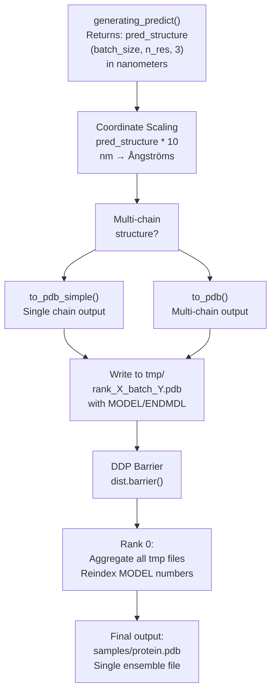
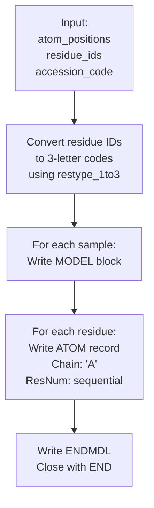
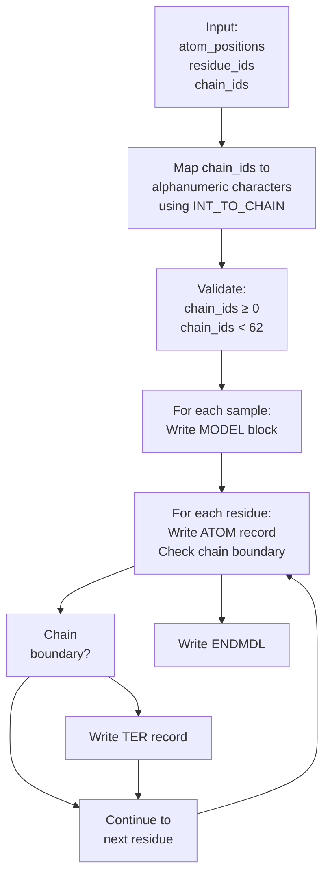
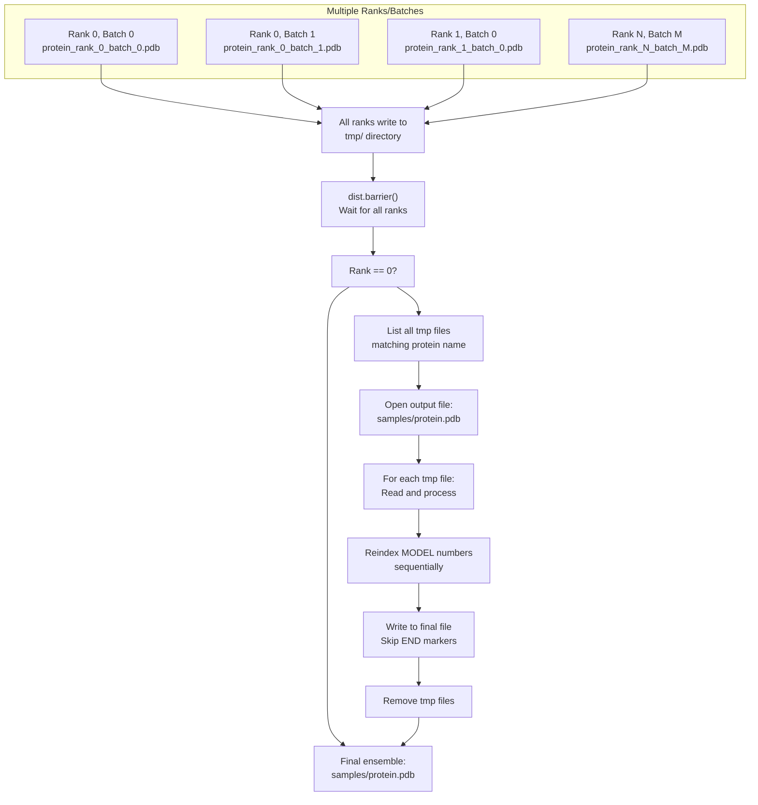
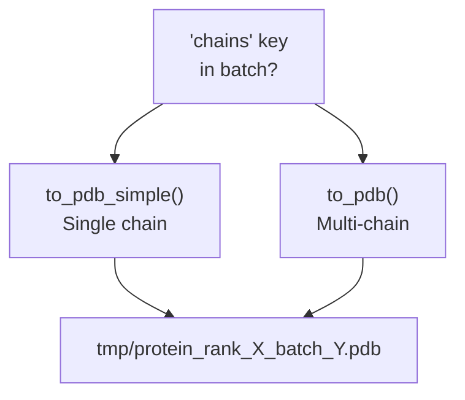

# PDB Output Generation

> **Relevant source files**
> * [configs/inference.yaml](https://github.com/Junjie-Zhu/IDPFold2/blob/5315b279/configs/inference.yaml)
> * [src/inference.py](https://github.com/Junjie-Zhu/IDPFold2/blob/5315b279/src/inference.py)
> * [src/utils/pdb_utils.py](https://github.com/Junjie-Zhu/IDPFold2/blob/5315b279/src/utils/pdb_utils.py)

## Purpose and Scope

This document describes how IDPFold2 converts predicted protein structures into PDB file format after the inference process completes. This includes coordinate scaling from nanometers to Ångströms, single-chain and multi-chain structure handling, MODEL/ENDMDL formatting for ensemble outputs, and aggregation of distributed inference results.

For information about the prediction generation process itself, see [Generating Predict Function](/Junjie-Zhu/IDPFold2/7.2-generating-predict-function). For multi-device inference distribution, see [Multi-Device Inference](/Junjie-Zhu/IDPFold2/7.5-multi-device-inference).

---

## Overview of PDB Output Workflow

The PDB output generation occurs immediately after the `generating_predict` function returns predicted structures. The workflow involves coordinate scaling, format conversion, and file aggregation when using distributed inference.



**Sources:** [src/inference.py L281-L342](https://github.com/Junjie-Zhu/IDPFold2/blob/5315b279/src/inference.py#L281-L342)

---

## Coordinate Scaling and Processing

After prediction, coordinates must be scaled from the model's internal representation (nanometers) to the PDB standard format (Ångströms). This is a simple multiplication by 10.

| Operation | Input Units | Output Units | Scaling Factor |
| --- | --- | --- | --- |
| Model prediction | Nanometers (nm) | N/A | 1.0 |
| PDB output | Ångströms (Å) | Ångströms (Å) | 10.0 |

The scaling occurs at lines [src/inference.py L299](https://github.com/Junjie-Zhu/IDPFold2/blob/5315b279/src/inference.py#L299-L299)

 and [src/inference.py L306](https://github.com/Junjie-Zhu/IDPFold2/blob/5315b279/src/inference.py#L306-L306)

:

```python
pred_structure * 10  # Convert from nm to Ångströms
```

The predicted structure tensor has shape `(n_samples, n_residues, 3)` representing Cα coordinates for each residue in each generated sample.

**Sources:** [src/inference.py L296-L311](https://github.com/Junjie-Zhu/IDPFold2/blob/5315b279/src/inference.py#L296-L311)

---

## Single-Chain Output Generation

For proteins without chain separation information, the `to_pdb_simple` function generates PDB files with all residues assigned to chain 'A'.



### Function Signature

The `to_pdb_simple` function is defined at [src/utils/pdb_utils.py L21-L59](https://github.com/Junjie-Zhu/IDPFold2/blob/5315b279/src/utils/pdb_utils.py#L21-L59)

:

**Parameters:**

* `atom_positions`: Tensor of shape `(n_samples, n_res, 3)` in Ångströms
* `residue_ids`: Tensor of shape `(n_res,)` containing residue type indices
* `output_dir`: Directory path for output file
* `accession_code`: Protein identifier (optional)

### ATOM Record Format

Each residue generates one ATOM record following PDB format:

```
ATOM  {atom_num:>5} {atom_name:<4} {resname:>3} {chain}{res_idx:>4}    {x:8.3f}{y:8.3f}{z:8.3f}  1.00  0.00           {element:>2}
```

**Fixed values:**

* `atom_name`: Always 'CA' (Cα backbone atom)
* `chain`: Always 'A'
* `occupancy`: 1.00
* `temperature_factor`: 0.00

**Sources:** [src/utils/pdb_utils.py L21-L59](https://github.com/Junjie-Zhu/IDPFold2/blob/5315b279/src/utils/pdb_utils.py#L21-L59)

---

## Multi-Chain Output Generation

For protein complexes or multi-chain structures, the `to_pdb` function handles chain assignment and TER record insertion at chain boundaries.



### Chain ID Mapping

Chain IDs are mapped from integer indices to alphanumeric characters using predefined mappings at [src/utils/pdb_utils.py L12-L18](https://github.com/Junjie-Zhu/IDPFold2/blob/5315b279/src/utils/pdb_utils.py#L12-L18)

:

```
ALPHANUMERIC = string.ascii_letters + string.digits + ' 'INT_TO_CHAIN = {i: chain_char for i, chain_char in enumerate(ALPHANUMERIC)}
```

This provides 62 possible chain identifiers: A-Z, a-z, 0-9, plus space.

### TER Record Insertion

TER records are inserted at chain boundaries to properly separate chains in the PDB file. This occurs at [src/utils/pdb_utils.py L96-L103](https://github.com/Junjie-Zhu/IDPFold2/blob/5315b279/src/utils/pdb_utils.py#L96-L103)

:

**Conditions for TER record:**

1. Last residue of the structure (line 96-99)
2. Current residue and next residue have different chain IDs (line 100-103)

**TER record format:**

```
TER   {atom_num:>5}      {resname:>3} {chain}{res_idx:>4}
```

**Sources:** [src/utils/pdb_utils.py L61-L107](https://github.com/Junjie-Zhu/IDPFold2/blob/5315b279/src/utils/pdb_utils.py#L61-L107)

---

## Ensemble Formatting with MODEL/ENDMDL

Each generated conformational sample is written as a separate MODEL in the PDB file, allowing multiple structures to be stored in a single file.

### MODEL Block Structure

```
MODEL 1
ATOM  ...
ATOM  ...
ENDMDL
MODEL 2
ATOM  ...
ATOM  ...
ENDMDL
...
END
```

| Component | Purpose | Location |
| --- | --- | --- |
| `MODEL {num}` | Begin new structure model | [src/utils/pdb_utils.py L43](https://github.com/Junjie-Zhu/IDPFold2/blob/5315b279/src/utils/pdb_utils.py#L43-L43) <br>  [src/utils/pdb_utils.py L83](https://github.com/Junjie-Zhu/IDPFold2/blob/5315b279/src/utils/pdb_utils.py#L83-L83) |
| `ATOM` records | Coordinate data | Loop body |
| `TER` records | Chain termination (multi-chain only) | [src/utils/pdb_utils.py L97-L103](https://github.com/Junjie-Zhu/IDPFold2/blob/5315b279/src/utils/pdb_utils.py#L97-L103) |
| `ENDMDL` | End current model | [src/utils/pdb_utils.py L57](https://github.com/Junjie-Zhu/IDPFold2/blob/5315b279/src/utils/pdb_utils.py#L57-L57) <br>  [src/utils/pdb_utils.py L105](https://github.com/Junjie-Zhu/IDPFold2/blob/5315b279/src/utils/pdb_utils.py#L105-L105) |
| `END` | End of file | [src/utils/pdb_utils.py L58](https://github.com/Junjie-Zhu/IDPFold2/blob/5315b279/src/utils/pdb_utils.py#L58-L58) <br>  [src/utils/pdb_utils.py L106](https://github.com/Junjie-Zhu/IDPFold2/blob/5315b279/src/utils/pdb_utils.py#L106-L106) |

### Model Numbering

Models are numbered sequentially starting from 1. During distributed inference aggregation, MODEL numbers are reindexed to maintain sequential ordering across all ranks and batches (see next section).

**Sources:** [src/utils/pdb_utils.py L42-L58](https://github.com/Junjie-Zhu/IDPFold2/blob/5315b279/src/utils/pdb_utils.py#L42-L58)

 [src/utils/pdb_utils.py L82-L106](https://github.com/Junjie-Zhu/IDPFold2/blob/5315b279/src/utils/pdb_utils.py#L82-L106)

---

## Distributed Inference File Aggregation

When using distributed inference with multiple GPUs, each rank and batch generates temporary PDB files that must be aggregated into a single ensemble file.



### Aggregation Process

The aggregation logic is implemented at [src/inference.py L318-L342](https://github.com/Junjie-Zhu/IDPFold2/blob/5315b279/src/inference.py#L318-L342)

:

**Step 1: Synchronization** (line 319-320)

```
if DIST_WRAPPER.world_size > 1:    dist.barrier(async_op=False)
```

All ranks wait until all have finished generating their assigned samples.

**Step 2: File Discovery** (line 326-327)

```
tmp_files = [i for i in os.listdir(os.path.join(logging_dir, "tmp"))             if i.startswith(inference_dict['name'][0])]
```

Rank 0 identifies all temporary files for the current protein.

**Step 3: Sequential Aggregation** (line 328-340)

For each temporary file:

* Open the file and read line by line
* When encountering `MODEL` lines, replace with reindexed model number
* Skip `END` markers (only write final `END` at the end)
* Write all other lines directly to output file

**Step 4: Cleanup** (line 341-342)

```
os.remove(os.path.join(logging_dir, "tmp", f))
```

Remove temporary files after successful aggregation.

### Output Directory Structure

```markdown
logging_dir/
├── samples/          # Final aggregated ensembles
│   └── protein.pdb   # One file per protein
├── tmp/              # Temporary per-rank/batch files
│   ├── protein_rank_0_batch_0.pdb
│   ├── protein_rank_0_batch_1.pdb
│   └── ...
└── config.yaml       # Inference configuration
```

**Sources:** [src/inference.py L176-L177](https://github.com/Junjie-Zhu/IDPFold2/blob/5315b279/src/inference.py#L176-L177)

 [src/inference.py L318-L342](https://github.com/Junjie-Zhu/IDPFold2/blob/5315b279/src/inference.py#L318-L342)

---

## Chain ID Assignment and Validation

### Chain ID Validation

Before writing multi-chain structures, chain IDs are validated at [src/utils/pdb_utils.py L74-L76](https://github.com/Junjie-Zhu/IDPFold2/blob/5315b279/src/utils/pdb_utils.py#L74-L76)

:

**Validation checks:**

1. `chain_ids.min() > -1`: All chain IDs must be non-negative
2. `chain_ids.max() < len(ALPHANUMERIC)`: Maximum chain ID must be less than 62

If validation fails, an assertion error is raised with a descriptive message.

### Chain ID Conversion

The conversion from integer indices to chain characters happens at [src/utils/pdb_utils.py L76](https://github.com/Junjie-Zhu/IDPFold2/blob/5315b279/src/utils/pdb_utils.py#L76-L76)

:

```
chain_ids = [INT_TO_CHAIN[chain_ids[i].item()] for i in range(n_res)]
```

This creates a list of chain characters matching the length of the structure, where each residue is assigned its corresponding chain identifier.

### Residue Type Conversion

Residue types are converted from indices to 3-letter codes at [src/utils/pdb_utils.py L36](https://github.com/Junjie-Zhu/IDPFold2/blob/5315b279/src/utils/pdb_utils.py#L36-L36)

 and [src/utils/pdb_utils.py L72](https://github.com/Junjie-Zhu/IDPFold2/blob/5315b279/src/utils/pdb_utils.py#L72-L72)

:

```
residue_types = [rc.restype_1to3[rc.restypes[residue_ids[i].item()]] for i in range(n_res)]
```

This uses the `restype_1to3` mapping from `residue_constants` to convert single-letter codes (e.g., 'A') to three-letter codes (e.g., 'ALA').

**Sources:** [src/utils/pdb_utils.py L12-L18](https://github.com/Junjie-Zhu/IDPFold2/blob/5315b279/src/utils/pdb_utils.py#L12-L18)

 [src/utils/pdb_utils.py L74-L76](https://github.com/Junjie-Zhu/IDPFold2/blob/5315b279/src/utils/pdb_utils.py#L74-L76)

 [src/common/residue_constants.py](https://github.com/Junjie-Zhu/IDPFold2/blob/5315b279/src/common/residue_constants.py)

---

## Usage in Inference Pipeline

The PDB output generation is automatically invoked during inference at [src/inference.py L297-L311](https://github.com/Junjie-Zhu/IDPFold2/blob/5315b279/src/inference.py#L297-L311)

:

### Decision Logic



### Parameters Passed

**Single-chain (to_pdb_simple):**

* `atom_positions`: `pred_structure * 10` (scaled coordinates)
* `residue_ids`: `inference_dict['residue_type'].squeeze()`
* `output_dir`: `os.path.join(logging_dir, "tmp")`
* `accession_code`: `f"{name}_rank_{DIST_WRAPPER.rank}_batch_{batch_idx}"`

**Multi-chain (to_pdb):**

* Additional parameter: `chain_ids`: `inference_dict["chains"].squeeze()`

### Configuration Parameters

Relevant inference configuration parameters from [configs/inference.yaml](https://github.com/Junjie-Zhu/IDPFold2/blob/5315b279/configs/inference.yaml)

:

| Parameter | Default | Description |
| --- | --- | --- |
| `logging_dir` | `"./logs"` | Base directory for all outputs |
| `load_multimer` | `False` | Whether to load multi-chain structures |
| `nsamples` | `100` | Number of samples per protein |

**Sources:** [src/inference.py L297-L311](https://github.com/Junjie-Zhu/IDPFold2/blob/5315b279/src/inference.py#L297-L311)

 [configs/inference.yaml L19](https://github.com/Junjie-Zhu/IDPFold2/blob/5315b279/configs/inference.yaml#L19-L19)

 [configs/inference.yaml L25](https://github.com/Junjie-Zhu/IDPFold2/blob/5315b279/configs/inference.yaml#L25-L25)