# Protein Data Processing

> **Relevant source files**
> * [src/common/atom37_constants.py](https://github.com/Junjie-Zhu/IDPFold2/blob/5315b279/src/common/atom37_constants.py)
> * [src/data/dataset.py](https://github.com/Junjie-Zhu/IDPFold2/blob/5315b279/src/data/dataset.py)
> * [src/model/ema.py](https://github.com/Junjie-Zhu/IDPFold2/blob/5315b279/src/model/ema.py)
> * [src/model/flow_matching/r3flow.py](https://github.com/Junjie-Zhu/IDPFold2/blob/5315b279/src/model/flow_matching/r3flow.py)
> * [src/utils/graphein_utils.py](https://github.com/Junjie-Zhu/IDPFold2/blob/5315b279/src/utils/graphein_utils.py)

## Purpose and Scope

This page documents the protein data processing utilities in IDPFold2, which handle downloading, parsing, filtering, and converting protein structures into model-ready formats. The system transforms raw PDB/MMCIF/MMTF files into PyTorch Geometric `Data` objects with standardized atom representations and metadata.

For information about how processed data is loaded during training, see [Data Loading and Batching](/Junjie-Zhu/IDPFold2/4.3-data-loading-and-batching). For details on data transformations and augmentations applied to processed structures, see [Data Transforms and Augmentation](/Junjie-Zhu/IDPFold2/4.4-data-transforms-and-augmentation). For PLM embedding generation, see [Feature Generation](/Junjie-Zhu/IDPFold2/4.2-feature-generation).

---

## Processing Pipeline Overview

The protein data processing pipeline consists of several stages that transform raw structure files into training-ready tensors:

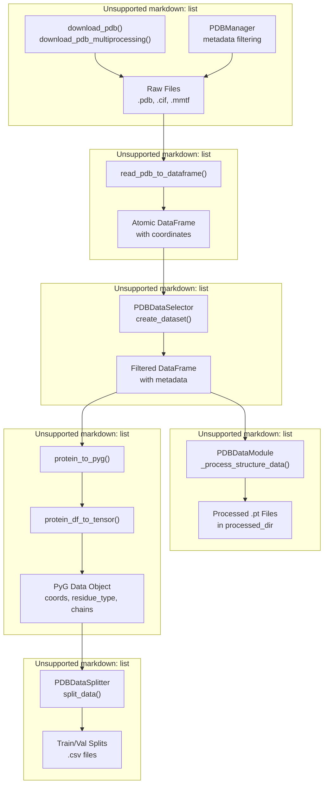

**Sources:** [src/utils/graphein_utils.py L1000-L1146](https://github.com/Junjie-Zhu/IDPFold2/blob/5315b279/src/utils/graphein_utils.py#L1000-L1146)

 [src/data/dataset.py L46-L234](https://github.com/Junjie-Zhu/IDPFold2/blob/5315b279/src/data/dataset.py#L46-L234)

 [src/data/dataset.py L236-L335](https://github.com/Junjie-Zhu/IDPFold2/blob/5315b279/src/data/dataset.py#L236-L335)

 [src/data/dataset.py L628-L820](https://github.com/Junjie-Zhu/IDPFold2/blob/5315b279/src/data/dataset.py#L628-L820)

---

## PDB Structure Downloading

### download_pdb Function

The `download_pdb` function retrieves structures from the RCSB PDB in various formats:

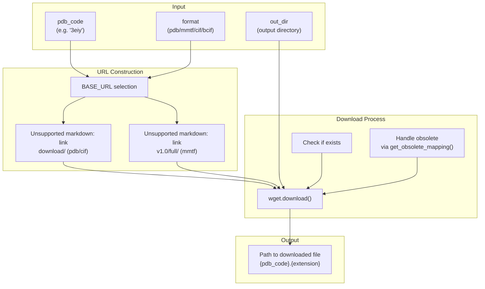

| Parameter | Type | Description |
| --- | --- | --- |
| `pdb_code` | str | 4-character PDB accession code |
| `out_dir` | str/Path | Directory to save structure |
| `format` | Literal | `"pdb"`, `"mmtf"`, `"cif"`, or `"bcif"` |
| `check_obsolete` | bool | Check for deprecated PDB codes |
| `overwrite` | bool | Overwrite existing files |
| `strict` | bool | Raise exception if not found |

**Sources:** [src/utils/graphein_utils.py L1050-L1146](https://github.com/Junjie-Zhu/IDPFold2/blob/5315b279/src/utils/graphein_utils.py#L1050-L1146)

### Parallel Downloading

For batch downloads, `download_pdb_multiprocessing` parallelizes the process:

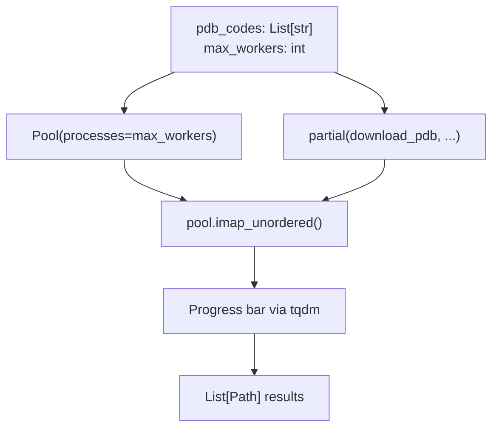

**Sources:** [src/utils/graphein_utils.py L1000-L1048](https://github.com/Junjie-Zhu/IDPFold2/blob/5315b279/src/utils/graphein_utils.py#L1000-L1048)

---

## Structure Parsing to DataFrame

### read_pdb_to_dataframe

Converts structure files to pandas DataFrames with atomic coordinates and metadata:

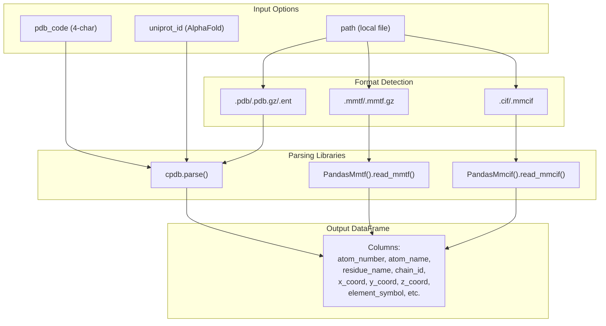

The output DataFrame contains columns defined in `pdb_df_columns`:

| Column | Description |
| --- | --- |
| `record_name` | ATOM or HETATM |
| `atom_number` | Serial atom number |
| `atom_name` | Atom type (e.g., CA, CB) |
| `residue_name` | 3-letter residue code |
| `chain_id` | Chain identifier |
| `residue_number` | Residue sequence number |
| `x_coord`, `y_coord`, `z_coord` | Cartesian coordinates |
| `element_symbol` | Chemical element |
| `b_factor` | Temperature factor |

**Sources:** [src/utils/graphein_utils.py L328-L401](https://github.com/Junjie-Zhu/IDPFold2/blob/5315b279/src/utils/graphein_utils.py#L328-L401)

 [src/utils/graphein_utils.py L908-L931](https://github.com/Junjie-Zhu/IDPFold2/blob/5315b279/src/utils/graphein_utils.py#L908-L931)

---

## Converting Structures to PyTorch Geometric

### protein_to_pyg Function

The `protein_to_pyg` function is the main entry point for converting protein structures to PyTorch Geometric `Data` objects:

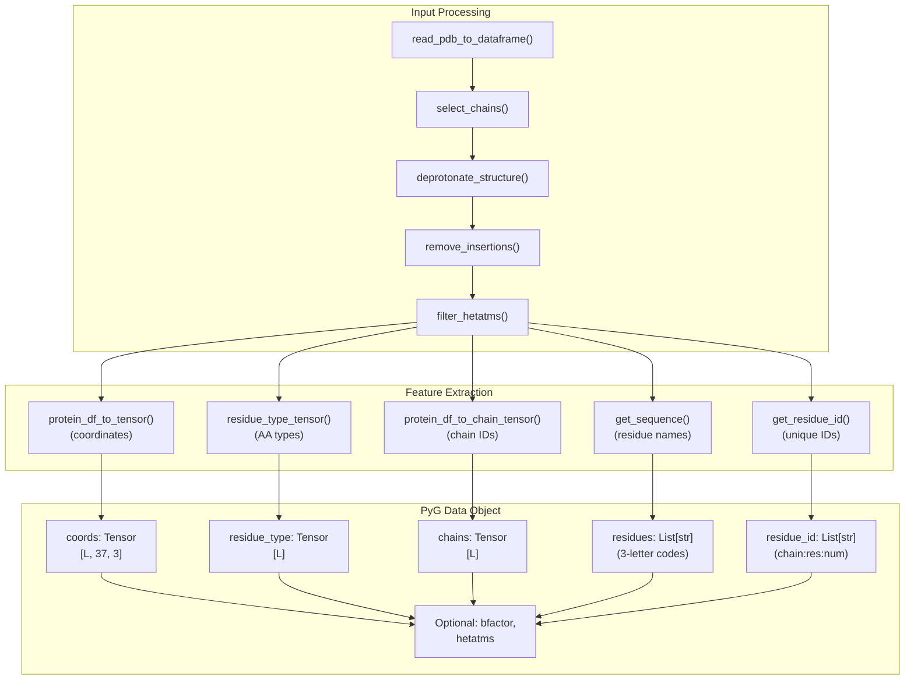

**Key Parameters:**

| Parameter | Type | Default | Description |
| --- | --- | --- | --- |
| `path` | str/PathLike | None | Path to structure file |
| `pdb_code` | str | None | PDB accession code |
| `chain_selection` | str/List[str] | "all" | Chains to include |
| `atom_types` | List[str] | `PROTEIN_ATOMS` | Atom types to extract (37 atoms) |
| `remove_nonstandard` | bool | True | Remove non-standard residues |
| `keep_insertions` | bool | True | Keep insertion residues |
| `fill_value_coords` | float | 1e-5 | Fill value for missing atoms |

**Sources:** [src/utils/graphein_utils.py L717-L906](https://github.com/Junjie-Zhu/IDPFold2/blob/5315b279/src/utils/graphein_utils.py#L717-L906)

### protein_df_to_tensor

Converts atomic DataFrame to a `[L, 37, 3]` tensor where L is protein length, 37 is the number of atom types (from `PROTEIN_ATOMS`), and 3 is x/y/z coordinates:

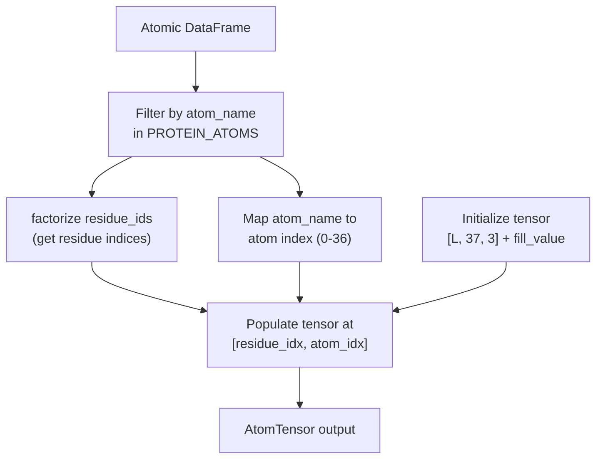

**Sources:** [src/utils/graphein_utils.py L466-L503](https://github.com/Junjie-Zhu/IDPFold2/blob/5315b279/src/utils/graphein_utils.py#L466-L503)

---

## Atom Type Definitions and Mappings

### PROTEIN_ATOMS and Atom Ordering

IDPFold2 uses a 37-atom representation defined in `PROTEIN_ATOMS`:

```json
["N", "CA", "C", "O", "CB", "OG", "CG", "CD1", "CD2", "CE1", "CE2", "CZ", 
 "OD1", "ND2", "CG1", "CG2", "CD", "CE", "NZ", "OD2", "OE1", "NE2", "OE2", 
 "OH", "NE", "NH1", "NH2", "OG1", "SD", "ND1", "SG", "NE1", "CE3", "CZ2", 
 "CZ3", "CH2", "OXT"]
```

**Sources:** [src/utils/graphein_utils.py L221-L260](https://github.com/Junjie-Zhu/IDPFold2/blob/5315b279/src/utils/graphein_utils.py#L221-L260)

### PDB to OpenFold Coordinate Reordering

PDB files and OpenFold use different atom orderings. The conversion tensors handle this:

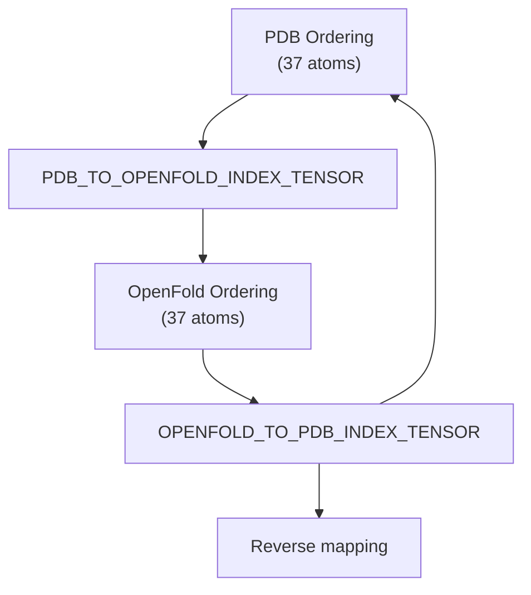

The mapping is performed in `PDBDataset.__getitem__`:

```
graph.coords = graph.coords[:, PDB_TO_OPENFOLD_INDEX_TENSOR, :]graph.coord_mask = graph.coord_mask[:, PDB_TO_OPENFOLD_INDEX_TENSOR]
```

**Sources:** [src/common/atom37_constants.py L101-L111](https://github.com/Junjie-Zhu/IDPFold2/blob/5315b279/src/common/atom37_constants.py#L101-L111)

 [src/data/dataset.py L493-L495](https://github.com/Junjie-Zhu/IDPFold2/blob/5315b279/src/data/dataset.py#L493-L495)

### Atom37 to Atom14 Conversion

For all-atom representations, a mapping converts 37-atom to 14-atom format:

| Function | Returns |
| --- | --- |
| `atom37_to_atom14_indices()` | `indices_mapping` [21, 14], `mask_mapping` [21, 14], `restype_to_idx` dict |
| `ATOM37_TO_ATOM14_INDICES` | Precomputed indices tensor |
| `ATOM14_MASK` | Boolean mask for valid atoms |

**Sources:** [src/common/atom37_constants.py L138-L154](https://github.com/Junjie-Zhu/IDPFold2/blob/5315b279/src/common/atom37_constants.py#L138-L154)

### Residue Mappings

Three-letter to one-letter residue code conversions:

| Constant | Purpose |
| --- | --- |
| `RESI_THREE_TO_1` | Maps 3-letter codes (including non-standard) to 1-letter |
| `STANDARD_AMINO_ACID_MAPPING_3_TO_1` | Maps only standard 20 amino acids |
| `STANDARD_AMINO_ACID_MAPPING_1_TO_3` | Reverse mapping |

**Sources:** [src/utils/graphein_utils.py L83-L218](https://github.com/Junjie-Zhu/IDPFold2/blob/5315b279/src/utils/graphein_utils.py#L83-L218)

---

## PDBManager: Metadata Management

`PDBManager` provides a comprehensive system for filtering PDB structures based on metadata:

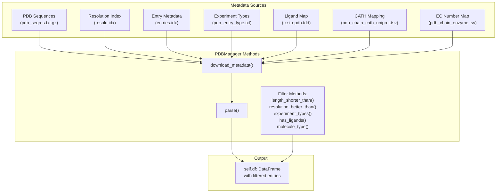

### Initialization Parameters

| Parameter | Type | Description |
| --- | --- | --- |
| `root_dir` | str | Directory for storing metadata |
| `structure_format` | str | "pdb", "mmtf", or "cif" |
| `labels` | List[str] | Metadata labels: "uniprot_id", "cath_code", "ec_number" |

### Key Filtering Methods

| Method | Purpose |
| --- | --- |
| `length_shorter_than(max_length)` | Filter by sequence length |
| `resolution_better_than_or_equal_to(threshold)` | Filter by structure resolution |
| `experiment_types(types_list)` | Keep only specified experiment types |
| `has_ligands(ligand_list, inverse=False)` | Filter by presence/absence of ligands |
| `molecule_type(mol_type)` | Filter by molecule type |
| `oligomeric(count, comparison)` | Filter by oligomeric state |
| `remove_non_standard_alphabet_sequences()` | Remove non-standard residues |
| `remove_unavailable_pdbs()` | Remove structures not available for download |

**Sources:** [src/utils/graphein_utils.py L1566-L2332](https://github.com/Junjie-Zhu/IDPFold2/blob/5315b279/src/utils/graphein_utils.py#L1566-L2332)

---

## PDBDataSelector: Structure Selection Pipeline

`PDBDataSelector` orchestrates the complete filtering pipeline using `PDBManager`:

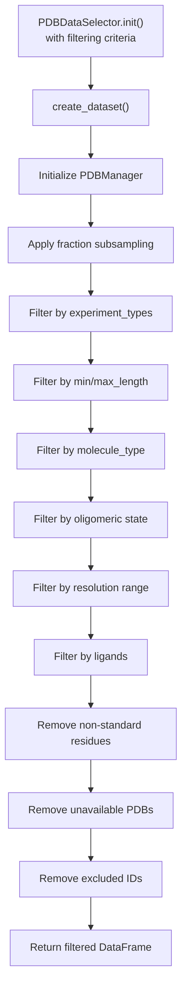

### Constructor Parameters

| Parameter | Type | Description |
| --- | --- | --- |
| `data_dir` | str | Data directory path |
| `fraction` | float | Fraction of data to sample (0-1) |
| `min_length` / `max_length` | int | Sequence length constraints |
| `molecule_type` | str | Molecule type filter |
| `experiment_types` | List[str] | Experiment types to keep |
| `oligomeric_min` / `oligomeric_max` | int | Oligomeric state range |
| `best_resolution` / `worst_resolution` | float | Resolution range (Å) |
| `has_ligands` / `remove_ligands` | List[str] | Ligand filtering |
| `remove_non_standard_residues` | bool | Remove non-standard AAs |
| `remove_pdb_unavailable` | bool | Remove unavailable structures |
| `labels` | List[str] | Metadata labels to include |
| `remove_cath_unavailable` | bool | Remove entries without CATH codes |
| `exclude_ids` / `exclude_ids_from_file` | List[str]/str | IDs to exclude |

**Sources:** [src/data/dataset.py L46-L234](https://github.com/Junjie-Zhu/IDPFold2/blob/5315b279/src/data/dataset.py#L46-L234)

---

## PDBDataSplitter: Train/Val Splitting

`PDBDataSplitter` creates train/validation splits with optional sequence similarity clustering:

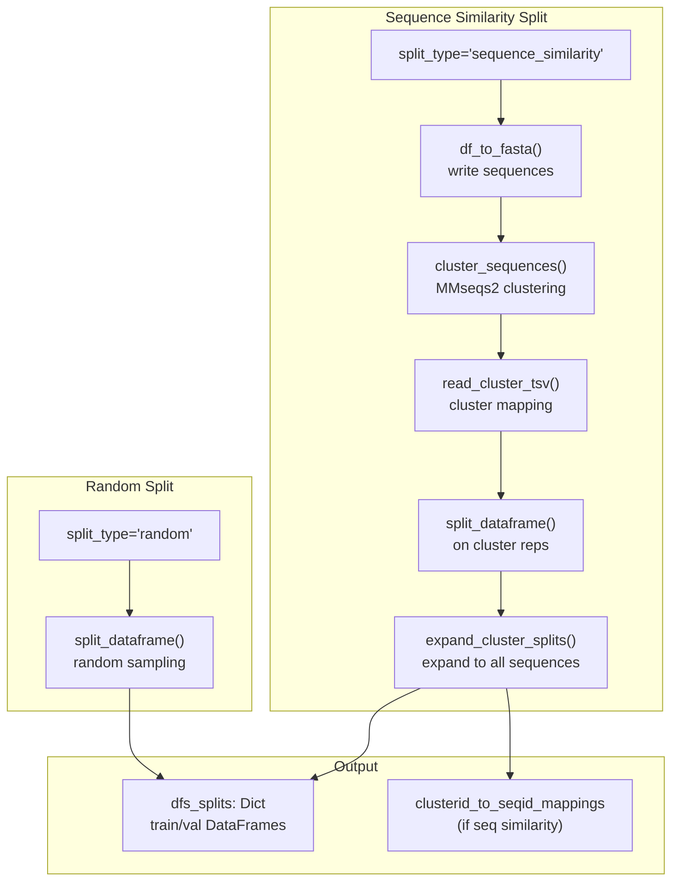

### Parameters

| Parameter | Type | Default | Description |
| --- | --- | --- | --- |
| `df_data` | pd.DataFrame | None | DataFrame to split |
| `data_dir` | str | None | Directory for intermediate files |
| `train_val_test` | List[float] | [0.95, 0.05] | Split proportions |
| `split_type` | str | "random" | "random" or "sequence_similarity" |
| `split_sequence_similarity` | int | None | Sequence identity threshold (e.g., 30 for 30%) |
| `overwrite_sequence_clusters` | bool | False | Regenerate clusters if they exist |

**Sources:** [src/data/dataset.py L236-L335](https://github.com/Junjie-Zhu/IDPFold2/blob/5315b279/src/data/dataset.py#L236-L335)

---

## PDBDataModule: Complete Data Preparation

`PDBDataModule` combines selection, downloading, processing, and splitting:

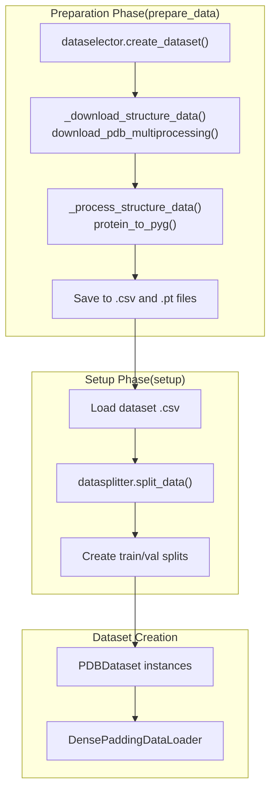

### Key Methods

| Method | Purpose |
| --- | --- |
| `prepare_data()` | Downloads and processes structures, creates dataset CSV |
| `setup()` | Loads dataset CSV and creates train/val splits |
| `_download_structure_data()` | Batch downloads PDB files |
| `_process_structure_data()` | Converts structures to PyG format and saves as .pt |
| `_load_and_process_pdb()` | Single structure processing worker function |

### Processing Workflow in _load_and_process_pdb

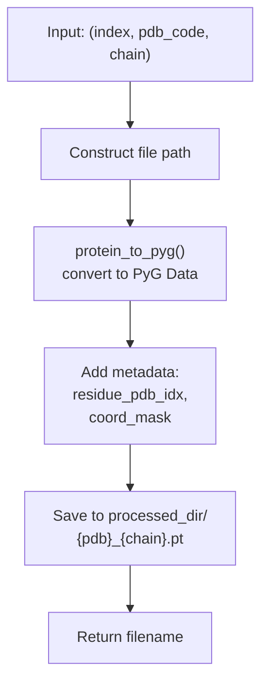

**Sources:** [src/data/dataset.py L628-L820](https://github.com/Junjie-Zhu/IDPFold2/blob/5315b279/src/data/dataset.py#L628-L820)

 [src/data/dataset.py L822-L872](https://github.com/Junjie-Zhu/IDPFold2/blob/5315b279/src/data/dataset.py#L822-L872)

---

## PDBDataset: Loading Processed Structures

`PDBDataset` loads preprocessed `.pt` files and applies transformations:

```mermaid
flowchart TD

A["pdb_codes: List[str]"]
B["data_dir path"]
C["plm_embedding path"]
D["complex_dir (.csv/.pkl)"]
E["Load .pt file from<br>processed_dir"]
F["Filter keys to keep:<br>residue_type, coord_mask,<br>coords, residue_pdb_idx,<br>chains"]
G["Load PLM embeddings<br>from plm_embedding dir"]
H["Reorder coords:<br>PDB_TO_OPENFOLD_INDEX"]
I["Handle multimer:<br>get_companion(),<br>concat_two_chains()"]
J["Apply cropping:<br>continuous_crop(),<br>spatial_crop()"]
K["Apply transforms"]

A --> E
B --> E
C --> G
D --> I

subgraph __getitem__(idx) ["getitem(idx)"]
    E
    F
    G
    H
    I
    J
    K
    E --> F
    F --> G
    G --> H
    H --> I
    I --> J
    J --> K
end

subgraph Initialization ["Initialization"]
    A
    B
    C
    D
end
```

### Cropping Methods

| Method | Purpose |
| --- | --- |
| `continuous_crop(graph)` | Randomly crops contiguous sequence segment to `crop_size` |
| `spatial_crop(graph, central_residues)` | Crops based on 3D distance from central residue |
| `multichain_continuous_crop(graph)` | Crops multimer chains while respecting chain boundaries |

### Multimer Handling

For multimer structures, the dataset can concatenate two chains:

1. Load companion chain info from `complex_chains` dict
2. Select random companion using `get_companion()`
3. Load companion structure with `process_single_chain()`
4. Concatenate using `concat_two_chains()` which: * Adjusts chain IDs if they conflict * Concatenates all tensor attributes along residue dimension

**Sources:** [src/data/dataset.py L338-L626](https://github.com/Junjie-Zhu/IDPFold2/blob/5315b279/src/data/dataset.py#L338-L626)

---

## Sequence and Residue Utilities

### get_sequence

Extracts amino acid sequence from a structure DataFrame:

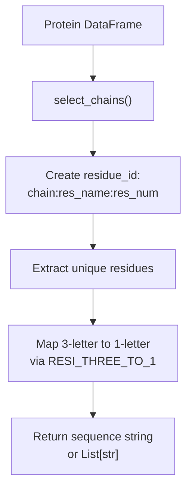

**Sources:** [src/utils/graphein_utils.py L598-L656](https://github.com/Junjie-Zhu/IDPFold2/blob/5315b279/src/utils/graphein_utils.py#L598-L656)

### residue_type_tensor

Converts sequence to integer or one-hot tensor:

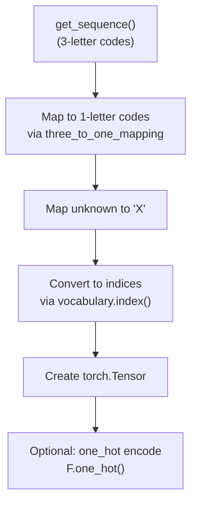

**Sources:** [src/utils/graphein_utils.py L658-L715](https://github.com/Junjie-Zhu/IDPFold2/blob/5315b279/src/utils/graphein_utils.py#L658-L715)

### protein_df_to_chain_tensor

Creates tensor of chain IDs for each residue:

**Sources:** [src/utils/graphein_utils.py L505-L558](https://github.com/Junjie-Zhu/IDPFold2/blob/5315b279/src/utils/graphein_utils.py#L505-L558)

---

## File Organization

Processed data is organized in the following structure:

```python
data_dir/
├── raw/                           # Raw PDB/CIF files
│   ├── 1abc.cif
│   ├── 2def.cif
│   └── ...
├── processed/                     # Converted PyG Data objects
│   ├── 1abc_A.pt
│   ├── 1abc_B.pt
│   ├── 2def_A.pt
│   └── ...
├── df_pdb_*.csv                   # Dataset metadata CSV
├── pdb_seqres.txt                 # PDB sequences (from RCSB)
├── resolu.idx                     # Resolution index
├── source.idx                     # Source organisms
├── entries.idx                    # Entry metadata
├── pdb_entry_type.txt             # Experiment types
├── cc-to-pdb.tdd                  # Ligand map
├── pdb_chain_cath_uniprot.tsv.gz  # CATH/UniProt mapping
└── cath-b-newest-all.gz           # CATH codes
```

**Sources:** [src/data/dataset.py L99-L101](https://github.com/Junjie-Zhu/IDPFold2/blob/5315b279/src/data/dataset.py#L99-L101)

 [src/data/dataset.py L650-L654](https://github.com/Junjie-Zhu/IDPFold2/blob/5315b279/src/data/dataset.py#L650-L654)