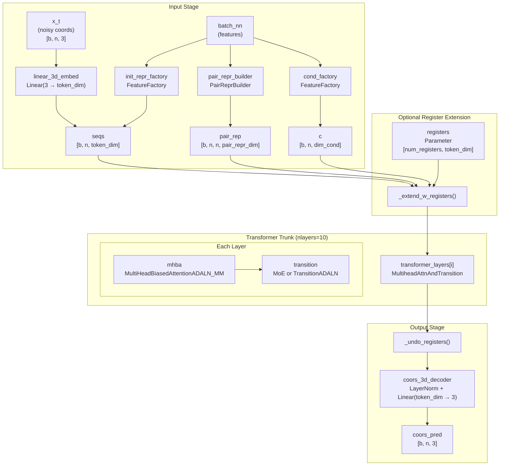
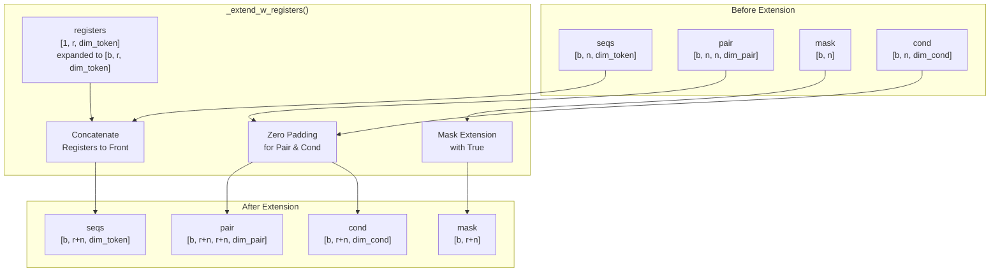
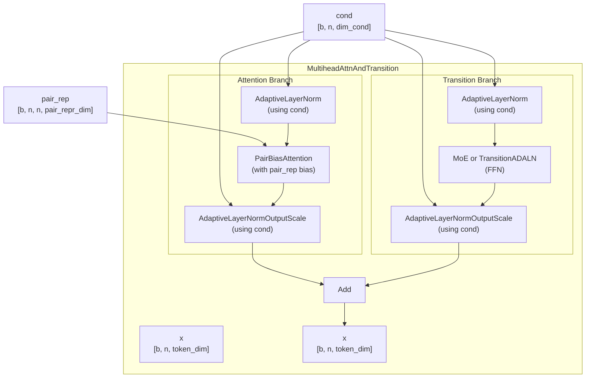
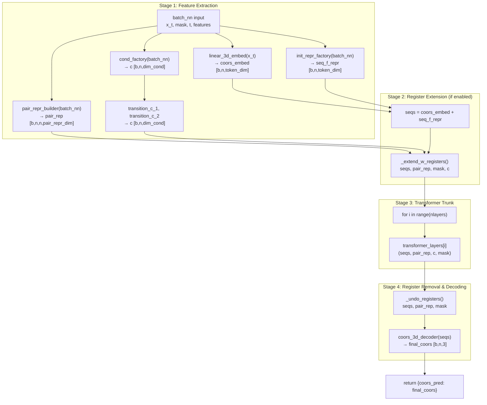
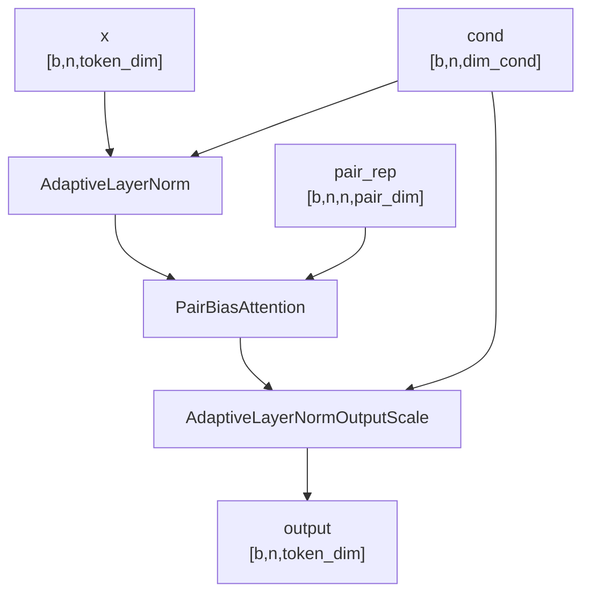

# ProteinTransformerAF3

> **Relevant source files**
> * [src/model/components/moe_modules.py](https://github.com/Junjie-Zhu/IDPFold2/blob/5315b279/src/model/components/moe_modules.py)
> * [src/model/protein_transformer.py](https://github.com/Junjie-Zhu/IDPFold2/blob/5315b279/src/model/protein_transformer.py)

## Purpose and Scope

This document describes the `ProteinTransformerAF3` class, the main neural network architecture in IDPFold2. This model processes protein sequences and noisy 3D coordinates through a series of transformer layers to predict clean coordinates for protein conformational ensemble generation.

**Related Pages:**

* For Mixture of Experts implementation details, see [Mixture of Experts](/Junjie-Zhu/IDPFold2/5.2-mixture-of-experts)
* For flow matching training and sampling, see [Flow Matching Framework](/Junjie-Zhu/IDPFold2/5.3-flow-matching-framework)
* For feature generation from raw inputs, see [Feature Factories](/Junjie-Zhu/IDPFold2/5.4-feature-factories)
* For adaptive normalization and conditioning, see [Adaptive Layer Normalization](/Junjie-Zhu/IDPFold2/5.5-adaptive-layer-normalization)

**Sources:** [src/model/protein_transformer.py L316-L538](https://github.com/Junjie-Zhu/IDPFold2/blob/5315b279/src/model/protein_transformer.py#L316-L538)

---

## Architecture Overview

`ProteinTransformerAF3` implements a transformer-based architecture inspired by AlphaFold3's diffusion model. The network consists of three main stages:

1. **Input Preparation**: Constructs sequence representations from coordinates, features, and PLM embeddings; builds pair representations; generates conditioning variables
2. **Transformer Trunk**: Processes representations through multiple layers with attention, MoE, and adaptive normalization
3. **Coordinate Decoder**: Predicts final 3D coordinates from the processed sequence representation

### High-Level Architecture Diagram



**Sources:** [src/model/protein_transformer.py L316-L538](https://github.com/Junjie-Zhu/IDPFold2/blob/5315b279/src/model/protein_transformer.py#L316-L538)

---

## Key Components

### 1. Input Preparation

The model begins by constructing three key representations from the input batch:

| Component | Class/Method | Output Shape | Purpose |
| --- | --- | --- | --- |
| Coordinate Embedding | `linear_3d_embed` | `[b, n, token_dim]` | Embeds noisy 3D coordinates |
| Initial Sequence Repr | `init_repr_factory` | `[b, n, token_dim]` | Builds sequence features from PLM, residue types, etc. |
| Conditioning Variables | `cond_factory` | `[b, n, dim_cond]` | Creates time and feature-based conditioning |
| Pair Representation | `pair_repr_builder` | `[b, n, n, pair_repr_dim]` | Constructs pairwise features |

#### Coordinate Embedding

The model embeds corrupted coordinates into the token space using a linear projection:

```
self.linear_3d_embed = torch.nn.Linear(3, kwargs["token_dim"], bias=False)
```

During forward pass, coordinates are embedded and added to the sequence representation:

```markdown
coors_embed = self.linear_3d_embed(coors_3d) * mask[..., None]  # [b, n, token_dim]seq_f_repr = self.init_repr_factory(batch_nn)  # [b, n, token_dim]seqs = coors_embed + seq_f_repr  # [b, n, token_dim]
```

**Sources:** [src/model/protein_transformer.py L356](https://github.com/Junjie-Zhu/IDPFold2/blob/5315b279/src/model/protein_transformer.py#L356-L356)

 [src/model/protein_transformer.py L511-L517](https://github.com/Junjie-Zhu/IDPFold2/blob/5315b279/src/model/protein_transformer.py#L511-L517)

#### Feature Factories

Three `FeatureFactory` instances handle different feature types:

1. **Initial Representation Factory** (`init_repr_factory`): Processes PLM embeddings, residue types, and other sequence features
2. **Conditioning Factory** (`cond_factory`): Generates conditioning variables for adaptive normalization
3. **Pair Representation Builder** (`pair_repr_builder`): Constructs pairwise features with optional adaptive normalization

The conditioning variables are further processed through two transition layers:

```markdown
c = self.cond_factory(batch_nn)  # [b, n, dim_cond]c = self.transition_c_2(self.transition_c_1(c, mask), mask)  # [b, n, dim_cond]
```

**Sources:** [src/model/protein_transformer.py L359-L386](https://github.com/Junjie-Zhu/IDPFold2/blob/5315b279/src/model/protein_transformer.py#L359-L386)

 [src/model/protein_transformer.py L507-L520](https://github.com/Junjie-Zhu/IDPFold2/blob/5315b279/src/model/protein_transformer.py#L507-L520)

---

### 2. Register Tokens

The model supports optional register tokens - learnable parameters prepended to the sequence that can capture global information without being tied to specific residues.

| Parameter | Type | Description |
| --- | --- | --- |
| `num_registers` | `int` | Number of register tokens (0 to disable) |
| `registers` | `Parameter[num_registers, token_dim]` | Learnable register embeddings |

#### Register Implementation



Registers are added before the transformer trunk and removed before coordinate decoding:

* **Extension** ([src/model/protein_transformer.py L421-L469](https://github.com/Junjie-Zhu/IDPFold2/blob/5315b279/src/model/protein_transformer.py#L421-L469) ): Prepends register tokens to all representations
* **Processing**: Registers participate in all attention and transition layers
* **Removal** ([src/model/protein_transformer.py L471-L486](https://github.com/Junjie-Zhu/IDPFold2/blob/5315b279/src/model/protein_transformer.py#L471-L486) ): Strips registers before outputting coordinates

**Sources:** [src/model/protein_transformer.py L344-L353](https://github.com/Junjie-Zhu/IDPFold2/blob/5315b279/src/model/protein_transformer.py#L344-L353)

 [src/model/protein_transformer.py L421-L486](https://github.com/Junjie-Zhu/IDPFold2/blob/5315b279/src/model/protein_transformer.py#L421-L486)

---

### 3. Transformer Trunk

The main processing occurs through `nlayers` (typically 10) identical `MultiheadAttnAndTransition` layers. Each layer combines multi-head attention with a transition (feed-forward) component, both conditioned adaptively.

#### Layer Structure



**Sources:** [src/model/protein_transformer.py L164-L272](https://github.com/Junjie-Zhu/IDPFold2/blob/5315b279/src/model/protein_transformer.py#L164-L272)

#### Attention Mechanism

The attention component uses `MultiHeadBiasedAttentionADALN_MM`, which implements:

1. **Adaptive Layer Normalization** on inputs (conditioned on time and features)
2. **Pair-Biased Multi-Head Attention** using `PairBiasAttention`
3. **Adaptive Output Scaling** (conditioned on time and features)

Key parameters:

* `nheads`: Number of attention heads (typically 12)
* `dim_head`: Head dimension = `token_dim // nheads`
* `use_qkln`: Whether to apply layer normalization to queries and keys
* `pair_dim`: Dimension of pair representation for bias

The pair representation biases the attention mechanism, allowing the model to incorporate pairwise geometric or structural information.

**Sources:** [src/model/protein_transformer.py L97-L133](https://github.com/Junjie-Zhu/IDPFold2/blob/5315b279/src/model/protein_transformer.py#L97-L133)

 [src/model/protein_transformer.py L213-L219](https://github.com/Junjie-Zhu/IDPFold2/blob/5315b279/src/model/protein_transformer.py#L213-L219)

#### Transition Component

The transition (feed-forward) component can be either a standard `TransitionADALN` or a **Mixture of Experts (MoE)** version:

**Standard Transition:**

```markdown
TransitionADALN(    dim=dim_token,    dim_cond=dim_cond,    expansion_factor=expansion_factor  # typically 2)
```

**MoE Transition:**

```markdown
MoE(    n_experts=n_experts,              # typically 5    n_activated_experts=n_activated_experts,  # typically 2    expert=single_expert,             # TransitionADALN instance    dim=dim_token,    dim_router_cond=dim_moe_cond,    capacity_factor=capacity_factor,   # typically 1.25    normalize_expert_weights=normalize_expert_weights,    load_balance=load_balance)
```

The MoE version routes tokens to specialized experts, enabling conditional computation and improved capacity. See [Mixture of Experts](/Junjie-Zhu/IDPFold2/5.2-mixture-of-experts) for details.

**Sources:** [src/model/protein_transformer.py L221-L238](https://github.com/Junjie-Zhu/IDPFold2/blob/5315b279/src/model/protein_transformer.py#L221-L238)

 [src/model/protein_transformer.py L136-L161](https://github.com/Junjie-Zhu/IDPFold2/blob/5315b279/src/model/protein_transformer.py#L136-L161)

#### Parallel vs Sequential Execution

The layer supports two execution modes controlled by `parallel_mha_transition`:

| Mode | Description | Residual Connections |
| --- | --- | --- |
| **Sequential** | Attention → Transition | Both can have residuals |
| **Parallel** | Attention ‖ Transition → Add | Only one can have residual |

```
if self.parallel:    x = self._apply_mha(x, pair_rep, cond, mask) + self._apply_transition(x, cond, mask, force_moe_capacity)else:    x = self._apply_mha(x, pair_rep, cond, mask)    x = self._apply_transition(x, cond, mask, force_moe_capacity)
```

**Sources:** [src/model/protein_transformer.py L253-L272](https://github.com/Junjie-Zhu/IDPFold2/blob/5315b279/src/model/protein_transformer.py#L253-L272)

---

### 4. Coordinate Decoder

After processing through the transformer trunk, the final sequence representation is decoded to 3D coordinates:

```
self.coors_3d_decoder = torch.nn.Sequential(    torch.nn.LayerNorm(kwargs["token_dim"]),    torch.nn.Linear(kwargs["token_dim"], 3, bias=False),)
```

The decoder applies layer normalization followed by a linear projection to produce the predicted clean coordinates:

```markdown
final_coors = self.coors_3d_decoder(seqs) * mask[..., None]  # [b, n, 3]
```

**Sources:** [src/model/protein_transformer.py L416-L419](https://github.com/Junjie-Zhu/IDPFold2/blob/5315b279/src/model/protein_transformer.py#L416-L419)

 [src/model/protein_transformer.py L535-L536](https://github.com/Junjie-Zhu/IDPFold2/blob/5315b279/src/model/protein_transformer.py#L535-L536)

---

## Forward Pass Flow

The complete forward pass processes the input batch through the following stages:



**Sources:** [src/model/protein_transformer.py L488-L537](https://github.com/Junjie-Zhu/IDPFold2/blob/5315b279/src/model/protein_transformer.py#L488-L537)

### Input Dictionary Structure

The `batch_nn` input dictionary contains:

| Key | Shape | Required | Description |
| --- | --- | --- | --- |
| `x_t` | `[b, n, 3]` | Yes | Noisy/corrupted coordinates at time t |
| `mask` | `[b, n]` | Yes | Binary mask indicating valid residues |
| `t` | `[b]` | Yes | Timestep for flow matching |
| `x_sc` | `[b, n, 3]` | Optional | Self-conditioning coordinates |
| `cath_code` | `[b, ?]` | Optional | CATH classification codes |
| `plm_emb` | `[b, n, dim_plm]` | Optional | Pre-computed PLM embeddings |
| ... | ... | ... | Additional features used by FeatureFactory |

**Sources:** [src/model/protein_transformer.py L492-L500](https://github.com/Junjie-Zhu/IDPFold2/blob/5315b279/src/model/protein_transformer.py#L492-L500)

### Output Structure

The forward pass returns a dictionary:

```css
{    "coors_pred": torch.Tensor  # Shape [b, n, 3], predicted clean coordinates}
```

**Sources:** [src/model/protein_transformer.py L536-L537](https://github.com/Junjie-Zhu/IDPFold2/blob/5315b279/src/model/protein_transformer.py#L536-L537)

---

## Configuration Parameters

The `ProteinTransformerAF3` constructor accepts a dictionary of configuration parameters:

### Core Architecture Parameters

| Parameter | Type | Default | Description |
| --- | --- | --- | --- |
| `nlayers` | `int` | 10 | Number of transformer layers |
| `token_dim` | `int` | 512 | Dimension of sequence token embeddings |
| `pair_repr_dim` | `int` | 128 | Dimension of pair representation |
| `nheads` | `int` | 12 | Number of attention heads |
| `dim_cond` | `int` | 256 | Dimension of conditioning variables |

### Feature Configuration

| Parameter | Type | Description |
| --- | --- | --- |
| `feats_init_seq` | `List[str]` | Features for initial sequence representation |
| `feats_cond_seq` | `List[str]` | Features for conditioning variables |
| `feats_pair_repr` | `List[str]` | Features for pair representation |
| `feats_pair_cond` | `List[str]` | Features for pair conditioning (optional) |

### Layer Configuration

| Parameter | Type | Default | Description |
| --- | --- | --- | --- |
| `residual_mha` | `bool` | True | Use residual connection in attention |
| `residual_transition` | `bool` | True | Use residual connection in transition |
| `parallel_mha_transition` | `bool` | False | Run attention and transition in parallel |
| `use_attn_pair_bias` | `bool` | True | Use pair representation to bias attention |
| `use_qkln` | `bool` | False | Apply layer norm to queries and keys |

### MoE Configuration

| Parameter | Type | Default | Description |
| --- | --- | --- | --- |
| `use_moe` | `bool` | False | Enable Mixture of Experts |
| `n_experts` | `int` | 5 | Number of expert networks |
| `n_activated_experts` | `int` | 2 | Number of experts activated per token |
| `dim_moe_cond` | `int` | 0 | Dimension for router conditioning |
| `capacity_factor` | `float` | 1.25 | Expert capacity multiplier |
| `normalize_expert_weights` | `bool` | True | Normalize expert output weights |

### Register Configuration

| Parameter | Type | Default | Description |
| --- | --- | --- | --- |
| `num_registers` | `int` | 0 | Number of register tokens (0 to disable) |

### Training Flag

| Parameter | Type | Default | Description |
| --- | --- | --- | --- |
| `training` | `bool` | True | Enable training mode (affects MoE load balancing) |

**Sources:** [src/model/protein_transformer.py L333-L414](https://github.com/Junjie-Zhu/IDPFold2/blob/5315b279/src/model/protein_transformer.py#L333-L414)

---

## Usage in Training and Inference

The `ProteinTransformerAF3` model is used in both training and inference through the integral functions:

### Training Context

During training, the model is called within `training_predict()` (see [Training Predict Function](/Junjie-Zhu/IDPFold2/6.2-training-predict-function)):

1. Coordinates are corrupted using flow matching interpolation
2. The model predicts the clean coordinates
3. Loss is computed between predictions and ground truth
4. MoE load balancing loss is added if MoE is enabled

### Inference Context

During inference, the model is called within `generating_predict()` (see [Generating Predict Function](/Junjie-Zhu/IDPFold2/7.2-generating-predict-function)):

1. The model iteratively denoises random coordinates
2. At each step, the model predicts clean coordinates
3. Flow matching integration advances the sampling process
4. Optional guidance mechanisms adjust predictions

### Forward Pass Control

The `force_moe_capacity` parameter controls MoE behavior:

```python
def forward(self, batch_nn: Dict[str, torch.Tensor], force_moe_capacity: bool = True) -> Dict[str, torch.Tensor]:
```

* `force_moe_capacity=True`: Enforces capacity limits in MoE routing (used during training)
* `force_moe_capacity=False`: Allows flexible capacity (used during inference for efficiency)

**Sources:** [src/model/protein_transformer.py L488](https://github.com/Junjie-Zhu/IDPFold2/blob/5315b279/src/model/protein_transformer.py#L488-L488)

---

## Component Classes

### MultiHeadBiasedAttentionADALN_MM

Implements pair-biased multi-head attention with adaptive normalization:



**Sources:** [src/model/protein_transformer.py L97-L133](https://github.com/Junjie-Zhu/IDPFold2/blob/5315b279/src/model/protein_transformer.py#L97-L133)

### TransitionADALN

Implements feed-forward transition with adaptive normalization:

* **Structure**: ADALN → Transition (2-layer MLP with expansion) → Output Scaling
* **Expansion Factor**: Typically 2 or 4, expanding token dimension in hidden layer
* **Activation**: Uses activation function specified in Transition module

**Sources:** [src/model/protein_transformer.py L136-L161](https://github.com/Junjie-Zhu/IDPFold2/blob/5315b279/src/model/protein_transformer.py#L136-L161)

### PairReprBuilder

Constructs the initial pair representation with optional adaptive conditioning:

1. Builds base pair representation from features using `FeatureFactory`
2. Optionally builds pair conditioning features
3. Applies adaptive layer normalization if conditioning features are present

**Sources:** [src/model/protein_transformer.py L275-L313](https://github.com/Junjie-Zhu/IDPFold2/blob/5315b279/src/model/protein_transformer.py#L275-L313)

---

## Memory and Computational Considerations

### Complexity Analysis

| Component | Complexity | Memory |
| --- | --- | --- |
| Coordinate Embedding | O(n) | O(bn × token_dim) |
| Pair Representation | O(n²) | O(bn² × pair_dim) |
| Attention (per layer) | O(n²) | O(bn² × nheads) |
| Transition (per layer) | O(n) | O(bn × token_dim × expansion) |
| MoE (per layer) | O(n × k/E) | More efficient than dense |
| Registers | O(r × layers) | O(r × token_dim × layers) |

Where:

* `b` = batch size
* `n` = sequence length
* `r` = number of registers
* `k` = activated experts
* `E` = total experts

### Memory Optimization

The model employs several memory optimization strategies:

1. **Dense Padding**: Sequences are densely padded to enable efficient batching
2. **Masking**: Mask tensors prevent computation on padded positions
3. **MoE Routing**: Only `n_activated_experts` out of `n_experts` process each token
4. **Capacity Limiting**: MoE capacity factor controls maximum tokens per expert

**Sources:** [src/model/protein_transformer.py](https://github.com/Junjie-Zhu/IDPFold2/blob/5315b279/src/model/protein_transformer.py)

---

## Relationship to Other Components

The `ProteinTransformerAF3` model integrates with:

* **[Feature Factories](/Junjie-Zhu/IDPFold2/5.4-feature-factories)**: Generates sequence, pair, and conditioning features from raw inputs
* **[Mixture of Experts](/Junjie-Zhu/IDPFold2/5.2-mixture-of-experts)**: Provides conditional computation in transition layers
* **[Adaptive Layer Normalization](/Junjie-Zhu/IDPFold2/5.5-adaptive-layer-normalization)**: Enables time-based conditioning throughout the network
* **[Flow Matching Framework](/Junjie-Zhu/IDPFold2/5.3-flow-matching-framework)**: Provides training signal and sampling mechanism
* **[Training Pipeline](/Junjie-Zhu/IDPFold2/6.1-training-pipeline)**: Orchestrates forward passes during training
* **[Inference Pipeline](/Junjie-Zhu/IDPFold2/7.1-inference-pipeline)**: Orchestrates iterative sampling during generation

**Sources:** [src/model/protein_transformer.py L17-L24](https://github.com/Junjie-Zhu/IDPFold2/blob/5315b279/src/model/protein_transformer.py#L17-L24)