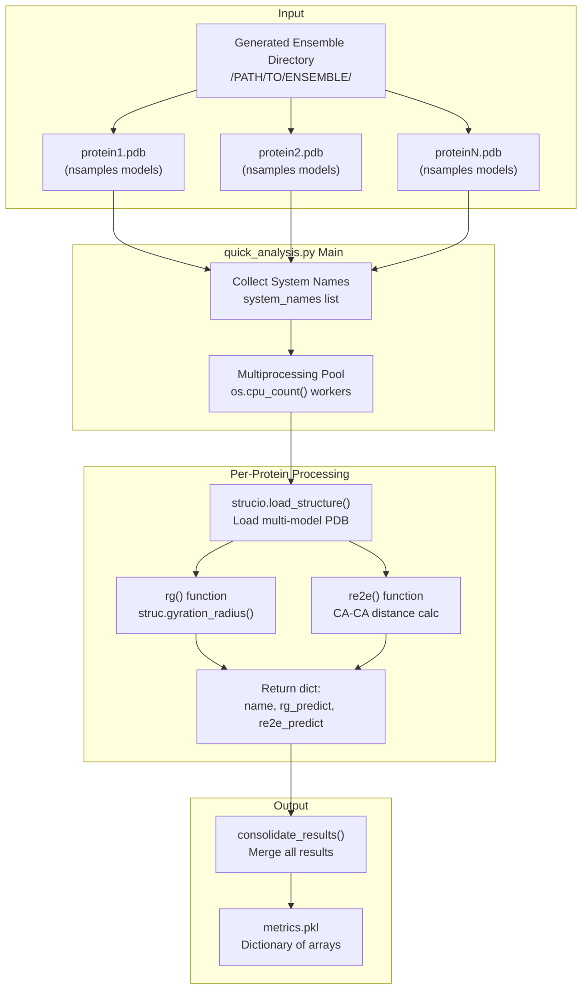
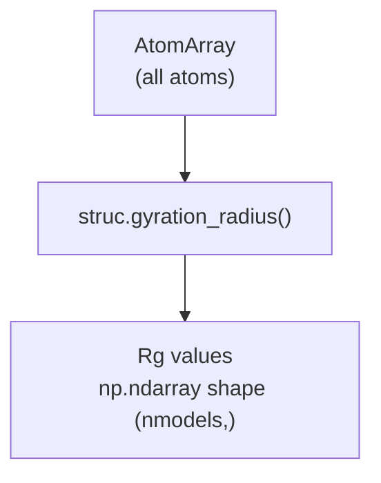
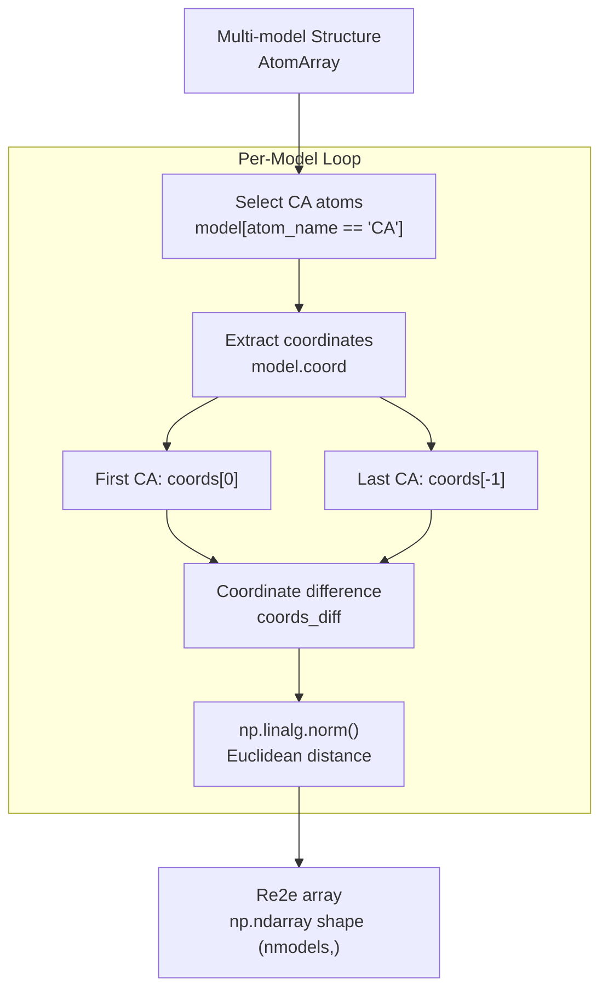
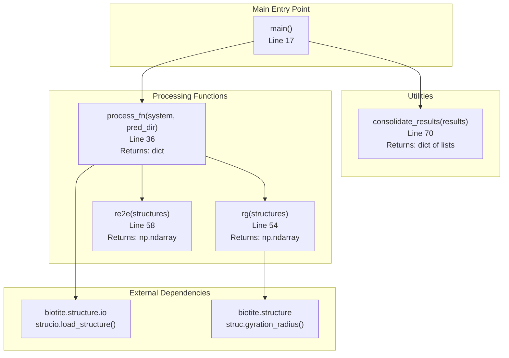
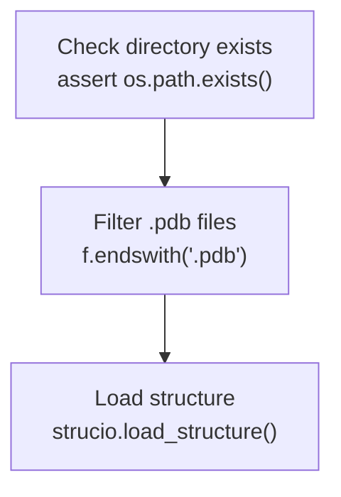

# Quick Structural Analysis

> **Relevant source files**
> * [README.md](https://github.com/Junjie-Zhu/IDPFold2/blob/5315b279/README.md?plain=1)
> * [benchmarks/analyze_cs_integrative.py](https://github.com/Junjie-Zhu/IDPFold2/blob/5315b279/benchmarks/analyze_cs_integrative.py)
> * [benchmarks/analyze_pre_integrative.py](https://github.com/Junjie-Zhu/IDPFold2/blob/5315b279/benchmarks/analyze_pre_integrative.py)
> * [benchmarks/analyze_rdc_integrative.py](https://github.com/Junjie-Zhu/IDPFold2/blob/5315b279/benchmarks/analyze_rdc_integrative.py)
> * [benchmarks/analyze_saxs_integrative.py](https://github.com/Junjie-Zhu/IDPFold2/blob/5315b279/benchmarks/analyze_saxs_integrative.py)
> * [benchmarks/compare_to_multi_conf.py](https://github.com/Junjie-Zhu/IDPFold2/blob/5315b279/benchmarks/compare_to_multi_conf.py)
> * [scripts/_cg2all.py](https://github.com/Junjie-Zhu/IDPFold2/blob/5315b279/scripts/_cg2all.py)
> * [scripts/process_training_trajs.py](https://github.com/Junjie-Zhu/IDPFold2/blob/5315b279/scripts/process_training_trajs.py)
> * [scripts/quick_analysis.py](https://github.com/Junjie-Zhu/IDPFold2/blob/5315b279/scripts/quick_analysis.py)

## Purpose and Scope

This page describes the quick structural analysis tools for evaluating generated protein conformational ensembles. The analysis calculates two fundamental geometric properties: **radius of gyration (Rg)** and **end-to-end distance (Re2e)** directly from the coarse-grained CA-trace structures produced by IDPFold2.

This analysis is performed on the raw model output before any post-processing. For converting structures to all-atom representations, see [Backmapping to All-Atom](/Junjie-Zhu/IDPFold2/8.2-backmapping-to-all-atom). For detailed structural validation against experimental benchmarks, see [Structural Validation](/Junjie-Zhu/IDPFold2/8.3-structural-validation). For reweighting ensembles against experimental data, see [Experimental Data Reweighting](/Junjie-Zhu/IDPFold2/8.4-experimental-data-reweighting).

---

## Overview

Quick structural analysis provides rapid characterization of protein conformational ensembles through two metrics:

* **Rg (Radius of Gyration)**: Measures the compactness of each conformation
* **Re2e (End-to-End Distance)**: Measures the distance between chain termini

The analysis is designed for high throughput, processing hundreds of conformations per protein using parallel computation. It operates directly on the CA-only structures generated by IDPFold2, making it significantly faster than all-atom analysis methods.

**Key characteristics:**

* Processes multi-model PDB files (one file = one ensemble)
* Parallelized across multiple proteins using multiprocessing
* Minimal dependencies (biotite library for structure handling)
* Results stored in a single pickle file for downstream analysis

Sources: [README.md L212-L216](https://github.com/Junjie-Zhu/IDPFold2/blob/5315b279/README.md?plain=1#L212-L216)

 [scripts/quick_analysis.py L1-L81](https://github.com/Junjie-Zhu/IDPFold2/blob/5315b279/scripts/quick_analysis.py#L1-L81)

---

## Quick Analysis Workflow



**Workflow Description:**

1. **Input Collection**: The script scans the target directory for all `.pdb` files
2. **Parallel Processing**: Each protein system is processed independently using `mp.Pool`
3. **Structure Loading**: Multi-model PDB files are loaded using biotite's `strucio.load_structure()`
4. **Metric Calculation**: Both Rg and Re2e are computed for all models in each ensemble
5. **Result Consolidation**: Individual results are merged into a single dictionary
6. **Output**: Final metrics are saved as a pickle file in the input directory

Sources: [scripts/quick_analysis.py L17-L33](https://github.com/Junjie-Zhu/IDPFold2/blob/5315b279/scripts/quick_analysis.py#L17-L33)

---

## Usage

### Command Line Interface

```
python scripts/quick_analysis.py /PATH/TO/GENERATED/ENSEMBLE
```

The script takes a single positional argument: the path to the directory containing generated ensemble PDB files.

**Input Requirements:**

* Directory must contain one or more `.pdb` files
* Each PDB file should be a multi-model structure (MODEL/ENDMDL format)
* Files should contain at least CA atoms for each residue

**Output:**

* Creates `metrics.pkl` in the input directory
* Pickle file contains a dictionary with keys: `name`, `rg_predict`, `re2e_predict`

**Performance:**

* Automatically uses all available CPU cores for parallel processing
* Falls back to serial processing if only one CPU core is available
* Progress bar (tqdm) displays processing status

Sources: [README.md L212-L216](https://github.com/Junjie-Zhu/IDPFold2/blob/5315b279/README.md?plain=1#L212-L216)

 [scripts/quick_analysis.py L17-L33](https://github.com/Junjie-Zhu/IDPFold2/blob/5315b279/scripts/quick_analysis.py#L17-L33)

---

## Metric Calculations

### Radius of Gyration (Rg)

**Definition**: The Rg measures the mass-weighted root-mean-square distance of atoms from the center of mass. For proteins, it characterizes overall compactness.

$$R_g = \sqrt{\frac{\sum_i m_i |\mathbf{r}*i - \mathbf{r}*{cm}|^2}{\sum_i m_i}}$$

**Implementation**: The calculation uses biotite's built-in `gyration_radius()` function:



The function automatically handles:

* Multi-model structures (returns array of Rg values)
* Mass weighting based on atom types
* Center of mass calculation

**Code Location**: [scripts/quick_analysis.py L54-L55](https://github.com/Junjie-Zhu/IDPFold2/blob/5315b279/scripts/quick_analysis.py#L54-L55)

**Output Format**: NumPy array with shape `(n_models,)` containing Rg values in Ångströms.

Sources: [scripts/quick_analysis.py L44-L55](https://github.com/Junjie-Zhu/IDPFold2/blob/5315b279/scripts/quick_analysis.py#L44-L55)

### End-to-End Distance (Re2e)

**Definition**: Re2e measures the Euclidean distance between the N-terminal and C-terminal CA atoms. This metric is particularly useful for characterizing extended vs. compact conformations in disordered proteins.

$$R_{e2e} = |\mathbf{r}*{CA,N} - \mathbf{r}*{CA,C}|$$

**Implementation Details**:



**Key Steps**:

1. For each model in the ensemble
2. Filter to CA atoms only: `model[model.atom_name == 'CA']`
3. Extract first and last CA coordinates
4. Calculate Euclidean distance using `np.linalg.norm()`

**Code Location**: [scripts/quick_analysis.py L58-L67](https://github.com/Junjie-Zhu/IDPFold2/blob/5315b279/scripts/quick_analysis.py#L58-L67)

**Output Format**: NumPy array with shape `(n_models,)` containing Re2e values in Ångströms.

Sources: [scripts/quick_analysis.py L58-L67](https://github.com/Junjie-Zhu/IDPFold2/blob/5315b279/scripts/quick_analysis.py#L58-L67)

---

## Implementation Details

### Code Architecture



Sources: [scripts/quick_analysis.py L1-L81](https://github.com/Junjie-Zhu/IDPFold2/blob/5315b279/scripts/quick_analysis.py#L1-L81)

### Multiprocessing Strategy

The script uses Python's `multiprocessing` module to parallelize across protein systems:

| Component | Implementation | Location |
| --- | --- | --- |
| **Worker Function** | `process_fn(system, pred_dir)` | [scripts/quick_analysis.py L36-L51](https://github.com/Junjie-Zhu/IDPFold2/blob/5315b279/scripts/quick_analysis.py#L36-L51) |
| **Pool Creation** | `mp.Pool(os.cpu_count())` | [scripts/quick_analysis.py L24](https://github.com/Junjie-Zhu/IDPFold2/blob/5315b279/scripts/quick_analysis.py#L24-L24) |
| **Task Distribution** | `pool.imap_unordered()` | [scripts/quick_analysis.py L25](https://github.com/Junjie-Zhu/IDPFold2/blob/5315b279/scripts/quick_analysis.py#L25-L25) |
| **Progress Tracking** | `tqdm` wrapper | [scripts/quick_analysis.py L25](https://github.com/Junjie-Zhu/IDPFold2/blob/5315b279/scripts/quick_analysis.py#L25-L25) |
| **Fallback** | Serial processing if cpu_count() == 1 | [scripts/quick_analysis.py L23-L29](https://github.com/Junjie-Zhu/IDPFold2/blob/5315b279/scripts/quick_analysis.py#L23-L29) |

**Worker Function (`process_fn`)**: Each worker independently:

1. Constructs the file path: `os.path.join(pred_dir, f'{system}.pdb')`
2. Loads the structure using biotite
3. Calculates both metrics
4. Returns a result dictionary

**Benefits of this approach:**

* No shared state between workers
* Embarrassingly parallel (no inter-process communication)
* Automatic load balancing through `imap_unordered`
* Graceful degradation to serial processing

Sources: [scripts/quick_analysis.py L22-L51](https://github.com/Junjie-Zhu/IDPFold2/blob/5315b279/scripts/quick_analysis.py#L22-L51)

### Data Structures

#### Input Structure

```markdown
/PATH/TO/ENSEMBLE/
├── protein1.pdb          # Multi-model PDB
│   ├── MODEL 1
│   ├── ...
│   └── MODEL n
├── protein2.pdb
└── proteinN.pdb
```

#### Processing Result (Per Protein)

```css
{    'name': 'protein1',                    # System name    'rg_predict': np.array([...]),        # Shape: (n_models,)    're2e_predict': np.array([...])       # Shape: (n_models,)}
```

**Location**: [scripts/quick_analysis.py L47-L51](https://github.com/Junjie-Zhu/IDPFold2/blob/5315b279/scripts/quick_analysis.py#L47-L51)

#### Consolidated Output

```css
{    'name': ['protein1', 'protein2', ...],           # List of strings    'rg_predict': [array1, array2, ...],            # List of arrays    're2e_predict': [array1, array2, ...]           # List of arrays}
```

**Consolidation Logic**: [scripts/quick_analysis.py L70-L73](https://github.com/Junjie-Zhu/IDPFold2/blob/5315b279/scripts/quick_analysis.py#L70-L73)

The consolidated dictionary maps each key to a list where `result_dict[key][i]` contains the value for protein `i`.

Sources: [scripts/quick_analysis.py L36-L73](https://github.com/Junjie-Zhu/IDPFold2/blob/5315b279/scripts/quick_analysis.py#L36-L73)

---

## Error Handling and Edge Cases

### File Validation



**Validation Steps**:

1. **Directory Check**: Asserts that the input directory exists ([scripts/quick_analysis.py L19](https://github.com/Junjie-Zhu/IDPFold2/blob/5315b279/scripts/quick_analysis.py#L19-L19) )
2. **File Extension**: Only processes files ending with `.pdb` ([scripts/quick_analysis.py L20](https://github.com/Junjie-Zhu/IDPFold2/blob/5315b279/scripts/quick_analysis.py#L20-L20) )
3. **Structure Loading**: Relies on biotite's error handling for malformed PDB files

### Warning Suppression

The script suppresses biotite's UserWarnings to reduce console clutter during batch processing:

```
warnings.filterwarnings('ignore', category=UserWarning)
```

**Location**: [scripts/quick_analysis.py L14](https://github.com/Junjie-Zhu/IDPFold2/blob/5315b279/scripts/quick_analysis.py#L14-L14)

This is safe for batch processing but may hide legitimate warnings about structure quality.

Sources: [scripts/quick_analysis.py L14-L19](https://github.com/Junjie-Zhu/IDPFold2/blob/5315b279/scripts/quick_analysis.py#L14-L19)

---

## Output Format and Downstream Usage

### Pickle File Structure

The output `metrics.pkl` is a Python dictionary that can be loaded using:

```javascript
import pickle with open('metrics.pkl', 'rb') as f:    metrics = pickle.load(f) # Access dataprotein_names = metrics['name']          # List of system namesrg_values = metrics['rg_predict']        # List of Rg arraysre2e_values = metrics['re2e_predict']    # List of Re2e arrays # Example: Get Rg distribution for first proteinrg_protein1 = rg_values[0]               # NumPy array shape (n_models,)mean_rg = np.mean(rg_protein1)std_rg = np.std(rg_protein1)
```

### Data Access Patterns

| Task | Code Pattern |
| --- | --- |
| Get all Rg for protein i | `metrics['rg_predict'][i]` |
| Get all Re2e for protein i | `metrics['re2e_predict'][i]` |
| Compute mean Rg | `np.mean(metrics['rg_predict'][i])` |
| Compute std dev | `np.std(metrics['rg_predict'][i])` |
| Find protein by name | `idx = metrics['name'].index('protein1')` |

### Statistical Analysis

Typical downstream analyses include:

1. **Ensemble Averages**: Computing mean and standard deviation across models
2. **Distribution Plotting**: Histograms of Rg/Re2e distributions
3. **Comparison**: Comparing predicted distributions to experimental values
4. **Correlation Analysis**: Examining relationships between Rg and Re2e

Sources: [scripts/quick_analysis.py L31-L33](https://github.com/Junjie-Zhu/IDPFold2/blob/5315b279/scripts/quick_analysis.py#L31-L33)

---

## Performance Characteristics

### Computational Complexity

| Operation | Complexity | Notes |
| --- | --- | --- |
| **Per-model Rg** | O(N) | N = number of atoms |
| **Per-model Re2e** | O(M) | M = number of CA atoms ≈ sequence length |
| **Per-protein** | O(K × N) | K = number of models (typically 100-1000) |
| **Total** | O(P × K × N) | P = number of proteins |

### Typical Runtime

For typical IDPFold2 ensembles:

* **Single protein (100 models, 200 residues)**: ~0.1-0.5 seconds
* **10 proteins in parallel (8 cores)**: ~1-5 seconds
* **100 proteins in parallel (40 cores)**: ~10-30 seconds

**Bottlenecks**:

* PDB file I/O (reading multi-model files)
* Multiprocessing overhead for very small proteins
* Memory allocation for large ensembles (1000+ models)

**Optimization Notes**:

* The script is I/O bound for typical use cases
* Further parallelization would require distributed file systems
* For very large datasets, consider converting to DCD/XTC trajectory format

Sources: [scripts/quick_analysis.py L22-L29](https://github.com/Junjie-Zhu/IDPFold2/blob/5315b279/scripts/quick_analysis.py#L22-L29)