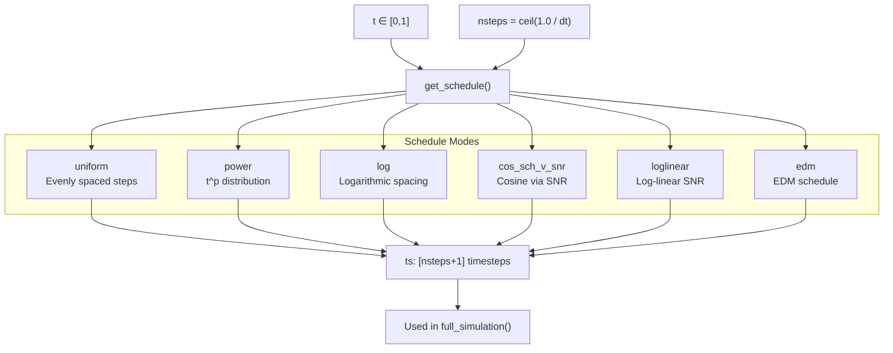
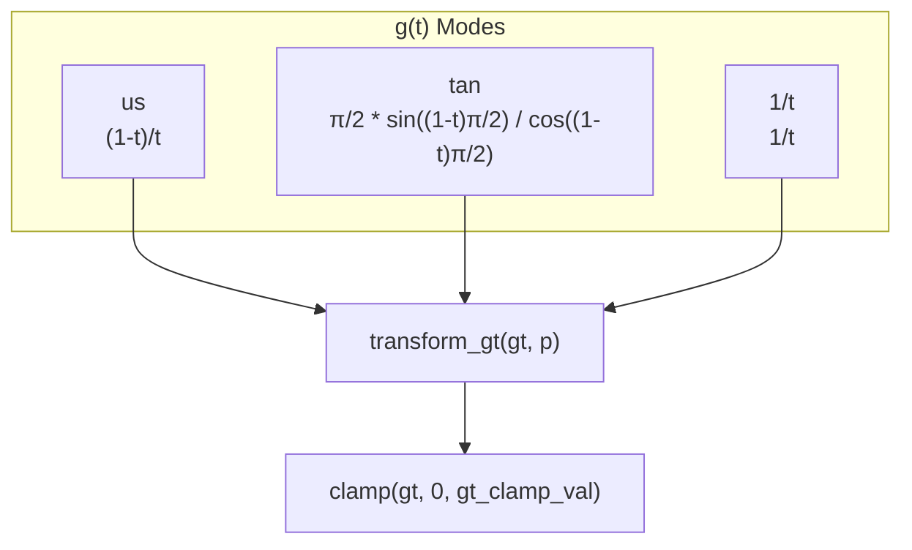
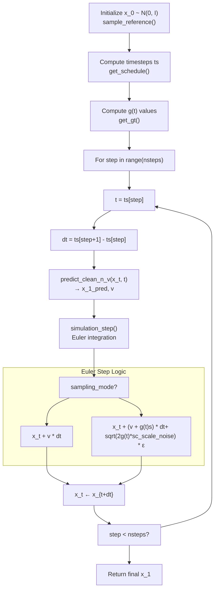

# Sampling Strategies

> **Relevant source files**
> * [configs/inference.yaml](https://github.com/Junjie-Zhu/IDPFold2/blob/5315b279/configs/inference.yaml)
> * [src/data/dataset.py](https://github.com/Junjie-Zhu/IDPFold2/blob/5315b279/src/data/dataset.py)
> * [src/inference.py](https://github.com/Junjie-Zhu/IDPFold2/blob/5315b279/src/inference.py)
> * [src/model/flow_matching/r3flow.py](https://github.com/Junjie-Zhu/IDPFold2/blob/5315b279/src/model/flow_matching/r3flow.py)
> * [src/utils/pdb_utils.py](https://github.com/Junjie-Zhu/IDPFold2/blob/5315b279/src/utils/pdb_utils.py)

## Purpose and Scope

This page documents the sampling strategies used during inference to generate protein conformational ensembles in IDPFold2. It covers the different sampling modes, time discretization schedules, noise scaling parameters, and integration schemes available for controlling the generative process.

For information about the overall inference pipeline, see [Inference Pipeline](/Junjie-Zhu/IDPFold2/7.1-inference-pipeline). For details on the generating_predict function that orchestrates sampling, see [Generating Predict Function](/Junjie-Zhu/IDPFold2/7.2-generating-predict-function). For guidance mechanisms that can be combined with these sampling strategies, see [Guidance Mechanisms](/Junjie-Zhu/IDPFold2/7.3-guidance-mechanisms).

---

## Overview

IDPFold2 uses flow matching to generate protein structures by solving an ordinary differential equation (ODE) or stochastic differential equation (SDE) from time t=0 (noise) to t=1 (data). The sampling process involves:

1. **Starting from reference distribution**: Sample from N(0, I) at t=0
2. **Iterative integration**: Step through time using a learned vector field
3. **Schedule control**: Discretize [0,1] interval based on selected schedule
4. **Mode selection**: Choose between deterministic (ODE) or stochastic (SDE) sampling

The sampling strategy determines the quality, diversity, and computational cost of generated ensembles.

**Sources:** [src/model/flow_matching/r3flow.py L400-L549](https://github.com/Junjie-Zhu/IDPFold2/blob/5315b279/src/model/flow_matching/r3flow.py#L400-L549)

 [src/inference.py L281-L295](https://github.com/Junjie-Zhu/IDPFold2/blob/5315b279/src/inference.py#L281-L295)

---

## Sampling Modes

IDPFold2 supports two fundamental sampling modes that control whether the generation process is deterministic or stochastic.

### Vector Field Mode (vf)

The vector field mode implements deterministic sampling by solving the ODE:

```
dx_t = v(x_t, t) dt
```

This is the standard flow matching approach where the model predicts the velocity field v(x_t, t) and integration proceeds via Euler method. It produces deterministic results given the same random seed.

**Configuration:**

```yaml
sampling:  sampling_mode: vf
```

**Sources:** [src/model/flow_matching/r3flow.py L306-L326](https://github.com/Junjie-Zhu/IDPFold2/blob/5315b279/src/model/flow_matching/r3flow.py#L306-L326)

 [configs/inference.yaml L33](https://github.com/Junjie-Zhu/IDPFold2/blob/5315b279/configs/inference.yaml#L33-L33)

### Score-based Mode (sc)

The score-based mode introduces stochasticity by solving the SDE:

```
dx_t = [v(x_t, t) + g(t) * s(x_t, t)] dt + sqrt(2 * g(t) * sc_scale_noise) dw_t
```

Where:

* `s(x_t, t)` is the score function derived from the vector field
* `g(t)` is a time-dependent noise schedule controlled by `gt_mode`
* `dw_t` is Brownian motion
* `sc_scale_noise` controls noise intensity

The score is computed from the vector field using the relationship:

```
s(x_t, t) = (t * v(x_t, t) - x_t) / (scale_ref^2 * (1 - t))
```

**Configuration:**

```yaml
sampling:  sampling_mode: sc  sc_scale_noise: 1.0  # Default noise scale  sc_scale_score: 1.0  # Score scaling (not currently used)
```

**Sources:** [src/model/flow_matching/r3flow.py L328-L333](https://github.com/Junjie-Zhu/IDPFold2/blob/5315b279/src/model/flow_matching/r3flow.py#L328-L333)

 [src/model/flow_matching/r3flow.py L335-L363](https://github.com/Junjie-Zhu/IDPFold2/blob/5315b279/src/model/flow_matching/r3flow.py#L335-L363)

 [configs/inference.yaml L33-L35](https://github.com/Junjie-Zhu/IDPFold2/blob/5315b279/configs/inference.yaml#L33-L35)

---

## Time Discretization Schedules

The schedule determines how time steps are distributed across the [0,1] interval during sampling. Different schedules affect generation quality and compute requirements.

### Schedule Modes



**Sources:** [src/model/flow_matching/r3flow.py L612-L666](https://github.com/Junjie-Zhu/IDPFold2/blob/5315b279/src/model/flow_matching/r3flow.py#L612-L666)

### Uniform Schedule

Distributes time steps evenly across [0,1]. Simplest schedule, suitable for baseline experiments.

```
t = torch.linspace(0, 1, nsteps + 1)
```

**Configuration:**

```yaml
schedule:  schedule_mode: uniform  schedule_p: null  # Not used
```

**Sources:** [src/model/flow_matching/r3flow.py L628-L630](https://github.com/Junjie-Zhu/IDPFold2/blob/5315b279/src/model/flow_matching/r3flow.py#L628-L630)

### Power Schedule

Applies power transformation to uniform distribution: `t = uniform^p`. Parameter `p > 1` concentrates more steps near t=0 (early denoising), while `p < 1` concentrates steps near t=1 (final refinement).

```
t = torch.linspace(0, 1, nsteps + 1) ** p1
```

**Configuration:**

```yaml
schedule:  schedule_mode: power  schedule_p: 2.0  # Recommended value
```

**Sources:** [src/model/flow_matching/r3flow.py L631-L635](https://github.com/Junjie-Zhu/IDPFold2/blob/5315b279/src/model/flow_matching/r3flow.py#L631-L635)

### Log Schedule

Uses logarithmic spacing that concentrates more steps near t=1, suitable for fine-grained refinement in final steps. Parameter `p` controls the density.

```
t = 1.0 - torch.logspace(-p1, 0, nsteps + 1).flip(0)
```

**Configuration:**

```yaml
schedule:  schedule_mode: log  schedule_p: 2.0  # Controls density (must be > 0)
```

**Sources:** [src/model/flow_matching/r3flow.py L657-L663](https://github.com/Junjie-Zhu/IDPFold2/blob/5315b279/src/model/flow_matching/r3flow.py#L657-L663)

 [configs/inference.yaml L41-L42](https://github.com/Junjie-Zhu/IDPFold2/blob/5315b279/configs/inference.yaml#L41-L42)

### Other Advanced Schedules

| Schedule | Description | Key Parameter |
| --- | --- | --- |
| `cos_sch_v_snr` | Cosine schedule defined via signal-to-noise ratio | `schedule_p`: SNR exponent |
| `loglinear` | Log-linear SNR schedule | None (fixed SNR range) |
| `edm` | EDM (Elucidating Diffusion Models) schedule | `schedule_p`: rho parameter |

**Sources:** [src/model/flow_matching/r3flow.py L636-L656](https://github.com/Junjie-Zhu/IDPFold2/blob/5315b279/src/model/flow_matching/r3flow.py#L636-L656)

---

## Noise Scaling and g(t) Function

When using score-based sampling (`sc` mode), the noise level is controlled by the function g(t) and scaling parameters.

### g(t) Computation Modes

The `gt_mode` parameter determines how g(t) varies with time:



**Sources:** [src/model/flow_matching/r3flow.py L551-L610](https://github.com/Junjie-Zhu/IDPFold2/blob/5315b279/src/model/flow_matching/r3flow.py#L551-L610)

### g(t) Mode Descriptions

| Mode | Formula | Behavior |
| --- | --- | --- |
| `us` | `(1-t) / t` | Uniform schedule, increases as t→1 |
| `tan` | `(π/2) * sin((1-t)π/2) / cos((1-t)π/2)` | Tangent-based, smoother growth |
| `1/t` | `1 / t` | Inverse time, very high noise near t=0 |

All modes are transformed by `gt_p` parameter: `gt = transform_gt(gt, f_pow=gt_p)`, where the transformation involves sigmoid-based normalization and power transformation.

**Configuration:**

```yaml
sampling:  gt_mode: "1/t"      # Recommended mode  gt_p: 1.0           # Transformation parameter  gt_clamp_val: null  # Optional clamping (e.g., 10.0)
```

**Sources:** [src/model/flow_matching/r3flow.py L573-L609](https://github.com/Junjie-Zhu/IDPFold2/blob/5315b279/src/model/flow_matching/r3flow.py#L573-L609)

 [configs/inference.yaml L36-L38](https://github.com/Junjie-Zhu/IDPFold2/blob/5315b279/configs/inference.yaml#L36-L38)

### Noise Scaling Parameters

| Parameter | Description | Default | Impact |
| --- | --- | --- | --- |
| `sc_scale_noise` | Multiplies noise standard deviation | 0.0 | Higher = more stochastic |
| `sc_scale_score` | Multiplies score term | 1.0 | Currently not implemented |

**Configuration:**

```yaml
sampling:  sc_scale_noise: 0.0   # 0.0 = deterministic, >0 = stochastic  sc_scale_score: 1.0   # Reserved for future use
```

**Sources:** [src/model/flow_matching/r3flow.py L328-L333](https://github.com/Junjie-Zhu/IDPFold2/blob/5315b279/src/model/flow_matching/r3flow.py#L328-L333)

 [configs/inference.yaml L34-L35](https://github.com/Junjie-Zhu/IDPFold2/blob/5315b279/configs/inference.yaml#L34-L35)

---

## Integration and Simulation

The sampling process integrates the ODE or SDE from t=0 to t=1 using Euler integration.

### Integration Flow



**Sources:** [src/model/flow_matching/r3flow.py L400-L549](https://github.com/Junjie-Zhu/IDPFold2/blob/5315b279/src/model/flow_matching/r3flow.py#L400-L549)

 [src/model/flow_matching/r3flow.py L196-L249](https://github.com/Junjie-Zhu/IDPFold2/blob/5315b279/src/model/flow_matching/r3flow.py#L196-L249)

### Euler Integration Step

The `step_euler` function implements a single integration step:

**Vector Field Mode (vf):**

```
x_{t+dt} = x_t + v(x_t, t) * dt
```

**Score-based Mode (sc):**

```
score = (t * v - x_t) / (scale_ref^2 * (1 - t))
noise = sqrt(2 * g(t) * sc_scale_noise * dt) * ε
x_{t+dt} = x_t + (v + g(t) * score) * dt + noise
```

Where ε ~ N(0, I).

**Key Implementation Details:**

* Last few steps (t > 0.99) always use `vf` mode for stability
* All samples in batch must be at same time t
* Centering and masking applied at each step if `zero_com=True`

**Sources:** [src/model/flow_matching/r3flow.py L251-L333](https://github.com/Junjie-Zhu/IDPFold2/blob/5315b279/src/model/flow_matching/r3flow.py#L251-L333)

---

## Configuration Reference

### Complete Sampling Configuration

```markdown
# Time discretizationdt: 0.005                    # Step size (nsteps = ceil(1/dt) = 200) # Sampling modesampling:  sampling_mode: vf          # Options: vf, sc  sc_scale_noise: 0.0        # Noise scale for sc mode  sc_scale_score: 1.0        # Score scale (not implemented)  gt_mode: "1/t"             # g(t) mode: us, tan, 1/t  gt_p: 1.0                  # g(t) transformation parameter  gt_clamp_val: null         # Optional g(t) clamping value # Time scheduleschedule:  schedule_mode: log         # Options: uniform, power, log, cos_sch_v_snr, loglinear, edm  schedule_p: 2.0            # Schedule parameter (mode-dependent)
```

**Sources:** [configs/inference.yaml L11-L42](https://github.com/Junjie-Zhu/IDPFold2/blob/5315b279/configs/inference.yaml#L11-L42)

### Relationship to Code Entities


**Sources:** [configs/inference.yaml L11-L42](https://github.com/Junjie-Zhu/IDPFold2/blob/5315b279/configs/inference.yaml#L11-L42)

 [src/inference.py L281-L295](https://github.com/Junjie-Zhu/IDPFold2/blob/5315b279/src/inference.py#L281-L295)

 [src/model/flow_matching/r3flow.py L22-L666](https://github.com/Junjie-Zhu/IDPFold2/blob/5315b279/src/model/flow_matching/r3flow.py#L22-L666)

---

## Practical Usage Guidelines

### Recommended Configurations

| Use Case | Configuration | Rationale |
| --- | --- | --- |
| **Fast sampling** | `dt=0.01`, `schedule_mode=log`, `sampling_mode=vf` | Fewer steps (100), deterministic |
| **High quality** | `dt=0.005`, `schedule_mode=log`, `sampling_mode=vf` | Standard 200 steps |
| **Diverse ensembles** | `dt=0.005`, `schedule_mode=log`, `sampling_mode=sc`, `sc_scale_noise=1.0` | Stochastic sampling |
| **Fine-grained** | `dt=0.002`, `schedule_mode=power`, `schedule_p=2.0` | 500 steps with early concentration |

### Common Parameter Combinations

**Standard Configuration (Default):**

```yaml
dt: 0.005sampling:  sampling_mode: vf  gt_mode: "1/t"  gt_p: 1.0schedule:  schedule_mode: log  schedule_p: 2.0
```

**Stochastic Sampling:**

```yaml
dt: 0.005sampling:  sampling_mode: sc  sc_scale_noise: 1.0  gt_mode: "1/t"  gt_p: 1.0schedule:  schedule_mode: log  schedule_p: 2.0
```

**Sources:** [configs/inference.yaml L11-L42](https://github.com/Junjie-Zhu/IDPFold2/blob/5315b279/configs/inference.yaml#L11-L42)

 [src/model/flow_matching/r3flow.py L400-L549](https://github.com/Junjie-Zhu/IDPFold2/blob/5315b279/src/model/flow_matching/r3flow.py#L400-L549)

---

## Implementation Details

### Key Functions and Classes

| Entity | Location | Purpose |
| --- | --- | --- |
| `R3NFlowMatcher` | [src/model/flow_matching/r3flow.py L22-L666](https://github.com/Junjie-Zhu/IDPFold2/blob/5315b279/src/model/flow_matching/r3flow.py#L22-L666) | Main class for flow matching on R^3 |
| `full_simulation()` | [src/model/flow_matching/r3flow.py L400-L549](https://github.com/Junjie-Zhu/IDPFold2/blob/5315b279/src/model/flow_matching/r3flow.py#L400-L549) | Orchestrates complete sampling from t=0 to t=1 |
| `simulation_step()` | [src/model/flow_matching/r3flow.py L196-L249](https://github.com/Junjie-Zhu/IDPFold2/blob/5315b279/src/model/flow_matching/r3flow.py#L196-L249) | Single integration step |
| `step_euler()` | [src/model/flow_matching/r3flow.py L251-L333](https://github.com/Junjie-Zhu/IDPFold2/blob/5315b279/src/model/flow_matching/r3flow.py#L251-L333) | Euler integration for ODE/SDE |
| `get_schedule()` | [src/model/flow_matching/r3flow.py L612-L666](https://github.com/Junjie-Zhu/IDPFold2/blob/5315b279/src/model/flow_matching/r3flow.py#L612-L666) | Computes time discretization |
| `get_gt()` | [src/model/flow_matching/r3flow.py L551-L610](https://github.com/Junjie-Zhu/IDPFold2/blob/5315b279/src/model/flow_matching/r3flow.py#L551-L610) | Computes noise schedule g(t) |
| `vf_to_score()` | [src/model/flow_matching/r3flow.py L335-L363](https://github.com/Junjie-Zhu/IDPFold2/blob/5315b279/src/model/flow_matching/r3flow.py#L335-L363) | Converts vector field to score |

### Integration with Inference Pipeline

The sampling strategies are invoked through the inference pipeline:

1. `main()` in [src/inference.py L168-L368](https://github.com/Junjie-Zhu/IDPFold2/blob/5315b279/src/inference.py#L168-L368)  loads configuration
2. `generating_predict()` is called with `schedule_args` and `sampling_args`
3. `full_simulation()` receives these parameters and executes sampling
4. Results are returned as predicted structures

**Sources:** [src/inference.py L281-L295](https://github.com/Junjie-Zhu/IDPFold2/blob/5315b279/src/inference.py#L281-L295)

 [src/model/flow_matching/r3flow.py L400-L549](https://github.com/Junjie-Zhu/IDPFold2/blob/5315b279/src/model/flow_matching/r3flow.py#L400-L549)

---

## Advanced Topics

### Self-Conditioning

When `self_conditioning=True`, the previous prediction x_1_pred is fed back as input to the model at each step (except the first). This improves consistency but increases compute cost.

**Code Location:** [src/model/flow_matching/r3flow.py L526-L527](https://github.com/Junjie-Zhu/IDPFold2/blob/5315b279/src/model/flow_matching/r3flow.py#L526-L527)

### Centering and Masking

If `zero_com=True` (set during flow matcher initialization), structures are centered at center-of-mass at each step. Masking ensures padded positions don't contribute to predictions.

**Code Location:** [src/model/flow_matching/r3flow.py L75-L91](https://github.com/Junjie-Zhu/IDPFold2/blob/5315b279/src/model/flow_matching/r3flow.py#L75-L91)

### Motif Conditioning

When motif conditioning is enabled, fixed structure regions are maintained throughout sampling using `fixed_structure_mask` and `x_motif`.

**Code Location:** [src/model/flow_matching/r3flow.py L492-L515](https://github.com/Junjie-Zhu/IDPFold2/blob/5315b279/src/model/flow_matching/r3flow.py#L492-L515)

**Sources:** [src/model/flow_matching/r3flow.py L39-L91](https://github.com/Junjie-Zhu/IDPFold2/blob/5315b279/src/model/flow_matching/r3flow.py#L39-L91)

 [src/model/flow_matching/r3flow.py L492-L549](https://github.com/Junjie-Zhu/IDPFold2/blob/5315b279/src/model/flow_matching/r3flow.py#L492-L549)