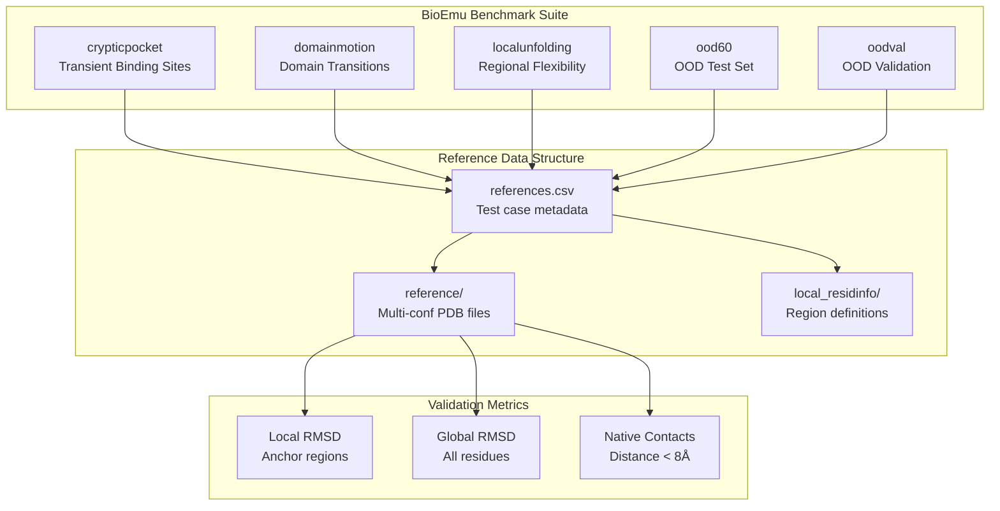
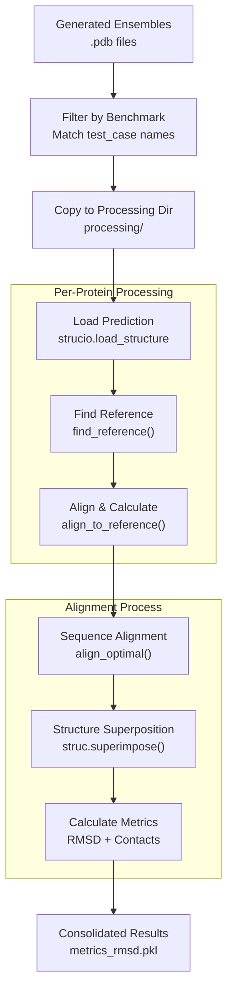
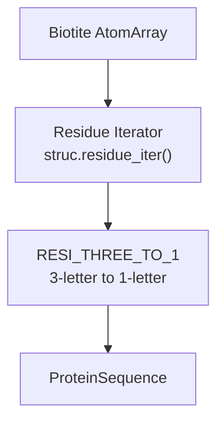
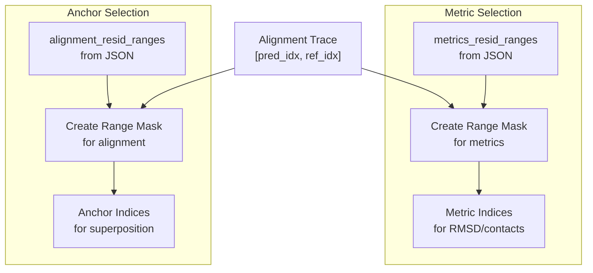
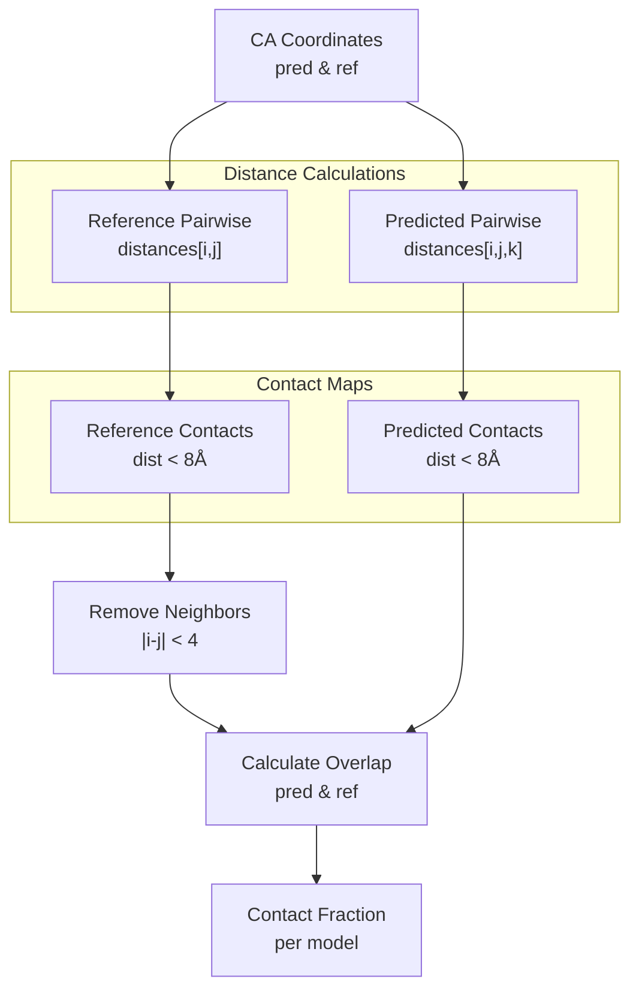

# Structural Validation

> **Relevant source files**
> * [README.md](https://github.com/Junjie-Zhu/IDPFold2/blob/5315b279/README.md?plain=1)
> * [benchmarks/analyze_cs_integrative.py](https://github.com/Junjie-Zhu/IDPFold2/blob/5315b279/benchmarks/analyze_cs_integrative.py)
> * [benchmarks/analyze_pre_integrative.py](https://github.com/Junjie-Zhu/IDPFold2/blob/5315b279/benchmarks/analyze_pre_integrative.py)
> * [benchmarks/analyze_rdc_integrative.py](https://github.com/Junjie-Zhu/IDPFold2/blob/5315b279/benchmarks/analyze_rdc_integrative.py)
> * [benchmarks/analyze_saxs_integrative.py](https://github.com/Junjie-Zhu/IDPFold2/blob/5315b279/benchmarks/analyze_saxs_integrative.py)
> * [benchmarks/compare_to_multi_conf.py](https://github.com/Junjie-Zhu/IDPFold2/blob/5315b279/benchmarks/compare_to_multi_conf.py)
> * [scripts/_cg2all.py](https://github.com/Junjie-Zhu/IDPFold2/blob/5315b279/scripts/_cg2all.py)
> * [scripts/process_training_trajs.py](https://github.com/Junjie-Zhu/IDPFold2/blob/5315b279/scripts/process_training_trajs.py)
> * [scripts/quick_analysis.py](https://github.com/Junjie-Zhu/IDPFold2/blob/5315b279/scripts/quick_analysis.py)

## Purpose and Scope

This page describes the structural validation methods used to evaluate generated protein conformational ensembles against experimental reference structures. Structural validation focuses on quantitative geometric comparisons including Root Mean Square Deviation (RMSD) and native contact analysis using the BioEmu benchmark suite.

For quick structural property calculations (Rg, Re2e), see [Quick Structural Analysis](/Junjie-Zhu/IDPFold2/8.1-quick-structural-analysis). For converting coarse-grained structures to all-atom, see [Backmapping to All-Atom](/Junjie-Zhu/IDPFold2/8.2-backmapping-to-all-atom). For validation against experimental data (SAXS, CS, PRE, RDC), see [Experimental Data Reweighting](/Junjie-Zhu/IDPFold2/8.4-experimental-data-reweighting).

## Overview

Structural validation in IDPFold2 compares generated ensembles against multi-conformational reference structures from the [BioEmu-Benchmarks](https://github.com/Junjie-Zhu/IDPFold2/blob/5315b279/BioEmu-Benchmarks)

 dataset. The validation pipeline calculates:

* **Local RMSD**: Structural deviation in stable/anchor regions
* **Global RMSD**: Overall structural deviation across all residues
* **Native Contact Fractions**: Percentage of native contacts preserved in generated structures

The main validation script is implemented in [benchmarks/compare_to_multi_conf.py](https://github.com/Junjie-Zhu/IDPFold2/blob/5315b279/benchmarks/compare_to_multi_conf.py)

 It uses the `biotite` structure analysis library for sequence alignment, structure superposition, and RMSD calculations.

**Sources:** [README.md L231-L237](https://github.com/Junjie-Zhu/IDPFold2/blob/5315b279/README.md?plain=1#L231-L237)

 [benchmarks/compare_to_multi_conf.py L1-L352](https://github.com/Junjie-Zhu/IDPFold2/blob/5315b279/benchmarks/compare_to_multi_conf.py#L1-L352)

## BioEmu Benchmark Datasets

The validation pipeline supports five distinct benchmark categories from BioEmu, each testing different aspects of protein conformational dynamics:

| Benchmark | Description | Reference CSV | Purpose |
| --- | --- | --- | --- |
| `crypticpocket` | Cryptic pocket formation | `crypticpocket/references.csv` | Tests ability to capture transient binding sites |
| `domainmotion` | Large-scale domain movements | `domainmotion/references.csv` | Tests conformational transitions between domains |
| `localunfolding` | Local unfolding events | `localunfolding/references.csv` | Tests flexibility in specific regions |
| `ood60` | Out-of-distribution test set | `ood60/references.csv` | Tests generalization to unseen proteins |
| `oodval` | OOD validation set | `oodval/references.csv` | Additional OOD validation cases |

Each benchmark contains:

* **Reference structures**: Multiple experimental conformations for each protein
* **Alignment regions**: Residue ranges for structural alignment
* **Metric regions**: Residue ranges for RMSD/contact calculation
* **Local residue info**: JSON files defining specific regions of interest

**Sources:** [benchmarks/compare_to_multi_conf.py L25-L29](https://github.com/Junjie-Zhu/IDPFold2/blob/5315b279/benchmarks/compare_to_multi_conf.py#L25-L29)

 [benchmarks/compare_to_multi_conf.py L138-L149](https://github.com/Junjie-Zhu/IDPFold2/blob/5315b279/benchmarks/compare_to_multi_conf.py#L138-L149)



**Sources:** [benchmarks/compare_to_multi_conf.py L25-L29](https://github.com/Junjie-Zhu/IDPFold2/blob/5315b279/benchmarks/compare_to_multi_conf.py#L25-L29)

 [benchmarks/compare_to_multi_conf.py L180-L206](https://github.com/Junjie-Zhu/IDPFold2/blob/5315b279/benchmarks/compare_to_multi_conf.py#L180-L206)

## Validation Workflow

The validation pipeline follows a multi-stage process from prediction files to quantitative metrics:



**Sources:** [benchmarks/compare_to_multi_conf.py L128-L178](https://github.com/Junjie-Zhu/IDPFold2/blob/5315b279/benchmarks/compare_to_multi_conf.py#L128-L178)

 [benchmarks/compare_to_multi_conf.py L180-L217](https://github.com/Junjie-Zhu/IDPFold2/blob/5315b279/benchmarks/compare_to_multi_conf.py#L180-L217)

### Main Entry Point

The `main()` function orchestrates the validation process:

1. **Collect prediction files** from the input directory [compare_to_multi_conf.py L19-L20](https://github.com/Junjie-Zhu/IDPFold2/blob/5315b279/compare_to_multi_conf.py#L19-L20)
2. **Filter by benchmark** test cases from reference CSVs [compare_to_multi_conf.py L133-L138](https://github.com/Junjie-Zhu/IDPFold2/blob/5315b279/compare_to_multi_conf.py#L133-L138)
3. **Copy matching files** to processing directory [compare_to_multi_conf.py L140-L149](https://github.com/Junjie-Zhu/IDPFold2/blob/5315b279/compare_to_multi_conf.py#L140-L149)
4. **Process in parallel** using multiprocessing [compare_to_multi_conf.py L151-L159](https://github.com/Junjie-Zhu/IDPFold2/blob/5315b279/compare_to_multi_conf.py#L151-L159)
5. **Consolidate results** into a single dictionary [compare_to_multi_conf.py L162-L173](https://github.com/Junjie-Zhu/IDPFold2/blob/5315b279/compare_to_multi_conf.py#L162-L173)
6. **Save metrics** to pickle file [compare_to_multi_conf.py L175-L177](https://github.com/Junjie-Zhu/IDPFold2/blob/5315b279/compare_to_multi_conf.py#L175-L177)

The pipeline supports multimer predictions where sequences are separated by colons (e.g., `chainA:chainB`), automatically extracting the relevant test case name [compare_to_multi_conf.py L140-L148](https://github.com/Junjie-Zhu/IDPFold2/blob/5315b279/compare_to_multi_conf.py#L140-L148)

**Sources:** [benchmarks/compare_to_multi_conf.py L128-L178](https://github.com/Junjie-Zhu/IDPFold2/blob/5315b279/benchmarks/compare_to_multi_conf.py#L128-L178)

## Sequence Alignment and Structure Matching

Before calculating structural metrics, the pipeline aligns prediction and reference sequences to handle potential mutations, insertions, or truncations.

### Sequence Extraction

The `get_sequence()` function extracts amino acid sequences from 3D structures using a residue name mapping:



The mapping dictionary `RESI_THREE_TO_1` handles standard residues and common modifications (MSE→M, HIP/HIE/HID→H, etc.) [compare_to_multi_conf.py L33-L126](https://github.com/Junjie-Zhu/IDPFold2/blob/5315b279/compare_to_multi_conf.py#L33-L126)

**Sources:** [benchmarks/compare_to_multi_conf.py L231-L241](https://github.com/Junjie-Zhu/IDPFold2/blob/5315b279/benchmarks/compare_to_multi_conf.py#L231-L241)

### Alignment Strategy

The `align_to_reference()` function performs pairwise sequence alignment using the BLOSUM62 substitution matrix:

| Step | Function | Purpose |
| --- | --- | --- |
| 1. Extract sequences | `get_sequence()` | Convert 3D structures to sequences |
| 2. Optimal alignment | `align_optimal(seq_pred, seq_ref, matrix)` | Find best sequence mapping |
| 3. Extract trace | `alignment.trace` | Get residue index pairs |
| 4. Filter matches | `(trace[:, 0] != -1) & (trace[:, 1] != -1)` | Keep only matched positions |

The alignment trace is a 2D array where each row contains `[pred_index, ref_index]`. Rows with `-1` indicate gaps in either sequence [compare_to_multi_conf.py L262-L267](https://github.com/Junjie-Zhu/IDPFold2/blob/5315b279/compare_to_multi_conf.py#L262-L267)

**Sources:** [benchmarks/compare_to_multi_conf.py L244-L318](https://github.com/Junjie-Zhu/IDPFold2/blob/5315b279/benchmarks/compare_to_multi_conf.py#L244-L318)

 [benchmarks/compare_to_multi_conf.py L31](https://github.com/Junjie-Zhu/IDPFold2/blob/5315b279/benchmarks/compare_to_multi_conf.py#L31-L31)

### Region Filtering

For benchmarks with defined regions (e.g., local unfolding), the pipeline applies two levels of filtering:

1. **Alignment regions** (`alignment_resid_ranges`): Residues used for structure superposition
2. **Metrics regions** (`metrics_resid_ranges`): Residues used for RMSD/contact calculation



If no regions are specified, all matched residues are used for both alignment and metrics [compare_to_multi_conf.py L268-L289](https://github.com/Junjie-Zhu/IDPFold2/blob/5315b279/compare_to_multi_conf.py#L268-L289)

**Sources:** [benchmarks/compare_to_multi_conf.py L255-L289](https://github.com/Junjie-Zhu/IDPFold2/blob/5315b279/benchmarks/compare_to_multi_conf.py#L255-L289)

## RMSD Calculations

The pipeline calculates two types of RMSD using biotite's structure analysis tools:

### Local RMSD

Local RMSD measures deviation in anchor/stable regions after optimal superposition:

1. **Select anchor atoms**: CA atoms from alignment regions [compare_to_multi_conf.py L290-L292](https://github.com/Junjie-Zhu/IDPFold2/blob/5315b279/compare_to_multi_conf.py#L290-L292)
2. **Superimpose structures**: Find optimal rotation/translation [compare_to_multi_conf.py L303-L306](https://github.com/Junjie-Zhu/IDPFold2/blob/5315b279/compare_to_multi_conf.py#L303-L306)
3. **Calculate RMSD**: Compare aligned anchor regions [compare_to_multi_conf.py L307-L310](https://github.com/Junjie-Zhu/IDPFold2/blob/5315b279/compare_to_multi_conf.py#L307-L310)

```markdown
# Pseudocode representationmobile_anchors = pred[:, anchor_pred_idx, :]  # Shape: (n_models, n_anchors, 3)fixed_anchors = ref_struct[anchor_ref_idx]    # Shape: (n_anchors, 3) aligned, transform = struc.superimpose(fixed=fixed_anchors, mobile=mobile_anchors)rmsd_local = struc.rmsd(reference=fixed_anchors, subject=aligned)
```

**Sources:** [benchmarks/compare_to_multi_conf.py L290-L310](https://github.com/Junjie-Zhu/IDPFold2/blob/5315b279/benchmarks/compare_to_multi_conf.py#L290-L310)

### Global RMSD

Global RMSD measures overall structural deviation across all matched residues:

1. **Apply transformation**: Use the rotation/translation from anchor superposition [compare_to_multi_conf.py L313](https://github.com/Junjie-Zhu/IDPFold2/blob/5315b279/compare_to_multi_conf.py#L313-L313)
2. **Calculate RMSD**: Compare all matched CA positions [compare_to_multi_conf.py L311-L314](https://github.com/Junjie-Zhu/IDPFold2/blob/5315b279/compare_to_multi_conf.py#L311-L314)

The transformation learned from anchor regions is applied to the full structure before calculating global RMSD:

```markdown
# Pseudocode representationrmsd_global = struc.rmsd(    reference=ref_struct[ref_indices],    subject=transform.apply(pred[:, pred_indices, :]))
```

This two-step approach (local alignment → global evaluation) is critical for proteins with large conformational changes where global alignment might be misleading.

**Sources:** [benchmarks/compare_to_multi_conf.py L311-L314](https://github.com/Junjie-Zhu/IDPFold2/blob/5315b279/benchmarks/compare_to_multi_conf.py#L311-L314)

### Multi-Reference Handling

For proteins with multiple reference conformations, the pipeline calculates RMSD against each reference independently and returns arrays:

* `local_rmsd`: Shape `(n_references, n_predicted_models)`
* `global_rmsd`: Shape `(n_references, n_predicted_models)`

This allows downstream analysis to identify which reference structures are sampled by the ensemble [compare_to_multi_conf.py L254-L317](https://github.com/Junjie-Zhu/IDPFold2/blob/5315b279/compare_to_multi_conf.py#L254-L317)

**Sources:** [benchmarks/compare_to_multi_conf.py L244-L318](https://github.com/Junjie-Zhu/IDPFold2/blob/5315b279/benchmarks/compare_to_multi_conf.py#L244-L318)

## Native Contact Analysis

Native contacts quantify the fraction of residue-residue proximities preserved between reference and predicted structures. This metric is particularly important for local unfolding benchmarks.

### Contact Definition

Two residues are considered in contact if their CA atoms are within 8.0 Å:

| Parameter | Value | Purpose |
| --- | --- | --- |
| `threshold` | 8.0 Å | Distance cutoff for contacts |
| Neighbor exclusion | ±3 residues | Remove trivial sequential contacts |
| Atom type | CA only | Simplify calculation |

**Sources:** [benchmarks/compare_to_multi_conf.py L320-L349](https://github.com/Junjie-Zhu/IDPFold2/blob/5315b279/benchmarks/compare_to_multi_conf.py#L320-L349)

### Contact Calculation Workflow



**Sources:** [benchmarks/compare_to_multi_conf.py L320-L349](https://github.com/Junjie-Zhu/IDPFold2/blob/5315b279/benchmarks/compare_to_multi_conf.py#L320-L349)

### Implementation Details

The `calculate_contacts()` function implements native contact calculation:

1. **Compute pairwise distances** using numpy broadcasting [compare_to_multi_conf.py L329-L336](https://github.com/Junjie-Zhu/IDPFold2/blob/5315b279/compare_to_multi_conf.py#L329-L336)
2. **Create contact masks** by thresholding at 8.0 Å [compare_to_multi_conf.py L329-L336](https://github.com/Junjie-Zhu/IDPFold2/blob/5315b279/compare_to_multi_conf.py#L329-L336)
3. **Exclude neighbors** within ±3 residues in sequence [compare_to_multi_conf.py L339-L342](https://github.com/Junjie-Zhu/IDPFold2/blob/5315b279/compare_to_multi_conf.py#L339-L342)
4. **Calculate fractions** for each predicted model [compare_to_multi_conf.py L344-L348](https://github.com/Junjie-Zhu/IDPFold2/blob/5315b279/compare_to_multi_conf.py#L344-L348)

```markdown
# Distance calculation (pseudocode)struct_contacts = np.linalg.norm(    struct[:, :, np.newaxis, :] - struct[:, np.newaxis, :, :],    axis=-1) < threshold  # Shape: (n_models, n_res, n_res) ref_contacts = np.linalg.norm(    ref_struct[:, np.newaxis, :] - ref_struct[np.newaxis, :, :],    axis=-1) < threshold  # Shape: (n_res, n_res) # Neighbor exclusionneighbor_mask = np.ones(ref_contacts.shape)for i in range(ref_contacts.shape[0]):    neighbor_mask[i, max(0, i-3):min(n_res, i+3)] = 0 # Fraction calculationcontact_fractions = [    (struct_contact & ref_contacts).sum() / ref_contacts.sum()    for struct_contact in struct_contacts]
```

The neighbor exclusion prevents artificially high contact fractions from sequential residues that are always close in space [compare_to_multi_conf.py L339-L342](https://github.com/Junjie-Zhu/IDPFold2/blob/5315b279/compare_to_multi_conf.py#L339-L342)

**Sources:** [benchmarks/compare_to_multi_conf.py L320-L349](https://github.com/Junjie-Zhu/IDPFold2/blob/5315b279/benchmarks/compare_to_multi_conf.py#L320-L349)

### Contact Output

Native contact fractions are saved separately from RMSD metrics:

```markdown
# Saved to processing/{system_name}_contacts.npynp.save(os.path.join(processing_dir, f'{name}_contacts.npy'), contacts)
```

The array shape is `(n_references, n_predicted_models)`, matching the RMSD output format [compare_to_multi_conf.py L209](https://github.com/Junjie-Zhu/IDPFold2/blob/5315b279/compare_to_multi_conf.py#L209-L209)

**Sources:** [benchmarks/compare_to_multi_conf.py L209](https://github.com/Junjie-Zhu/IDPFold2/blob/5315b279/benchmarks/compare_to_multi_conf.py#L209-L209)

## Output Formats

The validation pipeline produces two types of output files:

### Consolidated Metrics

The main output is a pickled dictionary saved to `metrics_rmsd.pkl`:

```css
{    'test_case': [...],        # List of protein names    'ref': [...],              # List of reference file names    'local_rmsd': [...],       # List of local RMSD arrays    'global_rmsd': [...],      # List of global RMSD arrays}
```

Each element in the lists corresponds to one protein system. RMSD arrays have shape `(n_references, n_predicted_models)` [compare_to_multi_conf.py L162-L177](https://github.com/Junjie-Zhu/IDPFold2/blob/5315b279/compare_to_multi_conf.py#L162-L177)

**Sources:** [benchmarks/compare_to_multi_conf.py L162-L177](https://github.com/Junjie-Zhu/IDPFold2/blob/5315b279/benchmarks/compare_to_multi_conf.py#L162-L177)

### Per-System Contact Files

Individual contact fractions are saved as numpy arrays:

```
processing/{system_name}_contacts.npy
```

These can be loaded with `np.load()` and have the same shape as the RMSD arrays [compare_to_multi_conf.py L209](https://github.com/Junjie-Zhu/IDPFold2/blob/5315b279/compare_to_multi_conf.py#L209-L209)

**Sources:** [benchmarks/compare_to_multi_conf.py L209](https://github.com/Junjie-Zhu/IDPFold2/blob/5315b279/benchmarks/compare_to_multi_conf.py#L209-L209)

### Result Dictionary Structure

The `process_single_prediction()` function returns a structured dictionary per protein:

```css
{    'test_case': str,          # Protein system name    'ref': List[str],          # Reference structure filenames    'local_rmsd': np.ndarray,  # Shape: (n_ref, n_models)    'global_rmsd': np.ndarray, # Shape: (n_ref, n_models)}
```

**Sources:** [benchmarks/compare_to_multi_conf.py L211-L216](https://github.com/Junjie-Zhu/IDPFold2/blob/5315b279/benchmarks/compare_to_multi_conf.py#L211-L216)

## Usage Examples

### Basic Usage

To validate generated ensembles against BioEmu benchmarks:

```
python benchmarks/compare_to_multi_conf.py /PATH/TO/GENERATED/ENSEMBLE
```

The script expects:

* Prediction files in `.pdb` format in the input directory
* BioEmu benchmark directories (`crypticpocket/`, `domainmotion/`, etc.) in the current working directory
* Each benchmark directory containing `references.csv` and `reference/` subdirectory

**Sources:** [README.md L235-L237](https://github.com/Junjie-Zhu/IDPFold2/blob/5315b279/README.md?plain=1#L235-L237)

 [benchmarks/compare_to_multi_conf.py L19](https://github.com/Junjie-Zhu/IDPFold2/blob/5315b279/benchmarks/compare_to_multi_conf.py#L19-L19)

### Directory Structure Requirements

```
.
├── benchmarks/
│   └── compare_to_multi_conf.py
├── crypticpocket/
│   ├── references.csv
│   ├── reference/
│   │   └── {test_case}/
│   │       └── *.pdb
│   └── local_residinfo/
│       └── {test_case}.json
├── localunfolding/
│   └── (same structure)
└── /PATH/TO/GENERATED/ENSEMBLE/
    └── {test_case}.pdb
```

**Sources:** [benchmarks/compare_to_multi_conf.py L180-L206](https://github.com/Junjie-Zhu/IDPFold2/blob/5315b279/benchmarks/compare_to_multi_conf.py#L180-L206)

### Processing Pipeline Behavior

1. **System filtering**: Only proteins matching benchmark test cases are processed
2. **Multiprocessing**: Automatic parallelization across CPU cores
3. **Multimer handling**: Sequences separated by `:` are split to find test case names
4. **Progress tracking**: Uses `tqdm` for visual progress indication

**Sources:** [benchmarks/compare_to_multi_conf.py L140-L159](https://github.com/Junjie-Zhu/IDPFold2/blob/5315b279/benchmarks/compare_to_multi_conf.py#L140-L159)

### Output Analysis

After validation completes:

```javascript
import pickleimport numpy as np # Load consolidated metricswith open('metrics_rmsd.pkl', 'rb') as f:    metrics = pickle.load(f) # Analyze results for a specific proteinidx = metrics['test_case'].index('1ubq')local_rmsd = metrics['local_rmsd'][idx]  # Shape: (n_ref, n_models)global_rmsd = metrics['global_rmsd'][idx] # Calculate statisticsprint(f"Local RMSD: {np.mean(local_rmsd):.2f} ± {np.std(local_rmsd):.2f} Å")print(f"Global RMSD: {np.mean(global_rmsd):.2f} ± {np.std(global_rmsd):.2f} Å") # Load native contactscontacts = np.load('processing/1ubq_contacts.npy')print(f"Contact fraction: {np.mean(contacts):.3f}")
```

**Sources:** [benchmarks/compare_to_multi_conf.py L162-L177](https://github.com/Junjie-Zhu/IDPFold2/blob/5315b279/benchmarks/compare_to_multi_conf.py#L162-L177)

## Code Structure Reference

Key functions and their roles in the validation pipeline:

| Function | Location | Purpose |
| --- | --- | --- |
| `main()` | [compare_to_multi_conf.py L128-L178](https://github.com/Junjie-Zhu/IDPFold2/blob/5315b279/compare_to_multi_conf.py#L128-L178) | Orchestrates validation workflow |
| `find_reference()` | [compare_to_multi_conf.py L180-L185](https://github.com/Junjie-Zhu/IDPFold2/blob/5315b279/compare_to_multi_conf.py#L180-L185) | Locates reference structures |
| `process_single_prediction()` | [compare_to_multi_conf.py L188-L217](https://github.com/Junjie-Zhu/IDPFold2/blob/5315b279/compare_to_multi_conf.py#L188-L217) | Validates one protein system |
| `select_ca()` | [compare_to_multi_conf.py L219-L229](https://github.com/Junjie-Zhu/IDPFold2/blob/5315b279/compare_to_multi_conf.py#L219-L229) | Extracts CA atoms |
| `get_sequence()` | [compare_to_multi_conf.py L231-L241](https://github.com/Junjie-Zhu/IDPFold2/blob/5315b279/compare_to_multi_conf.py#L231-L241) | Converts structure to sequence |
| `align_to_reference()` | [compare_to_multi_conf.py L244-L318](https://github.com/Junjie-Zhu/IDPFold2/blob/5315b279/compare_to_multi_conf.py#L244-L318) | Aligns and calculates RMSD |
| `calculate_contacts()` | [compare_to_multi_conf.py L320-L349](https://github.com/Junjie-Zhu/IDPFold2/blob/5315b279/compare_to_multi_conf.py#L320-L349) | Computes native contacts |

**Sources:** [benchmarks/compare_to_multi_conf.py L1-L352](https://github.com/Junjie-Zhu/IDPFold2/blob/5315b279/benchmarks/compare_to_multi_conf.py#L1-L352)