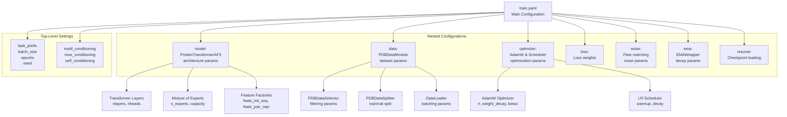
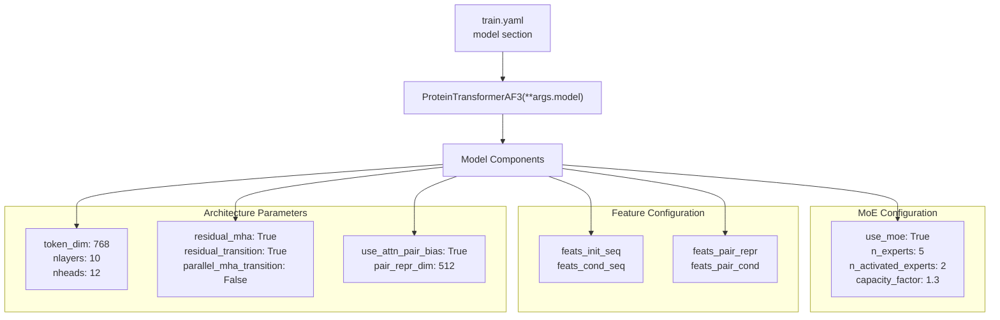
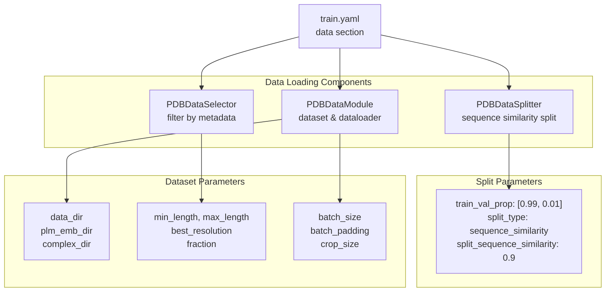
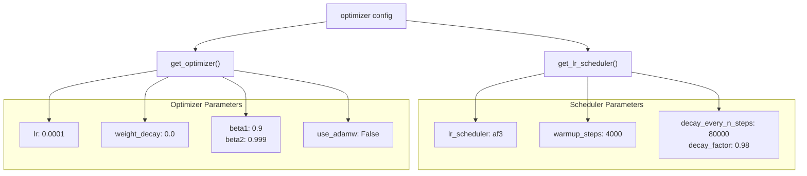
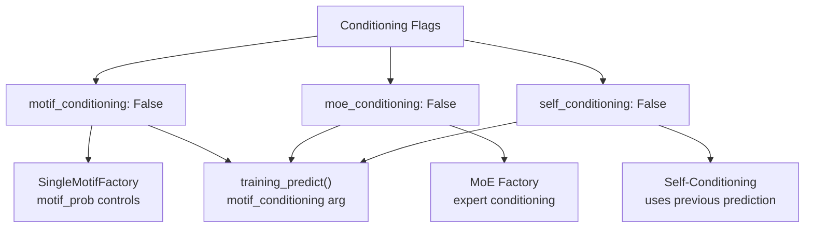
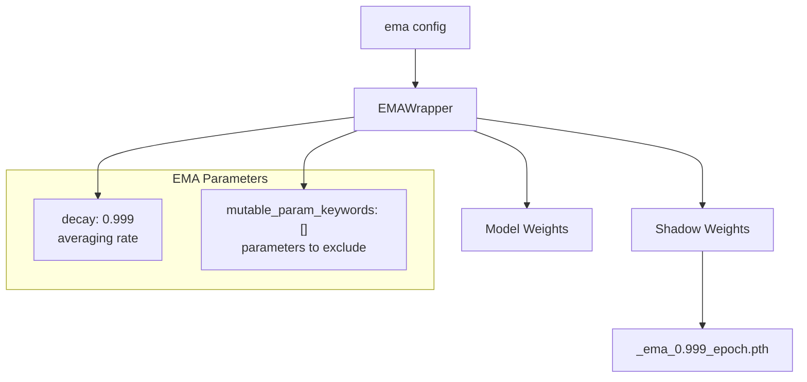
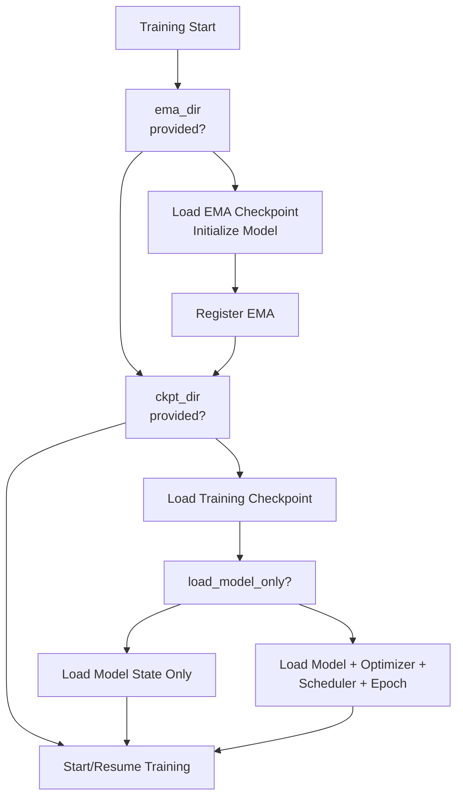
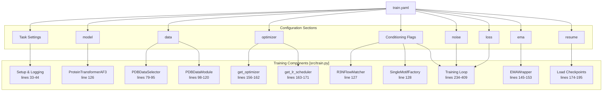

# Training Configuration

> **Relevant source files**
> * [configs/train.yaml](https://github.com/Junjie-Zhu/IDPFold2/blob/5315b279/configs/train.yaml)
> * [src/train.py](https://github.com/Junjie-Zhu/IDPFold2/blob/5315b279/src/train.py)

## Purpose and Scope

This page documents all configuration parameters available in `configs/train.yaml` that control the training process of IDPFold2 models. These parameters define model architecture, data loading, optimization settings, conditioning strategies, and checkpointing behavior. The configuration is loaded by [src/train.py](https://github.com/Junjie-Zhu/IDPFold2/blob/5315b279/src/train.py)

 using Hydra and controls all aspects of the training pipeline.

For inference configuration parameters, see [Inference Configuration](/Junjie-Zhu/IDPFold2/10.2-inference-configuration). For details on how these parameters are used during training, see [Training Pipeline](/Junjie-Zhu/IDPFold2/6.1-training-pipeline).

**Sources:** [configs/train.yaml L1-L123](https://github.com/Junjie-Zhu/IDPFold2/blob/5315b279/configs/train.yaml#L1-L123)

 [src/train.py L31-L32](https://github.com/Junjie-Zhu/IDPFold2/blob/5315b279/src/train.py#L31-L32)

---

## Configuration File Location and Loading

The training configuration is located at `configs/train.yaml` and is loaded using Hydra's decorator-based configuration system. The `@hydra.main` decorator in [src/train.py L31](https://github.com/Junjie-Zhu/IDPFold2/blob/5315b279/src/train.py#L31-L31)

 specifies the configuration path and name:

```python
@hydra.main(version_base="1.3", config_path="../configs", config_name="train")def main(args: DictConfig):
```

The loaded configuration is accessible as a `DictConfig` object throughout the training script. Hydra is configured to disable its default logging and run in the current directory without creating subdirectories.

**Sources:** [src/train.py L31-L32](https://github.com/Junjie-Zhu/IDPFold2/blob/5315b279/src/train.py#L31-L32)

 [configs/train.yaml L114-L122](https://github.com/Junjie-Zhu/IDPFold2/blob/5315b279/configs/train.yaml#L114-L122)

---

## Configuration Structure Overview

The training configuration is organized into logical sections that map to different components of the training system:



**Sources:** [configs/train.yaml L1-L123](https://github.com/Junjie-Zhu/IDPFold2/blob/5315b279/configs/train.yaml#L1-L123)

---

## Task and Experiment Settings

These parameters control basic experiment setup, logging, and reproducibility:

| Parameter | Type | Default | Description |
| --- | --- | --- | --- |
| `task_prefix` | str | `"HYBRID_TRAIN"` | Prefix for logging directory names, combined with timestamp |
| `batch_size` | int | `8` | Batch size per GPU device (total batch = `batch_size * world_size`) |
| `epochs` | int | `500` | Total number of training epochs |
| `target_pred` | str | `"v"` | Prediction target: `"v"` (velocity) or `"x"` (coordinates) |
| `checkpoint_interval` | int | `2` | Save checkpoint every N epochs |
| `seed` | int | `42` | Random seed for reproducibility |
| `deterministic` | bool | `False` | Enable deterministic algorithms (slower but reproducible) |
| `logging_dir` | str | `"./logs"` | Base directory for saving logs and checkpoints |

The `task_prefix` is combined with a timestamp to create unique logging directories at [src/train.py L33](https://github.com/Junjie-Zhu/IDPFold2/blob/5315b279/src/train.py#L33-L33)

:

```
logging_dir = os.path.join(args.logging_dir,     f"{args.task_prefix}_{datetime.datetime.now().strftime('%Y-%m-%d_%H-%M-%S')}")
```

**Sources:** [configs/train.yaml L2-L9](https://github.com/Junjie-Zhu/IDPFold2/blob/5315b279/configs/train.yaml#L2-L9)

 [src/train.py L33-L44](https://github.com/Junjie-Zhu/IDPFold2/blob/5315b279/src/train.py#L33-L44)

---

## Model Architecture Configuration

The `model` section contains all parameters passed to `ProteinTransformerAF3` initialization at [src/train.py L126](https://github.com/Junjie-Zhu/IDPFold2/blob/5315b279/src/train.py#L126-L126)

:



### Core Architecture Parameters

| Parameter | Type | Default | Description |
| --- | --- | --- | --- |
| `training` | bool | `True` | Enable training mode features |
| `token_dim` | int | `768` | Dimension of token embeddings in transformer |
| `nlayers` | int | `10` | Number of transformer layers |
| `nheads` | int | `12` | Number of attention heads per layer |
| `residual_mha` | bool | `True` | Use residual connections in multi-head attention |
| `residual_transition` | bool | `True` | Use residual connections in transition blocks |
| `parallel_mha_transition` | bool | `False` | Compute MHA and transition in parallel (AF3 style) or sequentially |
| `use_attn_pair_bias` | bool | `True` | Bias attention using pair representation |
| `num_registers` | int | `10` | Number of register tokens (AF3 style) |
| `use_qkln` | bool | `True` | Use QK LayerNorm in attention |

### Feature Initialization Parameters

| Parameter | Type | Default | Description |
| --- | --- | --- | --- |
| `strict_feats` | bool | `False` | Raise error if features missing; if False, fill with defaults |
| `feats_init_seq` | list | `["plm_emb", "res_type", "res_idx", "chain_break_per_res"]` | Sequence features for initial token representation |
| `feats_cond_seq` | list | `["time_emb"]` | Sequence features for conditioning vector |
| `t_emb_dim` | int | `256` | Dimension of time embedding |
| `idx_emb_dim` | int | `128` | Dimension of residue index embedding |
| `dim_cond` | int | `512` | Dimension of conditioning vector |
| `plm_in_dim` | int | `1280` | Input dimension of PLM embeddings (ESM2) |
| `plm_out_dim` | int | `256` | Output dimension after PLM projection |

### Pair Representation Parameters

| Parameter | Type | Default | Description |
| --- | --- | --- | --- |
| `feats_pair_repr` | list | `["xt_pair_dists", "rel_pos"]` | Features for pair representation |
| `feats_pair_cond` | list | `["time_emb"]` | Features for pair conditioning |
| `xt_pair_dist_dim` | int | `64` | Dimension of binned pairwise distances |
| `xt_pair_dist_min` | float | `0.1` | Minimum pairwise distance in nm |
| `xt_pair_dist_max` | float | `3.0` | Maximum pairwise distance in nm |
| `r_max` | int | `32` | Maximum relative sequence position to consider |
| `pair_repr_dim` | int | `512` | Final pair representation dimension |

### Mixture of Experts Parameters

| Parameter | Type | Default | Description |
| --- | --- | --- | --- |
| `use_moe` | bool | `True` | Enable Mixture of Experts layers |
| `n_experts` | int | `5` | Total number of expert networks |
| `n_activated_experts` | int | `2` | Number of experts activated per token |
| `dim_moe_cond` | int | `0` | Dimension of MoE conditioning (0 = no conditioning) |
| `capacity_factor` | float | `1.3` | Capacity factor for expert load balancing |
| `normalize_expert_weights` | bool | `True` | Normalize routing weights across experts |

**Sources:** [configs/train.yaml L58-L102](https://github.com/Junjie-Zhu/IDPFold2/blob/5315b279/configs/train.yaml#L58-L102)

 [src/train.py L126](https://github.com/Junjie-Zhu/IDPFold2/blob/5315b279/src/train.py#L126-L126)

---

## Data Pipeline Configuration

The `data` section configures `PDBDataModule`, `PDBDataSelector`, and `PDBDataSplitter`:



### Path and Source Configuration

| Parameter | Type | Default | Description |
| --- | --- | --- | --- |
| `data_dir` | str | `"./data/hybrid_train/"` | Root directory containing processed structures |
| `plm_emb_dir` | str | `"./data/hybrid_train/embedding/"` | Directory containing cached PLM embeddings |
| `complex_dir` | str | `"./data/hybrid_train/complex_contacts.csv"` | CSV file with complex contact information |
| `complex_prop` | float | `0.8` | Proportion of training data that includes complexes |
| `format` | str | `"pdb"` | Structure file format |

### Data Selection Parameters

| Parameter | Type | Default | Description |
| --- | --- | --- | --- |
| `fraction` | float | `1.0` | Fraction of dataset to use |
| `molecule_type` | str or null | `null` | Filter by molecule type (e.g., "protein") |
| `experiment_types` | list or null | `null` | Filter by experiment types (e.g., ["X-RAY DIFFRACTION"]) |
| `min_length` | int or null | `null` | Minimum protein length in residues |
| `max_length` | int or null | `256` | Maximum protein length in residues |
| `oligomeric_min` | int or null | `null` | Minimum oligomeric state |
| `oligomeric_max` | int or null | `null` | Maximum oligomeric state |
| `best_resolution` | float or null | `null` | Best resolution threshold in Angstroms |
| `worst_resolution` | float or null | `null` | Worst resolution threshold in Angstroms |

### Data Splitting Parameters

| Parameter | Type | Default | Description |
| --- | --- | --- | --- |
| `train_val_prop` | list | `[0.99, 0.01]` | Train/validation split proportions |
| `split_type` | str | `"sequence_similarity"` | Split method: `"sequence_similarity"` or `"random"` |
| `split_sequence_similarity` | float | `0.9` | Sequence similarity threshold for clustering |
| `overwrite_sequence_clusters` | bool | `False` | Recompute sequence clusters if they exist |

### Data Loading Parameters

| Parameter | Type | Default | Description |
| --- | --- | --- | --- |
| `crop_size` | int | `256` | Maximum residues per training crop (for long proteins) |
| `batch_padding` | bool | `True` | Enable dense padding for variable-length batching |
| `sampling_mode` | str | `"cluster-random"` | Sampling strategy: `"cluster-random"`, `"cluster-sequential"`, or `"random"` |
| `num_workers` | int | `6` | Number of DataLoader worker processes |
| `pin_memory` | bool | `True` | Pin memory for faster GPU transfer |
| `overwrite` | bool | `False` | Reprocess structures even if processed files exist |

The `PDBDataModule` is instantiated at [src/train.py L98-L120](https://github.com/Junjie-Zhu/IDPFold2/blob/5315b279/src/train.py#L98-L120)

 with transforms including `GlobalRotationTransform` and `ChainBreakPerResidueTransform`.

**Sources:** [configs/train.yaml L32-L56](https://github.com/Junjie-Zhu/IDPFold2/blob/5315b279/configs/train.yaml#L32-L56)

 [src/train.py L79-L123](https://github.com/Junjie-Zhu/IDPFold2/blob/5315b279/src/train.py#L79-L123)

---

## Optimizer and Scheduler Configuration

The `optimizer` section controls the AdamW optimizer and learning rate scheduler:



### Optimizer Parameters

| Parameter | Type | Default | Description |
| --- | --- | --- | --- |
| `lr` | float | `0.0001` | Base learning rate |
| `weight_decay` | float | `0.0` | L2 regularization weight decay |
| `beta1` | float | `0.9` | Adam beta1 parameter (first moment decay) |
| `beta2` | float | `0.999` | Adam beta2 parameter (second moment decay) |
| `use_adamw` | bool | `False` | Use AdamW variant (decoupled weight decay) |

### Learning Rate Scheduler Parameters

| Parameter | Type | Default | Description |
| --- | --- | --- | --- |
| `lr_scheduler` | str | `"af3"` | Scheduler type: `"af3"` (AlphaFold3-style), `"cosine"`, or `"constant"` |
| `warmup_steps` | int | `4000` | Number of warmup steps with linear LR increase |
| `decay_every_n_steps` | int | `80000` | Steps between exponential decay (for AF3 scheduler) |
| `decay_factor` | float | `0.98` | Multiplicative decay factor |

The optimizer and scheduler are created at [src/train.py L156-L171](https://github.com/Junjie-Zhu/IDPFold2/blob/5315b279/src/train.py#L156-L171)

 and stepped at [src/train.py L274-L275](https://github.com/Junjie-Zhu/IDPFold2/blob/5315b279/src/train.py#L274-L275)

:

```
optimizer.step()scheduler.step()
```

**Sources:** [configs/train.yaml L103-L112](https://github.com/Junjie-Zhu/IDPFold2/blob/5315b279/configs/train.yaml#L103-L112)

 [src/train.py L156-L171](https://github.com/Junjie-Zhu/IDPFold2/blob/5315b279/src/train.py#L156-L171)

 [src/train.py L274-L275](https://github.com/Junjie-Zhu/IDPFold2/blob/5315b279/src/train.py#L274-L275)

---

## Conditioning Strategies Configuration

These boolean flags control which conditioning strategies are enabled during training:



| Parameter | Type | Default | Description |
| --- | --- | --- | --- |
| `motif_conditioning` | bool | `False` | Enable motif conditioning (preserve parts of structure during training) |
| `moe_conditioning` | bool | `False` | Enable MoE-based conditioning (condition experts on structure type) |
| `self_conditioning` | bool | `False` | Enable self-conditioning (use previous prediction as additional input) |
| `motif_prob` | float | N/A | Probability of applying motif conditioning when enabled (not in default config but used at [src/train.py L128](https://github.com/Junjie-Zhu/IDPFold2/blob/5315b279/src/train.py#L128-L128) <br> ) |

These flags are passed to `training_predict()` at [src/train.py L214-L216](https://github.com/Junjie-Zhu/IDPFold2/blob/5315b279/src/train.py#L214-L216)

 during training:

```markdown
loss, loss_dict = training_predict(    batch=check_dict,    # ...    motif_conditioning=args.motif_conditioning,    moe_conditioning=args.moe_conditioning,    self_conditioning=args.self_conditioning,    # ...)
```

When `motif_conditioning` is enabled, the `R3NFlowMatcher` is initialized with `zero_com=False` at [src/train.py L127](https://github.com/Junjie-Zhu/IDPFold2/blob/5315b279/src/train.py#L127-L127)

**Sources:** [configs/train.yaml L11-L13](https://github.com/Junjie-Zhu/IDPFold2/blob/5315b279/configs/train.yaml#L11-L13)

 [src/train.py L127-L128](https://github.com/Junjie-Zhu/IDPFold2/blob/5315b279/src/train.py#L127-L128)

 [src/train.py L214-L216](https://github.com/Junjie-Zhu/IDPFold2/blob/5315b279/src/train.py#L214-L216)

---

## Noise Configuration

The `noise` section controls the noise sampling strategy for flow matching:

| Parameter | Type | Default | Description |
| --- | --- | --- | --- |
| `mode` | str | `"mix_up02_beta"` | Noise sampling mode for time steps |
| `p1` | float | `1.9` | First parameter for noise distribution |
| `p2` | float | `1.0` | Second parameter for noise distribution |

These parameters are unpacked as `noise_kwargs` and passed to `training_predict()` at [src/train.py L205-L218](https://github.com/Junjie-Zhu/IDPFold2/blob/5315b279/src/train.py#L205-L218)

:

```markdown
noise_kwargs = {**args.noise}loss, loss_dict = training_predict(    # ...    noise_kwargs=noise_kwargs,    # ...)
```

The noise mode controls how time steps `t` are sampled during training. The `"mix_up02_beta"` mode uses a mixture of uniform and beta distributions biased toward small time values.

**Sources:** [configs/train.yaml L24-L27](https://github.com/Junjie-Zhu/IDPFold2/blob/5315b279/configs/train.yaml#L24-L27)

 [src/train.py L205-L218](https://github.com/Junjie-Zhu/IDPFold2/blob/5315b279/src/train.py#L205-L218)

---

## Loss Configuration

The `loss` section specifies loss function weights:

| Parameter | Type | Default | Description |
| --- | --- | --- | --- |
| `moe_loss_weight` | float | `0.3` | Weight for MoE load balancing loss (empirically chosen) |

The MoE loss weight is used at [src/train.py L217](https://github.com/Junjie-Zhu/IDPFold2/blob/5315b279/src/train.py#L217-L217)

 to balance the flow matching loss with the expert load balancing loss:

```markdown
loss, loss_dict = training_predict(    # ...    moe_loss_weight=args.loss.moe_loss_weight,)
```

The total loss is: `total_loss = flow_matching_loss + moe_loss_weight * moe_load_balancing_loss`

**Sources:** [configs/train.yaml L29-L30](https://github.com/Junjie-Zhu/IDPFold2/blob/5315b279/configs/train.yaml#L29-L30)

 [src/train.py L217](https://github.com/Junjie-Zhu/IDPFold2/blob/5315b279/src/train.py#L217-L217)

---

## EMA Configuration

The `ema` section configures the Exponential Moving Average wrapper for stable inference:



| Parameter | Type | Default | Description |
| --- | --- | --- | --- |
| `decay` | float | `0.999` | EMA decay rate (0 to disable EMA) |
| `mutable_param_keywords` | list | `[""]` | Parameter name substrings to exclude from EMA |

The EMA wrapper is created at [src/train.py L145-L153](https://github.com/Junjie-Zhu/IDPFold2/blob/5315b279/src/train.py#L145-L153)

 when `decay > 0`:

```
if args.ema.decay > 0:    ema_wrapper = EMAWrapper(        model=model,        decay=args.ema.decay,        mutable_param_keywords=args.ema.mutable_param_keywords,    )    ema_wrapper.register()
```

During training, EMA weights are updated after each optimizer step at [src/train.py L254-L255](https://github.com/Junjie-Zhu/IDPFold2/blob/5315b279/src/train.py#L254-L255)

 For validation, EMA weights are applied at [src/train.py L301-L302](https://github.com/Junjie-Zhu/IDPFold2/blob/5315b279/src/train.py#L301-L302)

 and restored afterward at [src/train.py L331-L332](https://github.com/Junjie-Zhu/IDPFold2/blob/5315b279/src/train.py#L331-L332)

**Sources:** [configs/train.yaml L20-L22](https://github.com/Junjie-Zhu/IDPFold2/blob/5315b279/configs/train.yaml#L20-L22)

 [src/train.py L145-L153](https://github.com/Junjie-Zhu/IDPFold2/blob/5315b279/src/train.py#L145-L153)

 [src/train.py L254-L255](https://github.com/Junjie-Zhu/IDPFold2/blob/5315b279/src/train.py#L254-L255)

 [src/train.py L301-L302](https://github.com/Junjie-Zhu/IDPFold2/blob/5315b279/src/train.py#L301-L302)

---

## Resume and Checkpointing Configuration

The `resume` section controls checkpoint loading for continuing training or fine-tuning:

| Parameter | Type | Default | Description |
| --- | --- | --- | --- |
| `ckpt_dir` | str or null | `null` | Path to checkpoint file (`.pth`) to resume from |
| `ema_dir` | str or null | `null` | Path to EMA checkpoint file to initialize from |
| `load_model_only` | bool | `True` | Load only model weights; skip optimizer and scheduler state |

### Checkpoint Loading Flow



The checkpoint loading logic is implemented at [src/train.py L174-L195](https://github.com/Junjie-Zhu/IDPFold2/blob/5315b279/src/train.py#L174-L195)

:

1. If `ema_dir` is provided, load EMA weights and re-register EMA wrapper
2. If `ckpt_dir` is provided, load checkpoint
3. If `load_model_only=False`, also restore optimizer, scheduler, and starting epoch

### Checkpoint Saving

Checkpoints are automatically saved every `checkpoint_interval` epochs at [src/train.py L345-L352](https://github.com/Junjie-Zhu/IDPFold2/blob/5315b279/src/train.py#L345-L352)

:

```
if crt_epoch % args.checkpoint_interval == 0 or crt_epoch == args.epochs:    checkpoint_path = os.path.join(logging_dir, f"checkpoints/epoch_{crt_epoch}.pth")    torch.save({        'epoch': crt_epoch,        'model_state_dict': model.module.state_dict() if DIST_WRAPPER.world_size > 1 else model.state_dict(),        'optimizer_state_dict': optimizer.state_dict(),        'scheduler_state_dict': scheduler.state_dict(),    }, checkpoint_path)
```

EMA checkpoints are saved separately with naming pattern `_ema_{decay}_{epoch}.pth` at [src/train.py L353-L358](https://github.com/Junjie-Zhu/IDPFold2/blob/5315b279/src/train.py#L353-L358)

**Sources:** [configs/train.yaml L15-L18](https://github.com/Junjie-Zhu/IDPFold2/blob/5315b279/configs/train.yaml#L15-L18)

 [src/train.py L174-L195](https://github.com/Junjie-Zhu/IDPFold2/blob/5315b279/src/train.py#L174-L195)

 [src/train.py L345-L358](https://github.com/Junjie-Zhu/IDPFold2/blob/5315b279/src/train.py#L345-L358)

---

## Configuration Usage in Training Script

The following diagram shows how configuration sections map to components in the training script:



**Sources:** [configs/train.yaml L1-L123](https://github.com/Junjie-Zhu/IDPFold2/blob/5315b279/configs/train.yaml#L1-L123)

 [src/train.py L1-L435](https://github.com/Junjie-Zhu/IDPFold2/blob/5315b279/src/train.py#L1-L435)

---

## Complete Parameter Reference Table

The following comprehensive table lists all configuration parameters with their locations, types, defaults, and purposes:

| Section | Parameter | Type | Default | Line | Purpose |
| --- | --- | --- | --- | --- | --- |
| **Root** | `task_prefix` | str | `"HYBRID_TRAIN"` | 2 | Logging directory prefix |
|  | `batch_size` | int | `8` | 3 | Batch size per GPU |
|  | `epochs` | int | `500` | 4 | Total training epochs |
|  | `target_pred` | str | `"v"` | 5 | Prediction target (velocity or position) |
|  | `checkpoint_interval` | int | `2` | 6 | Checkpoint save frequency |
|  | `seed` | int | `42` | 7 | Random seed |
|  | `deterministic` | bool | `False` | 8 | Deterministic mode |
|  | `logging_dir` | str | `"./logs"` | 9 | Base logging directory |
|  | `motif_conditioning` | bool | `False` | 11 | Enable motif conditioning |
|  | `moe_conditioning` | bool | `False` | 12 | Enable MoE conditioning |
|  | `self_conditioning` | bool | `False` | 13 | Enable self-conditioning |
| **resume** | `ckpt_dir` | str/null | `null` | 16 | Training checkpoint path |
|  | `ema_dir` | str/null | `null` | 17 | EMA checkpoint path |
|  | `load_model_only` | bool | `True` | 18 | Load model weights only |
| **ema** | `decay` | float | `0.999` | 21 | EMA decay rate |
|  | `mutable_param_keywords` | list | `[""]` | 22 | Exclude parameters from EMA |
| **noise** | `mode` | str | `"mix_up02_beta"` | 25 | Noise sampling mode |
|  | `p1` | float | `1.9` | 26 | Noise distribution param 1 |
|  | `p2` | float | `1.0` | 27 | Noise distribution param 2 |
| **loss** | `moe_loss_weight` | float | `0.3` | 30 | MoE load balancing weight |
| **data** | `data_dir` | str | `"./data/hybrid_train/"` | 33 | Structure data directory |
|  | `plm_emb_dir` | str | `"./data/hybrid_train/embedding/"` | 34 | PLM embedding directory |
|  | `complex_dir` | str | `"./data/hybrid_train/complex_contacts.csv"` | 35 | Complex contacts file |
|  | `complex_prop` | float | `0.8` | 36 | Complex data proportion |
|  | `crop_size` | int | `256` | 37 | Crop size for long proteins |
|  | `format` | str | `"pdb"` | 38 | Structure file format |
|  | `overwrite` | bool | `False` | 39 | Reprocess structures |
|  | `batch_padding` | bool | `True` | 40 | Enable dense padding |
|  | `sampling_mode` | str | `"cluster-random"` | 41 | Data sampling strategy |
|  | `num_workers` | int | `6` | 42 | DataLoader workers |
|  | `pin_memory` | bool | `True` | 43 | Pin memory for GPU |
|  | `fraction` | float | `1.0` | 44 | Dataset fraction to use |
|  | `molecule_type` | str/null | `null` | 45 | Molecule type filter |
|  | `experiment_types` | list/null | `null` | 46 | Experiment type filter |
|  | `min_length` | int/null | `null` | 47 | Min protein length |
|  | `max_length` | int/null | `256` | 48 | Max protein length |
|  | `oligomeric_min` | int/null | `null` | 49 | Min oligomeric state |
|  | `oligomeric_max` | int/null | `null` | 50 | Max oligomeric state |
|  | `best_resolution` | float/null | `null` | 51 | Best resolution threshold |
|  | `worst_resolution` | float/null | `null` | 52 | Worst resolution threshold |
|  | `train_val_prop` | list | `[0.99, 0.01]` | 53 | Train/val split |
|  | `split_type` | str | `"sequence_similarity"` | 54 | Split method |
|  | `split_sequence_similarity` | float | `0.9` | 55 | Similarity threshold |
|  | `overwrite_sequence_clusters` | bool | `False` | 56 | Recompute clusters |
| **model** | `training` | bool | `True` | 59 | Training mode |
|  | `token_dim` | int | `768` | 60 | Token dimension |
|  | `nlayers` | int | `10` | 61 | Transformer layers |
|  | `nheads` | int | `12` | 62 | Attention heads |
|  | `residual_mha` | bool | `True` | 63 | MHA residual connection |
|  | `residual_transition` | bool | `True` | 64 | Transition residual |
|  | `parallel_mha_transition` | bool | `False` | 65 | Parallel computation |
|  | `use_attn_pair_bias` | bool | `True` | 66 | Pair bias in attention |
|  | `strict_feats` | bool | `False` | 68 | Strict feature validation |
|  | `feats_init_seq` | list | `["plm_emb", "res_type", "res_idx", "chain_break_per_res"]` | 71 | Initial sequence features |
|  | `feats_cond_seq` | list | `["time_emb"]` | 72 | Conditioning sequence features |
|  | `t_emb_dim` | int | `256` | 75 | Time embedding dimension |
|  | `idx_emb_dim` | int | `128` | 76 | Index embedding dimension |
|  | `dim_cond` | int | `512` | 77 | Conditioning vector dimension |
|  | `plm_in_dim` | int | `1280` | 78 | PLM input dimension (ESM2) |
|  | `plm_out_dim` | int | `256` | 79 | PLM output dimension |
|  | `feats_pair_repr` | list | `["xt_pair_dists", "rel_pos"]` | 81 | Pair features |
|  | `feats_pair_cond` | list | `["time_emb"]` | 82 | Pair conditioning features |
|  | `xt_pair_dist_dim` | int | `64` | 86 | Pairwise distance bins |
|  | `xt_pair_dist_min` | float | `0.1` | 87 | Min pairwise distance (nm) |
|  | `xt_pair_dist_max` | float | `3.0` | 88 | Max pairwise distance (nm) |
|  | `r_max` | int | `32` | 89 | Max relative position |
|  | `pair_repr_dim` | int | `512` | 92 | Pair representation dimension |
|  | `num_registers` | int | `10` | 93 | Number of register tokens |
|  | `use_qkln` | bool | `True` | 94 | Use QK LayerNorm |
|  | `use_moe` | bool | `True` | 96 | Enable MoE |
|  | `n_experts` | int | `5` | 97 | Total experts |
|  | `n_activated_experts` | int | `2` | 98 | Active experts per token |
|  | `dim_moe_cond` | int | `0` | 99 | MoE conditioning dimension |
|  | `capacity_factor` | float | `1.3` | 100 | Expert capacity factor |
|  | `normalize_expert_weights` | bool | `True` | 101 | Normalize routing weights |
| **optimizer** | `lr` | float | `0.0001` | 104 | Learning rate |
|  | `weight_decay` | float | `0.0` | 105 | Weight decay |
|  | `beta1` | float | `0.9` | 106 | Adam beta1 |
|  | `beta2` | float | `0.999` | 107 | Adam beta2 |
|  | `use_adamw` | bool | `False` | 108 | Use AdamW variant |
|  | `lr_scheduler` | str | `"af3"` | 109 | Scheduler type |
|  | `warmup_steps` | int | `4000` | 110 | Warmup steps |
|  | `decay_every_n_steps` | int | `80000` | 111 | Decay interval |
|  | `decay_factor` | float | `0.98` | 112 | Decay factor |

**Sources:** [configs/train.yaml L1-L123](https://github.com/Junjie-Zhu/IDPFold2/blob/5315b279/configs/train.yaml#L1-L123)