# Training Pipeline

> **Relevant source files**
> * [configs/train.yaml](https://github.com/Junjie-Zhu/IDPFold2/blob/5315b279/configs/train.yaml)
> * [src/train.py](https://github.com/Junjie-Zhu/IDPFold2/blob/5315b279/src/train.py)

## Purpose and Scope

This document describes the main training loop and orchestration logic for training IDPFold2 models. The training pipeline handles data loading, model initialization, distributed training coordination, loss computation, optimization, validation, and checkpointing.

For details about the model architecture being trained, see [ProteinTransformerAF3](/Junjie-Zhu/IDPFold2/5.1-proteintransformeraf3). For information about the loss computation and forward pass during training, see [Training Predict Function](/Junjie-Zhu/IDPFold2/6.2-training-predict-function) and [Loss Functions](/Junjie-Zhu/IDPFold2/6.3-loss-functions). For dataset preparation and loading, see [Data Pipeline](/Junjie-Zhu/IDPFold2/4-data-pipeline).

**Sources:** [src/train.py L1-L435](https://github.com/Junjie-Zhu/IDPFold2/blob/5315b279/src/train.py#L1-L435)

---

## Training Workflow Overview

The training pipeline follows a structured sequence from configuration loading through iterative training and validation cycles:

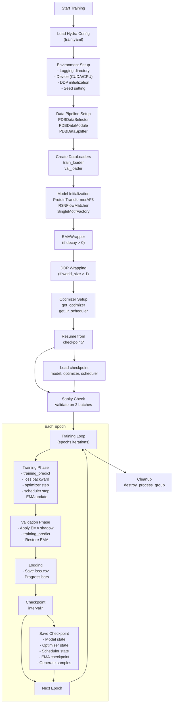

**Sources:** [src/train.py L32-L413](https://github.com/Junjie-Zhu/IDPFold2/blob/5315b279/src/train.py#L32-L413)

---

## Setup and Initialization

### Configuration Management

The training pipeline uses Hydra for configuration management. The main configuration file `train.yaml` is loaded at runtime and controls all aspects of training:

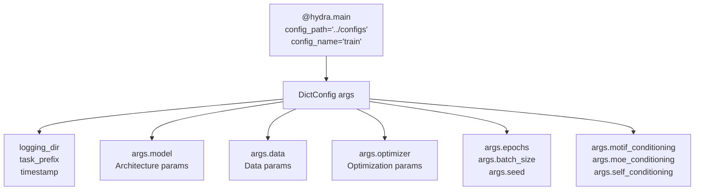

The configuration is saved to the logging directory for reproducibility:

| Configuration Section | Key Parameters | Purpose |
| --- | --- | --- |
| `task_prefix` | String identifier | Names the training run |
| `batch_size` | Batch size per device | Controls memory usage |
| `epochs` | Total training epochs | Determines training duration |
| `checkpoint_interval` | Save frequency | Controls checkpoint frequency |
| `seed` | Random seed | Ensures reproducibility |
| `logging_dir` | Directory path | Stores checkpoints and logs |

**Sources:** [src/train.py L31-L44](https://github.com/Junjie-Zhu/IDPFold2/blob/5315b279/src/train.py#L31-L44)

 [configs/train.yaml L1-L13](https://github.com/Junjie-Zhu/IDPFold2/blob/5315b279/configs/train.yaml#L1-L13)

### Environment Setup

The training script initializes the execution environment, handling both single-GPU and multi-GPU scenarios:

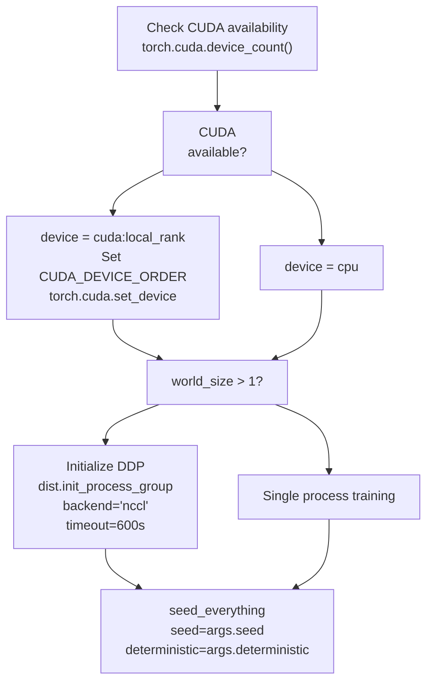

The `DIST_WRAPPER` utility manages distributed training state, tracking `rank`, `local_rank`, and `world_size` across all processes.

**Sources:** [src/train.py L46-L77](https://github.com/Junjie-Zhu/IDPFold2/blob/5315b279/src/train.py#L46-L77)

### Distributed Training Initialization

When running with multiple GPUs, the training script initializes the NCCL backend for distributed data parallel training:

| Parameter | Value | Purpose |
| --- | --- | --- |
| `backend` | `"nccl"` | CUDA-optimized communication backend |
| `timeout` | `600` seconds (configurable via `NCCL_TIMEOUT_SECOND`) | Prevents hanging on communication failures |
| `device_ids` | `[DIST_WRAPPER.local_rank]` | GPU assignment per process |
| `output_device` | `DIST_WRAPPER.local_rank` | Output gathering device |
| `static_graph` | `True` | Optimization for unchanging computation graph |

**Sources:** [src/train.py L56-L67](https://github.com/Junjie-Zhu/IDPFold2/blob/5315b279/src/train.py#L56-L67)

 [src/train.py L135-L140](https://github.com/Junjie-Zhu/IDPFold2/blob/5315b279/src/train.py#L135-L140)

---

## Data Pipeline Setup

### Dataset Selection and Splitting

The data pipeline begins with optional dataset selection and mandatory splitting:

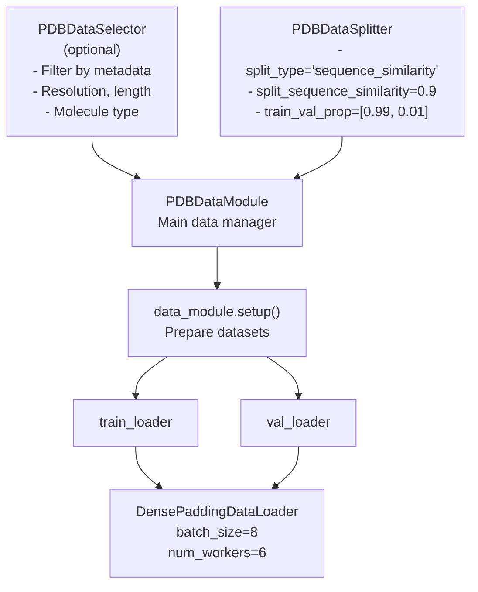

The `PDBDataSelector` filters structures based on quality metrics (currently set to `None` in the training script, relying on pre-filtered data):

```
dataselector = PDBDataSelector(    data_dir=args.data.data_dir,    fraction=args.data.fraction,    molecule_type=args.data.molecule_type,    experiment_types=args.data.experiment_types,    min_length=args.data.min_length,    max_length=args.data.max_length,    oligomeric_min=args.data.oligomeric_min,    oligomeric_max=args.data.oligomeric_max,    best_resolution=args.data.best_resolution,    worst_resolution=args.data.worst_resolution,    remove_ligands=[],    remove_non_standard_residues=True,    remove_pdb_unavailable=True,    exclude_ids=[]) if args.data.molecule_type is not None else None
```

**Sources:** [src/train.py L79-L95](https://github.com/Junjie-Zhu/IDPFold2/blob/5315b279/src/train.py#L79-L95)

 [configs/train.yaml L32-L56](https://github.com/Junjie-Zhu/IDPFold2/blob/5315b279/configs/train.yaml#L32-L56)

### DataLoader Configuration

The `PDBDataModule` orchestrates data loading with several key features:

| Parameter | Default Value | Purpose |
| --- | --- | --- |
| `data_dir` | `./data/hybrid_train/` | Root directory for protein structures |
| `plm_embedding` | `./data/hybrid_train/embedding/` | Pre-computed ESM2 embeddings |
| `complex_dir` | `./data/hybrid_train/complex_contacts.csv` | Multi-chain complex contacts |
| `complex_prop` | `0.8` | Proportion of data that is multi-chain |
| `crop_size` | `256` | Maximum residues per crop |
| `batch_padding` | `True` | Enable dense padding for variable lengths |
| `sampling_mode` | `"cluster-random"` | Cluster-aware random sampling |
| `num_workers` | `6` | DataLoader parallel workers |
| `pin_memory` | `True` | Enable CUDA memory pinning |

**Sources:** [src/train.py L98-L123](https://github.com/Junjie-Zhu/IDPFold2/blob/5315b279/src/train.py#L98-L123)

 [configs/train.yaml L32-L56](https://github.com/Junjie-Zhu/IDPFold2/blob/5315b279/configs/train.yaml#L32-L56)

### Data Transforms

Two transforms are applied to each batch during training:

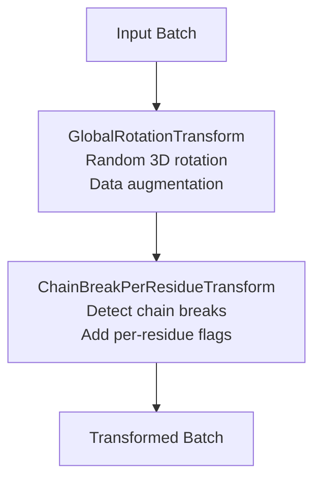

These transforms are configured in the `transforms` parameter:

```
transforms=[GlobalRotationTransform(), ChainBreakPerResidueTransform()]
```

**Sources:** [src/train.py L112](https://github.com/Junjie-Zhu/IDPFold2/blob/5315b279/src/train.py#L112-L112)

 [configs/train.yaml L40-L41](https://github.com/Junjie-Zhu/IDPFold2/blob/5315b279/configs/train.yaml#L40-L41)

---

## Model Initialization

### Model Architecture Setup

The core model and flow matching components are instantiated:

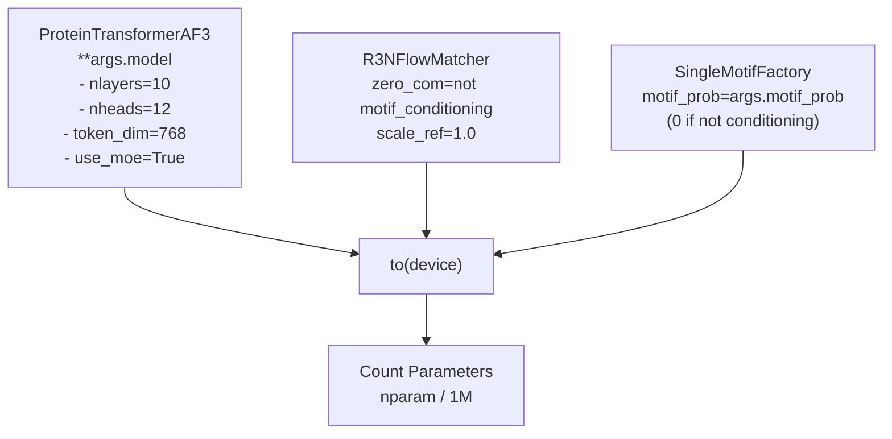

Key model configuration parameters:

| Parameter | Value | Purpose |
| --- | --- | --- |
| `token_dim` | `768` | Token embedding dimension |
| `nlayers` | `10` | Number of transformer layers |
| `nheads` | `12` | Multi-head attention heads |
| `use_moe` | `True` | Enable Mixture of Experts |
| `n_experts` | `5` | Number of expert networks |
| `n_activated_experts` | `2` | Experts activated per token |
| `pair_repr_dim` | `512` | Pair representation dimension |
| `num_registers` | `10` | Number of register tokens |

**Sources:** [src/train.py L126-L143](https://github.com/Junjie-Zhu/IDPFold2/blob/5315b279/src/train.py#L126-L143)

 [configs/train.yaml L58-L102](https://github.com/Junjie-Zhu/IDPFold2/blob/5315b279/configs/train.yaml#L58-L102)

### Exponential Moving Average (EMA)

If `args.ema.decay > 0`, an EMA wrapper maintains shadow parameters for stable inference:

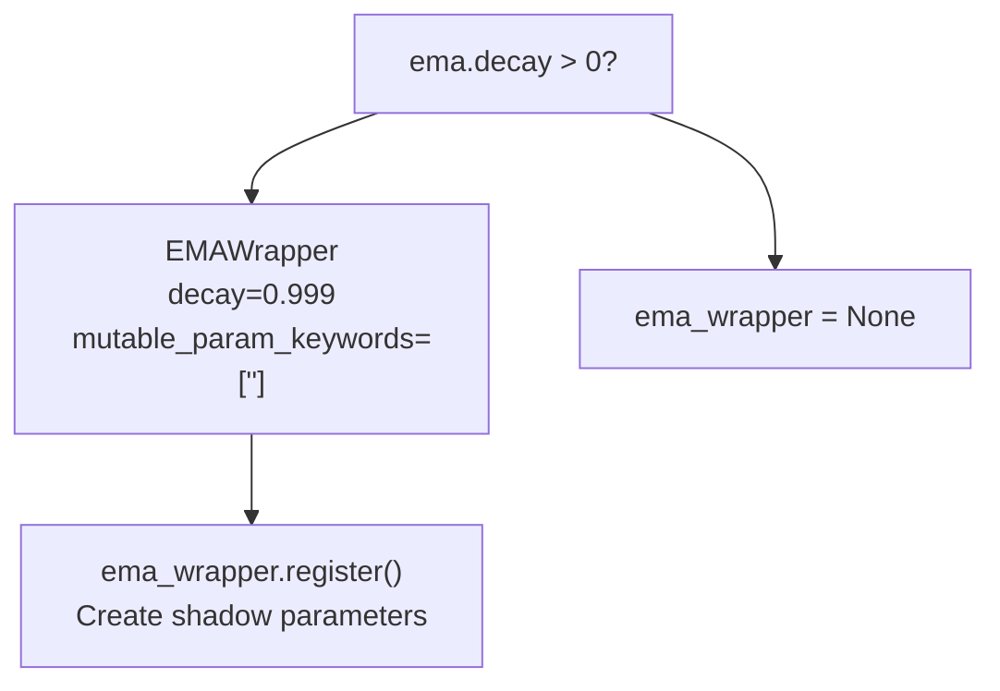

The EMA wrapper serves two purposes:

1. **During training**: Updates shadow parameters after each optimizer step
2. **During validation**: Temporarily replaces model parameters with shadow parameters for evaluation

**Sources:** [src/train.py L145-L153](https://github.com/Junjie-Zhu/IDPFold2/blob/5315b279/src/train.py#L145-L153)

 [configs/train.yaml L20-L22](https://github.com/Junjie-Zhu/IDPFold2/blob/5315b279/configs/train.yaml#L20-L22)

### Model Wrapping (DDP)

For multi-GPU training, the model is wrapped with `DistributedDataParallel`:

```
if DIST_WRAPPER.world_size > 1:    model = DDP(        model,        device_ids=[DIST_WRAPPER.local_rank],        output_device=DIST_WRAPPER.local_rank,        static_graph=True,    )
```

The `static_graph=True` optimization assumes the computation graph does not change between iterations, enabling faster gradient synchronization.

**Sources:** [src/train.py L130-L140](https://github.com/Junjie-Zhu/IDPFold2/blob/5315b279/src/train.py#L130-L140)

---

## Optimization Configuration

### Optimizer Setup

The optimizer is configured through the `get_optimizer` function:

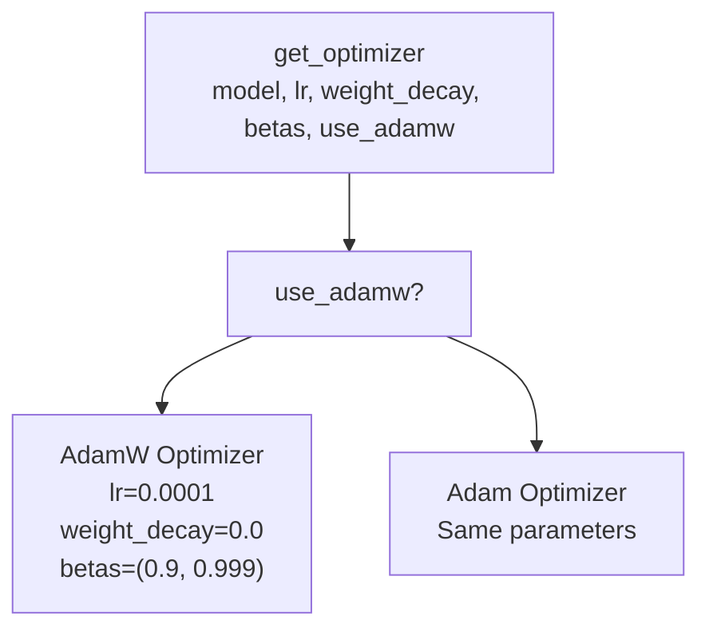

Configuration parameters:

| Parameter | Default Value | Purpose |
| --- | --- | --- |
| `lr` | `0.0001` | Base learning rate |
| `weight_decay` | `0.0` | L2 regularization (typically 0 for AdamW) |
| `beta1` | `0.9` | First moment decay |
| `beta2` | `0.999` | Second moment decay |
| `use_adamw` | `False` | Use AdamW vs standard Adam |

**Sources:** [src/train.py L156-L162](https://github.com/Junjie-Zhu/IDPFold2/blob/5315b279/src/train.py#L156-L162)

 [configs/train.yaml L103-L108](https://github.com/Junjie-Zhu/IDPFold2/blob/5315b279/configs/train.yaml#L103-L108)

### Learning Rate Scheduler

The scheduler modulates the learning rate over training:

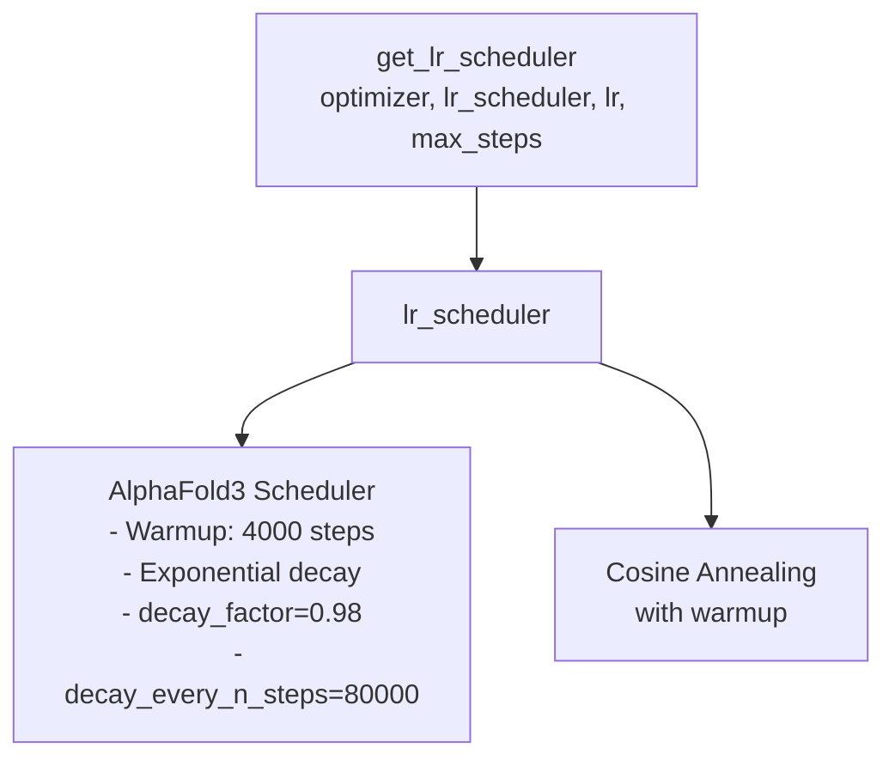

The AlphaFold3 scheduler (default) implements:

1. **Linear warmup** from 0 to `lr` over `warmup_steps`
2. **Exponential decay** by `decay_factor` every `decay_every_n_steps`

**Sources:** [src/train.py L163-L171](https://github.com/Junjie-Zhu/IDPFold2/blob/5315b279/src/train.py#L163-L171)

 [configs/train.yaml L109-L112](https://github.com/Junjie-Zhu/IDPFold2/blob/5315b279/configs/train.yaml#L109-L112)

### Checkpoint Resumption

The training script supports resuming from checkpoints:

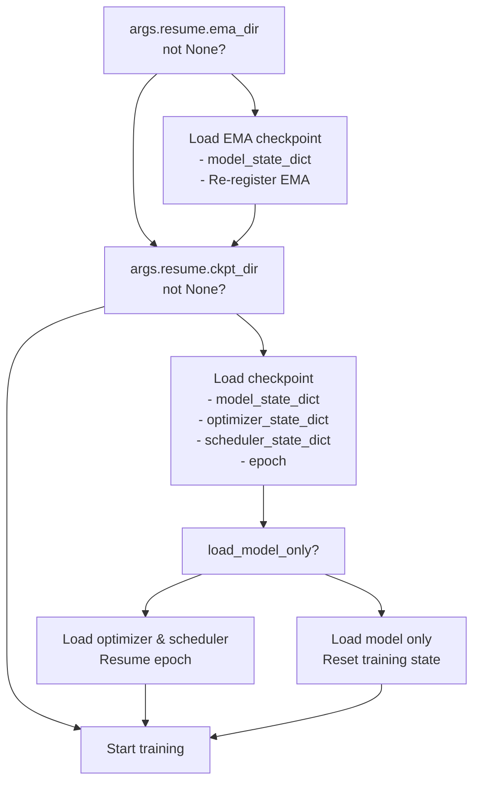

Resume configuration:

| Parameter | Default | Purpose |
| --- | --- | --- |
| `resume.ckpt_dir` | `null` | Path to training checkpoint |
| `resume.ema_dir` | `null` | Path to EMA checkpoint |
| `resume.load_model_only` | `True` | Skip optimizer/scheduler state |

**Sources:** [src/train.py L173-L195](https://github.com/Junjie-Zhu/IDPFold2/blob/5315b279/src/train.py#L173-L195)

 [configs/train.yaml L15-L18](https://github.com/Junjie-Zhu/IDPFold2/blob/5315b279/configs/train.yaml#L15-L18)

---

## Training Loop

### Sanity Check

Before training begins, a sanity check validates the setup by running inference on validation batches:

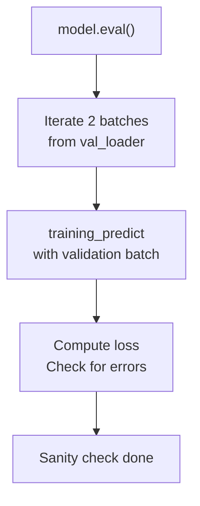

This ensures the model, data pipeline, and loss computation work correctly before committing to full training.

**Sources:** [src/train.py L198-L221](https://github.com/Junjie-Zhu/IDPFold2/blob/5315b279/src/train.py#L198-L221)

### Training Phase

Each training epoch iterates through the training dataset:

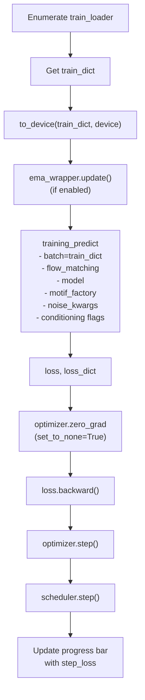

Key training loop components:

| Component | Function | Purpose |
| --- | --- | --- |
| `to_device()` | Moves tensors to GPU | Ensures data is on correct device |
| `ema_wrapper.update()` | Updates shadow parameters | Maintains EMA for inference |
| `training_predict()` | Forward pass and loss | Computes flow matching loss |
| `optimizer.zero_grad()` | Clears gradients | Prepares for new gradients |
| `loss.backward()` | Backpropagation | Computes parameter gradients |
| `optimizer.step()` | Parameter update | Applies gradient descent |
| `scheduler.step()` | LR adjustment | Modulates learning rate |

**Sources:** [src/train.py L234-L285](https://github.com/Junjie-Zhu/IDPFold2/blob/5315b279/src/train.py#L234-L285)

### Validation Phase

After each training epoch, the model is evaluated on the validation set:

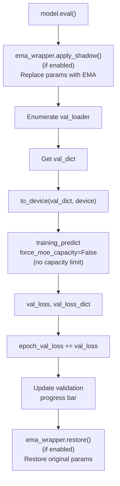

Validation differs from training in several ways:

* No gradient computation (`torch.no_grad()`)
* EMA shadow parameters used if available
* No MoE capacity constraints (`force_moe_capacity=False`)
* No parameter updates

**Sources:** [src/train.py L287-L334](https://github.com/Junjie-Zhu/IDPFold2/blob/5315b279/src/train.py#L287-L334)

### Loss Computation and Backpropagation

The `training_predict` function computes the loss:

```
loss, loss_dict = training_predict(    batch=train_dict,    flow_matching=flow_matching,    model=model,    motif_factory=motif_factory,    moe_factory=None,    noise_kwargs=noise_kwargs,    target_pred=args.target_pred,    motif_conditioning=args.motif_conditioning,    moe_conditioning=args.moe_conditioning,    self_conditioning=args.self_conditioning,    moe_loss_weight=args.loss.moe_loss_weight,)
```

Loss components:

* **Flow matching loss**: Main reconstruction loss for predicted vector field
* **MoE load balancing loss**: Encourages balanced expert utilization (weighted by `moe_loss_weight=0.3`)

**Sources:** [src/train.py L258-L270](https://github.com/Junjie-Zhu/IDPFold2/blob/5315b279/src/train.py#L258-L270)

 [configs/train.yaml L24-L30](https://github.com/Junjie-Zhu/IDPFold2/blob/5315b279/configs/train.yaml#L24-L30)

---

## Checkpointing and Logging

### Checkpoint Saving Strategy

Checkpoints are saved periodically based on `checkpoint_interval`:

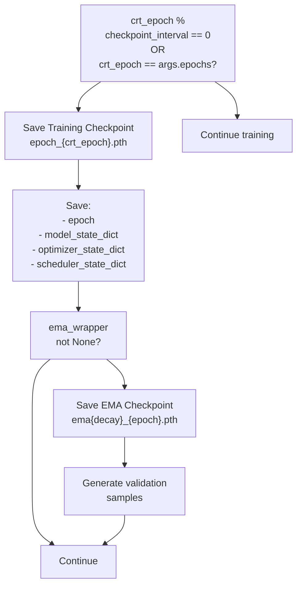

Checkpoint structure:

| Key | Content | Purpose |
| --- | --- | --- |
| `epoch` | Current epoch number | Resume training state |
| `model_state_dict` | Model parameters | Restore model weights |
| `optimizer_state_dict` | Optimizer state | Resume optimization |
| `scheduler_state_dict` | Scheduler state | Resume LR schedule |

**Sources:** [src/train.py L344-L358](https://github.com/Junjie-Zhu/IDPFold2/blob/5315b279/src/train.py#L344-L358)

### EMA Checkpoints

EMA checkpoints contain only the model state with shadow parameters:

```
ema_wrapper.apply_shadow()ema_path = os.path.join(logging_dir, f"checkpoints/_ema_{ema_wrapper.decay}_{crt_epoch}.pth")torch.save({    'model_state_dict': model.module.state_dict() if DIST_WRAPPER.world_size > 1 else model.state_dict(),}, ema_path)
```

The EMA checkpoint is specifically designed for inference and is loaded by `src/inference.py`.

**Sources:** [src/train.py L353-L358](https://github.com/Junjie-Zhu/IDPFold2/blob/5315b279/src/train.py#L353-L358)

### Loss Logging

Loss values are logged to CSV for tracking training progress:

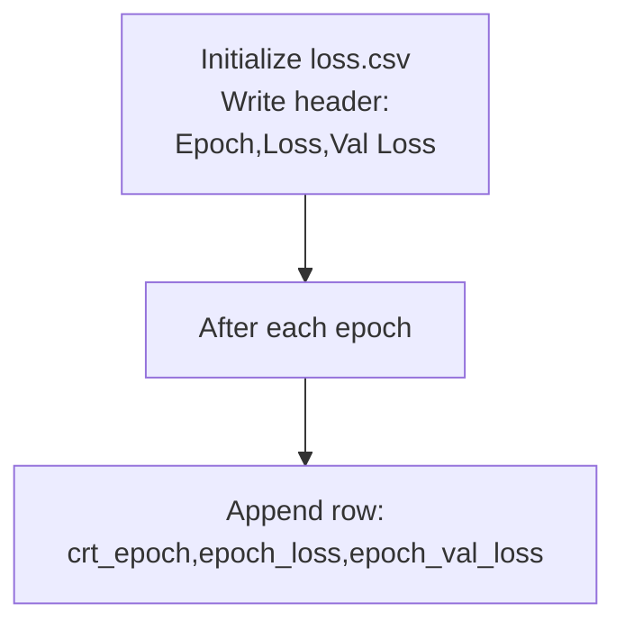

Progress bars show real-time metrics:

* **Training progress**: Shows step loss and loss components
* **Validation progress**: Shows validation loss and components
* **Epoch progress**: Shows average epoch loss and validation loss

**Sources:** [src/train.py L223-L342](https://github.com/Junjie-Zhu/IDPFold2/blob/5315b279/src/train.py#L223-L342)

### Validation Sampling

During checkpoint saving, the training script generates sample structures for visual validation:

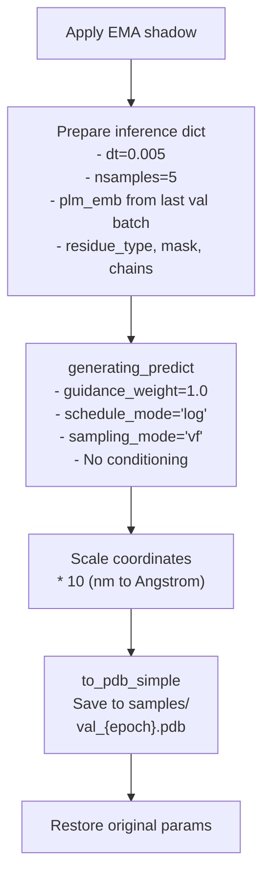

This generates 5 structures from the last validation batch, providing a visual check of model quality during training.

**Sources:** [src/train.py L360-L407](https://github.com/Junjie-Zhu/IDPFold2/blob/5315b279/src/train.py#L360-L407)

---

## Key Functions and Their Roles

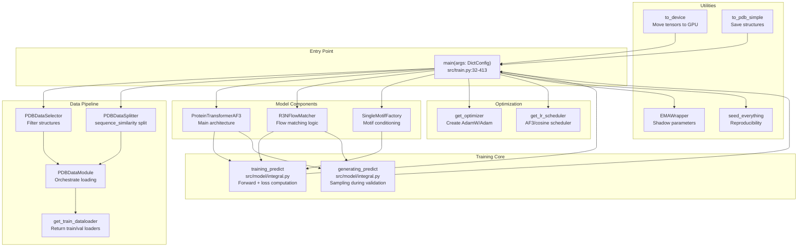

### Function Summary Table

| Function | Location | Purpose |
| --- | --- | --- |
| `main()` | [src/train.py L32-L413](https://github.com/Junjie-Zhu/IDPFold2/blob/5315b279/src/train.py#L32-L413) | Main training orchestration |
| `PDBDataSelector.__init__()` | [src/data/dataset.py](https://github.com/Junjie-Zhu/IDPFold2/blob/5315b279/src/data/dataset.py) | Filter structures by metadata |
| `PDBDataSplitter.__init__()` | [src/data/dataset.py](https://github.com/Junjie-Zhu/IDPFold2/blob/5315b279/src/data/dataset.py) | Create train/val splits |
| `PDBDataModule.setup()` | [src/data/dataset.py](https://github.com/Junjie-Zhu/IDPFold2/blob/5315b279/src/data/dataset.py) | Prepare datasets |
| `PDBDataModule.get_train_dataloader()` | [src/data/dataset.py](https://github.com/Junjie-Zhu/IDPFold2/blob/5315b279/src/data/dataset.py) | Return data loaders |
| `ProteinTransformerAF3.__init__()` | [src/model/protein_transformer.py](https://github.com/Junjie-Zhu/IDPFold2/blob/5315b279/src/model/protein_transformer.py) | Initialize model |
| `R3NFlowMatcher.__init__()` | [src/model/flow_matching/r3flow.py](https://github.com/Junjie-Zhu/IDPFold2/blob/5315b279/src/model/flow_matching/r3flow.py) | Initialize flow matcher |
| `training_predict()` | [src/model/integral.py](https://github.com/Junjie-Zhu/IDPFold2/blob/5315b279/src/model/integral.py) | Forward pass and loss |
| `generating_predict()` | [src/model/integral.py](https://github.com/Junjie-Zhu/IDPFold2/blob/5315b279/src/model/integral.py) | Sampling for inference |
| `get_optimizer()` | [src/model/optimizer.py](https://github.com/Junjie-Zhu/IDPFold2/blob/5315b279/src/model/optimizer.py) | Create optimizer |
| `get_lr_scheduler()` | [src/model/optimizer.py](https://github.com/Junjie-Zhu/IDPFold2/blob/5315b279/src/model/optimizer.py) | Create LR scheduler |
| `EMAWrapper.__init__()` | [src/model/ema.py](https://github.com/Junjie-Zhu/IDPFold2/blob/5315b279/src/model/ema.py) | Initialize EMA |
| `to_device()` | [src/train.py L416-L431](https://github.com/Junjie-Zhu/IDPFold2/blob/5315b279/src/train.py#L416-L431) | Move tensors to device |
| `seed_everything()` | [src/utils/ddp_utils.py](https://github.com/Junjie-Zhu/IDPFold2/blob/5315b279/src/utils/ddp_utils.py) | Set random seeds |
| `to_pdb_simple()` | [src/utils/pdb_utils.py](https://github.com/Junjie-Zhu/IDPFold2/blob/5315b279/src/utils/pdb_utils.py) | Save PDB files |

**Sources:** [src/train.py L1-L435](https://github.com/Junjie-Zhu/IDPFold2/blob/5315b279/src/train.py#L1-L435)