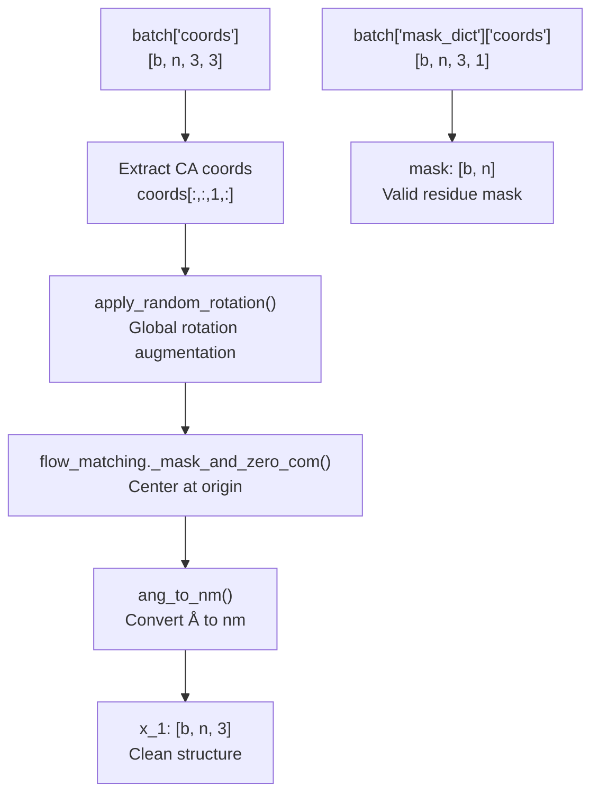
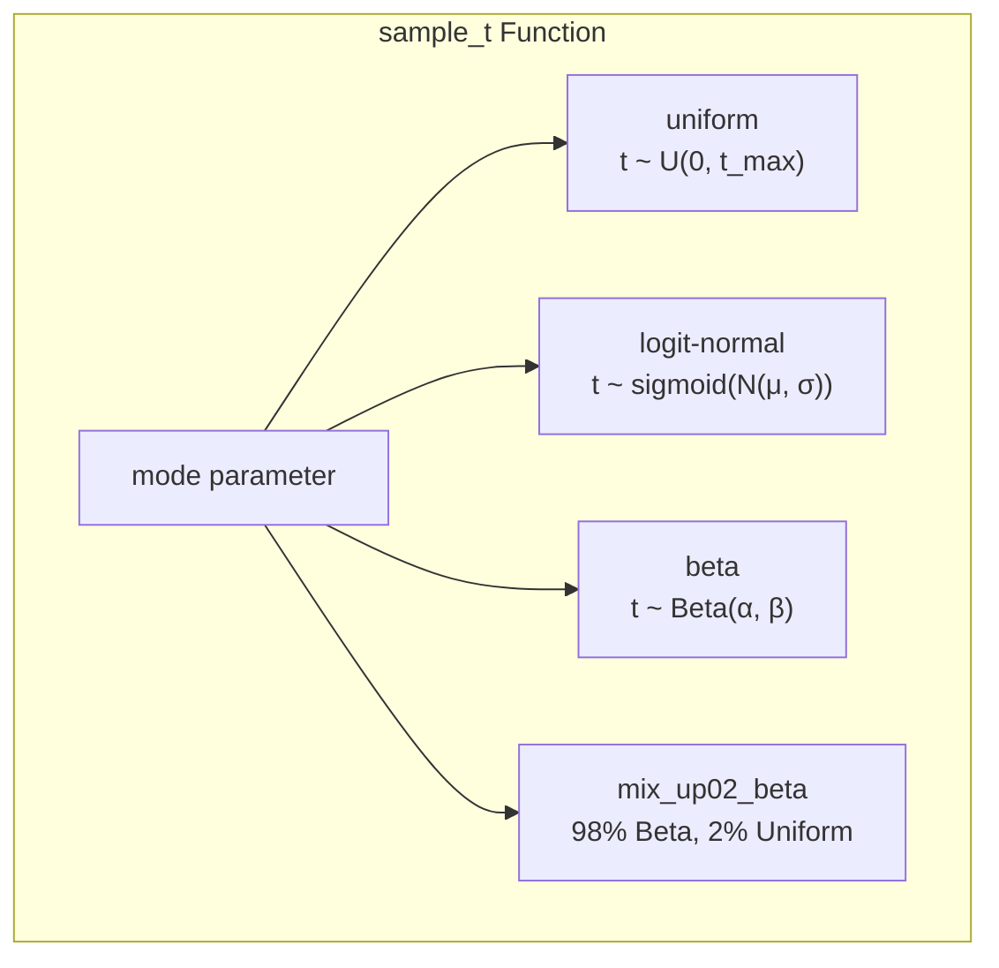
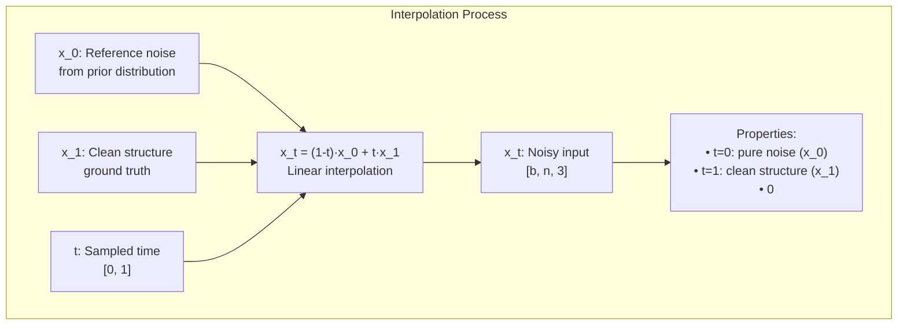
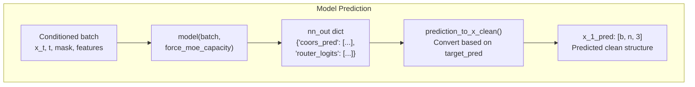
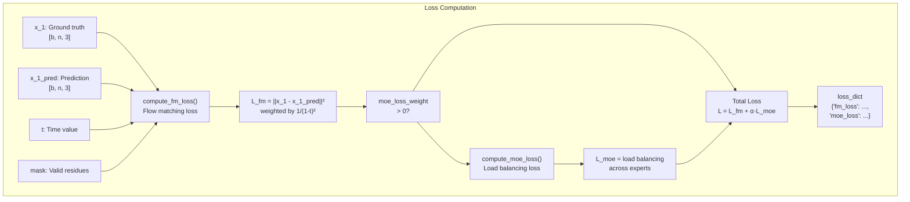
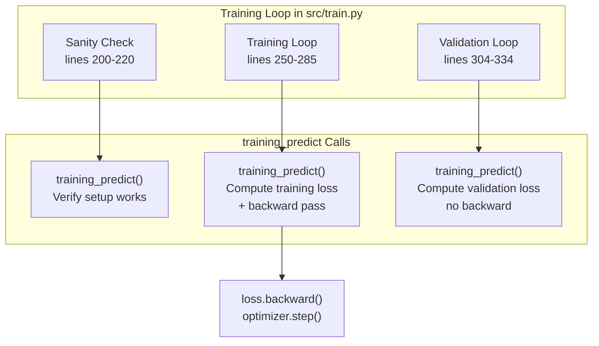

# Training Predict Function

> **Relevant source files**
> * [configs/train.yaml](https://github.com/Junjie-Zhu/IDPFold2/blob/5315b279/configs/train.yaml)
> * [src/model/components/feature_factory.py](https://github.com/Junjie-Zhu/IDPFold2/blob/5315b279/src/model/components/feature_factory.py)
> * [src/model/integral.py](https://github.com/Junjie-Zhu/IDPFold2/blob/5315b279/src/model/integral.py)
> * [src/train.py](https://github.com/Junjie-Zhu/IDPFold2/blob/5315b279/src/train.py)

## Purpose and Scope

This page documents the `training_predict` function, which is the core function that orchestrates a single training step in IDPFold2. It handles the complete forward pass during training, including time sampling, noise interpolation, conditioning application, model prediction, and loss computation.

For information about the overall training pipeline and loop structure, see [Training Pipeline](/Junjie-Zhu/IDPFold2/6.1-training-pipeline). For details on specific loss computations, see [Loss Functions](/Junjie-Zhu/IDPFold2/6.3-loss-functions). For conditioning strategies, see [Conditioning Strategies](/Junjie-Zhu/IDPFold2/6.6-conditioning-strategies). For the inference counterpart of this function, see [Generating Predict Function](/Junjie-Zhu/IDPFold2/7.2-generating-predict-function).

**Sources:** [src/model/integral.py L238-L320](https://github.com/Junjie-Zhu/IDPFold2/blob/5315b279/src/model/integral.py#L238-L320)

---

## Overview

The `training_predict` function implements the training-time forward pass for flow matching-based protein structure generation. It takes a batch of ground truth protein structures and performs the following operations:

1. Extract clean target structures (x₁) from the batch
2. Sample a time value t from a specified distribution
3. Sample reference noise structures (x₀) from a prior distribution
4. Interpolate between x₀ and x₁ to create noisy input x_t
5. Apply optional conditioning mechanisms (motif, MoE, self-conditioning)
6. Run the model to predict the clean structure
7. Compute flow matching loss and auxiliary losses
8. Return total loss and loss components

The function is called during both training and validation loops in [src/train.py L206-L322](https://github.com/Junjie-Zhu/IDPFold2/blob/5315b279/src/train.py#L206-L322)

**Sources:** [src/model/integral.py L238-L320](https://github.com/Junjie-Zhu/IDPFold2/blob/5315b279/src/model/integral.py#L238-L320)

 [src/train.py L206-L270](https://github.com/Junjie-Zhu/IDPFold2/blob/5315b279/src/train.py#L206-L270)

---

## Function Signature and Key Components

```mermaid
flowchart TD

INPUT["Input: batch, flow_matching,<br>model, factories, kwargs"]
EXTRACT["extract_clean_sample()<br>Get x_1, mask, batch_shape"]
SAMPLE_T["sample_t()<br>Sample time t"]
SAMPLE_X0["flow_matching.sample_reference()<br>Sample x_0 from prior"]
INTERP["flow_matching.interpolate()<br>x_t = (1-t)x_0 + tx_1"]
COND["Apply Conditioning<br>motif_factory, moe_factory"]
SC["Self-Conditioning<br>Optional x_sc"]
MODEL["model(batch)<br>Predict structure"]
CONVERT["prediction_to_x_clean()<br>Convert to x_1_pred"]
FM_LOSS["compute_fm_loss()<br>Flow matching loss"]
MOE_LOSS["compute_moe_loss()<br>Load balancing loss"]
OUTPUT["Output: total_loss, loss_dict"]

subgraph subGraph0 ["training_predict Function"]
    INPUT
    EXTRACT
    SAMPLE_T
    SAMPLE_X0
    INTERP
    COND
    SC
    MODEL
    CONVERT
    FM_LOSS
    MOE_LOSS
    OUTPUT
    INPUT --> EXTRACT
    EXTRACT --> SAMPLE_T
    EXTRACT --> SAMPLE_X0
    SAMPLE_T --> INTERP
    SAMPLE_X0 --> INTERP
    EXTRACT --> INTERP
    INTERP --> COND
    COND --> SC
    SC --> MODEL
    MODEL --> CONVERT
    CONVERT --> FM_LOSS
    MODEL --> MOE_LOSS
    FM_LOSS --> OUTPUT
    MOE_LOSS --> OUTPUT
end
```



**Diagram: Training Predict Function Flow**

The function accepts the following key parameters:

| Parameter | Type | Description |
| --- | --- | --- |
| `batch` | `dict` | Batch dictionary containing protein data |
| `flow_matching` | `R3NFlowMatcher` | Flow matching object for interpolation and sampling |
| `model` | `nn.Module` | ProteinTransformerAF3 model |
| `motif_factory` | `Optional[nn.Module]` | Factory for motif conditioning |
| `moe_factory` | `Optional[nn.Module]` | Factory for MoE conditioning |
| `noise_kwargs` | `dict` | Parameters for time sampling distribution |
| `target_pred` | `str` | Prediction target: `'x_1'` or `'v'` (velocity) |
| `motif_conditioning` | `bool` | Whether to apply motif conditioning |
| `moe_conditioning` | `bool` | Whether to apply MoE conditioning |
| `self_conditioning` | `bool` | Whether to apply self-conditioning |
| `moe_loss_weight` | `float` | Weight for MoE load balancing loss |
| `force_moe_capacity` | `bool` | Whether to enforce MoE capacity limits |

**Sources:** [src/model/integral.py L238-L251](https://github.com/Junjie-Zhu/IDPFold2/blob/5315b279/src/model/integral.py#L238-L251)

 [configs/train.yaml L1-L31](https://github.com/Junjie-Zhu/IDPFold2/blob/5315b279/configs/train.yaml#L1-L31)

---

## Input Preparation and Clean Sample Extraction

The first step extracts the clean ground truth structure (x₁) from the batch data:



**Diagram: Clean Sample Extraction Pipeline**

The `extract_clean_sample` function [src/model/integral.py L158-L171](https://github.com/Junjie-Zhu/IDPFold2/blob/5315b279/src/model/integral.py#L158-L171)

 performs:

1. **Coordinate Selection**: Extracts CA (C-alpha) atom coordinates from the full `coords` tensor, which contains backbone atoms [N, CA, C]
2. **Mask Extraction**: Obtains the boolean mask indicating valid (non-padded) residues
3. **Global Rotation**: Applies random rotation augmentation if enabled (default: True)
4. **Centering**: Centers the structure at the origin by zeroing the center of mass
5. **Unit Conversion**: Converts from Ångströms (Å) to nanometers (nm) using scale factor 10.0

The output x₁ is in nanometers with shape `[b, n, 3]` where `b` is batch size, `n` is number of residues, and `3` is spatial dimensions (x, y, z).

**Sources:** [src/model/integral.py L158-L171](https://github.com/Junjie-Zhu/IDPFold2/blob/5315b279/src/model/integral.py#L158-L171)

 [src/model/integral.py L13-L15](https://github.com/Junjie-Zhu/IDPFold2/blob/5315b279/src/model/integral.py#L13-L15)

---

## Time Sampling

The time variable t ∈ [0, 1] determines the interpolation between the reference noise x₀ and the clean structure x₁. IDPFold2 supports multiple sampling distributions:



**Diagram: Time Sampling Modes**

### Time Sampling Distributions

| Mode | Distribution | Parameters | Description |
| --- | --- | --- | --- |
| `uniform` | Uniform | `p2`: upper bound (t_max) | Simple uniform sampling in [0, t_max] |
| `logit-normal` | Logit-Normal | `p1`: mean, `p2`: std | Sigmoid of normal distribution, concentrates on mid-range |
| `beta` | Beta | `p1`: α, `p2`: β | Beta distribution, flexible shape control |
| `mix_up02_beta` | Mixture | `p1`: α, `p2`: β | 98% Beta + 2% Uniform, ensures full range coverage |

The default configuration in [configs/train.yaml L24-L27](https://github.com/Junjie-Zhu/IDPFold2/blob/5315b279/configs/train.yaml#L24-L27)

 uses:

```yaml
noise:  mode: mix_up02_beta  p1: 1.9  p2: 1.0
```

This mixed distribution ensures training exposure to all time values while concentrating on the Beta distribution for more stable training. The Beta(1.9, 1.0) distribution favors larger t values, focusing training on less noisy samples.

**Sources:** [src/model/integral.py L93-L118](https://github.com/Junjie-Zhu/IDPFold2/blob/5315b279/src/model/integral.py#L93-L118)

 [configs/train.yaml L24-L27](https://github.com/Junjie-Zhu/IDPFold2/blob/5315b279/configs/train.yaml#L24-L27)

---

## Interpolation and Noise Injection

Once time t is sampled, the function creates the noisy input x_t through linear interpolation:



**Diagram: Flow Matching Interpolation**

The interpolation is performed by `flow_matching.interpolate()` [src/model/flow_matching/r3flow.py](https://github.com/Junjie-Zhu/IDPFold2/blob/5315b279/src/model/flow_matching/r3flow.py)

 which implements:

**x_t = (1 - t) · x₀ + t · x₁**

where:

* **x₀**: Reference noise sampled from the prior (typically centered Gaussian)
* **x₁**: Clean ground truth structure (centered at origin)
* **t**: Interpolation time from [0, 1]
* **x_t**: Resulting noisy structure at time t

The reference noise x₀ is sampled by `flow_matching.sample_reference()` [src/model/integral.py L266-L268](https://github.com/Junjie-Zhu/IDPFold2/blob/5315b279/src/model/integral.py#L266-L268)

 which:

1. Samples from a centered Gaussian distribution
2. Applies the mask to zero out padded positions
3. Centers the result at the origin (zero center of mass)

This interpolation scheme ensures smooth transitions from noise to structure, enabling the flow matching training objective. The model learns to predict the clean structure x₁ (or the velocity vector v) from the noisy input x_t at any time t.

**Sources:** [src/model/integral.py L266-L278](https://github.com/Junjie-Zhu/IDPFold2/blob/5315b279/src/model/integral.py#L266-L278)

 [src/model/flow_matching/r3flow.py](https://github.com/Junjie-Zhu/IDPFold2/blob/5315b279/src/model/flow_matching/r3flow.py)

---

## Conditioning Mechanisms

Before model prediction, the function applies optional conditioning mechanisms that provide additional information or constraints:

```mermaid
flowchart TD

BATCH["batch with x_t, t, mask"]
MOTIF["motif_conditioning<br>enabled?"]
MOTIF_APPLY["motif_factory(batch)<br>Add x_1 partial structure"]
MOE_COND["moe_conditioning<br>enabled?"]
MOE_APPLY["moe_factory(batch)<br>Add MoE condition vector"]
SC["self_conditioning<br>enabled?"]
SC_CHECK["random() < 0.5"]
FINAL["Conditioned batch<br>ready for model"]
SC_PRED["model(batch)<br>Initial prediction"]
SC_CONVERT["prediction_to_x_clean()<br>Get x_sc"]
SC_ADD["batch['x_sc'] = x_sc<br>Add self-conditioning"]

subgraph subGraph0 ["Conditioning Pipeline"]
    BATCH
    MOTIF
    MOTIF_APPLY
    MOE_COND
    MOE_APPLY
    SC
    SC_CHECK
    FINAL
    SC_PRED
    SC_CONVERT
    SC_ADD
    BATCH --> MOTIF
    MOTIF --> MOTIF_APPLY
    MOTIF --> MOE_COND
    MOTIF_APPLY --> MOE_COND
    MOE_COND --> MOE_APPLY
    MOE_COND --> SC
    MOE_APPLY --> SC
    SC --> SC_CHECK
    SC --> FINAL
    SC_CHECK --> SC_PRED
    SC_CHECK --> FINAL
    SC_PRED --> SC_CONVERT
    SC_CONVERT --> SC_ADD
    SC_ADD --> FINAL
end
```



**Diagram: Conditioning Application Flow**

### Motif Conditioning

When `motif_conditioning=True` [src/model/integral.py L270-L272](https://github.com/Junjie-Zhu/IDPFold2/blob/5315b279/src/model/integral.py#L270-L272)

:

* `motif_factory` generates partial structure constraints
* Updates batch with `x_1` containing known structural motifs
* The model learns to maintain these structural elements during generation
* Useful for scaffold design or incorporating experimental constraints

### MoE Conditioning

When `moe_conditioning=True` [src/model/integral.py L274-L275](https://github.com/Junjie-Zhu/IDPFold2/blob/5315b279/src/model/integral.py#L274-L275)

:

* `moe_factory` provides conditional information to the Mixture of Experts layers
* Helps guide expert selection based on protein properties
* Currently configured with `dim_moe_cond=0` in default config (disabled)

### Self-Conditioning

When `self_conditioning=True` [src/model/integral.py L287-L289](https://github.com/Junjie-Zhu/IDPFold2/blob/5315b279/src/model/integral.py#L287-L289)

:

* With 50% probability, runs an initial forward pass
* Converts the prediction to x_sc (self-conditioning structure)
* Adds `x_sc` to the batch for the actual training forward pass
* Model learns to refine its own predictions, improving iterative generation

The default training configuration [configs/train.yaml L11-L13](https://github.com/Junjie-Zhu/IDPFold2/blob/5315b279/configs/train.yaml#L11-L13)

 has all conditioning disabled:

```yaml
motif_conditioning: Falsemoe_conditioning: Falseself_conditioning: False
```

**Sources:** [src/model/integral.py L270-L289](https://github.com/Junjie-Zhu/IDPFold2/blob/5315b279/src/model/integral.py#L270-L289)

 [configs/train.yaml L11-L13](https://github.com/Junjie-Zhu/IDPFold2/blob/5315b279/configs/train.yaml#L11-L13)

 [src/model/components/motif_factory.py](https://github.com/Junjie-Zhu/IDPFold2/blob/5315b279/src/model/components/motif_factory.py)

---

## Model Prediction and Target Conversion

After preparing the conditioned batch, the model performs the forward pass:



**Diagram: Model Forward Pass**

### Prediction Target Parameterization

The model output is converted to the predicted clean structure x₁_pred using `prediction_to_x_clean()` [src/model/integral.py L25-L38](https://github.com/Junjie-Zhu/IDPFold2/blob/5315b279/src/model/integral.py#L25-L38)

 which supports two parameterizations:

| Target | Formula | Description |
| --- | --- | --- |
| `x_1` | x₁_pred = nn_pred | Directly predict the clean structure |
| `v` (velocity) | x₁_pred = x_t + (1-t)·nn_pred | Predict the velocity/direction field |

The velocity parameterization is the default [configs/train.yaml L5](https://github.com/Junjie-Zhu/IDPFold2/blob/5315b279/configs/train.yaml#L5-L5)

:

```yaml
target_pred: v
```

This parameterization predicts the vector field v that points from x_t toward x₁, defined as:

**v = dx/dt = (x₁ - x_t) / (1 - t)**

The model prediction nn_pred represents this velocity, so the clean structure is recovered as:

**x₁_pred = x_t + (1 - t) · v**

The velocity parameterization is generally more stable for flow matching as it avoids direct prediction at t=1 (which would require infinite precision).

### Force MoE Capacity

The `force_moe_capacity` parameter [src/model/integral.py L292](https://github.com/Junjie-Zhu/IDPFold2/blob/5315b279/src/model/integral.py#L292-L292)

 controls whether Mixture of Experts layers enforce capacity limits:

* **True** (default for training): Limits tokens per expert, may drop some tokens
* **False** (used during validation and inference): All tokens are processed

**Sources:** [src/model/integral.py L25-L293](https://github.com/Junjie-Zhu/IDPFold2/blob/5315b279/src/model/integral.py#L25-L293)

 [configs/train.yaml L5](https://github.com/Junjie-Zhu/IDPFold2/blob/5315b279/configs/train.yaml#L5-L5)

---

## Loss Computation

The training objective combines two loss terms:



**Diagram: Loss Computation Pipeline**

### Flow Matching Loss

The primary training objective is the flow matching loss [src/model/integral.py L174-L200](https://github.com/Junjie-Zhu/IDPFold2/blob/5315b279/src/model/integral.py#L174-L200)

:

**L_fm = (1 / n_res) · Σᵢ ||x₁ᵢ - x₁_predᵢ||² · w(t)**

where:

* **n_res**: Number of valid (non-padded) residues × 3 (coordinates)
* **w(t) = 1 / ((1-t)² + ε)**: Time-dependent weighting factor
* **ε = 1e-5**: Small constant for numerical stability

The weighting factor w(t) increases loss weight for samples near t=1 (less noisy), encouraging the model to be more accurate when the input is cleaner. This is critical because:

* At t→1, the prediction should exactly match the ground truth
* At t→0, predictions can be less precise as the input is pure noise
* The 1/(1-t)² weighting provides proper gradient scaling

### MoE Load Balancing Loss

When using Mixture of Experts with `moe_loss_weight > 0` [src/model/integral.py L298-L314](https://github.com/Junjie-Zhu/IDPFold2/blob/5315b279/src/model/integral.py#L298-L314)

:

**L_moe = load_balancing_loss(router_logits, num_experts, top_k)**

This auxiliary loss encourages balanced token distribution across experts:

* Prevents expert collapse (all tokens routed to few experts)
* Computed from router logit statistics across all layers
* Default weight: `moe_loss_weight = 0.3` [configs/train.yaml L30](https://github.com/Junjie-Zhu/IDPFold2/blob/5315b279/configs/train.yaml#L30-L30)

The total loss is:

**L_total = L_fm + α · L_moe**

where α is the `moe_loss_weight` hyperparameter.

**Sources:** [src/model/integral.py L174-L320](https://github.com/Junjie-Zhu/IDPFold2/blob/5315b279/src/model/integral.py#L174-L320)

 [configs/train.yaml L29-L30](https://github.com/Junjie-Zhu/IDPFold2/blob/5315b279/configs/train.yaml#L29-L30)

---

## Training Loop Integration

The `training_predict` function is called in three contexts within the training loop:



**Diagram: Training Loop Integration Points**

### 1. Sanity Check src/train.py200-220

Before training begins, runs 2-3 validation batches through `training_predict` to:

* Verify the model and data pipeline are correctly configured
* Catch any shape mismatches or device errors early
* Warm up CUDA kernels

### 2. Training Loop src/train.py250-285

For each training batch:

* EMA weights are updated before forward pass
* `training_predict` computes loss and loss_dict
* Gradients are computed via `loss.backward()`
* Optimizer updates parameters
* Learning rate scheduler steps
* Progress bar displays step loss

### 3. Validation Loop src/train.py304-334

For each validation batch:

* EMA shadow weights are applied to model
* `training_predict` computes validation loss (no gradients)
* `force_moe_capacity=False` to avoid dropping tokens
* EMA weights are restored after validation
* Progress bar displays validation loss

The function returns `(loss, loss_dict)` where loss is a scalar tensor for backpropagation and loss_dict contains individual loss components for logging.

**Sources:** [src/train.py L200-L334](https://github.com/Junjie-Zhu/IDPFold2/blob/5315b279/src/train.py#L200-L334)

---

## Configuration Parameters

Key parameters controlling `training_predict` behavior:

| Parameter | Config Path | Default | Description |
| --- | --- | --- | --- |
| `target_pred` | `train.yaml:5` | `v` | Prediction target: `'x_1'` or `'v'` (velocity) |
| `motif_conditioning` | `train.yaml:11` | `False` | Enable motif conditioning |
| `moe_conditioning` | `train.yaml:12` | `False` | Enable MoE conditioning |
| `self_conditioning` | `train.yaml:13` | `False` | Enable self-conditioning |
| `noise.mode` | `train.yaml:25` | `mix_up02_beta` | Time sampling distribution |
| `noise.p1` | `train.yaml:26` | `1.9` | Distribution parameter 1 |
| `noise.p2` | `train.yaml:27` | `1.0` | Distribution parameter 2 |
| `loss.moe_loss_weight` | `train.yaml:30` | `0.3` | MoE load balancing loss weight |

### Noise Configuration Examples

```markdown
# Uniform sampling (simple baseline)noise:  mode: uniform  p2: 1.0  # t ~ U(0, 1.0) # Beta distribution (flexible)noise:  mode: beta  p1: 2.0  # alpha  p2: 2.0  # beta (symmetric around 0.5) # Mixed distribution (default, most stable)noise:  mode: mix_up02_beta  p1: 1.9  # Beta alpha (favors larger t)  p2: 1.0  # Beta beta
```

**Sources:** [configs/train.yaml L5-L30](https://github.com/Junjie-Zhu/IDPFold2/blob/5315b279/configs/train.yaml#L5-L30)

 [src/model/integral.py L238-L251](https://github.com/Junjie-Zhu/IDPFold2/blob/5315b279/src/model/integral.py#L238-L251)

---

## Key Differences from Inference

The `training_predict` function differs from its inference counterpart `generating_predict` [src/model/integral.py L323-L401](https://github.com/Junjie-Zhu/IDPFold2/blob/5315b279/src/model/integral.py#L323-L401)

 in several ways:

| Aspect | Training Predict | Generating Predict |
| --- | --- | --- |
| Purpose | Single forward pass for loss | Iterative sampling from noise |
| Time sampling | Random from distribution | Sequential from schedule |
| Ground truth | Uses x₁ from batch | No ground truth available |
| Interpolation | Single x_t = (1-t)x₀ + tx₁ | Iterative ODE/SDE integration |
| Conditioning | Applied before prediction | Applied at each sampling step |
| Output | Loss values | Generated structures |
| Guidance | Not applicable | Classifier-free, auto-guidance |
| Gradients | Computed for backprop | Not computed (eval mode) |

For details on the sampling process during inference, see [Generating Predict Function](/Junjie-Zhu/IDPFold2/7.2-generating-predict-function).

**Sources:** [src/model/integral.py L238-L401](https://github.com/Junjie-Zhu/IDPFold2/blob/5315b279/src/model/integral.py#L238-L401)