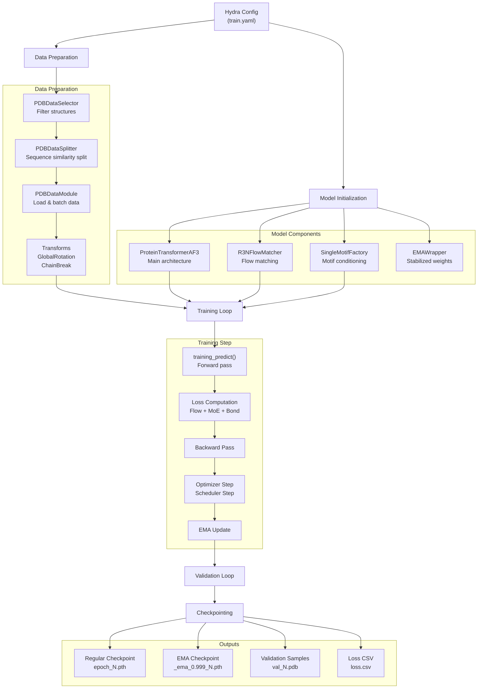
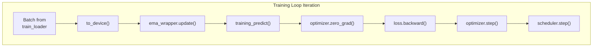
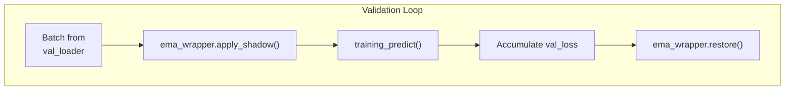
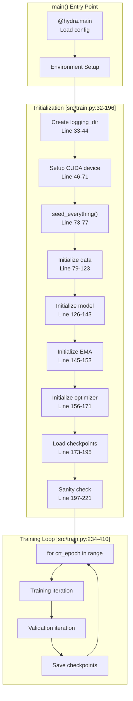
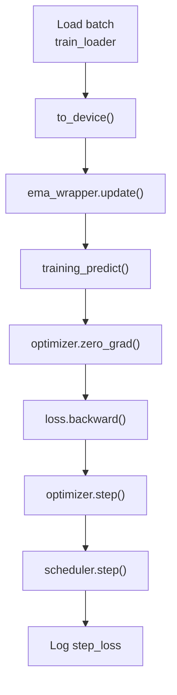
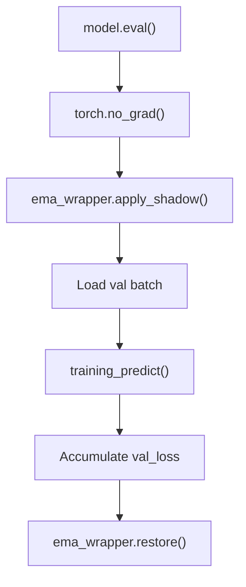
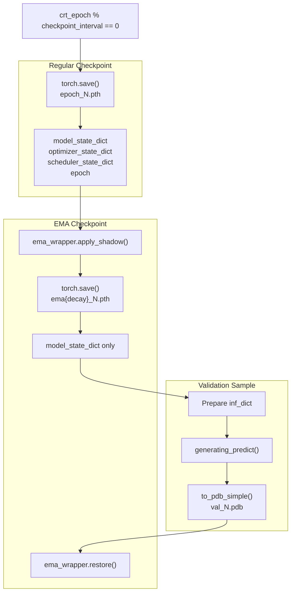

# Training

> **Relevant source files**
> * [README.md](https://github.com/Junjie-Zhu/IDPFold2/blob/5315b279/README.md?plain=1)
> * [configs/train.yaml](https://github.com/Junjie-Zhu/IDPFold2/blob/5315b279/configs/train.yaml)
> * [src/train.py](https://github.com/Junjie-Zhu/IDPFold2/blob/5315b279/src/train.py)

This page provides a complete overview of the training system for IDPFold2 models. It covers the training workflow, key components, configuration structure, and how to run training from scratch or fine-tune existing models.

For detailed information about specific training subsystems, see:

* Training loop mechanics: [Training Pipeline](/Junjie-Zhu/IDPFold2/6.1-training-pipeline)
* Forward pass implementation: [Training Predict Function](/Junjie-Zhu/IDPFold2/6.2-training-predict-function)
* Loss computation: [Loss Functions](/Junjie-Zhu/IDPFold2/6.3-loss-functions)
* Optimizer and learning rate schedules: [Optimization and Scheduling](/Junjie-Zhu/IDPFold2/6.4-optimization-and-scheduling)
* Multi-GPU training: [Distributed Training](/Junjie-Zhu/IDPFold2/6.5-distributed-training)
* Conditioning techniques: [Conditioning Strategies](/Junjie-Zhu/IDPFold2/6.6-conditioning-strategies)

For inference using trained models, see [Inference](/Junjie-Zhu/IDPFold2/7-inference).

---

## Training System Overview

The IDPFold2 training system implements a flow matching-based generative model for protein conformational ensemble prediction. Training uses a hybrid dataset combining PDB structures, mdCATH, IDRome-o, and AF-CALVADOS data. The system supports distributed training, exponential moving average (EMA) weight tracking, mixture-of-experts (MoE) architecture, and multiple conditioning strategies.

### High-Level Training Workflow



**Sources:** [src/train.py L32-L410](https://github.com/Junjie-Zhu/IDPFold2/blob/5315b279/src/train.py#L32-L410)

 [configs/train.yaml L1-L123](https://github.com/Junjie-Zhu/IDPFold2/blob/5315b279/configs/train.yaml#L1-L123)

---

## Key Training Components

### Data Pipeline Components

| Component | Class/Function | Purpose |
| --- | --- | --- |
| Data Filtering | `PDBDataSelector` | Filters structures by resolution, length, oligomeric state |
| Data Splitting | `PDBDataSplitter` | Creates train/val splits using sequence similarity clustering |
| Data Loading | `PDBDataModule` | Manages datasets, dataloaders, and batching |
| Transforms | `GlobalRotationTransform`, `ChainBreakPerResidueTransform` | Data augmentation and feature extraction |

The data pipeline is configured in [src/train.py L79-L123](https://github.com/Junjie-Zhu/IDPFold2/blob/5315b279/src/train.py#L79-L123)

 For detailed information, see [Data Pipeline](/Junjie-Zhu/IDPFold2/4-data-pipeline).

**Sources:** [src/train.py L15-L16](https://github.com/Junjie-Zhu/IDPFold2/blob/5315b279/src/train.py#L15-L16)

 [src/train.py L79-L123](https://github.com/Junjie-Zhu/IDPFold2/blob/5315b279/src/train.py#L79-L123)

### Model Architecture Components

| Component | Class/Function | Location | Purpose |
| --- | --- | --- | --- |
| Main Model | `ProteinTransformerAF3` | [src/model/protein_transformer.py](https://github.com/Junjie-Zhu/IDPFold2/blob/5315b279/src/model/protein_transformer.py) | Transformer architecture with MoE |
| Flow Matching | `R3NFlowMatcher` | [src/model/flow_matching/r3flow.py](https://github.com/Junjie-Zhu/IDPFold2/blob/5315b279/src/model/flow_matching/r3flow.py) | Generates flow interpolations and predictions |
| Training Forward | `training_predict()` | [src/model/integral.py](https://github.com/Junjie-Zhu/IDPFold2/blob/5315b279/src/model/integral.py) | Executes training forward pass with conditioning |
| EMA Tracking | `EMAWrapper` | [src/model/ema.py](https://github.com/Junjie-Zhu/IDPFold2/blob/5315b279/src/model/ema.py) | Maintains exponential moving average weights |
| Motif Factory | `SingleMotifFactory` | [src/model/components/motif_factory.py](https://github.com/Junjie-Zhu/IDPFold2/blob/5315b279/src/model/components/motif_factory.py) | Handles motif conditioning |

**Sources:** [src/train.py L18-L21](https://github.com/Junjie-Zhu/IDPFold2/blob/5315b279/src/train.py#L18-L21)

 [src/train.py L126-L153](https://github.com/Junjie-Zhu/IDPFold2/blob/5315b279/src/train.py#L126-L153)

### Training Loop Components



The training loop iterates over batches, performs forward passes with `training_predict()`, computes losses, and updates model parameters. EMA weights are updated before each forward pass.

**Sources:** [src/train.py L234-L285](https://github.com/Junjie-Zhu/IDPFold2/blob/5315b279/src/train.py#L234-L285)

### Validation Loop Components



Validation runs with EMA weights applied via `ema_wrapper.apply_shadow()` and restored after validation completes. The model is in `eval()` mode with `torch.no_grad()`.

**Sources:** [src/train.py L287-L334](https://github.com/Junjie-Zhu/IDPFold2/blob/5315b279/src/train.py#L287-L334)

---

## Configuration Structure

Training is configured using Hydra with the configuration file at [configs/train.yaml](https://github.com/Junjie-Zhu/IDPFold2/blob/5315b279/configs/train.yaml)

 The configuration is organized into several groups:

### Top-Level Configuration

| Parameter | Default | Description |
| --- | --- | --- |
| `task_prefix` | `"HYBRID_TRAIN"` | Prefix for logging directory |
| `batch_size` | `8` | Batch size per device |
| `epochs` | `500` | Total training epochs |
| `target_pred` | `"v"` | Prediction target (velocity field) |
| `checkpoint_interval` | `2` | Save checkpoint every N epochs |
| `seed` | `42` | Random seed |
| `logging_dir` | `"./logs"` | Directory for logs and checkpoints |

**Sources:** [configs/train.yaml L1-L9](https://github.com/Junjie-Zhu/IDPFold2/blob/5315b279/configs/train.yaml#L1-L9)

### Conditioning Configuration

| Parameter | Default | Description |
| --- | --- | --- |
| `motif_conditioning` | `False` | Enable motif conditioning |
| `moe_conditioning` | `False` | Enable MoE conditioning |
| `self_conditioning` | `False` | Enable self-conditioning |
| `motif_prob` | N/A | Probability of applying motif conditioning |

These control which conditioning strategies are active during training. See [Conditioning Strategies](/Junjie-Zhu/IDPFold2/6.6-conditioning-strategies) for details.

**Sources:** [configs/train.yaml L11-L13](https://github.com/Junjie-Zhu/IDPFold2/blob/5315b279/configs/train.yaml#L11-L13)

### Resume Configuration

| Parameter | Default | Description |
| --- | --- | --- |
| `resume.ckpt_dir` | `null` | Path to checkpoint for resuming |
| `resume.ema_dir` | `null` | Path to EMA checkpoint |
| `resume.load_model_only` | `True` | If `True`, only load model weights, not optimizer/scheduler |

**Sources:** [configs/train.yaml L15-L18](https://github.com/Junjie-Zhu/IDPFold2/blob/5315b279/configs/train.yaml#L15-L18)

### EMA Configuration

| Parameter | Default | Description |
| --- | --- | --- |
| `ema.decay` | `0.999` | EMA decay rate (0 disables EMA) |
| `ema.mutable_param_keywords` | `[""]` | Keywords for parameters excluded from EMA |

**Sources:** [configs/train.yaml L20-L22](https://github.com/Junjie-Zhu/IDPFold2/blob/5315b279/configs/train.yaml#L20-L22)

### Noise Configuration

| Parameter | Default | Description |
| --- | --- | --- |
| `noise.mode` | `"mix_up02_beta"` | Noise sampling mode |
| `noise.p1` | `1.9` | Beta distribution parameter 1 |
| `noise.p2` | `1.0` | Beta distribution parameter 2 |

Controls time sampling distribution during training. See [Training Predict Function](/Junjie-Zhu/IDPFold2/6.2-training-predict-function) for details.

**Sources:** [configs/train.yaml L24-L27](https://github.com/Junjie-Zhu/IDPFold2/blob/5315b279/configs/train.yaml#L24-L27)

### Loss Configuration

| Parameter | Default | Description |
| --- | --- | --- |
| `loss.moe_loss_weight` | `0.3` | Weight for MoE load balancing loss |

**Sources:** [configs/train.yaml L29-L30](https://github.com/Junjie-Zhu/IDPFold2/blob/5315b279/configs/train.yaml#L29-L30)

### Data Configuration

Key data configuration parameters:

| Parameter | Default | Description |
| --- | --- | --- |
| `data.data_dir` | `"./data/hybrid_train/"` | Root directory containing training data |
| `data.plm_emb_dir` | Path to PLM embeddings | Directory with pre-computed ESM embeddings |
| `data.complex_dir` | Path to CSV | CSV file with inter-chain contacts |
| `data.complex_prop` | `0.8` | Proportion of multimer data in batches |
| `data.crop_size` | `256` | Maximum residues per crop |
| `data.batch_padding` | `True` | Enable dense padding for batches |
| `data.sampling_mode` | `"cluster-random"` | Sampling strategy |
| `data.max_length` | `256` | Maximum protein length |
| `data.split_sequence_similarity` | `0.9` | Sequence similarity threshold for clustering |
| `data.train_val_prop` | `[0.99, 0.01]` | Train/validation split proportions |

**Sources:** [configs/train.yaml L32-L56](https://github.com/Junjie-Zhu/IDPFold2/blob/5315b279/configs/train.yaml#L32-L56)

### Model Configuration

Key model architecture parameters:

| Parameter | Default | Description |
| --- | --- | --- |
| `model.training` | `True` | Training mode flag |
| `model.token_dim` | `768` | Token dimension |
| `model.nlayers` | `10` | Number of transformer layers |
| `model.nheads` | `12` | Number of attention heads |
| `model.use_moe` | `True` | Enable Mixture of Experts |
| `model.n_experts` | `5` | Number of experts |
| `model.n_activated_experts` | `2` | Active experts per token |
| `model.capacity_factor` | `1.3` | MoE capacity factor |

For complete model configuration, see [configs/train.yaml L58-L102](https://github.com/Junjie-Zhu/IDPFold2/blob/5315b279/configs/train.yaml#L58-L102)

**Sources:** [configs/train.yaml L58-L102](https://github.com/Junjie-Zhu/IDPFold2/blob/5315b279/configs/train.yaml#L58-L102)

### Optimizer Configuration

| Parameter | Default | Description |
| --- | --- | --- |
| `optimizer.lr` | `0.0001` | Base learning rate |
| `optimizer.weight_decay` | `0.0` | Weight decay coefficient |
| `optimizer.use_adamw` | `False` | Use AdamW (vs Adam) |
| `optimizer.lr_scheduler` | `"af3"` | Scheduler type (`"af3"` or `"cosine"`) |
| `optimizer.warmup_steps` | `4000` | Warmup steps for learning rate |
| `optimizer.decay_every_n_steps` | `80000` | Steps between decay (AF3 scheduler) |
| `optimizer.decay_factor` | `0.98` | Decay factor (AF3 scheduler) |

**Sources:** [configs/train.yaml L103-L112](https://github.com/Junjie-Zhu/IDPFold2/blob/5315b279/configs/train.yaml#L103-L112)

---

## Training Execution Flow

### Code-to-Component Mapping



**Sources:** [src/train.py L31-L435](https://github.com/Junjie-Zhu/IDPFold2/blob/5315b279/src/train.py#L31-L435)

### Initialization Phase

The initialization phase sets up the training environment:

1. **Logging Directory Setup** [src/train.py L33-L44](https://github.com/Junjie-Zhu/IDPFold2/blob/5315b279/src/train.py#L33-L44) : Creates timestamped directory structure: ``` logs/ └── {task_prefix}_{timestamp}/     ├── config.yaml     ├── loss.csv     ├── checkpoints/     └── samples/ ```
2. **Device Setup** [src/train.py L46-L71](https://github.com/Junjie-Zhu/IDPFold2/blob/5315b279/src/train.py#L46-L71) : Configures CUDA devices and distributed training with `DIST_WRAPPER`
3. **Random Seed** [src/train.py L73-L77](https://github.com/Junjie-Zhu/IDPFold2/blob/5315b279/src/train.py#L73-L77) : Sets reproducible random seed across all processes
4. **Data Initialization** [src/train.py L79-L123](https://github.com/Junjie-Zhu/IDPFold2/blob/5315b279/src/train.py#L79-L123) : Instantiates `PDBDataSelector`, `PDBDataSplitter`, and `PDBDataModule`
5. **Model Initialization** [src/train.py L126-L143](https://github.com/Junjie-Zhu/IDPFold2/blob/5315b279/src/train.py#L126-L143) : Creates `ProteinTransformerAF3`, `R3NFlowMatcher`, and wraps with DDP if multi-GPU
6. **EMA Initialization** [src/train.py L145-L153](https://github.com/Junjie-Zhu/IDPFold2/blob/5315b279/src/train.py#L145-L153) : Creates `EMAWrapper` if `ema.decay > 0`
7. **Optimizer/Scheduler** [src/train.py L156-L171](https://github.com/Junjie-Zhu/IDPFold2/blob/5315b279/src/train.py#L156-L171) : Initializes optimizer and learning rate scheduler
8. **Resume from Checkpoint** [src/train.py L173-L195](https://github.com/Junjie-Zhu/IDPFold2/blob/5315b279/src/train.py#L173-L195) : Loads model, optimizer, and scheduler states if resuming
9. **Sanity Check** [src/train.py L197-L221](https://github.com/Junjie-Zhu/IDPFold2/blob/5315b279/src/train.py#L197-L221) : Validates setup with a few validation batches

**Sources:** [src/train.py L32-L221](https://github.com/Junjie-Zhu/IDPFold2/blob/5315b279/src/train.py#L32-L221)

### Training Iteration

Each training iteration performs:



Key operations in [src/train.py L250-L283](https://github.com/Junjie-Zhu/IDPFold2/blob/5315b279/src/train.py#L250-L283)

:

1. Load batch from `train_loader`
2. Move to device with `to_device()` [src/train.py L416-L431](https://github.com/Junjie-Zhu/IDPFold2/blob/5315b279/src/train.py#L416-L431)
3. Update EMA weights with `ema_wrapper.update()` [src/train.py L254-L255](https://github.com/Junjie-Zhu/IDPFold2/blob/5315b279/src/train.py#L254-L255)
4. Forward pass with `training_predict()` [src/train.py L258-L270](https://github.com/Junjie-Zhu/IDPFold2/blob/5315b279/src/train.py#L258-L270)
5. Backpropagation and optimizer step [src/train.py L272-L275](https://github.com/Junjie-Zhu/IDPFold2/blob/5315b279/src/train.py#L272-L275)
6. Update learning rate with `scheduler.step()` [src/train.py L275](https://github.com/Junjie-Zhu/IDPFold2/blob/5315b279/src/train.py#L275-L275)

**Sources:** [src/train.py L234-L285](https://github.com/Junjie-Zhu/IDPFold2/blob/5315b279/src/train.py#L234-L285)

### Validation Iteration

Validation runs after each epoch:



Key differences from training:

* Model in `eval()` mode [src/train.py L288](https://github.com/Junjie-Zhu/IDPFold2/blob/5315b279/src/train.py#L288-L288)
* `torch.no_grad()` context [src/train.py L289](https://github.com/Junjie-Zhu/IDPFold2/blob/5315b279/src/train.py#L289-L289)
* EMA weights applied via `ema_wrapper.apply_shadow()` [src/train.py L301-L302](https://github.com/Junjie-Zhu/IDPFold2/blob/5315b279/src/train.py#L301-L302)
* `force_moe_capacity=False` to disable capacity limits [src/train.py L321](https://github.com/Junjie-Zhu/IDPFold2/blob/5315b279/src/train.py#L321-L321)
* Weights restored with `ema_wrapper.restore()` [src/train.py L331-L332](https://github.com/Junjie-Zhu/IDPFold2/blob/5315b279/src/train.py#L331-L332)

**Sources:** [src/train.py L287-L334](https://github.com/Junjie-Zhu/IDPFold2/blob/5315b279/src/train.py#L287-L334)

### Checkpointing Phase

Checkpoints are saved at intervals defined by `checkpoint_interval`:



Checkpoint operations in [src/train.py L345-L408](https://github.com/Junjie-Zhu/IDPFold2/blob/5315b279/src/train.py#L345-L408)

:

1. **Regular Checkpoint** [src/train.py L346-L352](https://github.com/Junjie-Zhu/IDPFold2/blob/5315b279/src/train.py#L346-L352) : Saves complete training state including model, optimizer, scheduler, and epoch
2. **EMA Checkpoint** [src/train.py L353-L359](https://github.com/Junjie-Zhu/IDPFold2/blob/5315b279/src/train.py#L353-L359) : Saves model with EMA weights applied, used for inference
3. **Validation Sample** [src/train.py L361-L405](https://github.com/Junjie-Zhu/IDPFold2/blob/5315b279/src/train.py#L361-L405) : Generates sample structures using `generating_predict()` with EMA weights
4. **Loss Logging** [src/train.py L341-L342](https://github.com/Junjie-Zhu/IDPFold2/blob/5315b279/src/train.py#L341-L342) : Appends epoch losses to CSV file

**Sources:** [src/train.py L345-L410](https://github.com/Junjie-Zhu/IDPFold2/blob/5315b279/src/train.py#L345-L410)

---

## Running Training

### Basic Training Command

To train from scratch:

```
python src/train.py \    task_prefix=HYBRID_TRAIN \    batch_size=8 \    epochs=500 \    data.data_dir=/path/to/dataset \    data.plm_emb_dir=/path/to/embeddings
```

**Sources:** [README.md L164-L171](https://github.com/Junjie-Zhu/IDPFold2/blob/5315b279/README.md?plain=1#L164-L171)

### Distributed Training

Multi-GPU training uses `torchrun`:

```
torchrun --nproc-per-node=4 src/train.py \    task_prefix=HYBRID_TRAIN \    batch_size=8 \    epochs=500
```

**Important:** Training across multiple machines is not supported due to MoE load balancing requirements.

**Sources:** [README.md L183](https://github.com/Junjie-Zhu/IDPFold2/blob/5315b279/README.md?plain=1#L183-L183)

### Fine-Tuning from Checkpoint

To fine-tune from a pretrained model:

```
python src/train.py \    task_prefix=FINETUNE \    resume.ckpt_dir=/path/to/IDPFold2_260114.pth \    resume.ema_dir=/path/to/IDPFold2_ema_0.999_260114.pth \    resume.load_model_only=False \    batch_size=8 \    epochs=100
```

Note: Both regular checkpoint (`.pth`) and EMA checkpoint (`_ema_*.pth`) are required for resuming with optimizer state.

**Sources:** [README.md L197-L206](https://github.com/Junjie-Zhu/IDPFold2/blob/5315b279/README.md?plain=1#L197-L206)

 [src/train.py L173-L195](https://github.com/Junjie-Zhu/IDPFold2/blob/5315b279/src/train.py#L173-L195)

### Training with Multimer Data

To include multimer assemblies:

```
python src/train.py \    task_prefix=HYBRID_TRAIN \    data.complex_dir=/path/to/contacts.csv \    data.complex_prop=0.8
```

The `complex_dir` should point to a CSV containing inter-chain contact information. Multimers are assembled on-the-fly during training with probability `complex_prop`.

**Sources:** [README.md L187-L194](https://github.com/Junjie-Zhu/IDPFold2/blob/5315b279/README.md?plain=1#L187-L194)

---

## Data Requirements

### Directory Structure

The training data directory must contain:

```markdown
data_dir/
├── raw/                          # Raw structure files (.pdb, .cif)
├── processed/                    # Processed .pkl files (auto-generated)
├── {data_dir}.csv               # Metadata (auto-generated)
├── seq_{data_dir}.csv           # Sequences for clustering (auto-generated)
└── cluster_seqid_{similarity}_{data_dir}.tsv  # Cluster assignments (auto-generated)
```

**Sources:** [README.md L175-L181](https://github.com/Junjie-Zhu/IDPFold2/blob/5315b279/README.md?plain=1#L175-L181)

### PLM Embeddings

Pre-computed ESM2 embeddings are required for training. Generate them using:

```
python scripts/get_esm_embedding.py \    --input_dir /path/to/data_dir \    --output_dir /path/to/plm_emb_dir
```

The embedding directory should contain `.pt` files matching structure IDs.

**Sources:** [README.md L181](https://github.com/Junjie-Zhu/IDPFold2/blob/5315b279/README.md?plain=1#L181-L181)

### Data Processing Options

Two data preprocessing workflows are supported:

1. **PDB Data Download** [src/train.py L79-L95](https://github.com/Junjie-Zhu/IDPFold2/blob/5315b279/src/train.py#L79-L95) : Use `PDBDataSelector` to automatically download and filter PDB structures (commented out by default)
2. **Custom Data** [README.md L156-L161](https://github.com/Junjie-Zhu/IDPFold2/blob/5315b279/README.md?plain=1#L156-L161) : Place your own structures in `raw/` directory and run training directly

The hybrid dataset combines multiple sources and requires manual concatenation of metadata files.

**Sources:** [README.md L119-L161](https://github.com/Junjie-Zhu/IDPFold2/blob/5315b279/README.md?plain=1#L119-L161)

 [src/train.py L79-L95](https://github.com/Junjie-Zhu/IDPFold2/blob/5315b279/src/train.py#L79-L95)

---

## Training Outputs

### Output Files

Training produces the following outputs in `logging_dir/{task_prefix}_{timestamp}/`:

| File/Directory | Description |
| --- | --- |
| `config.yaml` | Saved training configuration |
| `loss.csv` | Training and validation losses per epoch |
| `checkpoints/epoch_N.pth` | Regular checkpoints with full training state |
| `checkpoints/_ema_{decay}_N.pth` | EMA checkpoints for inference |
| `samples/val_N.pdb` | Sample validation structures |

**Sources:** [src/train.py L33-L44](https://github.com/Junjie-Zhu/IDPFold2/blob/5315b279/src/train.py#L33-L44)

 [src/train.py L224-L225](https://github.com/Junjie-Zhu/IDPFold2/blob/5315b279/src/train.py#L224-L225)

 [src/train.py L346-L405](https://github.com/Junjie-Zhu/IDPFold2/blob/5315b279/src/train.py#L346-L405)

### Checkpoint Contents

**Regular Checkpoint** contains:

* `model_state_dict`: Model parameters
* `optimizer_state_dict`: Optimizer state
* `scheduler_state_dict`: Learning rate scheduler state
* `epoch`: Current epoch number

**EMA Checkpoint** contains:

* `model_state_dict`: Model parameters with EMA weights applied

The EMA checkpoint is the one used for inference, as it provides more stable predictions.

**Sources:** [src/train.py L347-L359](https://github.com/Junjie-Zhu/IDPFold2/blob/5315b279/src/train.py#L347-L359)

### Loss Logging

Training and validation losses are logged to `loss.csv` with format:

```
Epoch,Loss,Val Loss
1,0.123,0.145
2,0.098,0.132
...
```

**Sources:** [src/train.py L224-L225](https://github.com/Junjie-Zhu/IDPFold2/blob/5315b279/src/train.py#L224-L225)

 [src/train.py L341-L342](https://github.com/Junjie-Zhu/IDPFold2/blob/5315b279/src/train.py#L341-L342)

---

## Subsystem Details

For detailed information about specific training subsystems:

* **[Training Pipeline](/Junjie-Zhu/IDPFold2/6.1-training-pipeline)**: Detailed training loop mechanics, data loading cycles, progress tracking
* **[Training Predict Function](/Junjie-Zhu/IDPFold2/6.2-training-predict-function)**: Forward pass implementation, time sampling, flow interpolation
* **[Loss Functions](/Junjie-Zhu/IDPFold2/6.3-loss-functions)**: Flow matching loss, MoE load balancing, bond loss computation
* **[Optimization and Scheduling](/Junjie-Zhu/IDPFold2/6.4-optimization-and-scheduling)**: AdamW configuration, AF3/cosine schedulers, warmup strategies
* **[Distributed Training](/Junjie-Zhu/IDPFold2/6.5-distributed-training)**: DDP setup, synchronization, multi-GPU coordination
* **[Conditioning Strategies](/Junjie-Zhu/IDPFold2/6.6-conditioning-strategies)**: Motif conditioning, MoE conditioning, self-conditioning mechanisms