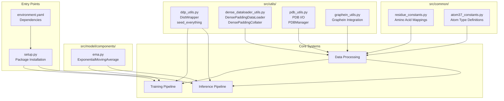
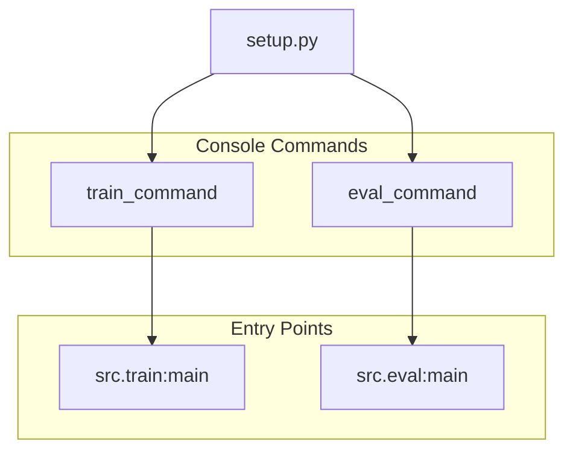
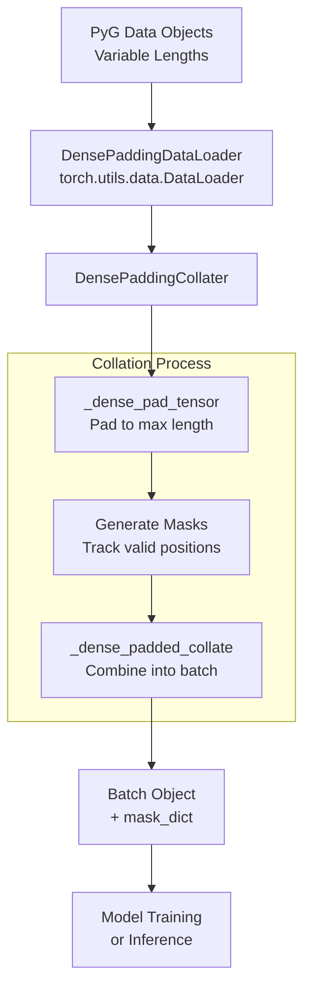
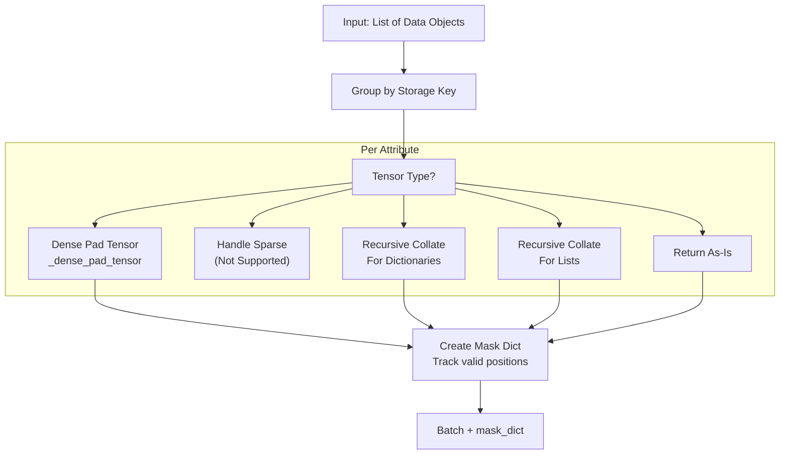
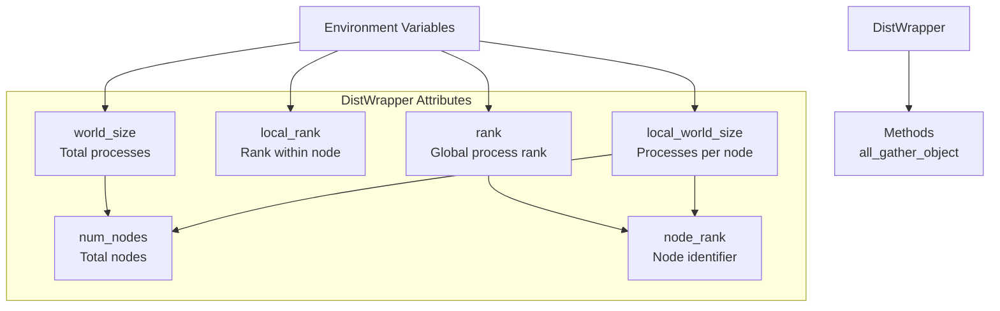
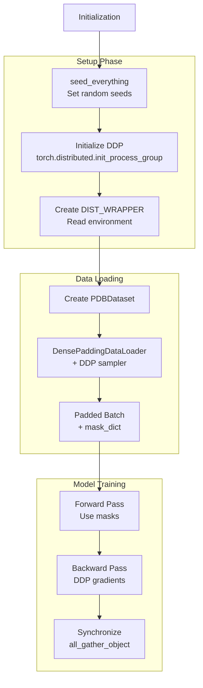

# Utilities and Supporting Components

> **Relevant source files**
> * [.project-root](https://github.com/Junjie-Zhu/IDPFold2/blob/5315b279/.project-root)
> * [environment.yaml](https://github.com/Junjie-Zhu/IDPFold2/blob/5315b279/environment.yaml)
> * [setup.py](https://github.com/Junjie-Zhu/IDPFold2/blob/5315b279/setup.py)
> * [src/model/components/moe_modules_torch.py](https://github.com/Junjie-Zhu/IDPFold2/blob/5315b279/src/model/components/moe_modules_torch.py)
> * [src/model/components/moe_operations.py](https://github.com/Junjie-Zhu/IDPFold2/blob/5315b279/src/model/components/moe_operations.py)
> * [src/utils/ddp_utils.py](https://github.com/Junjie-Zhu/IDPFold2/blob/5315b279/src/utils/ddp_utils.py)
> * [src/utils/dense_dataloader_utils.py](https://github.com/Junjie-Zhu/IDPFold2/blob/5315b279/src/utils/dense_dataloader_utils.py)

This document provides an overview of the utility functions and supporting infrastructure that enable IDPFold2's core functionality. These components handle cross-cutting concerns such as distributed computing, data collation, environment configuration, and system constants.

For core model architecture details, see [Model Architecture](/Junjie-Zhu/IDPFold2/5-model-architecture). For data processing pipelines, see [Data Pipeline](/Junjie-Zhu/IDPFold2/4-data-pipeline). For training infrastructure, see [Training](/Junjie-Zhu/IDPFold2/6-training).

---

## Purpose and Scope

The utilities and supporting components provide foundational infrastructure that is used throughout the IDPFold2 codebase. This includes:

* **Environment Setup**: Dependency management and package installation
* **Data Collation**: Custom data loading with dense padding for variable-length proteins
* **Distributed Computing**: Multi-GPU training and inference coordination
* **Constants and Definitions**: Protein structure constants and atom type mappings
* **Supporting Modules**: EMA tracking, PDB processing, and visualization configuration

These utilities are designed to be reusable across training, inference, and evaluation workflows. Detailed documentation for specific utility categories is available in the sub-pages:

* [Protein Data Processing](/Junjie-Zhu/IDPFold2/9.1-protein-data-processing)
* [Constants and Definitions](/Junjie-Zhu/IDPFold2/9.2-constants-and-definitions)
* [Distributed Computing Utilities](/Junjie-Zhu/IDPFold2/9.3-distributed-computing-utilities)
* [Exponential Moving Average](/Junjie-Zhu/IDPFold2/9.4-exponential-moving-average)
* [Visualization Configuration](/Junjie-Zhu/IDPFold2/9.5-visualization-configuration)

---

## Utility Module Organization

The utility infrastructure is organized into several categories based on functionality:

**Sources**: [environment.yaml L1-L29](https://github.com/Junjie-Zhu/IDPFold2/blob/5315b279/environment.yaml#L1-L29)

 [setup.py L1-L21](https://github.com/Junjie-Zhu/IDPFold2/blob/5315b279/setup.py#L1-L21)

 [src/utils/ddp_utils.py L1-L50](https://github.com/Junjie-Zhu/IDPFold2/blob/5315b279/src/utils/ddp_utils.py#L1-L50)

 [src/utils/dense_dataloader_utils.py L1-L447](https://github.com/Junjie-Zhu/IDPFold2/blob/5315b279/src/utils/dense_dataloader_utils.py#L1-L447)

---

## Environment Configuration

### Dependency Management

IDPFold2 uses a Conda environment with carefully specified dependencies to ensure reproducibility. The environment configuration includes:

| Category | Key Dependencies | Purpose |
| --- | --- | --- |
| **Deep Learning** | pytorch=2.4.1, pyg=2.6.1 | Core neural network framework and graph operations |
| **Protein Processing** | biotite, biopandas, biopython, cpdb-protein | Structure parsing and manipulation |
| **Sequence Analysis** | mmseqs2 | Sequence clustering and similarity search |
| **Configuration** | hydra-core | Hierarchical configuration management |
| **Utilities** | einops, dm-tree, loguru, pandas, numpy | Tensor operations, logging, data handling |

The environment is defined in [environment.yaml L1-L29](https://github.com/Junjie-Zhu/IDPFold2/blob/5315b279/environment.yaml#L1-L29)

 which specifies exact versions for reproducibility.

### Package Installation

The package setup provides command-line entry points for common operations:

The setup script [setup.py L4-L20](https://github.com/Junjie-Zhu/IDPFold2/blob/5315b279/setup.py#L4-L20)

 creates console commands that can be invoked after installation:

* `train_command`: Entry point for training workflows
* `eval_command`: Entry point for evaluation workflows

**Sources**: [environment.yaml L1-L29](https://github.com/Junjie-Zhu/IDPFold2/blob/5315b279/environment.yaml#L1-L29)

 [setup.py L1-L21](https://github.com/Junjie-Zhu/IDPFold2/blob/5315b279/setup.py#L1-L21)

---

## Dense Padding Data Loader

### Overview

The `DensePaddingDataLoader` is a custom data loader that handles variable-length protein structures by padding them to a uniform size within each batch. This is essential for efficient GPU computation with proteins of different lengths.

### Architecture

**Sources**: [src/utils/dense_dataloader_utils.py L1-L447](https://github.com/Junjie-Zhu/IDPFold2/blob/5315b279/src/utils/dense_dataloader_utils.py#L1-L447)

### Key Components

#### DensePaddingDataLoader

The main data loader class [src/utils/dense_dataloader_utils.py L401-L447](https://github.com/Junjie-Zhu/IDPFold2/blob/5315b279/src/utils/dense_dataloader_utils.py#L401-L447)

 extends PyTorch's `DataLoader` with custom collation:

| Parameter | Type | Purpose |
| --- | --- | --- |
| `dataset` | `Dataset` | PyTorch Geometric dataset to load from |
| `batch_size` | `int` | Number of samples per batch |
| `shuffle` | `bool` | Whether to shuffle data at each epoch |
| `follow_batch` | `List[str]` | Keys for which to create batch assignment vectors |
| `exclude_keys` | `List[str]` | Keys to exclude from collation |

#### DensePaddingCollater

The collater [src/utils/dense_dataloader_utils.py L331-L399](https://github.com/Junjie-Zhu/IDPFold2/blob/5315b279/src/utils/dense_dataloader_utils.py#L331-L399)

 implements the padding logic:

* Handles heterogeneous data objects (different lengths, types)
* Creates padding masks to identify valid vs. padded positions
* Supports nested data structures (dictionaries, lists)
* Preserves tensor metadata and structure

#### Padding Strategy

The padding function [src/utils/dense_dataloader_utils.py L32-L99](https://github.com/Junjie-Zhu/IDPFold2/blob/5315b279/src/utils/dense_dataloader_utils.py#L32-L99)

 uses different padding values based on data type:

| Data Type | Padding Value | Constant |
| --- | --- | --- |
| Float tensors | `1e-8` | `FLOAT_PADDING_VALUE` |
| Integer tensors | `-1` | `NON_FLOAT_PADDING_VALUE` |

Special handling for:

* **Edge indices**: Concatenated along edge dimension, not padded
* **Boolean tensors**: Converted to long for padding, then restored with masks
* **Scalar values**: Unsqueezed to add batch dimension

### Collation Process

The collation function [src/utils/dense_dataloader_utils.py L213-L295](https://github.com/Junjie-Zhu/IDPFold2/blob/5315b279/src/utils/dense_dataloader_utils.py#L213-L295)

 recursively processes each attribute:

1. Groups data objects by storage key
2. For each attribute, determines the appropriate collation strategy
3. Pads tensors to the maximum length in the batch
4. Creates masks to identify valid positions
5. Returns a `Batch` object with attached `mask_dict`

**Sources**: [src/utils/dense_dataloader_utils.py L28-L329](https://github.com/Junjie-Zhu/IDPFold2/blob/5315b279/src/utils/dense_dataloader_utils.py#L28-L329)

---

## Distributed Computing Infrastructure

### DistWrapper Class

The `DistWrapper` [src/utils/ddp_utils.py L12-L34](https://github.com/Junjie-Zhu/IDPFold2/blob/5315b279/src/utils/ddp_utils.py#L12-L34)

 provides a unified interface for distributed training information:

Key attributes computed from environment variables:

* `rank`: Global process identifier (0 to world_size-1)
* `local_rank`: Process identifier within a node (0 to local_world_size-1)
* `world_size`: Total number of processes across all nodes
* `local_world_size`: Number of processes per node
* `num_nodes`: Total number of compute nodes (world_size / local_world_size)
* `node_rank`: Which node this process is on (rank / local_world_size)

### Global Instance

A global `DIST_WRAPPER` instance [src/utils/ddp_utils.py L34](https://github.com/Junjie-Zhu/IDPFold2/blob/5315b279/src/utils/ddp_utils.py#L34-L34)

 is created for convenient access throughout the codebase.

### Distributed Operations

The `all_gather_object` method [src/utils/ddp_utils.py L21-L31](https://github.com/Junjie-Zhu/IDPFold2/blob/5315b279/src/utils/ddp_utils.py#L21-L31)

 collects objects from all processes:

* Used for synchronizing metrics across processes during logging
* Only performs gathering if multiple processes are running
* Returns a list of objects, one from each process

### Reproducibility Utilities

The `seed_everything` function [src/utils/ddp_utils.py L37-L49](https://github.com/Junjie-Zhu/IDPFold2/blob/5315b279/src/utils/ddp_utils.py#L37-L49)

 ensures deterministic behavior:

| Component | Configuration | Purpose |
| --- | --- | --- |
| Python RNG | `random.seed(seed)` | Random number generation |
| NumPy RNG | `np.random.seed(seed)` | NumPy operations |
| PyTorch CPU | `torch.random.manual_seed(seed)` | CPU tensor operations |
| PyTorch CUDA | `torch.cuda.manual_seed_all(seed)` | GPU tensor operations |
| cuDNN | `cudnn.deterministic=True` | Deterministic convolutions |
| PyTorch Algos | `use_deterministic_algorithms(True)` | All operations |
| cuBLAS | `CUBLAS_WORKSPACE_CONFIG` | Matrix operations |

**Sources**: [src/utils/ddp_utils.py L1-L50](https://github.com/Junjie-Zhu/IDPFold2/blob/5315b279/src/utils/ddp_utils.py#L1-L50)

---

## Integration Patterns

### Usage in Training Pipeline

The utilities integrate seamlessly into the training workflow:

1. **Initialization**: Seeds are set for reproducibility using `seed_everything`
2. **Distribution**: `DIST_WRAPPER` provides rank and world size information
3. **Data Loading**: `DensePaddingDataLoader` handles variable-length batching
4. **Training Loop**: Masks from the data loader guide computation
5. **Synchronization**: `all_gather_object` collects metrics across processes

### Usage in Inference Pipeline

The same utilities support inference:

* `DensePaddingDataLoader` batches input sequences efficiently
* `DIST_WRAPPER` enables multi-GPU inference distribution
* Padding masks ensure correct handling of variable-length outputs

**Sources**: [src/utils/ddp_utils.py L1-L50](https://github.com/Junjie-Zhu/IDPFold2/blob/5315b279/src/utils/ddp_utils.py#L1-L50)

 [src/utils/dense_dataloader_utils.py L1-L447](https://github.com/Junjie-Zhu/IDPFold2/blob/5315b279/src/utils/dense_dataloader_utils.py#L1-L447)

---

## Helper Function Availability

### Distributed Computing Helpers

The `distributed_available` function [src/utils/ddp_utils.py L8-L9](https://github.com/Junjie-Zhu/IDPFold2/blob/5315b279/src/utils/ddp_utils.py#L8-L9)

 checks if distributed training is enabled:

* Returns `True` if `torch.distributed` is available and initialized
* Used throughout the codebase to conditionally enable distributed operations
* Allows code to run in both single-process and multi-process modes

### Padding Constants

Module-level constants [src/utils/dense_dataloader_utils.py L28-L29](https://github.com/Junjie-Zhu/IDPFold2/blob/5315b279/src/utils/dense_dataloader_utils.py#L28-L29)

 define padding behavior:

* `FLOAT_PADDING_VALUE = 1e-8`: Small value for float tensors to avoid numerical issues
* `NON_FLOAT_PADDING_VALUE = -1`: Sentinel value for integer tensors

These constants are referenced by collation functions to ensure consistent padding across the system.

**Sources**: [src/utils/ddp_utils.py L8-L9](https://github.com/Junjie-Zhu/IDPFold2/blob/5315b279/src/utils/ddp_utils.py#L8-L9)

 [src/utils/dense_dataloader_utils.py L28-L29](https://github.com/Junjie-Zhu/IDPFold2/blob/5315b279/src/utils/dense_dataloader_utils.py#L28-L29)

---

## Advanced Collation Features

### Shared Memory Optimization

The dense padding collater [src/utils/dense_dataloader_utils.py L146-L161](https://github.com/Junjie-Zhu/IDPFold2/blob/5315b279/src/utils/dense_dataloader_utils.py#L146-L161)

 includes optimizations for multi-worker data loading:

* Writes directly to shared memory when using multiple data loader workers
* Avoids extra memory copies between processes
* Handles PyTorch version differences in shared storage API

### Edge Index Handling

Special logic [src/utils/dense_dataloader_utils.py L65-L75](https://github.com/Junjie-Zhu/IDPFold2/blob/5315b279/src/utils/dense_dataloader_utils.py#L65-L75)

 handles graph edge indices:

* Assumes dimension 0 contains source and target node indices
* Dimension 1 contains the number of edges
* Pads edge lists to the maximum number of edges in the batch
* Preserves the (2, num_edges) structure

### Nested Structure Support

The collater recursively handles [src/utils/dense_dataloader_utils.py L183-L210](https://github.com/Junjie-Zhu/IDPFold2/blob/5315b279/src/utils/dense_dataloader_utils.py#L183-L210)

:

* **Dictionaries**: Collates each key's values independently
* **Lists/Tuples**: Collates corresponding elements across samples
* **Mixed Types**: Combines tensors and non-tensors appropriately

This flexibility allows complex protein structure data with multiple feature types to be batched efficiently.

**Sources**: [src/utils/dense_dataloader_utils.py L32-L211](https://github.com/Junjie-Zhu/IDPFold2/blob/5315b279/src/utils/dense_dataloader_utils.py#L32-L211)

---

## Summary

The utilities and supporting components provide essential infrastructure for IDPFold2:

| Component | Primary Purpose | Key Classes/Functions |
| --- | --- | --- |
| **Environment** | Dependency management and reproducibility | `environment.yaml`, `setup.py` |
| **Data Loading** | Efficient batching with padding | `DensePaddingDataLoader`, `DensePaddingCollater` |
| **Distribution** | Multi-GPU coordination | `DistWrapper`, `seed_everything` |
| **Constants** | Protein structure definitions | See [Constants and Definitions](/Junjie-Zhu/IDPFold2/9.2-constants-and-definitions) |
| **EMA** | Stable inference weights | See [Exponential Moving Average](/Junjie-Zhu/IDPFold2/9.4-exponential-moving-average) |
| **PDB I/O** | Structure parsing and writing | See [Protein Data Processing](/Junjie-Zhu/IDPFold2/9.1-protein-data-processing) |

These utilities are designed to be modular and reusable, supporting both training and inference workflows while maintaining clean separation from core model logic.

For detailed documentation of specific utility categories, refer to the sub-pages listed at the beginning of this document.

**Sources**: [environment.yaml L1-L29](https://github.com/Junjie-Zhu/IDPFold2/blob/5315b279/environment.yaml#L1-L29)

 [setup.py L1-L21](https://github.com/Junjie-Zhu/IDPFold2/blob/5315b279/setup.py#L1-L21)

 [src/utils/dense_dataloader_utils.py L1-L447](https://github.com/Junjie-Zhu/IDPFold2/blob/5315b279/src/utils/dense_dataloader_utils.py#L1-L447)

 [src/utils/ddp_utils.py L1-L50](https://github.com/Junjie-Zhu/IDPFold2/blob/5315b279/src/utils/ddp_utils.py#L1-L50)