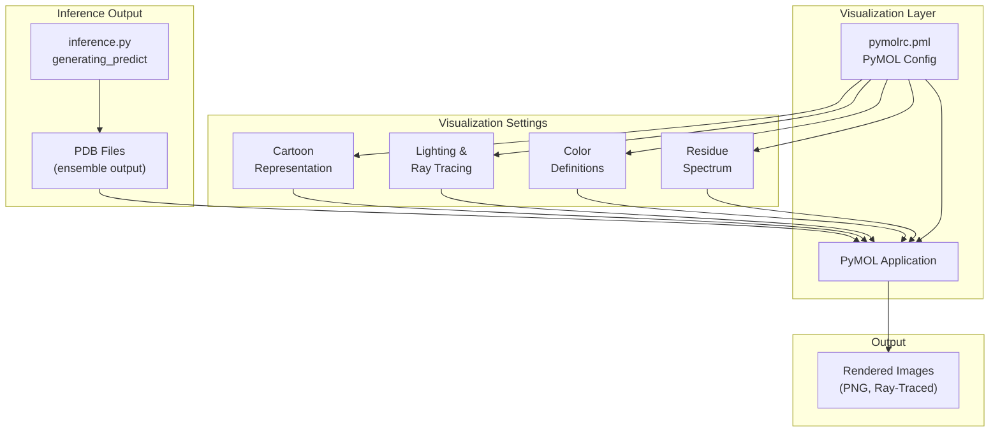
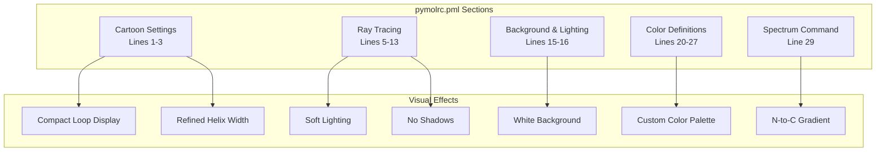
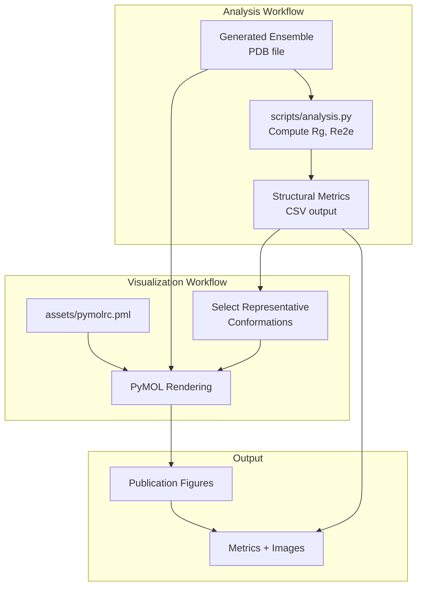

# Visualization Configuration

> **Relevant source files**
> * [assets/pymolrc.pml](https://github.com/Junjie-Zhu/IDPFold2/blob/5315b279/assets/pymolrc.pml)

## Purpose and Scope

This page documents the PyMOL visualization configuration used in IDPFold2 for rendering protein structures with consistent styling. The configuration file `pymolrc.pml` defines cartoon representation parameters, lighting settings, color schemes, and ray tracing options to produce publication-quality images of generated protein conformational ensembles.

For information about generating PDB output files from predictions, see [PDB Output Generation](/Junjie-Zhu/IDPFold2/7.7-pdb-output-generation). For structural analysis of generated ensembles, see [Quick Structural Analysis](/Junjie-Zhu/IDPFold2/8.1-quick-structural-analysis).

---

## Overview

IDPFold2 includes a PyMOL configuration file that standardizes the visual representation of protein structures. This configuration is particularly useful for:

* Creating consistent renderings of generated ensembles
* Producing publication-quality figures
* Visualizing differences between conformations
* Coloring structures by residue position to highlight sequence regions

The configuration is stored in [assets/pymolrc.pml L1-L29](https://github.com/Junjie-Zhu/IDPFold2/blob/5315b279/assets/pymolrc.pml#L1-L29)

 and can be loaded into PyMOL to apply all settings at once.

**Sources:** [assets/pymolrc.pml L1-L29](https://github.com/Junjie-Zhu/IDPFold2/blob/5315b279/assets/pymolrc.pml#L1-L29)

---

## Configuration Architecture

The following diagram shows how the visualization configuration integrates with the IDPFold2 workflow:



**Sources:** [assets/pymolrc.pml L1-L29](https://github.com/Junjie-Zhu/IDPFold2/blob/5315b279/assets/pymolrc.pml#L1-L29)

---

## Configuration Parameters

### Cartoon Representation Settings

The configuration defines parameters for protein cartoon representation, controlling the visual style of secondary structures:

| Parameter | Value | Purpose |
| --- | --- | --- |
| `cartoon_loop_radius` | 0.5 | Radius of loop regions in cartoon representation |
| `cartoon_oval_width` | 0.33 | Width of oval cross-section for helices |
| `cartoon_rect_width` | 0.33 | Width of rectangular cross-section for beta sheets |

These settings create a refined, compact cartoon representation suitable for visualizing intrinsically disordered proteins where loops and coils dominate the structure.

**Code Implementation:**

```
set cartoon_loop_radius, 0.5
set cartoon_oval_width, 0.33
set cartoon_rect_width, 0.33
```

**Sources:** [assets/pymolrc.pml L1-L3](https://github.com/Junjie-Zhu/IDPFold2/blob/5315b279/assets/pymolrc.pml#L1-L3)

---

### Lighting and Ray Tracing Settings

The configuration establishes lighting parameters for both real-time display and ray-traced rendering:

| Parameter | Value | Purpose |
| --- | --- | --- |
| `ray_shadows` | 0 | Disables shadows in ray tracing (cleaner appearance) |
| `ambient` | 0.6 | Ambient lighting contribution |
| `direct` | 0.5 | Direct lighting contribution |
| `specular` | 0.4 | Specular highlight intensity |
| `shininess` | 50 | Specular highlight concentration |
| `ray_trace_mode` | 1 | Ray tracing algorithm mode |
| `ray_trace_gain` | 0.2 | Ray tracing brightness adjustment |
| `two_sided_lighting` | on | Enables lighting on both sides of surfaces |

These settings produce a bright, flat appearance without harsh shadows, emphasizing structure clarity over photorealism.

**Code Implementation:**

```
set ray_shadows, 0
set ambient, 0.6
set direct, 0.5
set specular, 0.4
set shininess, 50
set ray_trace_mode, 1
set ray_trace_gain, 0.2
bg_color white
set two_sided_lighting, on
```

**Sources:** [assets/pymolrc.pml L5-L16](https://github.com/Junjie-Zhu/IDPFold2/blob/5315b279/assets/pymolrc.pml#L5-L16)

---

### Color Definitions

The configuration defines three custom colors for protein visualization:

| Color Name | RGB Values | Hex Equivalent | Usage |
| --- | --- | --- | --- |
| `_blue` | [0, 52, 114] | #003472 | Dark blue for N-terminus or low residue indices |
| `_red` | [200, 60, 35] | #C83C23 | Dark red for C-terminus or high residue indices |
| `_green` | [61, 225, 173] | #3DE1AD | Teal green for alternative coloring |

The configuration includes commented-out alternative color schemes that were previously tested:

```markdown
#set_color _blue, [134, 126, 174]    # Light purple-blue
#set_color _red, [252, 109, 73]      # Bright red-orange
#set_color _target, [255, 122, 39]   # Orange
#set_color _other, [66, 223, 170]    # Cyan
```

**Current Implementation:**

```
set_color _blue, [0, 52, 114]
set_color _red, [200, 60, 35]
set_color _green, [61, 225, 173]
```

**Sources:** [assets/pymolrc.pml L20-L27](https://github.com/Junjie-Zhu/IDPFold2/blob/5315b279/assets/pymolrc.pml#L20-L27)

---

### Residue Spectrum Coloring

The configuration applies a color gradient from N-terminus to C-terminus using the defined custom colors:

```
spectrum resi, _blue _red
```

This command colors the protein structure based on residue index, creating a gradient from dark blue (N-terminus) to dark red (C-terminus). This visualization is particularly useful for:

* Identifying sequence regions in generated ensembles
* Comparing conformational changes across the sequence
* Highlighting loop regions and terminal flexibility in IDPs

**Sources:** [assets/pymolrc.pml L29](https://github.com/Junjie-Zhu/IDPFold2/blob/5315b279/assets/pymolrc.pml#L29-L29)

---

## Configuration Parameter Mapping

The following diagram maps configuration sections to their visual effects:



**Sources:** [assets/pymolrc.pml L1-L29](https://github.com/Junjie-Zhu/IDPFold2/blob/5315b279/assets/pymolrc.pml#L1-L29)

---

## Usage in IDPFold2 Workflow

### Loading the Configuration

To use the PyMOL configuration with IDPFold2-generated structures:

1. **Generate ensemble structures** using the inference pipeline (see [Inference Pipeline](/Junjie-Zhu/IDPFold2/7.1-inference-pipeline))
2. **Open PyMOL** with the configuration file: ``` pymol -r assets/pymolrc.pml <generated_structure.pdb> ```
3. **Or load interactively** within PyMOL: ``` @assets/pymolrc.pmlload <generated_structure.pdb> ```

### Default Display Settings

The configuration includes display preferences that are automatically applied:

```
hide spheres
zoom
```

* `hide spheres` ensures cartoon representation is the primary view
* `zoom` automatically fits the structure in the viewport

**Sources:** [assets/pymolrc.pml L17-L18](https://github.com/Junjie-Zhu/IDPFold2/blob/5315b279/assets/pymolrc.pml#L17-L18)

---

## Customization Guide

### Modifying Color Schemes

To change the color gradient, modify the custom color definitions and spectrum command:

**Example: Green to Purple Gradient**

```
set_color _start, [61, 225, 173]set_color _end, [134, 126, 174]spectrum resi, _start _end
```

### Adjusting Cartoon Representation

For structures with more pronounced secondary structure content:

```markdown
set cartoon_loop_radius, 0.3      # Thinner loopsset cartoon_oval_width, 0.5       # Wider helicesset cartoon_rect_width, 0.5       # Wider beta sheets
```

### Enabling Shadows for Depth Perception

If shadows are desired for ray-traced images:

```
set ray_shadows, 1set ray_shadow_decay_factor, 0.1set ray_shadow_decay_range, 2
```

### Multi-Conformation Visualization

When visualizing ensembles with multiple MODEL records (see [PDB Output Generation](/Junjie-Zhu/IDPFold2/7.7-pdb-output-generation)):

```markdown
@assets/pymolrc.pmlload ensemble.pdbsplit_states ensemble# Each conformation is now a separate objectspectrum resi, _blue _red, ensemble_0001spectrum resi, _blue _red, ensemble_0002# ... etc
```

**Sources:** [assets/pymolrc.pml L1-L29](https://github.com/Junjie-Zhu/IDPFold2/blob/5315b279/assets/pymolrc.pml#L1-L29)

---

## Integration with Analysis Scripts

The visualization configuration complements the structural analysis tools documented in section 8. After generating quick structural analysis metrics (see [Quick Structural Analysis](/Junjie-Zhu/IDPFold2/8.1-quick-structural-analysis)), the PyMOL configuration can be used to create visual representations that correspond to the computed properties:



**Sources:** [assets/pymolrc.pml L1-L29](https://github.com/Junjie-Zhu/IDPFold2/blob/5315b279/assets/pymolrc.pml#L1-L29)

---

## Technical Specifications

### PyMOL Version Compatibility

The configuration uses standard PyMOL commands compatible with PyMOL 2.0 and later. All commands are version-stable and do not require specific PyMOL builds.

### Configuration Parameters Reference

| Category | Parameters | Lines |
| --- | --- | --- |
| Cartoon Geometry | `cartoon_loop_radius`, `cartoon_oval_width`, `cartoon_rect_width` | 1-3 |
| Lighting | `ambient`, `direct`, `specular`, `shininess`, `two_sided_lighting` | 6-7, 9-10, 16 |
| Ray Tracing | `ray_shadows`, `ray_trace_mode`, `ray_trace_gain` | 5, 12-13 |
| Colors | `_blue`, `_red`, `_green` | 25-27 |
| Display | `bg_color`, `hide spheres`, `zoom` | 15, 17-18 |
| Coloring Scheme | `spectrum resi` | 29 |

**Sources:** [assets/pymolrc.pml L1-L29](https://github.com/Junjie-Zhu/IDPFold2/blob/5315b279/assets/pymolrc.pml#L1-L29)

---

## Summary

The PyMOL visualization configuration in `assets/pymolrc.pml` provides a standardized rendering setup for IDPFold2-generated protein structures. The configuration emphasizes clarity and consistency with:

* Compact cartoon representation suitable for disordered proteins
* Soft, shadowless lighting for structure clarity
* Custom blue-to-red gradient coloring based on residue position
* White background and optimized ray tracing parameters

This configuration integrates seamlessly with the inference output (section 7) and analysis tools (section 8) to produce publication-quality visualizations of conformational ensembles.

**Sources:** [assets/pymolrc.pml L1-L29](https://github.com/Junjie-Zhu/IDPFold2/blob/5315b279/assets/pymolrc.pml#L1-L29)