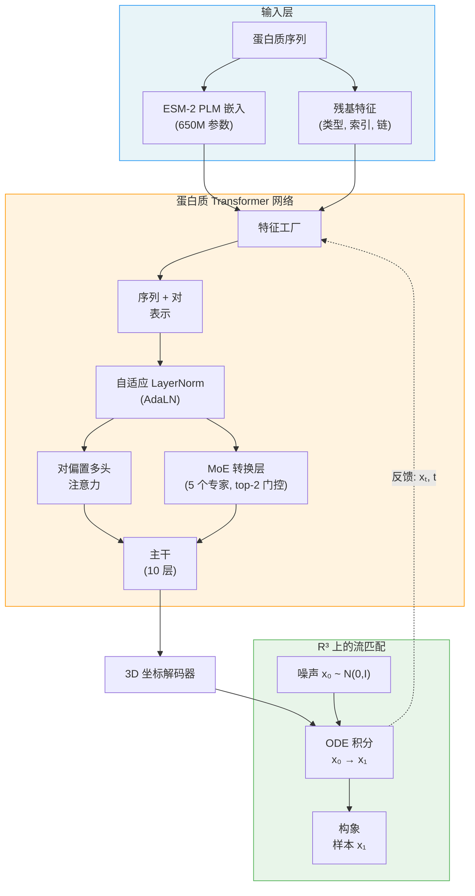

---
slug:1-overview
blog_type:normal
---


**IDPFold2** 是一个生成式深度学习框架，用于预测单体、多结构域蛋白质及蛋白质复合物的构象系综。它将 **Mixture-of-Experts (MoE)** 架构集成到 **R³上的流匹配** 框架中，对蛋白质在溶液中探索的异质热力学景观进行建模。该模型在混合数据集上进行训练，该数据集结合了 PDB 结构、mdCATH 分子动力学轨迹以及 IDRome-o 内在无序蛋白质数据，使其能够通过单一统一的模型同时捕捉有序和无序的构象状态。

来源: [README.md](/README.md#L1-L30), [setup.py](/setup.py#L1-L42)

## IDPFold2 的功能

传统结构预测方法（如 AlphaFold）只能生成单一的静态结构。然而，真实的蛋白质是动态的——它们会占据由热力学决定的**构象系综**。IDPFold2 通过为给定序列生成多个合理的 3D 结构来填补这一空白，反映出蛋白质实际采样的状态多样性。这对于以下情况至关重要：

- 缺乏单一稳定折叠的**内在无序蛋白质**
- 结构域间灵活性会产生多种构型的**多结构域蛋白质**
- 具有可选结合取向的**蛋白质复合物**
- 需要结构异质性的**功能研究**（例如，NMR、SAXS、FRET 验证）

该框架接受指定目标名称和氨基酸序列的简单 CSV 输入，并输出一组代表预测构象系综的 PDB 结构。

来源: [README.md](/README.md#L14-L30), [data/monomer_example.csv](/data/monomer_example.csv#L1-L4)

## 核心架构一览

IDPFold2 的架构建立在三大支柱之上，它们在训练和推理过程中协同工作：



| 组件 | 作用 | 关键细节 |
|---|---|---|
| **R³ 上的流匹配** | 生成框架 | 通过线性插值学习从高斯噪声到蛋白质结构的 ODE 轨迹 |
| **蛋白质 Transformer** | 分数/速度网络 | 具有对表示和寄存器 Token 的 10 层 SE(3)-等变 Transformer |
| **Mixture-of-Experts** | 容量与特化 | 每个转换层 5 个专家，通过学习到的路由器激活 top-2 + 1 个共享专家 |
| **自适应 LayerNorm** | 时间条件化 | 基于流时间 *t* 对表示进行缩放和偏移 |
| **ESM-2 嵌入** | 序列编码 | 预训练的 650M 参数语言模型提供逐残基特征 |

<CgxTip>MoE 路由使用一个**共享专家**加上具有归一化权重的 **top-k 路由专家**，这意味着每个 Token 总是经过共享专家，并选择性地经过剩余 4 个专家中的 2 个。这种设计在允许跨构象模式特化的同时，确保了训练的稳定性。</CgxTip>

来源: [src/model/protein_transformer.py](/src/model/protein_transformer.py#L258-L529), [src/model/flow_matching/r3flow.py](/src/model/flow_matching/r3flow.py#L1-L50), [src/model/components/moe_modules_torch.py](/src/model/components/moe_modules_torch.py#L74-L130), [configs/inference.yaml](/configs/inference.yaml#L56-L103)

## 推理与训练模式

IDPFold2 通过 CLI 入口点（`idpfold2-infer` 和 `idpfold2-train`）支持两个主要工作流：

**推理** — 给定一个包含序列的 CSV，模型通过将学习到的 ODE 从噪声积分到干净坐标，为每个目标生成 *N* 个结构样本。如果未预先计算，该过程会自动提取 ESM-2 嵌入，通过 DDP 支持多 GPU，并提供包括普通速度场积分、基于分数的校正，以及用于增强样本质量的无分类器/自动引导在内的采样策略。

**训练** — 模型学习预测流匹配 ODE 的速度场。损失函数结合了流匹配 MSE 损失（由 `1/(1-t)²` 加权）和 MoE 负载均衡辅助损失。训练在混合数据（PDB + mdCATH + IDRome-o）上进行，采用集群感知采样、随机裁剪和全局旋转增强。

| 参数 | 推理默认值 | 训练默认值 |
|---|---|---|
| Token 维度 | 768 | 768 |
| Transformer 层数 | 10 | 10 |
| 注意力头数 | 12 | 12 |
| MoE 专家数 / 激活数 | 5 / 2 | 5 / 2 |
| 对表示维度 | 512 | 512 |
| 条件维度 | 512 | 512 |
| EMA 衰减 | — | 0.999 |
| 噪声调度 | — | mix_up02_beta (1.9, 1.0) |
| 最大批次长度 | 3500 | crop_size: 256 |

来源: [src/inference.py](/src/inference.py#L1-L60), [src/train.py](/src/train.py#L1-L50), [configs/inference.yaml](/configs/inference.yaml#L1-L103), [configs/train.yaml](/configs/train.yaml#L1-L124)

## 项目结构

```
IDPFold2/
├── configs/                    # Hydra 配置文件
│   ├── inference.yaml          # 推理参数 & 模型配置
│   └── train.yaml              # 训练参数、优化器、数据配置
├── data/                       # 示例输入 CSV
│   ├── monomer_example.csv     # 单链蛋白质序列
│   └── multimer_example.csv    # 多链复合物（链以 : 分隔）
├── src/                        # 核心源代码
│   ├── inference.py            # 推理入口点 & 数据加载
│   ├── train.py                # 带 DDP & EMA 的训练循环
│   ├── model/
│   │   ├── protein_transformer.py  # 主 ProteinTransformerAF3 网络
│   │   ├── integral.py             # ODE 积分、损失计算、预测
│   │   ├── flow_matching/
│   │   │   └── r3flow.py           # R³ 流匹配：插值、模拟
│   │   ├── components/
│   │   │   ├── af3_modules.py      # AdaptiveLayerNorm, SwiGLU, Transition
│   │   │   ├── pair_bias_attn.py   # 对偏置多头注意力
│   │   │   ├── feature_factory.py  # 特征提取（时间, PLM, 索引, 对）
│   │   │   ├── moe_modules_torch.py # MoE 路由器、专家分派、负载均衡
│   │   │   └── motif_factory.py    # 部分结构的模体条件化
│   │   ├── ema.py                  # 指数移动平均包装器
│   │   └── optimizer.py           # 学习率调度器（AF3 风格）
│   ├── data/
│   │   ├── dataset.py             # PDB 选择、划分、PyG 数据加载器
│   │   └── transforms.py          # 增强（旋转、链断裂）
│   ├── common/                    # 残基 & atom37 常量
│   └── utils/                     # PDB I/O、聚类、DDP、比对
├── benchmarks/                 # 评估脚本
│   ├── bioemu-benchmark/       # BioEmu 基准分析
│   └── peptonebench/           # NMR/SAXS 综合验证
├── scripts/                    # 实用脚本（ESM 嵌入、分析）
├── megablocks/                 # 可选的加速 MoE (CUDA 内核)
├── notebooks/                  # 用于单体预览的 Colab 笔记本
├── docker/                     # Docker & 昇腾部署文件
└── test/                       # Pytest 套件
```

来源: [setup.py](/setup.py#L1-L42), [src/model/protein_transformer.py](/src/model/protein_transformer.py#L1-L30), [src/model/integral.py](/src/model/integral.py#L1-L50)

## 技术要求

IDPFold2 基于 **Python 3.11+** 和 **PyTorch 2.0+** 构建，具有以下关键依赖项：

- **fair-esm** — 用于序列嵌入的 ESM-2 蛋白质语言模型
- **hydra-core** — 所有实验的分层配置管理
- **einops** — 用于注意力和 MoE 重塑的张量操作
- **biotite / biopython / biopandas** — 结构生物学 I/O 与操作
- **torch-geometric** — 用于 PDB 结构的基于图的数据加载

该框架支持 **NVIDIA GPU**（带有可选的 MegaBlocks CUDA 加速 MoE），通过带有 CANN 工具包的专用 Docker 镜像支持 **昇腾 910B NPU**，以及**多设备 DDP** 训练/推理。

<CgxTip>对于在内存受限的 GPU 上进行推理，请调整 `max_batch_length`（默认 3500，在 V100-32GB 上测试过）——这控制了每个批次的总残基数，并直接决定峰值内存使用量。</CgxTip>

来源: [setup.py](/setup.py#L10-L32), [configs/inference.yaml](/configs/inference.yaml#L10-L11), [Dockerfile.ascend](/Dockerfile.ascend#L1-L1)

## 接下来去哪

从实际设置开始，然后深入探索架构：

1. **[快速开始](2-quick-start)** — 安装、下载检查点并运行你的首次推理
2. **[单体与多聚体推理](3-inference-for-monomers-and-multimers)** — 详细的 CSV 格式、多聚体链规范和采样选项
3. **[架构概览](4-architecture-overview)** — 完整的数据流图以及三大支柱如何连接
4. **[R³ 上的流匹配](5-flow-matching-on-r3)** — 生成式 ODE 的数学基础
5. **[Mixture-of-Experts 转换层](6-mixture-of-experts-transition-layers)** — 路由器设计、专家分派和负载均衡
6. **[蛋白质 Transformer 网络](7-protein-transformer-network)** — 包含寄存器 Token 和对表示的完整前向传播解析