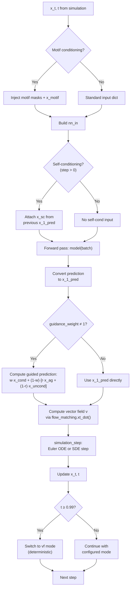

---
slug:10-sampling-and-guidance-strategies
blog_type:normal
---

IDPFold2 的生成流水线由一组丰富的采样与引导机制控制，这些机制将学习到的向量场转换为多样化且可控的结构系综。这些策略在三个不同层面运作：**数值积分**（如何对 ODE/SDE 进行离散化与步进）、**引导**（如何修改预测的向量场以引导生成），以及**条件化**（外部约束——序列嵌入、基序或自条件预测——如何影响轨迹）。它们共同构成了一个可组合的控制面，使从业者无需重新训练即可在样本质量、多样性和约束满足度之间进行权衡。

来源: [r3flow.py](src/model/flow_matching/r3flow.py#L1-L656), [integral.py](src/model/integral.py#L1-L403), [inference.yaml](configs/inference.yaml#L1-L103)

## 积分方案：ODE 与 SDE 采样

采样的核心在于**确定性 ODE 积分**与**随机性 SDE 积分**之间的选择，两者均在 `R3NFlowMatcher` 中作为 Euler 方案实现。确定性路径求解标准流匹配 ODE：

> **等式 (1):** dx_t = v(x_t, t) dt

其中 `v` 是学习到的向量场。对于给定的初始样本 x_0，这会产生一条从噪声到结构的固定轨迹，具有最高的可复现性，但不存在随机探索。随机路径通过基于分数的漂移项和 Wiener 噪声项对此进行了增强：

> **等式 (2):** dx_t = [v(x_t, t) + g(t) · s(x_t, t)] dt + √(2g(t)) dw_t

此处 `s(x_t, t)` 是中间密度的分数，IDPFold2 通过恒等式 s(x_t, t) = (t · v − x_t) / (scale_ref² · (1−t)) 从向量场**解析地**推导出该分数，从而避免了对单独训练的分数模型的需求。SDE 模式引入了可控的随机性，可以提高样本多样性并有助于逃离局部模式，这对于以结构异质性为目标而非将其视为缺陷的 IDP 系综而言尤为宝贵。

来源: [r3flow.py](src/model/flow_matching/r3flow.py#L240-L322)

### 分数-向量场转换

从预测向量场到分数的转换由 `vf_to_score` 执行，它利用了在线性插值方案 x_t = (1−t)x_0 + t·x_1 下两者之间的数学关系。这是一个关键的设计选择：系统无需训练单独的分数网络，而是从现有的流匹配模型中免费恢复分数，使 SDE 采样成为一种零额外成本的选择。该实现严格截断 t < 1（因为分数在 t = 1 时发散），并且当 t > 0.99 时，最后几步积分会自动恢复为确定性 ODE 模式（`sampling_mode = "vf"`），以避免端点附近的数值不稳定。

来源: [r3flow.py](src/model/flow_matching/r3flow.py#L324-L352), [r3flow.py](src/model/flow_matching/r3flow.py#L520-L525)

### 噪声与分数缩放

SDE 积分支持两个独立的缩放参数，将噪声注入与分数漂移解耦：

| 参数 | 配置键 | 作用 | 默认值 |
|---|---|---|---|
| `sc_scale_noise` | `sampling.sc_scale_noise` | 乘以扩散系数 √(2·g(t)·sc_scale_noise·dt) | 0.0 |
| `sc_scale_score` | `sampling.sc_scale_score` | 乘以漂移中的分数项 | 1.0 |

将 `sc_scale_noise` 设置为 `0.0`（默认值）将完全禁用随机性，恢复为纯 ODE 采样。增大该值会注入与 g(t) 成正比的 Wiener 噪声，而 `sc_scale_score` 则控制基于分数的漂移对轨迹的修正强度。这两个缩放比例的相互作用可实现用于锐化分布的**低温采样**（小噪声，完整分数），或用于更广泛探索的**高温采样**（大噪声，减弱分数）。

来源: [r3flow.py](src/model/flow_matching/r3flow.py#L295-L322), [inference.yaml](configs/inference.yaml#L33-L35)

## 时间离散化调度

从 t=0 到 t=1 的积分路径被离散化为 `nsteps = ceil(1/dt)` 步，但这些步的间距**默认是非均匀的**。这一点至关重要，因为流匹配动力学在时间线上变化剧烈：早期的步（t 较小）从近乎纯噪声控制大尺度的粗粒度结构，而后期的步（t 接近 1）则精修局部几何结构。`get_schedule` 方法支持六种调度策略：

| 调度 | 公式 / 描述 | 关键参数 | 适用场景 |
|---|---|---|---|
| `uniform` | t = linspace(0, 1, nsteps+1) | — | 基线；每个阶段计算量相等 |
| `power` | t = linspace(0,1)^p | `schedule_p` | p>1 在 t=0 附近集中步数；p<1 在 t=1 附近集中 |
| `log` | t = 1 − logspace(−p, 0, nsteps+1), 翻转并归一化 | `schedule_p` (默认 2.0) | 早期步密集，用于粗粒度结构 |
| `loglinear` | 基于 SNR 的 logspace(−6, 6) 通过 SNR→t 转换映射到 t | — | 均衡的 SNR 覆盖 |
| `edm` | 具有ρ参数化的 EDM 风格 σ 调度 | `schedule_p` (ρ) | 在扩散文献中已被证明有效 |
| `cos_sch_v_snr` | 基于余弦的 SNR 调度: (cos/sin)^p 映射到 t | `schedule_p` | 平滑的 SNR 过渡 |

**对数调度**（默认，`schedule_p=2.0`）是 IDPFold2 的推荐选择。它在 t=0 附近分配了更密集的时间点，此时向量场必须解决从各向同性高斯分布到折叠骨架的转变——这是一个需要高精度的区域。当 t→1 时，步长变得粗略，因为结构已基本确定，仅需局部精修。

来源: [r3flow.py](src/model/flow_matching/r3flow.py#L601-L655), [inference.yaml](configs/inference.yaml#L40-L42)

## 扩散系数 g(t)

函数 g(t) 控制 SDE 模式下分数漂移和噪声注入的幅度。IDPFold2 实现了三个参数族，每个参数族都带有可选的幂律变换和截断：

| 模式 | 公式 | 行为 |
|---|---|---|
| `1/t` | g(t) = 1 / (t + ε) | t→0 时发散；早期扩散最强；**默认** |
| `us` | g(t) = (1−t) / (t + ε) | t=0 时达峰值，t=1 时归零；适用于无条件采样 |
| `tan` | g(t) = (π/2) · sin((1−t)π/2) / (cos((1−t)π/2) + ε) | 平滑的基于正切的缩放；π/2 归一化 |

每个原始 g(t) 随后都会传入 `transform_gt`，该函数应用可选的幂律重塑：对数值居中后，通过 sigmoid 归一化至 [0,1]，再求 `gt_p` 次幂，最后映射回去。这提供了对扩散调度形状的细粒度控制。最终，`gt_clamp_val` 限制了 g(t) 的最大值以防止数值爆炸。默认配置使用 `gt_mode="1/t"`、`gt_p=1.0`（无变换）且无截断——产生经典的逆时间扩散，在早期步强烈随机化，同时平滑过渡到确定性精修。

来源: [r3flow.py](src/model/flow_matching/r3flow.py#L540-L599), [inference.yaml](configs/inference.yaml#L36-L38)

## 引导：无分类器引导与自引导

IDPFold2 实现了一个**广义引导框架**，在无分类器引导 (CFG) 和自引导之间进行插值，由两个参数控制：`guidance_weight` 和 `autoguidance_ratio`。引导预测的计算方式为：

> x_pred_guided = w · x_pred_cond + (1 − w) · [r · x_pred_ag + (1−r) · x_pred_uncond]

其中 **w** = `guidance_weight`，**r** = `autoguidance_ratio`，`x_pred_cond` 是条件预测的结构，`x_pred_uncond` 是丢弃 PLM 嵌入后的预测（CFG 分支），而 `x_pred_ag` 是从 `autoguidance_ckpt_path` 加载的独立自引导模型的预测。

| 参数 | 默认值 | 效果 |
|---|---|---|
| `guidance_weight` | 1.0 | w=1 → 无引导；w>1 → 放大条件信号；w=0 → 纯无条件/自引导 |
| `autoguidance_ratio` | 0.0 | r=0 → 纯 CFG；r=1 → 纯自引导；0<r<1 → 混合 |

<CgxTip>设置 `guidance_weight > 1.0`（通常为 2.0–5.0）且 `autoguidance_ratio = 0.0` 可恢复标准 CFG，该方式通过放大条件与无条件之间的差距来锐化结构预测。自引导（ratio=1.0）使用较弱的模型代替无条件分支，能在保持结构连贯性的同时产生更多样的系综——这对于以多样性为目标的 IDP 采样尤为宝贵。</CgxTip>

CFG 的无条件分支通过在前向传播之前简单地**丢弃批次字典中的 `plm_embedding` 键**来实现。这是一种简洁且与架构无关的方法：FeatureFactory 将缺失的 PLM 嵌入视为零，从而有效地提供无条件上下文。自引导分支需要加载一个独立的检查点（`ag_dir`）作为第二个 `ProteinTransformerAF3` 实例，该模型通常应是一个能力较弱的模型（例如，训练步数较少、架构宽度不同），以提供“较弱的”基线。

来源: [integral.py](src/model/integral.py#L40-L89), [inference.py](src/inference.py#L255-L298), [inference.yaml](configs/inference.yaml#L44-L46)

## 条件化机制

### 基序条件化

基序条件化支持**部分结构指定**：固定选定残基（基序）的坐标，同时允许剩余骨架自由生成。这通过 `SingleMotifFactory` 实现，它生成三个注入批次的张量：`fixed_sequence_mask`（指示哪些位置被固定的逐残基布尔掩码）、`fixed_structure_mask`（由序列掩码的外积推导出的逐对布尔掩码），以及 `x_motif`（基序残基的 3D 坐标，由其掩码均值居中）。

在采样期间，`full_simulation` 在每个积分步将这些张量直接传入网络输入字典，使模型能够以固定的结构上下文为条件。基序工厂支持随机的训练时增强：以 `motif_prob` 的概率，选择一个随机连续片段（由 `motif_min_pct_res` / `motif_max_pct_res` 和片段数量界限控制）作为基序；否则，发出零掩码（无条件）。在 `zeroes=True` 的推理时，除非提供显式的基序坐标，否则工厂始终发出零掩码，产生无条件样本。

来源: [motif_factory.py](src/model/components/motif_factory.py#L309-L399), [r3flow.py](src/model/flow_matching/r3flow.py#L480-L504), [inference.yaml](configs/inference.yaml#L28-L29)

### 自条件化

自条件化是一种迭代精修技术，其中模型对干净结构 x_1 的**上一步预测**作为附加输入反馈到下一个积分步。具体而言，每步之后预测的 x_1 会被存储，并在后续步（当 `step > 0` 且 `self_cond=True` 时）作为 `nn_in["x_sc"]` 注入。这为网络提供了关于其自身轨迹的“提示”，在不增加额外模型参数的情况下提高了连贯性。在训练期间，自条件化以随机方式应用（50% 概率）以防止模型过度依赖自条件化输入；在推理期间，则每步都应用。

来源: [r3flow.py](src/model/flow_matching/r3flow.py#L515-L516), [integral.py](src/model/integral.py#L286-L288), [inference.yaml](configs/inference.yaml#L30)

### PLM 嵌入条件化

主要的序列级条件化信号是 **ESM-2 650M 蛋白质语言模型嵌入**，它提供了丰富的进化与结构先验。在推理期间，如果未找到预计算的嵌入，则会使用 `esm2_t33_650M_UR50D` 即时计算并缓存。该嵌入是 CFG 无条件分支的目标（被丢弃以产生无条件预测），并且在标准条件采样中始终存在。

来源: [inference.py](src/inference.py#L117-L165), [integral.py](src/model/integral.py#L73-L80)

## 端到端采样流水线

完整的采样轨迹由 `generating_predict` 编排，它将上述所有机制组合成一个传入 `full_simulation` 的单一可调用对象。下图展示了每个积分步的数据流：

来源: [integral.py](src/model/integral.py#L322-L400), [r3flow.py](src/model/flow_matching/r3flow.py#L389-L538)

## 配置快速参考

所有采样与引导参数均在 `configs/inference.yaml` 的 `sampling`、`schedule` 以及顶层键下进行配置：

| 参数 | 路径 | 默认值 | 描述 |
|---|---|---|---|
| `dt` | 顶层 | 0.005 | 积分步长；nsteps = ceil(1/dt) |
| `sampling_mode` | `sampling` | `vf` | `vf`（确定性 ODE）或 `sc`（随机性 SDE） |
| `sc_scale_noise` | `sampling` | 0.0 | SDE 模式的噪声缩放 |
| `sc_scale_score` | `sampling` | 1.0 | SDE 模式的分数缩放 |
| `gt_mode` | `sampling` | `1/t` | 扩散系数模式：`us`、`tan` 或 `1/t` |
| `gt_p` | `sampling` | 1.0 | g(t) 的幂律变换 |
| `gt_clamp_val` | `sampling` | null | g(t) 的最大截断值；null = 无截断 |
| `schedule_mode` | `schedule` | `log` | 时间离散化调度 |
| `schedule_p` | `schedule` | 2.0 | 调度参数（解释因模式而异） |
| `guidance_weight` | 顶层 | 1.0 | 引导强度；>1 放大条件信号 |
| `autoguidance_ratio` | 顶层 | 0.0 | 在 CFG (0) 和自引导 (1) 之间混合 |
| `motif_conditioning` | 顶层 | False | 启用基于基序的部分结构条件化 |
| `self_conditioning` | 顶层 | False | 启用自条件化精修 |
| `target_pred` | 顶层 | `v` | 网络参数化：`v`（向量场）或 `x_1`（干净样本） |

<CgxTip>对于 IDP 系综生成，推荐的初始配置为：`sampling_mode: sc`、`sc_scale_noise: 0.5`、`schedule_mode: log`、`schedule_p: 2.0`、`guidance_weight: 1.5`、`self_conditioning: True`。这结合了用于多样性的温和随机性、用于粗粒度结构质量的对数密集早期步、用于连贯性的轻量 CFG，以及用于轨迹精修的自条件化——从而产生结构多样且物理合理的系综。</CgxTip>

来源: [inference.yaml](configs/inference.yaml#L1-L103)

## 预测参数化

网络可以在由 `target_pred` 控制的两种预测模式下运行：

- **`v` 模式**（默认）：网络直接预测向量场 v(x_t, t)。干净结构恢复为 x_1 = x_t + (1−t)·v。这是流匹配的自然参数化，在训练和推理期间均被使用。
- **`x_1` 模式**：网络直接预测干净样本 x_1。向量场随后通过 `xt_dot` 从 x_1 推导得出。这可以提供不同的训练动态，但较少使用。

`prediction_to_x_clean` 函数处理此转换，确保下游的引导和向量场计算无论网络的内部参数化如何，始终接收到一致的 x_1 预测。

来源: [integral.py](src/model/integral.py#L24-L37), [inference.yaml](configs/inference.yaml#L12)

## 质心约束

当 `zero_com=True`（标准推理的默认值，当 `motif_conditioning=True` 时禁用）时，所有样本都被约束在质心精确为零的**居小子流形** (R₀³)ⁿ 上。这在每个积分步均被强制执行：在 Euler 更新后，`x_t` 通过减去掩码均值位置来重新居中。这消除了平移自由度，防止结构在空间中漂移，并确保生成的构象无需对齐即可直接比较。`scale_ref` 参数（默认 1.0）控制参考高斯分布的标准差，从而缩放初始噪声分布。