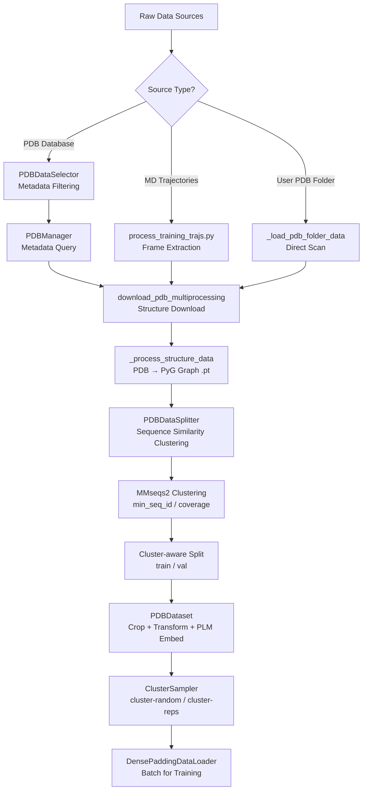
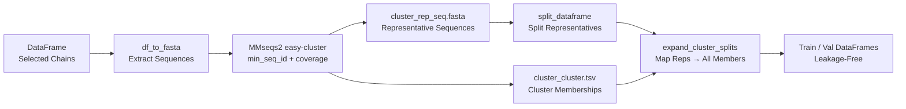

---
slug:11-data-preprocessing-and-pdb-selection
blog_type:normal
---


IDPFold2 的训练流程要求严格的多阶段数据预处理工作流，将原始结构数据库转换为具备集群感知和裁剪增强特性的 PyTorch Geometric 图。本页剖析了该工作流的三个基础支柱：**PDB 元数据过滤**（`PDBDataSelector`）、**序列相似度感知的数据划分**（`PDBDataSplitter` + MMseqs2），以及针对内禀无序蛋白（IDP）系综的**轨迹到结构提取**。这些组件共同确保训练数据既具备结构多样性，又在训练/验证集边界之间不存在信息泄漏。

## 预处理流程概览

从原始数据来源到可用于训练的数据加载器，端到端的流程遵循由 `PDBDataModule` 编排的确定性序列，包括选择、下载、处理、划分和加载阶段：



来源: [dataset.py](/src/data/dataset.py#L619-L1027), [process_training_trajs.py](/scripts/process_training_trajs.py#L19-L79), [cluster_utils.py](/src/utils/cluster_utils.py#L231-L288)

## 阶段 1：PDB 数据选择 —— 元数据过滤

`PDBDataSelector` 类对 PDB 数据库应用一系列级联的元数据过滤器，以构建蛋白质链候选集。它将所有元数据查询委托给 `PDBManager`（来自 `graphein_utils`），后者将 PDB REST API 和本地 RCSB PDB CSV 快照封装为可过滤的 pandas DataFrame。每个过滤器**按顺序**应用，逐步缩小候选池。

### 过滤流程与参数

| 参数 | 类型 | 默认值 | 过滤效果 |
|---|---|---|---|
| `fraction` | `float` | `1.0` | 对整个数据库进行随机子采样 |
| `min_length` / `max_length` | `int` | `None` | 链长范围（残基数） |
| `molecule_type` | `str` | `None` | 限制为 "protein"、"DNA" 等 |
| `experiment_types` | `List[str]` | `None` | 仅保留 X-ray、NMR、EM 等 |
| `oligomeric_min` / `oligomeric_max` | `int` | `None` | 寡聚态范围 |
| `best_resolution` / `worst_resolution` | `float` | `None` | 分辨率质量范围 (Å) |
| `has_ligands` | `List[str]` | `None` | 要求存在特定配体 |
| `remove_ligands` | `List[str]` | `None` | 排除含有特定配体的链 |
| `remove_non_standard_residues` | `bool` | `True` | 移除非标准氨基酸的链 |
| `remove_pdb_unavailable` | `bool` | `True` | 移除 PDB 文件不可用的链 |
| `remove_cath_unavailable` | `bool` | `False` | 移除无 CATH 分类的链 |
| `exclude_ids` | `List[str]` | `None` | 明确要排除的 PDB ID |
| `exclude_ids_from_file` | `str` | `None` | 包含要排除的 PDB ID 的文件 |

`create_dataset()` 方法按固定顺序链接每个过滤器：比例子采样 → 实验类型 → 最大长度 → 最小长度 → 分子类型 → 寡聚态 → 分辨率 → 配体存在/缺失 → 非标准残基 → PDB 可用性 → CATH 可用性 → 显式排除。每次过滤后，都会记录剩余的链数，为可重现性提供审计追踪。

<CgxTip>排除系统同时支持直接 ID 列表（`exclude_ids`）和基于文件的排除（`exclude_ids_from_file`），并通过集合并集自动去重。这对于在实验迭代中留出测试集结构或已知问题条目至关重要。</CgxTip>

来源: [dataset.py](/src/data/dataset.py#L37-L224), [graphein_utils.py](/src/utils/graphein_utils.py#L315-L388)

## 阶段 2：MD 轨迹处理 —— IDP 系综提取

IDPFold2 专为内禀无序蛋白设计，这类蛋白以构象系综而非单一静态结构的形式存在。`process_training_trajs.py` 脚本将 MD 模拟轨迹转换为离散的 PDB 帧，从而以结构多样性填充训练集。

### 两种提取模式

该脚本支持两种轨迹来源，每种来源具有各自的帧采样策略：

**AFCondense 模式**（`process_single_traj_afc`）：使用 `mdtraj` 加载 `.dcd` 轨迹，在整个轨迹中提取**50 个均匀间隔的帧**，并将每帧保存为名为 `{name}_f{index}.pdb` 的独立 PDB 文件。此模式会报告所有已处理轨迹中系统的最小和最大长度，用于诊断目的。

**IDRome 模式**（`process_single_structure_idrome`）：使用序列名称编码方案导航 IDRome v4 目录结构。seq_name 被拆分为多个组件，这些组件编码了一个 3 级嵌套目录路径，从中加载 `traj.xtc` 和 `top.pdb`。此模式每条轨迹提取**20 个均匀间隔的帧**。

两种模式均利用 `cpu_count()` 个工作进程的**多进程**（`mp.Pool`），并使用 `imap_unordered` 实现吞吐量最大化的并行提取。帧数（50 对 20）反映了每种数据源不同的模拟长度和存储考量。

来源: [process_training_trajs.py](/scripts/process_training_trajs.py#L53-L119)

## 阶段 3：结构下载与处理

在选择（或直接提供）之后，必须下载原始结构文件并将其转换为内部表示。`PDBDataModule.prepare_data()` 通过两个阶段对此进行编排。

### 下载阶段

`_download_structure_data()` 方法确定仍需下载的 PDB 编码（检查 `raw/` 目录中的现有文件），对列表进行去重，然后委派给 `graphein_utils` 中的 `download_pdb_multiprocessing()`。此下载器支持多种格式——`pdb`、`cif`、`mmtf`、`ent`——并使用分块多进程从 RCSB PDB 进行高吞吐量检索。

### 处理阶段 —— PDB 到 PyG 图

`_process_structure_data()` 方法通过 `_load_and_process_pdb()` 将每个原始结构文件转换为序列化的 PyTorch Geometric `Data` 对象。每个结构的处理流程为：

1. **解析**结构文件，使用 `graphein_utils` 中的 `protein_to_pyg()`，该函数通过 `read_pdb_to_dataframe()` 读取文件（支持使用 `cpdb`、`PandasMmcif` 或 `PandasMmtf` 的 PDB、mmCIF 和 MMTF 格式），选择链，去质子化，并将原子 DataFrame 转换为 `L × 37 × 3` 坐标张量。
2. **计算**坐标掩码（`coord_mask`），其中缺失原子（用 `1e-5` 填充）被标记为 `False`。
3. **编码**残基类型为整数索引，通过 `resname_to_idx` 映射完成。
4. **提取**残基 PDB 索引，从 `residue_id` 字符串格式（`chain:resname:number`）中获取。
5. **保存**处理后的图作为 `.pt` 文件至 `processed/` 目录。

此阶段同样使用带有 `Pool(processes=num_workers)` 和 `imap_unordered` 的多进程，分块处理结构以实现最佳吞吐量。

来源: [dataset.py](/src/data/dataset.py#L691-L882), [graphein_utils.py](/src/utils/graphein_utils.py#L704-L779)

## 阶段 4：序列相似度感知的数据划分

对蛋白质结构数据集进行朴素随机划分会导致**信息泄漏**——高度相似的序列同时出现在训练集和验证集中。IDPFold2 通过 `PDBDataSplitter` 进行集群感知划分来解决此问题，确保序列相似性集群的所有成员都驻留在同一划分中。

### 划分策略

| 策略 | `split_type` | 机制 | 泄漏风险 |
|---|---|---|---|
| 随机 | `"random"` | 带有随机种子的直接 `split_dataframe()` | 高 —— 相似序列可能跨越不同划分 |
| 序列相似度 | `"sequence_similarity"` | MMseqs2 聚类 → 集群级划分 → 扩展 | 无 —— 集群在划分中保持原子性 |

### 序列相似度划分工作流



序列相似度划分的执行步骤如下：

1. **FASTA 导出**：`df_to_fasta()` 将所有选定的链序列写入 FASTA 文件。
2. **MMseqs2 聚类**：`cluster_sequences()` 使用配置的 `min_seq_id`（例如 `0.9` 表示 90% 一致性）和 `coverage`（默认 `0.8`）参数调用 `mmseqs easy-cluster`。对于超大数据集，`efficient_linclust=True` 会切换至线性扩展的 `mmseqs easy-linclust` 算法。
3. **代表序列划分**：使用带有确定性种子（`seed=42`）的 `split_dataframe()` 将集群代表序列划分为训练/验证集。
4. **集群扩展**：`expand_cluster_splits()` 使用集群 TSV（将每个代表序列映射至其所有集群成员）将代表序列级的划分扩展为完整的成员级划分，确保集群完整性。

<CgxTip>默认训练配置使用 `split_sequence_similarity: 0.9`（90% 一致性），这相对宽松。对于序列多样性有限的 IDP 数据集，降低此阈值（例如降至 0.3）会创建更细粒度的集群和更严格的泄漏防范，代价是每个集群的训练集更小。</CgxTip>

来源: [dataset.py](/src/data/dataset.py#L227-L326), [cluster_utils.py](/src/utils/cluster_utils.py#L151-L369)

## 阶段 5：数据集构建 —— 裁剪、变换与多聚体组装

`PDBDataset` 是核心的 `torch.utils.data.Dataset` 子类，它加载已处理的 `.pt` 图并应用即时增强。其 `__getitem__` 方法实现了复杂的多路径逻辑：

### 单体与多聚体路径

对于每个样本，数据集首先通过 `process_single_chain()` 加载单链图。如果**复合体（多聚体）信息可用**（来自 `complex_contacts.csv` 文件）且随机抽取值低于 `complex_prop`（默认 `0.8`），数据集将：

1. 从 `complex_chains`（一个预构建的查找字典）中选择随机伴随链。
2. 通过 `concat_two_chains()` 加载并拼接伴随链。
3. 应用**空间裁剪**（50% 概率，以界面残基为中心）或**多链连续裁剪**（50% 概率）以达到 `crop_size`。

如果未选择伴随链（或不可用），则应用**单链连续裁剪**：选择一个包含 `crop_size` 个残基的随机连续窗口，并将残基 PDB 索引重新设定为从 1 开始。

### 坐标重排序

`process_single_chain()` 中的关键步骤是将坐标轴从 PDB 约定重排序至 OpenFold 约定：`graph.coords = graph.coords[:, PDB_TO_OPENFOLD_INDEX_TENSOR, :]`。这确保了原子排序与模型内部表示的一致性，后者遵循 OpenFold/AlphaFold2 的 atom37 布局，而非原始 PDB 原子排序。

### PLM 嵌入加载

当配置了 `plm_embedding` 时，数据集从 `.pt` 文件加载预计算的蛋白质语言模型嵌入（ESM-2）。命名约定因数据来源而异：IDRome 条目使用 `{name}_f0.pt`（在同一序列的所有帧间共享帧 0 嵌入），PDB 条目直接使用 PDB 编码，MDCATH 条目使用序列标识符。形状断言验证嵌入长度与坐标张量长度是否匹配。

来源: [dataset.py](/src/data/dataset.py#L329-L606)

## 阶段 6：数据变换 —— 旋转与填充增强

`transforms.py` 模块提供可组合的变换类，这些类作用于 PyG `Data` 对象。每个变换遵循 `BaseTransform` 模式，在应用修改之前浅拷贝数据，以防止原位变异。

| 变换 | 目的 | 关键参数 |
|---|---|---|
| `CopyCoordinatesTransform` | 在加噪前备份原始坐标 | None |
| `ChainBreakPerResidueTransform` | 通过 CA-CA 距离 > 4.0 Å 检测链断裂 | `chain_break_cutoff` |
| `PaddingTransform` | 将所有张量填充至统一的 `max_size` | `max_size`, `fill_value` |
| `GlobalRotationTransform` | 对坐标应用 SO(3) 均匀随机旋转 | `rotation_strategy` |

`GlobalRotationTransform` 使用 `scipy.spatial.transform.Rotation.random()` 从 SO(3) 中均匀采样，这保证了等变训练——模型必须学习旋转不变表示。`ChainBreakPerResidueTransform` 通过检查连续 Cα 原子是否超过距离阈值来识别肽链主链的不连续性，生成一个用作序列级特征的二值掩码。

来源: [transforms.py](/src/data/transforms.py#L1-L197)

## 阶段 7：集群感知采样与 DataLoader 构建

最后阶段通过 `PDBDataModule.get_train_dataloader()` 将划分后的数据集连接到训练循环，该函数使用 `ClusterSampler` 构建集群感知的数据加载器。

### 采样模式

| 模式 | 行为 | 适用场景 |
|---|---|---|
| `"random"` | 标准随机洗牌，无集群感知 | 小型数据集，无聚类 |
| `"cluster-reps"` | 始终从每个集群中采样代表（最长）序列 | 确定性，降低多样性 |
| `"cluster-random"` | 每个 epoch 从每个集群中随机采样一个成员 | **默认** —— 最大化集群内多样性 |

`ClusterSampler` 与 PyTorch 的分布式训练集成：当 `torch.distributed.is_initialized()` 时，它跨 rank 划分集群，并处理填充/丢弃以实现均匀整除。在非分布式模式下，它打乱集群顺序并根据所选模式每个集群产生一个样本。

数据加载器本身在 `batch_padding=True` 时使用 `DensePaddingDataLoader`，它将批次内长度可变的图填充至最大长度——这对于基于裁剪训练策略的高效 GPU 利用至关重要。

来源: [dataset.py](/src/data/dataset.py#L957-L1027), [cluster_utils.py](/src/utils/cluster_utils.py#L20-L148)

## 训练配置 —— 数据参数

`configs/train.yaml` 文件将所有数据预处理和加载参数整合在 `data:` 键下。IDPFold2 训练的默认配置为：

```yaml
data:
  data_dir: ./data/hybrid_train/
  plm_emb_dir: ./data/hybrid_train/embedding/
  complex_dir: ./data/hybrid_train/complex_contacts.csv
  complex_prop: 0.8          # 80% chance of multimer assembly
  crop_size: 256             # residues per crop
  format: "pdb"              # structure file format
  sampling_mode: "cluster-random"  # cluster-aware sampling
  max_length: 256            # maximum chain length
  train_val_prop: [0.99, 0.01]
  split_type: "sequence_similarity"
  split_sequence_similarity: 0.9  # 90% identity clustering
```

`split_sequence_similarity: 0.9` 设置创建了相对粗糙的集群——序列必须共享 ≥90% 的一致性才能被分到一组。`crop_size: 256` 结合 `max_length: 256` 意味着训练结构最多包含 256 个残基，并且裁剪主要作为多聚体尺寸控制机制，而非单体的长度缩减策略。

来源: [train.yaml](/configs/train.yaml#L32-L56)

## 整合全局 —— 端到端流程

从原始 PDB 数据库到训练批次的完整预处理生命周期遵循以下序列：

1. **`PDBDataSelector.create_dataset()`** —— 按元数据（长度、分辨率、寡聚态等）过滤 PDB 数据库，生成候选 DataFrame。
2. **`PDBDataModule.prepare_data()`** —— 下载缺失的结构，将每种结构解析为 `L × 37 × 3` 坐标张量，计算掩码和残基编码，保存为 `.pt` 文件。
3. **`PDBDataSplitter.split_data()`** —— 通过 MMseqs2 聚类序列，将集群代表序列划分为训练/验证集，并扩展至所有集群成员。
4. **`PDBDataModule.setup()`** —— 加载划分后的 DataFrame 和集群映射。
5. **`PDBDataset.__getitem__()`** —— 训练时：加载 `.pt` 图，可选组装多聚体，应用空间或连续裁剪，加载 PLM 嵌入，应用变换（旋转、填充）。
6. **`ClusterSampler`** —— 每 epoch 每集群产生一个样本，最大化结构多样性同时防止划分泄漏。

此架构确保每个训练批次包含结构多样、长度归一化、旋转增强的蛋白质图，且训练集与验证集之间不存在序列相似度泄漏——这是学习内禀无序蛋白可泛化构象分布的先决条件。

要了解这些预处理数据流如何连接到模型优化循环，请继续阅读[训练与微调工作流](12-training-and-fine-tuning-workflow)。关于补充集群感知采样的聚类数学和负载均衡损失，请参阅[负载均衡与 MoE 损失](13-load-balancing-and-moe-loss)。