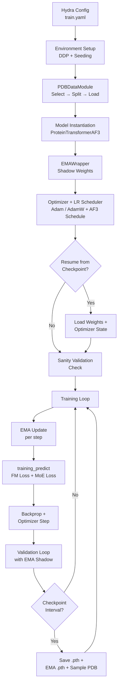
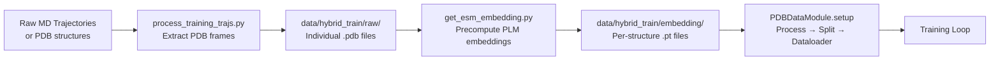

---
slug:12-training-and-fine-tuning-workflow
blog_type:normal
---


IDPFold2 通过 **ℝ³ 上的流匹配** 进行训练——这是一种生成式框架，通过沿插值路径预测速度场，学习将高斯噪声传输为蛋白质构象。训练流程由一个 Hydra 配置的入口点（`src/train.py`）统一编排，它将分布式数据并行、AlphaFold3 风格的学习率调度、指数移动平均（EMA）权重跟踪，以及结合了流匹配误差与混合专家负载均衡的复合损失串联在一起。本页将介绍完整的生命周期：从数据准备与配置，到训练循环内部机制，再到基于检查点的微调与验证时的结构生成。

来源: [train.py](/src/train.py#L1-L437), [train.yaml](/configs/train.yaml#L1-L124)

## 训练流水线架构

训练工作流遵循“顺序初始化 → 循环”模式，每个阶段建立在前一阶段之上。下图展示了高层的数据与控制流：



来源: [train.py](/src/train.py#L31-L196), [train.py](/src/train.py#L234-L410)

## 配置与启动

训练通过 Hydra 启动，Hydra 从 `configs/train.yaml` 组合出完整配置。入口点使用 `@hydra.main` 装饰，这意味着所有超参数都可以作为 `DictConfig` 对象访问，并可以从命令行覆盖。

```bash
# 单 GPU
python src/train.py

# 通过 torchrun 进行多 GPU 训练
torchrun --nproc_per_node=4 src/train.py

# 覆盖特定参数
python src/train.py model.nlayers=12 optimizer.lr=0.0002 epochs=1000
```

配置会在每次运行开始时自动保存到日志目录，确保完全的可复现性。下表总结了顶层的配置组：

| 配置项 | 用途 | 关键字段 |
|---|---|---|
| `task_prefix` | 日志目录的运行标识符 | `HYBRID_TRAIN` |
| `batch_size` | 每设备批次大小 | `8` |
| `epochs` | 总训练轮数 | `500` |
| `target_pred` | 流匹配参数化 | `v`（速度）或 `x_1`（干净预测） |
| `checkpoint_interval` | 保存间隔的轮数 | `2` |
| `seed` / `deterministic` | 可复现性控制 | `42` / `False` |
| `resume` | 检查点恢复路径 | `ckpt_dir`, `ema_dir`, `load_model_only` |
| `ema` | EMA 衰减与可变参数 | `decay: 0.999` |
| `noise` | 时间采样分布 | `mode: mix_up02_beta`, `p1: 1.9`, `p2: 1.0` |
| `loss` | 损失加权 | `moe_loss_weight: 0.3` |
| `data` | 数据集与 DataLoader 配置 | 见下方数据部分 |
| `model` | 架构超参数 | 见架构页面 |
| `optimizer` | 优化器与学习率调度 | 见下方优化器部分 |

来源: [train.py](/src/train.py#L31-L33), [train.yaml](/configs/train.yaml#L1-L124)

## 分布式训练设置

IDPFold2 通过 PyTorch 的 `DistributedDataParallel` (DDP) 支持**多节点、多 GPU 训练**。`DistWrapper` 工具读取由 `torchrun` 或类似启动器设置的标准环境变量（`RANK`、`LOCAL_RANK`、`WORLD_SIZE`、`LOCAL_WORLD_SIZE`），并将它们作为单例 `DIST_WRAPPER` 暴露出来。

初始化序列为：(1) 检测 CUDA 可用性并根据本地秩分配设备，(2) 如果 `world_size > 1`，则使用可配置的超时时间（通过 `NCCL_TIMEOUT_SECOND` 默认为 600 秒）初始化 NCCL 进程组，(3) 调用 `seed_everything` 以同步所有秩的随机种子。启用确定性模式时，会禁用 cuDNN 基准测试，设置 `cudnn.deterministic = True`，并配置 `CUBLAS_WORKSPACE_CONFIG` 以实现完全的可复现性——代价是吞吐量降低。

当 DDP 激活时，模型会使用 `DDP(model, device_ids=[local_rank], output_device=local_rank, static_graph=True)` 进行包装。`static_graph=True` 标志是一个重要的优化：它告知 DDP 计算图结构在迭代间不会改变，使其能够跳过每次前向传播中昂贵的图分析。

来源: [ddp_utils.py](/src/utils/ddp_utils.py#L1-L50), [train.py](/src/train.py#L46-L77), [train.py](/src/train.py#L130-L143)

## 数据流水线：从 PDB 到批次

数据流水线由三个类控制，形成一个“选择 → 划分 → 加载”的层级结构：

**`PDBDataSelector`** 根据元数据约束过滤结构——分子类型、实验类型、序列长度边界、寡聚态、分辨率范围以及配体存在情况。当 `molecule_type` 为 `null`（如在默认配置中）时，选择器将被完全跳过，流水线回退为加载 `data_dir/raw/` 目录中找到的所有 PDB 文件。

**`PDBDataSplitter`** 使用以下两种策略之一将数据集划分为训练/验证集：

| 划分类型 | 机制 | 适用场景 |
|---|---|---|
| `random` | 随机洗牌 + 按比例划分 | 快速实验 |
| `sequence_similarity` | 在相似度阈值下进行 MMseqs2 聚类，然后进行感知聚类的划分 | 防止同源物之间的数据泄露 |

默认配置使用 0.9（90% 一致性）的 `sequence_similarity`，以及 99%/1% 的训练/验证比例——这反映了蛋白质结构数据集的大规模特性，其中验证仅作为健全性检查而非模型选择。

**`PDBDataModule`** 编排整个流水线：它将原始 PDB 文件处理为 PyTorch Geometric 的 `Data` 对象（保存为 `.pt` 文件），支持多进程数据加载，并使用 `DensePaddingDataLoader` 构建用于批次填充的 `DataLoader`。默认应用两种变换：`GlobalRotationTransform`（通过均匀采样旋转矩阵进行 SO(3) 增强）和 `ChainBreakPerResidueTransform`（通过 CA-CA 距离 > 4.0 Å 指示链不连续性的二进制掩码）。`sampling_mode: "cluster-random"` 确保构建的批次能够采样多样的聚类，而不是过度代表任何单一的结构家族。

对于多聚体训练，`complex_dir` 参数指向指定链间接触的 CSV 文件，`complex_prop: 0.8` 控制在每个批次中采样复合物（多聚体）结构与单体结构的概率。

来源: [dataset.py](/src/data/dataset.py#L37-L224), [dataset.py](/src/data/dataset.py#L227-L326), [dataset.py](/src/data/dataset.py#L700-L758), [transforms.py](/src/data/transforms.py#L65-L196), [train.py](/src/train.py#L79-L123)

## 训练循环

### 损失计算：`training_predict`

核心训练步骤封装在 `training_predict` 中，执行以下序列：

1. **提取干净样本** — 从批次中提取 CA 坐标，从 Å 转换为 nm，并应用随机全局旋转以进行 SO(3) 等变训练。
2. **采样时间** — 抽取插值时间 `t ~ mix_up02_beta(1.9, 1.0)`，这是一个与 2% 均匀样本混合的 Beta(1.9, 1.0) 分布。这偏向于较晚的时间（更接近干净结构），同时保持对早期时间的覆盖。
3. **采样参考** — 从居中且已掩码的高斯参考分布中抽取 `x_0 ~ N(0, I)`。
4. **插值** — 计算 `x_t = (1 - t) * x_0 + t * x_1`，即标准的条件流匹配插值。
5. **模型前向传播** — 在带噪状态 `x_t` 上运行 `ProteinTransformerAF3`，以预测速度 `v` 或干净结构 `x_1`（由 `target_pred` 控制）。
6. **计算流匹配损失** — 主损失为时间加权 MSE：`loss = Σ(||x_1 - x_1_pred||² * mask) / (3 * nres) * 1/((1-t)² + ε)`。逆 `(1-t)²` 加权重强调了 `t=1`（干净结构）附近的准确性。
7. **计算 MoE 负载均衡损失** — 如果 `moe_loss_weight > 0`，则添加来自混合专家路由的辅助负载均衡损失。
8. **返回** — 总损失 `fm_loss + moe_loss` 以及用于记录的各单独损失组件字典。

### 自条件化

当 `self_conditioning=True` 时，模型执行初始前向传播（概率为 0.5）以生成初步预测 `x_sc`，然后将其作为额外输入反馈给第二次前向传播。这种受扩散模型中自条件化启发的技术，允许模型在训练期间迭代地细化其预测。

### 基序与 MoE 条件化

可以通过 `motif_conditioning` 和 `moe_conditioning` 启用两种可选的条件化机制。基序条件化使用 `SingleMotifFactory` 在生成其余部分时固定部分结构，`motif_prob` 控制保持固定的残基比例。MoE 条件化将不同的结构上下文路由到专门的专家网络。两者在基础配置中均默认为 `False`。

来源: [integral.py](/src/model/integral.py#L237-L319), [integral.py](/src/model/integral.py#L173-L199), [integral.py](/src/model/integral.py#L92-L117), [train.py](/src/train.py#L234-L283), [r3flow.py](/src/model/flow_matching/r3flow.py#L95-L124)

## 优化器与学习率调度

IDPFold2 支持两种优化器族，通过 `use_adamw` 选择：

| 优化器 | 行为 | 权重衰减策略 |
|---|---|---|
| **Adam** (默认) | 带均匀权重衰减的标准 Adam | 应用于所有参数 |
| **AdamW** | 带融合 CUDA 内核的解耦权重衰减 | 2D+ 参数衰减；偏置和 LayerNorm 参数排除 |

默认配置使用标准 Adam，`lr=1e-4`，`β=(0.9, 0.999)`，以及零权重衰减。

提供三种学习率调度器，通过 `lr_scheduler` 键选择：

| 调度器 | 调度配置 | 关键参数 |
|---|---|---|
| **`af3`** (默认) | 线性预热 → 阶梯衰减 | `warmup_steps=4000`, `decay_every_n_steps=80000`, `decay_factor=0.98` |
| **`cosine_annealing`** | 线性预热 → 余弦衰减 | `warmup_steps`, `decay_steps`, `min_lr` |
| **`constant`** | 固定学习率 | 无 |

**AlphaFold3 调度器**是默认选项，遵循 AlphaFold3 第 5.4 节中所述的调度：在预热期间，`lr = (step + 1) / (warmup_steps + 1) * base_lr`；预热之后，学习率每 `decay_every_n_steps` 步衰减 `decay_factor`，即 `lr = base_lr * decay_factor^(step // decay_every_n_steps)`。在默认设置下（4000 步预热，每 80K 步衰减 0.98），学习率遵循一个阶阶梯衰减模式，该模式已在蛋白质结构生成中得到经验验证。

来源: [optimizer.py](/src/model/optimizer.py#L63-L85), [optimizer.py](/src/model/optimizer.py#L163-L199), [optimizer.py](/src/model/optimizer.py#L202-L237), [train.py](/src/train.py#L156-L171)

## 指数移动平均 (EMA)

`EMAWrapper` 维护所有模型参数的影子副本，在每次训练步骤后通过以下公式更新：`shadow = (1 - decay) * param + decay * shadow`。当 `decay=0.999` 时，影子权重代表了大约最近 1000 步的指数平均，提供了模型更平滑的版本，通常能生成更高质量的结构。

每个轮次中，EMA 工作流分为三个阶段：

1. **训练** — 每次前向-反向步骤后调用 `ema_wrapper.update()`，将最新参数混合到影子权重中。
2. **验证** — `ema_wrapper.apply_shadow()` 用影子权重交换实时参数进行评估，之后 `ema_wrapper.restore()` 恢复为实时权重。
3. **检查点保存** — 保存时，应用影子权重，单独保存 EMA 检查点（仅包含 `model_state_dict`），随后进行恢复。

`mutable_param_keywords` 字段控制哪些参数接收 EMA 平均。默认包含一个空字符串 `[""]`，匹配所有参数名称——意味着每个参数都被 EMA 跟踪。要排除特定参数（例如位置嵌入），请将其名称前缀添加到列表中。

来源: [ema.py](/src/model/ema.py#L1-L49), [train.py](/src/train.py#L145-L153), [train.py](/src/train.py#L254-L255), [train.py](/src/train.py#L301-L332)

## 检查点与微调

### 保存检查点

检查点每 `checkpoint_interval` 个轮次（默认：2）保存一次，并在最后一个轮次结束时总是保存。持久化两种类型的检查点：

| 检查点类型 | 内容 | 文件名模式 |
|---|---|---|
| **完整** | `model_state_dict`, `optimizer_state_dict`, `scheduler_state_dict`, `epoch` | `epoch_{n}.pth` |
| **EMA** | `model_state_dict` (仅影子权重) | `_ema_{decay}_{n}.pth` |

此外，在每个检查点处，EMA 模型使用 `generating_predict` 通过对数调度 ODE 积分（`schedule_mode: "log"`，`schedule_p: 2.0`，`dt: 0.005`）生成 **5 个验证样本结构**。这些 PDB 文件保存到 `samples/` 目录，提供了训练进展的定性监控——你可以直观地检查生成的结构是否随轮次变得更加真实。

损失历史持续追加到 `loss.csv`，包含列 `Epoch`、`Loss`、`Val Loss`。

### 恢复训练

`resume` 配置块支持两种检查点来源：

- **`ckpt_dir`** — 完整检查点（优化器 + 调度器状态）。当 `load_model_only=False` 时，这会恢复精确的训练状态，包括轮次计数器、优化器动量以及学习率调度位置。当 `load_model_only=True` 时，仅加载模型权重——这是标准的**微调**模式，你希望从预训练模型开始，但使用全新的优化器状态（可能使用不同的学习率）。
- **`ema_dir`** — EMA 检查点（仅模型权重）。此检查点优先加载并重新注册 EMA 包装器，允许你从先前训练的影子状态继续跟踪 EMA。

加载顺序很重要：首先加载 EMA 检查点（如果提供），然后完整检查点覆盖模型权重。这意味着当两者都指定时，完整检查点优先。

```yaml
# 使用全新优化器从预训练检查点进行微调
resume:
  ckpt_dir: ./logs/HYBRID_TRAIN_2024-01-15/checkpoints/epoch_500.pth
  ema_dir: null
  load_model_only: True    # 为微调提供全新的优化器状态

# 从中断处完全恢复
resume:
  ckpt_dir: ./logs/HYBRID_TRAIN_2024-01-15/checkpoints/epoch_250.pth
  ema_dir: null
  load_model_only: False   # 恢复优化器 + 调度器状态
```

来源: [train.py](/src/train.py#L173-L195), [train.py](/src/train.py#L344-L407)

## 自定义数据集的预处理

当基于分子动力学 (MD) 模拟轨迹而非 PDB 结构进行训练时，`scripts/process_training_trajs.py` 工具将轨迹文件转换为适合训练流水线的单个 PDB 帧。它支持两种模式：

- **IDRome 轨迹** — 从 IDRome v4 数据库加载 XTC 轨迹，每条轨迹提取 20 个均匀间隔的帧。
- **任意 DCD 轨迹** — 加载带有独立拓扑 PDB 的 DCD 轨迹，提取 50 个均匀间隔的帧。

该脚本还包含（已注释掉的）用于计算 ESM-2 650M 嵌入（`esm2_t33_650M_UR50D`）的基础设施，这是模型序列特征编码所需的 `plm_emb` 输入。在生产环境中，应预计算嵌入并存储在由 `data.plm_emb_dir` 指定的目录中。

自定义训练运行的总体数据准备工作流如下：



来源: [process_training_trajs.py](/scripts/process_training_trajs.py#L1-L147), [get_esm_embedding.py](/scripts/get_esm_embedding.py#L1-L1)

## 关键训练参数摘要

下表整合了影响最大的训练超参数及其默认值和调整指南：

| 参数 | 默认值 | 效果 | 调整指南 |
|---|---|---|---|
| `batch_size` | 8 | 每 GPU 批次大小 | 如果 GPU 内存允许则增加以提高稳定性；使用 `crop_size` 降低 OOM 风险 |
| `epochs` | 500 | 总训练轮数 | 完整训练通常为 200-500；微调为 50-100 |
| `data.crop_size` | 256 | 每样本最大残基数 | 更长的链需要更多内存；256 是一个良好的平衡 |
| `data.max_length` | 256 | 过滤掉更长的结构 | 必须 ≥ `crop_size` |
| `data.complex_prop` | 0.8 | 采样多聚体的概率 | 设为 0.0 进行仅单体训练 |
| `optimizer.lr` | 1e-4 | 基础学习率 | 完整训练为 1e-4；微调为 1e-5 到 5e-5 |
| `optimizer.warmup_steps` | 4000 | 学习率预热时长 | 随数据集大小缩放；约 1-2 个轮次的步数 |
| `ema.decay` | 0.999 | EMA 平滑因子 | 长时间训练为 0.999；极长运行周期为 0.9999 |
| `loss.moe_loss_weight` | 0.3 | MoE 负载均衡权重 | 0.1-0.5 范围；过高会损害 FM 损失，过低会导致专家坍塌 |
| `noise.p1` / `noise.p2` | 1.9 / 1.0 | t 采样的 Beta 分布参数 | 偏向 t≈1；如果早期时间预测较差则进行调整 |

<CgxTip>对于流匹配训练，`target_pred: v` 参数化（速度预测）通常比 `x_1`（干净结构预测）更稳定，因为它避免了在从速度转换为干净预测时在 t=1 附近出现的 `1/(1-t)` 爆炸问题。</CgxTip>

<CgxTip>微调时，请始终设置 `resume.load_model_only: True` 并使用较低的学习率（1e-5 到 5e-5）以及较少的预热步数。这可以防止预训练阶段优化器累积的动量对已学习的特征造成破坏性更新。</CgxTip>

来源: [train.yaml](/configs/train.yaml#L1-L124), [train.py](/src/train.py#L1-L437)

## 验证与训练中采样

在每个轮次结束时，模型切换到评估模式并应用 EMA 影子权重。在整个验证集上使用相同的 `training_predict` 函数计算验证损失，但设置 `force_moe_capacity=False`——这在验证期间禁用专家容量限制，确保所有 token 均被处理，从而提供无偏的损失估计。

验证之后，如果 EMA 处于激活状态且正在保存检查点，一次小型生成运行会从最后的验证批次生成 5 个样本结构。这些结构通过 `generating_predict` 生成，该函数使用步长为 `dt=0.005` 的对数时间调度执行从 `t=0` 到 `t=1` 的完整 ODE 模拟。生成的坐标从 nm 转换回 Å（×10），并保存为名为 `val_{epoch}.pdb` 的 PDB 文件。这提供了模型在每个检查点是否生成物理合理结构的直接视觉检查。

来源: [train.py](/src/train.py#L287-L407), [integral.py](/src/model/integral.py#L322-L398)

## 接下来阅读什么

- 关于流匹配损失和插值方案的数学基础，请参阅 [Flow Matching on R³](5-flow-matching-on-r3)。
- 关于训练期间与 FM 损失相结合的 MoE 负载均衡损失，请参阅 [Load Balancing and MoE Loss](13-load-balancing-and-moe-loss)。
- 关于如何选择、过滤和划分训练数据的详细信息，请参阅 [Data Preprocessing and PDB Selection](11-data-preprocessing-and-pdb-selection)。
- 关于可配置参数的完整列表，请参阅 [Configuration Reference](16-configuration-reference)。