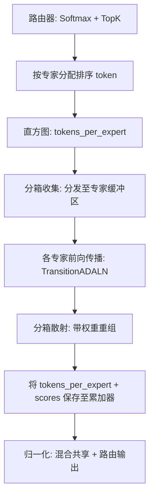
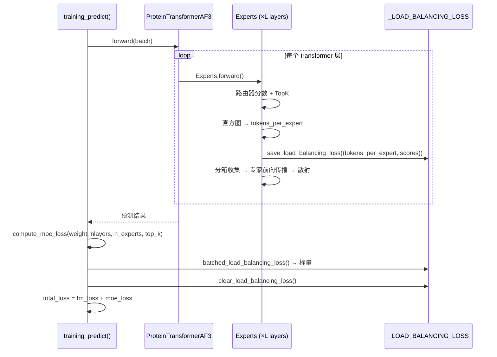

---
slug:13-load-balancing-and-moe-loss
blog_type:normal
---


IDPFold2 在其过渡层中采用了 **Mixture-of-Experts (MoE)** 架构，其中一项关键的辅助损失——负载均衡损失——用于防止路由器坍塌并确保专家的均衡利用。本页将剖析其数学公式、全局累积机制，以及在流匹配优化期间保持 MoE 子系统稳定的训练集成方式。

## 过渡层中的 MoE 架构

当 `use_moe=True` 时，[ProteinTransformerAF3](7-protein-transformer-network) 中的每个 Transformer 块会将其标准的 `TransitionADALN` 替换为 `MoE` 包装器。该 MoE 模块包含 **一个共享专家**（始终处于激活状态）以及 **N 个路由专家**（每个 token 激活排名前 K 的专家）。路由器由一个线性投影接 softmax 组成：

```
scores = Softmax(Linear(x))    # shape: [tokens, n_experts]
expert_weights, expert_indices = TopK(scores, k=n_activated_experts)
```

当 `normalize_expert_weights=True`（默认值）时，排名前 K 的权重会被重新归一化以使总和为 1，输出将共享专家与路由专家的结果进行混合：

$$x_{\text{out}} = \frac{x_{\text{shared}} + K \cdot x_{\text{routed}}}{K + 1}$$

这确保了无论 K 值如何，共享专家和 MoE 集成都能贡献均等。路由部分的计算是通过分箱收集 → 各专家前向传播 → 分箱散射的流水线，将 token 分配给其对应的专家，其中专家容量控制了单个专家最多可接收的 token 数。

来源: [moe_modules_torch.py](src/model/components/moe_modules_torch.py#L55-L93), [protein_transformer.py](src/model/protein_transformer.py#L210-L228)

## 负载均衡损失公式

若无辅助损失，路由器可能会退化至始终选择同一子集的专家——这种失效模式被称为**路由器坍塌**。负载均衡损失会对以下两者的相关性施加惩罚：(1) 路由至每个专家的 token 比例，以及 (2) 分配给每个专家的平均路由器概率。当各专家达到完美均衡时，该乘积最小化。

### 各层贡献

在每个 `Experts` 模块的前向传播过程中，会有两个量被记录到**全局累加器** `_LOAD_BALANCING_LOSS` 中：

| 量 | 形状 | 含义 |
|----------|------|---------|
| `tokens_per_expert` | `[n_experts]` | 分配给每个专家的 token 计数（排名前 K 索引的直方图） |
| `scores` | `[tokens, n_experts]` | 所有 token 的完整 softmax 路由器概率 |

它们通过 `save_load_balancing_loss()` 以元组 `(tokens_per_expert, scores)` 的形式存储，该函数会将其追加到模块级列表中。这种设计意味着该损失可以在**单次前向传播的所有 MoE 层中**进行累积，而无需显式的跨层连接。

### 批量聚合

在训练阶段，`batched_load_balancing_loss()` 将所有各层的贡献聚合为一个标量：

$$\mathcal{L}_{\text{balance}} = \frac{E \cdot w_{\text{moe}}}{L \cdot T \cdot K} \cdot \langle \mathbf{f}, \bar{\mathbf{p}} \rangle$$

其中：

| 符号 | 定义 |
|--------|-----------|
| $E$ | 专家数量 (`n_experts`) |
| $w_{\text{moe}}$ | 损失权重 (`moe_loss_weight`，默认为 0.3) |
| $L$ | Transformer 层数 (`nlayers`) |
| $T$ | 批次中的 token 数量 |
| $K$ | 每个 token 激活的专家数量 (`n_activated_experts`) |
| $\mathbf{f}$ | 所有层中每个专家的拼接 token 计数 |
| $\bar{\mathbf{p}}$ | 按层平均的路由器概率，跨专家拼接 |

缩放因子 $\frac{E}{L \cdot T \cdot K}$ 对损失进行归一化，使其对模型深度、专家数量、批次大小和 top-K **保持不变**——这使得 `moe_loss_weight` 在不同配置间可以直接对比。

<CgxTip>全局累加器模式 (`_LOAD_BALANCING_LOSS`) 意味着你**必须**在计算损失后调用 `clear_load_balancing_loss()`，以防止过期条目污染下一次前向传播。训练循环中的 `compute_moe_loss()` 会自动处理此操作。</CgxTip>

来源: [moe_modules_torch.py](src/model/components/moe_modules_torch.py#L9-L52), [integral.py](src/model/integral.py#L231-L234)

## 专家容量与 Token 路由

**专家容量**决定了在分箱收集/散射流水线中为每个专家分配的缓冲区大小：

$$\text{capacity} = \left\lfloor \text{capacity\_factor} \cdot \frac{K \cdot T}{E} \right\rfloor$$

这表示在均匀路由下每个专家的预期 token 数，并按 `capacity_factor`（默认 1.3）进行缩放。存在两种容量模式：

| 模式 | 触发条件 | 行为 |
|------|------|----------|
| `force_capacity=True` | 训练 | 容量上限设为 `min(max(tokens_per_expert), computed_capacity)` —— 防止溢出，但如果某个专家超载，可能会丢弃 token |
| `force_capacity=False` | 验证 / 推理 | 容量设为 `max(tokens_per_expert)` —— 不丢弃 token，动态分配 |

路由流水线本身遵循三个阶段：



在纯 PyTorch 后端（`moe_modules_torch.py`）中，排序使用 `torch.sort`，直方图使用 `torch.histc`；而 MegaBlocks 后端（`moe_modules.py`）则使用自定义 CUDA 核函数以实现更高吞吐量。活跃后端在导入时选定——`protein_transformer.py` 从 `moe_modules_torch` 导入。

来源: [moe_modules_torch.py](src/model/components/moe_modules_torch.py#L116-L222), [moe_operations.py](src/model/components/moe_operations.py#L1-L56)

## 训练集成

MoE 损失在 `training_predict()` 内部计算，并叠加到主流匹配损失上：

```python
# From integral.py training_predict()
fm_loss = compute_fm_loss(x_1, x_pred, t, mask)     # 主损失
moe_loss = compute_moe_loss(weight, n_layers, n_experts, top_k)  # 辅助损失
total_loss = fm_loss + moe_loss
```

函数 `compute_moe_loss()` 委托给 `batched_load_balancing_loss()`，随后调用 `clear_load_balancing_loss()` 以重置累加器。模型的 `nlayers`、`n_experts` 和 `top_k` 属性从 `ProteinTransformerAF3`（或其 DDP 包装的 `.module`）中读取，用于参数化缩放因子。

### 默认训练配置

| 参数 | 值 | 用途 |
|-----------|-------|---------|
| `use_moe` | `True` | 在过渡层中启用 MoE |
| `n_experts` | `5` | 每层的总路由专家数 |
| `n_activated_experts` | `2` | 每个 token 激活的 Top-K 专家数 |
| `capacity_factor` | `1.3` | 专家缓冲区超额配置 |
| `normalize_expert_weights` | `True` | 重新归一化 Top-K 权重 + 与共享专家混合 |
| `moe_loss_weight` | `0.3` | 辅助负载均衡损失的权重 |

<CgxTip>设置 `moe_loss_weight=0` 会完全禁用辅助损失（`batched_load_balancing_loss` 会提前返回 0.0），但 `save_load_balancing_loss` 的调用仍会执行。如果你想彻底消除此开销，请在 MoE 构造函数中设置 `load_balance=False`，这会在源头跳过累加器的写入操作。</CgxTip>

来源: [integral.py](src/model/integral.py#L294-L319), [train.yaml](configs/train.yaml#L29-L101), [protein_transformer.py](src/model/protein_transformer.py#L377-L399)

## 双后端：MegaBlocks vs 纯 PyTorch

IDPFold2 提供了两种外部接口一致但内部路由后端不同的 MoE 实现：

| 方面 | `moe_modules.py` (MegaBlocks) | `moe_modules_torch.py` (PyTorch) |
|--------|------|------|
| 排序 | `megablocks.ops.sort` (CUDA 核函数) | `torch.sort` |
| 直方图 | `megablocks.ops.histogram` (CUDA 核函数) | `torch.histc` |
| 累加和 | `megablocks.ops.inclusive_cumsum` | 不需要（分箱计算方式不同） |
| 收集/散射 | `megablocks.ops.binned_gather/scatter` | `moe_operations.py` 中的自定义 `binned_gather/binned_scatter` |
| 实际使用 | 可用但默认不被导入 | **活跃** —— 被 `protein_transformer.py` 和 `integral.py` 导入 |

MegaBlocks 后端需要编译的 CUDA 扩展（`megablocks/csrc/`），适用于核函数级优化至关重要的大规模分布式训练。PyTorch 后端在 `moe_operations.py` 中采用透明的基于索引的路由策略，通过 `torch.index_select` 和散射索引将 token 映射到专家大小的缓冲区——更易于调试，且对单节点训练已经足够。

来源: [moe_modules.py](src/model/components/moe_modules.py#L1-L8), [moe_operations.py](src/model/components/moe_operations.py#L1-L56)

## 路由器分数诊断

PyTorch 后端包含一个内置的诊断工具 `save_moe_router_scores()`，它将完整的 softmax 路由器概率矩阵以 CSV 格式写入磁盘（`./moe_router_scores.txt`）。该工具在默认的前向传播中被注释掉，但可以重新启用以分析专家特化模式——例如，识别某些专家是否始终接收来自特定结构模体（螺旋、折叠、环）的 token。该文件在每次调用时追加，因此会跨批次和跨周期累积。

来源: [moe_modules_torch.py](src/model/components/moe_modules_torch.py#L28-L31)

## 端到端损失流

在一个训练步中，MoE 负载均衡损失的完整生命周期如下：



这种设计清晰地将**累积阶段**（前向传播期间逐层进行）与**聚合阶段**（完整前向传播结束后统一进行）分离开来，从而避免了在模型层次结构中传递损失句柄的需要。