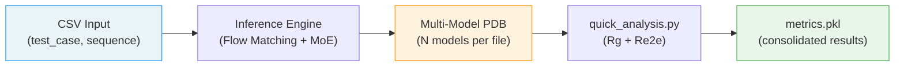
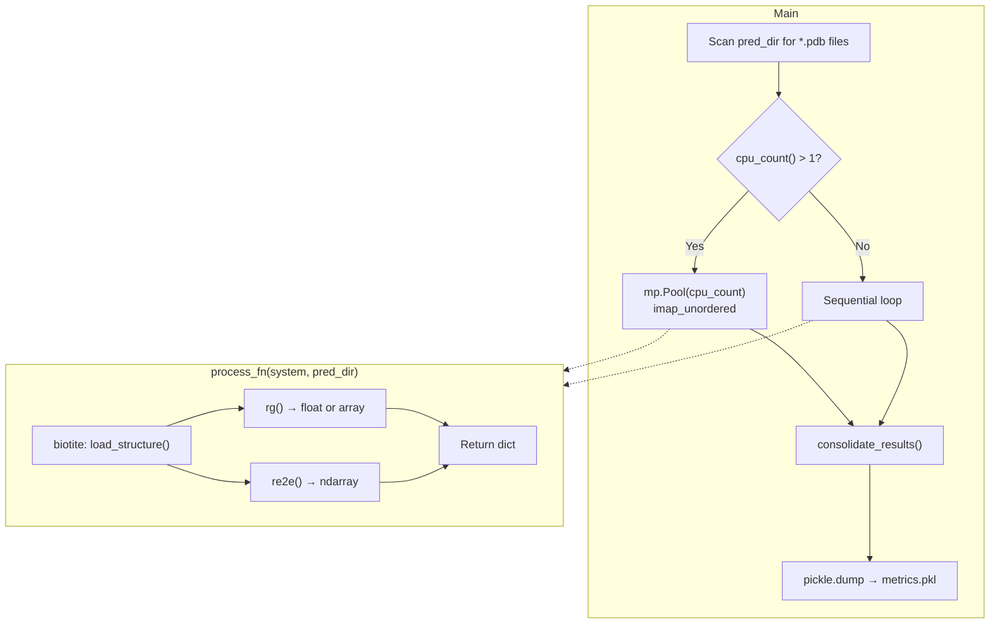

---
slug:14-quick-ensemble-analysis
blog_type:normal
---


IDPFold2 生成结构系综——即从学习到的流匹配分布中采样得到的构象集合——而非单一的静态预测。**快速系综分析**（Quick Ensemble Analysis）流水线可为这些系综提供即时、轻量级的表征，而无需进行全原子反向映射或依赖外部基准数据集。它会计算每个预测系统中每个构象的两个基本聚合物物理描述符——**回转半径**和**末端距**，汇总结果并将其序列化以供下游检查。本页涵盖快速分析脚本、其输入约定、计算的指标，以及如何在内在无序和多结构域蛋白质系综的语境下解读输出结果。

来源: [quick_analysis.py](scripts/quick_analysis.py#L1-L82), [inference.py](src/inference.py#L1-L379)

## 从推理到可分析的系综

在运行快速分析之前，你必须首先通过推理流水线生成系综。推理引擎生成**多模型 PDB 文件**——每个输入序列对应一个文件，其中每个 `MODEL` 块代表一个采样构象。默认配置为每个系统生成 100 个样本（`nsamples: 100`），不过可根据所需的系综覆盖率进行调整。每个 PDB 文件被写入日志目录的 `samples/` 子目录中，所有模型块从 1 开始按顺序索引。这种多模型 PDB 格式正是 `quick_analysis.py` 所期望的确切输入约定。



对于一个名为 `THB_C2` 且设置了 `nsamples=100` 的蛋白质，推理输出会生成一个包含 100 个 `MODEL` 块的 `THB_C2.pdb` 文件，每个块保存一个采样构象的 Cα 轨迹。快速分析脚本会扫描预测目录中的所有此类 `.pdb` 文件，并并行处理它们。

来源: [inference.py](src/inference.py#L331-L351), [inference.yaml](configs/inference.yaml#L8-L10), [pdb_utils.py](src/utils/pdb_utils.py#L21-L58)

## 运行快速分析

该脚本接受一个位置参数——即包含生成的多模型 PDB 文件的目录路径：

```bash
python scripts/quick_analysis.py /PATH/TO/GENERATED/ENSEMBLE
```

对于典型的推理运行，系综目录对应于日志目录内的 `samples/` 子目录。例如，如果推理运行时设置了 `logging_dir=./logs`，则系综文件位于 `./logs/MONOMER_INF_<timestamp>/samples/` 中。

来源: [quick_analysis.py](scripts/quick_analysis.py#L17-L19), [README.md](README.md#L332-L336)

## 计算的指标

快速分析流水线计算两个全局结构描述符，它们对于无序和多结构域蛋白质尤为具有信息量：

| 指标 | 符号 | 物理含义 | 计算方式 |
|--------|--------|-----------------|-------------|
| **回转半径** | Rg | 原子到质心的均方根距离；衡量构象的整体紧凑度 | `biotite.structure.gyration_radius()` — 对每个模型中的所有原子进行计算 |
| **末端距** | Re2e | 首尾 Cα 原子间的欧几里得距离；衡量链的延伸度 | 仅针对 Cα 原子计算 ∥coord\[0\] − coord\[N−1\]∥₂ |

**Rg** 捕获构象的整体空间范围。对于完全折叠的球状蛋白质，Rg 的标度约为 ~N^(1/3)；对于理想的无规线团（无序态），其标度约为 ~N^(1/2)。系综中 Rg 的分布直接揭示了蛋白质采样的是紧凑、延伸还是混合的构象态。

**Re2e** 专门度量 N 端和 C 端之间的分离距离。对于无序蛋白质，具有在大值处显著概率质量的宽 Re2e 分布表明呈延伸链行为，而在零附近出现窄峰则提示呈环状或发夹状构象。

<CgxTip>这两个指标均在每个多模型 PDB 文件中**逐模型**计算。对于 Rg，biotite 的 `gyration_radius` 作用于每个模型的完整原子数组。对于 Re2e，该函数首先过滤出 Cα 原子（`atom_name == 'CA'`），然后再计算 N 端到 C 端的距离，这使得它在处理多链结构时具有鲁棒性，避免了非 CA 原子对末端距测量的扭曲。</CgxTip>

来源: [quick_analysis.py](scripts/quick_analysis.py#L44-L68)

## 执行模型与并行机制

该脚本利用 Python 的 `multiprocessing.Pool` 并发处理所有 PDB 文件。此并行化策略简单直接，但对批量推理输出非常有效：



关键实现细节：脚本使用了 `imap_unordered` 而非 `imap` 或 `map`，这意味着只要任何工作进程完成，结果就会被产出——由于所有系统相互独立且处理时间随系综大小和链长而变化，此方式在这里是最优的。`tqdm` 进度条包裹了该迭代器以提供实时反馈。在单核机器上，脚本会退化为顺序迭代。

来源: [quick_analysis.py](scripts/quick_analysis.py#L17-L33)

## 输出格式

处理完所有系统后，脚本将各个结果字典合并为一个列表字典，并将其作为 Python pickle 文件（`metrics.pkl`）保存在预测目录中：

```python
# Structure of metrics.pkl
{
    'name':          ['THB_C2', 'Ubq2', ...],           # system identifiers
    'rg_predict':    [array([...]), array([...]), ...],  # Rg per model per system
    're2e_predict':  [array([...]), array([...]), ...],  # Re2e per model per system
}
```

`consolidate_results` 函数将系统维度的字典列表 `[{name: ..., rg_predict: ..., re2e_predict: ...}, ...]` 转置为指标维度的列表字典 `{name: [...], rg_predict: [...], re2e_predict: [...]}`。`rg_predict` 和 `re2e_predict` 中的每个条目都是一个 NumPy 数组，包含对应 PDB 文件中每个模型的值。

要以编程方式加载和检查结果：

```python
import pickle
import numpy as np

with open('/PATH/TO/ENSEMBLE/metrics.pkl', 'rb') as f:
    metrics = pickle.load(f)

for i, name in enumerate(metrics['name']):
    rg_vals = metrics['rg_predict'][i]
    re2e_vals = metrics['re2e_predict'][i]
    print(f"{name}: Rg = {np.mean(rg_vals):.2f} ± {np.std(rg_vals):.2f} Å, "
          f"Re2e = {np.mean(re2e_vals):.2f} ± {np.std(re2e_vals):.2f} Å")
```

<CgxTip>pickle 格式直接保留了 NumPy 数组，避免了 CSV 序列化带来的任何精度损失。然而，pickle 文件对 Python 版本敏感。如果需要跨语言或长期存档的兼容性，可考虑在加载后重新序列化为 NumPy 的 `.npz` 格式。</CgxTip>

来源: [quick_analysis.py](scripts/quick_analysis.py#L70-L33)

## 解读系综分布

Rg 和 Re2e 真正的分析能力并非仅源于其均值，而是源于它们在系综中的**联合分布**。请考虑以下解读模式：

| 分布模式 | Rg 表现 | Re2e 表现 | 结构解读 |
|---------------------|-------------|---------------|------------------------|
| **球状/折叠态** | 窄分布，低均值 | 窄分布，中等均值 | 单一主导构象 |
| **无序-延伸态** | 宽分布，高均值 | 宽分布，高均值 | 延伸链系综 |
| **熔球态** | 双峰或宽分布，中等均值 | 中等展宽 | 紧凑但无紧密堆叠 |
| **多结构域柔变** | 宽分布，中高均值 | 双峰（耦合/解耦） | 结构域取向变化 |
| **成环/塌缩态** | 中等，窄分布 | 窄分布，低均值 | 链端在空间上邻近 |

对于**多结构域蛋白质**——这是 IDPFold2 的一项关键能力——Rg 对结构域间的分离度敏感，而 Re2e 则捕获特定的 N 端到 C 端延伸度。例如，宽的 Rg 分布伴随双峰的 Re2e 分布，可能表明蛋白质在结构域耦合（紧凑）与解耦（延伸）状态之间交替——这是结构域柔性的标志。

来源: [quick_analysis.py](scripts/quick_analysis.py#L44-L68)

## 与深层基准流水线的关系

快速分析可对系综质量提供即时反馈，但其设计有意保持极简。若要针对参考数据进行严格的定量评估，IDPFold2 提供了两套基准测试套件：

- **[BioEmu 和 PeptoneBench 集成](15-bioemu-and-peptonebench-integration)**：通过二维投影和密度比较计算自由能面误差（MAE/RMSE，单位 kcal/mol）、针对参考结构的 RMSD 以及天然接触比例。BioEmu 流水线将系综投影到低维接触图特征上，并将预测的自由能面与 MD 模拟参考进行比较。PeptoneBench 流水线则针对实验可观测量（化学位移、PREs、RDCs、SAXS）执行积分重加权。

快速分析的指标可作为**初步健全性检查**：如果 Rg 或 Re2e 分布退化（零方差）或物理化学上不合理（例如，对于 100 个残基的蛋白质 Rg < 5 Å），则在投入更耗时的基准评估之前，可能需要对该系综进行调查。

| 分析级别 | 工具 | 指标 | 是否需要外部数据 | 开销 |
|---------------|------|---------|----------------------|------|
| **快速** | `quick_analysis.py` | Rg, Re2e | 否 | 秒级 |
| **BioEmu** | `analyze_md_emulation.py` | 自由能 MAE/RMSE, 覆盖度 | 参考投影 + 参数 | 分钟级 |
| **PeptoneBench** | `analyze_*_integrative.py` | 重加权 RMSE, ESS, χ² | 实验数据 (CS, PRE, RDC, SAXS) | 分钟至小时级 |

来源: [quick_analysis.py](scripts/quick_analysis.py#L1-L82), [analyze_md_emulation.py](benchmarks/bioemu-benchmark/analyze_md_emulation.py#L95-L144), [analyze_cs_integrative.py](benchmarks/peptonebench/analyze_cs_integrative.py#L140-L200)

## 扩展快速分析

`quick_analysis.py` 的模块化设计使得添加自定义指标非常简单。每个指标都是一个独立的函数，接受一个 `biotite.structure.AtomArray` 并返回一个标量或数组。要添加新指标——例如**非球面度**或**天然接触比例**——请遵循此模式：

```python
# Add a new metric function
def asphericity(structures):
    """Compute asphericity from the gyration tensor eigenvalues."""
    models = [structures] if structures.coord.ndim == 2 else structures
    asph = []
    for model in models:
        coords = model.coord - model.coord.mean(axis=0)
        gyration_tensor = np.einsum('ij,ik->jk', coords, coords) / len(coords)
        eigvals = np.sort(np.linalg.eigvalsh(gyration_tensor))
        l1, l2, l3 = eigvals
        asph.append(1.5 * (l1**2 + l2**2 + l3**2 - l1*l2 - l1*l3 - l2*l3) / (l1 + l2 + l3)**2)
    return np.array(asph)

# Register in process_fn
def process_fn(system, pred_dir):
    predict = strucio.load_structure(os.path.join(pred_dir, f'{system}.pdb'))
    return {
        'name': system,
        'rg_predict': rg(predict),
        're2e_predict': re2e(predict),
        'asphericity_predict': asphericity(predict),  # new metric
    }
```

`consolidate_results` 函数会自动处理添加到结果字典中的任何新键，因此无需进一步修改——新指标将无缝传播至 `metrics.pkl`。

来源: [quick_analysis.py](scripts/quick_analysis.py#L36-L74)

## 后续步骤

运行快速分析后，可根据你的评估需求考虑以下后续操作：

- 若需全原子结构（许多下游工具所需），请使用在 [单体与多聚体的推理](3-inference-for-monomers-and-multimers) 中文档化的反向映射流水线。
- 若要与 MD 参考数据或实验可观测量进行定量比较，请前往 [BioEmu 和 PeptoneBench 集成](15-bioemu-and-peptonebench-integration)。
- 若要了解系综的生成方式以及采样参数如何影响多样性，请查阅 [采样与引导策略](10-sampling-and-guidance-strategies)。