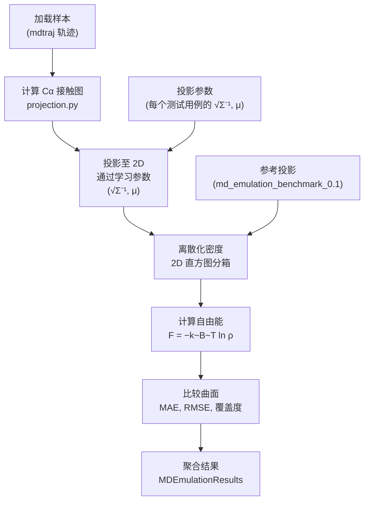
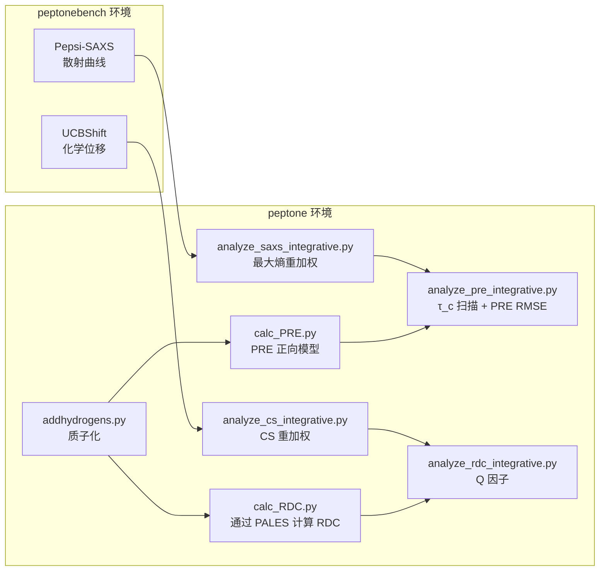

---
slug:15-bioemu-and-peptonebench-integration
blog_type:normal
---

IDPFold2 提供了两个互补的基准测试套件，用于根据已有的实验和模拟基线严格评估生成的蛋白质系综。**BioEmu** 通过低维投影和分布比较，评估采样得到的构象分布能否忠实地再现由分子动力学（MD）推导出的自由能面。**PeptoneBench** 利用最大熵重加权和正向模型一致性，针对真实的实验观测值（SAXS、化学位移、RDC 和 PRE）验证系综质量。两者共同构成了一个双轴评估体系：BioEmu 探究对模拟参考数据的*热力学保真度*，而 PeptoneBench 则探究系综平均观测值的*实验真实性*。

## BioEmu 基准测试：MD 模拟与多构象比较

BioEmu 基准测试套件通过两条独立的评估路径运作：**MD 模拟**（自由能面准确度）和**多构象比较**（针对多个参考状态的结构 RMSD）。这两条路径被编排为并行执行，并生成跨测试用例的聚合指标。

### MD 模拟流水线

MD 模拟基准测试量化了生成的系综再现参考分子动力学模拟的**自由能面**的程度。评估遵循“投影-比较”范式：将结构嵌入到低维接触图空间中，对其密度进行离散化，然后逐点比较自由能面。

入口点 `evaluate_md_emulation()` 接收一个以测试用例 ID 为键的 mdtraj 轨迹字典。它从绑定的 `md_emulation_benchmark_0.1` 资产目录中加载预计算的参考投影和投影参数，将样本投影到相同的 2D 空间中，并委派给 `compute_state_metrics()` 进行分布比较。结果被打包到 `MDEmulationResults` 数据类中，该数据类支持 `save_results()`（写入 CSV 指标和 NPZ 投影）和 `get_aggregate_metrics()`（返回平均 MAE、RMSE 和覆盖度）。

<CgxTip>`get_indexed_samples()` 函数使用具有 `os.cpu_count()` 个 worker 的 `multiprocessing.Pool` 来并行加载轨迹。在单 CPU 环境中，它会回退到顺序加载——这对于 I/O 占主导地位的大型基准测试集非常重要。</CgxTip>

来源: [analyze_md_emulation.py](/benchmarks/bioemu-benchmark/analyze_md_emulation.py#L95-L183), [utils.py](/benchmarks/bioemu-benchmark/utils.py#L1-L54)

### 投影机制：从接触图到潜空间

`projection.py` 中的投影流水线将原始 3D 结构转换为 2D 潜空间，在潜空间中可以有意义地比较自由能面。这是一个三阶段的过程：

| 阶段 | 操作 | 详情 |
|-------|-----------|---------|
| **特征提取** | Cα 接触图 | 从末端修剪 `n_trim` 个残基，计算 Cα 间距离，排除序列中 `exclude_neighbors` 范围内的相邻残基 |
| **接触图计算** | 指数核 | `feature = min(exp(−d_ij / d_eff), 1.0)`，其中 `d_eff = 0.8` nm；上三角提取移除冗余 |
| **线性投影** | 白化变换 | `projection = (features − μ) @ √Σ⁻¹`，使用来自参考 MD 的预拟合均值和平方根逆协方差 |

`ProjectionParameters` 数据类存储每个测试用例的 `sqrt_inv_cov` 矩阵和 `mean` 向量。`FeatureSettings` 类控制修剪（`n_trim=2`）、邻居排除（`exclude_neighbors=2`）和有效距离参数（`effective_distance=0.8`）。这种白化投影确保了 2D 自由能面能够捕捉在参考模拟中识别出的构象变异性的主要模式。

来源: [projection.py](/benchmarks/bioemu-benchmark/projection.py#L1-L152)

### 自由能面指标

`state_metric.py` 模块实现了核心的分布比较引擎。给定 2D 空间中的投影样本和参考，它计算三个指标：

| 指标 | 公式 | 解释 |
|--------|---------|----------------|
| **MAE** | `min_δ mean(|F_pred − F_ref + δ|)` | 自由能的平均绝对误差，通过二分法优化积分常数 δ |
| **RMSE** | `min_δ sqrt(mean((F_pred − F_ref + δ)²))` | 自由能的均方根误差，最优偏移 δ = mean(F_ref) − mean(F_pred) |
| **覆盖度** | `|common_mask| / |low_energy_mask|` | 具有对应样本密度的参考低能状态比例 |

`DistributionMetrics2D` 类实现了比较协议：(1) 使用高斯噪声（`n_resample=1,000,000` 个点，`σ=0.25`）对两种分布进行重采样，以保证分箱稳定性；(2) 在 50×50 网格上离散化；(3) 通过能量截断值（`4.0` kcal/mol）识别低能区域；(4) 将自由能计算为 `F = −k_BT ln(ρ)`，其中 `k_B = 0.001987` kcal/(mol·K)；(5) 使用优化后的全局偏移评估 MAE/RMSE。`score_nonzero()` 方法还会在参考和样本密度均非零的状态上计算覆盖度。

<CgxTip>4.0 kcal/mol 的 `energy_cutoff` 定义了热力学相关区域——参考中高于此阈值的状态将被排除在指标计算之外。收紧此截断值会使指标对主要自由能盆地更加敏感。</CgxTip>

来源: [state_metric.py](/benchmarks/bioemu-benchmark/state_metric.py#L1-L375)

### 多构象比较流水线

`compare_to_multi_conf.py` 脚本在五个子基准测试中，针对**多个不同的参考构象**评估生成的系综：

| 子基准测试 | 关注点 | 参考来源 |
|---------------|-------|-----------------|
| `crypticpocket` | 揭示隐藏口袋的构象变化 | 替代的结合/脱辅基状态 |
| `domainmotion` | 结构域间重排 | 结构域交换或旋转的构象异构体 |
| `localunfolding` | 局部二级结构转变 | 部分展开状态 |
| `ood60` | 分布外（60% 序列同一性） | 远缘同源物 |
| `oodval` | 分布外验证 | 留出的测试结构 |

对于每个测试用例，脚本执行以下操作：(1) 使用 Biotite 的 `align_optimal` 和标准蛋白质替换矩阵，在预测和参考之间进行序列比对；(2) 从指定比对和指标残基范围的 `local_residinfo` JSON 文件中选择锚点区域；(3) 在锚点残基上进行结构叠合；(4) 计算**局部 RMSD**（在锚点/指标区域上）和**全局 RMSD**（在叠合后的所有比对残基上）；(5) 使用 8.0 Å 的 Cα–Cα 距离阈值和邻居排除（±3 个残基）计算**接触分数**。详尽的 `RESI_THREE_TO_1` 字典（127 个条目）处理非标准残基名称，包括修饰的半胱氨酸、质子化状态和 D-型氨基酸。

来源: [compare_to_multi_conf.py](/benchmarks/bioemu-benchmark/compare_to_multi_conf.py#L128-L352)

## PeptoneBench：实验观测值验证

PeptoneBench 根据 PeptoneDB 中的**真实实验测量值**评估生成的系综，涵盖四个正交的生物物理可观测量。该工作流包含两个阶段：正向模型计算（通过上游 PeptoneBench 环境计算 SAXS 和化学位移）和整合分析（通过本地 `peptone` 环境进行重加权和指标计算）。

### 双环境架构

上游环境（来自 PeptoneBench 仓库的 `peptonebench` conda 环境）运行 UCBShift 和 Pepsi-SAXS 正向模型。本地环境（在 `env.yaml` 中定义的 `peptone` conda 环境）处理添加氢原子（通过 OpenMM/PDBFixer）、PRE 计算（通过 DEERPREdict）、RDC 计算（通过 PALES）以及所有整合重加权分析。外部工具依赖包括 SPARTA+、Pepsi-SAXS、Reduce、CSpred（带有 Dryad 托管的权重）和 PALES。

来源: [README4peptone.md](/benchmarks/peptonebench/README4peptone.md#L1-L225), [env.yaml](/benchmarks/peptonebench/env.yaml#L1-L20)

### 系综质子化：addhydrogens.py

在计算 PRE 或 RDC 之前，生成系综中的每一帧都必须在实验 pH 下进行**质子化**。`addhydrogens.py` 脚本从 PeptoneDB-Integrative 的 `info.csv` 文件中读取 pH 值（按蛋白质在各实验中取平均值），然后通过 OpenMM 的 `PDBFixer` 处理每一帧：寻找缺失的残基、寻找缺失的原子、添加缺失的原子，并在目标 pH 下添加缺失的氢原子。帧级处理使用 `multiprocessing.Pool` 在 `cpu_count() // 4` 个 worker 间并行化，每个 worker 将其质子化的 PDB 直接保存到磁盘以减轻内存压力。

来源: [addhydrogens.py](/benchmarks/peptonebench/addhydrogens.py#L26-L99)

### PRE 计算：calc_PRE.py

顺磁弛豫增强（PRE）测量自旋标记（通常为 MTSSL）与附近酰胺质子之间的距离。`calc_PRE.py` 脚本封装了 **DEERPREdict** 以计算每帧的 PRE 量：

- **r3/r6 矩**：由异构体库卷积得出的距离矩 `⟨r⁻³⟩` 和 `⟨r⁻⁶⟩`
- **角项**：来自自旋标记旋转自由度的序参数贡献
- **残基映射**：NaN 过滤后的逐残基分配

每个帧×位点的组合都在独立处理（唯一的 `tmp_site_{site}_frame_{frame}` 目录）中，以避免与 DEERPREdict 的文件写入行为发生竞争条件。结果通过跨有效帧拼接矩数组进行聚合，并保存为 `PREdata-{site}.npy`。MTSSL 异构体库默认为 `'MTSSL MMMx'`。

来源: [calc_PRE.py](/benchmarks/peptonebench/calc_PRE.py#L24-L155)

### RDC 计算：calc_RDC.py

残余偶极耦合（RDC）报告了键向量相对于部分取向张量的取向。`calc_RDC.py` 脚本使用**滑动窗口**方法逐残基调用 **PALES**：

对于每个残基 `i`，PALES 在窗口 `[i − w, i + w]` 内被调用，其中 `w = min(7, i − 1, N − i − 1)`，提供局部取向张量估计。脚本生成包含序列和 H-N 耦合的 PALES 输入文件，通过 `os.system` 执行 PALES，并从输出中解析该残基的预测 RDC。跨帧的结果被转置为 `(n_residues, n_frames)` 形状，并以残基序列号作为标签保存为 CSV。

来源: [calc_RDC.py](/benchmarks/peptonebench/calc_RDC.py#L21-L153)

### 最大熵重加权框架

整合分析脚本共享一个统一的**最大熵重加权**框架。给定一个具有均匀先验权重的系综，目标是找到非负权重，使其在接近先验的同时最小化与实验观测值的偏差。这被表述为一个**拉格朗日对偶优化**：

| 量 | 表达式 |
|----------|-----------|
| **目标** | `γ(λ) = ln Z(λ) + ½ α ‖λ‖²`，其中 `Z = Σᵢ exp(−λ · δᵢ)` |
| **梯度** | `∇γ = −⟨δ⟩_w + αλ`，其中 `⟨δ⟩_w` 为重加权后的可观测量平均值 |
| **权重** | `wᵢ = softmax(−λ · δᵢ)` |
| **RMSE** | `‖⟨δ⟩_w‖₂ / √n_obs` |
| **ESS** | `(Σwᵢ)² / Σ(wᵢ²)`（Kish 有效样本大小） |

**α 正则化参数**在对数网格上扫描（通常为从 `10⁻²` 到 `10⁷–10⁸` 的 64 个值）。**热启动**策略将 α 从最大（简单，接近均匀解）到最小（强重加权）排序，将每个解用作下一个的初始猜测。L-BFGS-B 优化器利用解析梯度提高效率。**ESS 阈值化**选择保持至少 `max(100, 0.1 × n_samples)` 个有效样本的最激进重加权。

来源: [analyze_saxs_integrative.py](/benchmarks/peptonebench/analyze_saxs_integrative.py#L88-L285), [analyze_cs_integrative.py](/benchmarks/peptonebench/analyze_cs_integrative.py#L26-L64)

### SAXS 整合分析

SAXS 分析（`analyze_saxs_integrative.py`）为每个蛋白质实现了完整流水线：(1) 从 Pepsi-SAXS CSV 输出中加载生成的 SAXS 曲线；(2) 从 `SAXS_bift.dat` 中加载实验 SAXS；(3) 使用 Svergun 强度缩放计算标准化残差 `δ = (c·I_gen − I_exp) / σ_exp`；(4) 使用热启动的 L-BFGS-B 运行 α 扫描重加权；(5) 通过 ESS 阈值选择最优 α；(6) 将先验 RMSE、后验 RMSE、最优 α、ESS 和完整权重数组保存为 `SAXSrew_{protein}.npy`。此处生成的权重数组将被下游 PRE 分析所使用。

来源: [analyze_saxs_integrative.py](/benchmarks/peptonebench/analyze_saxs_integrative.py#L181-L247)

### 化学位移整合分析

CS 分析（`analyze_cs_integrative.py`）在 SAXS 流水线基础上增加了两项关键改进：

**不确定性标准化**将 POTENCI 内在不确定性与预测器特定误差相结合，由 **g 得分**（序参数）调制：`σ = σ_POTENCI + (σ_predictor − σ_POTENCI) × (1 − g)`。具有高 g 得分（有序）的残基使用内在不确定性下限；无序残基的不确定性向预测器误差膨胀。UCBShift、SPARTA+ 和 ShiftX2 的不确定性映射按原子类型进行了硬编码。

**BMRB 过滤**移除超出该残基/原子类型的 BMRB 统计分布 `3σ` 范围的实验化学位移，防止异常测量值破坏重加权。

来源: [analyze_cs_integrative.py](/benchmarks/peptonebench/analyze_cs_integrative.py#L15-L209)

### PRE 整合分析

PRE 分析（`analyze_pre_integrative.py`）在 **SAXS 重加权系综**上操作，继承来自 `SAXSrew_{protein}.npy` 的权重。对于每个蛋白质：

1. **γ² 计算**：使用具有两个相关时间（全局 `τ_c` 和局部 `τ_t = 0.5 ns`）的谱密度模型，从 DEERPREdict 输出计算 PRE 速率
2. **强度转换**：使用实验类型特定公式（HSQC vs HMQC vs 原始 γ²）将 γ² 映射到可观测量 `I_para/I_dia` 比值
3. **τ_c 扫描**：在 1–20 ns 范围内的 20 个值上优化全局相关时间，选择使相对于实验强度的 RMSE 最小的 τ_c
4. **先验 vs 后验**：比较均匀权重（先验）和 SAXS 重加权（后验）的 RMSE

物理常数（`K_CONST = 1.23×10¹⁶ s⁻²`、来自 `PRE_MHz` 的拉莫频率、延迟和 R₂ 速率）与标准 PRE 实验参数相匹配。

来源: [analyze_pre_integrative.py](/benchmarks/peptonebench/analyze_pre_integrative.py#L12-L200)

### RDC 整合分析

RDC 分析（`analyze_rdc_integrative.py`）针对实验 H-N 耦合评估 **Cornilescu Q 因子**。它从 `CSrew_{protein}.npy`（而非 SAXS 重加权）加载 CS 重加权权重，将计算的 RDC 与实验残基索引对齐，并计算：

- **缩放因子** `s = Σ(cᵢ · eᵢ) / Σ(cᵢ²)`，限制在符号匹配的残基上
- **Q 因子** `Q = RMS(s·c − e) / RMS(e)`，带有 `s ≥ 0` 约束
- **先验 Q**：使用均匀权重（对非物理帧进行 NaN 掩码）
- **后验 Q**：使用 CS 重加权权重

¹⁵N 旋磁比的符号在解析期间通过将计算的 RDC 乘以 −1 来处理。

来源: [analyze_rdc_integrative.py](/benchmarks/peptonebench/analyze_rdc_integrative.py#L14-L130)

## 完整执行工作流

下表总结了完整的 PeptoneBench 执行序列、环境要求和输出产物：

| 步骤 | 脚本 | 环境 | 输入 | 输出 |
|------|--------|-------------|-------|--------|
| 1 | `run_forward_model.py -p UCBshift` | `peptonebench` | 系综 + PeptoneDB-CS | `UCBshift-{protein}.csv` |
| 2 | `run_forward_model.py -p Pepsi` | `peptonebench` | 系综 + PeptoneDB-SAXS | `Pepsi-{protein}.csv` |
| 3 | `addhydrogens.py` | `peptone` | 系综 + PeptoneDB-Integrative | 每帧质子化 PDB |
| 4 | `calc_PRE.py` | `peptone` | 质子化 PDB | 每个蛋白质的 `PREdata-{site}.npy` |
| 5 | `calc_RDC.py` | `peptone` | 质子化 PDB + PALES | 每个蛋白质的 `RDC.csv` |
| 6 | `analyze_saxs_integrative.py` | `peptone` | Pepsi 输出 + 实验 SAXS | `SAXSrew_{protein}.npy` |
| 7 | `analyze_cs_integrative.py` | `peptone` | UCBShift 输出 + 实验 CS + BMRB | `CSrew_{protein}.npy` |
| 8 | `analyze_pre_integrative.py` | `peptone` | SAXS 权重 + PRE 数据 + 实验 PRE | `PRE_analysis_{protein}.json` |
| 9 | `analyze_rdc_integrative.py` | `peptone` | CS 权重 + RDC 数据 + 实验 RDC | `RDC_analysis_{protein}.npy` |

注意**权重传播链**：SAXS 重加权（步骤 6）产生供 PRE 分析（步骤 8）使用的权重；CS 重加权（步骤 7）产生供 RDC 分析（步骤 9）使用的权重。必须遵循此执行顺序。

## 两基准测试的指标总结

| 基准测试 | 指标 | 单位 | 方向 | 衡量内容 |
|-----------|--------|------|-----------|-----------------|
| BioEmu (MD 模拟) | MAE | kcal/mol | ↓ | 自由能面逐点准确度 |
| BioEmu (MD 模拟) | RMSE | kcal/mol | ↓ | 自由能面平方偏差 |
| BioEmu (MD 模拟) | 覆盖度 | 分数 | ↑ | 被采样的参考状态比例 |
| BioEmu (多构象) | 局部 RMSD | Å | ↓ | 功能区域的结构准确度 |
| BioEmu (多构象) | 全局 RMSD | Å | ↓ | 整体结构准确度 |
| BioEmu (多构象) | 接触分数 | 分数 | ↑ | 天然接触保留度 |
| PeptoneBench (SAXS) | 先验/后验 RMSE | 无量纲 | ↓ | 散射曲线一致性 |
| PeptoneBench (CS) | 先验/后验 RMSE | 无量纲 | ↓ | 化学位移一致性 |
| PeptoneBench (PRE) | 先验/后验 RMSE | 无量纲 | ↓ | 顺磁强度一致性 |
| PeptoneBench (RDC) | 先验/后验 Q 因子 | 无量纲 | ↓ | 偶极耦合取向质量 |

有关运行输入这些基准测试的快速系综分析的更多详情，请参阅[快速系综分析](14-quick-ensemble-analysis)。有关控制系综生成的推理配置，请查阅[配置参考](16-configuration-reference)。