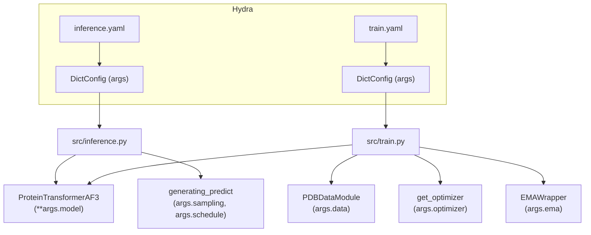

---
slug:16-configuration-reference
blog_type:normal
---


IDPFold2 采用 **Hydra** 和 **OmegaConf** 进行分层配置管理，提供了两个主要配置文件——`inference.yaml` 和 `train.yaml`——来控制所有的运行时行为。每个参数都在启动时通过 Hydra 的组合机制 (`@hydra.main`) 进行解析，且当前配置会自动序列化到日志目录下的 `config.yaml` 文件中，以确保完全的可复现性。本页为这两种配置模式、它们的共享子配置项以及消费各参数的代码路径，提供了完整的字段级参考。

来源: [inference.yaml](/configs/inference.yaml#L1-L103), [train.yaml](/configs/train.yaml#L1-L124)

## 配置架构

两个入口点在模块级别声明了其 Hydra 配置，将配置名绑定到相应的 YAML 文件上。随后，配置被解包为 `DictConfig` 并整体传递给构造函数——最关键的是 `ProteinTransformerAF3(**args.model)`——这意味着 `model` 命名空间下的每个键都直接映射为模型构造函数的参数。



`model` 子配置项在两种配置之间**结构完全相同**（仅 `training` 标志位不同），从而确保了训练和推理之间的架构一致性。推理配置额外提供了控制 ODE 积分循环的 `sampling` 和 `schedule` 子配置项，而训练配置则提供了 `noise`、`loss`、`data`、`optimizer`、`ema` 和 `resume` 子配置项。

来源: [inference.py](/src/inference.py#L176-L177), [train.py](/src/train.py#L31-L32)

## 顶层推理参数

这些参数控制着从数据加载到结构生成的推理管线。

| 参数 | 类型 | 默认值 | 描述 |
|-----------|------|---------|-------------|
| `prefix` | str | `"DEFAULT"` | 日志目录前缀。最终的日志目录为 `{logging_dir}/{prefix}_INF_{timestamp}`。 |
| `csv_dir` | str\|null | `null` | **必填。** 包含测试用例的 CSV 文件路径（列：`test_case`，`sequence`）。 |
| `plm_emb_dir` | str\|null | `null` | **必填。** 预计算的 ESM-2 嵌入（`.pt` 文件）目录。如果缺失，则即时生成嵌入。 |
| `nsamples` | int | `100` | 每个输入序列要生成的结构样本数。 |
| `max_batch_length` | int | `3500` | 内存自适应批处理：`nsamples_per_batch = max_batch_length // nres`。请根据 GPU 显存进行调整。 |
| `dt` | float | `0.005` | 流匹配模拟的 ODE 积分步长。 |
| `target_pred` | str | `"v"` | 网络预测目标：`"v"` 代表速度场，`"x_1"` 代表纯净结构。 |
| `ckpt_dir` | str\|null | `null` | **必填。** 模型检查点文件（`.pth`）的路径。 |
| `ag_dir` | str\|null | `null` | 自引导检查点的路径。仅在 `autoguidance_ratio > 0` 时必填。 |
| `load_multimer` | bool | `False` | 设为 `True` 以进行多聚体推理（CSV 中为冒号分隔的序列）。 |
| `num_workers` | int | `6` | DataLoader 工作线程数。 |
| `seed` | int | `42` | 用于可复现性的随机种子。 |
| `deterministic` | bool | `False` | 如果为 `True`，强制执行确定性 CUDA 操作。 |
| `logging_dir` | str | `"./logs"` | 日志和生成 PDB 文件的根目录。 |

### 条件标志

| 参数 | 类型 | 默认值 | 描述 |
|-----------|------|---------|-------------|
| `motif_conditioning` | bool | `False` | 启用基于基序的部分结构条件。 |
| `moe_conditioning` | bool | `False` | 启用 MoE 专家路由条件。 |
| `self_conditioning` | bool | `False` | 启用自条件：将先前的预测重新注入作为额外输入。 |

来源: [inference.yaml](/configs/inference.yaml#L1-L30), [inference.py](/src/inference.py#L219-L304)

## 顶层训练参数

这些参数控制着训练循环、检查点保存以及分布式数据并行执行。

| 参数 | 类型 | 默认值 | 描述 |
|-----------|------|---------|-------------|
| `task_prefix` | str | `"HYBRID_TRAIN"` | 日志目录前缀。最终的日志目录为：`{logging_dir}/{task_prefix}_{timestamp}`。 |
| `batch_size` | int | `8` | 单设备批大小。有效批大小 = `batch_size × world_size`。 |
| `epochs` | int | `500` | 总训练轮数。 |
| `target_pred` | str | `"v"` | 网络预测目标（与推理相同）。 |
| `checkpoint_interval` | int | `2` | 每隔 N 个轮数保存一次检查点。 |
| `seed` | int | `42` | 随机种子，在所有 DDP 进程间同步。 |
| `deterministic` | bool | `False` | 强制执行确定性操作。 |
| `logging_dir` | str | `"./logs"` | 日志、检查点和样本 PDB 的根目录。 |

训练也支持与推理相同的三种条件标志（`motif_conditioning`、`moe_conditioning`、`self_conditioning`），默认值为 `False`。

来源: [train.yaml](/configs/train.yaml#L1-L13), [train.py](/src/train.py#L74-L77)

## 采样配置（仅限推理）

`sampling` 子配置项控制结构生成期间的 ODE/SDE 积分策略。它作为 `sampling_args` 直接传递给 `generating_predict`。

| 参数 | 类型 | 默认值 | 描述 |
|-----------|------|---------|-------------|
| `sampling_mode` | str | `"vf"` | 积分模式：`"vf"` 代表确定性向量场 ODE，`"sc"` 代表带噪声注入的随机基于分数的 SDE。 |
| `sc_scale_noise` | float | `0.0` | 当 `sampling_mode == "sc"` 时的噪声缩放。乘以维纳过程项。 |
| `sc_scale_score` | float | `1.0` | 当 `sampling_mode == "sc"` 时的分数缩放。尚未完全实现。 |
| `gt_mode` | str | `"1/t"` | 噪声调度函数 g(t)：`"1/t"`、`"us"` 或 `"tan"`。控制扩散系数的幅度。 |
| `gt_p` | float | `1.0` | g(t) 的乘法缩放参数。 |
| `gt_clamp_val` | float\|null | `null` | g(t) 的上限截断值。设为 `null` 表示无截断，或设为浮点数（例如 `10.0`）。 |

<CgxTip>当 `sampling_mode` 为 `"vf"`（默认值）时，只有 `gt_mode`、`gt_p` 和 `gt_clamp_val` 会影响模拟调度。`sc_scale_noise` 和 `sc_scale_score` 参数仅在选择 `"sc"` 模式时激活，从而以结构精度为代价实现随机采样以提升多样性。</CgxTip>

来源: [inference.yaml](/configs/inference.yaml#L32-L38), [integral.py](/src/model/integral.py#L386-L393), [r3flow.py](/src/model/flow_matching/r3flow.py#L240-L322)

## 调度配置（仅限推理）

`schedule` 子配置项控制 ODE 积分的时间步调度，决定积分时间 `t` 如何从 0 推进到 1。它作为 `schedule_args` 传递给 `generating_predict`。

| 参数 | 类型 | 默认值 | 描述 |
|-----------|------|---------|-------------|
| `schedule_mode` | str | `"log"` | 时间离散化方案：`"log"` 表示对数间隔（在 t=0 附近分辨率更高），`"linear"` 表示均匀间隔。 |
| `schedule_p` | float | `2.0` | 控制时间步密度的调度指数。较高的值会将时间步集中在 ODE 较僵硬的 t=0 附近。 |

来源: [inference.yaml](/configs/inference.yaml#L40-L42), [integral.py](/src/model/integral.py#L386-L387)

## 引导配置（仅限推理）

无分类器引导和自引导参数控制推理时结构保真度与多样性之间的权衡。

| 参数 | 类型 | 默认值 | 描述 |
|-----------|------|---------|-------------|
| `guidance_weight` | float | `1.0` | 引导强度。`1.0` 禁用引导（标准采样）。大于 1.0 的值会放大条件信号以获得更清晰的结构。 |
| `autoguidance_ratio` | float | `0.0` | CFG 与自引导在 [0, 1] 之间的混合比例。`0.0` = 纯 CFG，`1.0` = 纯自引导。 |
| `autoguidance_ckpt_path` | str\|null | `null` | 自引导模型检查点的路径。当 `autoguidance_ratio > 0` 时必填。 |

组合预测为：`x_pred = w × x_cond + (1-w) × [α × x_ag + (1-α) × x_uncond]`，其中 `w` = `guidance_weight`，`α` = `autoguidance_ratio`。

来源: [inference.yaml](/configs/inference.yaml#L44-L46), [integral.py](/src/model/integral.py#L64-L86)

## 模型配置（共享）

`model` 子配置项定义了 ProteinTransformerAF3 架构。它在 `inference.yaml` 和 `train.yaml` 之间**共享**，仅 `training` 标志位的值有所不同。所有键都作为 `**kwargs` 传递给 `ProteinTransformerAF3.__init__`。

### 核心架构

| 参数 | 类型 | 默认值 | 描述 |
|-----------|------|---------|-------------|
| `training` | bool | `True`/`False` | **区分训练与推理。** 影响 MoE 负载均衡（仅在训练期间启用）。 |
| `token_dim` | int | `768` | 每残基 token 表示的维度。 |
| `nlayers` | int | `10` | Transformer 主干层数。 |
| `nheads` | int | `12` | 注意力头数。`token_dim` 必须能被 `nheads` 整除。 |
| `residual_mha` | bool | `True` | 多头注意力周围的残差连接。 |
| `residual_transition` | bool | `True` | 转换层周围的残差连接。 |
| `parallel_mha_transition` | bool | `False` | AF3 风格的 MHA 与转换层并行计算（相加）。如果为 `True` 且两者残差均为 `True`，则转换层的残差会自动禁用，以防重复计算。 |
| `use_attn_pair_bias` | bool | `True` | 使用对表示来偏置注意力 logits（PairBiasAttention）。 |

### 特征规格

| 参数 | 类型 | 默认值 | 描述 |
|-----------|------|---------|-------------|
| `strict_feats` | bool | `False` | 如果为 `False`，缺失的特征将用默认值填充。如果为 `True`，缺失特征将引发错误。 |
| `feats_init_seq` | list[str] | `["plm_emb", "res_type", "res_idx", "chain_break_per_res"]` | 构成初始 token 表示的序列特征。 |
| `feats_cond_seq` | list[str] | `["time_emb"]` | 构成 AdaptiveLayerNorm 条件向量的序列特征。 |
| `feats_pair_repr` | list[str] | `["xt_pair_dists", "rel_pos"]` | 构成初始对表示的特征。 |
| `feats_pair_cond` | list[str] | `["time_emb"]` | 用于通过 AdaptiveLayerNorm 进行对表示条件的对特征。 |

### 特征维度

| 参数 | 类型 | 默认值 | 描述 |
|-----------|------|---------|-------------|
| `t_emb_dim` | int | `256` | 正弦时间嵌入的维度。 |
| `idx_emb_dim` | int | `128` | 残基索引嵌入的维度。 |
| `dim_cond` | int | `512` | AdaptiveLayerNorm 条件向量的维度。 |
| `plm_in_dim` | int | `1280` | PLM 嵌入的输入维度（ESM-2 t33 输出维度）。 |
| `plm_out_dim` | int | `256` | 投影后的 PLM 嵌入维度。 |
| `xt_pair_dist_dim` | int | `64` | 含噪坐标 x_t 的对距离直方图的距离分箱数。 |
| `xt_pair_dist_min` | float | `0.1` | 分箱的最小逐对距离（nm）。 |
| `xt_pair_dist_max` | float | `3.0` | 分箱的最大逐对距离（nm）。 |
| `r_max` | int | `32` | 相对位置编码的最大相对序列位置。 |
| `pair_repr_dim` | int | `512` | 最终对表示的维度。 |
| `num_registers` | int | `10` | 前置于序列的寄存器 token 数量。设为 `0` 以禁用。 |
| `use_qkln` | bool | `True` | 在注意力内部应用 QK LayerNorm 以提升训练稳定性。 |

### 混合专家

| 参数 | 类型 | 默认值 | 描述 |
|-----------|------|---------|-------------|
| `use_moe` | bool | `True` | 启用 MoE 转换层。如果为 `False`，则使用单个 `TransitionADALN`。 |
| `n_experts` | int | `5` | 每层的专家网络总数。 |
| `n_activated_experts` | int | `2` | 每个 token 激活的 Top-K 专家（路由）。 |
| `dim_moe_cond` | int | `0` | MoE 路由器条件的维度。`0` 表示无条件。 |
| `capacity_factor` | float | `1.3` | 用于负载均衡路由的专家容量因子。 |
| `normalize_expert_weights` | bool | `True` | 跨被激活专家归一化路由器权重。 |

来源: [inference.yaml](/configs/inference.yaml#L48-L101), [train.yaml](/configs/train.yaml#L58-L101), [protein_transformer.py](/src/model/protein_transformer.py#L322-L403)

## 噪声配置（仅限训练）

`noise` 子配置项控制训练期间插值时间 `t` 的采样分布，直接影响 t∈[0,1] 区间内的流匹配损失加权。

| 参数 | 类型 | 默认值 | 描述 |
|-----------|------|---------|-------------|
| `mode` | str | `"mix_up02_beta"` | 时间采样分布。选项：`"uniform"`、`"logit-normal"`、`"beta"`、`"mix_up02_beta"`。 |
| `p1` | float | `1.9` | 第一形状参数。对于 `"beta"`/`"mix_up02_beta"`：Beta(α=p1, β=p2)。对于 `"logit-normal"`：logit-normal 的均值。 |
| `p2` | float | `1.0` | 第二形状参数。对于 `"beta"`/`"mix_up02_beta"`：Beta(α=p1, β=p2)。对于 `"logit-normal"`：标准差。对于 `"uniform"`：t_max 缩放。 |

默认的 `"mix_up02_beta"` 模式从 Beta(1.9, 1.0) 分布中采样，并以 2% 的概率替换为均匀采样，从而覆盖流匹配权重 `1/(1-t)²` 发散的 t≈1 区域。

来源: [train.yaml](/configs/train.yaml#L24-L27), [integral.py](/src/model/integral.py#L92-L117)

## 损失配置（仅限训练）

| 参数 | 类型 | 默认值 | 描述 |
|-----------|------|---------|-------------|
| `moe_loss_weight` | float | `0.3` | MoE 负载均衡辅助损失的权重。总损失 = `fm_loss + moe_loss_weight × moe_loss`。 |

来源: [train.yaml](/configs/train.yaml#L29-L30), [integral.py](/src/model/integral.py#L297-L313)

## 数据配置（仅限训练）

`data` 子配置项配置 PDB 数据管线、分割策略以及 DataLoader 行为。

| 参数 | 类型 | 默认值 | 描述 |
|-----------|------|---------|-------------|
| `data_dir` | str | `"./data/hybrid_train/"` | 包含 PDB 文件的根目录。 |
| `plm_emb_dir` | str | `"./data/hybrid_train/embedding/"` | 预计算 PLM 嵌入的目录。 |
| `complex_dir` | str | `"./data/hybrid_train/complex_contacts.csv"` | 用于多聚体训练的复合体接触 CSV 的路径。 |
| `complex_prop` | float | `0.8` | 每个批次中多聚体复合体样本的比例（混合单体/多聚体训练）。 |
| `crop_size` | int | `256` | 每次裁切的残基数（针对长链的空间裁切）。 |
| `format` | str | `"pdb"` | 输入文件格式。 |
| `overwrite` | bool | `False` | 覆盖现有的已处理数据文件。 |
| `batch_padding` | bool | `True` | 将批次填充至统一长度。 |
| `sampling_mode` | str | `"cluster-random"` | 数据采样策略：感知聚类的随机采样。 |
| `num_workers` | int | `6` | DataLoader 工作线程数。 |
| `pin_memory` | bool | `True` | 锁页内存以加速 GPU 传输。 |
| `fraction` | float | `1.0` | 使用的数据集比例。 |
| `molecule_type` | str\|null | `null` | 按分子类型过滤。`null` = 无过滤。 |
| `experiment_types` | str\|null | `null` | 按实验类型过滤（例如 X-RAY DIFFRACTION）。 |
| `min_length` | int\|null | `null` | 最小残基数过滤。 |
| `max_length` | int | `256` | 最大残基数过滤。 |
| `oligomeric_min` | int\|null | `null` | 最小低聚态过滤。 |
| `oligomeric_max` | int\|null | `null` | 最大低聚态过滤。 |
| `best_resolution` | float\|null | `null` | 最佳（最小）分辨率阈值。 |
| `worst_resolution` | float\|null | `null` | 最差（最大）分辨率阈值。 |
| `train_val_prop` | list[float] | `[0.99, 0.01]` | 训练/验证集划分比例。 |
| `split_type` | str | `"sequence_similarity"` | 划分策略：基于序列相似性的聚类。 |
| `split_sequence_similarity` | float | `0.9` | 用于划分聚类的序列相似性阈值。 |
| `overwrite_sequence_clusters` | bool | `False` | 强制重新计算序列聚类。 |

来源: [train.yaml](/configs/train.yaml#L32-L56), [train.py](/src/train.py#L79-L120)

## 优化器配置（仅限训练）

| 参数 | 类型 | 默认值 | 描述 |
|-----------|------|---------|-------------|
| `lr` | float | `0.0001` | 基础学习率。 |
| `weight_decay` | float | `0.0` | L2 权重衰减。 |
| `beta1` | float | `0.9` | Adam β₁（梯度动量）。 |
| `beta2` | float | `0.999` | Adam β₂（方差动量）。 |
| `use_adamw` | bool | `False` | 如果为 `True`，使用具有解耦权重衰减和选择性 2D 张量衰减的 AdamW；如果为 `False`，使用标准 Adam。 |
| `lr_scheduler` | str | `"af3"` | 学习率调度器类型。`"af3"` 使用带线性预热的 AlphaFold3 步衰减调度器。 |
| `warmup_steps` | int | `4000` | 线性学习率攀升的预热步数。 |
| `decay_every_n_steps` | int | `80000` | 乘性学习率衰减的步间隔。 |
| `decay_factor` | float | `0.98` | 每个间隔应用的乘性衰减因子。 |

<CgxTip>默认的 `"af3"` 调度器实现了 AlphaFold3 学习率调度：在 `warmup_steps` 内线性预热，然后进行步衰减，即 `lr = base_lr × decay_factor^(step // decay_every_n_steps)`。这不同于余弦退火，它提供了更平缓、可控的衰减。</CgxTip>

来源: [train.yaml](/configs/train.yaml#L103-L112), [optimizer.py](/src/model/optimizer.py#L63-L85), [optimizer.py](/src/model/optimizer.py#L163-L188)

## EMA 配置（仅限训练）

指数移动平均通过维护影子参数来提供更稳定的推理检查点。

| 参数 | 类型 | 默认值 | 描述 |
|-----------|------|---------|-------------|
| `decay` | float | `0.999` | EMA 衰减率。设为 `0` 以完全禁用 EMA。 |
| `mutable_param_keywords` | list[str] | `[""]` | 用于匹配参数名以进行 EMA 跟踪的关键词。`[""]` 会跟踪所有参数。 |

来源: [train.yaml](/configs/train.yaml#L20-L22), [train.py](/src/train.py#L145-L153)

## 恢复配置（仅限训练）

| 参数 | 类型 | 默认值 | 描述 |
|-----------|------|---------|-------------|
| `ckpt_dir` | str\|null | `null` | 用于恢复训练的优化器/调度器检查点路径。 |
| `ema_dir` | str\|null | `null` | 用于从 EMA 快照恢复的 EMA 模型检查点路径。 |
| `load_model_only` | bool | `True` | 如果为 `True`，仅加载模型权重（忽略优化器/调度器状态，重置轮数计数器）。如果为 `False`，恢复完整的训练状态。 |

来源: [train.yaml](/configs/train.yaml#L15-L18), [train.py](/src/train.py#L174-L195)

## Hydra 覆盖（共享）

两种配置都包含了禁用自动日志记录的 Hydra 默认设置，以防止其干扰 IDPFold2 的自定义日志方案：

```yaml
defaults:
  - _self_
  - override hydra/hydra_logging: disabled
  - override hydra/job_logging: disabled

hydra:
  run:
    dir: .
  output_subdir: null
```

这会禁用 Hydra 的工作目录管理和日志文件创建，确保所有输出都进入用户指定的 `logging_dir`。

来源: [inference.yaml](/configs/inference.yaml#L93-L103), [train.yaml](/configs/train.yaml#L114-L124)

## 配置模式对比

下表总结了每种模式下可用的配置子项，突显了共享 `model` 命名空间的结构对称性。

| 子项 | 推理 | 训练 | 消费方 |
|------------|:---------:|:--------:|-------------|
| 顶层参数 | ✅ | ✅ | 入口脚本 |
| `model` | ✅ | ✅ | `ProteinTransformerAF3` |
| `sampling` | ✅ | — | `generating_predict` → `R3NFlowMatcher.full_simulation` |
| `schedule` | ✅ | — | `generating_predict` → `R3NFlowMatcher.full_simulation` |
| 引导参数 | ✅ | — | `conditioned_predict` |
| `noise` | — | ✅ | `training_predict` → `sample_t` |
| `loss` | — | ✅ | `training_predict` |
| `data` | — | ✅ | `PDBDataModule`、`PDBDataSelector`、`PDBDataSplitter` |
| `optimizer` | — | ✅ | `get_optimizer`、`get_lr_scheduler` |
| `ema` | — | ✅ | `EMAWrapper` |
| `resume` | — | ✅ | `train.py` 中的检查点加载 |

有关设置首次推理运行的实用指南，请参阅[单体与多聚体推理](3-inference-for-monomers-and-multimers)。有关训练配置的详细演练，请参阅[训练与微调工作流](12-training-and-fine-tuning-workflow)。