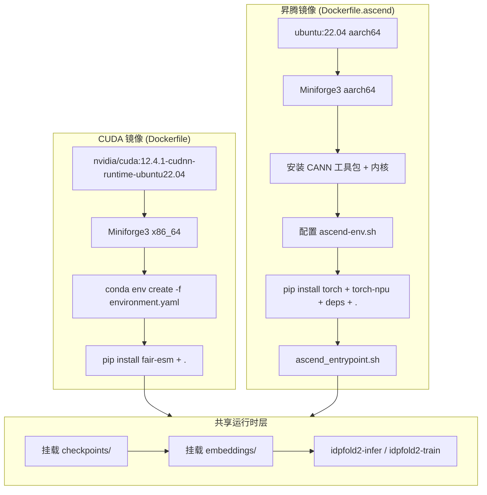
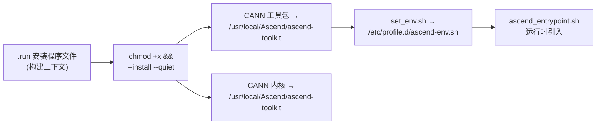

---
slug:17-docker-and-ascend-deployment
blog_type:normal
---


IDPFold2 提供了两个生产级 Docker 镜像 —— 一个针对 **NVIDIA/CUDA** GPU，另一个针对 **华为昇腾 910B** NPU。这两个镜像均安装了完整的 conda 环境和项目源码，但刻意**排除了模型检查点和 ESM 权重**以保持镜像精简；这些文件将在运行时挂载或下载。本文将逐一介绍各镜像的构建、运行和故障排除，并特别关注昇腾技术栈额外的 CANN 运行时依赖项及入口点编排。

来源: [docker/README.md](docker/README.md#L1-L163), [README4Docker.md](README4Docker.md#L1-L88)

## 架构概览

这两个镜像共享一个公共逻辑层 —— 基础操作系统、Miniforge、conda 环境和项目安装 —— 但在加速器运行时层出现分化。CUDA 路径依赖 NVIDIA 基础镜像提供驱动桩程序，而昇腾路径则必须手动安装 CANN 工具包/内核，并通过自定义入口点连接驱动挂载。



来源: [Dockerfile](Dockerfile#L1-L38), [Dockerfile.ascend](Dockerfile.ascend#L1-L86), [docker/ascend_entrypoint.sh](docker/ascend_entrypoint.sh#L1-L59)

## 先决条件与主机配置

在构建任一镜像之前，请为主机准备用于卷挂载的目录树。这些目录能在容器的生命周期之间持久化模型产物，并避免在每次运行时重新下载 ESM 权重。

```bash
mkdir -p checkpoints inputs embeddings outputs
```

| 目录 | 用途 | 容器路径 |
|-----------|---------|----------------|
| `checkpoints/` | 模型 `.pth` 检查点文件（从 [Zenodo](https://zenodo.org/records/18239596) 下载） | `/workspace/checkpoints` |
| `inputs/` | 自定义 CSV 输入或训练元数据 | `/workspace/inputs` |
| `embeddings/` | PLM 嵌入缓存（ESM 权重在首次使用时下载） | `/workspace/embeddings` |
| `outputs/` | 推理样本和训练日志 | `/workspace/outputs` |

**NVIDIA 主机** additionally 还需要安装可用的 NVIDIA 驱动和 **NVIDIA Container Toolkit**，以便 `docker run --gpus all` 正常运行。**昇腾主机** 需要在主机上安装昇腾驱动栈，将两个 CANN `.run` 安装程序文件放置在代码库根目录，并访问下文昇腾部分中描述的设备挂载。

> 在 Windows PowerShell 中，请将所有卷挂载命令中的 `$(pwd)` 替换为 `${PWD}`。

来源: [docker/README.md](docker/README.md#L6-L26)

## NVIDIA/CUDA 镜像

### 构建与运行

CUDA 镜像使用默认的 `Dockerfile` 从代码库根目录构建，该文件继承自 `nvidia/cuda:12.4.1-cudnn-runtime-ubuntu22.04`，并通过 `environment.yaml` 创建 `idpfold2` conda 环境。

```bash
docker build -t idpfold2-env .
```

使用 GPU 加速运行：

```bash
docker run --rm -it --gpus all \
  -v $(pwd)/checkpoints:/workspace/checkpoints \
  -v $(pwd)/inputs:/workspace/inputs \
  -v $(pwd)/embeddings:/workspace/embeddings \
  -v $(pwd)/outputs:/workspace/outputs \
  -w /workspace/IDPFold-multimer \
  idpfold2-env
```

对于仅限 CPU 的冒烟测试，只需省略 `--gpus all` 即可。请注意，在没有 GPU 支持的情况下，推理速度会**显著变慢** —— 此模式仅适用于验证环境或处理极短的序列。

来源: [Dockerfile](Dockerfile#L1-L38), [docker/README.md](docker/README.md#L29-L57)

### 容器内推理

进入容器 Shell 后，使用已安装的 CLI 入口点 `idpfold2-infer`（通过 `setup.py` 中的 console_scripts 注册）或直接调用模块：

```bash
# CLI 入口点
idpfold2-infer \
  prefix=MONOMER_DOCKER \
  ckpt_dir=/workspace/checkpoints/IDPFold2_ema_0.999_260114.pth \
  plm_emb_dir=/workspace/embeddings \
  csv_dir=/workspace/IDPFold-multimer/data/monomer_example.csv \
  nsamples=4 \
  max_batch_length=3500 \
  logging_dir=/workspace/outputs

# 直接脚本形式（等效）
python src/inference.py \
  prefix=MONOMER_DOCKER \
  ckpt_dir=/workspace/checkpoints/IDPFold2_ema_0.999_260114.pth \
  csv_dir=/workspace/IDPFold-multimer/data/monomer_example.csv
```

`max_batch_length` 参数应根据你的 GPU 显存进行调整；默认值 3500 是针对 V100-32GB 校准的。完整参数目录请参阅[配置参考](16-configuration-reference)。

来源: [docker/README.md](docker/README.md#L59-L78), [setup.py](setup.py#L35-L40), [configs/inference.yaml](configs/inference.yaml#L9-L11)

### 训练冒烟测试

最小化的训练调用可确认 CLI 和挂载路径是否正确解析。这**不是**完整的训练方案 —— 请将 `TRAIN_DATA_ROOT` 替换为你已准备好的数据集。

```bash
idpfold2-train \
  task_prefix=DOCKER_SMOKE \
  epochs=1 \
  batch_size=1 \
  data.data_dir=/workspace/inputs/TRAIN_DATA_ROOT \
  data.plm_emb_dir=/workspace/embeddings
```

来源: [docker/README.md](docker/README.md#L83-L93), [setup.py](setup.py#L37-L38)

## 昇腾 910B / CANN 镜像

昇腾镜像面向华为昇腾 910B NPU，由于 CANN（神经网络计算架构）软件栈的存在，其构建和运行时配置要复杂得多。

### 与 CUDA 镜像的主要差异

| 方面 | CUDA 镜像 | 昇腾镜像 |
|--------|-----------|--------------|
| 基础镜像 | `nvidia/cuda:12.4.1-cudnn-runtime-ubuntu22.04` | `ubuntu:22.04` |
| 架构 | x86_64 | aarch64 |
| PyTorch 版本 | 2.4.1 (conda) | 2.6.0 (pip, build-arg) |
| NumPy 版本 | 1.23.5 | 1.26.0 |
| 加速器桥接 | CUDA/cuDNN（位于基础镜像内） | `torch-npu` 2.6.0.post3 (pip) |
| CANN 安装 | 不适用 | 工具包 + 内核（来自 `.run` 文件） |
| 入口点 | `/bin/bash` | `ascend_entrypoint.sh` |
| `mmseqs2` | ✅ 通过 bioconda 包含 | ❌ 刻意排除 |
| 环境创建 | `conda env create -f environment.yaml` | 手动 `pip install` 序列 |

<CgxTip>昇腾镜像未安装 `mmseqs2`，因为 aarch64 架构无法使用其 conda-forge 二进制包。使用预计算输入进行推理不受影响，但需要即时聚类的训练工作流必须使用预计算的聚类结果或单独安装 `mmseqs2`。</CgxTip>

来源: [Dockerfile](Dockerfile#L1-L38), [Dockerfile.ascend](Dockerfile.ascend#L1-L86), [environment.yaml](environment.yaml#L1-L30), [environment ascend.yaml](environment ascend.yaml#L1-L25)

### 构建先决条件

在构建之前，请将 **CANN 安装程序文件**放置在代码库根目录。这些是特定于硬件的二进制包，无法通过包管理器获取：

- `Ascend-cann-toolkit_8.2.RC1_linux-aarch64.run`
- `Ascend-cann-kernels-910b_8.2.RC1_linux-aarch64.run`

可选地，将 `Miniforge3-Linux-aarch64.sh` 放置在代码库根目录以进行**离线或气隙构建**。如果省略，Dockerfile 将在构建时从 GitHub 下载 Miniforge。

来源: [Dockerfile.ascend](Dockerfile.ascend#L9-L12), [docker/README.md](docker/README.md#L99-L106)

### 使用可配置构建参数构建

昇腾 Dockerfile 对所有加速器包使用了 `ARG` 指令，允许你在不修改 Dockerfile 的情况下将版本匹配到你特定的 CANN 驱动/运行时：

```bash
docker build -f Dockerfile.ascend \
  --build-arg MINIFORGE_LOCAL_FILE="Miniforge3-Linux-aarch64.sh" \
  --build-arg CANN_TOOLKIT_RUN="Ascend-cann-toolkit_8.2.RC1_linux-aarch64.run" \
  --build-arg CANN_KERNELS_RUN="Ascend-cann-kernels-910b_8.2.RC1_linux-aarch64.run" \
  --build-arg TORCH_PACKAGE="torch==2.6.0" \
  --build-arg PYG_PACKAGE="torch-geometric==2.6.1" \
  --build-arg TORCH_NPU_PACKAGE="torch-npu==2.6.0.post3" \
  -t idpfold2-ascend-env .
```

| 构建参数 | 默认值 | 用途 |
|---------------|---------|---------|
| `TORCH_PACKAGE` | `torch==2.6.0` | PyTorch pip 指定符 |
| `PYG_PACKAGE` | `torch-geometric==2.6.1` | PyG pip 指定符 |
| `TORCH_NPU_PACKAGE` | `torch-npu==2.6.0.post3` | 适用于 PyTorch 的昇腾 NPU 适配器 |
| `MINIFORGE_URL` | Miniforge3 aarch64 GitHub 发行版 | Miniforge 下载 URL |
| `MINIFORGE_LOCAL_FILE` | *(空)* | 用于离线构建的本地 Miniforge `.sh` 文件 |
| `CANN_TOOLKIT_RUN` | `Ascend-cann-toolkit_8.2.RC1_linux-aarch64.run` | CANN 工具包安装程序文件名 |
| `CANN_KERNELS_RUN` | `Ascend-cann-kernels-910b_8.2.RC1_linux-aarch64.run` | CANN 内核安装程序文件名 |

来源: [Dockerfile.ascend](Dockerfile.ascend#L6-L12), [docker/README.md](docker/README.md#L110-L121)

### CANN 安装与环境接线

构建过程分两个阶段安装 CANN。首先，使用 `--install --quiet` 执行 `.run` 安装程序文件，对于交互式提示则回退至 `yes Y |` 管道输入。其次，将 CANN 的 `set_env.sh` 脚本引入至 `/etc/profile.d/ascend-env.sh`，以便所有后续 Shell 均继承 CANN 的 `PATH` 和 `LD_LIBRARY_PATH`。Dockerfile 会同时检查 `/usr/local/Ascend` 和 `/root/Ascend` 这两个安装位置。



来源: [Dockerfile.ascend](Dockerfile.ascend#L44-L67)

### 在昇腾 910B 上运行

昇腾容器需要 `--privileged` 模式以及显式的设备/驱动挂载，以便从容器内访问 NPU 硬件：

```bash
docker run --rm -it --privileged \
  -v /usr/local/Ascend/driver:/usr/local/Ascend/driver:ro \
  -v /etc/ascend_install.info:/etc/ascend_install.info:ro \
  -v /usr/local/dcmi:/usr/local/dcmi:ro \
  -v /usr/local/bin/npu-smi:/usr/local/bin/npu-smi:ro \
  -v /dev:/dev \
  -v $(pwd)/checkpoints:/workspace/checkpoints \
  -v $(pwd)/inputs:/workspace/inputs \
  -v $(pwd)/embeddings:/workspace/embeddings \
  -v $(pwd)/outputs:/workspace/outputs \
  -w /workspace/IDPFold-multimer \
  idpfold2-ascend-env
```

| 挂载 | 用途 |
|-------|---------|
| `/usr/local/Ascend/driver` (ro) | 主机昇腾驱动库 |
| `/etc/ascend_install.info` (ro) | 昇腾安装元数据 |
| `/usr/local/dcmi` (ro) | 设备管理接口 (DCMI) |
| `/usr/local/bin/npu-smi` (ro) | NPU 管理实用程序 |
| `/dev` | 用于 NPU 访问的设备节点 |

来源: [docker/README.md](docker/README.md#L125-L138)

## 昇腾入口点内部机制

`ascend_entrypoint.sh` 脚本是昇腾镜像的 **ENTRYPOINT**，充当构建期间安装的 CANN 运行时与运行时可用驱动挂载之间的关键桥梁。它按顺序执行三项功能：

1. **引入 CANN 环境** —— 首先尝试 `/etc/profile.d/ascend-env.sh`（在构建期间设置），然后回退至 `/usr/local/Ascend/ascend-toolkit/set_env.sh` 或 `/root/Ascend/ascend-toolkit/set_env.sh`，以适应不同主机配置的灵活性。

2. **扩展 `PATH` 和 `LD_LIBRARY_PATH`** —— 使用去重辅助函数 `append_path_if_dir`（跳过已存在的目录）追加昇腾驱动工具路径（`/usr/local/Ascend/driver/tools`、`/usr/local/Ascend/driver/bin`）和库路径（驱动 `lib64` 目录、DCMI `lib64`）。

3. **发出诊断警告** —— 如果在 `PATH` 中未找到 `npu-smi`，或通过 `ldconfig` 无法发现 `libascend_hal.so`，将打印警告，但不会阻止容器启动。

脚本以 `exec "$@"` 终止，将控制权传递给 `CMD`（默认：`/bin/bash`），因此交互式 Shell 和任意命令均可继承完全配置好的环境。

来源: [docker/ascend_entrypoint.sh](docker/ascend_entrypoint.sh#L1-L59), [Dockerfile.ascend](Dockerfile.ascend#L84-L85)

### 运行时验证

启动昇腾容器后，请验证 NPU 技术栈是否正常运行：

```bash
which npu-smi || true
npu-smi info
python -c "import torch, torch_npu; print(torch.__version__)"
```

如果 `torch_npu` 报告缺少共享库（`libhccl.so` 或 `libascend_hal.so`），请手动扩展 `LD_LIBRARY_PATH`：

```bash
export LD_LIBRARY_PATH=/usr/local/Ascend/ascend-toolkit/latest/aarch64-linux/lib64:/usr/local/Ascend/ascend-toolkit/8.2.RC1/hccl/lib64:/usr/local/Ascend/driver/lib64/common:/usr/local/Ascend/driver/lib64:/usr/local/Ascend/driver/lib64/driver:/usr/local/dcmi/lib64:${LD_LIBRARY_PATH}
```

<CgxTip>CANN 共享库解析问题是最常见的昇腾运行时故障。`ascend_entrypoint.sh` 脚本会主动添加主要的驱动 `lib64` 路径，但如果在你所用的 CANN 版本中 `set_env.sh` 未完全配置 `LD_LIBRARY_PATH`，HCCL 和工具包的 `lib64` 目录可能仍然缺失。</CgxTip>

来源: [docker/README.md](docker/README.md#L140-L154), [docker/ascend_entrypoint.sh](docker/ascend_entrypoint.sh#L36-L56)

## 故障排除

| 症状 | 原因 | 解决方案 |
|---------|-------|------------|
| `could not select device driver` | 缺少或损坏 NVIDIA Container Toolkit | 安装/修复 NVIDIA Container Toolkit，然后重试 `--gpus all` |
| 找不到检查点 | 挂载路径不匹配 | 验证 `/workspace/checkpoints` 内是否存在 `IDPFold2_ema_0.999_260114.pth` |
| 首次推理非常缓慢 | 正在下载 ESM 权重并生成嵌入 | 后续运行将使用 `/workspace/embeddings` 中的缓存嵌入 |
| CUDA/NPU 内存不足 | 批次或序列过长，超出了可用显存 | 降低 `nsamples` 或 `max_batch_length` |
| 找不到 `libhccl.so` / `libascend_hal.so` | CANN `LD_LIBRARY_PATH` 不完整 | 应用上文的 `LD_LIBRARY_PATH` 导出命令 |
| 构建期间依赖安装失败 | 包版本与驱动不兼容 | 清除部分 Docker 层（`--no-cache`）或将 `TORCH_PACKAGE`/`TORCH_NPU_PACKAGE` 构建参数固定至与你的 CANN 运行时匹配的版本 |
| 未找到 `mmseqs2`（昇腾） | 已从昇腾镜像中刻意排除 | 使用预计算的聚类结果或单独安装 `mmseqs2` |

来源: [docker/README.md](docker/README.md#L156-L163), [README4Docker.md](README4Docker.md#L87-L87)

## 延伸阅读

- 如需完整的推理参数参考，请参阅[配置参考](16-configuration-reference)。
- 如需了解模型在每个步骤的计算内容，请参阅 [R³ 上的流匹配](5-flow-matching-on-r3) 和 [蛋白质 Transformer 网络](7-protein-transformer-network)。
- 如需在不使用 Docker 的情况下运行推理，请参阅[单体与多聚体推理](3-inference-for-monomers-and-multimers)。