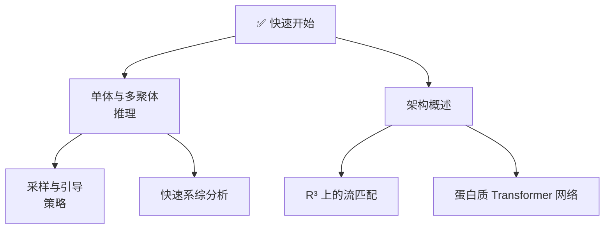

---
slug:2-quick-start
blog_type:normal
---


安装 IDPFold2，获取预训练检查点，并在 15 分钟内生成你的首个蛋白质构象系综。本页将带你从零开始，以最简路径完成首次预测——涵盖环境配置、输入准备、单体与多聚体推理，以及对输出的快速完整性检查。如需了解架构背景，请参阅[概述](1-overview)；如需查看完整的推理参数参考，请参阅[单体与多聚体推理](3-inference-for-monomers-and-multimers)。

来源: [README.md](/README.md#L1-L369), [setup.py](/setup.py#L1-L42)

## 先决条件

IDPFold2 要求 **Python 3.11** 以及一块 **支持 CUDA 的 GPU**（或 Ascend 910B——参见 [Docker 与 Ascend 部署](17-docker-and-ascend-deployment)）。该模型使用混合专家 Transformer 执行基于流匹配的生成，因此 GPU 显存直接决定了你能够处理的最大批次长度。下表汇总了已测试的配置：

| GPU | 显存 | `max_batch_length` | 备注 |
|-----|------|---------------------|-------|
| V100 | 32 GB | 3 500 | `inference.yaml` 中的默认值 |
| A100 | 40–80 GB | 6 000+ | 适用于大多数蛋白质 |
| Ascend 910B | 64 GB | 6 000 | 已由作者验证 |

<CgxTip>起初应保守设置 `max_batch_length`——它控制每轮批次生成的样本数量。OOM（显存溢出）错误几乎总是由于该值相对于你的显存设置过高所致。</CgxTip>

来源: [configs/inference.yaml](/configs/inference.yaml#L8-L9), [README.md](/README.md#L209-L213)

## 安装

以下流程图概述了三步安装过程：


**步骤 1 — 克隆仓库并创建 conda 环境：**

```bash
git clone https://github.com/Junjie-Zhu/IDPFold2
cd IDPFold2

conda env create -f environment.yaml
conda activate idpfold2
```

此步骤将安装 PyTorch 2.4.1、PyG 2.6.1 以及环境文件中锁定的所有核心依赖。

**步骤 2 — 安装 ESM 和 IDPFold2 包：**

```bash
pip install fair-esm
pip install .
```

`pip install .` 步骤会注册两个控制台入口点——`idpfold2-infer` 和 `idpfold2-train`——以便你可以在系统路径中的任何位置调用推理。

**步骤 3 — 从 Zenodo 下载推理检查点：**

从 [Zenodo](https://zenodo.org/records/18239596) 下载 `IDPFold2_ema_0.999_260114.pth`，并将其放置在你选择的目录中（例如 `./checkpoints/`）。这是用于推理的 **EMA 检查点**。单独的非 EMA 检查点（`IDPFold2_260114.pth`）仅在训练或微调时需要。

来源: [environment.yaml](/environment.yaml#L1-L30), [setup.py](/setup.py#L28-L36), [README.md](/README.md#L40-L63)

### 验证安装

运行内置测试套件以确认所有组件均已正确连接：

```bash
python -m pytest
```

此操作将验证包元数据、控制台入口点、核心导入项（`src.common.residue_constants`、`src.common.atom37_constants`），以及 `idpfold2-infer` 和 `idpfold2-train` 是否均位于你的 `PATH` 中。

来源: [README.md](/README.md#L164-L166), [test/test_installation.py](/test/test_installation.py#L1-L96)

### 可选：MegaBlocks 加速

默认情况下，IDPFold2 使用纯 PyTorch 的混合专家实现。若要获得可能更快的 MoE 路由速度，你可以安装本仓库内附带的简化版 MegaBlocks 后端：

```bash
cd megablocks
pip install .
```

> **注意：** MegaBlocks 在 IDPFold2 上的加速效果尚未经过正式基准测试。使用任一后端均会生成完全相同的结构——它们仅在吞吐量上有所差异。

来源: [README.md](/README.md#L65-L75)

## 准备输入

IDPFold2 从 **CSV 文件** 中读取蛋白质目标，该文件需包含两个必需列：`test_case`（名称/标识符）和 `sequence`（氨基酸字符串）。示例文件可在 `data/` 目录中找到。

### 单体输入格式

```csv
test_case,sequence
THB_C2,GPGSEDVWEILRQAPPSEYERIAFQYGVTDLRGMLKRLKGMRRDEKKSTAFQKKLEPAYQVSKGHKIRLTVELADHDAEVKWLKNGQEIQMSGSKYIFESIGAKRTLTISQCSLADDAAYQCVVGGEKCSTELFVKE
```

### 多聚体输入格式

对于复合物，链在 `sequence` 列中由 `:` 分隔，并用 `chain_ids` 列指定链标识符：

```csv
test_case,chain_ids,sequence
4mvl,A:B,QDSTSDLIPAPPLSKVPLQQ...:DAEFRHDSGYEVHHQKLVFF...
```

<CgxTip>PLM 嵌入会在首次运行时自动生成并缓存到磁盘。如果 `plm_emb_dir` 为空或缺失，IDPFold2 将提取 ESM-2 650M 嵌入并保存为 `.pt` 文件——因此你只需为每个序列支付一次性的计算开销。</CgxTip>

来源: [data/monomer_example.csv](/data/monomer_example.csv#L1-L4), [data/multimer_example.csv](/data/multimer_example.csv#L1-L6), [README.md](/README.md#L168-L176)

## 运行单体推理

下载检查点并准备好输入 CSV 后，即可生成构象系综：

```bash
python src/inference.py \
    prefix=MONOMER \
    ckpt_dir=./checkpoints/IDPFold2_ema_0.999_260114.pth \
    plm_emb_dir=./embeddings \
    csv_dir=./data/monomer_example.csv \
    nsamples=100 \
    max_batch_length=6000
```

或者，使用已安装的入口点：

```bash
idpfold2-infer \
    prefix=MONOMER \
    ckpt_dir=./checkpoints/IDPFold2_ema_0.999_260114.pth \
    plm_emb_dir=./embeddings \
    csv_dir=./data/monomer_example.csv \
    nsamples=100 \
    max_batch_length=6000
```

关键参数说明如下：

| 参数 | 默认值 | 描述 |
|-----------|---------|-------------|
| `prefix` | `DEFAULT` | 添加到输出目录名称前的前缀标签 |
| `ckpt_dir` | *必填* | `.pth` EMA 检查点的路径 |
| `plm_emb_dir` | *必填* | ESM-2 嵌入的目录（若为空则自动填充） |
| `csv_dir` | *必填* | 输入 CSV 文件的路径 |
| `nsamples` | `100` | 要生成的构象数量 |
| `max_batch_length` | `3500` | 每个批次的最大残基总数；请根据你的 GPU 显存进行调整 |
| `logging_dir` | `./logs` | 根输出目录 |
| `dt` | `0.005` | 流匹配的积分时间步长 |
| `seed` | `42` | 用于可复现性的随机种子 |

通过 `torchrun` 支持**多 GPU 推理**。请注意，所有设备将共享相同的种子，因此每块 GPU 将产生完全相同的预测结果——请据此调整你的 `nsamples`：

```bash
torchrun --nproc-per-node=4 src/inference.py \
    prefix=MONOMER \
    ckpt_dir=./checkpoints/IDPFold2_ema_0.999_260114.pth \
    plm_emb_dir=./embeddings \
    csv_dir=./data/monomer_example.csv \
    nsamples=400 \
    max_batch_length=6000
```

来源: [README.md](/README.md#L178-L224), [configs/inference.yaml](/configs/inference.yaml#L1-L15), [src/inference.py](/src/inference.py#L100-L160)

## 运行多聚体推理

多聚体推理使用相同的命令，仅需添加一个额外标志。CSV 文件必须遵循多聚体格式（链由 `:` 连接，并带有 `chain_ids` 列）：

```bash
python src/inference.py \
    prefix=MULTIMER \
    ckpt_dir=./checkpoints/IDPFold2_ema_0.999_260114.pth \
    plm_emb_dir=./embeddings \
    csv_dir=./data/multimer_example.csv \
    nsamples=100 \
    max_batch_length=6000 \
    load_multimer=True
```

`load_multimer=True` 标志会使数据加载器期望 CSV 中存在多链序列和 `chain_ids`。**单体和多聚体无法在同一次运行中处理**——请分别调用。

来源: [README.md](/README.md#L226-L246), [src/inference.py](/src/inference.py#L31-L55)

## 理解输出

推理完成后，输出目录（默认为 `./logs/`）包含：

```
logs/
└── MONOMER_INF_2026-01-15_10-30-00/   # 前缀 + 时间戳
    ├── config.yaml                      # 完整配置快照
    ├── samples/
    │   ├── THB_C2.pdb                   # 多模型 PDB：每个样本对应一个 MODEL
    │   └── ...
    └── tmp/                             # 每个批次的中间文件（会被清理）
```

`samples/` 中的每个 `.pdb` 文件都是一个**多模型 PDB**，其中每个 `MODEL ... END` 块代表一个采样构象。生成的结构为粗粒度（仅含 Cα）；如需进行全原子重建，请参阅[快速系综分析](14-quick-ensemble-analysis)。

来源: [src/inference.py](/src/inference.py#L270-L310)

## 快速完整性检查

IDPFold2 附带了一个后处理脚本，可为每个生成的系综计算回转半径和末端距：

```bash
python scripts/quick_analysis.py ./logs/MONOMER_INF_2026-01-15_10-30-00/samples
```

此操作将在目标目录中生成一个 `metrics.pkl` 文件。如需更深入的评估——RMSD、天然接触、反向映射及基准测试集成——请参阅[快速系综分析](14-quick-ensemble-analysis)和[BioEmu 与 PeptoneBench 集成](15-bioemu-and-peptonebench-integration)。

来源: [scripts/quick_analysis.py](/scripts/quick_analysis.py#L1-L82), [README.md](/README.md#L307-L316)

## 在 Colab 中尝试

如果你希望完全跳过本地安装，我们提供了一个 Colab 笔记本，它在一个笔记本中处理所有事务——克隆、检查点下载、输入准备、推理以及 3D 结构可视化：

[**在 Google Colab 中打开**](https://colab.research.google.com/github/Junjie-Zhu/IDPFold2/blob/main/notebooks/IDPFold2_colab_monomer_preview.ipynb)

运行前请选择 **运行时 → 更改运行时类型 → GPU**。该笔记本默认为 `THB_C2` 单体生成 4 个样本——这是一个快速预览，在 T4 GPU 上大约需要 2-3 分钟。

来源: [notebooks/IDPFold2_colab_monomer_preview.ipynb](/notebooks/IDPFold2_colab_monomer_preview.ipynb#L1-L50), [README.md](/README.md#L15-L17)

## 接下来去哪



- **自信预测**：[单体与多聚体推理](3-inference-for-monomers-and-multimers)涵盖了高级采样模式、引导策略及所有配置覆盖。
- **理解运行机制**：[架构概述](4-architecture-overview)端到端地讲解了流匹配 + MoE Transformer 架构。
- **评估结果**：[快速系综分析](14-quick-ensemble-analysis)带你了解 RMSD、反向映射及基准测试评分。
- **规模化部署**：[Docker 与 Ascend 部署](17-docker-and-ascend-deployment)涵盖了容器化及 Ascend 910B 环境的配置。