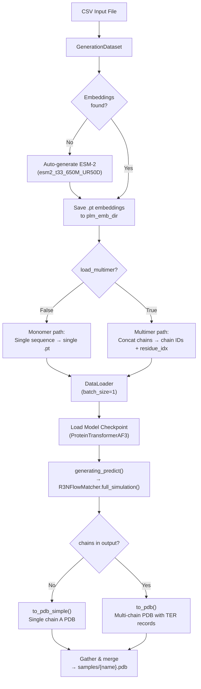

---
slug:3-inference-for-monomers-and-multimers
blog_type:normal
---


IDPFold2 通过模拟从噪声到结构化蛋白质坐标的流匹配 ODE 来生成构象系综。推理流水线接受一个描述目标系统的简单 CSV 文件，自动解析 ESM-2 蛋白质语言模型嵌入，并生成包含采样系综的多模型 PDB 文件。无论你是在预测单链内在无序蛋白质的异质构象景观，还是多链复合物的四级排列，相同的入口点——`src/inference.py`——都能通过单个配置开关处理这两种情况。

## 准备输入 CSV

推理流水线由一个 **CSV 文件** 驱动，其列根据你运行的是单体还是多体预测而有所不同。该 CSV 扮演两个角色：为输出文件命名提供每个测试用例的名称，并提供模型所依赖的氨基酸序列。

### 单体 CSV 格式

对于单链蛋白质，CSV 恰好需要两列：`test_case` 和 `sequence`。

| 列 | 描述 | 示例 |
|---|---|---|
| `test_case` | 用于输出 PDB 命名和嵌入文件命名的唯一标识符 | `THB_C2` |
| `sequence` | 单体的单字母氨基酸序列 | `GPGSEDVWEILRQ...` |

示例见 [data/monomer_example.csv](data/monomer_example.csv)：

```csv
test_case,sequence
THB_C2,GPGSEDVWEILRQAPPSEYERIAFQYGVTDLRGMLKRLKGMRRDEKKSTAFQKKLEPAYQVSKGHKIRLTVELADHDAEVKWLKNGQEIQMSGSKYIFESIGAKRTLTISQCSLADDAAYQCVVGGEKCSTELFVKE
Ubq2,MASHHHHHHGAQIFVKTLTGKTITLEVEPSDTIENVKAKIQDKEGIPPDQQRLIFAGKQLEDGRTLSDYNIQKESTLHLVLRLRGGMQIFVKTLTGKTITLEVEPSDTIENVKAKIQDKEGIPPDQQRLIFAGKQLEDGRTLSDYNIQKESTLHLVLRLRGG
```

来源: [monomer_example.csv](data/monomer_example.csv#L1-L4)

### 多体 CSV 格式

对于多链复合物，CSV 需要**三列**：`test_case`、`chain_ids` 和 `sequence`。多条链由冒号 (`:`) 分隔符分隔。

| 列 | 描述 | 示例 |
|---|---|---|
| `test_case` | 复合物的唯一标识符 | `4mvl` |
| `chain_ids` | 由 `:` 分隔的链标签 | `A:B` |
| `sequence` | 由 `:` 分隔的各链序列 | `QDSTSDL...:DAEFRH...` |

示例见 [data/multimer_example.csv](data/multimer_example.csv)：

```csv
test_case,chain_ids,sequence
4mvl,A:B,QDSTSDLIPAPPLSKVPLQQNFQDNQFHGKWYVVGAAGNVLLREDKDPLKMYATIYELKEDKSYNVTSVGFDDKKCLYKIRTFVPGSQPGEFTLGRIKSEPGGTSWLVRVVSTNYNQHAMVFFKEVAQNRETFNITLYGRTKELTSELKENFIRFSKSLGLPENHIVFPVPIDQCIDGSAWSHPQFEK:DAEFRHDSGYEVHHQKLVFFAEDVGSNKGAIIGLMVGGVV
```

<CgxTip>如果多体 CSV 中省略了 `chain_ids` 列，系统将回退到自动编号的链标识符（`1`、`2`、…）用于嵌入文件命名。然而，强烈建议提供显式的 `chain_ids`，以确保可复现性及输出 PDB 中链标签的正确性。</CgxTip>

来源: [multimer_example.csv](data/multimer_example.csv#L1-L2), [inference.py](src/inference.py#L64-L74)

## 理解推理流水线

推理过程遵循从 CSV 输入到多模型 PDB 输出的明确顺序。下图展示了完整的流程，并突出了单体和多体路径的分叉点。



### 步骤 1 — 数据集构建与嵌入解析

`GenerationDataset` 类读取 CSV 并解析 ESM-2 嵌入。如果指定的 `plm_emb_dir` 不存在或缺少任何条目的嵌入，数据集将**自动**运行 ESM-2（`esm2_t33_650M_UR50D`，6.5 亿参数）来提取逐残基嵌入，并将其缓存为 `.pt` 文件。这意味着由于需要计算嵌入，你的首次推理运行会比较慢；后续运行将重用缓存。

对于**单体**，每行映射到一个嵌入文件：`{plm_emb_dir}/{test_case}.pt`。对于**多体**，每条链都有各自的嵌入文件：`{plm_emb_dir}/{test_case}_{chain_id}.pt`。随后，逐链嵌入会沿残基维度进行拼接，并构建额外的张量——`chains`（将每个残基分配到其链索引）和 `residue_idx`（每条链重置的逐链残基位置索引）。

来源: [inference.py](src/inference.py#L31-L115)

### 步骤 2 — 模型加载

`ProteinTransformerAF3` 模型根据 Hydra 配置的 `model` 部分进行实例化，并加载检查点的 `model_state_dict`。当通过 `torchrun` 使用多 GPU 运行时，模型会被包装在 `DistributedDataParallel` (DDP) 中。如果 `autoguidance_ratio > 0`，还可以单独加载一个可选的 **autoguidance** 模型。

来源: [inference.py](src/inference.py#L233-L263)

### 步骤 3 — 流匹配模拟

核心生成循环调用 `generating_predict()`，该函数将任务委托给 `R3NFlowMatcher.full_simulation()`。此过程对学习到的矢量场执行 Euler 积分，从 t=0（高斯噪声）到 t=1（清晰结构），使用配置中指定的时间表和采样模式。在每个步骤中，模型接收当前的含噪坐标 `x_t`、时间 `t`、PLM 嵌入、残基类型、残基索引和链信息，并预测清晰结构 `x_1`，速度场即由此推导得出。

积分步数由 `dt` 决定（默认为 0.005，即产生 200 步）。样本以微批次大小生成，以遵守 `max_batch_length` 的内存限制——对于长度为 L 的蛋白质，每个微批次最多同时产生 `max_batch_length // L` 个样本。

来源: [integral.py](src/model/integral.py#L322-L398), [r3flow.py](src/model/flow_matching/r3flow.py#L389-L538)

### 步骤 4 — PDB 输出

生成的坐标（单位为 nm）会被缩放为埃 (`× 10`) 并写入 PDB。单体使用 `to_pdb_simple()`，将所有残基分配到链 A；多体使用 `to_pdb()`，将残基分配到其正确的链标签并在链之间插入 `TER` 记录。每个微批次被写成一个包含多个 `MODEL` 条目的临时 PDB 文件。在所有微批次完成后，rank-0 进程会收集这些文件并将其合并到 `{logging_dir}/samples/{name}.pdb` 中的单一文件内，同时重新按顺序编排 `MODEL` 编号。

来源: [inference.py](src/inference.py#L306-L351), [pdb_utils.py](src/utils/pdb_utils.py#L21-L106)

## 运行单体推理

使用以下命令执行推理，并根据你的环境调整路径和参数：

```bash
python src/inference.py \
    prefix=MONOMER \
    ckpt_dir=/PATH/TO/CHECKPOINT/IDPFold2_ema_0.999_260114.pth \
    plm_emb_dir=./embeddings \
    csv_dir=data/monomer_example.csv \
    nsamples=100 \
    max_batch_length=6000
```

下表解释了每个关键参数：

| 参数 | 默认值 | 描述 |
|---|---|---|
| `prefix` | `DEFAULT` | 日志目录名的前缀 |
| `ckpt_dir` | *必填* | EMA 模型检查点路径（`.pth` 文件） |
| `plm_emb_dir` | *必填* | ESM-2 嵌入目录；若为空则自动填充 |
| `csv_dir` | *必填* | 单体输入 CSV 文件路径 |
| `nsamples` | `100` | 要生成的构象样本总数 |
| `max_batch_length` | `3500` | 每个 GPU 微批次的最大总残基数；控制内存使用 |
| `dt` | `0.005` | ODE 积分步长（越小 = 步数越多，分辨率越高） |
| `seed` | `42` | 用于可复现性的随机种子 |

<CgxTip>`max_batch_length` 参数直接控制 GPU 显存消耗。对于 V100-32GB，`3500` 是安全的默认值。对于 Ascend 910B (64GB)，`6000` 适用于所有测试过的蛋白质。如果遇到 OOM 错误，请减小此值——流水线会自动计算 `nsamples_per_batch = max_batch_length // protein_length` 并循环处理微批次。</CgxTip>

来源: [inference.yaml](configs/inference.yaml#L1-L26), [inference.py](src/inference.py#L176-L226)

## 运行多体推理

多体推理使用相同的入口点，只需增加一个标志：

```bash
python src/inference.py \
    prefix=MULTIMER \
    ckpt_dir=/PATH/TO/CHECKPOINT/IDPFold2_ema_0.999_260114.pth \
    plm_emb_dir=./embeddings \
    csv_dir=data/multimer_example.csv \
    nsamples=100 \
    max_batch_length=6000 \
    load_multimer=True
```

关键区别在于 `load_multimer=True`，它激活了 `GenerationDataset` 中的多体数据加载路径。此标志决定了：

- **如何解析序列**：以冒号分隔的链会被拆分并单独处理
- **如何命名嵌入**：每条链获得一个单独的 `.pt` 文件（例如 `4mvl_A.pt`、`4mvl_B.pt`）
- **构建哪些辅助张量**：`chains`（每个残基的链分配）和 `residue_idx`（逐链残基索引）
- **如何写入输出 PDB**：带有正确链 ID 和 `TER` 分隔符的多链格式

**重要提示**：单体和多体无法在单次运行中同时处理。你必须为每种类型分别执行推理。

来源: [inference.py](src/inference.py#L49-L80), [inference.py](src/inference.py#L306-L320)

## 多 GPU 推理

IDPFold2 支持通过 PyTorch 的 `torchrun` 进行分布式推理。样本在可用 GPU 之间均分，每个 rank 独立生成其负责的部分：

```bash
torchrun --nproc-per-node=4 src/inference.py \
    prefix=MONOMER \
    ckpt_dir=/PATH/TO/CHECKPOINT/IDPFold2_ema_0.999_260114.pth \
    plm_emb_dir=./embeddings \
    csv_dir=data/monomer_example.csv \
    nsamples=100 \
    max_batch_length=3500
```

所有 rank 完成后，rank 0 会收集所有批次的临时 PDB 文件，并将它们合并为一个单独的输出文件。DDP 进程组使用 NCCL 后端，带有可配置的超时时间（通过 `NCCL_TIMEOUT_SECOND` 环境变量默认设为 600 秒）。

**注意**：当使用 `torchrun` 时，固定随机种子会使每个设备生成完全相同的预测。为了在各 GPU 间获得多样化的样本，请省略种子或为每个 rank 设置不同的种子。

来源: [inference.py](src/inference.py#L205-L212), [inference.py](src/inference.py#L274-L329), [ddp_utils.py](src/utils/ddp_utils.py#L12-L34)

## 高级采样选项

除了基本的矢量场 (`vf`) 采样模式外，IDPFold2 还支持基于分数的随机采样和引导策略，这可以改善具有挑战性目标的样本质量。

### 采样模式

| 模式 | 配置键 | 描述 |
|---|---|---|
| **矢量场 (VF)** | `sampling.sampling_mode: vf` | 学习矢量场的标准 ODE 模拟。在给定初始噪声时具有确定性。 |
| **分数 + 噪声 (SC)** | `sampling.sampling_mode: sc` | 通过 SDE 引入基于分数的漂移项和随机噪声项，实现多样化采样。受 `sc_scale_noise` 和 `sc_scale_score` 控制。 |

### 时间表

积分时间点根据 `schedule.schedule_mode` 离散化：

| 时间表 | 行为 |
|---|---|
| `log` | 对数间隔——在噪声到结构转换最快的 t=0 附近更密集。参数 `schedule_p` 控制密度。 |
| `uniform` | 在 [0, 1] 之间均匀间隔的步数。 |
| `power` | 均匀分布的 `schedule_p` 次方。 |

### 引导

无分类器引导 (CFG) 和 autoguidance 可以结合使用以引导生成过程：

| 参数 | 默认值 | 效果 |
|---|---|---|
| `guidance_weight` | `1.0` | 权重 ≥ 1 会放大条件预测。`1.0` = 无引导。 |
| `autoguidance_ratio` | `0.0` | 在 CFG (`0.0`) 和 autoguidance (`1.0`) 之间混合。需要 `ag_dir` 检查点。 |
| `autoguidance_ckpt_path` | `null` | autoguidance 模型检查点的路径。 |

来源: [inference.yaml](configs/inference.yaml#L32-L46), [integral.py](src/model/integral.py#L40-L89), [r3flow.py](src/model/flow_matching/r3flow.py#L240-L322)

## 输出结构

推理完成后，日志目录包含：

```
{logging_dir}/
└── {prefix}_INF_{timestamp}/
    ├── config.yaml          # 保存的配置快照
    ├── samples/             # 最终合并的 PDB 系综
    │   ├── THB_C2.pdb       # 多模型 PDB (MODEL 1, MODEL 2, …)
    │   └── Ubq2.pdb
    └── tmp/                 # 收集后清空
```

`samples/` 中的每个 PDB 文件包含 `nsamples` 个 `MODEL` 条目。对于单体，所有残基被分配到仅含 CA 原子的链 A。对于多体，残基被分配到其天然链 ID，并在链之间带有 `TER` 记录。坐标单位为埃。

来源: [inference.py](src/inference.py#L178-L186), [inference.py](src/inference.py#L334-L351), [pdb_utils.py](src/utils/pdb_utils.py#L21-L106)

## 快速参考：单体 vs. 多体

| 方面 | 单体 | 多体 |
|---|---|---|
| CSV 列 | `test_case`, `sequence` | `test_case`, `chain_ids`, `sequence` |
| 序列格式 | 单个字符串 | 由 `:` 连接的多链 |
| 配置标志 | `load_multimer=False`（默认） | `load_multimer=True` |
| 嵌入文件 | `{name}.pt` | 每条链 `{name}_{chain}.pt` |
| 链张量 | 全为 1（单链） | 逐残基的链分配 |
| 残基索引 | 全局 `[0, 1, 2, …]` | 每条链重置 `[0,1,…]` |
| PDB 输出 | `to_pdb_simple()` — 仅链 A | `to_pdb()` — 正确链 ID + TER |
| 混合处理 | 不支持 — 需单独运行 | 不支持 — 需单独运行 |

来源: [inference.py](src/inference.py#L49-L115), [inference.py](src/inference.py#L306-L320)

## 后续步骤

现在你已经能够生成构象系综，接下来可以探索使其成为可能的架构，以及用于评估样本质量的工具：

- **理解生成框架**：[Flow Matching on R³](5-flow-matching-on-r3) 解释了作为采样基础的 ODE/SDE 模拟。
- **探索模型架构**：[Architecture Overview](4-architecture-overview) 和 [Protein Transformer Network](7-protein-transformer-network) 详述了在每个积分步骤中是如何进行预测的。
- **评估你的系综**：[Quick Ensemble Analysis](14-quick-ensemble-analysis) 涵盖了 RMSD、Rg 和天然接触计算。
- **调整采样**：[Sampling and Guidance Strategies](10-sampling-and-guidance-strategies) 深入探讨了 CFG、autoguidance 和随机采样。
- **配置一切**：[Configuration Reference](16-configuration-reference) 提供了完整的参数目录。