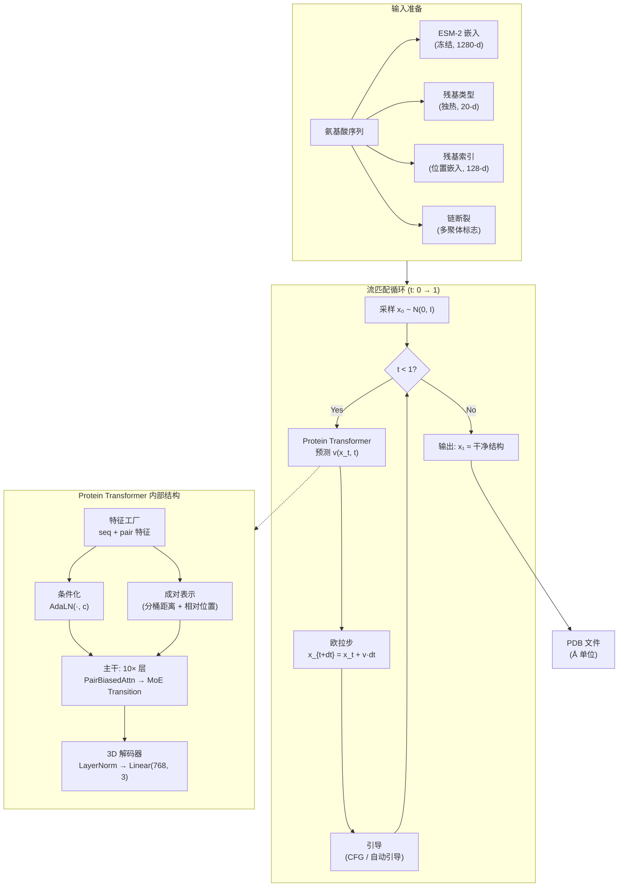
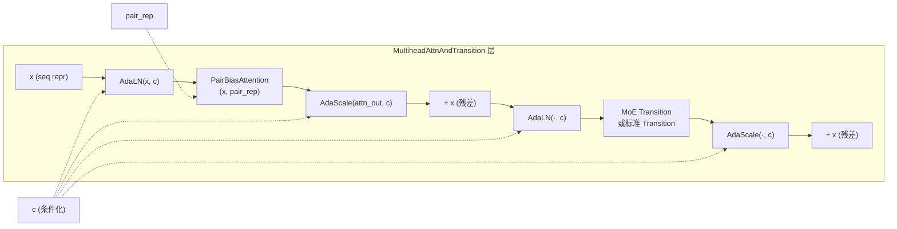

---
slug:4-architecture-overview
blog_type:normal
---


IDPFold2 是一个用于蛋白质结构预测的**流匹配生成模型**，直接在欧几里得三维空间中运行。它不预测单一的静态结构，而是学习一个连续时间向量场，通过数值积分将噪声传输为结构化的蛋白质构象。该架构融合了三大支柱：**Protein Transformer Network**（基于注意力机制的主干网络，包含成对偏置注意力和自适应条件化）、**(R³)ⁿ 上的流匹配**框架（定义生成式 ODE/SDE），以及**混合专家过渡层**（通过稀疏专家路由实现容量扩展）。本页面提供了这三大支柱如何组合成一个连贯系统的自顶向下映射；随后每个支柱将在其专属页面中进行深入剖析。

## 系统数据流

整个 IDPFold2 流水线——从氨基酸序列到 3D 结构系综——遵循清晰的分阶段流程。在推理时，输入序列首先由冻结的 ESM-2 蛋白质语言模型进行编码，然后逐步对流匹配 ODE 进行数值积分，Protein Transformer 在每个时间步预测速度场。



训练路径与此流程镜像但方向相反：干净的结构通过插值调度 x_t = (1−t)x₀ + t·x₁ 被加噪，模型学习预测干净目标 x₁ 或速度场 v，并由权重为 1/(1−t)² 的流匹配损失进行监督。

来源: [inference.py](/src/inference.py#L176-L304), [integral.py](/src/model/integral.py#L322-L398), [train.py](/src/train.py#L31-L154)

## 核心架构：ProteinTransformerAF3

`ProteinTransformerAF3` 是核心神经网络，架构上受 AlphaFold3 扩散模块（算法 23）的启发。它通过分层主干处理三个耦合表示：

| 表示 | 形状 | 目的 | 来源 |
|---|---|---|---|
| **序列** | `[b, n, 768]` | 每残基的隐状态 | PLM 嵌入 + 残基类型 + 索引 + 3D 坐标嵌入 |
| **成对** | `[b, n, n, 512]` | 残基对的几何与位置信号 | 分桶成对距离 + 相对位置 |
| **条件化** | `[b, n, 512]` | AdaLN 的时间依赖调制 | 时间嵌入 → 2× Transition 层 |

前向传播执行四个顺序阶段：

**阶段 1 — 输入编码。** 被加噪的 3D 坐标 x_t 从 3 → 768 维进行线性投影，并加到由 `FeatureFactory` 生成的初始序列表示中。因此序列表示为：`seq_repr = Linear(x_t) + FeatureFactory(plm_emb, res_type, res_idx, chain_break)`。

**阶段 2 — 条件化路径。** 一个独立的 `FeatureFactory` 生成时间嵌入，该嵌入通过两个 `Transition` 层（扩展因子为 2 的基于 SwiGLU 的 MLP），形成条件化向量 **c**。该向量驱动主干中所有的 AdaptiveLayerNorm 和 AdaptiveLayerNormOutputScale 操作。

**阶段 3 — 主干。** 十个堆叠的 `MultiheadAttnAndTransition` 层处理序列表示。每层应用： 经 AdaLN 输入调制和自适应输出缩放的成对偏置多头注意力，随后是 同样被 AdaLN 包裹的 Transition 层（MoE 或标准）。两个子层均支持可选的残差连接。

**阶段 4 — 坐标解码。** 一个 `LayerNorm → Linear(768, 3)` 头将最终的序列表示映射回 3D 坐标。

<CgxTip>该架构支持**寄存器令牌**（默认：10），这些可学习参数被前置到序列中。它们在不污染残基级表示的情况下吸收全局信息——这是一种源自视觉 Transformer 的技术，可提升变长序列的注意力质量。</CgxTip>

来源: [protein_transformer.py](/src/model/protein_transformer.py#L305-L526), [inference.yaml](/configs/inference.yaml#L48-L92)

## 三大表示流

理解序列、成对和条件化表示如何交互，是理解整个架构的关键。下图展示了单个主干层的内部连线：



每层交错执行**注意力**（通过成对偏置捕获长程残基依赖）和**过渡**（通过 MoE 进行局部每残基特征变换）。条件化向量 **c** 通过 AdaptiveLayerNorm 调制每一步操作——这正是网络在流匹配的各个时间步中调整其行为的方式。

来源: [protein_transformer.py](/src/model/protein_transformer.py#L153-L261), [af3_modules.py](/src/model/components/af3_modules.py#L1-L114)

## 特征工程：FeatureFactory

`FeatureFactory` 是一个声明式特征组合系统。它不对输入特征进行硬编码，而是接收一个特征名称列表，组装相应的计算模块，拼接它们的输出并投影到目标维度。同一个 `FeatureFactory` 类同时服务于序列和成对特征，通过 `mode="seq"` 或 `mode="pair"` 进行区分。

### 序列特征（初始表示）

| 特征键 | 模块 | 输出维度 | 描述 |
|---|---|---|---|
| `plm_emb` | `PLMSeqFeat` | 256 | ESM-2 嵌入 → Linear(1280, 256) → ReLU |
| `res_type` | `ResidueTypeSeqFeat` | 20 | 独热氨基酸标识 |
| `res_idx` | `IdxEmbeddingSeqFeat` | 128 | 正弦位置嵌入 |
| `chain_break_per_res` | `ChainBreakPerResidueSeqFeat` | 1 | 链边界处的二值标志 |

### 成对特征（成对表示）

| 特征键 | 模块 | 输出维度 | 描述 |
|---|---|---|---|
| `xt_pair_dists` | `XtPairwiseDistancesPairFeat` | 64 | 带噪坐标的分桶成对距离 |
| `rel_pos` | `RelativePositionPairFeat` | 66 | 相对位置（截断）+ 同链指示符 |

### 条件化特征

| 特征键 | 模块 | 输出维度 | 描述 |
|---|---|---|---|
| `time_emb` | `TimeEmbeddingSeqFeat` | 256 | 流匹配时间 t 的正弦嵌入 |

当指定了 `feats_pair_cond` 时，成对表示还会额外通过一个以时间嵌入成对特征为条件的 `AdaptiveLayerNorm`，为成对偏置提供时间依赖的调制。

来源: [feature_factory.py](/src/model/components/feature_factory.py#L74-L426), [inference.yaml](/configs/inference.yaml#L61-L82)

## 流匹配：生成引擎

IDPFold2 使用 (R³)ⁿ 上的**条件流匹配**作为其生成框架，由 `R3NFlowMatcher` 实现。核心插值方案为线性（最优传输）路径：

> **x_t = (1 − t) · x₀ + t · x₁**, &nbsp;&nbsp; t ∈ [0, 1]

其中 x₀ ~ N(0, I) 为高斯噪声，x₁ 为干净结构。向量场目标为：

> **v(x_t, t) = (x₁ − x_t) / (1 − t)**

在推理时，ODE dx_t = v(x_t, t) dt 使用带有自适应步长调度的欧拉步进行积分。系统还支持通过分数校正的 SDE 模式进行随机采样，其中分数由速度场解析导出：**s(x_t, t) = (t · v − x_t) / (scale_ref² · (1 − t))**。

可选的质心约束（`zero_com=True`）将所有表示投影到零质心子空间，确保平移等变性。这对单体生成至关重要，并在基序条件化激活时被禁用。

来源: [r3flow.py](/src/model/flow_matching/r3flow.py#L11-L183), [r3flow.py](/src/model/flow_matching/r3flow.py#L240-L352)

## 混合专家过渡层

当 `use_moe=True` 时，每个主干层用包含一个**共享专家**加 **N 个路由专家**（默认：1 个共享 + 5 个路由，激活 top-2）的 `MoE` 模块替换标准 `TransitionADALN`。路由机制为：

1. 线性路由器根据输入令牌计算所有专家的 softmax 分数
2. 每个令牌选择 Top-k 个专家
3. 令牌基于容量缓冲被分发到其分配的专家
4. 专家输出由路由分数加权，并与共享专家输出组合
5. 若 `normalize_expert_weights=True`，最终输出为：`(shared + k·routed) / (k + 1)`

**负载均衡辅助损失**鼓励批次间专家利用率的均匀性，防止所有令牌选择同一专家的路由崩塌。

| MoE 参数 | 默认值 | 作用 |
|---|---|---|
| `n_experts` | 5 | 路由专家数量 |
| `n_activated_experts` | 2 | 每个令牌的 Top-k 专家 |
| `capacity_factor` | 1.3 | 专家分发的缓冲区大小缩放 |
| `normalize_expert_weights` | True | 是否归一化共享 + 路由贡献 |
| `dim_moe_cond` | 0 | 路由器的额外条件化维度 |

来源: [moe_modules_torch.py](/src/model/components/moe_modules_torch.py#L55-L108), [protein_transformer.py](/src/model/protein_transformer.py#L210-L228)

## 引导与条件化策略

IDPFold2 支持多种推理时引导机制，无需重新训练即可引导生成过程：

**无分类器引导 (CFG)。** 通过从输入批次中丢弃 PLM 嵌入，模型生成无条件预测。引导预测进行插值：`x_guided = w · x_cond + (1 − w) · x_uncond`，其中 w > 1 放大条件信号。

**自动引导。** 一个独立的（通常较弱的）模型检查点提供额外的参考预测。自动引导比例 ∈ [0, 1] 在 CFG 和自动引导之间混合：`x_pred = w · x_main + (1 − w) · [α · x_ag + (1 − α) · x_uncond]`。

**基序条件化。** 对于部分结构设计，`SingleMotifFactory` 掩码骨架位置同时保留基序坐标，允许模型在遵守固定结构约束的同时对缺失区域进行修复。

**自条件化。** 在训练期间，以 50% 的概率，模型来自前一次前向传播的自身预测作为附加输入特征 `x_sc` 反馈，从而在推理时实现迭代精炼。

来源: [integral.py](/src/model/integral.py#L40-L89), [integral.py](/src/model/integral.py#L237-L319), [inference.yaml](/configs/inference.yaml#L28-L46)

## 默认模型配置

下表总结了为训练和推理配置的默认架构超参数：

| 参数 | 值 | 参数 | 值 |
|---|---|---|---|
| `token_dim` | 768 | `nlayers` | 10 |
| `nheads` | 12 | `pair_repr_dim` | 512 |
| `dim_cond` | 512 | `num_registers` | 10 |
| `use_moe` | True | `n_experts` | 5 |
| `n_activated_experts` | 2 | `capacity_factor` | 1.3 |
| `residual_mha` | True | `residual_transition` | True |
| `parallel_mha_transition` | False | `use_attn_pair_bias` | True |
| `use_qkln` | True | `target_pred` | v (速度) |
| `t_emb_dim` | 256 | `idx_emb_dim` | 128 |
| `plm_in_dim` | 1280 | `plm_out_dim` | 256 |

来源: [inference.yaml](/configs/inference.yaml#L48-L92), [train.yaml](/configs/train.yaml#L58-L101)

## 项目结构图

```
IDPFold2/
├── src/                          # 核心源代码
│   ├── model/                    # 神经网络模块
│   │   ├── protein_transformer.py    # ★ ProteinTransformerAF3 + 层块
│   │   ├── flow_matching/
│   │   │   └── r3flow.py             # ★ R3NFlowMatcher：插值、ODE/SDE 模拟
│   │   ├── components/
│   │   │   ├── af3_modules.py        # AdaptiveLayerNorm, Transition, SwiGLU
│   │   │   ├── pair_bias_attn.py     # PairBiasAttention
│   │   │   ├── feature_factory.py    # ★ FeatureFactory + 所有特征模块
│   │   │   ├── moe_modules_torch.py  # ★ MoE 路由器 + 专家分发
│   │   │   ├── moe_operations.py     # 专家令牌路由的 Gather/scatter 操作
│   │   │   └── motif_factory.py      # 部分结构设计的基序条件化
│   │   ├── integral.py               # ★ 训练/推理循环、损失计算、引导
│   │   ├── ema.py                    # 指数移动平均包装器
│   │   └── optimizer.py             # 优化器 & 学习率调度器配置
│   ├── data/                     # 数据集 & 变换
│   ├── inference.py              # ★ Hydra 推理入口点
│   ├── train.py                  # ★ Hydra 训练入口点
│   ├── common/                   # 残基 & 原子常量
│   └── utils/                    # DDP、PDB I/O、比对、聚类工具
├── configs/                      # Hydra 配置文件
│   ├── inference.yaml
│   └── train.yaml
├── megablocks/                   # 基于 Flash 的 MoE 内核
├── benchmarks/                   # BioEmu & PeptoneBench 评估
└── scripts/                      # ESM 嵌入提取、轨迹处理
```

标记为 ★ 的文件是本页面探讨的架构核心。

## 后续阅读

架构概述已映射了整个系统。要深入理解每个支柱，请按以下顺序阅读：

1. **[R³ 上的流匹配](5-flow-matching-on-r3)** — 生成式 ODE/SDE、插值方案和模拟策略的数学基础
2. **[混合专家过渡层](6-mixture-of-experts-transition-layers)** — 令牌路由、容量管理和负载均衡机制
3. **[Protein Transformer 网络](7-protein-transformer-network)** — 完整主干架构、寄存器令牌及前向传播细节
4. **[自适应层归一化与成对偏置注意力](8-adaptive-layer-norm-and-pair-biased-attention)** — 使架构具有时间感知能力的条件化机制与注意力偏置
5. **[特征工厂与输入编码](9-feature-factory-and-input-encoding)** — 如何从原始输入组合序列、成对和条件化特征
6. **[采样与引导策略](10-sampling-and-guidance-strategies)** — 推理时的 CFG、自动引导、基序条件化和自条件化