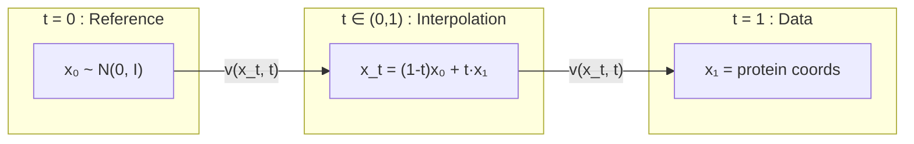
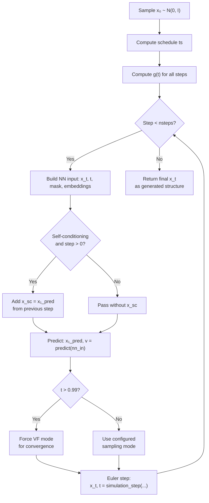

---
slug:5-flow-matching-on-r3
blog_type:normal
---

IDPFold2 通过学习一个连续时间向量场，将噪声传输为真实的构象，从而生成 3D 蛋白质结构。`R3NFlowMatcher` 类在乘积空间 **(ℝ³)ⁿ**（每个残基对应一个 3D 坐标）上实现该传输，使其成为连接随机高斯参考样本与折叠蛋白质结构的生成引擎。本页将阐释共同促成高质量结构生成的数学基础、双参数化设计（预测干净样本 vs. 速度）、随机采样模式以及时间调度策略。

来源: [r3flow.py](/src/model/flow_matching/r3flow.py#L1-L656)

## 数学基础

流匹配定义了一条时间相关的概率路径 *p_t*，连接简单的参考分布 *p₀*（各向同性高斯分布）与目标数据分布 *p₁*（折叠蛋白质）。(ℝ³)ⁿ 上的核心插值是**仿射随机插值**：

> **x_t = (1 − t) x₀ + t x₁**, &emsp; t ∈ [0, 1]

其中 *x₀ ~ N(0, σ²I)* 为参考样本，*x₁* 为以纳米坐标表示的干净蛋白质结构。对其求导可得出用于训练的目标速度场：

> **ẋ_t = dx_t/dt = (x₁ − x_t) / (1 − t)**

神经网络学习预测该速度（或等价地预测干净样本 *x₁*），在推理阶段，ODE/SDE 积分器遵循从 *t = 0* 到 *t = 1* 的已学习场，从而生成结构。

选择仿射插值并非任意——它产生了一个**闭式 log-SNR** 关系，从而实现了基于分数的采样：

> **log-SNR(t) = 2 · ln(t / (1 − t))**, &emsp; **d/dt log-SNR = 2 / (t(1 − t))**

此 log-SNR 在 `log_snr()` 中实现，为随机采样所需的向量场与分数函数之间提供了理论桥梁。

来源: [r3flow.py](/src/model/flow_matching/r3flow.py#L95-L150)

## 中心化平移与掩码

蛋白质结构位于**零质心子空间** (ℝ₀³)ⁿ 上——全局平移是无关紧要的。`R3NFlowMatcher` 通过 `zero_com` 标志强制执行此约束，该标志在训练期间默认设为 `True`（具体为 `zero_com=not args.motif_conditioning`）。三个内部方法在整个流程中维持此不变性：

| 方法 | 用途 | 关键操作 |
|---|---|---|
| `_force_zero_com(x, mask)` | 沿残基维度对张量进行中心化 | `x − mean(x, dim=-2)`（使用掩码感知均值） |
| `_apply_mask(x, mask)` | 将填充残基置零 | `x * mask[..., None]` |
| `_mask_and_zero_com(x, mask)` | 依次执行掩码 → 中心化（若 `zero_com` 为真） | 组合上述两操作 |

掩码感知中心化使用 `align_utils` 中的 `mean_w_mask`，其计算掩码均值，从而使填充残基不会偏移质心。此不变性在每一阶段均被强制执行：参考采样、插值、速度计算以及每个欧拉积分步。

来源: [r3flow.py](/src/model/flow_matching/r3flow.py#L28-L80), [train.py](/src/train.py#L127-L127)

## 双参数化：干净样本 vs. 速度

IDPFold2 中的一个关键设计选择是，**网络预测干净样本 x₁**（而非直接预测速度），随后通过 `xt_dot` 方法将其转换为速度。这由 `prediction_to_x_clean` 中的 `target_pred` 参数控制：

| `target_pred` | 网络输出 | 恢复公式 |
|---|---|---|
| `"x_1"`（默认） | 预测的干净结构 *x̂₁* | 直接使用 *x̂₁* |
| `"v"` | 预测的速度 *v̂* | *x̂₁ = x_t + (1−t) · v̂* |

恢复 *x̂₁* 后，速度目标通过解析计算得出：

> **v = (x̂₁ − x_t) / (1 − t)**

这种干净样本参数化提供了一个关键优势：它支持**自条件化**，即将前一步预测的 *x̂₁* 作为 `x_sc` 反馈到网络的下一次前向传播中，允许模型迭代地优化其自身的预测。

来源: [integral.py](/src/model/integral.py#L24-L37), [integral.py](/src/model/integral.py#L40-L89), [r3flow.py](/src/model/flow_matching/r3flow.py#L152-L183)

## 流匹配训练损失

训练目标是真实干净样本与预测干净样本之间的**加权 MSE 损失**。给定真实坐标 *x₁*、预测 *x̂₁*、时间 *t* 和残基掩码 *m*：

1. 计算每个残基的误差：`err = (x₁ − x̂₁) · m[..., None]`
2. 对有效残基求均值：`loss = Σ(err²) / (n_valid × 3)`
3. 应用**逆 SNR 加权**：`loss × 1 / ((1−t)² + ε)`

加权因子 `1 / (1−t)²` 增加了 *t = 1* 附近的损失权重（此时模型必须对最终结构保持精确），并降低了 *t = 0* 附近的权重（此时目标主要由噪声主导）。完整的训练循环还会在混合专家层激活时，添加**键距损失**（比较 10Å 截断内的成对距离矩阵）和 **MoE 负载均衡损失**。

来源: [integral.py](/src/model/integral.py#L173-L228), [integral.py](/src/model/integral.py#L237-L319)

## 采样：确定性 ODE 与随机 SDE

在推理阶段，`full_simulation` 使用欧拉格式对 *t = 0* 到 *t = 1* 进行积分。有两种采样模式可用，对应于两种微分方程：

**方程 (1) — 向量场 (VF) 模式**：`dx_t = v(x_t, t) dt`

这是标准的确定性 ODE。欧拉步即 `x_{t+dt} = x_t + v · dt`。当 `sampling_mode="vf"` 时，所有步骤均使用此模式；且无论为何种模式，**最后几步均强制使用此模式**（t > 0.99），以确保收敛整洁。

**方程 (2) — 分数 (SC) 模式**：`dx_t = [v + g(t)·s(x_t,t)] dt + √(2g(t)) dw_t`

此 SDE 增加了**分数相关漂移**与**布朗噪声**。分数 *s(x_t, t)* 通过仿射插值与高斯参考的闭式关系，由已学习向量场推导得出：

> **s(x_t, t) = (t · v − x_t) / (scale_ref² · (1 − t))**

该计算在 `vf_to_score()` 中实现。噪声函数 *g(t)* 可配置（见下文）。两个缩放参数提供了精细控制：

| 参数 | 作用 | 效果 |
|---|---|---|
| `sc_scale_noise` | 缩放扩散项 √(2·g·scale_noise·dt) | >1 增加多样性；<1 降低随机性 |
| `sc_scale_score` | 缩放分数漂移 g·score·scale_score | 控制来自分数的引导强度 |

当 *g(t) = 0* 或 `sc_scale_noise = sc_scale_score = 0` 时，SDE 严格退化为 ODE（除浮点差异外）。

来源: [r3flow.py](/src/model/flow_matching/r3flow.py#L185-L352)

## 时间调度策略

区间 [0, 1] 的离散化显著影响样本质量。`get_schedule` 中实现了六种调度模式，每种均生成 `nsteps + 1` 个时间点：

| 调度 | 公式 | 特征 |
|---|---|---|
| `"uniform"` | `linspace(0, 1, nsteps+1)` | 等距 |
| `"power"` | `linspace(0,1)^p` | 集中步骤于 0 附近 (p>1) 或 1 附近 (p<1) |
| `"log"` | `1 − logspace(−p, 0, nsteps+1).flip(0)`，归一化 | 对数间距，密集于 t=0 附近 |
| `"loglinear"` | 基于 SNR，使用 `logspace(−6, 6)` | 在 log-SNR 空间中均匀 |
| `"edm"` | EDM 风格的 σ² ρ-间距，通过 SNR 转换为 t | Karras 等人的调度 |
| `"cos_sch_v_snr"` | SNR = (cos/sin)^p，转换为 t | 基于余弦的 SNR 调度 |

**对数调度**（推理时的默认调度，p=2.0）在轨迹变化剧烈的早期噪声阶段放置了更多的积分步，而在结构接近成形的 t=1 附近放置较少步数。这符合直觉：模型在从噪声转变为结构时需要更精细的分辨率。

类似地，**训练的时间采样分布**（`integral.py` 中的 `sample_t`）支持在损失计算期间抽取随机时间 *t* 的多种策略：均匀分布、logit-正态分布（logit 空间中的高斯分布）、Beta 分布，以及混合均匀+Beta 方案。

来源: [r3flow.py](/src/model/flow_matching/r3flow.py#L601-L656), [integral.py](/src/model/integral.py#L92-L117)

## 随机采样的噪声函数 g(t)

`get_gt` 方法计算 SDE 采样模式中使用的噪声调度 *g(t)*。提供三种基础模式：

| 模式 | 公式 | 行为 |
|---|---|---|
| `"us"` | `(1−t) / (t + ε)` | t=0 时发散，t=1 时趋于零 |
| `"tan"` | `(π/2) · sin((1−t)π/2) / (cos((1−t)π/2) + ε)` | 三角变体，形状类似 |
| `"1/t"` | `1 / (t + ε)` | 简单倒数，在 t=0 附近更强 |

计算基础 *g(t)* 后，可通过 `transform_gt` 进行**幂变换**以重塑调度：对 *g* 进行对数中心归一化，应用 Sigmoid 函数，求 `param` 次幂，并逆转归一化。这在基础调度与扁平化版本之间提供了平滑且可调的插值。最后，`clamp_val` 对 *g(t)* 进行限幅以防止数值不稳定。

来源: [r3flow.py](/src/model/flow_matching/r3flow.py#L540-L599)

## 完整模拟循环

`full_simulation` 方法编排了整个生成过程。下图展示了其控制流：

关键实现细节：该方法在 `torch.no_grad()` 下运行，支持**模体条件化**（通过 `fixed_structure_mask` 和 `x_motif` 固定结构区域），并可通过向网络传递链标识符和残基索引来容纳**多聚体输入**。最后几步始终强制使用 VF 模式，以确保向最终结构的确定性收敛。

来源: [r3flow.py](/src/model/flow_matching/r3flow.py#L389-L538), [integral.py](/src/model/integral.py#L322-L400)

## 训练 vs. 推理：全景概览

流匹配框架扮演着由共享数学对象——向量场 *v(x_t, t)*——连接的两个不同角色：

| 阶段 | 入口点 | 流匹配器角色 | 目标 |
|---|---|---|---|
| **训练** | `training_predict()` | `interpolate()` 构建 x_t；`xt_dot()` 计算目标 v | 通过对 *x̂₁* 的 MSE 学习 *v* |
| **推理** | `generating_predict()` | `full_simulation()` 使用已学习的 *v* 积分 ODE/SDE | 生成蛋白质结构 |

在训练期间，流匹配器构建训练信号：从参考中抽取 *x₀*，插值创建 *x_t*，并计算目标速度。网络被训练以匹配该速度（通过预测 *x₁* 间接实现）。在推理期间，训练后的网络扮演 ODE/SDE 中 *v* 的角色，流匹配器通过对其进行积分来生成样本。

<CgxTip>`scale_ref` 参数（默认 1.0）缩放参考高斯标准差。它同时出现在 `sample_reference`（噪声乘以 `scale_ref`）和 `vf_to_score`（以 `scale_ref²` 形式出现）中。更改此参数需确保训练与推理间的一致性——分数推导假设生成训练数据时使用了相同的 `scale_ref`。</CgxTip>

<CgxTip>自条件化（当 `self_cond=True` 时激活）是一种免费的推理时技术，可显著提升样本质量：在第一步之后的每个欧拉步中，前一步预测的干净样本将作为 `x_sc` 输入网络。这为模型提供了一个用于优化的“草稿”，类似于扩散模型中的迭代优化。在训练期间，自条件化以随机方式应用（50% 概率），以便网络学习使用该信号。</CgxTip>

来源: [r3flow.py](/src/model/flow_matching/r3flow.py#L354-L387), [integral.py](/src/model/integral.py#L237-L319), [integral.py](/src/model/integral.py#L322-L400)

## 后续内容

流匹配框架定义了学习*什么*（ℝ³ 上的向量场）以及*如何*从中采样，但将实际的函数逼近委托给 **Protein Transformer 网络**。该网络架构——包括其混合专家过渡层和成对偏置注意力机制——决定了已学习向量场的表达力与效率。

→ 继续阅读 [混合专家过渡层](6-mixture-of-experts-transition-layers) 以了解向量场如何参数化，或跳转至 [Protein Transformer 网络](7-protein-transformer-network) 查看完整架构概览。关于实际的采样配置，请参见 [采样与引导策略](10-sampling-and-guidance-strategies)。