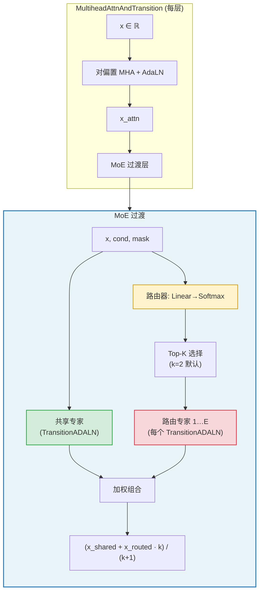

---
slug:6-mixture-of-experts-transition-layers
blog_type:normal
---


IDPFold2 将每个 Transformer 层中稠密的前馈过渡块替换为**稀疏混合专家过渡层**。这一架构选择在不按比例增加逐 token 计算量的情况下扩展了模型容量：每个残差 token 始终由一个共享专家处理，并被选择性路由到少量专用专家子集中，使网络能够通过不同的专家路径学习独特的结构基序——螺旋、折叠、环、接触。该设计遵循**共享专家 + 路由专家**范式，其中单一专家提供稳定的基线变换，而路由专家注入依赖路由的专化特性。

## 在蛋白质 Transformer 中的架构角色

MoE 过渡层位于每个 `MultiheadAttnAndTransition` 块内部，该块是 `ProteinTransformerAF3` 主干的基本重复单元。每一层首先应用对偏置多头注意力，然后应用 MoE 过渡。当 `use_moe=False` 时，该过渡层退化为标准的 `TransitionADALN`（AdaptiveLayerNorm → SwiGLU MLP → 自适应输出缩放）。启用时，该单一专家成为**共享专家**，并实例化 `n_experts` 个独立副本作为路由专家。路由器为每个 token 选择 `n_activated_experts`（top-k）个专家，并由 softmax 分数加权。



来源: [protein_transformer.py](/src/model/protein_transformer.py#L153-L261), [moe_modules_torch.py](/src/model/components/moe_modules_torch.py#L55-L113)

## MoE 类：共享专家 + 路由专家

核心 `MoE` 模块实例化一个**共享专家**（基础 `TransitionADALN`）和一个 `Experts` 容器，该容器持有 `n_experts` 个相同专家架构的深拷贝实例。路由器是一个轻量级的 `nn.Linear(dim + dim_router_cond, n_experts)` 后接 `Softmax`，为每个展平的 token 生成在所有专家上的分布。

**前向传播逻辑** — 给定输入 `x`、条件 `cond` 和掩码 `mask`：

1. **路由器分数**：`scores = Softmax(W · [x | router_condition])`，然后 top-k 选择产生 `expert_weights` 和 `expert_indices`。
2. **共享专家**：`x_shared = shared_expert(x, cond, mask)` — 始终执行。
3. **路由专家**：Token 被收集到各专家的桶中，每个专家处理其桶内的 token，结果被散布回原位并由 `expert_weights` 加权。
4. **组合**：当 `normalize_expert_weights=True`（默认）时，输出为 `(x_shared + x_routed * k) / (k + 1)`，确保共享和路由的贡献在比例上保持平衡。否则，使用简单求和 `x_shared + x_routed`。

| 参数 | 默认值 | 描述 |
|---|---|---|
| `n_experts` | 5 | 路由专家的总数 |
| `n_activated_experts` | 2 | 每个 token 激活的 top-k 专家数 |
| `dim` | 768 | Token 维度（路由器输入） |
| `dim_router_cond` | 0 | 路由器的可选额外条件维度 |
| `capacity_factor` | 1.3 | 控制专家缓冲区容量以限制丢弃的 token |
| `normalize_expert_weights` | True | 平衡共享与路由输出的幅度 |
| `load_balance` | True (训练) / False (验证) | 是否累积负载均衡统计量 |

来源: [moe_modules_torch.py](/src/model/components/moe_modules_torch.py#L55-L113), [train.yaml](/configs/train.yaml#L96-L101)

## Token 路由机制

`Experts` 类使用基于桶的收集/散布模式实现了**容量受限的 token 路由**。这对高效的 GPU 利用率至关重要：并非为每个具有可变长度输入的专家启动一个核，而是将 token 按专家分配排序，打包到固定容量的桶中，并在统一的批处理循环中处理。

### 路由流水线

```mermaid
flowchart LR
    A["Token 分配<br/>(top-k 索引)"] --> B["按专家 ID 排序"]
    B --> C["直方图<br/>(每个专家的 token 数)"]
    C --> D["累加和<br/>(桶边界)"]
    D --> E["binned_gather<br/>&#40;分发到专家缓冲区&#41;"]
    F["专家前向传播<br/>&#40;每个专家顺序执行&#41;"]
    E --> F
    F --> G["binned_scatter<br/>&#40;路由回原位 + 应用权重&#41;"]
    G --> H["重塑为<br/>[b, n, d]"]
```



**逐步说明：**

1. **排序与直方图**：对专家分配进行排序以按目标专家对 token 分组。直方图计算每个专家的 token 数；包含累加和定义桶边界。
2. **专家容量**：`capacity = min(max(tokens_per_expert), ⌊capacity_factor × k × total_tokens / n_experts⌋)`。超出容量的 token 将被**丢弃**（输出为零）。在验证期间，`force_capacity=False` 会禁用容量上限以避免丢弃。
3. **`binned_gather`**：使用排序后的索引将 token 分发到形状为 `[n_experts, capacity, dim]` 的张量中。返回用于反向散布的目标索引。
4. **专家计算**：每个专家 `i` 使用相应的 `cond` 和 `mask` 处理其切片 `x[i, :, :]`。优化路径（`_single_expert_forward`）会跳过空专家桶的计算。
5. **`binned_scatter`**：将专家输出路由回原始 token 顺序，在回传过程中乘以 `expert_weights`，然后通过 `index_add_` 聚合 top-k 贡献。

<CgxTip>`capacity_factor` 是一个关键超参数。过低 → token 被丢弃 → 信息丢失。过高 → 在补零上浪费内存。默认值 1.3 在均匀负载预期上提供了约 30% 的余量。在验证期间，容量限制被放宽（`force_capacity=False`）以确保没有 token 被丢弃。</CgxTip>

来源: [moe_modules_torch.py](/src/model/components/moe_modules_torch.py#L116-L240), [moe_operations.py](/src/model/components/moe_operations.py#L1-L59)

## 两种后端实现

IDPFold2 提供了两种功能等效但路由核不同的 MoE 实现：

| 方面 | `moe_modules_torch.py` | `moe_modules.py` |
|---|---|---|
| **排序** | `torch.sort` | `megablocks.ops.sort` (CUDA 核) |
| **直方图** | `torch.histc` | `megablocks.ops.histogram` (CUDA 核) |
| **累加和** | N/A (使用 `torch.histc` + sort) | `megablocks.ops.inclusive_cumsum` |
| **收集/散布** | `moe_operations.binned_gather/scatter` (PyTorch) | `megablocks.ops.binned_gather/scatter` (CUDA) |
| **源索引** | `indices.long() // top_k` 用于正确的多 token 映射 | 直接 `megablocks.ops` 索引 |
| **实际使用** | ✅ 在 `protein_transformer.py` 中导入 | 可用于 CUDA 优化路径 |

**PyTorch 后端**（`moe_modules_torch`）是生产模型中实际导入使用的后端。**MegaBlocks 后端**（`moe_modules`）利用来自 `megablocks/` 子模块的自定义 CUDA 核，可能实现更快的排序和直方图计算，但需要编译 C++/CUDA 扩展。两者共享相同的 `MoE` 和 `Experts` 类接口以及相同的负载均衡损失累积机制。

来源: [protein_transformer.py](/src/model/protein_transformer.py#L13), [moe_modules.py](/src/model/components/moe_modules.py#L1-L236), [moe_modules_torch.py](/src/model/components/moe_modules_torch.py#L1-L244)

## 路由器设计与条件化

路由器将每个 token 的表示映射为专家上的概率分布：

```python
scores = Softmax(Linear(x_flat))  # [b*n, n_experts]
expert_weights, expert_indices = topk(scores, k=n_activated_experts)
expert_weights = expert_weights / expert_weights.sum(dim=-1, keepdim=True)  # 重新归一化
```

**路由器条件化**（`dim_router_cond > 0`）：当存在额外的条件信号（例如结构或序列嵌入）时，它们会在线性投影之前与 token 表示拼接：`scores = Softmax(W · [x | router_condition])`。在默认配置中，`dim_moe_cond=0`，意味着路由器纯粹基于 token 表示运行。这保持了路由器的轻量化——仅有一个线性层——避免了会增加计算开销从而破坏稀疏性优势的问题。

**Top-k 专化**：当 `n_activated_experts=1` 时，路由器使用 `max` 而非 `topk`，退化为硬路由分配。当 `k=2`（默认）时，每个 token 接收两个专化专家的加权混合，提供更平滑的梯度和更好的专家利用率。

来源: [moe_modules_torch.py](/src/model/components/moe_modules_torch.py#L95-L108)

## 负载均衡辅助损失

稀疏 MoE 网络面临**专家坍塌**问题：路由器可能收敛到将所有 token 发送到一小部分专家，而使其他专家未受训练。IDPFold2 通过在前向传播中跨所有 MoE 层累积辅助负载均衡损失来解决此问题。

**机制**：每次 `Experts.forward()` 调用都会将 `(tokens_per_expert, scores)` 附加到全局列表 `_LOAD_BALANCING_LOSS` 中。完整前向传播后，`batched_load_balancing_loss` 计算如下：

$$L_{\text{balance}} = \frac{n_{\text{experts}} \cdot w_{\text{moe}}}{n_{\text{layers}} \cdot T \cdot k} \cdot \langle f, p \rangle$$

其中 `f` 是跨层每个专家的 token 平均分数，`p` 是每个专家的平均路由概率，`T` 是 token 总数，`w_moe` 是损失权重（默认 0.3）。点积 ⟨f, p⟩ 惩罚高路由概率与高 token 负载之间的相关性——在均匀路由下，f 和 p 相互独立，其乘积最小化。

| 配置键 | 值 | 目的 |
|---|---|---|
| `loss.moe_loss_weight` | 0.3 | 缩放辅助损失 |
| `model.load_balance` | `True` (训练) | 累积损失统计量 |
| `model.load_balance` | `False` (验证) | 跳过累积以进行纯净评估 |

负载均衡损失在每个训练步开始时通过 `clear_load_balancing_loss()` 清除，并在 `training_predict` 期间添加到主要的流匹配损失中。

<CgxTip>负载均衡损失是在完整的模型前向传播*之后*计算的，而不是在每层内部。这意味着所有 MoE 层共同贡献于一个标量辅助损失，然后由 `moe_loss_weight / (n_layers * T * k)` 缩放。此设计确保辅助损失的幅度不随层数或 token 数变化，防止其随着模型深度增加而主导主要的流匹配目标。</CgxTip>

来源: [moe_modules_torch.py](/src/model/components/moe_modules_torch.py#L9-L52), [integral.py](/src/model/integral.py#L10), [train.yaml](/configs/train.yaml#L30)

## 专家架构：TransitionADALN

每个单独的专家——无论是共享还是路由——都是一个 `TransitionADALN` 块，它用自适应条件化封装了基础 `Transition`（SwiGLU 前馈）：

```
TransitionADALN:
  x → AdaptiveLayerNorm(x, cond) → Transition(x) → AdaptiveOutputScale(x, cond) → x * mask
```

`Transition` 本身使用 **SwiGLU** 激活：`Linear(d → 2d) → chunk → SiLU(gate) * value → Linear(d → d)`，扩展因子为 2（可配置）。自适应层在输入（AdaLN 调制缩放和偏置）和输出（AdaLN-zero 初始化接近恒等映射以稳定早期训练）处注入条件化信息（时间嵌入，序列特征）。

这意味着 5 个路由专家中的每一个都维护其独立的 AdaLN 和 SwiGLU 参数集，允许它们在蛋白质结构预测任务的不同方面进行专化，同时共享相同的架构模板。

来源: [af3_modules.py](/src/model/components/af3_modules.py#L84-L114), [protein_transformer.py](/src/model/protein_transformer.py#L125-L150)

## 默认配置与参数预算

从训练配置来看，MoE 过渡层对模型的总参数量贡献显著：

| 组件 | 数量 | 各自参数量 | 总参数量 |
|---|---|---|---|
| 共享专家 | 1 | TransitionADALN(d=768) | ~4.7M |
| 路由专家 | 5 | TransitionADALN(d=768) | ~23.5M |
| 路由器 | 1 | Linear(768 → 5) | ~3.8K |
| **每层** | — | — | **~28.2M** |
| **跨 10 层** | — | — | **~282M** |

如果没有 MoE（每层单个 TransitionADALN），过渡块总计仅约 47M 参数。因此，MoE 设计在过渡路径中提供了 **6 倍的容量增长**，同时每个 token 每层仅激活约 14.1M 参数（共享 + 2 路由），实现了 **2 倍的计算容量比**。

来源: [train.yaml](/configs/train.yaml#L58-L101), [protein_transformer.py](/src/model/protein_transformer.py#L377-L403)

## 与流匹配框架的集成

在训练期间，MoE 过渡层在 `training_predict` 函数中被调用，该函数：(1) 清除负载均衡损失累加器，(2) 运行模型前向传播（触发每层的 MoE 路由），(3) 计算流匹配速度预测损失，(4) 添加由 `moe_loss_weight` 缩放的批处理负载均衡损失，(5) 返回组合损失用于反向传播。

在推理期间（ODE 采样），传入 `force_moe_capacity=False` 以避免丢弃 token，并且 `load_balance=False` 完全跳过辅助损失累积，因为不需要计算梯度。路由器仍为每个 token 选择 top-k 专家，并应用相同的共享专家 + 路由专家组合。

来源: [integral.py](/src/model/integral.py#L40-L89), [train.py](/src/train.py#L258-L270)

## 后续步骤

- 有关更广泛的网络上下文，请参阅 [蛋白质 Transformer 网络](7-protein-transformer-network)，其中展示了 MoE 层如何在整个主干中与注意力组合。
- 有关每个专家内部的自适应条件化机制，请参阅 [自适应层归一化与对偏置注意力](8-adaptive-layer-norm-and-pair-biased-attention)。
- 有关辅助损失集成的训练细节，请参阅 [负载均衡与 MoE 损失](13-load-balancing-and-moe-loss)。