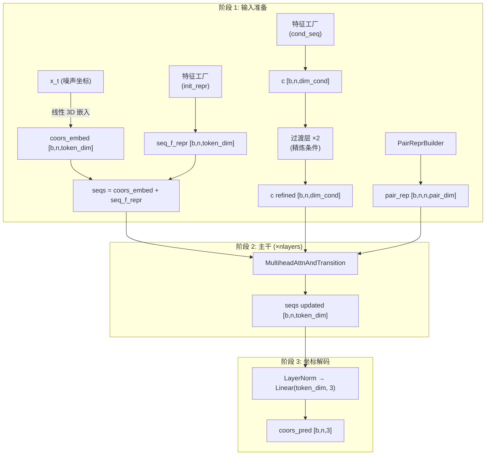
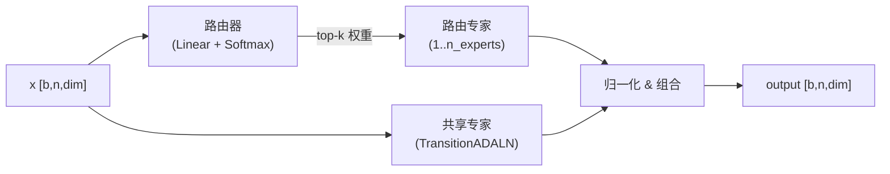
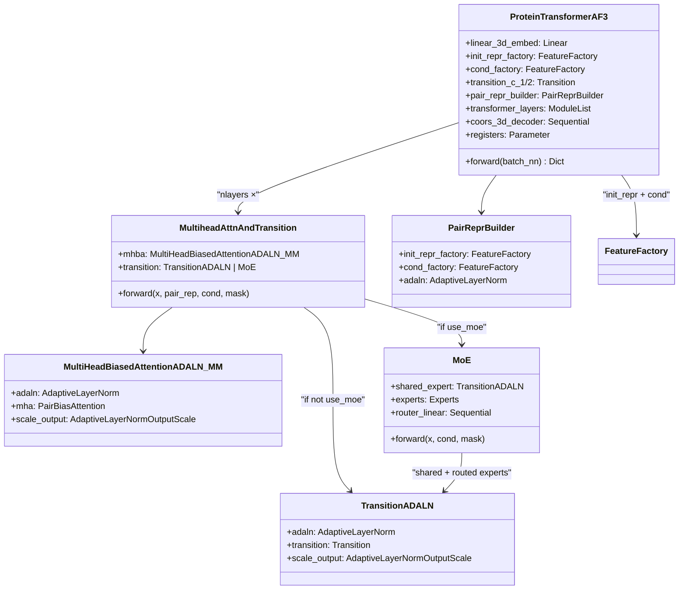

---
slug:7-protein-transformer-network
blog_type:normal
---


**蛋白质 Transformer 网络**（`ProteinTransformerAF3`）是 IDPFold2 的核心神经架构——一种条件自适应、对偏置的 Transformer，在流匹配采样过程中从噪声插值中预测干净的 3D 坐标。它从 AlphaFold3 的扩散模块（算法 23）中汲取了算法灵感，将**自适应 LayerNorm 条件化**、**对偏置多头注意力**和**混合专家过渡层**结合到一个统一的主干网络中，处理逐残基 token 表示以及成对结构表示。本页解释了网络的三阶段执行模型、其可组合的层架构，以及将序列、对和条件信号绑定在一起的数据流。

来源：[protein_transformer.py](/src/model/protein_transformer.py#L1-L529)

## 三阶段执行模型

网络在三个不同阶段运行——**输入准备**、**主干执行**和**坐标解码**——每个阶段职责明确分离。理解这种分阶段执行对于掌握异构输入信号（噪声坐标、时间嵌入、残基类型、PLM 嵌入）如何统一为连贯的 3D 预测至关重要。



**阶段 1 — 输入准备** 构建三个并行表示。*序列表示*（`seqs`）由噪声 3D 坐标的线性投影与特征派生的初始 token 相加形成。*条件向量*（`c`）由 `FeatureFactory` 生成，并通过两个连续的 `Transition` 层（基于 SwiGLU 的前馈网络）进行精炼。*对表示*（`pair_rep`）由 `PairReprBuilder` 构建，它可选择在对特征之上应用 AdaptiveLayerNorm 条件化。这三者在进入主干网络之前都会使用**寄存器 token** 进行扩展。

**阶段 2 — 主干执行** 在序列表示上迭代 `nlayers` 个相同的 `MultiheadAttnAndTransition` 块，同时将对表示和条件向量作为侧边输入保持固定。每个块应用对偏置注意力，随后是一个（可能为 MoE 的）过渡层，两者都封装在 AdaptiveLayerNorm/AdaptiveOutputScale 中。

**阶段 3 — 坐标解码** 剥离寄存器 token，并通过 `LayerNorm → Linear(token_dim, 3)` 头投影最终的 token 表示，以恢复预测的干净坐标。

来源：[protein_transformer.py](/src/model/protein_transformer.py#L305-L526)

## Transformer 层：MultiheadAttnAndTransition

每个主干层都是 `MultiheadAttnAndTransition` 的一个实例，它是蛋白质 Transformer 网络内的原子计算单元。它封装了两个子操作——**对偏置注意力**和**过渡**——具有可配置的残差连接和执行顺序。

### 执行模式：顺序 vs. 并行

一个关键的架构选择是注意力和过渡是**顺序**执行（标准 Transformer）还是**并行**执行（AlphaFold3 风格）。在并行模式下，两个分支读取相同的输入 `x`，并将其输出相加，从而将每层的有效深度减少为单个逻辑步骤。当并行模式激活*且*两个分支都具有残差连接时，过渡残差会自动禁用，以防止将 `x` 相加两次。

| 模式 | 计算 | 有效深度 | 残差约束 |
|---|---|---|---|
| 顺序 | `x → Attn → Transition` | 2 个子步骤 | 允许双残差 |
| 并行 | `x → Attn(x) + Trans(x)` | 1 个子步骤 | 过渡残差自动禁用 |

### 使用 AdaptiveLayerNorm 封装子操作

注意力和过渡子操作都遵循相同的 **AdaLN → Op → AdaScale** 模式：

1. **AdaptiveLayerNorm** 对输入进行归一化，并使用条件变量 `c` 对其重新缩放/重新偏移，产生一个依赖条件的输入变换。
2. 核心操作（注意力或前馈）在 AdaLN 输出上执行。
3. **AdaptiveLayerNormOutputScale** 对输出应用一个学习到的、依赖条件的门控（初始化接近零），实现了自适应 Layer Norm 论文中的“零初始化”技巧，确保每层在初始化时是一个近似恒等函数。

这种封装模式对流匹配至关重要：时间嵌入通过 `c` 流入每个 AdaLN 门控，允许网络在扩散轨迹上连续调制其行为。

来源：[protein_transformer.py](/src/model/protein_transformer.py#L153-L261), [af3_modules.py](/src/model/components/af3_modules.py#L1-L114)

## 对偏置注意力机制

主干中使用的注意力机制是 `MultiHeadBiasedAttentionADALN_MM`，它用 AdaptiveLayerNorm 条件化封装了 `PairBiasAttention`。核心注意力计算如下：

```
attn_weights = softmax(Q·K^T / √d + bias_from_pair)  ∈ [b, h, n, n]
```

**对偏置**项从对表示中通过线性层投影得出：`bias = Linear(LayerNorm(pair_rep))`，形状为 `[b, n, n, heads]`。这允许残基对之间的结构关系（编码为距离分箱、相对位置等）直接影响哪些 token 彼此关注——这是标准 Transformer 中缺失的机制，但对于捕获蛋白质结构中固有的几何先验至关重要。

该注意力还支持 **Q/K LayerNorm**（`use_qkln`），它在计算点积之前对查询和键应用独立的 LayerNorm。这稳定了注意力幅度，并在推理配置中默认启用。

<CgxTip>对偏置在 softmax *内部* 相加，而不是作为注意力后门控。这意味着对表示可以完全抑制或放大特定的注意力路径——它充当一个学习到的结构邻接矩阵，而不是一种软调制。</CgxTip>

来源：[pair_bias_attn.py](/src/model/components/pair_bias_attn.py#L21-L96), [protein_transformer.py](/src/model/protein_transformer.py#L86-L122)

## 混合专家过渡

当 `use_moe=True` 时，过渡层被替换为 `MoE` 模块，该模块结合了一个**共享专家**（始终激活）和 `n_experts` 个路由专家，其中 `n_activated_experts`（top-k）由学习到的路由器按 token 选择：



路由器是一个线性投影（`dim + dim_moe_cond → n_experts`）后接 softmax，产生在专家上的概率分布。选择 top-k 专家，其输出由归一化的路由器分数加权。共享专家的输出始终包含在内，当 `normalize_expert_weights=True` 时，最终输出为：

```
output = (shared_expert(x) + k × routed_experts(x)) / (k + 1)
```

这种归一化确保 MoE 层无论激活专家数量如何，都具有大致单位尺度，防止在专家数量增长时出现幅度爆炸。

### Token 路由与容量

专家路由使用一种**基于分箱的分发**策略。Token 按其分配的专家排序，划分为每个专家的分箱，并并行处理。`capacity_factor`（默认 1.3）控制任何单个专家可以处理的最大 token 数——超过容量的 token 将被丢弃。这种机制防止负载不平衡导致内存激增。

<CgxTip>在推理期间，`force_moe_capacity=True` 默认生效，它将有效容量上限设为 `min(max_tokens_per_expert, capacity_factor × top_k × total_tokens / n_experts)`。在训练期间，负载均衡损失（参见[负载均衡与 MoE 损失](13-load-balancing-and-moe-loss)）鼓励均匀的专家利用率以最小化 token 丢弃。</CgxTip>

来源：[moe_modules_torch.py](/src/model/components/moe_modules_torch.py#L55-L244), [protein_transformer.py](/src/model/protein_transformer.py#L210-L228)

## 输入特征构建

### 序列表示特征

初始序列表示是两个信号之和：噪声 3D 坐标的线性嵌入和特征派生的 token 向量。`FeatureFactory`（模式=`"seq"`）从可配置的特征创建器列表中组装后者：

| 特征键 | 类 | 输出形状 | 描述 |
|---|---|---|---|
| `plm_emb` | `PLMSeqFeat` | `[b, n, plm_out_dim]` | 线性投影的 ESM-2 嵌入 |
| `res_type` | `ResidueTypeSeqFeat` | `[b, n, 20]` | 独热氨基酸标识 |
| `res_idx` | `IdxEmbeddingSeqFeat` | `[b, n, idx_emb_dim]` | 正弦索引嵌入 |
| `chain_break_per_res` | `ChainBreakPerResidueSeqFeat` | `[b, n, 1]` | 二进制链边界指示符 |
| `time_emb` | `TimeEmbeddingSeqFeat` | `[b, n, t_emb_dim]` | 正弦流时间嵌入 |

每个特征独立计算，沿特征维度拼接，然后通过线性层（+ 可选 LayerNorm）投影到目标输出维度。除非 `strict_feats=True`，缺失的特征会优雅退化为零张量。

### 对表示特征

对表示由 `PairReprBuilder` 构建，它使用对模式 `FeatureFactory` 并可选地应用 AdaptiveLayerNorm 条件化：

| 特征键 | 类 | 输出形状 | 描述 |
|---|---|---|---|
| `xt_pair_dists` | `XtPairwiseDistancesPairFeat` | `[b, n, n, dist_dim]` | 来自噪声坐标的分箱独热成对距离 |
| `rel_pos` | `RelativePositionPairFeat` | `[b, n, n, 2+2(r_max+1)]` | 相对残基位置 + 同链指示符 |
| `time_emb` | `TimeEmbeddingPairFeat` | `[b, n, n, t_emb_dim]` | 广播到对形状的时间嵌入 |

`XtPairwiseDistancesPairFeat` 将来自噪声坐标 `x_t` 的成对欧几里得距离分箱为独热向量，将关于扩散轨迹当前状态的几何信息编码到对表示中。

### 条件变量特征

条件向量 `c` 由 `feats_cond_seq`（通常仅为 `time_emb`）构建，并在进入主干之前通过两个 `Transition` 层进行精炼。这种两步精炼将原始时间嵌入转换为更丰富的条件信号，供整个主干中的 AdaptiveLayerNorm 模块提取使用。

来源：[feature_factory.py](/src/model/components/feature_factory.py#L1-L426), [protein_transformer.py](/src/model/protein_transformer.py#L344-L375)

## 寄存器 Token

网络支持**寄存器 token**——前置到序列表示的可学习参数，为注意力机制提供额外的“暂存空间”。这些 token：

- 初始化为 `randn / 20.0`（小幅度）并在训练期间学习
- 通过全注意力掩码参与所有残基 token 的注意力并被其关注
- 携带零值对表示和零值条件化（它们是纯粹的注意力寄存器）
- 在坐标解码前从输出中剥离

寄存器通过提供专用 token 来缓解长序列中的注意力稀释问题，这些 token 可以聚合全局信息而无需与残基级信号竞争。默认配置使用 `num_registers=10`。

来源：[protein_transformer.py](/src/model/protein_transformer.py#L333-L342), [protein_transformer.py](/src/model/protein_transformer.py#L410-L475)

## 默认架构配置

下表总结了推理配置中的默认架构超参数：

| 参数 | 默认值 | 描述 |
|---|---|---|
| `token_dim` | 768 | 序列表示维度 |
| `nlayers` | 10 | Transformer 主干层数 |
| `nheads` | 12 | 注意力头数 |
| `dim_cond` | 512 | 条件向量维度 |
| `pair_repr_dim` | 512 | 对表示维度 |
| `residual_mha` | True | 注意力周围的残差连接 |
| `residual_transition` | True | 过渡层周围的残差连接 |
| `parallel_mha_transition` | False | 顺序（非并行）层执行 |
| `use_attn_pair_bias` | True | 对表示偏置注意力 |
| `use_qkln` | True | 查询和键上的 LayerNorm |
| `num_registers` | 10 | 寄存器 token 数量 |
| `use_moe` | True | MoE 过渡层 |
| `n_experts` | 5 | 每个 MoE 层的总路由专家数 |
| `n_activated_experts` | 2 | 每个 token 激活的 Top-k 专家数 |
| `capacity_factor` | 1.3 | 专家容量缩放因子 |
| `normalize_expert_weights` | True | 按 (k+1) 归一化 MoE 输出 |

来源：[inference.yaml](/configs/inference.yaml#L48-L92)

## 类层次结构与组合



组合是严格层次化的：`ProteinTransformerAF3` 拥有特征工厂和主干层；每个主干层拥其注意力和过渡子模块；MoE 封装器拥其共享专家及 `Experts` 容器。这种清晰的分离确保每个组件都可以独立测试、替换或消融。

来源：[protein_transformer.py](/src/model/protein_transformer.py#L305-L529)

## 数据流总结

完整的前向传播将至少包含 `{x_t, t, mask}` 的字典 `batch_nn` 转换为预测坐标 `{coors_pred}`：

| 阶段 | 输入 | 操作 | 输出 |
|---|---|---|---|
| 条件化 | `batch_nn` | `cond_factory → Transition ×2` | `c [b,n,512]` |
| 序列初始化 | `batch_nn`, `x_t` | `linear_3d_embed(x_t) + init_repr_factory(batch_nn)` | `seqs [b,n,768]` |
| 对初始化 | `batch_nn` | `pair_repr_builder(batch_nn)` | `pair_rep [b,n,n,512]` |
| 寄存器 | `seqs, pair_rep, mask, c` | 前置寄存器 token | 扩展后的张量 |
| 主干 | `seqs, pair_rep, c, mask` | `×10 MultiheadAttnAndTransition` | `seqs [b,n,768]` |
| 解码 | `seqs` | `LayerNorm → Linear(768,3)` | `coors_pred [b,n,3]` |

此架构在流匹配 ODE 积分的每一步被调用（参见 [R³ 上的流匹配](5-flow-matching-on-r3)），其中它接收当前噪声状态 `x_t` 和时间 `t`，并预测速度场或干净数据目标。条件感知设计确保网络的行为在扩散轨迹上连续自适应——从早期去噪（高噪声，低 `t`）到最终精炼（低噪声，高 `t`）。

要详细了解对偏置注意力和 AdaptiveLayerNorm 模块的工作原理，请参见[自适应 Layer Norm 与对偏置注意力](8-adaptive-layer-norm-and-pair-biased-attention)。对于特征编码流水线，请参见[特征工厂与输入编码](9-feature-factory-and-input-encoding)。关于训练期间如何强制执行 MoE 负载均衡，请参见[负载均衡与 MoE 损失](13-load-balancing-and-moe-loss)。