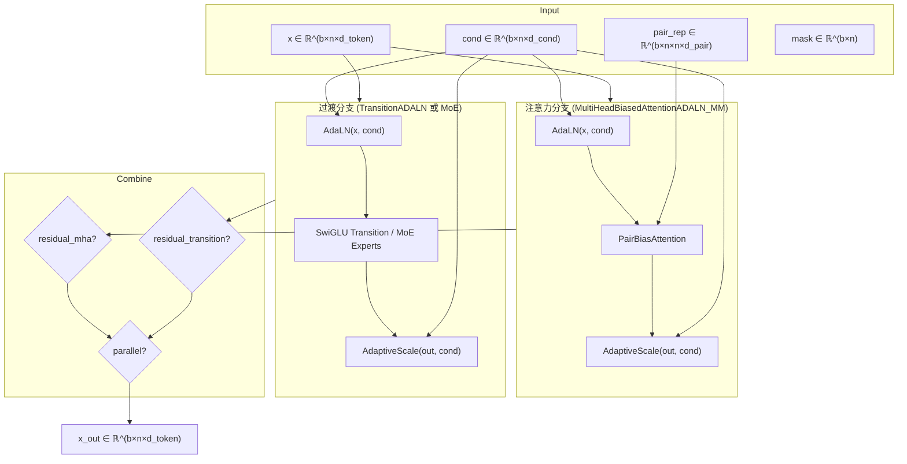

---
slug:8-adaptive-layer-norm-and-pair-biased-attention
blog_type:normal
---


IDPFold2 的 Transformer 主体在两个关键方面脱离了标准架构约定：**自适应层归一化** 用依赖于条件信号的仿射变换取代了每层固定的归一化，而**对偶偏置注意力** 则将学习到的成对几何信号直接注入到注意力逻辑值中。这两种机制共同构成了“三明治”模式——前置 AdaLN，后置自适应输出缩放——该模式支配着 [`ProteinTransformerAF3`](/src/model/protein_transformer.py#L305-L526) 网络中的每一个注意力层和过渡层。本页将阐述这两个组件的数学公式、实现细节与组合结构。

## 自适应层归一化

### 公式与动机

标准 LayerNorm 对归一化后的输入应用固定的、学习到的缩放（γ）和平移（β）。在以扩散时间步 *t* 为条件的生成模型中，这种刚性成为了劣势：不同的噪声水平需要性质不同的变换，然而标准归一化却一视同仁地处理所有时间步。**自适应层归一化** 通过使 γ 和 β 成为条件信号的函数来解决此问题，使得每一层都能在去噪过程从无序向有序演化时自适应地调整其行为。

该操作定义为：

> AdaLN(**x**, **c**) = LayerNorm(**x**) · σ(W_γ · LayerNorm(**c**)) + W_β · LayerNorm(**c**)

其中 **x** ∈ ℝ^dim 为输入表示，**c** ∈ ℝ^dim_cond 为条件向量，σ 为 Sigmoid 函数，W_γ、W_β 为学习到的投影矩阵。对 γ 施加 Sigmoid 函数可确保缩放范围保持在 (0, 1) 内，提供了一种稳定的乘性调制，避免信号爆炸。

### 实现

[`AdaptiveLayerNorm`](/src/model/components/af3_modules.py#L5-L36) 类直接实现了这一点。两个独立的 `LayerNorm` 模块分别对输入流和条件流进行归一化。随后条件信号被分为两支：一支通过 `Linear → Sigmoid` 流水线生成 γ，另一支通过零偏置的 `Linear` 生成 β。二值掩码会将最终输出中的填充位置置零。

```python
# 核心计算（简化版）
normed = self.norm(x)                # LayerNorm(x), elementwise_affine=False
normed_cond = self.norm_cond(cond)   # LayerNorm(c)
gamma = sigmoid(linear_gamma(normed_cond))  # 缩放 ∈ (0, 1)
beta = linear_beta(normed_cond)             # 平移 ∈ ℝ
out = normed * gamma + beta
```

注意，内部 `LayerNorm` 设置了 `elementwise_affine=False`——学习到的仿射参数被自适应参数完全取代。条件向量本身在投影前也进行了归一化，以防止 **c** 的幅度漂移破坏调制的稳定性。

来源: [af3_modules.py](/src/model/components/af3_modules.py#L5-L36)

### 自适应输出缩放

第二种变体 [`AdaptiveLayerNormOutputScale`](/src/model/components/af3_modules.py#L39-L66) 仅提供自适应的乘性门控——无归一化，无平移。其关键设计特征是**零初始化**：线性层的权重初始化为零，偏置初始化为 −2.0，因此初始 Sigmoid 输出为 σ(−2.0) ≈ 0.12。这意味着每一层的输出贡献从接近零开始，并在训练过程中逐渐学习到合适的缩放比例。这正是源自 DiT 的 "AdaLN-Zero" 技术，它通过确保网络以近似恒等映射作为起点，极大地加速了早期阶段的训练。

```python
# 初始化模式
torch.nn.init.zeros_(adaln_zero_gamma_linear.weight)
torch.nn.init.constant_(adaln_zero_gamma_linear.bias, -2.0)  # σ(-2.0) ≈ 0.12
```

来源: [af3_modules.py](/src/model/components/af3_modules.py#L39-L66)

### AdaLN 三明治模式

`AdaptiveLayerNorm` 和 `AdaptiveLayerNormOutputScale` 从不被孤立使用——它们总是以**三明治**的形式包裹在一个核心变换之外。该模式在 [`ProteinTransformerAF3`](/src/model/protein_transformer.py#L305-L526) 内的三个复合模块中实例化：

| 复合模块 | 核心变换 | 参考 |
|---|---|---|
| `MultiHeadAttentionADALN` | 标准多头注意力 | [protein_transformer.py](/src/model/protein_transformer.py#L56-L83) |
| `MultiHeadBiasedAttentionADALN_MM` | 对偶偏置注意力 | [protein_transformer.py](/src/model/protein_transformer.py#L86-L122) |
| `TransitionADALN` | SwiGLU 过渡 | [protein_transformer.py](/src/model/protein_transformer.py#L125-L150) |

每个三明治遵循相同的三步协议：

1. **AdaLN**：`x = adaln(x, cond, mask)` —— 使用条件变量自适应地对输入进行归一化
2. **变换**：`x = core_op(x, ...)` —— 应用注意力或前馈操作
3. **自适应缩放**：`x = scale_output(x, cond, mask)` —— 对输出幅度进行门控

这确保了每个子层的输入分布和输出贡献均依赖于条件，从而创建了一个有效深度和路径强度随扩散时间步动态变化的网络。

来源: [protein_transformer.py](/src/model/protein_transformer.py#L56-L150)

## 对偶偏置注意力

### 公式与动机

标准自注意力将查询和键向量的点积作为兼容性得分。在蛋白质结构预测中，这忽略了一类丰富的信息源：残基之间的**成对几何关系**（距离、相对位置、链归属）。对偶偏置注意力利用从对偶表示中导出的学习偏置来增强标量注意力逻辑值，使模型能够在不改变核心 QKV 机制的情况下，基于空间邻近性及其他成对特征来调制注意力。

修改后的注意力为：

> attn(i, j) = softmax( (Q_i · K_j) / √d + b_ij + mask_ij )

其中 **b** ∈ ℝ^(heads) 是逐头偏置，由对偶表示 **p** ∈ ℝ^dim_pair 通过线性投影计算得出：`b = Linear(pair_feats)`。该偏置在 softmax *之前* 被加入，使其能直接控制哪些 Token 对会产生强烈的注意力。

### 实现

[`PairBiasAttention`](/src/model/components/pair_bias_attn.py#L21-L96) 类将其实现为一个多头注意力层，具备四个鲜明特征：

**1. 对偶偏置注入。** 对偶表示 `[b, n, n, pair_dim]` 通过 `pair_norm`（标准 `LayerNorm`）进行归一化，随后经由线性层 `to_bias` 投影，将 `pair_dim` 映射为 `heads`。重排为 `[b, heads, n, n]` 后，该偏置在 softmax 之前直接加到 QK 相似度矩阵上。

**2. QK LayerNorm。** 当启用 `qkln` 标志时（在所有生产配置中均为 `True`），独立的 `LayerNorm` 模块会分别在投影*之后*、点积*之前*应用于查询和键向量。这通过防止极端查询/键幅度来稳定注意力得分，这是一项源自 AlphaFold3 的技术。

**3. 输出门控。** 门控向量 **g** 由（已归一化的）输入通过专用线性投影 `to_g` 计算得出。注意力计算后，多头输出与 `sigmoid(g)` 进行逐元素相乘，提供了一个学习到的逐通道开关，可以抑制对给定输入无益的注意力头。

**4. 节点预归一化。** 输入节点特征在任何投影之前通过 `node_norm` 进行归一化，确保无论前一层输出幅度如何，输入分布都能保持稳定。

```python
# 注意力计算（从 _attn 简化）
sim = einsum("bhid, bhjd -> bhij", q, k) * scale   # QK 相似度
sim = sim.masked_fill(~mask, -inf)                    # 掩码
attn = softmax(sim + b, dim=-1)                       # 对偶偏置在此加入
out = einsum("bhij, bhjd -> bhid", attn, v)          # 加权值
# ... 然后进行门控：sigmoid(g) * out
```

来源: [pair_bias_attn.py](/src/model/components/pair_bias_attn.py#L21-L96)

### 对偶表示的构建方式

馈入 `PairBiasAttention` 的对偶表示由 [`PairReprBuilder`](/src/model/protein_transformer.py#L264-L302) 构造。该模块使用 [`FeatureFactory`](/src/model/components/feature_factory.py) 将原始成对特征（来自含噪坐标的分桶残基间距离、相对位置编码）组装成维度为 `pair_repr_dim` 的密集表示。可选地，第二个 `FeatureFactory` 生成条件对偶特征（例如，沿对偶维度广播的时间嵌入），用于对对偶表示本身应用额外的 `AdaptiveLayerNorm`——确保对偶偏置也能适应扩散时间步。

默认配置组装如下：
- `xt_pair_dists`：来自当前含噪坐标的分桶成对距离（64 个分桶，跨度 0.1–3.0 nm）
- `rel_pos`：相对序列位置编码（最大偏移 ±32）
- `time_emb`（作为对偶条件）：沿对偶维度广播的时间步嵌入

来源: [protein_transformer.py](/src/model/protein_transformer.py#L264-L302), [feature_factory.py](/src/model/components/feature_factory.py#L1-L60)

## 组合架构

下图展示了 AdaLN 和对偶偏置注意力在单个 Transformer 层即 [`MultiheadAttnAndTransition`](/src/model/protein_transformer.py#L153-L261) 块中的组合方式：



### 并行与串行组合

`MultiheadAttnAndTransition` 块支持由 `parallel_mha_transition` 控制的两种组合模式：

- **串行**（`parallel_mha_transition: False`，默认）：注意力输出馈入过渡块，反映了标准 Transformer 架构。这允许过渡层进一步精炼由注意力调制的表示。
- **并行**（`parallel_mha_transition: True`）：两个分支对*相同*的输入进行操作，其输出被相加，遵循 AlphaFold3 的设计。在并行模式下，该块强制要求最多只有一个分支带有残差连接（以避免将 **x** 相加两次）。

在这两种情况下，可选的残差连接（`residual_mha`、`residual_transition`）会在继续处理前将输入 **x** 加到子层输出上。

来源: [protein_transformer.py](/src/model/protein_transformer.py#L153-L261)

## 配置参考

下表汇总了控制 AdaLN 和对偶偏置注意力行为的配置键，摘自默认的训练和推理配置：

| 参数 | 默认值 | 描述 |
|---|---|---|
| `dim_cond` | 512 | 条件向量的维度（AdaLN 的 γ/β 投影输入） |
| `use_qkln` | `True` | 在 `PairBiasAttention` 中对查询和键应用 LayerNorm |
| `use_attn_pair_bias` | `True` | 在注意力中启用对偶表示偏置（当为 `False` 时，回退到标准 MHA） |
| `pair_repr_dim` | 512 | 馈入 `to_bias` 投影的对偶表示维度 |
| `feats_pair_repr` | `["xt_pair_dists", "rel_pos"]` | 构成对偶表示的特征 |
| `feats_pair_cond` | `["time_emb"]` | 用于对对偶表示进行 AdaLN 条件化的对偶特征 |
| `residual_mha` | `True` | 注意力子层周围的残差连接 |
| `residual_transition` | `True` | 过渡子层周围的残差连接 |
| `parallel_mha_transition` | `False` | 注意力与过渡的并行（AF3 风格）与串行组合 |
| `nheads` | 12 | 注意力头数量（对偶偏置按头投影） |
| `token_dim` | 768 | Token 维度；`dim_head = token_dim // nheads = 64` |

来源: [train.yaml](/configs/train.yaml#L58-L94), [inference.yaml](/configs/inference.yaml#L48-L84)

## 设计原理与联系

此处采用的 AdaLN 三明治模式遵循了 **DiT（Diffusion Transformers）** 范式，其中依赖条件的调制取代了中间层上的交叉注意力或自适应注入。对于 ℝ³ 上的流匹配，此选择是经过深思熟虑的：被预测的速度场必须随噪声时间步平滑变化，而 AdaLN 提供了一种轻量级、可微的时间步依赖行为机制，且无需承担交叉注意力的二次方成本。

对偶偏置注意力机制源自 **AlphaFold3 的 Algorithm 23**，其中成对几何信号在 softmax 之前对注意力逻辑值施加偏置。这在计算上比完整的成对注意力（复杂度为 O(n² · d)）更便宜，同时仍能提供逐对信息——这对于蛋白质结构至关重要，因为空间邻近性是一种强烈的注意力先验。QK LayerNorm 进一步稳定了 IDPFold2 所使用的长序列（最多 256 个残基）下的训练。

<CgxTip>当禁用 `use_attn_pair_bias` 时，模型会回退到 `MultiHeadAttentionADALN`（带有 AdaLN 三明治的标准 MHA），而非 `MultiHeadBiasedAttentionADALN_MM`。此回退路径使用 PyTorch 原生的 `nn.MultiheadAttention` 代替自定义的 `PairBiasAttention`，速度更快但会丢失成对几何归纳偏置。在禁用对偶偏置前，请确认此回退是符合预期的。</CgxTip>

<CgxTip>`AdaptiveLayerNormOutputScale` 的偏置初始化值 −2.0（产生 σ(−2.0) ≈ 0.12）对训练稳定性至关重要。如果修改此值，请注意较大（负值较小）的初始偏置会导致子层在初始化时贡献更多，当 AdaLN-Zero 的恒等映射特性最具价值时，这可能会破坏早期训练的稳定性。</CgxTip>

来源: [af3_modules.py](/src/model/components/af3_modules.py#L5-L66), [pair_bias_attn.py](/src/model/components/pair_bias_attn.py#L21-L96), [protein_transformer.py](/src/model/protein_transformer.py#L56-L122)

## 下一步

- 要了解这些组件如何融入完整的 Protein Transformer 网络，请参阅 [Protein Transformer Network](7-protein-transformer-network)。
- 有关条件变量和对偶特征构建的详细信息，请参阅 [Feature Factory and Input Encoding](9-feature-factory-and-input-encoding)。
- 有关共享相同 AdaLN 三明治模式的 MoE 过渡层，请参阅 [Mixture-of-Experts Transition Layers](6-mixture-of-experts-transition-layers)。