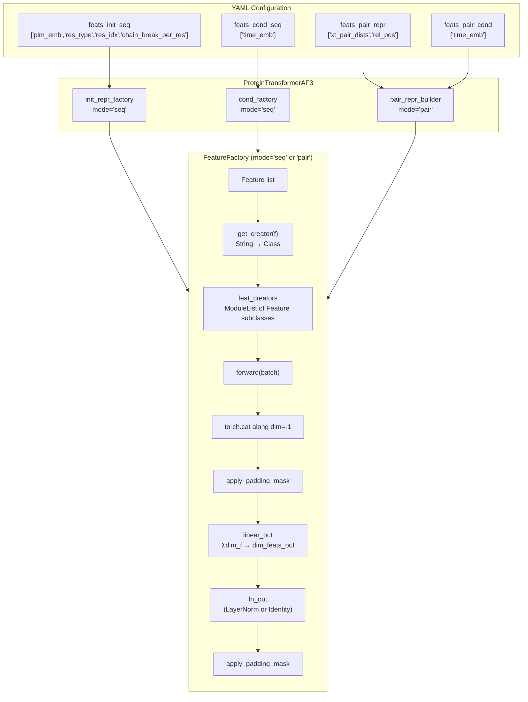
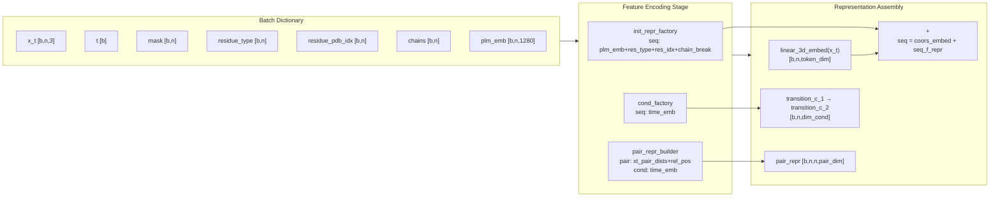

---
slug:9-feature-factory-and-input-encoding
blog_type:normal
---

IDPFold2 的 **Feature Factory** 是一个可组合的、配置驱动的编码系统，它将原始批次数据——时间步、残基标识、位置索引、链结构、成对几何关系——转换为驱动 Protein Transformer 的序列和成对表示。该工厂模式并非硬编码输入管线，而是让你通过 YAML 列表声明需要包含的特征，系统随后会组装相应的编码器模块，拼接它们的输出，并将一切投影到所需的维度。本页将解释该工厂的架构、每一个具体的特征类，以及编码信号如何流入网络的三条表示通路。

来源：[feature_factory.py](src/model/components/feature_factory.py#L1-L426)，[protein_transformer.py](src/model/protein_transformer.py#L1-L529)

## Feature Factory 架构

`FeatureFactory` 充当具有统一后处理管线的**策略调度器**。给定一组特征名称字符串列表（例如，`["plm_emb", "res_type", "res_idx"]`）和一个模式（`"seq"` 或 `"pair"`），它会实例化相应的编码器类，在批次字典上并行运行它们，沿特征维度拼接其输出，应用填充掩码，最后通过一个线性层和可选的 LayerNorm 进行投影。

每个 `FeatureFactory` 实例由四个参数配置：`feats`（特征名称字符串列表）、`dim_feats_out`（目标输出维度）、`use_ln_out`（投影后是否应用 LayerNorm）以及 `mode`（`"seq"` 表示逐残基特征，`"pair"` 表示逐残基对特征）。当 `feats` 为空或 `None` 时，工厂退化为 `ZeroFeat`，返回具有正确形状的零张量。否则，它会通过 `get_creator` 构建一个特征创建器的 `ModuleList`，计算其输出维度以确定投影层 `linear_out` 的大小，并可选择在输出外包裹 `LayerNorm`。

来源：[feature_factory.py](src/model/components/feature_factory.py#L303-L343)

## 具体特征类

每个特征都继承自抽象 `Feature` 基类，该基类存储了 `self.dim`（特征的输出维度）并定义了 `forward(batch) → Tensor` 接口。工厂的 `linear_out` 层将所有单独 `dim` 值的拼接映射到统一的 `dim_feats_out`。

来源：[feature_factory.py](src/model/components/feature_factory.py#L74-L95)

### 序列特征 (mode="seq")

序列特征生成形状为 **[b, n, d]** 的张量——每个残基一个向量。下表汇总了所有可用的序列特征及其属性：

| 特征字符串 | 类 | 输出维度 | 使用的批次键 | 描述 |
|---|---|---|---|---|
| `"time_emb"` | `TimeEmbeddingSeqFeat` | `t_emb_dim` | `t`, `x_t` | 正弦时间嵌入，广播至所有残基 |
| `"plm_emb"` | `PLMSeqFeat` | `plm_out_dim` | `plm_emb`, `x_t` | 蛋白质语言模型嵌入（如 ESM-2），通过 linear + ReLU 投影 |
| `"res_type"` | `ResidueTypeSeqFeat` | 20 | `residue_type`, `mask` | 独热氨基酸标识（20 种标准类型） |
| `"res_idx"` | `IdxEmbeddingSeqFeat` | `idx_emb_dim` | `residue_pdb_idx`, `x_t` | 基于残基索引的正弦位置嵌入 |
| `"chain_break_per_res"` | `ChainBreakPerResidueSeqFeat` | 1 | `chain_break_per_res`, `chains`, `x_t` | 链间边界的二值指示符 |

**时间嵌入** 使用扩散文献中的正弦编码（`get_time_embedding`），将连续时间 `t ∈ [0, 1]` 乘以 `max_positions=2000` 进行缩放，并在 `edim/2` 个频率上计算成对的 sin/cos 分量。生成的 [b, edim] 向量被广播到每个残基位置。这是主要的条件信号，用于告知模型当前状态在流匹配轨迹上“有多嘈杂”。

来源：[feature_factory.py](src/model/components/feature_factory.py#L116-L128)，[idx_emb_utils.py](src/utils/idx_emb_utils.py#L40-L65)

**PLM 嵌入** (`PLMSeqFeat`) 处理蛋白质语言模型嵌入——来自 ESM-2 等模型的预计算逐残基向量。原始嵌入（ESM-2-large 的维度为 `plm_in_dim=1280`）通过一个带学习的线性层和 ReLU 激活函数投影至 `plm_out_dim=256`。通过检查嵌入和是否非零生成的掩码，可确保没有 PLM 嵌入的残基接收到零特征，而非虚假的投影值。

来源：[feature_factory.py](src/model/components/feature_factory.py#L277-L295)

**残基类型** 生成标准的 20 维独热编码。一个关键细节是它与填充的交互：`residue_type` 字段对填充位置使用 `-1`，在独热编码前会先将其掩码处理为 `0`，从而确保填充残基映射为零向量，而不会引发索引错误。

来源：[feature_factory.py](src/model/components/feature_factory.py#L246-L274)

**索引嵌入** (`IdxEmbeddingSeqFeat`) 将正弦 `get_index_embedding` 函数应用于残基位置。当批次包含 `residue_pdb_idx`（实际 PDB 残基编号）时，将使用它们；否则，将生成默认的顺序索引 `[1, 2, ..., n]`。这使得模型能够区分空间上邻近但顺序上较远的残基——这对检测链断裂和多聚体界面至关重要。

来源：[feature_factory.py](src/model/components/feature_factory.py#L146-L163)，[idx_emb_utils.py](src/utils/idx_emb_utils.py#L8-L37)

**逐残基链断裂** 为每个残基生成一个标量二值特征，指示下一个残基是否属于不同的链。它可以通过检查相邻链 ID 不同的位置从 `chains` 字段计算得出，也可以直接从预计算的 `chain_break_per_res` 字段读取（由 `ChainBreakPerResidueTransform` 使用 4.0 Å CA-CA 距离截断值设置）。如果两者都不存在，则默认为零——这由 `strict_feats` 标志控制，当用户需要该特征但数据管线未提供时，该标志会引发错误。

来源：[feature_factory.py](src/model/components/feature_factory.py#L166-L184)，[transforms.py](src/data/transforms.py#L65-L99)

### 成对特征 (mode="pair")

成对特征生成形状为 **[b, n, n, d]** 的张量——每对残基一个向量。这些特征编码了所有残基对之间的几何和拓扑关系。

| 特征字符串 | 类 | 输出维度 | 使用的批次键 | 描述 |
|---|---|---|---|---|
| `"xt_pair_dists"` | `XtPairwiseDistancesPairFeat` | `xt_pair_dist_dim` | `x_t` | 噪声坐标中成对欧氏距离的分桶独热编码 |
| `"rel_pos"` | `RelativePositionPairFeat` | `2 + 2·(r_max+1)` | `chains`, `residue_pdb_idx`, `mask` | 相对序列位置 + 同链指示符 |
| `"time_emb"` | `TimeEmbeddingPairFeat` | `t_emb_dim` | `t`, `x_t` | 正弦时间嵌入，广播至所有残基对 |

**成对距离分桶** (`XtPairwiseDistancesPairFeat`) 是成对表示的几何核心。它从噪声坐标 `x_t` 计算所有成对欧氏距离，然后使用 `xt_pair_dist_min` (0.1 nm) 和 `xt_pair_dist_max` (3.0 nm) 之间均匀间隔的分桶边界，将其分入 `xt_pair_dist_dim` 个独热类别。分桶操作使用 `torch.bucketize` 进行高效分配，并使用 `F.one_hot` 进行最终表示。这将连续的距离值转换为分类表示，成对偏好注意力可以直接使用——无需学习的距离嵌入，因为独热分桶可作为隐式基函数。

来源：[feature_factory.py](src/model/components/feature_factory.py#L15-L48)，[feature_factory.py](src/model/components/feature_factory.py#L229-L243)

**相对位置** (`RelativePositionPairFeat`) 编码了残基对拓扑的两个正交方面。首先，它根据残基 i 和 j 是否共享链 ID 计算一个 2 维独热的**同链指示符**。其次，对于同链残基对，它计算一个截断至 `[-r_max, r_max]` 的**相对序列偏移量** `|i - j|`，而跨链残基对则分配一个专用的越界分桶。结果是一个维度为 `2·(r_max+1)` 的相对位置独热向量与 2 维同链指示符拼接，总计 `2 + 2·(r_max+1)`。在默认 `r_max=32` 的情况下，生成一个 68 维特征。整个输出由逐残基填充掩码的外积进行掩码处理，确保涉及填充残基的配对被置零。

来源：[feature_factory.py](src/model/components/feature_factory.py#L187-L226)

## 正弦编码工具

时间嵌入和索引嵌入都依赖于 `idx_emb_utils.py` 中实现的正弦编码。尽管它们共享相同的 sin/cos 范式，但在频率计算上有所不同：

**`get_time_embedding(t, edim)`** — 改编自 Ho 等人的扩散代码库。它将时间 `t` 乘以 `max_positions=2000` 进行缩放，然后为 `k ∈ [0, half_dim)` 计算几何间隔的频率 `exp(-k · log(20000) / (half_dim - 1))`，生成 [b, edim] 嵌入。这使得模型在 `t=0` 附近（信号最纯净处）对微小的时间差异具有细粒度的敏感度，同时仍能覆盖完整的时间范围。

**`get_index_embedding(indices, edim, max_len=2056)`** — 标准的 Transformer 位置编码。它使用应用于整数残基索引的频率 `π / max_len^(2k/edim)`，生成 [n, edim] 或 [b, n, edim] 输出。`max_len=2056` 参数设定了最大可表示的序列长度。

来源：[idx_emb_utils.py](src/utils/idx_emb_utils.py#L1-L65)

## 集成至 Protein Transformer

`ProteinTransformerAF3` 实例化了**三个** `FeatureFactory` 实例（加上内部又创建了两个的 `PairReprBuilder`），每个在网络输入管线中扮演不同的角色：

**步骤 1 — 初始序列表示** (`init_repr_factory`)：模式为 `"seq"`，配置为 `feats_init_seq = ["plm_emb", "res_type", "res_idx", "chain_break_per_res"]`。工厂拼接这四个特征（输出维度分别为 256, 20, 128, 1 = 总计 405）并投影至 `token_dim=768`。这为模型在任何注意力机制之前提供了主要的逐残基“身份”信号。

**步骤 2 — 坐标嵌入**：噪声 3D 坐标 `x_t` 通过一个简单的线性层（`linear_3d_embed`：3 → 768）嵌入，并与序列表示**相加**。这种相加而非拼接的方式意味着坐标信号和特征信号共享相同的 token 维度，使它们从第一层起便能交互。

**步骤 3 — 条件变量** (`cond_factory`)：模式为 `"seq"`，配置为 `feats_cond_seq = ["time_emb"]`。256 维的时间嵌入被投影至 `dim_cond=512`，并通过两个过渡层进行精炼。该条件向量通过自适应层归一化 调制每个注意力和过渡块。

**步骤 4 — 成对表示** (`pair_repr_builder`)：`PairReprBuilder` 包装器创建了两个工厂。表示工厂使用 `feats_pair_repr = ["xt_pair_dists", "rel_pos"]`（64 + 68 = 132 → 投影至 `pair_repr_dim=512`）。条件工厂使用 `feats_pair_cond = ["time_emb"]`（256 → 512），它通过自适应层归一化调制成对表示，随后其进入主干网络。

来源：[protein_transformer.py](src/model/protein_transformer.py#L305-L376)，[protein_transformer.py](src/model/protein_transformer.py#L477-L526)，[train.yaml](configs/train.yaml#L71-L92)

## 默认配置参考

下表将每个与特征相关的配置键映射到其默认值及使用它的组件：

| 配置键 | 默认值 | 消费者 |
|---|---|---|
| `feats_init_seq` | `["plm_emb","res_type","res_idx","chain_break_per_res"]` | `init_repr_factory` |
| `feats_cond_seq` | `["time_emb"]` | `cond_factory` |
| `feats_pair_repr` | `["xt_pair_dists","rel_pos"]` | `PairReprBuilder.init_repr_factory` |
| `feats_pair_cond` | `["time_emb"]` | `PairReprBuilder.cond_factory` |
| `t_emb_dim` | 256 | `TimeEmbeddingSeqFeat` / `TimeEmbeddingPairFeat` |
| `idx_emb_dim` | 128 | `IdxEmbeddingSeqFeat` |
| `plm_in_dim` | 1280 | `PLMSeqFeat` (ESM-2-large 输出维度) |
| `plm_out_dim` | 256 | `PLMSeqFeat` (投影维度) |
| `xt_pair_dist_dim` | 64 | `XtPairwiseDistancesPairFeat` |
| `xt_pair_dist_min` | 0.1 | `XtPairwiseDistancesPairFeat` (nm) |
| `xt_pair_dist_max` | 3.0 | `XtPairwiseDistancesPairFeat` (nm) |
| `r_max` | 32 | `RelativePositionPairFeat` |
| `strict_feats` | False | `Feature.assert_defaults_allowed` |
| `dim_cond` | 512 | `cond_factory` 输出维度 |

来源：[train.yaml](configs/train.yaml#L71-L92)，[inference.yaml](configs/inference.yaml#L61-L79)

## 严格与宽松特征处理

`strict_feats` 标志控制当批次中缺少所请求的特征时的优雅降级。当 `strict_feats=False`（默认）时，缺失的特征会回退到合理的默认值：缺失的残基索引变为顺序 `[1, 2, ..., n]`，缺失的链断裂变为零，缺失的 PLM 嵌入变为零张量。当 `strict_feats=True` 时，任何缺失的特征都会触发 `IOError`，并附带一条提示你包含相应数据变换的消息。这在训练管线开发期间对于尽早捕获配置/数据不匹配问题非常有价值。

来源：[feature_factory.py](src/model/components/feature_factory.py#L87-L94)

## 填充掩码应用

工厂应用填充掩码**两次**：一次在线性投影前（将填充位置的特征置零），一次在 LayerNorm 后（确保没有信息通过归一化统计从填充位置泄露）。对于序列特征，掩码沿残基维度应用为 `feature * mask[..., None]`。对于成对特征，掩码是外积 `mask[:, None, :] * mask[:, :, None]`，生成一个 [b, n, n] 的二值掩码，将涉及至少一个填充残基的任何配对置零。

来源：[feature_factory.py](src/model/components/feature_factory.py#L377-L426)

<CgxTip>添加新特征时，你必须：(1) 以正确的 `self.dim` 创建 `Feature` 子类，(2) 实现返回正确形状的 `forward(batch)`，以及 (3) 在 `FeatureFactory.get_creator` 的相应模式分支下注册特征字符串。投影层维度会自动从 `sum(c.get_dim())` 中计算得出——无需手动连线。</CgxTip>

<CgxTip>成对表示在启用 LayerNorm 的情况下构建（`use_ln_out=True`），而初始序列表示则禁用它（`use_ln_out=False`）。这种不对称性的存在，是因为序列表示在下游会与坐标嵌入相加，而 LayerNorm 会在相加之前破坏坐标信号的尺度。</CgxTip>

## 特征与数据变换依赖映射

每个特征类可能需要批次字典中的特定键。下表将每个特征映射到负责填充所需键的数据变换或管线步骤：

| 特征 | 所需批次键 | 来源变换 / 管线 |
|---|---|---|
| `ResidueTypeSeqFeat` | `residue_type` | `protein_to_pyg` 解析 (Graphein) |
| `IdxEmbeddingSeqFeat` | `residue_pdb_idx` | `protein_to_pyg` 解析 (Graphein) |
| `ChainBreakPerResidueSeqFeat` | `chain_break_per_res` 或 `chains` | `ChainBreakPerResidueTransform` 或 `protein_to_pyg` |
| `PLMSeqFeat` | `plm_emb` | 在 `ProteinDataset.process_single_chain` 中加载的预计算 ESM-2 嵌入 |
| `XtPairwiseDistancesPairFeat` | `x_t` | 流匹配噪声添加 (运行时) |
| `RelativePositionPairFeat` | `chains`, `residue_pdb_idx` | `protein_to_pyg` 解析 (Graphein) |
| `TimeEmbedding*Feat` | `t` | 流匹配时间采样 (运行时) |

来源：[dataset.py](src/data/dataset.py#L465-L486)，[transforms.py](src/data/transforms.py#L65-L99)

## 接下来去哪

工厂生成的特征直接输入到**自适应层归一化** 条件机制和**成对偏好注意力** 块中。要了解条件向量如何调制每个 Transformer 层，请参阅 [Adaptive Layer Norm and Pair-Biased Attention](8-adaptive-layer-norm-and-pair-biased-attention)。要了解时间嵌入在流匹配框架中的起源如何决定模型的学习内容，请参阅 [Flow Matching on R³](5-flow-matching-on-r3)。有关使用这些表示的完整网络架构，请参阅 [Protein Transformer Network](7-protein-transformer-network)。