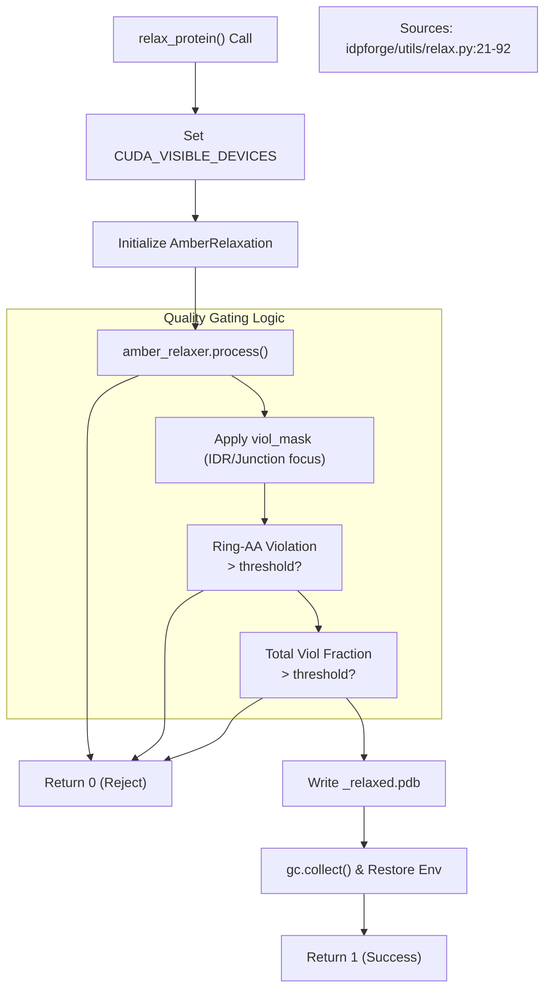
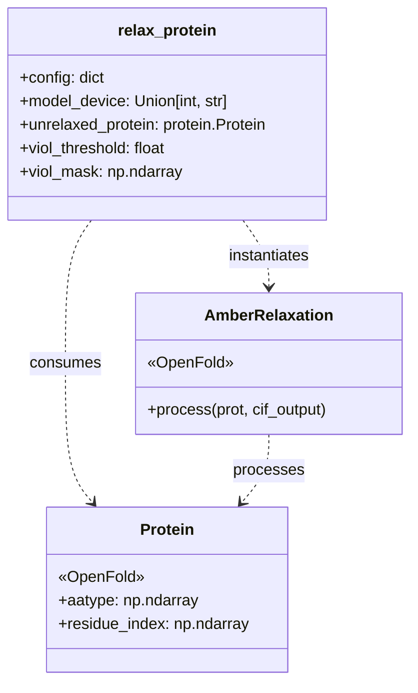

# AMBER Relaxation (relax_protein)

> **Relevant source files**
> * [idpforge/utils/relax.py](https://github.com/THGLab/IDPForge/blob/a12c2846/idpforge/utils/relax.py)

The `relax_protein` utility provides a wrapper around the OpenFold/AMBER energy minimization pipeline. It is designed to refine the raw coordinates generated by the IDPForge diffusion process, resolving steric clashes and optimizing bond geometries while enforcing strict quality gates to ensure structural integrity, particularly for residues with aromatic rings.

### Purpose and Scope

During inference, the IDPForge model predicts atomic coordinates that may contain minor physical violations or strained geometries. The `relax_protein` function in [idpforge/utils/relax.py L21-L86](https://github.com/THGLab/IDPForge/blob/a12c2846/idpforge/utils/relax.py#L21-L86)

 automates the invocation of `AmberRelaxation`, manages GPU resources to prevent memory contention, and applies a multi-stage rejection filter based on residue-level violations.

---

### System Architecture and Data Flow

The relaxation process acts as a bridge between the "Deep Learning Space" (tensors/OpenFold protein objects) and the "Physical Simulation Space" (OpenMM energy minimization).

**Natural Language to Code Entity Map: Relaxation Pipeline**

| System Concept | Code Entity | File Reference |
| --- | --- | --- |
| **Relaxation Entrypoint** | `relax_protein()` | [idpforge/utils/relax.py L21](https://github.com/THGLab/IDPForge/blob/a12c2846/idpforge/utils/relax.py#L21-L21) |
| **AMBER Engine** | `relax.AmberRelaxation` | [idpforge/utils/relax.py L23](https://github.com/THGLab/IDPForge/blob/a12c2846/idpforge/utils/relax.py#L23-L23) |
| **Violation Gate** | `viol_threshold` | [idpforge/utils/relax.py L22](https://github.com/THGLab/IDPForge/blob/a12c2846/idpforge/utils/relax.py#L22-L22) |
| **Aromatic Check** | `ring_AA` | [idpforge/utils/relax.py L18](https://github.com/THGLab/IDPForge/blob/a12c2846/idpforge/utils/relax.py#L18-L18) |
| **Device Control** | `CUDA_VISIBLE_DEVICES` | [idpforge/utils/relax.py L28-L32](https://github.com/THGLab/IDPForge/blob/a12c2846/idpforge/utils/relax.py#L28-L32) |

**Relaxation Logic Flow**

Sources: [idpforge/utils/relax.py L21-L91](https://github.com/THGLab/IDPForge/blob/a12c2846/idpforge/utils/relax.py#L21-L91)

---

### Implementation Details

#### 1. CUDA Device Management

To avoid interference between the PyTorch model inference and the OpenMM simulation (which often runs on the GPU), `relax_protein` dynamically manages the `CUDA_VISIBLE_DEVICES` environment variable [idpforge/utils/relax.py L28-L33](https://github.com/THGLab/IDPForge/blob/a12c2846/idpforge/utils/relax.py#L28-L33)

 If `model_device` is passed as an integer or a specific string, the environment is constrained to that device for the duration of the relaxation, then restored in the `finally` block [idpforge/utils/relax.py L79-L80](https://github.com/THGLab/IDPForge/blob/a12c2846/idpforge/utils/relax.py#L79-L80)

#### 2. Ring-AA Integrity Checks

Aromatic residues (Phenylalanine, Tyrosine, Tryptophan, Histidine, and Proline) are particularly susceptible to distortions during rapid minimization if the initial coordinates are poor. The system identifies these residues using `ring_AA` indices [idpforge/utils/relax.py L18](https://github.com/THGLab/IDPForge/blob/a12c2846/idpforge/utils/relax.py#L18-L18)

If the number of aromatic residues exhibiting violations exceeds the `viol_threshold` (default 2%), the structure is rejected [idpforge/utils/relax.py L59-L63](https://github.com/THGLab/IDPForge/blob/a12c2846/idpforge/utils/relax.py#L59-L63)

 This prevents "broken" rings from being accepted into the final ensemble.

#### 3. Violation Fraction Gating

The function supports a `viol_mask`, which allows the user to restrict the quality check to specific regions, such as the disordered regions (IDRs) or junctions, ignoring the pre-folded domains [idpforge/utils/relax.py L45-L52](https://github.com/THGLab/IDPForge/blob/a12c2846/idpforge/utils/relax.py#L45-L52)

The acceptance criteria are two-fold [idpforge/utils/relax.py L69-L76](https://github.com/THGLab/IDPForge/blob/a12c2846/idpforge/utils/relax.py#L69-L76)

:

1. **Fractional Gate**: The ratio of violating residues to total free residues must be below `viol_threshold`.
2. **Count Gate**: The absolute count of violations must not exceed a `viol_cap` (calculated as `max(4, threshold * n_free)`).

#### 4. Memory Cleanup

Given that `AmberRelaxation` and OpenMM can be memory-intensive, the function explicitly deletes the relaxer object and triggers Python's garbage collector (`gc.collect()`) within a `finally` block to ensure GPU memory is freed immediately after processing [idpforge/utils/relax.py L87-L91](https://github.com/THGLab/IDPForge/blob/a12c2846/idpforge/utils/relax.py#L87-L91)

---

### Function Signature and Parameters

| Parameter | Type | Description |
| --- | --- | --- |
| `config` | `dict` | Configuration parameters for OpenFold relaxation (e.g., force field settings). |
| `model_device` | `int/str` | The device identifier where the relaxation should execute. |
| `unrelaxed_protein` | `Protein` | An OpenFold `Protein` object containing coordinates and `aatype`. |
| `output_dir` | `str` | Directory to save the resulting `.pdb` file. |
| `pdb_name` | `str` | Prefix for the output filename. |
| `viol_threshold` | `float` | Tolerance for residue violations (default: 0.02). |
| `viol_mask` | `np.ndarray` | Boolean mask indicating which residues to include in the violation check. |

**Code Entity Relationship: relax_protein and OpenFold**

Sources: [idpforge/utils/relax.py L10-L11](https://github.com/THGLab/IDPForge/blob/a12c2846/idpforge/utils/relax.py#L10-L11)

 [idpforge/utils/relax.py L21-L38](https://github.com/THGLab/IDPForge/blob/a12c2846/idpforge/utils/relax.py#L21-L38)

---

### Error Handling

The implementation wraps the `amber_relaxer.process` call in a nested `try-except` block to catch `ValueError` or `OpenMMException` [idpforge/utils/relax.py L36-L42](https://github.com/THGLab/IDPForge/blob/a12c2846/idpforge/utils/relax.py#L36-L42)

 If minimization fails due to non-convergent forces or illegal geometries, the function logs the error and returns `0`, signaling a failed generation attempt to the calling sampling script.

Sources: [idpforge/utils/relax.py L1-L91](https://github.com/THGLab/IDPForge/blob/a12c2846/idpforge/utils/relax.py#L1-L91)