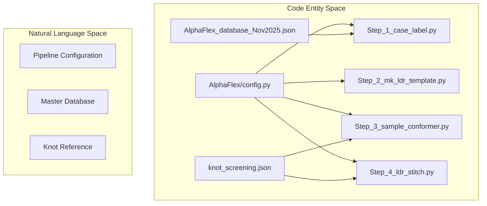
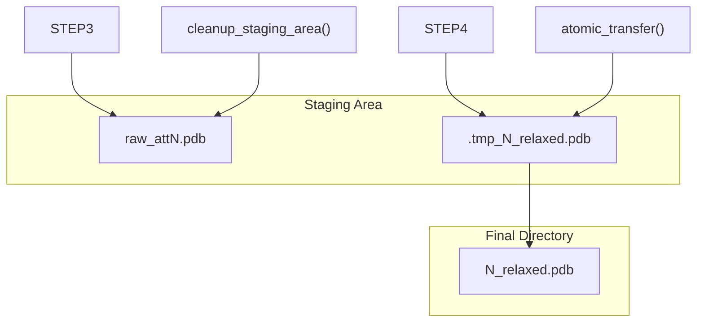

# AlphaFlex Configuration & Data Inputs

> **Relevant source files**
> * [AlphaFlex/Data_Inputs/AlphaFlex_database_Nov2025.json](https://github.com/THGLab/IDPForge/blob/a12c2846/AlphaFlex/Data_Inputs/AlphaFlex_database_Nov2025.json)
> * [AlphaFlex/Data_Inputs/knot_screening.json](https://github.com/THGLab/IDPForge/blob/a12c2846/AlphaFlex/Data_Inputs/knot_screening.json)
> * [AlphaFlex/README.md](https://github.com/THGLab/IDPForge/blob/a12c2846/AlphaFlex/README.md?plain=1)
> * [AlphaFlex/config.py](https://github.com/THGLab/IDPForge/blob/a12c2846/AlphaFlex/config.py)
> * [AlphaFlex/utils/file_ops.py](https://github.com/THGLab/IDPForge/blob/a12c2846/AlphaFlex/utils/file_ops.py)
> * [AlphaFlex/utils/smart_scoring.py](https://github.com/THGLab/IDPForge/blob/a12c2846/AlphaFlex/utils/smart_scoring.py)

This page documents the centralized configuration system, input databases, and reference schemas utilized by the AlphaFlex pipeline. These resources facilitate large-scale IDR ensemble generation by providing structural metadata, topological screening, and pipeline control constants.

## Pipeline Configuration (AlphaFlex/config.py)

The `config.py` file serves as the central source of truth for all pipeline constants, file paths, and hyperparameters across Steps 1 through 4 of the AlphaFlex workflow [AlphaFlex/config.py L1-L122](https://github.com/THGLab/IDPForge/blob/a12c2846/AlphaFlex/config.py#L1-L122)

### Global Paths and Execution

The configuration defines the environment and base directories for the pipeline.

* `PYTHON_EXEC`: The current Python interpreter used for subprocess calls [AlphaFlex/config.py L14](https://github.com/THGLab/IDPForge/blob/a12c2846/AlphaFlex/config.py#L14-L14)
* `PROJECT_ROOT` and `PARENT_DIR`: Used to resolve paths relative to the `AlphaFlex` directory and the base `IDPForge` installation [AlphaFlex/config.py L15-L16](https://github.com/THGLab/IDPForge/blob/a12c2846/AlphaFlex/config.py#L15-L16)
* `INPUT_DATA_DIR`: Points to `AlphaFlex/Data_Inputs`, containing the master JSON databases [AlphaFlex/config.py L18](https://github.com/THGLab/IDPForge/blob/a12c2846/AlphaFlex/config.py#L18-L18)

### Key Pipeline Hyperparameters

The pipeline behavior is controlled by several threshold and attempt constants:

| Parameter | Default Value | Purpose |
| --- | --- | --- |
| `TEMPLATE_N_CONFS` | 200 | Number of template conformations in Step 2 [AlphaFlex/config.py L66](https://github.com/THGLab/IDPForge/blob/a12c2846/AlphaFlex/config.py#L66-L66) |
| `SAMPLE_N_CONFS` | 10 | Target conformers per IDR in Step 3 [AlphaFlex/config.py L81](https://github.com/THGLab/IDPForge/blob/a12c2846/AlphaFlex/config.py#L81-L81) |
| `SAMPLE_BATCH_SIZE` | 6 | Diffusion batch size for inference [AlphaFlex/config.py L82](https://github.com/THGLab/IDPForge/blob/a12c2846/AlphaFlex/config.py#L82-L82) |
| `STITCH_N_CONFORMERS` | 10 | Final ensemble size in Step 4 [AlphaFlex/config.py L104](https://github.com/THGLab/IDPForge/blob/a12c2846/AlphaFlex/config.py#L104-L104) |
| `RELAX_STIFFNESS` | 10.0 | Harmonic restraint strength for AMBER [AlphaFlex/config.py L110](https://github.com/THGLab/IDPForge/blob/a12c2846/AlphaFlex/config.py#L110-L110) |
| `SAMPLE_JUNCTION_KAPPA` | 0.12 | Curvature gate for IDR-Folded junctions [AlphaFlex/config.py L89](https://github.com/THGLab/IDPForge/blob/a12c2846/AlphaFlex/config.py#L89-L89) |

### Adaptive Clash Scoring

AlphaFlex utilizes an adaptive thresholding mechanism for stitching, defined by `STITCH_BASE_CLASH_THRESHOLD` (10.0) and `STITCH_CLASH_INCREMENT` (5.0) [AlphaFlex/config.py L121-L122](https://github.com/THGLab/IDPForge/blob/a12c2846/AlphaFlex/config.py#L121-L122)

 These are used by `get_smart_threshold` to relax constraints if valid conformers are not found within initial attempts [AlphaFlex/utils/smart_scoring.py L4-L6](https://github.com/THGLab/IDPForge/blob/a12c2846/AlphaFlex/utils/smart_scoring.py#L4-L6)

**Sources:** [AlphaFlex/config.py L1-L122](https://github.com/THGLab/IDPForge/blob/a12c2846/AlphaFlex/config.py#L1-L122)

 [AlphaFlex/utils/smart_scoring.py L1-L6](https://github.com/THGLab/IDPForge/blob/a12c2846/AlphaFlex/utils/smart_scoring.py#L1-L6)

---

## Master Database (AlphaFlex_database_Nov2025.json)

This database contains the structural metadata for the AlphaFold2 9606 Human v4 proteome, enabling the classification of IDRs based on their predicted context [AlphaFlex/README.md L9-L10](https://github.com/THGLab/IDPForge/blob/a12c2846/AlphaFlex/README.md?plain=1#L9-L10)

### Schema Structure

Each entry is keyed by UniProt ID and contains:

* `idrs`: A list of `[start, end]` residue ranges (1-indexed) identifying disordered regions [AlphaFlex/Data_Inputs/AlphaFlex_database_Nov2025.json L3-L8](https://github.com/THGLab/IDPForge/blob/a12c2846/AlphaFlex/Data_Inputs/AlphaFlex_database_Nov2025.json#L3-L8)
* `mean_pae`: A dictionary mapping domain pairs (e.g., `D1-F1`, `F1-F2`) to their mean Predicted Aligned Error in Angstroms [AlphaFlex/Data_Inputs/AlphaFlex_database_Nov2025.json L23-L27](https://github.com/THGLab/IDPForge/blob/a12c2846/AlphaFlex/Data_Inputs/AlphaFlex_database_Nov2025.json#L23-L27)
* `interactions`: A list of folded domain pairs (e.g., `["F1", "F2"]`) where the mean PAE is $< 15$ Å, indicating a stable interface [AlphaFlex/Data_Inputs/AlphaFlex_database_Nov2025.json L49-L54](https://github.com/THGLab/IDPForge/blob/a12c2846/AlphaFlex/Data_Inputs/AlphaFlex_database_Nov2025.json#L49-L54)

**Sources:** [AlphaFlex/Data_Inputs/AlphaFlex_database_Nov2025.json L1-L331](https://github.com/THGLab/IDPForge/blob/a12c2846/AlphaFlex/Data_Inputs/AlphaFlex_database_Nov2025.json#L1-L331)

 [AlphaFlex/README.md L9-L10](https://github.com/THGLab/IDPForge/blob/a12c2846/AlphaFlex/README.md?plain=1#L9-L10)

---

## Knot Screening Reference (knot_screening.json)

This reference file contains pre-calculated topological data for all proteins containing folded domains. It is used during structure validation to ensure that generated ensembles maintain the "native" topology predicted by AlphaFold2 [AlphaFlex/README.md L14-L15](https://github.com/THGLab/IDPForge/blob/a12c2846/AlphaFlex/README.md?plain=1#L14-L15)

### Data Fields

* `label`: High-level topological classification (e.g., "None" for unknotted) [AlphaFlex/Data_Inputs/knot_screening.json L2-L3](https://github.com/THGLab/IDPForge/blob/a12c2846/AlphaFlex/Data_Inputs/knot_screening.json#L2-L3)
* `reason`: Descriptive string explaining the classification (e.g., "F1=Unknot", "NoFoldedDomain") [AlphaFlex/Data_Inputs/knot_screening.json L4](https://github.com/THGLab/IDPForge/blob/a12c2846/AlphaFlex/Data_Inputs/knot_screening.json#L4-L4)
* `domains`: An array of domain-specific topological reports, including the residue `range`, the specific `knot` type, and a confidence score in the `reason` field [AlphaFlex/Data_Inputs/knot_screening.json L10-L20](https://github.com/THGLab/IDPForge/blob/a12c2846/AlphaFlex/Data_Inputs/knot_screening.json#L10-L20)

**Sources:** [AlphaFlex/Data_Inputs/knot_screening.json L1-L359](https://github.com/THGLab/IDPForge/blob/a12c2846/AlphaFlex/Data_Inputs/knot_screening.json#L1-L359)

 [AlphaFlex/README.md L14-L15](https://github.com/THGLab/IDPForge/blob/a12c2846/AlphaFlex/README.md?plain=1#L14-L15)

---

## Data Flow: Configuration to Execution

The following diagram illustrates how the configuration constants and JSON databases are consumed by the AlphaFlex pipeline scripts.

### Configuration to Code Mapping

**Sources:** [AlphaFlex/config.py L19-L22](https://github.com/THGLab/IDPForge/blob/a12c2846/AlphaFlex/config.py#L19-L22)

 [AlphaFlex/README.md L1-L20](https://github.com/THGLab/IDPForge/blob/a12c2846/AlphaFlex/README.md?plain=1#L1-L20)

---

## Reference Data: Residue Counts

The file `AF2_9606_HUMAN_v4_num_residues.json` (referenced via `LENGTH_REF_PATH`) provides a lookup table for total protein lengths [AlphaFlex/config.py L20](https://github.com/THGLab/IDPForge/blob/a12c2846/AlphaFlex/config.py#L20-L20)

 This is primarily used in Step 1B for length-based subset filtering [AlphaFlex/README.md L11](https://github.com/THGLab/IDPForge/blob/a12c2846/AlphaFlex/README.md?plain=1#L11-L11)

### Subset Filtering Logic

The constants `SUBSET_MIN_LENGTH` and `SUBSET_MAX_LENGTH` define the global filter applied to the UniProt IDs found in the residue count database [AlphaFlex/config.py L40-L41](https://github.com/THGLab/IDPForge/blob/a12c2846/AlphaFlex/config.py#L40-L41)

**Sources:** [AlphaFlex/config.py L34-L50](https://github.com/THGLab/IDPForge/blob/a12c2846/AlphaFlex/config.py#L34-L50)

 [AlphaFlex/README.md L64-L80](https://github.com/THGLab/IDPForge/blob/a12c2846/AlphaFlex/README.md?plain=1#L64-L80)

---

## File Operations and Staging (AlphaFlex/utils/file_ops.py)

AlphaFlex employs specialized file utilities to manage the high volume of PDB files generated during sampling and stitching.

### Key Utilities

* `atomic_transfer`: Uses `shutil.copy2` and `os.replace` to ensure files are moved to final directories only when fully written, preventing partial reads by downstream steps [AlphaFlex/utils/file_ops.py L8-L18](https://github.com/THGLab/IDPForge/blob/a12c2846/AlphaFlex/utils/file_ops.py#L8-L18)
* `rename_and_clean_final_directory`: Sanitizes output directories by removing temporary files (starting with `.tmp_` or ending in `.tmp`/`.bak`) and renumbering valid `*_relaxed.pdb` files into a continuous sequence [AlphaFlex/utils/file_ops.py L24-L87](https://github.com/THGLab/IDPForge/blob/a12c2846/AlphaFlex/utils/file_ops.py#L24-L87)
* `cleanup_staging_area`: Removes intermediate `raw_att*.pdb` files from the conformer generation stage [AlphaFlex/utils/file_ops.py L92-L122](https://github.com/THGLab/IDPForge/blob/a12c2846/AlphaFlex/utils/file_ops.py#L92-L122)

### Staging Workflow

**Sources:** [AlphaFlex/utils/file_ops.py L1-L130](https://github.com/THGLab/IDPForge/blob/a12c2846/AlphaFlex/utils/file_ops.py#L1-L130)