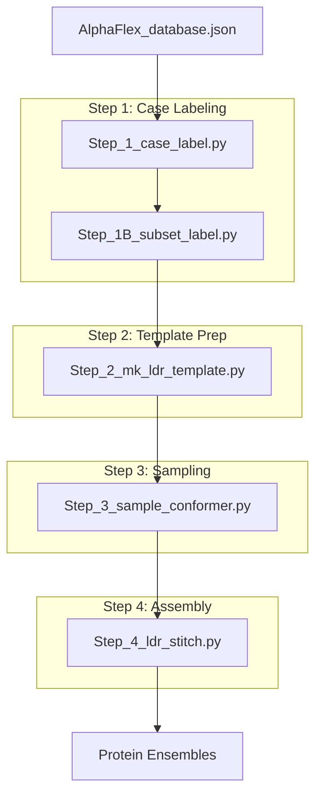

# AlphaFlex Pipeline

> **Relevant source files**
> * [AlphaFlex/Data_Inputs/knot_screening.json](https://github.com/THGLab/IDPForge/blob/a12c2846/AlphaFlex/Data_Inputs/knot_screening.json)
> * [AlphaFlex/README.md](https://github.com/THGLab/IDPForge/blob/a12c2846/AlphaFlex/README.md?plain=1)
> * [AlphaFlex/config.py](https://github.com/THGLab/IDPForge/blob/a12c2846/AlphaFlex/config.py)

The **AlphaFlex** pipeline is a four-step automated workflow designed for the large-scale generation of disordered protein ensembles. It leverages AlphaFold2 (AF2) structures as templates and uses the IDPForge diffusion model to sample conformational ensembles of Intrinsically Disordered Regions (IDRs) while maintaining the structural integrity of folded domains.

The pipeline is designed to handle proteins ranging from fully disordered (Category 0) to complex multi-domain proteins with disordered tails, linkers, and loops (Categories 1-3) [AlphaFlex/README.md L51-L58](https://github.com/THGLab/IDPForge/blob/a12c2846/AlphaFlex/README.md?plain=1#L51-L58)

### Pipeline Architecture

The workflow progresses from database labeling to final ensemble assembly. Each step is orchestrated by a dedicated script that consumes the outputs of the previous stage.

**Sources:** [AlphaFlex/README.md L3-L16](https://github.com/THGLab/IDPForge/blob/a12c2846/AlphaFlex/README.md?plain=1#L3-L16)

 [AlphaFlex/config.py L27-L101](https://github.com/THGLab/IDPForge/blob/a12c2846/AlphaFlex/config.py#L27-L101)

---

### Step 1: Case Labeling & Subset Filtering

This stage classifies proteins based on their IDR topology using the `AlphaFlex_database_Nov2025.json` [AlphaFlex/README.md L9-L10](https://github.com/THGLab/IDPForge/blob/a12c2846/AlphaFlex/README.md?plain=1#L9-L10)

* **Case Labeling**: `Step_1_case_label.py` augments the database with IDR types: **Tails** (N- or C-terminal), **Linkers** (between domains), and **Loops** (internal to a domain) [AlphaFlex/README.md L51-L58](https://github.com/THGLab/IDPForge/blob/a12c2846/AlphaFlex/README.md?plain=1#L51-L58)
* **Subset Filtering**: `Step_1B_subset_label.py` generates specific lists of UniProt IDs for processing, allowing users to filter by total protein length, IDR count, or specific IDR lengths [AlphaFlex/config.py L34-L51](https://github.com/THGLab/IDPForge/blob/a12c2846/AlphaFlex/config.py#L34-L51)

For details on classification logic and schema, see [Step 1: Case Labeling & Subset Filtering](/THGLab/IDPForge/5.1-step-1:-case-labeling-and-subset-filtering).

**Sources:** [AlphaFlex/config.py L27-L51](https://github.com/THGLab/IDPForge/blob/a12c2846/AlphaFlex/config.py#L27-L51)

 [AlphaFlex/README.md L49-L80](https://github.com/THGLab/IDPForge/blob/a12c2846/AlphaFlex/README.md?plain=1#L49-L80)

---

### Step 2: Template Generation

`Step_2_mk_ldr_template.py` prepares the structural starting points for the diffusion model. It handles two primary template types:

1. **Static Templates**: Created by `mk_ldr_template.py` for Tails and Loops, where the folded environment is held rigid [AlphaFlex/README.md L86-L87](https://github.com/THGLab/IDPForge/blob/a12c2846/AlphaFlex/README.md?plain=1#L86-L87)
2. **Flexible Templates**: Created by `mk_flex_template.py` for Linkers, where adjacent folded domains are randomly translated and rotated to sample the inter-domain space [AlphaFlex/README.md L88-L89](https://github.com/THGLab/IDPForge/blob/a12c2846/AlphaFlex/README.md?plain=1#L88-L89)

For details on template `.npz` formats and size-capping logic, see [Step 2: Template Generation](/THGLab/IDPForge/5.2-step-2:-template-generation).

**Sources:** [AlphaFlex/config.py L53-L74](https://github.com/THGLab/IDPForge/blob/a12c2846/AlphaFlex/config.py#L53-L74)

 [AlphaFlex/README.md L82-L94](https://github.com/THGLab/IDPForge/blob/a12c2846/AlphaFlex/README.md?plain=1#L82-L94)

---

### Step 3: Conformer Sampling

`Step_3_sample_conformer.py` manages the high-throughput execution of the IDPForge model (`sample_ldr.py` or `sample_idp.py`).

* **Parallelization**: Supports `split_index` for distributing workloads across HPC nodes [AlphaFlex/config.py L76-L96](https://github.com/THGLab/IDPForge/blob/a12c2846/AlphaFlex/config.py#L76-L96)
* **Quality Gates**: Implements curvature gates (`SAMPLE_JUNCTION_KAPPA`) and knot screening using `knot_screening.json` to ensure generated disordered regions do not create unphysical topologies with the folded domains [AlphaFlex/config.py L87-L89](https://github.com/THGLab/IDPForge/blob/a12c2846/AlphaFlex/config.py#L87-L89)  [AlphaFlex/Data_Inputs/knot_screening.json L1-L21](https://github.com/THGLab/IDPForge/blob/a12c2846/AlphaFlex/Data_Inputs/knot_screening.json#L1-L21)

For details on the sampling loop and state persistence, see [Step 3: Conformer Sampling](/THGLab/IDPForge/5.3-step-3:-conformer-sampling).

**Sources:** [AlphaFlex/config.py L76-L96](https://github.com/THGLab/IDPForge/blob/a12c2846/AlphaFlex/config.py#L76-L96)

 [AlphaFlex/README.md L96-L115](https://github.com/THGLab/IDPForge/blob/a12c2846/AlphaFlex/README.md?plain=1#L96-L115)

---

### Step 4: Kinematic Stitching & Ensemble Assembly

The final stage, `Step_4_ldr_stitch.py`, assembles individual IDR conformers back into the full-length protein.

* **Kinematic Assembly**: Uses Monte Carlo stitching to join disordered segments to folded domains while minimizing clashes [AlphaFlex/config.py L120-L122](https://github.com/THGLab/IDPForge/blob/a12c2846/AlphaFlex/config.py#L120-L122)
* **Relaxation**: Performs AMBER energy minimization with harmonic restraints (`RELAX_STIFFNESS`) on the folded domains to ensure chemical validity at the junctions [AlphaFlex/config.py L109-L114](https://github.com/THGLab/IDPForge/blob/a12c2846/AlphaFlex/config.py#L109-L114)

For details on the stitching algorithm and structural validation, see [Step 4: Kinematic Stitching & Ensemble Assembly](/THGLab/IDPForge/5.4-step-4:-kinematic-stitching-and-ensemble-assembly).

**Sources:** [AlphaFlex/config.py L99-L122](https://github.com/THGLab/IDPForge/blob/a12c2846/AlphaFlex/config.py#L99-L122)

 [AlphaFlex/README.md L117-L133](https://github.com/THGLab/IDPForge/blob/a12c2846/AlphaFlex/README.md?plain=1#L117-L133)

---

### Configuration and Inputs

The pipeline is controlled by a centralized configuration file and several reference datasets.

| Entity | Code Reference | Role |
| --- | --- | --- |
| **Pipeline Config** | `AlphaFlex/config.py` | Global paths, batch sizes, and physics thresholds. |
| **Knot Screening** | `knot_screening.json` | Pre-calculated native topology for AF2 templates. |
| **Master Database** | `AlphaFlex_database_Nov2025.json` | UniProt IDR boundaries and PAE-based interactions. |
| **Weights** | `weights/mdl.ckpt` | The trained IDPForge diffusion model weights. |

For details on schema and configuration parameters, see [AlphaFlex Configuration & Data Inputs](/THGLab/IDPForge/5.5-alphaflex-configuration-and-data-inputs).

**Sources:** [AlphaFlex/config.py L1-L25](https://github.com/THGLab/IDPForge/blob/a12c2846/AlphaFlex/config.py#L1-L25)

 [AlphaFlex/Data_Inputs/knot_screening.json L1-L21](https://github.com/THGLab/IDPForge/blob/a12c2846/AlphaFlex/Data_Inputs/knot_screening.json#L1-L21)

 [AlphaFlex/README.md L7-L16](https://github.com/THGLab/IDPForge/blob/a12c2846/AlphaFlex/README.md?plain=1#L7-L16)