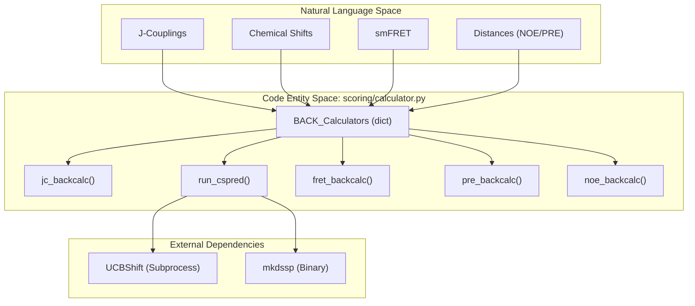
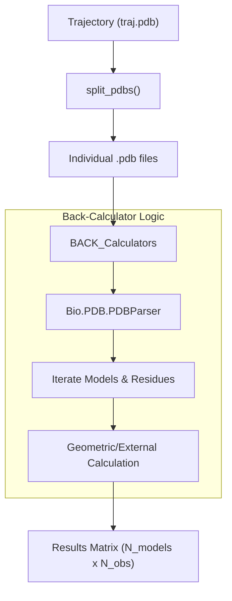

# Back-Calculation of Experimental Observables

> **Relevant source files**
> * [scoring/calculator.py](https://github.com/THGLab/IDPForge/blob/a12c2846/scoring/calculator.py)
> * [scoring/parser.py](https://github.com/THGLab/IDPForge/blob/a12c2846/scoring/parser.py)

This page documents the technical implementation of back-calculators used to bridge the gap between 3D protein conformers and experimental measurements. These utilities, primarily located in `scoring/calculator.py`, allow IDPForge to validate generated ensembles against various biophysical data types, including J-couplings, NOE, PRE, smFRET, chemical shifts, and Radius of Gyration (Rg).

### Overview and Data Flow

The back-calculation process transforms atomic coordinates from PDB files into predicted observables. This is a critical component of the **X-EISD** (Experimental Enhanced Integrative Structural Dissemination) scoring framework.

The system uses a dispatch table `BACK_Calculators` to map experimental data types to their respective calculation functions [scoring/calculator.py L207-L214](https://github.com/THGLab/IDPForge/blob/a12c2846/scoring/calculator.py#L207-L214)

**Sources:**

* [scoring/calculator.py L1-L13](https://github.com/THGLab/IDPForge/blob/a12c2846/scoring/calculator.py#L1-L13)
* [scoring/calculator.py L207-L214](https://github.com/THGLab/IDPForge/blob/a12c2846/scoring/calculator.py#L207-L214)

---

### Implementation of Back-Calculators

#### 1. Scalar Couplings (J-couplings)

The `jc_backcalc` function predicts 3-bond $^3J_{HNH\alpha}$ couplings based on the protein backbone dihedral angle $\phi$. It utilizes a Karplus-like relationship where the predicted value is proportional to the cosine of the angle [scoring/calculator.py L108-L123](https://github.com/THGLab/IDPForge/blob/a12c2846/scoring/calculator.py#L108-L123)

* **Logic**: Calculates $\phi$ for each residue and applies a phase-shifted cosine transformation: $\cos(\phi - 60^\circ)$ [scoring/calculator.py L122](https://github.com/THGLab/IDPForge/blob/a12c2846/scoring/calculator.py#L122-L122)
* **Parameters**: Uses Karplus coefficients (A, B, C) defined in the `Stack` initialization for J-couplings [scoring/parser.py L76-L79](https://github.com/THGLab/IDPForge/blob/a12c2846/scoring/parser.py#L76-L79)

#### 2. Distance-Based Observables (NOE, PRE, smFRET)

These calculators rely on inter-atomic distances, often requiring specific handling for hydrogen atoms or paramagnetic labels.

| Observable | Function | Implementation Detail |
| --- | --- | --- |
| **smFRET** | `fret_backcalc` | Calculates efficiency $E = 1 / (1 + (d/R_0)^6)$ between CA atoms of specified residues [scoring/calculator.py L126-L140](https://github.com/THGLab/IDPForge/blob/a12c2846/scoring/calculator.py#L126-L140) |
| **PRE** | `pre_backcalc` | Calculates $1/r^6$ distances between a spin-label residue and target protons. Supports virtual atom substitution [scoring/calculator.py L165-L182](https://github.com/THGLab/IDPForge/blob/a12c2846/scoring/calculator.py#L165-L182) |
| **NOE** | `noe_backcalc` | Similar to PRE, but typically involves proton-proton distances within a specific cutoff [scoring/calculator.py L148-L162](https://github.com/THGLab/IDPForge/blob/a12c2846/scoring/calculator.py#L148-L162) |

#### 3. Chemical Shifts (CSpred/UCBShift)

Chemical shifts are calculated via `run_cspred`, which acts as a wrapper for the external **UCBShift** (CSpred) tool.

* **Process**: It generates a temporary PDB, executes a subprocess running `CSpred.py`, and parses the resulting text output [scoring/calculator.py L143-L145](https://github.com/THGLab/IDPForge/blob/a12c2846/scoring/calculator.py#L143-L145)
* **Environment**: Requires `CSPRED_PATH` and `CSPRED_PYTHON` environment variables to be set [scoring/calculator.py L14-L17](https://github.com/THGLab/IDPForge/blob/a12c2846/scoring/calculator.py#L14-L17)

#### 4. Radius of Gyration (Rg)

The `calc_rg` function computes the mass-weighted radius of gyration.

* **Mass Mapping**: Uses a standard `atomic_mass` dictionary (C:12, O:16, N:14, S:32, H:1) [scoring/calculator.py L94](https://github.com/THGLab/IDPForge/blob/a12c2846/scoring/calculator.py#L94-L94)
* **Formula**: $R_g = \sqrt{\frac{\sum m_i (r_i - r_{cm})^2}{\sum m_i}}$ where $r_{cm}$ is the center of mass.

**Sources:**

* [scoring/calculator.py L94-L95](https://github.com/THGLab/IDPForge/blob/a12c2846/scoring/calculator.py#L94-L95)
* [scoring/calculator.py L108-L140](https://github.com/THGLab/IDPForge/blob/a12c2846/scoring/calculator.py#L108-L140)
* [scoring/calculator.py L165-L182](https://github.com/THGLab/IDPForge/blob/a12c2846/scoring/calculator.py#L165-L182)
* [scoring/parser.py L76-L80](https://github.com/THGLab/IDPForge/blob/a12c2846/scoring/parser.py#L76-L80)

---

### Hydrogen Atom Substitution Logic

Since many experimental observables (NOE, PRE, Chemical Shifts) involve hydrogen atoms that may not be present in standard PDB outputs, the system implements a mapping logic to identify the correct heavy-atom "parent" or to handle methyl/methylene group equivalence.

#### Mapping Dictionaries

* **`hydrogen_abbrev`**: Maps shorthand hydrogen names (e.g., "HB" for Alanine) to specific PDB atom names (e.g., "HB1", "HB2", "HB3") [scoring/calculator.py L44-L71](https://github.com/THGLab/IDPForge/blob/a12c2846/scoring/calculator.py#L44-L71)
* **`heavy_atom_hydrogen`**: Maps hydrogen names back to their bonded heavy atoms (e.g., Alanine "HA" is bonded to "CA") [scoring/calculator.py L72-L93](https://github.com/THGLab/IDPForge/blob/a12c2846/scoring/calculator.py#L72-L93)

#### Virtual Atom Logic

In functions like `pre_backcalc`, if a hydrogen atom is missing, the calculator can fallback to the coordinates of the parent heavy atom defined in `heavy_atom_hydrogen` to estimate the distance [scoring/calculator.py L178-L180](https://github.com/THGLab/IDPForge/blob/a12c2846/scoring/calculator.py#L178-L180)

**Sources:**

* [scoring/calculator.py L44-L93](https://github.com/THGLab/IDPForge/blob/a12c2846/scoring/calculator.py#L44-L93)
* [scoring/calculator.py L175-L181](https://github.com/THGLab/IDPForge/blob/a12c2846/scoring/calculator.py#L175-L181)

---

### System Entity Map: Back-Calculation Dispatch

The following diagram illustrates how the high-level observable types requested by the user are dispatched to specific code entities and internal data structures.

**Calculator Dispatch Architecture**

**Sources:**

* [scoring/calculator.py L14-L20](https://github.com/THGLab/IDPForge/blob/a12c2846/scoring/calculator.py#L14-L20)
* [scoring/calculator.py L207-L214](https://github.com/THGLab/IDPForge/blob/a12c2846/scoring/calculator.py#L207-L214)

---

### Data Registry and Uncertainties

Experimental data is managed via the `EXP_DATA_LIB`, which lazily scans the directory specified by `IDPFORGE_EXP_DATA` [scoring/parser.py L24-L72](https://github.com/THGLab/IDPForge/blob/a12c2846/scoring/parser.py#L24-L72)

#### Back-Calculation Errors (BC_ERRORS)

The system maintains a registry of inherent uncertainties for each back-calculation method, which are used during X-EISD scoring to weight the likelihood of the ensemble [scoring/parser.py L19-L22](https://github.com/THGLab/IDPForge/blob/a12c2846/scoring/parser.py#L19-L22)

| Data Type | Uncertainty ($\sigma$) | Source/Note |
| --- | --- | --- |
| `pre` | 0.001 | Fixed |
| `noe` | 0.01 | Fixed |
| `fret` | 0.0074 | Fixed |
| `cs (CA)` | 0.97 | UCBShift Error |
| `cs (H)` | 0.38 | UCBShift Error |
| `jc` | Variable | A: 0.14, B: 0.03, C: 0.08 (sqrt) |

**Sources:**

* [scoring/parser.py L19-L22](https://github.com/THGLab/IDPForge/blob/a12c2846/scoring/parser.py#L19-L22)
* [scoring/parser.py L75-L80](https://github.com/THGLab/IDPForge/blob/a12c2846/scoring/parser.py#L75-L80)

---

### Ensemble Processing Workflow

The back-calculation typically follows a multi-step workflow when processing large ensembles:

**Ensemble Processing Flow**

**Sources:**

* [scoring/calculator.py L97-L106](https://github.com/THGLab/IDPForge/blob/a12c2846/scoring/calculator.py#L97-L106)
* [scoring/calculator.py L115-L123](https://github.com/THGLab/IDPForge/blob/a12c2846/scoring/calculator.py#L115-L123)
* [scoring/calculator.py L135-L140](https://github.com/THGLab/IDPForge/blob/a12c2846/scoring/calculator.py#L135-L140)