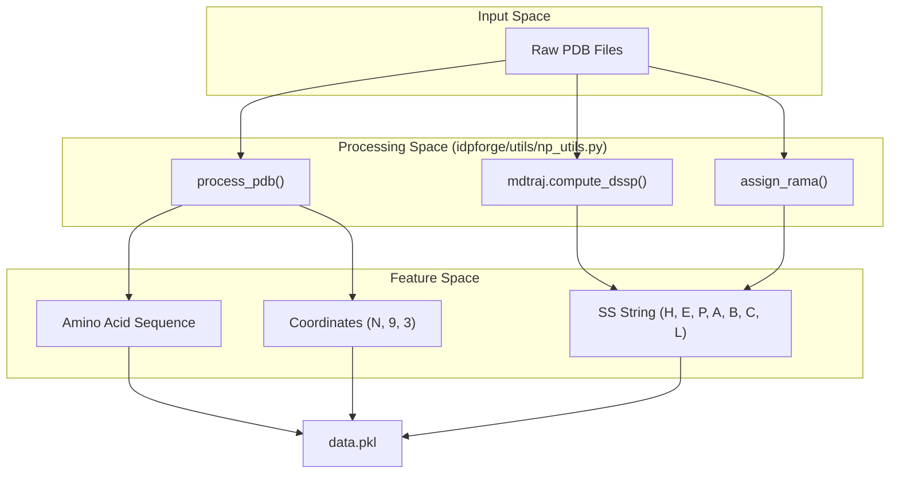
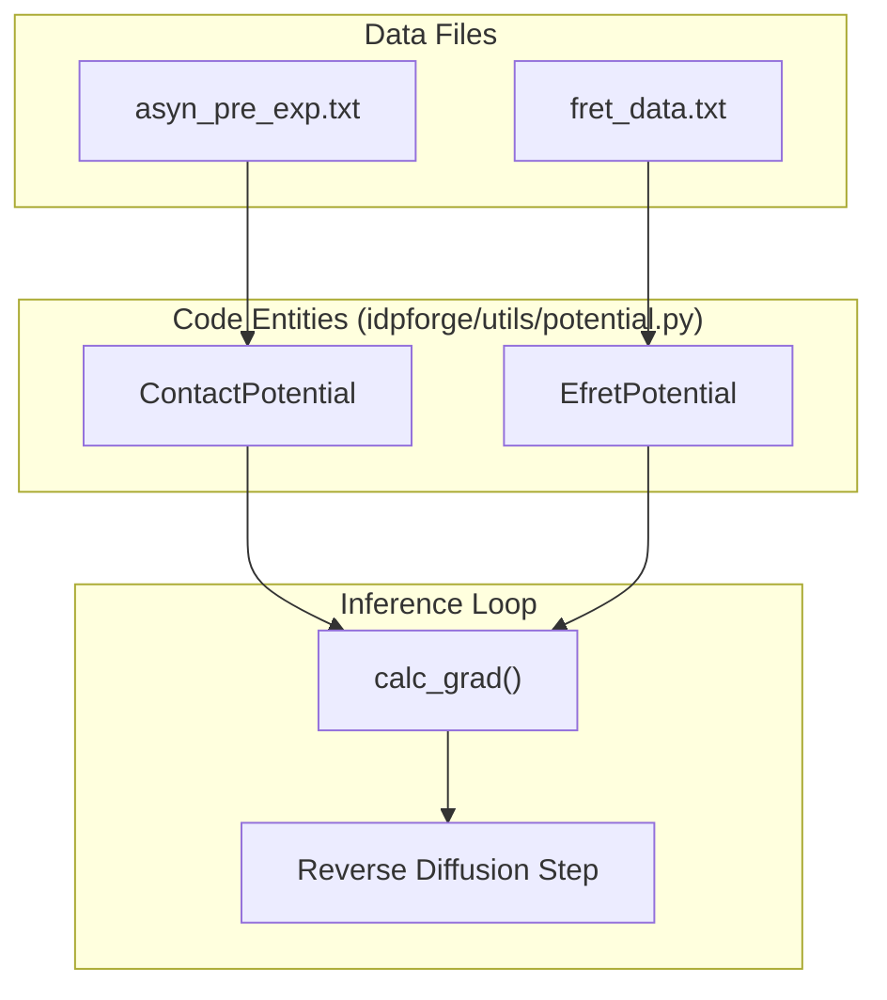

# Data Files & Example Data

> **Relevant source files**
> * [data/AF-P05231-F1-model_v4.pdb](https://github.com/THGLab/IDPForge/blob/a12c2846/data/AF-P05231-F1-model_v4.pdb)
> * [data/AF-P05231_ndr.npz](https://github.com/THGLab/IDPForge/blob/a12c2846/data/AF-P05231_ndr.npz)
> * [data/README.md](https://github.com/THGLab/IDPForge/blob/a12c2846/data/README.md?plain=1)
> * [data/asyn_pre_exp.txt](https://github.com/THGLab/IDPForge/blob/a12c2846/data/asyn_pre_exp.txt)
> * [idpforge/utils/definitions.py](https://github.com/THGLab/IDPForge/blob/a12c2846/idpforge/utils/definitions.py)
> * [idpforge/utils/structure_repair.py](https://github.com/THGLab/IDPForge/blob/a12c2846/idpforge/utils/structure_repair.py)
> * [relax_raw.py](https://github.com/THGLab/IDPForge/blob/a12c2846/relax_raw.py)

This page documents the contents of the `data/` directory, including training data structures, secondary structure encodings, diffusion caches, and experimental data formats used for guided sampling. It also details the procedure for preparing custom training datasets from PDB files.

### Data Directory Overview

The `data/` directory contains essential inputs for both training and inference. While large datasets (e.g., DisProt conformers) are hosted externally, the repository includes example files and utilities to process them.

| File | Purpose |
| --- | --- |
| `example_data.pkl` | Example training data containing sequences, SS encodings, and coordinates. |
| `example_sec.txt` | Compiled secondary structure strings for inference. |
| `diff_igso3.pkl` | Cached IGSO3 discretization for rotational diffusion. |
| `*_pre_exp.txt` | Paramagnetic Relaxation Enhancement (PRE) experimental data. |
| `AF-P05231_ndr.npz` | AlphaFold template for IDR-in-folded-context sampling. |

Sources: [data/README.md L3-L9](https://github.com/THGLab/IDPForge/blob/a12c2846/data/README.md?plain=1#L3-L9)

 [data/README.md L41-L45](https://github.com/THGLab/IDPForge/blob/a12c2846/data/README.md?plain=1#L41-L45)

---

### Training Data Format

Training data is stored in Python pickle (`.pkl`) files. The `DiffDataset` class in the training pipeline expects a nested list structure: `[List[SS_Strings], List[Sequence_Strings], List[Coordinates]]`.

#### Coordinate Representation

Coordinates are stored as `(N, 14, 3)` or `(N, 9, 3)` arrays, representing the heavy atoms of each residue. IDPForge specifically utilizes the first 5 atoms (N, CA, C, O, CB) for backbone featurization [idpforge/utils/definitions.py L27-L32](https://github.com/THGLab/IDPForge/blob/a12c2846/idpforge/utils/definitions.py#L27-L32)

#### Secondary Structure Encodings

Secondary structure is encoded using an 8-character alphabet defined in `idpforge/utils/definitions.py`.

| Code | Structure Type | Source |
| --- | --- | --- |
| `H` | Alpha-helix | DSSP |
| `E` | Beta-sheet | DSSP |
| `P` | Polyproline II (PPII) | Ramachandran Assignment |
| `A` | Alpha-region coil | Ramachandran Assignment |
| `B` | Beta-region coil | Ramachandran Assignment |
| `L` | Left-handed helix coil | Ramachandran Assignment |
| `C` | Other coil | Ramachandran Assignment |
| `-` | Masked/Unknown | Padding |

Sources: [idpforge/utils/definitions.py L9-L13](https://github.com/THGLab/IDPForge/blob/a12c2846/idpforge/utils/definitions.py#L9-L13)

 [data/README.md L22-L28](https://github.com/THGLab/IDPForge/blob/a12c2846/data/README.md?plain=1#L22-L28)

---

### Custom Data Preparation

Custom training data is generated by processing PDB structures through a pipeline that extracts coordinates, sequences, and assigns secondary structure labels based on a combination of DSSP and Ramachandran regions.

#### Data Preparation Flow

The following diagram illustrates the transformation from raw PDB files to the `data.pkl` format used by the `DiffDataset`.

**PDB to Training Data Transformation**

Sources: [data/README.md L12-L38](https://github.com/THGLab/IDPForge/blob/a12c2846/data/README.md?plain=1#L12-L38)

 [idpforge/utils/definitions.py L9-L14](https://github.com/THGLab/IDPForge/blob/a12c2846/idpforge/utils/definitions.py#L9-L14)

---

### Diffusion & Cache Files

#### IGSO3 Cache (diff_igso3.pkl)

To accelerate training and inference, IDPForge caches the discretization of the Isotropic Gaussian on SO(3) (IGSO3). This distribution is used for rotational diffusion of the residue frames.

* **Schedule:** Linear beta schedule.
* **Steps:** Typically 200 timesteps.
* **Fallback:** If the file is missing, the system regenerates the cache based on parameters in the `Diffuser` class.

Sources: [data/README.md L41-L42](https://github.com/THGLab/IDPForge/blob/a12c2846/data/README.md?plain=1#L41-L42)

#### Secondary Structure Database (example_sec.txt)

During inference, users can provide a file containing potential secondary structure encodings for a target sequence.

* **Manual Generation:** The `prep_sec.py` utility samples SS strings from a database based on sequence preference.
* **Format:** A text file where each line is a valid SS string of the target length.

Sources: [data/README.md L45-L49](https://github.com/THGLab/IDPForge/blob/a12c2846/data/README.md?plain=1#L45-L49)

---

### Experimental Guidance Data

Experimental data files are used by the `Potential` classes in `idpforge/utils/potential.py` to guide the reverse diffusion process.

#### PRE Data (asyn_pre_exp.txt)

Paramagnetic Relaxation Enhancement data is provided in a distance-based representation.

* **Format:** CSV/TXT with headers `index, res1, atom1, res2, atom2, dist_value, lower, upper`.
* **Usage:** The `ContactPotential` class uses these distances to calculate a loss gradient that pulls or pushes residue pairs during sampling.

#### FRET Data

Similar to PRE, smFRET data specifies efficiency values between labeled residues, which are converted to distance constraints by the `EfretPotential`.

**Experimental Data to Potential Guidance**

Sources: [data/asyn_pre_exp.txt L1-L10](https://github.com/THGLab/IDPForge/blob/a12c2846/data/asyn_pre_exp.txt#L1-L10)

 [idpforge/utils/potential.py L1-L50](https://github.com/THGLab/IDPForge/blob/a12c2846/idpforge/utils/potential.py#L1-L50)

---

### Post-Processing & Repair

When generating ensembles, raw coordinates may occasionally contain geometric artifacts such as D-amino acid chirality flips or scrambled atom naming in Histidine rings (common after AMBER relaxation).

#### Chirality Repair

The `repair_chirality` function in `idpforge/utils/structure_repair.py` detects residues where the $N-C_\alpha-C-C_\beta$ volume is improper. It restores the L-isomer by reflecting all sidechain atoms across the $N-C_\alpha-C$ plane [idpforge/utils/structure_repair.py L35-L47](https://github.com/THGLab/IDPForge/blob/a12c2846/idpforge/utils/structure_repair.py#L35-L47)

#### Histidine Naming

The `fix_histidine_naming` function reassigns atom identities in the HIS imidazole ring based on spatial geometry and hydrogen count patterns (supporting HID, HIE, and HIP states) [idpforge/utils/structure_repair.py L156-L178](https://github.com/THGLab/IDPForge/blob/a12c2846/idpforge/utils/structure_repair.py#L156-L178)

Sources: [idpforge/utils/structure_repair.py L21-L32](https://github.com/THGLab/IDPForge/blob/a12c2846/idpforge/utils/structure_repair.py#L21-L32)

 [idpforge/utils/structure_repair.py L64-L72](https://github.com/THGLab/IDPForge/blob/a12c2846/idpforge/utils/structure_repair.py#L64-L72)

 [relax_raw.py L123-L150](https://github.com/THGLab/IDPForge/blob/a12c2846/relax_raw.py#L123-L150)