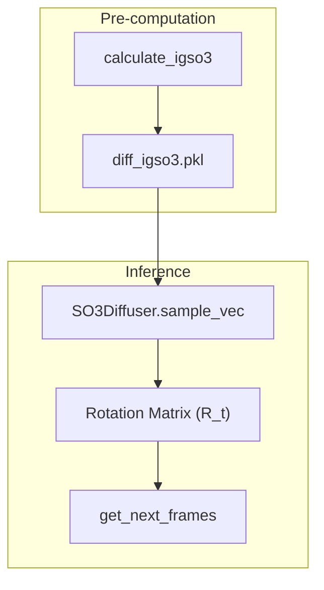

# Diffusion Process: Diffuser, Denoiser & IGSO3 Utilities

> **Relevant source files**
> - [idpforge/utils/diff\_utils\.py](https://github.com/THGLab/IDPForge/blob/a12c2846/idpforge/utils/diff_utils.py)
> - [idpforge/utils/igso3\_utils\.py](https://github.com/THGLab/IDPForge/blob/a12c2846/idpforge/utils/igso3_utils.py)
> - [idpforge/utils/pre\_relax\.py](https://github.com/THGLab/IDPForge/blob/a12c2846/idpforge/utils/pre_relax.py)

 This page details the diffusion framework within IDPForge, covering the mathematical schedules for Euclidean and torsional noise, the implementation of SO\(3\) rotational diffusion for protein backbones, and the mechanics of the reverse diffusion sampling loop\.

## Overview of the Diffusion Framework

 IDPForge utilizes a diffusion probabilistic model to generate protein ensembles\. The process involves two primary components:

 1. **Forward Diffusion**: Gradually adding noise to protein structures \(coordinates and rotations\) according to predefined schedules\.
2. **Reverse Diffusion \(Denosing\)**: Using the neural network to predict the clean structure \($x\_0$\) from a noisy structure \($x\_t$\), then stepping back to $x\_\{t\-1\}$\.

### System Entity Map

 The following diagram maps the conceptual diffusion steps to the specific classes and functions implemented in the codebase\.

 "Entity Mapping: Diffusion Logic to Code"

  **Sources:** [diff\_utils\.py L1-L185](https://github.com/THGLab/IDPForge/blob/a12c2846/idpforge/utils/diff_utils.py#L1-L185) [model\.py L1-L100](https://github.com/THGLab/IDPForge/blob/a12c2846/idpforge/model.py#L1-L100)

---

## Noise Schedules and Beta Calculations

 IDPForge supports linear schedules for the variance of the noise added at each timestep\.

 - **Linear Beta Schedule**: Computes a sequence of $\\beta$ values from $\\beta\_0$ to $\\beta\_T$\. The values are scaled by the number of steps to maintain consistency across different sampling lengths [diff\_utils\.py L56-L61](https://github.com/THGLab/IDPForge/blob/a12c2846/idpforge/utils/diff_utils.py#L56-L61)
- **Alphabar \($\\bar\{\\alpha\}$\)**: Represents the cumulative product of $\(1 \- \\beta\_t\)$, determining the total amount of noise at time $t$\.
- **Coordinate Scaling**: Coordinates are typically scaled by a factor \(e\.g\., `crd_scale=0.25`\) during diffusion to normalize the variance [diff\_utils\.py L187](https://github.com/THGLab/IDPForge/blob/a12c2846/idpforge/utils/diff_utils.py#L187-L187)

 **Sources:** [diff\_utils\.py L56-L96](https://github.com/THGLab/IDPForge/blob/a12c2846/idpforge/utils/diff_utils.py#L56-L96)

---

## IGSO3 Rotational Diffusion

 For backbone orientations, IDPForge uses the **Isotropic Gaussian on SO\(3\)** \(IGSO3\) distribution\. This allows for principled diffusion on the manifold of rotation matrices rather than in Euclidean space\.

### Key Utilities

 - **Exp/Log Maps**: Functions to map between the Lie algebra $\\mathfrak\{so\}\(3\)$ \(rotation vectors\) and the Lie group $SO\(3\)$ \(rotation matrices\) [igso3\_utils\.py L27-L40](https://github.com/THGLab/IDPForge/blob/a12c2846/idpforge/utils/igso3_utils.py#L27-L40)
- **Numerical Approximation**: Since the IGSO3 density involves an infinite sum, `f_igso3` provides a truncated power series approximation [igso3\_utils\.py L42-L64](https://github.com/THGLab/IDPForge/blob/a12c2846/idpforge/utils/igso3_utils.py#L42-L64)
- **Pre\-computation**: `calculate_igso3` discretizes the $\\sigma$ and $\\omega$ \(angle\) spaces to pre\-compute CDFs and score norms, which are stored in `diff_igso3.pkl` for fast lookup during sampling [igso3\_utils\.py L88-L132](https://github.com/THGLab/IDPForge/blob/a12c2846/idpforge/utils/igso3_utils.py#L88-L132)

 "Data Flow: SO\(3\) Sampling"

 **Sources:** [igso3\_utils\.py L1-L132](https://github.com/THGLab/IDPForge/blob/a12c2846/idpforge/utils/igso3_utils.py#L1-L132) [diff\_utils\.py L126-L161](https://github.com/THGLab/IDPForge/blob/a12c2846/idpforge/utils/diff_utils.py#L126-L161)

---

## Reverse Diffusion Sampling Loop

 The sampling process iteratively refines a structure from pure noise \($t=T$\) to a folded ensemble \($t=0$\)\.

### 1\. Initialization

 The process starts at `init_sample`, which places residues at the origin and applies random translations and IGSO3\-sampled rotations [diff\_utils\.py L187-L196](https://github.com/THGLab/IDPForge/blob/a12c2846/idpforge/utils/diff_utils.py#L187-L196)

### 2\. Denoising Steps

 At each step $t$, the model predicts $x\_0$\. The following functions then calculate $x\_\{t\-1\}$:

 - **`get_next_ca`**: Updates $C\\alpha$ positions using the Gaussian posterior mean $\\mu$ and variance $\\sigma$ [diff\_utils\.py L98-L125](https://github.com/THGLab/IDPForge/blob/a12c2846/idpforge/utils/diff_utils.py#L98-L125)
- **`get_next_frames`**: Updates residue orientations\. It converts coordinates to rigid frames using `rigid_from_3_points_np`, calculates the rotation transition via the `SO3Diffuser`, and applies it to the backbone atoms [diff\_utils\.py L126-L161](https://github.com/THGLab/IDPForge/blob/a12c2846/idpforge/utils/diff_utils.py#L126-L161)
- **`get_next_chi_angles`**: Diffuses sidechain torsion angles \($\\chi$\) while ensuring they stay within the $\[\-\\pi, \\pi\]$ range using `wrap_rad` [diff\_utils\.py L162-L185](https://github.com/THGLab/IDPForge/blob/a12c2846/idpforge/utils/diff_utils.py#L162-L185)

### 3\. Alignment \(Kabsch\)

 To prevent the protein from drifting during diffusion, `align_coords` uses the Kabsch algorithm to align the predicted $C\\alpha$ coordinates to a reference \(usually the current noisy state\), ensuring the center of mass and orientation are consistent [diff\_utils\.py L25-L54](https://github.com/THGLab/IDPForge/blob/a12c2846/idpforge/utils/diff_utils.py#L25-L54)

### 4\. Continuity Screening

 Before AMBER relaxation, the system performs a "pre\-relax" check\. `check_backbone_continuity` calculates $C\\alpha\-C\\alpha$ distances\. If the distance exceeds thresholds \(e\.g\., $9\.12\\text\{\\AA\}$ for backbone or $6\.46\\text\{\\AA\}$ for junctions\), the sample may be flagged as physically unrealistic [pre\_relax\.py L10-L29](https://github.com/THGLab/IDPForge/blob/a12c2846/idpforge/utils/pre_relax.py#L10-L29)

| Parameter | Threshold \($\\text\{\\AA\}$\) | Source |
| --- | --- | --- |
| \_JUNCTION\_CA\_THRESHOLD | 6\.46 | idpforge/utils/pre\_relax\.py6 |
| \_BACKBONE\_CA\_THRESHOLD | 9\.12 | idpforge/utils/pre\_relax\.py7 |

 **Sources:** [diff\_utils\.py L25-L196](https://github.com/THGLab/IDPForge/blob/a12c2846/idpforge/utils/diff_utils.py#L25-L196) [pre\_relax\.py L1-L29](https://github.com/THGLab/IDPForge/blob/a12c2846/idpforge/utils/pre_relax.py#L1-L29)
