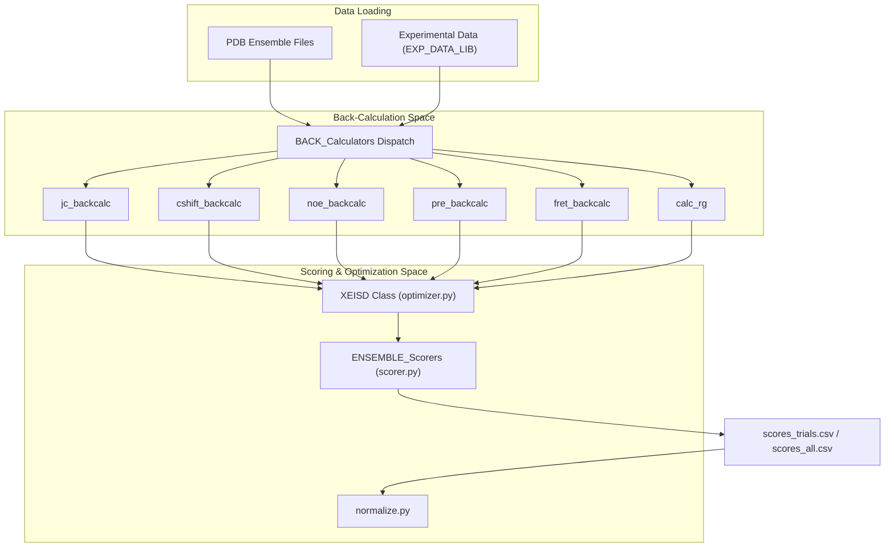
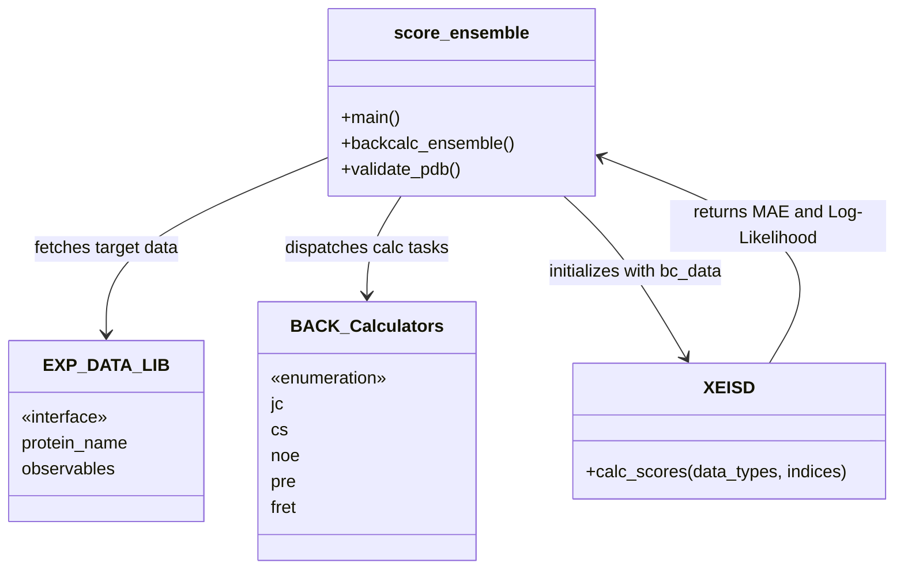

# Ensemble Scoring (X-EISD)

> **Relevant source files**
> * [score_ensemble.py](https://github.com/THGLab/IDPForge/blob/a12c2846/score_ensemble.py)
> * [scoring/__init__.py](https://github.com/THGLab/IDPForge/blob/a12c2846/scoring/__init__.py)

The **X-EISD (Experimental Ensemble Inference from Structural Data)** system in IDPForge provides a rigorous framework for evaluating the quality of generated structural ensembles against experimental observables. It utilizes a Bayesian approach to calculate the log-likelihood of an ensemble given experimental data, accounting for both experimental uncertainty and back-calculation errors.

The scoring pipeline involves three main stages: back-calculating observables from PDB structures, optimizing the ensemble weights (or calculating scores for uniform weights), and normalizing these scores to facilitate cross-method benchmarks.

### Architecture Overview

The scoring system is centered around the `score_ensemble.py` entrypoint, which orchestrates the data flow between calculators, parsers, and the X-EISD optimizer.

#### Logic Flow Diagram

This diagram maps the natural language scoring process to the specific code entities responsible for each step.

**Sources:** [score_ensemble.py L20-L23](https://github.com/THGLab/IDPForge/blob/a12c2846/score_ensemble.py#L20-L23)

 [score_ensemble.py L34-L36](https://github.com/THGLab/IDPForge/blob/a12c2846/score_ensemble.py#L34-L36)

 [score_ensemble.py L76-L77](https://github.com/THGLab/IDPForge/blob/a12c2846/score_ensemble.py#L76-L77)

---

### Back-Calculation of Experimental Observables

Before an ensemble can be scored, the physical observables measured in experiments (such as NMR chemical shifts or FRET efficiencies) must be predicted from the 3D coordinates of each conformer.

* **Supported Observables:** The system supports J-couplings, Chemical Shifts (via CSpred/UCBShift), NOE distances, PRE distances, smFRET efficiency, and Radius of Gyration (Rg).
* **Dispatch System:** The `BACK_Calculators` dictionary in `scoring/calculator.py` maps data type keys to their respective back-calculation functions.
* **Caching:** To handle computationally expensive operations (like chemical shift prediction), the system implements a caching mechanism that saves results to `_cache.csv` files.

For details on specific calculators and hydrogen substitution logic, see **[Back-Calculation of Experimental Observables](/THGLab/IDPForge/6.1-back-calculation-of-experimental-observables)**.

**Sources:** [score_ensemble.py L21](https://github.com/THGLab/IDPForge/blob/a12c2846/score_ensemble.py#L21-L21)

 [score_ensemble.py L34-L36](https://github.com/THGLab/IDPForge/blob/a12c2846/score_ensemble.py#L34-L36)

 [score_ensemble.py L69-L74](https://github.com/THGLab/IDPForge/blob/a12c2846/score_ensemble.py#L69-L74)

---

### X-EISD Scoring & Optimization

The core scoring logic uses the X-EISD framework to determine how well the ensemble represents the experimental state.

* **Log-Likelihood:** The `XEISD` class calculates log-likelihood scores for different experimental properties, allowing for a statistically sound comparison between models.
* **Trial-Based Validation:** By default, `score_ensemble.py` performs 30 trials of 100-conformer random subsamples. This provides a mean and standard deviation for scores, ensuring that the results are not biased by a single lucky subsample.
* **Metrics:** The system reports both Mean Absolute Error (MAE) and X-EISD scores (log-likelihood) per property.

For details on the scoring math, the `XEISD` class, and optimization routines, see **[X-EISD Scoring, Optimization & Normalization](/THGLab/IDPForge/6.2-x-eisd-scoring-optimization-and-normalization)**.

**Sources:** [score_ensemble.py L4-L10](https://github.com/THGLab/IDPForge/blob/a12c2846/score_ensemble.py#L4-L10)

 [score_ensemble.py L76-L77](https://github.com/THGLab/IDPForge/blob/a12c2846/score_ensemble.py#L76-L77)

 [score_ensemble.py L88-L102](https://github.com/THGLab/IDPForge/blob/a12c2846/score_ensemble.py#L88-L102)

---

### Execution Modes

The `score_ensemble.py` CLI provides several modes of operation to support different research workflows:

| Mode | Flag | Description | Output |
| --- | --- | --- | --- |
| **Benchmark** | (default) | 30 trials of 100 random conformers. | `scores_trials.csv` |
| **Full Ensemble** | `--all` | Scores every conformer in the directory in a single pass. | `scores_all.csv` |
| **Rg Only** | `--rg` | Computes mass-weighted, all-atom Rg for proteins without NMR data. | `rg_trials.csv` |
| **Normalization** | `--normalize` | Aggregates per-protein CSVs into a cross-method benchmark table. | `output/` tables |

**Sources:** [score_ensemble.py L3-L11](https://github.com/THGLab/IDPForge/blob/a12c2846/score_ensemble.py#L3-L11)

 [score_ensemble.py L113-L146](https://github.com/THGLab/IDPForge/blob/a12c2846/score_ensemble.py#L113-L146)

### Data Entity Relationship

This diagram shows how the `score_ensemble.py` script interacts with the underlying classes to produce final metrics.

**Sources:** [score_ensemble.py L20-L22](https://github.com/THGLab/IDPForge/blob/a12c2846/score_ensemble.py#L20-L22)

 [score_ensemble.py L40-L42](https://github.com/THGLab/IDPForge/blob/a12c2846/score_ensemble.py#L40-L42)

 [score_ensemble.py L76-L90](https://github.com/THGLab/IDPForge/blob/a12c2846/score_ensemble.py#L76-L90)